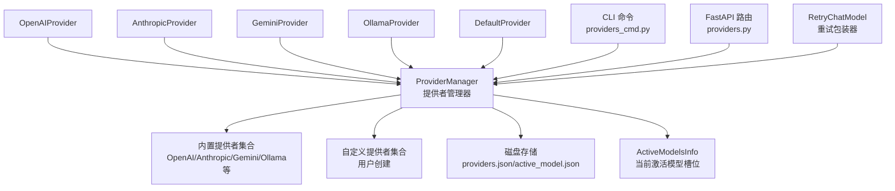
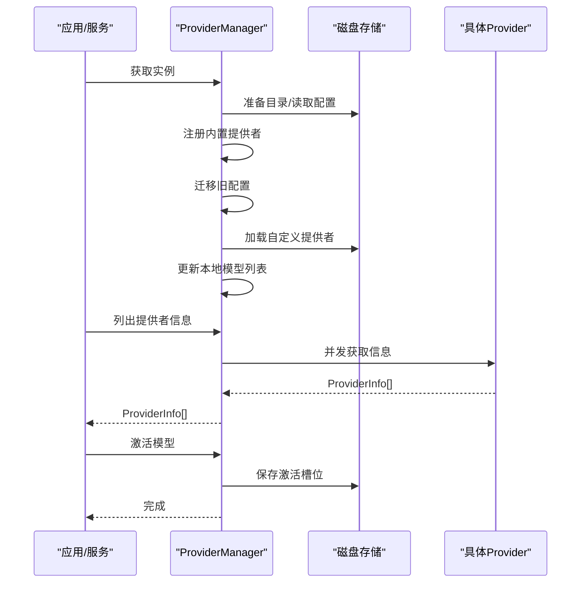
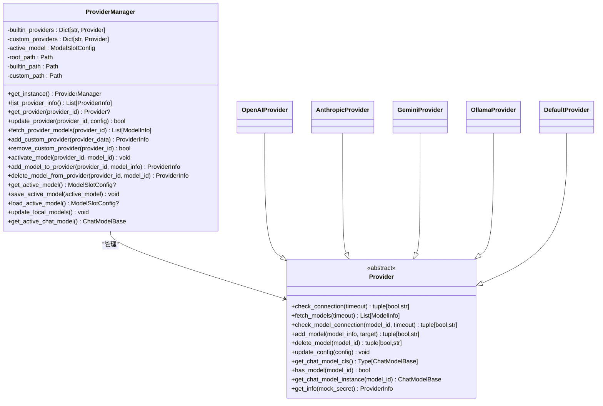
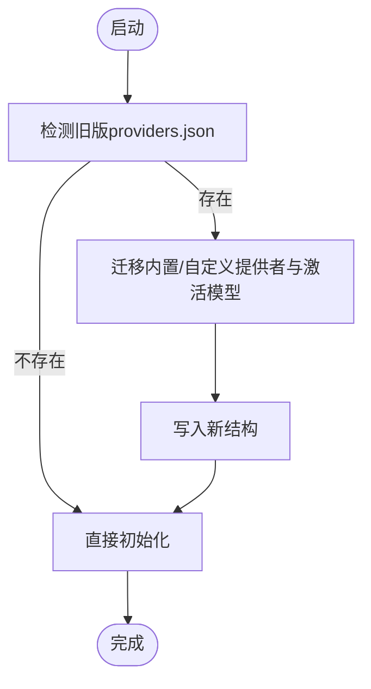
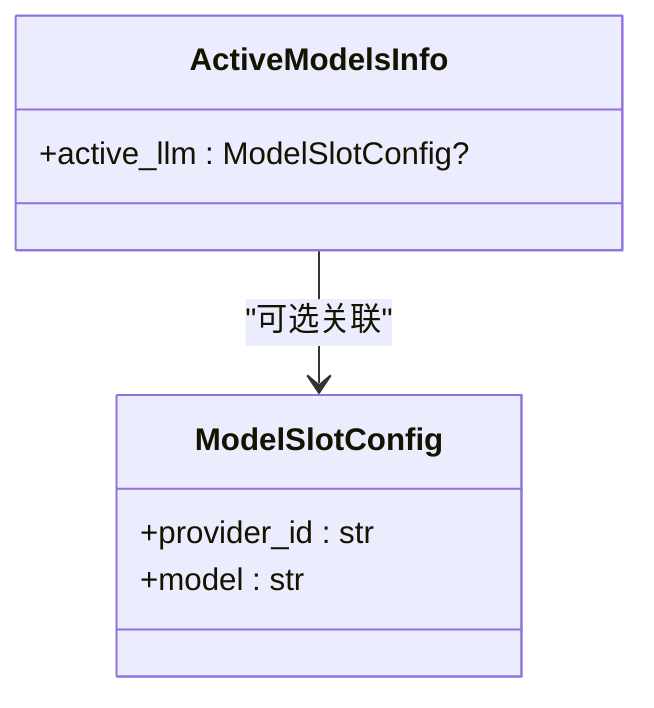
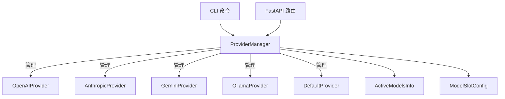

# 提供者管理器

<cite>
**本文档引用的文件**
- [provider_manager.py](file://src/copaw/providers/provider_manager.py)
- [provider.py](file://src/copaw/providers/provider.py)
- [models.py](file://src/copaw/providers/models.py)
- [openai_provider.py](file://src/copaw/providers/openai_provider.py)
- [anthropic_provider.py](file://src/copaw/providers/anthropic_provider.py)
- [gemini_provider.py](file://src/copaw/providers/gemini_provider.py)
- [ollama_provider.py](file://src/copaw/providers/ollama_provider.py)
- [providers_cmd.py](file://src/copaw/cli/providers_cmd.py)
- [providers.py](file://src/copaw/app/routers/providers.py)
- [retry_chat_model.py](file://src/copaw/providers/retry_chat_model.py)
- [test_provider_manager.py](file://tests/unit/providers/test_provider_manager.py)
</cite>

## 目录
1. [简介](#简介)
2. [项目结构](#项目结构)
3. [核心组件](#核心组件)
4. [架构总览](#架构总览)
5. [详细组件分析](#详细组件分析)
6. [依赖关系分析](#依赖关系分析)
7. [性能考虑](#性能考虑)
8. [故障排查指南](#故障排查指南)
9. [结论](#结论)
10. [附录](#附录)

## 简介
本文件面向CoPaw的提供者管理器（ProviderManager），系统性阐述其架构设计、实现细节与使用方法。重点覆盖：
- 单例模式实现与实例获取
- 内置提供者与自定义提供者的注册与动态加载
- 配置持久化、冲突解决与迁移机制
- 异步操作、错误处理与性能优化
- 提供者信息获取、模型发现与连接检查
- ActiveModelsInfo的设计与使用场景

## 项目结构
围绕提供者管理器的相关代码主要位于src/copaw/providers目录，配合CLI与API路由实现完整的提供者生命周期管理。

图表来源
- [provider_manager.py:288-717](file://src/copaw/providers/provider_manager.py#L288-L717)
- [openai_provider.py:18-157](file://src/copaw/providers/openai_provider.py#L18-L157)
- [anthropic_provider.py:18-156](file://src/copaw/providers/anthropic_provider.py#L18-L156)
- [gemini_provider.py:17-131](file://src/copaw/providers/gemini_provider.py#L17-L131)
- [ollama_provider.py:19-179](file://src/copaw/providers/ollama_provider.py#L19-L179)
- [providers_cmd.py:16-800](file://src/copaw/cli/providers_cmd.py#L16-L800)
- [providers.py:31-437](file://src/copaw/app/routers/providers.py#L31-L437)
- [retry_chat_model.py:82-204](file://src/copaw/providers/retry_chat_model.py#L82-L204)

章节来源
- [provider_manager.py:288-717](file://src/copaw/providers/provider_manager.py#L288-L717)

## 核心组件
- ProviderManager：提供者管理器，负责内置与自定义提供者的统一管理、持久化、迁移与激活模型管理。
- Provider抽象类及其实现：定义通用接口并提供不同提供商的具体实现（OpenAI、Anthropic、Gemini、Ollama、Default）。
- 数据模型：ProviderInfo、ModelInfo、ModelSlotConfig、ActiveModelsInfo等，用于序列化与API交互。
- CLI与API路由：提供者配置、模型发现、连接测试、激活模型等操作的入口。
- RetryChatModel：对聊天模型调用进行透明重试包装，提升稳定性。

章节来源
- [provider.py:73-231](file://src/copaw/providers/provider.py#L73-L231)
- [models.py:11-81](file://src/copaw/providers/models.py#L11-L81)
- [provider_manager.py:288-717](file://src/copaw/providers/provider_manager.py#L288-L717)

## 架构总览
ProviderManager采用单例模式，初始化时准备磁盘存储目录、注册内置提供者、迁移旧格式配置、从磁盘恢复状态，并更新本地模型列表。它通过异步方法支持并发模型发现与连接检查，并在UI或API层暴露统一的管理接口。

图表来源
- [provider_manager.py:288-717](file://src/copaw/providers/provider_manager.py#L288-L717)
- [providers.py:84-121](file://src/copaw/app/routers/providers.py#L84-L121)

## 详细组件分析

### ProviderManager：单例、注册与持久化
- 单例实现：通过静态变量缓存实例，避免重复初始化。
- 初始化流程：
  - 准备磁盘目录（权限限制）
  - 注册内置提供者（OpenAI、Azure OpenAI、DashScope、ModelScope、Minimax、Kimi、DeepSeek、Anthropic、Gemini、Ollama、LM Studio、llama.cpp、MLX）
  - 尝试迁移旧版providers.json
  - 从磁盘加载自定义提供者与激活模型
  - 更新本地模型列表（llama.cpp、MLX）
- 提供者管理：
  - 添加/删除自定义提供者
  - 更新提供者配置（base_url、api_key、chat_model、generate_kwargs）
  - 模型发现与增删
  - 激活模型槽位（全局/代理特定）
- 存储策略：
  - 内置提供者配置写入builtin目录
  - 自定义提供者配置写入custom目录
  - 激活模型写入根目录active_model.json

图表来源
- [provider_manager.py:288-717](file://src/copaw/providers/provider_manager.py#L288-L717)
- [provider.py:73-231](file://src/copaw/providers/provider.py#L73-L231)
- [openai_provider.py:18-157](file://src/copaw/providers/openai_provider.py#L18-L157)
- [anthropic_provider.py:18-156](file://src/copaw/providers/anthropic_provider.py#L18-L156)
- [gemini_provider.py:17-131](file://src/copaw/providers/gemini_provider.py#L17-L131)
- [ollama_provider.py:19-179](file://src/copaw/providers/ollama_provider.py#L19-L179)

章节来源
- [provider_manager.py:288-717](file://src/copaw/providers/provider_manager.py#L288-L717)

### 冲突解决与迁移机制
- 自定义提供者ID冲突解析：若与内置提供者冲突，自动追加后缀；若仍冲突，继续追加“-new”直到唯一。
- 旧版配置迁移：从providers.json迁移至新的分层存储（builtin/custom），保留api_key、extra_models、base_url（非freeze_url）与generate_kwargs，并持久化active_model。
- 启动时自动执行迁移，失败仅记录警告，不影响启动。

图表来源
- [provider_manager.py:582-647](file://src/copaw/providers/provider_manager.py#L582-L647)
- [provider_manager.py:648-669](file://src/copaw/providers/provider_manager.py#L648-L669)

章节来源
- [provider_manager.py:582-669](file://src/copaw/providers/provider_manager.py#L582-L669)
- [test_provider_manager.py:188-226](file://tests/unit/providers/test_provider_manager.py#L188-L226)

### 配置持久化与安全
- 文件权限：创建目录后设置严格权限（0700/0600），降低敏感配置泄露风险。
- 持久化位置：内置提供者配置写入builtin目录，自定义提供者写入custom目录，激活模型写入根目录active_model.json。
- 序列化：ProviderInfo与ModelSlotConfig均基于Pydantic，确保类型安全与跨语言兼容。

章节来源
- [provider_manager.py:312-319](file://src/copaw/providers/provider_manager.py#L312-L319)
- [provider_manager.py:499-516](file://src/copaw/providers/provider_manager.py#L499-L516)
- [provider_manager.py:555-568](file://src/copaw/providers/provider_manager.py#L555-L568)

### 异步操作与并发
- 列表提供者信息：并发获取每个ProviderInfo，显著提升响应速度。
- 模型发现：按提供者异步拉取可用模型列表，失败时返回空列表并记录警告。
- 连接检查：对单个提供者或指定模型进行异步连通性验证。

章节来源
- [provider_manager.py:342-350](file://src/copaw/providers/provider_manager.py#L342-L350)
- [provider_manager.py:384-406](file://src/copaw/providers/provider_manager.py#L384-L406)

### 错误处理与健壮性
- 加载失败：磁盘加载异常仅记录警告并返回None，避免中断启动。
- 迁移失败：仅记录警告，不阻断后续流程。
- 模型发现/连接异常：捕获API异常并返回默认值或错误消息。
- CLI/API层：对未知提供者/模型抛出HTTP 404/400，前端友好提示。

章节来源
- [provider_manager.py:531-538](file://src/copaw/providers/provider_manager.py#L531-L538)
- [provider_manager.py:600-646](file://src/copaw/providers/provider_manager.py#L600-L646)
- [providers.py:110-121](file://src/copaw/app/routers/providers.py#L110-L121)
- [providers.py:266-271](file://src/copaw/app/routers/providers.py#L266-L271)

### 使用示例与最佳实践

#### 添加自定义提供者
- CLI方式：通过“copaw models add-provider”创建自定义提供者，随后“copaw models config-key”配置密钥。
- API方式：POST /models/custom-providers，Body包含id/name/default_base_url/api_key_prefix/chat_model/models。
- 冲突解决：若id与内置冲突，自动追加“-custom/-new”直至唯一。

章节来源
- [providers_cmd.py:492-533](file://src/copaw/cli/providers_cmd.py#L492-L533)
- [providers.py:124-148](file://src/copaw/app/routers/providers.py#L124-L148)
- [provider_manager.py:423-439](file://src/copaw/providers/provider_manager.py#L423-L439)

#### 删除自定义提供者
- CLI：copaw models remove-provider，确认后删除对应JSON文件。
- API：DELETE /models/custom-providers/{provider_id}。
- 注意：内置提供者不可删除。

章节来源
- [providers_cmd.py:535-563](file://src/copaw/cli/providers_cmd.py#L535-L563)
- [providers.py:302-317](file://src/copaw/app/routers/providers.py#L302-L317)
- [provider_manager.py:441-450](file://src/copaw/providers/provider_manager.py#L441-L450)

#### 更新提供者配置
- CLI：copaw models config-key，支持交互式输入base_url与api_key。
- API：PUT /models/{provider_id}/config，Body可选包含api_key/base_url/chat_model/generate_kwargs。
- 内置提供者：当freeze_url为False时，base_url可被用户覆盖；否则保持内置默认。

章节来源
- [providers_cmd.py:95-177](file://src/copaw/cli/providers_cmd.py#L95-L177)
- [providers.py:90-121](file://src/copaw/app/routers/providers.py#L90-L121)
- [provider_manager.py:369-382](file://src/copaw/providers/provider_manager.py#L369-L382)

#### 激活模型与获取当前模型
- CLI：copaw models set-llm，选择provider与model后持久化到active_model.json。
- API：GET /models/active 返回ActiveModelsInfo；PUT /models/active 设置当前激活模型。
- 代理特定：API会优先读取代理配置中的active_model，回退到全局。

章节来源
- [providers_cmd.py:284-368](file://src/copaw/cli/providers_cmd.py#L284-L368)
- [providers.py:361-436](file://src/copaw/app/routers/providers.py#L361-L436)
- [provider_manager.py:452-467](file://src/copaw/providers/provider_manager.py#L452-L467)

#### 模型发现与连接测试
- 模型发现：POST /models/{provider_id}/discover，支持临时覆盖api_key/base_url/chat_model。
- 连接测试：POST /models/{provider_id}/test 测试提供者URL与密钥；POST /models/{provider_id}/models/test 测试指定模型。
- Ollama：模型发现即拉取模型，删除通过Ollama客户端执行。

章节来源
- [providers.py:206-271](file://src/copaw/app/routers/providers.py#L206-L271)
- [openai_provider.py:66-76](file://src/copaw/providers/openai_provider.py#L66-L76)
- [anthropic_provider.py:71-76](file://src/copaw/providers/anthropic_provider.py#L71-L76)
- [gemini_provider.py:78-90](file://src/copaw/providers/gemini_provider.py#L78-L90)
- [ollama_provider.py:85-94](file://src/copaw/providers/ollama_provider.py#L85-L94)

### ActiveModelsInfo的设计与使用
- 设计目的：统一表示“当前激活的模型槽位”，支持全局与代理特定两种来源。
- 结构：包含一个可选的ModelSlotConfig（provider_id与model）。
- 使用场景：
  - 全局激活：ProviderManager.get_active_model()返回全局槽位。
  - 代理特定：API路由优先读取代理配置，未设置则回退全局。
  - 生成模型实例：ProviderManager.get_active_chat_model()根据激活槽位创建实际的ChatModelBase实例（本地模型走本地工厂，远程模型走Provider.get_chat_model_instance）。

图表来源
- [models.py:74-81](file://src/copaw/providers/models.py#L74-L81)
- [provider_manager.py:284-286](file://src/copaw/providers/provider_manager.py#L284-L286)
- [provider_manager.py:699-716](file://src/copaw/providers/provider_manager.py#L699-L716)

章节来源
- [models.py:74-81](file://src/copaw/providers/models.py#L74-L81)
- [provider_manager.py:284-286](file://src/copaw/providers/provider_manager.py#L284-L286)
- [provider_manager.py:699-716](file://src/copaw/providers/provider_manager.py#L699-L716)

### Provider抽象与具体实现
- Provider抽象类定义统一接口：连接检查、模型发现、模型连接检查、模型增删、配置更新、模型实例获取、信息导出。
- DefaultProvider：本地无操作实现，用于本地模型槽位占位。
- OpenAIProvider：兼容OpenAI及其兼容端点，支持DashScope Aliyun等。
- AnthropicProvider：Anthropic API，支持模型列表与连接检查。
- GeminiProvider：Google Gemini API，支持异步模型列表与内容流式生成。
- OllamaProvider：本地Ollama平台，支持模型拉取/删除与OpenAI兼容端点。

章节来源
- [provider.py:73-231](file://src/copaw/providers/provider.py#L73-L231)
- [openai_provider.py:18-157](file://src/copaw/providers/openai_provider.py#L18-L157)
- [anthropic_provider.py:18-156](file://src/copaw/providers/anthropic_provider.py#L18-L156)
- [gemini_provider.py:17-131](file://src/copaw/providers/gemini_provider.py#L17-L131)
- [ollama_provider.py:19-179](file://src/copaw/providers/ollama_provider.py#L19-L179)

### 重试包装器（RetryChatModel）
- 作用：对ChatModelBase调用进行透明重试，支持指数退避与流式重试。
- 触发条件：针对速率限制、超时、连接错误等可重试异常，以及常见HTTP状态码。
- 配置：通过环境变量控制最大重试次数、基础退避时间与上限。

章节来源
- [retry_chat_model.py:82-204](file://src/copaw/providers/retry_chat_model.py#L82-L204)

## 依赖关系分析
ProviderManager与各Provider之间为组合关系，ProviderManager持有Provider实例并负责其生命周期管理；CLI与API路由作为外部入口调用ProviderManager；ActiveModelsInfo作为数据契约贯穿全局与代理配置。

图表来源
- [provider_manager.py:288-717](file://src/copaw/providers/provider_manager.py#L288-L717)
- [providers.py:31-437](file://src/copaw/app/routers/providers.py#L31-L437)
- [providers_cmd.py:16-800](file://src/copaw/cli/providers_cmd.py#L16-L800)

章节来源
- [provider_manager.py:288-717](file://src/copaw/providers/provider_manager.py#L288-L717)

## 性能考虑
- 异步并发：list_provider_info并发获取ProviderInfo，fetch_provider_models并发拉取模型，显著降低等待时间。
- 缓存与懒加载：内置提供者在内存中常驻，自定义提供者按需加载；本地模型列表通过本地模型管理器动态刷新。
- I/O最小化：磁盘读写集中在启动阶段与变更操作，运行期尽量减少频繁IO。
- 重试策略：RetryChatModel在可控范围内重试，避免瞬时错误导致请求失败。

[本节为通用指导，无需特定文件引用]

## 故障排查指南
- 提供者无法连接：
  - 使用“/models/{provider_id}/test”或CLI命令进行连接测试，检查base_url与api_key。
  - 对于DashScope Aliyun端点，注意特殊头部注入逻辑。
- 模型不可用：
  - 使用“/models/{provider_id}/discover”发现可用模型，或在CLI中交互式添加模型。
  - 对于Ollama，使用Ollama客户端拉取/删除模型。
- 激活模型失败：
  - 确认provider_id与model_id存在且匹配；查看全局或代理特定的active_model配置。
- 迁移失败：
  - 检查旧版providers.json格式是否正确；查看日志中的警告信息。
- 权限问题：
  - 确认providers目录与文件权限为0700/0600；避免被其他用户读取。

章节来源
- [providers.py:206-271](file://src/copaw/app/routers/providers.py#L206-L271)
- [providers_cmd.py:95-177](file://src/copaw/cli/providers_cmd.py#L95-L177)
- [provider_manager.py:582-647](file://src/copaw/providers/provider_manager.py#L582-L647)

## 结论
ProviderManager通过单例模式、完善的持久化与迁移机制、异步并发与健壮的错误处理，构建了灵活而稳定的提供者管理体系。结合CLI与API路由，用户可以便捷地管理内置与自定义提供者、模型发现与连接测试、以及激活模型槽位。ActiveModelsInfo的设计进一步统一了全局与代理特定的模型配置，便于在多代理场景下灵活切换与持久化。

[本节为总结性内容，无需特定文件引用]

## 附录

### 关键API与CLI命令速览
- 列出所有提供者：GET /models
- 配置提供者：PUT /models/{provider_id}/config
- 创建自定义提供者：POST /models/custom-providers
- 删除自定义提供者：DELETE /models/custom-providers/{provider_id}
- 发现模型：POST /models/{provider_id}/discover
- 测试提供者：POST /models/{provider_id}/test
- 测试模型：POST /models/{provider_id}/models/test
- 获取/设置激活模型：GET /models/active, PUT /models/active
- CLI命令：models list/config/config-key/set-llm/add-provider/remove-provider/add-model/remove-model

章节来源
- [providers.py:79-436](file://src/copaw/app/routers/providers.py#L79-L436)
- [providers_cmd.py:412-596](file://src/copaw/cli/providers_cmd.py#L412-L596)