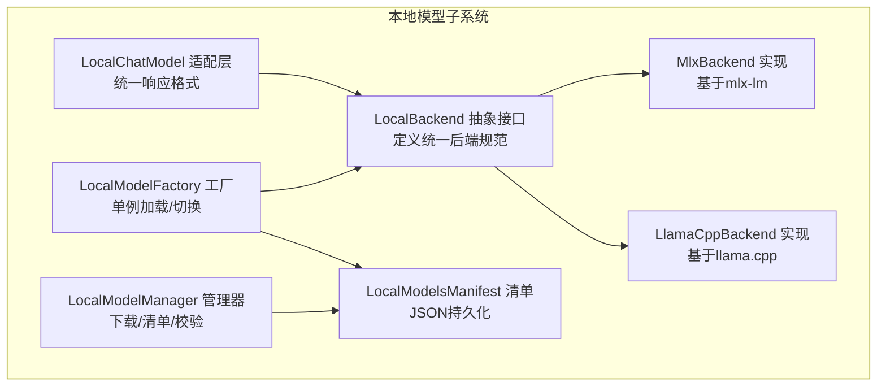
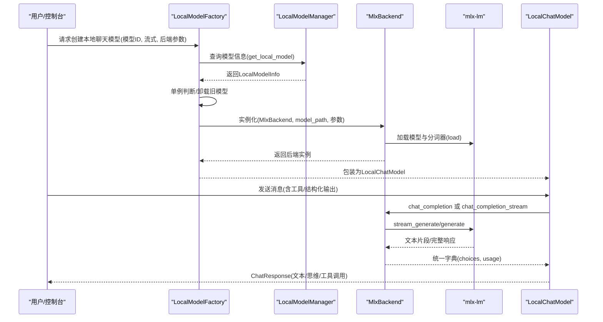
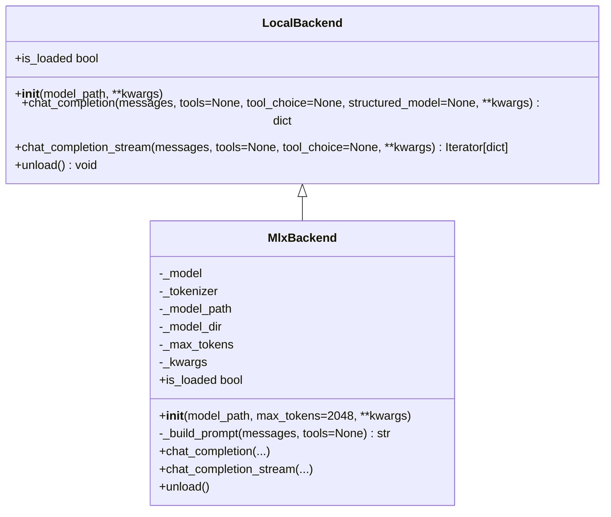
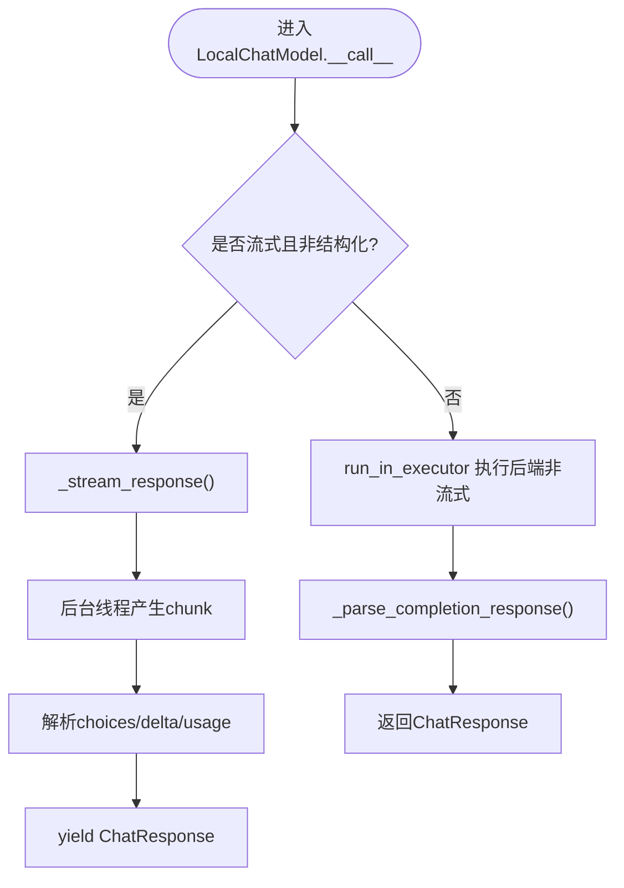
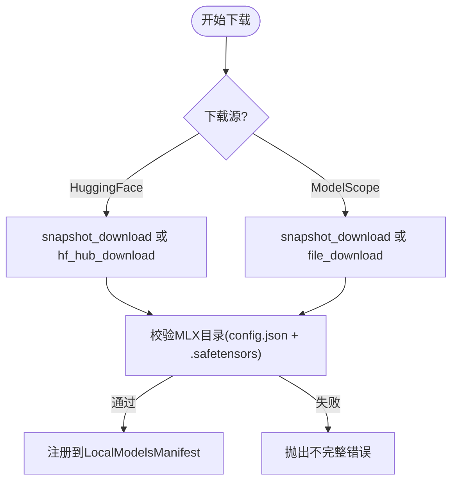
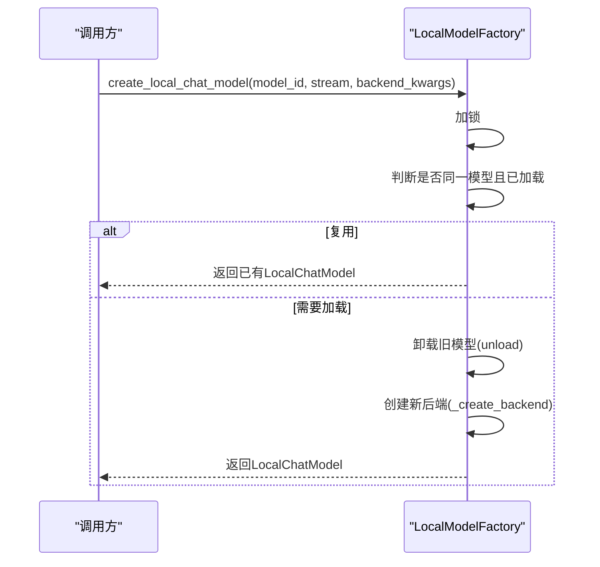
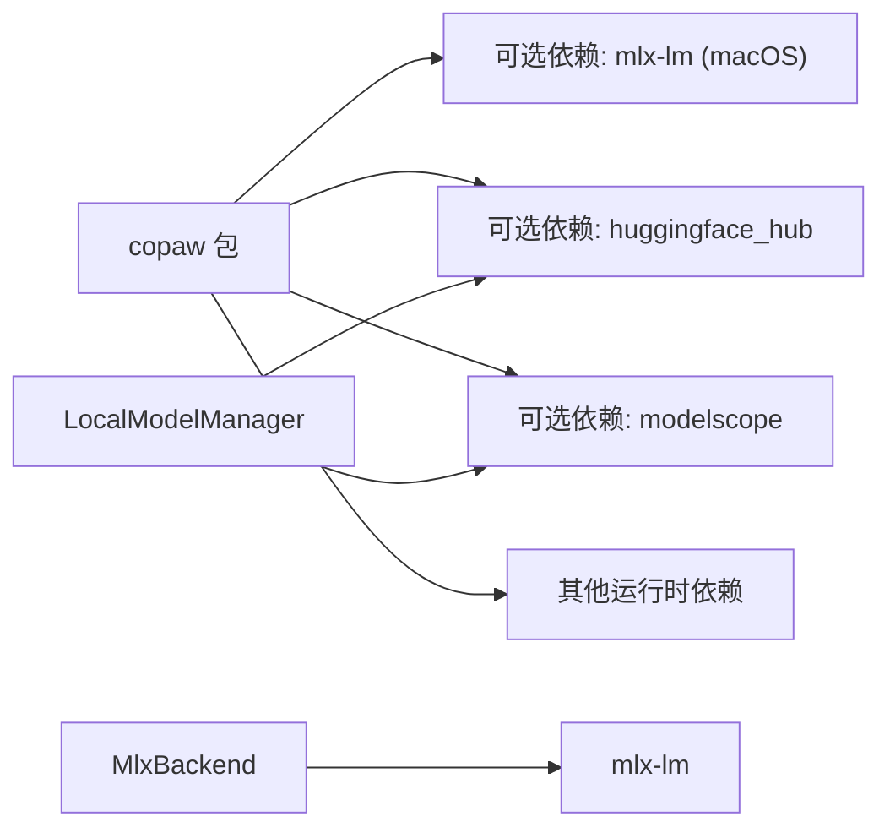

# MLX后端

<cite>
**本文引用的文件**
- [mlx_backend.py](file://src/copaw/local_models/backends/mlx_backend.py)
- [base.py](file://src/copaw/local_models/backends/base.py)
- [factory.py](file://src/copaw/local_models/factory.py)
- [chat_model.py](file://src/copaw/local_models/chat_model.py)
- [manager.py](file://src/copaw/local_models/manager.py)
- [schema.py](file://src/copaw/local_models/schema.py)
- [constant.py](file://src/copaw/constant.py)
- [pyproject.toml](file://pyproject.toml)
- [install.sh](file://scripts/install.sh)
- [install.ps1](file://scripts/install.ps1)
- [README.md](file://README.md)
- [desktop.en.md](file://website/public/docs/desktop.en.md)
</cite>

## 目录
1. [简介](#简介)
2. [项目结构](#项目结构)
3. [核心组件](#核心组件)
4. [架构总览](#架构总览)
5. [详细组件分析](#详细组件分析)
6. [依赖关系分析](#依赖关系分析)
7. [性能考虑](#性能考虑)
8. [故障排除指南](#故障排除指南)
9. [结论](#结论)
10. [附录](#附录)

## 简介
本文件面向CoPaw的MLX后端，系统化阐述其架构设计、Apple Silicon优化原理与实现细节，覆盖以下主题：
- MLX后端如何基于mlx-lm加载与推理
- safetensors文件格式支持与目录式模型校验
- 原生Metal加速与内存管理机制
- 初始化流程、模型加载流程与Apple设备兼容性配置
- 安装与配置指南（Xcode工具链、Python环境、依赖）
- 模型验证机制、文件完整性检查与错误恢复策略
- 性能调优、内存监控与故障排除

## 项目结构
CoPaw的本地模型子系统采用“抽象接口 + 后端实现 + 工厂 + 管理器”的分层设计：
- 抽象接口层：定义统一的本地推理后端规范
- 后端实现层：具体封装llama.cpp与MLX（mlx-lm）
- 工厂层：负责单例化加载与切换后端
- 管理器层：负责模型下载、清单管理与目录校验
- 聊天模型适配层：将后端输出转换为统一的响应格式

图示来源
- [base.py:12-64](file://src/copaw/local_models/backends/base.py#L12-L64)
- [mlx_backend.py:57-82](file://src/copaw/local_models/backends/mlx_backend.py#L57-L82)
- [factory.py:110-125](file://src/copaw/local_models/factory.py#L110-L125)
- [manager.py:94-123](file://src/copaw/local_models/manager.py#L94-L123)
- [schema.py:55-59](file://src/copaw/local_models/schema.py#L55-L59)

章节来源
- [base.py:12-64](file://src/copaw/local_models/backends/base.py#L12-L64)
- [factory.py:22-108](file://src/copaw/local_models/factory.py#L22-L108)
- [manager.py:94-123](file://src/copaw/local_models/manager.py#L94-L123)
- [schema.py:22-59](file://src/copaw/local_models/schema.py#L22-L59)

## 核心组件
- 抽象后端接口：定义构造函数、同步/异步推理、流式生成、卸载与加载状态等统一方法
- MlxBackend：封装mlx-lm，负责模型与分词器加载、提示构建、采样参数映射、流式/非流式生成
- LocalChatModel：将后端输出解析为统一的ChatResponse，支持思维块、工具调用块与文本块
- LocalModelManager：负责从HuggingFace/ModelScope下载模型，自动选择文件，目录完整性校验，注册到清单
- LocalModelFactory：单例化管理当前加载的后端实例，按需卸载与重用
- LocalModelsManifest：模型清单的序列化/反序列化

章节来源
- [base.py:12-64](file://src/copaw/local_models/backends/base.py#L12-L64)
- [mlx_backend.py:57-236](file://src/copaw/local_models/backends/mlx_backend.py#L57-L236)
- [chat_model.py:39-362](file://src/copaw/local_models/chat_model.py#L39-L362)
- [manager.py:94-413](file://src/copaw/local_models/manager.py#L94-L413)
- [factory.py:22-125](file://src/copaw/local_models/factory.py#L22-L125)
- [schema.py:22-59](file://src/copaw/local_models/schema.py#L22-L59)

## 架构总览
MLX后端在CoPaw中的位置与交互如下：

图示来源
- [factory.py:42-107](file://src/copaw/local_models/factory.py#L42-L107)
- [manager.py:63-76](file://src/copaw/local_models/manager.py#L63-L76)
- [mlx_backend.py:60-82](file://src/copaw/local_models/backends/mlx_backend.py#L60-L82)
- [chat_model.py:58-94](file://src/copaw/local_models/chat_model.py#L58-L94)

## 详细组件分析

### MlxBackend：MLX后端实现
- 依赖与导入：延迟导入mlx-lm，未安装时抛出明确异常，指引通过可选依赖安装
- 模型目录解析：支持传入文件路径或目录路径，MLX模型为目录式（包含safetensors与配置文件）
- 提示构建：使用分词器应用聊天模板，支持工具调用注入
- 采样参数映射：将温度、top_p、min_p、top_k等参数映射为mlx-lm的采样器
- 结构化输出：通过向提示追加JSON模式说明实现“结构化输出”能力
- 流式/非流式：统一返回choices与usage字段；流式在最终chunk附带usage

图示来源
- [base.py:12-64](file://src/copaw/local_models/backends/base.py#L12-L64)
- [mlx_backend.py:57-236](file://src/copaw/local_models/backends/mlx_backend.py#L57-L236)

章节来源
- [mlx_backend.py:57-236](file://src/copaw/local_models/backends/mlx_backend.py#L57-L236)

### LocalChatModel：统一响应适配
- 异步调用包装：将后端同步接口放入线程执行器以支持异步
- 流式响应：通过后台线程驱动后端流式迭代器，经队列传递至异步生成器
- 内容块解析：支持思维块、工具调用块与文本块，解析<think>与<tool_call>标签
- 使用统计：从后端响应提取prompt_tokens与completion_tokens，计算耗时

图示来源
- [chat_model.py:58-158](file://src/copaw/local_models/chat_model.py#L58-L158)
- [chat_model.py:259-362](file://src/copaw/local_models/chat_model.py#L259-L362)

章节来源
- [chat_model.py:39-362](file://src/copaw/local_models/chat_model.py#L39-L362)

### LocalModelManager：模型下载与校验
- 下载来源：支持HuggingFace与ModelScope；MLX模型强制拉取完整仓库快照
- 文件选择：MLX自动选择.safetensors文件作为入口，确保拉取完整目录
- 目录校验：要求存在config.json与至少一个.safetensors文件（排除隐藏/临时目录）
- 注册清单：记录模型ID、仓库名、文件大小、本地路径与显示名

图示来源
- [manager.py:125-185](file://src/copaw/local_models/manager.py#L125-L185)
- [manager.py:188-292](file://src/copaw/local_models/manager.py#L188-L292)
- [manager.py:332-361](file://src/copaw/local_models/manager.py#L332-L361)
- [manager.py:364-412](file://src/copaw/local_models/manager.py#L364-L412)

章节来源
- [manager.py:94-413](file://src/copaw/local_models/manager.py#L94-L413)
- [schema.py:22-59](file://src/copaw/local_models/schema.py#L22-L59)
- [constant.py:145-146](file://src/copaw/constant.py#L145-L146)

### LocalModelFactory：单例工厂
- 单例逻辑：全局持有当前后端实例与模型ID；相同模型复用，不同模型先卸载再加载
- 线程安全：使用锁保护活跃后端状态
- 后端选择：根据LocalModelInfo.backend类型选择对应实现

图示来源
- [factory.py:42-107](file://src/copaw/local_models/factory.py#L42-L107)
- [factory.py:110-125](file://src/copaw/local_models/factory.py#L110-L125)

章节来源
- [factory.py:17-40](file://src/copaw/local_models/factory.py#L17-L40)
- [factory.py:42-107](file://src/copaw/local_models/factory.py#L42-L107)
- [factory.py:110-125](file://src/copaw/local_models/factory.py#L110-L125)

### Apple Silicon优化与Metal加速
- 平台约束：MLX仅在macOS且Apple Silicon平台生效（由可选依赖条件限定）
- 加速原理：mlx-lm在Apple Silicon上利用Metal进行张量运算加速，减少CPU/GPU切换开销
- 内存管理：模型加载后由后端持有，通过unload释放显存/内存；LocalModelFactory单例避免重复占用

章节来源
- [pyproject.toml:80-81](file://pyproject.toml#L80-L81)
- [mlx_backend.py:66-82](file://src/copaw/local_models/backends/mlx_backend.py#L66-L82)
- [factory.py:32-40](file://src/copaw/local_models/factory.py#L32-L40)

## 依赖关系分析
- 可选依赖：MLX后端通过copaw[mlx]安装，限定在macOS平台
- 运行时依赖：mlx-lm负责模型加载与推理；分词器模板用于提示构建
- 下载依赖：HuggingFace Hub或ModelScope SDK用于模型下载与快照拉取

图示来源
- [pyproject.toml:78-81](file://pyproject.toml#L78-L81)
- [pyproject.toml:71-81](file://pyproject.toml#L71-L81)
- [mlx_backend.py:66-72](file://src/copaw/local_models/backends/mlx_backend.py#L66-L72)
- [manager.py:131-136](file://src/copaw/local_models/manager.py#L131-L136)
- [manager.py:199-223](file://src/copaw/local_models/manager.py#L199-L223)

章节来源
- [pyproject.toml:64-91](file://pyproject.toml#L64-L91)

## 性能考虑
- Metal加速：在Apple Silicon上启用MLX后端可显著提升推理速度，降低延迟
- 流式输出：优先使用流式生成，减少首字节延迟，改善用户体验
- 单例复用：通过LocalModelFactory避免重复加载，节省冷启动时间
- 目录完整性：确保.safetensors与config.json齐全，避免加载失败与重试开销
- 采样参数：合理设置温度、top_p等参数，平衡创造性与稳定性

## 故障排除指南
- 缺少mlx-lm：安装时未包含MLX可选依赖，导致导入失败。请使用pip安装copaw[mlx]或在脚本中指定extras
- 不完整的MLX模型目录：缺少config.json或.safetensors文件，需删除目录后重新下载
- 下载源问题：HuggingFace/ModelScope网络受限时，优先使用另一来源或代理
- 权限与签名：首次运行macOS应用可能因未签名被Gatekeeper拦截，按提示完成信任流程
- 卸载与清理：通过LocalModelManager删除模型文件与目录，并更新清单

章节来源
- [mlx_backend.py:66-72](file://src/copaw/local_models/backends/mlx_backend.py#L66-L72)
- [manager.py:332-361](file://src/copaw/local_models/manager.py#L332-L361)
- [README.md:254-268](file://README.md#L254-L268)
- [desktop.en.md:110-133](file://website/public/docs/desktop.en.md#L110-L133)

## 结论
CoPaw的MLX后端通过抽象接口与工厂模式实现了对mlx-lm的无缝集成，结合目录式模型与safetensors格式，确保了Apple Silicon平台上的高效推理与资源管理。配合严格的目录校验与流式输出机制，既保证了可靠性，又提升了用户体验。通过可选依赖与平台限定，系统在跨平台部署中保持了清晰的边界。

## 附录

### 安装与配置指南
- Python环境：推荐使用uv管理虚拟环境，自动创建Python 3.12环境
- 可选依赖：安装copaw[mlx]以启用MLX后端；也可通过脚本--extras mlx一键安装
- macOS系统要求：建议使用macOS 14+与Apple Silicon（M1/M2/M3/M4），以获得最佳Metal加速体验
- Xcode工具链：如需从源码安装或编译依赖，确保已安装最新Xcode Command Line Tools

章节来源
- [install.sh:104-147](file://scripts/install.sh#L104-L147)
- [install.ps1:85-193](file://scripts/install.ps1#L85-L193)
- [pyproject.toml:78-81](file://pyproject.toml#L78-L81)
- [README.md:97-107](file://README.md#L97-L107)

### Apple设备兼容性配置
- 平台检测：MLX可选依赖限定在macOS平台，避免在Intel芯片或非Apple Silicon设备上误用
- 首次运行：macOS应用可能因未签名被Gatekeeper拦截，按提示完成信任流程
- 系统版本：最低要求macOS 14（Sonoma），以支持现代Metal特性与系统优化

章节来源
- [pyproject.toml:80-81](file://pyproject.toml#L80-L81)
- [desktop.en.md:90-108](file://website/public/docs/desktop.en.md#L90-L108)