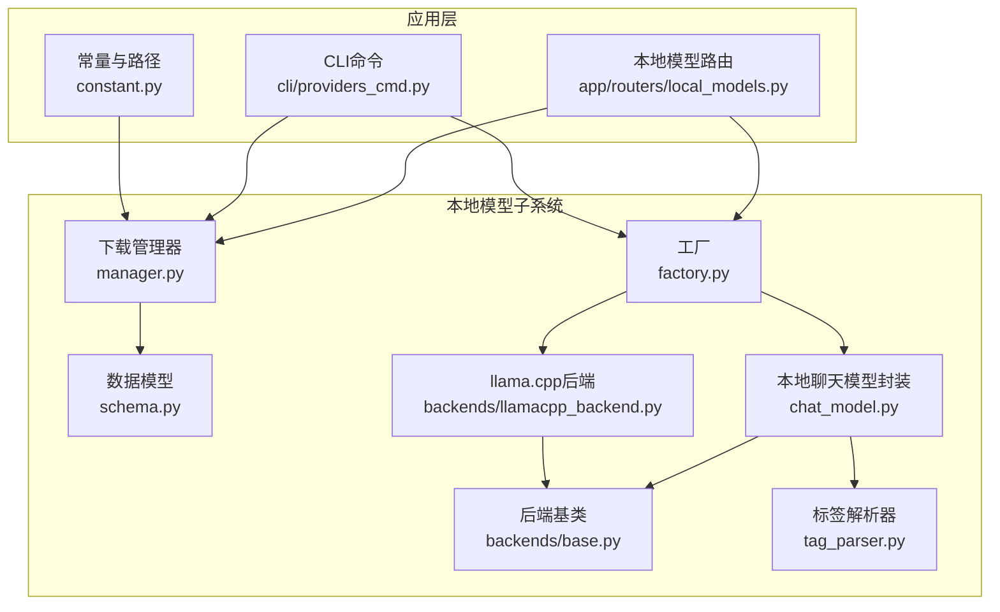
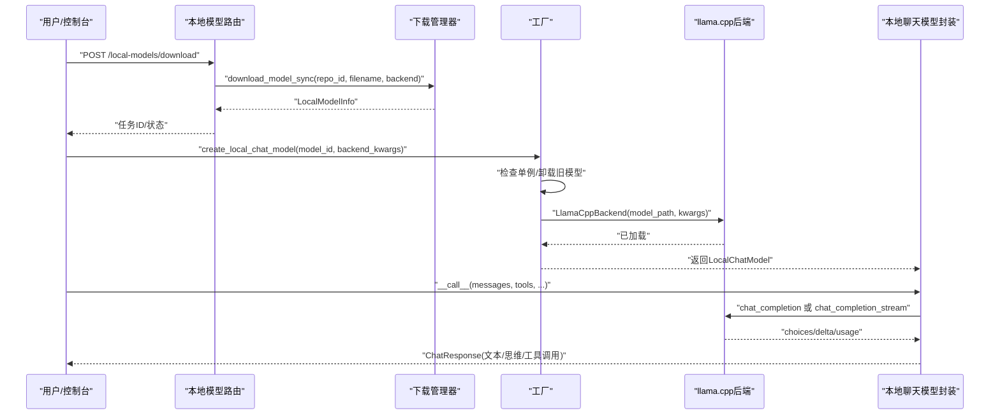
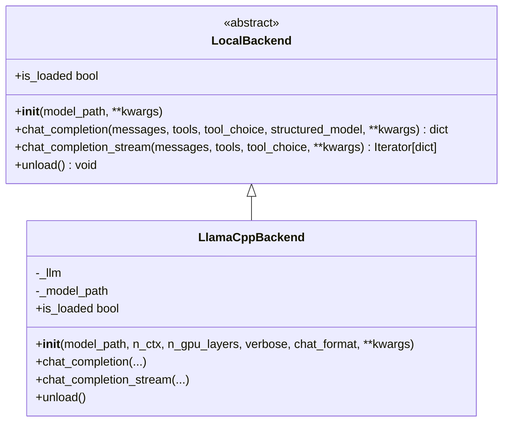
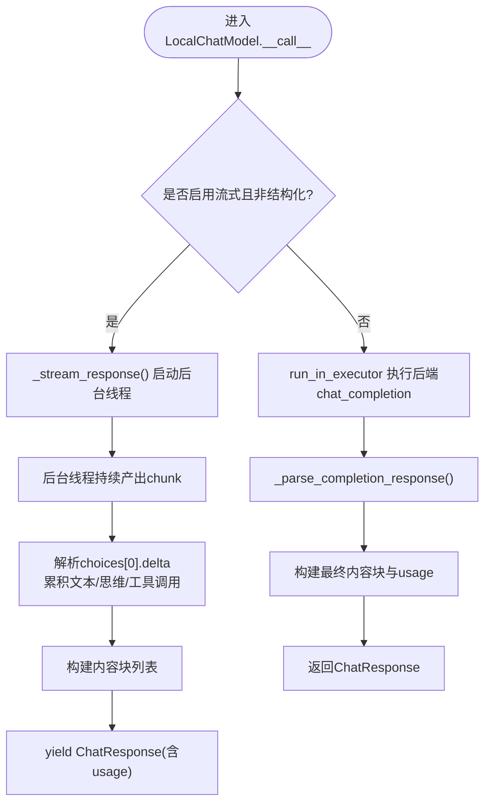
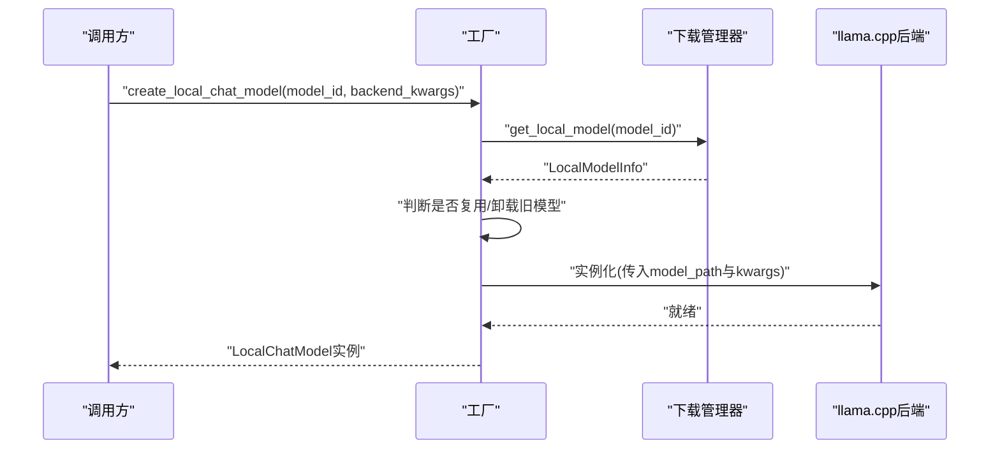
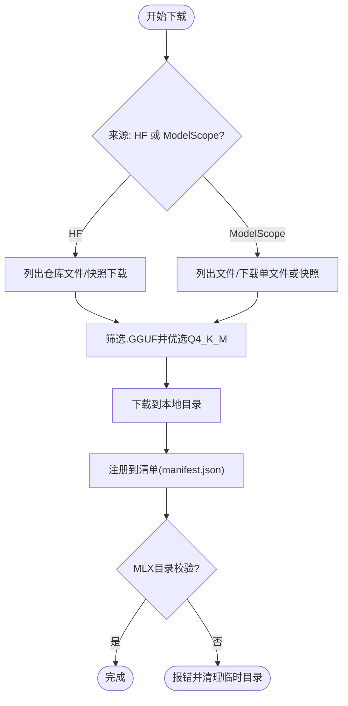
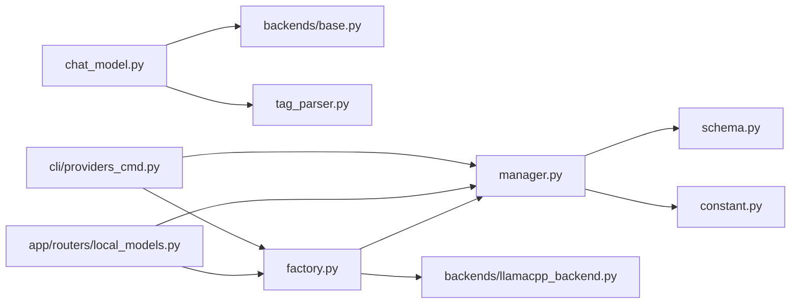

# llama.cpp后端

<cite>
**本文档引用的文件**
- [llamacpp_backend.py](file://src/copaw/local_models/backends/llamacpp_backend.py)
- [chat_model.py](file://src/copaw/local_models/chat_model.py)
- [factory.py](file://src/copaw/local_models/factory.py)
- [manager.py](file://src/copaw/local_models/manager.py)
- [schema.py](file://src/copaw/local_models/schema.py)
- [base.py](file://src/copaw/local_models/backends/base.py)
- [tag_parser.py](file://src/copaw/local_models/tag_parser.py)
- [local_models.py](file://src/copaw/app/routers/local_models.py)
- [providers_cmd.py](file://src/copaw/cli/providers_cmd.py)
- [constant.py](file://src/copaw/constant.py)
- [README.md](file://README.md)
- [build_common.py](file://scripts/pack/build_common.py)
</cite>

## 目录
1. [简介](#简介)
2. [项目结构](#项目结构)
3. [核心组件](#核心组件)
4. [架构总览](#架构总览)
5. [详细组件分析](#详细组件分析)
6. [依赖关系分析](#依赖关系分析)
7. [性能考虑](#性能考虑)
8. [故障排除指南](#故障排除指南)
9. [结论](#结论)
10. [附录](#附录)

## 简介
本文件面向CoPaw的llama.cpp后端，系统性阐述其架构设计与实现原理，覆盖以下主题：
- GGUF文件格式支持与自动选择策略
- 量化模型（如Q4_K_M）的下载与加载
- 推理引擎集成与消息规范化
- 后端初始化流程、模型加载机制与内存管理
- 安装配置指南（依赖库、系统要求、性能优化）
- 量化级别选择、推理参数调优与GPU加速配置
- 常见问题排查、性能监控与故障排除最佳实践

## 项目结构
CoPaw将本地模型能力抽象为统一接口，并通过工厂模式按需加载具体后端。llama.cpp后端位于local_models子系统中，配合下载管理器、路由与CLI命令，形成从“下载—注册—加载—推理”的完整闭环。

**图表来源**
- [factory.py:110-125](file://src/copaw/local_models/factory.py#L110-L125)
- [manager.py:94-413](file://src/copaw/local_models/manager.py#L94-L413)
- [schema.py:12-59](file://src/copaw/local_models/schema.py#L12-L59)
- [base.py:12-64](file://src/copaw/local_models/backends/base.py#L12-L64)
- [llamacpp_backend.py:45-140](file://src/copaw/local_models/backends/llamacpp_backend.py#L45-L140)
- [chat_model.py:39-362](file://src/copaw/local_models/chat_model.py#L39-L362)
- [tag_parser.py:1-230](file://src/copaw/local_models/tag_parser.py#L1-L230)
- [local_models.py:1-320](file://src/copaw/app/routers/local_models.py#L1-L320)
- [providers_cmd.py:636-787](file://src/copaw/cli/providers_cmd.py#L636-L787)
- [constant.py:145-146](file://src/copaw/constant.py#L145-L146)

**章节来源**
- [factory.py:1-125](file://src/copaw/local_models/factory.py#L1-L125)
- [manager.py:1-413](file://src/copaw/local_models/manager.py#L1-L413)
- [schema.py:1-59](file://src/copaw/local_models/schema.py#L1-L59)
- [base.py:1-64](file://src/copaw/local_models/backends/base.py#L1-L64)
- [llamacpp_backend.py:1-140](file://src/copaw/local_models/backends/llamacpp_backend.py#L1-L140)
- [chat_model.py:1-362](file://src/copaw/local_models/chat_model.py#L1-L362)
- [tag_parser.py:1-230](file://src/copaw/local_models/tag_parser.py#L1-L230)
- [local_models.py:1-320](file://src/copaw/app/routers/local_models.py#L1-L320)
- [providers_cmd.py:636-787](file://src/copaw/cli/providers_cmd.py#L636-L787)
- [constant.py:145-146](file://src/copaw/constant.py#L145-L146)

## 核心组件
- 抽象后端接口：定义统一的模型加载、非流式/流式推理与卸载接口，确保多后端一致性。
- llama.cpp后端实现：基于llama-cpp-python，负责模型初始化、消息规范化、工具调用与结构化输出支持。
- 本地聊天模型封装：将后端同步接口适配为异步生成器，支持流式与非流式响应，解析<think>与<tool_call>标签，提取思维与工具调用。
- 工厂与单例：根据模型ID与后端类型创建或复用后端实例，避免重复加载。
- 下载管理器：从Hugging Face或ModelScope下载GGUF文件，自动选择Q4_K_M等量化文件，注册到清单并持久化。
- 路由与CLI：提供REST API与命令行入口，支持后台下载任务、状态查询与删除操作。
- 数据模型：描述本地模型元信息、下载进度与清单结构。
- 标签解析器：解析模型输出中的<think>与<tool_call>标签，兼容无结构化字段的旧模型。

**章节来源**
- [base.py:12-64](file://src/copaw/local_models/backends/base.py#L12-L64)
- [llamacpp_backend.py:45-140](file://src/copaw/local_models/backends/llamacpp_backend.py#L45-L140)
- [chat_model.py:39-362](file://src/copaw/local_models/chat_model.py#L39-L362)
- [factory.py:22-125](file://src/copaw/local_models/factory.py#L22-L125)
- [manager.py:94-413](file://src/copaw/local_models/manager.py#L94-L413)
- [schema.py:22-59](file://src/copaw/local_models/schema.py#L22-L59)
- [local_models.py:1-320](file://src/copaw/app/routers/local_models.py#L1-L320)
- [providers_cmd.py:636-787](file://src/copaw/cli/providers_cmd.py#L636-L787)
- [tag_parser.py:1-230](file://src/copaw/local_models/tag_parser.py#L1-L230)

## 架构总览
下图展示从用户触发到推理完成的关键交互路径，包括下载、加载、推理与响应解析。

**图表来源**
- [local_models.py:123-256](file://src/copaw/app/routers/local_models.py#L123-L256)
- [manager.py:98-185](file://src/copaw/local_models/manager.py#L98-L185)
- [factory.py:42-107](file://src/copaw/local_models/factory.py#L42-L107)
- [llamacpp_backend.py:86-130](file://src/copaw/local_models/backends/llamacpp_backend.py#L86-L130)
- [chat_model.py:58-94](file://src/copaw/local_models/chat_model.py#L58-L94)

## 详细组件分析

### llama.cpp后端实现
- 初始化流程
  - 动态导入llama-cpp-python，若缺失则抛出可读错误提示。
  - 记录日志并构造Llama实例，传入模型路径、上下文长度、GPU层数、聊天格式等参数。
- 消息规范化
  - 将复杂内容块合并为纯字符串；将tool_calls标准化为列表或移除None。
  - 保证模板渲染与工具调用兼容性。
- 非流式与流式推理
  - 支持tools/tool_choice与结构化JSON模式（通过response_format.schema）。
  - 流式模式使用迭代器驱动，逐块产出delta。
- 卸载与状态
  - 显式释放模型资源，标记is_loaded状态。

**图表来源**
- [base.py:12-64](file://src/copaw/local_models/backends/base.py#L12-L64)
- [llamacpp_backend.py:45-140](file://src/copaw/local_models/backends/llamacpp_backend.py#L45-L140)

**章节来源**
- [llamacpp_backend.py:45-140](file://src/copaw/local_models/backends/llamacpp_backend.py#L45-L140)

### 本地聊天模型封装
- 异步适配
  - 非流式：在线程池执行后端同步调用，包装为协程结果。
  - 流式：在后台线程消费后端迭代器，通过asyncio.Queue向事件循环投递。
- 内容解析
  - 优先使用后端提供的reasoning_content与tool_calls；若为空，则回退到<think>与<tool_call>标签解析。
  - 累积delta，构建ThinkingBlock、TextBlock与ToolUseBlock。
- 使用统计
  - 解析usage中的prompt_tokens与completion_tokens，计算耗时。

**图表来源**
- [chat_model.py:58-258](file://src/copaw/local_models/chat_model.py#L58-L258)
- [tag_parser.py:134-230](file://src/copaw/local_models/tag_parser.py#L134-L230)

**章节来源**
- [chat_model.py:39-362](file://src/copaw/local_models/chat_model.py#L39-L362)
- [tag_parser.py:1-230](file://src/copaw/local_models/tag_parser.py#L1-L230)

### 工厂与单例管理
- 单例模式
  - 全局持有当前活跃后端与模型ID；若请求相同模型且已加载则复用。
  - 若切换模型，先卸载旧后端再加载新后端。
- 参数透传
  - backend_kwargs传递给后端构造函数（如n_ctx、n_gpu_layers），generate_kwargs透传至每次生成调用。

**图表来源**
- [factory.py:42-107](file://src/copaw/local_models/factory.py#L42-L107)
- [manager.py:63-67](file://src/copaw/local_models/manager.py#L63-L67)

**章节来源**
- [factory.py:22-125](file://src/copaw/local_models/factory.py#L22-L125)
- [manager.py:63-67](file://src/copaw/local_models/manager.py#L63-L67)

### 下载管理器与GGUF选择
- 自动选择
  - 在仓库文件列表中筛选.GGUF文件，优先选择包含“Q4_K_M”的量化文件作为默认。
- 多源支持
  - Hugging Face：支持hf_hub_download与snapshot_download（MLX目录型模型）。
  - ModelScope：支持model_file_download与snapshot_download（兼容旧版本）。
- 注册与校验
  - 将下载产物注册到清单，记录文件大小、显示名与绝对路径。
  - 对MLX目录进行完整性校验（必需文件与safetensors存在性）。

**图表来源**
- [manager.py:98-330](file://src/copaw/local_models/manager.py#L98-L330)

**章节来源**
- [manager.py:94-413](file://src/copaw/local_models/manager.py#L94-L413)
- [schema.py:22-59](file://src/copaw/local_models/schema.py#L22-L59)

### 应用层集成（路由与CLI）
- 路由
  - 提供列出、下载、取消、删除本地模型的REST接口；后台任务状态查询。
- CLI
  - 提供models download/list/remove-local等命令，支持指定后端与来源。
  - 自动提示依赖未安装场景与安装方式。

**章节来源**
- [local_models.py:94-320](file://src/copaw/app/routers/local_models.py#L94-L320)
- [providers_cmd.py:636-787](file://src/copaw/cli/providers_cmd.py#L636-L787)

## 依赖关系分析
- 组件耦合
  - LocalChatModel依赖LocalBackend接口，通过组合实现解耦。
  - 工厂仅依赖LocalModelInfo与后端类型枚举，不直接关心具体实现细节。
- 外部依赖
  - llama-cpp-python：llama.cpp后端的核心运行时。
  - huggingface_hub/modelscope：模型下载。
  - FastAPI/asyncio：异步流式与后台任务。
- 可能的循环依赖
  - 当前模块间采用单向依赖（路由→管理器/工厂→后端），未发现循环导入迹象。

**图表来源**
- [chat_model.py:1-362](file://src/copaw/local_models/chat_model.py#L1-L362)
- [factory.py:1-125](file://src/copaw/local_models/factory.py#L1-L125)
- [manager.py:1-413](file://src/copaw/local_models/manager.py#L1-L413)
- [schema.py:1-59](file://src/copaw/local_models/schema.py#L1-L59)
- [constant.py:145-146](file://src/copaw/constant.py#L145-L146)
- [local_models.py:1-320](file://src/copaw/app/routers/local_models.py#L1-L320)
- [providers_cmd.py:636-787](file://src/copaw/cli/providers_cmd.py#L636-L787)

**章节来源**
- [chat_model.py:1-362](file://src/copaw/local_models/chat_model.py#L1-L362)
- [factory.py:1-125](file://src/copaw/local_models/factory.py#L1-L125)
- [manager.py:1-413](file://src/copaw/local_models/manager.py#L1-L413)
- [schema.py:1-59](file://src/copaw/local_models/schema.py#L1-L59)
- [constant.py:145-146](file://src/copaw/constant.py#L145-L146)
- [local_models.py:1-320](file://src/copaw/app/routers/local_models.py#L1-L320)
- [providers_cmd.py:636-787](file://src/copaw/cli/providers_cmd.py#L636-L787)

## 性能考虑
- 上下文长度与显存占用
  - n_ctx越大，显存占用越高；建议根据可用显存与任务需求调整。
- GPU加速
  - n_gpu_layers=-1表示尽可能将权重加载到GPU；若显存不足，可适当降低该值。
- 流式输出
  - 流式模式减少首token延迟，适合实时对话；注意队列缓冲与背压处理。
- 量化模型
  - Q4_K_M在保持较高精度的同时显著降低显存占用，适合大多数桌面场景。
- 线程池与异步
  - 非流式推理通过线程池执行，避免阻塞事件循环；合理设置线程数与超时。

[本节为通用指导，无需特定文件引用]

## 故障排除指南
- 无法导入llama-cpp-python
  - 现象：初始化后端时报ImportError。
  - 处理：按照README提示安装扩展包或使用脚本安装器。
- 下载失败或文件不完整
  - 现象：manifest损坏、缺少必需文件、网络中断。
  - 处理：删除对应目录/文件，重新下载；确认仓库包含.GGUF或.safetensors文件。
- 模型未被识别为GGUF
  - 现象：仓库无.GGUF文件导致自动选择失败。
  - 处理：明确指定filename，或更换提供GGUF格式的仓库。
- 流式解析异常
  - 现象：<think>/<tool_call>标签不闭合或JSON解析失败。
  - 处理：检查模型输出格式；必要时升级模型或调整提示词。
- 资源未释放
  - 现象：切换模型后显存未回收。
  - 处理：调用unload或重启服务；确认工厂逻辑正确卸载旧后端。

**章节来源**
- [README.md:338-355](file://README.md#L338-L355)
- [manager.py:300-330](file://src/copaw/local_models/manager.py#L300-L330)
- [manager.py:332-362](file://src/copaw/local_models/manager.py#L332-L362)
- [llamacpp_backend.py:131-140](file://src/copaw/local_models/backends/llamacpp_backend.py#L131-L140)
- [chat_model.py:109-127](file://src/copaw/local_models/chat_model.py#L109-L127)

## 结论
CoPaw的llama.cpp后端通过清晰的抽象接口、完善的下载与工厂管理、以及对标签解析与异步流式的良好支持，实现了跨平台、低门槛的本地推理体验。结合合理的量化策略与参数调优，可在不同硬件环境下获得稳定且高效的推理性能。

[本节为总结，无需特定文件引用]

## 附录

### 安装与配置指南
- 依赖库安装
  - 使用脚本安装器自动检测并安装llama-cpp-python预编译wheel或在必要时从源码编译。
  - 也可直接安装扩展包以启用本地模型功能。
- 系统要求
  - Python 3.10–3.14；推荐现代CPU/GPU（Metal/CUDA）以获得更好性能。
- 性能优化设置
  - 调整n_ctx与n_gpu_layers；选择合适的量化级别（如Q4_K_M）。
  - 启用流式输出以改善交互延迟。

**章节来源**
- [README.md:113-147](file://README.md#L113-L147)
- [README.md:338-355](file://README.md#L338-L355)
- [build_common.py:150-231](file://scripts/pack/build_common.py#L150-L231)

### 量化级别与推理参数
- 量化级别
  - 默认优选Q4_K_M；可根据显存与精度需求选择其他级别。
- 推理参数
  - 温度、top_p等参数可通过generate_kwargs传入；具体生效取决于后端实现。
- GPU加速
  - 设置n_gpu_layers=-1以最大化利用显存；若显存紧张可降低层数。

**章节来源**
- [manager.py:294-314](file://src/copaw/local_models/manager.py#L294-L314)
- [llamacpp_backend.py:48-84](file://src/copaw/local_models/backends/llamacpp_backend.py#L48-L84)
- [factory.py:42-60](file://src/copaw/local_models/factory.py#L42-L60)

### 常见问题排查清单
- 检查本地模型目录与清单文件是否存在且可读写。
- 确认模型文件为GGUF格式或MLX目录包含必需文件。
- 验证llama-cpp-python是否成功安装并可导入。
- 如出现流式解析异常，检查<think>/<tool_call>标签是否规范。

**章节来源**
- [constant.py:145-146](file://src/copaw/constant.py#L145-L146)
- [manager.py:30-50](file://src/copaw/local_models/manager.py#L30-L50)
- [manager.py:332-362](file://src/copaw/local_models/manager.py#L332-L362)
- [llamacpp_backend.py:57-64](file://src/copaw/local_models/backends/llamacpp_backend.py#L57-L64)