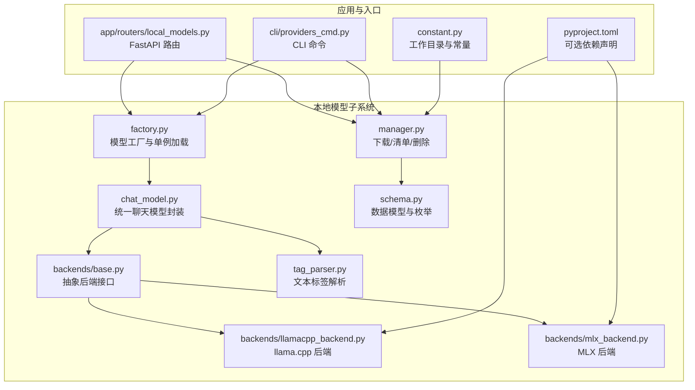
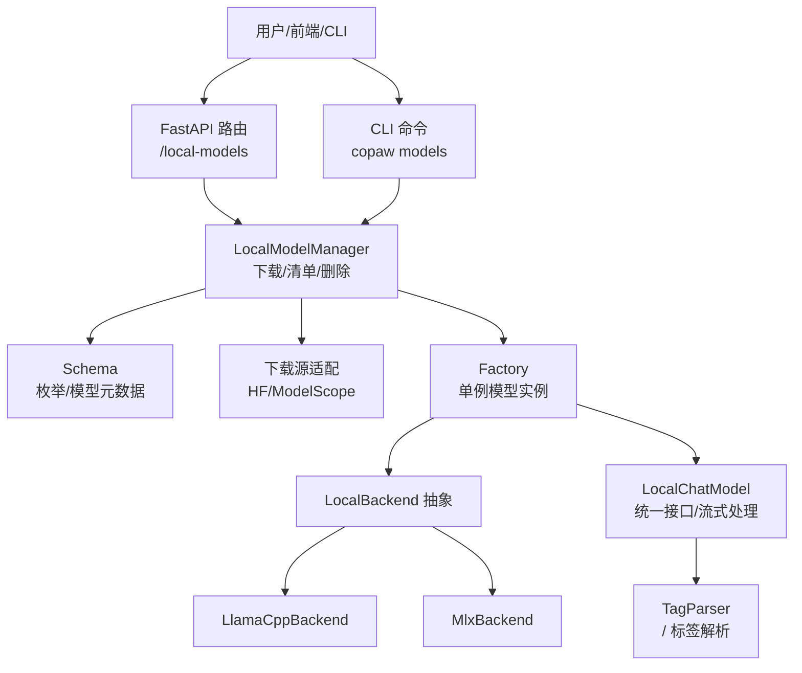
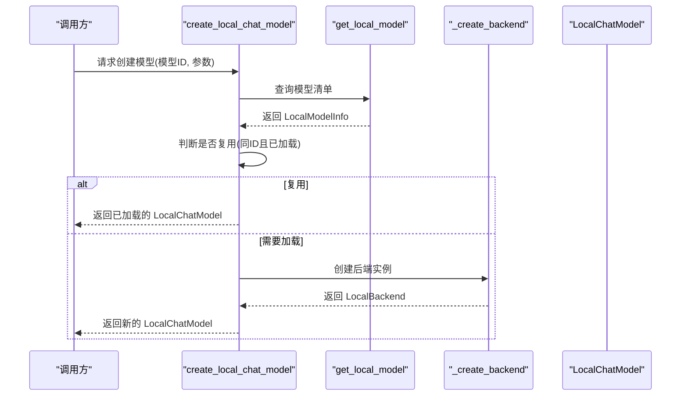
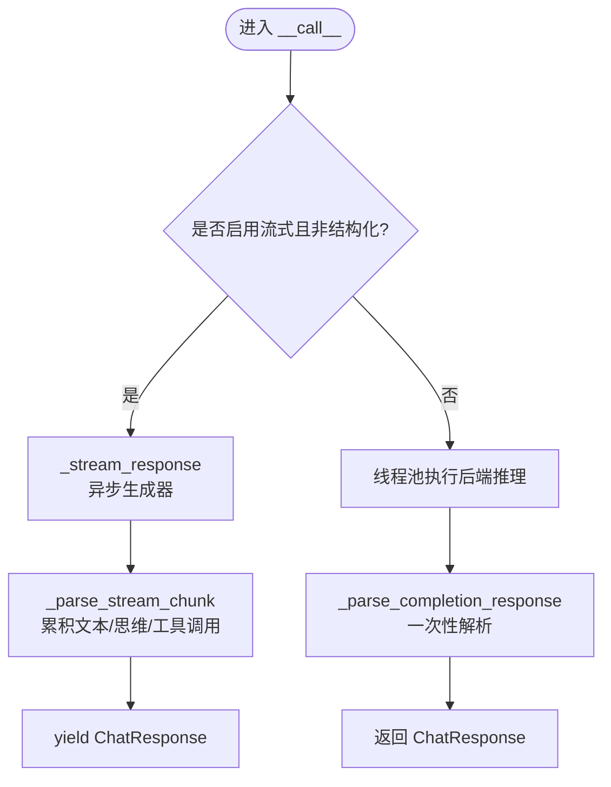
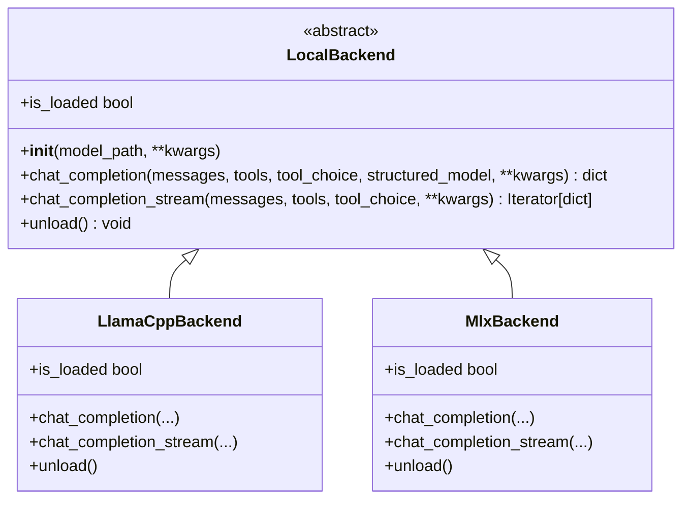
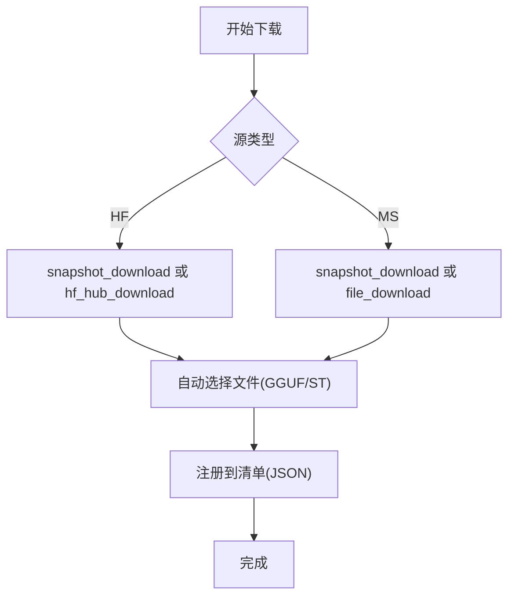
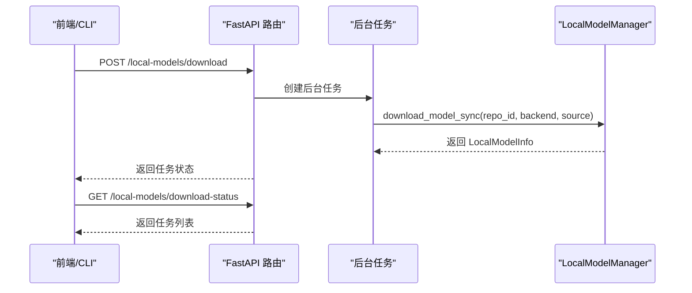
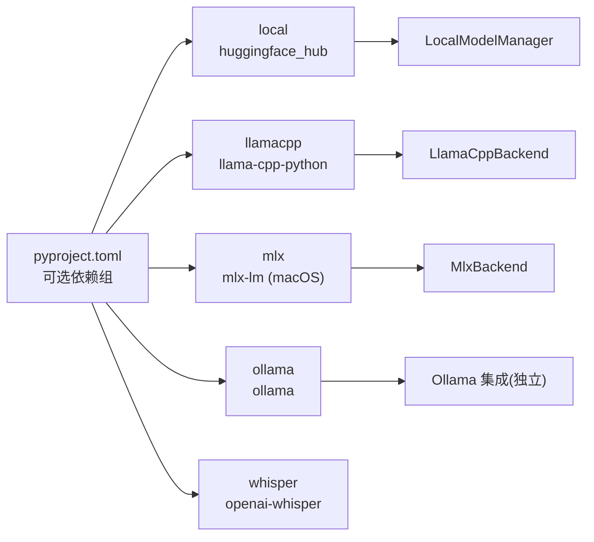

# 本地模型支持

<cite>
**本文引用的文件**
- [src/copaw/local_models/factory.py](file://src/copaw/local_models/factory.py)
- [src/copaw/local_models/chat_model.py](file://src/copaw/local_models/chat_model.py)
- [src/copaw/local_models/manager.py](file://src/copaw/local_models/manager.py)
- [src/copaw/local_models/schema.py](file://src/copaw/local_models/schema.py)
- [src/copaw/local_models/backends/base.py](file://src/copaw/local_models/backends/base.py)
- [src/copaw/local_models/backends/llamacpp_backend.py](file://src/copaw/local_models/backends/llamacpp_backend.py)
- [src/copaw/local_models/backends/mlx_backend.py](file://src/copaw/local_models/backends/mlx_backend.py)
- [src/copaw/local_models/tag_parser.py](file://src/copaw/local_models/tag_parser.py)
- [src/copaw/app/routers/local_models.py](file://src/copaw/app/routers/local_models.py)
- [src/copaw/constant.py](file://src/copaw/constant.py)
- [pyproject.toml](file://pyproject.toml)
- [src/copaw/cli/providers_cmd.py](file://src/copaw/cli/providers_cmd.py)
- [console/src/api/modules/ollamaModel.ts](file://console/src/api/modules/ollamaModel.ts)
</cite>

## 目录
1. [简介](#简介)
2. [项目结构](#项目结构)
3. [核心组件](#核心组件)
4. [架构总览](#架构总览)
5. [详细组件分析](#详细组件分析)
6. [依赖分析](#依赖分析)
7. [性能考虑](#性能考虑)
8. [故障排除指南](#故障排除指南)
9. [结论](#结论)
10. [附录](#附录)

## 简介
本文件面向 CoPaw 的本地模型支持系统，系统性阐述其架构设计与实现要点，覆盖 llama.cpp、MLX、Ollama 等多种后端的集成方式；详解模型工厂的创建流程、后端选择逻辑与资源管理策略；并提供安装、配置、优化与故障排除的实操指南。读者可据此在本地环境中高效部署与使用本地大模型。

## 项目结构
本地模型相关代码主要位于 src/copaw/local_models 目录，并通过 FastAPI 路由与 CLI 命令对外提供能力；常量与依赖在常量模块与打包配置中定义。

**图表来源**
- [src/copaw/local_models/factory.py:1-125](file://src/copaw/local_models/factory.py#L1-L125)
- [src/copaw/local_models/chat_model.py:1-362](file://src/copaw/local_models/chat_model.py#L1-L362)
- [src/copaw/local_models/manager.py:1-413](file://src/copaw/local_models/manager.py#L1-L413)
- [src/copaw/local_models/schema.py:1-59](file://src/copaw/local_models/schema.py#L1-L59)
- [src/copaw/local_models/backends/base.py:1-64](file://src/copaw/local_models/backends/base.py#L1-L64)
- [src/copaw/local_models/backends/llamacpp_backend.py:1-140](file://src/copaw/local_models/backends/llamacpp_backend.py#L1-L140)
- [src/copaw/local_models/backends/mlx_backend.py:1-236](file://src/copaw/local_models/backends/mlx_backend.py#L1-L236)
- [src/copaw/local_models/tag_parser.py:1-230](file://src/copaw/local_models/tag_parser.py#L1-L230)
- [src/copaw/app/routers/local_models.py:1-320](file://src/copaw/app/routers/local_models.py#L1-L320)
- [src/copaw/constant.py:145-146](file://src/copaw/constant.py#L145-L146)
- [pyproject.toml:74-81](file://pyproject.toml#L74-L81)

**章节来源**
- [src/copaw/local_models/factory.py:1-125](file://src/copaw/local_models/factory.py#L1-L125)
- [src/copaw/local_models/chat_model.py:1-362](file://src/copaw/local_models/chat_model.py#L1-L362)
- [src/copaw/local_models/manager.py:1-413](file://src/copaw/local_models/manager.py#L1-L413)
- [src/copaw/local_models/schema.py:1-59](file://src/copaw/local_models/schema.py#L1-L59)
- [src/copaw/local_models/backends/base.py:1-64](file://src/copaw/local_models/backends/base.py#L1-L64)
- [src/copaw/local_models/backends/llamacpp_backend.py:1-140](file://src/copaw/local_models/backends/llamacpp_backend.py#L1-L140)
- [src/copaw/local_models/backends/mlx_backend.py:1-236](file://src/copaw/local_models/backends/mlx_backend.py#L1-L236)
- [src/copaw/local_models/tag_parser.py:1-230](file://src/copaw/local_models/tag_parser.py#L1-L230)
- [src/copaw/app/routers/local_models.py:1-320](file://src/copaw/app/routers/local_models.py#L1-L320)
- [src/copaw/constant.py:145-146](file://src/copaw/constant.py#L145-L146)
- [pyproject.toml:74-81](file://pyproject.toml#L74-L81)

## 核心组件
- 模型工厂与单例加载：负责按需加载/复用本地模型，避免重复初始化，提供线程安全的全局状态。
- 统一聊天模型封装：对不同后端暴露一致的异步调用接口，支持流式与非流式输出，并解析思维与工具调用等特殊标记。
- 后端抽象与实现：定义统一接口，分别由 llama.cpp 与 MLX 实现，确保上层无感切换。
- 下载与清单管理：从 Hugging Face 或 ModelScope 拉取模型，自动选择合适文件，注册到清单并持久化。
- 文本标签解析：从模型输出中提取思维与工具调用标签，兼容不同后端的结构化/非结构化输出。
- 应用路由与 CLI：提供 REST 接口与命令行工具，支持后台下载任务、取消与状态查询。

**章节来源**
- [src/copaw/local_models/factory.py:42-125](file://src/copaw/local_models/factory.py#L42-L125)
- [src/copaw/local_models/chat_model.py:39-362](file://src/copaw/local_models/chat_model.py#L39-L362)
- [src/copaw/local_models/backends/base.py:12-64](file://src/copaw/local_models/backends/base.py#L12-L64)
- [src/copaw/local_models/backends/llamacpp_backend.py:45-140](file://src/copaw/local_models/backends/llamacpp_backend.py#L45-L140)
- [src/copaw/local_models/backends/mlx_backend.py:57-236](file://src/copaw/local_models/backends/mlx_backend.py#L57-L236)
- [src/copaw/local_models/manager.py:94-413](file://src/copaw/local_models/manager.py#L94-L413)
- [src/copaw/local_models/tag_parser.py:134-230](file://src/copaw/local_models/tag_parser.py#L134-L230)
- [src/copaw/app/routers/local_models.py:94-320](file://src/copaw/app/routers/local_models.py#L94-L320)
- [src/copaw/cli/providers_cmd.py:636-787](file://src/copaw/cli/providers_cmd.py#L636-L787)

## 架构总览
本地模型支持以“工厂 + 抽象后端 + 统一封装”的分层架构组织，结合清单与下载管理，形成完整的本地模型生命周期闭环。

**图表来源**
- [src/copaw/app/routers/local_models.py:94-320](file://src/copaw/app/routers/local_models.py#L94-L320)
- [src/copaw/cli/providers_cmd.py:636-787](file://src/copaw/cli/providers_cmd.py#L636-L787)
- [src/copaw/local_models/manager.py:94-413](file://src/copaw/local_models/manager.py#L94-L413)
- [src/copaw/local_models/schema.py:12-59](file://src/copaw/local_models/schema.py#L12-L59)
- [src/copaw/local_models/factory.py:110-125](file://src/copaw/local_models/factory.py#L110-L125)
- [src/copaw/local_models/backends/base.py:12-64](file://src/copaw/local_models/backends/base.py#L12-L64)
- [src/copaw/local_models/backends/llamacpp_backend.py:45-140](file://src/copaw/local_models/backends/llamacpp_backend.py#L45-L140)
- [src/copaw/local_models/backends/mlx_backend.py:57-236](file://src/copaw/local_models/backends/mlx_backend.py#L57-L236)
- [src/copaw/local_models/chat_model.py:39-362](file://src/copaw/local_models/chat_model.py#L39-L362)
- [src/copaw/local_models/tag_parser.py:134-230](file://src/copaw/local_models/tag_parser.py#L134-L230)

## 详细组件分析

### 工厂与单例加载（模型工厂）
- 单例模式：维护当前已加载的后端实例与模型 ID，若请求相同模型则直接复用，否则卸载旧模型再加载新模型。
- 线程安全：使用锁保护全局状态，避免并发冲突。
- 后端选择：依据清单中的后端类型动态导入对应后端类并构造实例。
- 资源释放：提供显式卸载接口，释放 GPU/内存资源。

**图表来源**
- [src/copaw/local_models/factory.py:42-125](file://src/copaw/local_models/factory.py#L42-L125)
- [src/copaw/local_models/manager.py:63-67](file://src/copaw/local_models/manager.py#L63-L67)
- [src/copaw/local_models/backends/llamacpp_backend.py:45-84](file://src/copaw/local_models/backends/llamacpp_backend.py#L45-L84)
- [src/copaw/local_models/backends/mlx_backend.py:57-82](file://src/copaw/local_models/backends/mlx_backend.py#L57-L82)

**章节来源**
- [src/copaw/local_models/factory.py:22-125](file://src/copaw/local_models/factory.py#L22-L125)

### 统一聊天模型封装（LocalChatModel）
- 异步兼容：内部通过线程池执行同步后端推理，保证异步接口一致性。
- 流式输出：将后端同步迭代器包装为异步生成器，逐块产出增量内容。
- 内容解析：支持结构化思维内容与工具调用，或从文本标签中提取相应片段。
- 使用统计：从后端响应中提取 token 计数与耗时，封装为统一的用量对象。

**图表来源**
- [src/copaw/local_models/chat_model.py:58-362](file://src/copaw/local_models/chat_model.py#L58-L362)
- [src/copaw/local_models/tag_parser.py:134-230](file://src/copaw/local_models/tag_parser.py#L134-L230)

**章节来源**
- [src/copaw/local_models/chat_model.py:39-362](file://src/copaw/local_models/chat_model.py#L39-L362)
- [src/copaw/local_models/tag_parser.py:134-230](file://src/copaw/local_models/tag_parser.py#L134-L230)

### 后端抽象与实现
- 抽象接口：定义统一的初始化、聊天补全、流式补全、卸载与加载状态检查方法。
- llama.cpp 后端：基于 llama-cpp-python，支持 n_ctx、n_gpu_layers 等参数，消息规范化以适配模板。
- MLX 后端：基于 mlx-lm，针对 Apple Silicon 优化，支持采样参数映射与提示模板拼接。

**图表来源**
- [src/copaw/local_models/backends/base.py:12-64](file://src/copaw/local_models/backends/base.py#L12-L64)
- [src/copaw/local_models/backends/llamacpp_backend.py:45-140](file://src/copaw/local_models/backends/llamacpp_backend.py#L45-L140)
- [src/copaw/local_models/backends/mlx_backend.py:57-236](file://src/copaw/local_models/backends/mlx_backend.py#L57-L236)

**章节来源**
- [src/copaw/local_models/backends/base.py:12-64](file://src/copaw/local_models/backends/base.py#L12-L64)
- [src/copaw/local_models/backends/llamacpp_backend.py:45-140](file://src/copaw/local_models/backends/llamacpp_backend.py#L45-L140)
- [src/copaw/local_models/backends/mlx_backend.py:57-236](file://src/copaw/local_models/backends/mlx_backend.py#L57-L236)

### 下载与清单管理（LocalModelManager）
- 清单持久化：以 JSON 文件记录已下载模型的元信息，支持增删查与校验。
- 自动文件选择：根据后端类型自动挑选 GGUF 或 safetensors 文件，优先选择常见量化版本。
- 多源下载：支持 Hugging Face 与 ModelScope，MLX 模型强制拉取完整仓库并校验关键文件。
- 注册与验证：下载完成后注册到清单，计算大小并生成显示名称。

**图表来源**
- [src/copaw/local_models/manager.py:98-413](file://src/copaw/local_models/manager.py#L98-L413)

**章节来源**
- [src/copaw/local_models/manager.py:94-413](file://src/copaw/local_models/manager.py#L94-L413)
- [src/copaw/constant.py:145-146](file://src/copaw/constant.py#L145-L146)

### 数据模型与枚举
- 后端类型：llamacpp、mlx。
- 下载来源：huggingface、modelscope。
- 模型信息：唯一 ID、仓库 ID、文件名、后端、来源、大小、本地路径、显示名。
- 清单：模型字典集合，持久化保存。

**章节来源**
- [src/copaw/local_models/schema.py:12-59](file://src/copaw/local_models/schema.py#L12-L59)

### 文本标签解析（TagParser）
- 思维标签：<think>...</think>，支持未闭合标签的流式场景。
- 工具调用标签：<tool_call>...</tool_call>，解析其中 JSON 并生成工具调用对象。
- 输出：分离前后文本、工具调用列表与中间片段，便于渲染与后续执行。

**章节来源**
- [src/copaw/local_models/tag_parser.py:134-230](file://src/copaw/local_models/tag_parser.py#L134-L230)

### 应用路由与 CLI
- FastAPI 路由：提供列出、下载、取消、删除等接口，支持后台任务与进度推送。
- CLI 命令：提供 download、local、remove-local 等子命令，支持过滤与确认。
- Ollama 集成：前端通过独立模块调用 /ollama-models 相关接口（与本地模型路由并列）。

**图表来源**
- [src/copaw/app/routers/local_models.py:123-320](file://src/copaw/app/routers/local_models.py#L123-L320)
- [src/copaw/cli/providers_cmd.py:636-787](file://src/copaw/cli/providers_cmd.py#L636-L787)
- [console/src/api/modules/ollamaModel.ts:1-31](file://console/src/api/modules/ollamaModel.ts#L1-L31)

**章节来源**
- [src/copaw/app/routers/local_models.py:94-320](file://src/copaw/app/routers/local_models.py#L94-L320)
- [src/copaw/cli/providers_cmd.py:636-787](file://src/copaw/cli/providers_cmd.py#L636-L787)
- [console/src/api/modules/ollamaModel.ts:1-31](file://console/src/api/modules/ollamaModel.ts#L1-L31)

## 依赖分析
- 可选依赖：通过 pyproject.toml 的可选组区分功能集，本地模型支持分为 local、llamacpp、mlx、ollama、whisper 等。
- 运行时条件：MLX 仅在 macOS 平台生效；llama.cpp 与 MLX 分别依赖对应后端库。
- 包装与导出：CLI 与路由均通过统一入口访问 LocalModelManager 与工厂函数。

**图表来源**
- [pyproject.toml:74-91](file://pyproject.toml#L74-L91)

**章节来源**
- [pyproject.toml:74-91](file://pyproject.toml#L74-L91)

## 性能考虑
- 上下文长度与显存：llama.cpp 支持 n_ctx 与 n_gpu_layers 参数，合理设置可平衡吞吐与显存占用。
- 采样参数映射：MLX 将温度/Top-P 等参数映射为采样器，建议按任务需求微调。
- 流式输出：优先使用流式接口以降低首 token 延迟，提升交互体验。
- 资源释放：长时间运行后及时卸载模型，避免显存泄漏。
- 量化与文件选择：优先选择常见量化版本（如 Q4_K_M），在精度与体积间取得平衡。

[本节为通用指导，无需特定文件引用]

## 故障排除指南
- 依赖缺失：未安装本地模型相关依赖时，CLI 与路由会提示安装命令，确保按需安装对应可选组。
- 清单损坏：清单文件损坏时会回退为空清单并重新构建，注意检查日志与磁盘空间。
- MLX 目录不完整：MLX 模型需包含 config.json 与至少一个 safetensors 文件，缺失时会报错并提示清理重试。
- 下载中断：MLX 模型下载失败会尝试清理临时目录，建议重试或更换镜像源。
- 后端异常：后端抛出异常会透传至调用方，检查后端日志与模型路径权限。

**章节来源**
- [src/copaw/local_models/manager.py:130-136](file://src/copaw/local_models/manager.py#L130-L136)
- [src/copaw/local_models/manager.py:332-362](file://src/copaw/local_models/manager.py#L332-L362)
- [src/copaw/app/routers/local_models.py:132-141](file://src/copaw/app/routers/local_models.py#L132-L141)

## 结论
CoPaw 的本地模型支持以清晰的分层架构实现了多后端统一接入与资源管理，配合清单与下载工具链，为用户提供了从下载、配置到推理与卸载的完整闭环。通过合理的参数调优与资源释放策略，可在不同硬件环境下获得稳定且高效的本地推理体验。

## 附录

### 安装与配置指南
- 安装本地模型支持：根据需要安装可选依赖组（如 copaw[llamacpp]、copaw[mlx]、copaw[local] 等）。
- 设置工作目录：通过环境变量指定本地模型存储目录，默认位于用户主目录下的隐藏目录。
- 下载模型：通过 CLI 或 API 发起下载，选择后端与来源，系统自动选择合适文件并注册清单。
- 使用模型：在提供者配置中选择本地提供者与具体模型 ID，即可进行对话与工具调用。

**章节来源**
- [pyproject.toml:74-91](file://pyproject.toml#L74-L91)
- [src/copaw/constant.py:145-146](file://src/copaw/constant.py#L145-L146)
- [src/copaw/cli/providers_cmd.py:636-787](file://src/copaw/cli/providers_cmd.py#L636-L787)
- [src/copaw/app/routers/local_models.py:123-168](file://src/copaw/app/routers/local_models.py#L123-L168)

### 硬件与内存要求
- llama.cpp：适合通用 CPU/GPU 推理，可通过 n_ctx 与 n_gpu_layers 控制显存占用。
- MLX：Apple Silicon 专用，推荐使用较新机型以获得最佳性能。
- 内存管理：长会话建议定期卸载模型；流式输出可降低峰值内存占用。

[本节为通用指导，无需特定文件引用]

### 模型文件格式与量化技术
- GGUF：llama.cpp 主流格式，常见量化如 Q4_K_M，兼顾精度与体积。
- safetensors：MLX 模型常用权重格式，需配合 config.json 等配置文件。
- 自动选择：下载管理器会优先选择常见量化文件，必要时可手动指定文件名。

**章节来源**
- [src/copaw/local_models/manager.py:294-330](file://src/copaw/local_models/manager.py#L294-L330)

### 推理加速与优化
- 流式输出：优先启用流式接口，减少等待时间。
- 采样参数：根据任务调整温度、Top-P 等，平衡创造性与稳定性。
- 显存分层：llama.cpp 的 n_gpu_layers 可将部分权重驻留显存，提高吞吐。
- 缓存与复用：工厂单例避免重复加载，提升多请求场景下的响应速度。

**章节来源**
- [src/copaw/local_models/backends/llamacpp_backend.py:48-84](file://src/copaw/local_models/backends/llamacpp_backend.py#L48-L84)
- [src/copaw/local_models/backends/mlx_backend.py:60-82](file://src/copaw/local_models/backends/mlx_backend.py#L60-L82)
- [src/copaw/local_models/factory.py:77-107](file://src/copaw/local_models/factory.py#L77-L107)