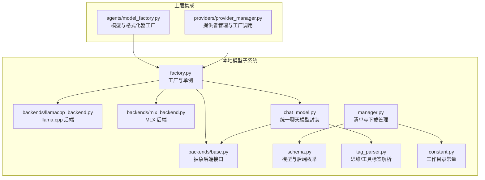
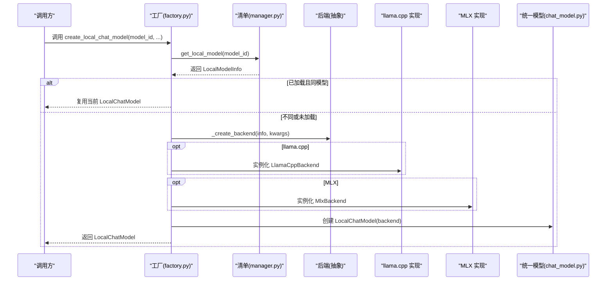
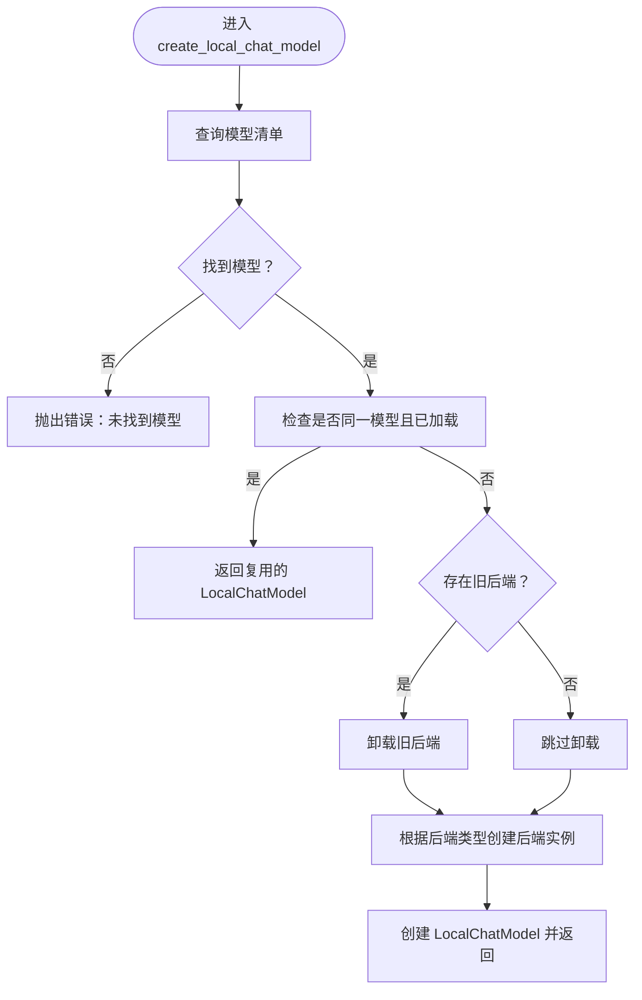
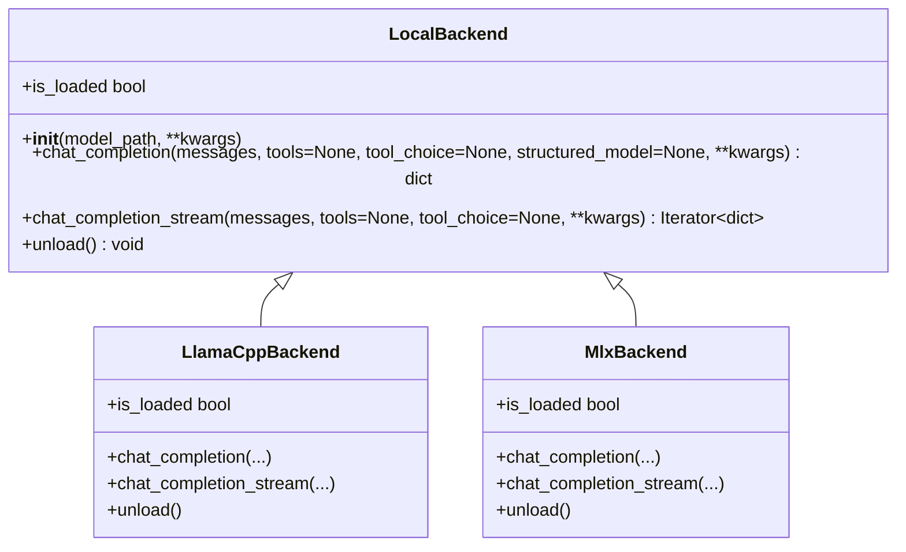
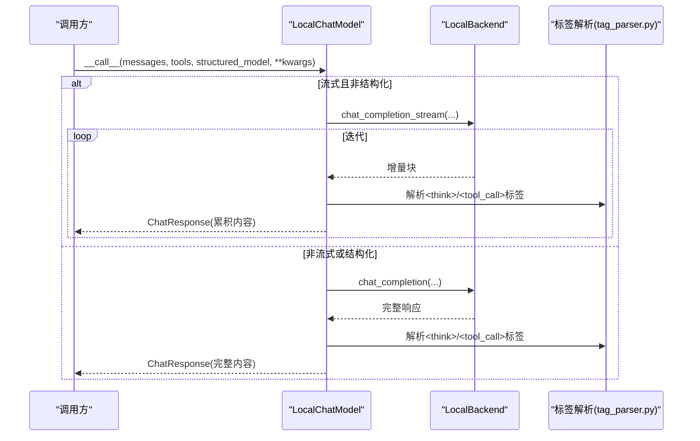
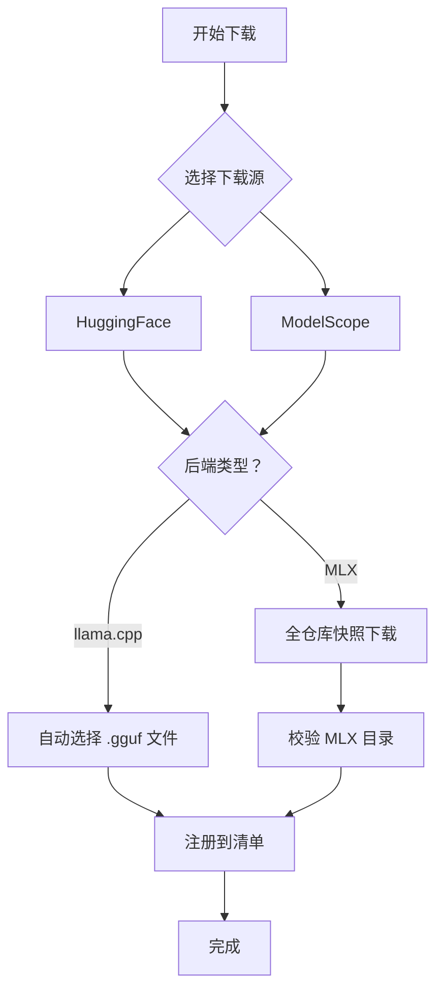
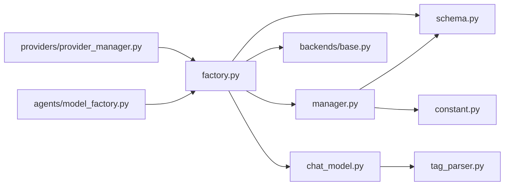

# 模型工厂

<cite>
**本文引用的文件**
- [factory.py](file://src/copaw/local_models/factory.py)
- [base.py](file://src/copaw/local_models/backends/base.py)
- [llamacpp_backend.py](file://src/copaw/local_models/backends/llamacpp_backend.py)
- [mlx_backend.py](file://src/copaw/local_models/backends/mlx_backend.py)
- [chat_model.py](file://src/copaw/local_models/chat_model.py)
- [schema.py](file://src/copaw/local_models/schema.py)
- [manager.py](file://src/copaw/local_models/manager.py)
- [tag_parser.py](file://src/copaw/local_models/tag_parser.py)
- [constant.py](file://src/copaw/constant.py)
- [model_factory.py](file://src/copaw/agents/model_factory.py)
- [provider_manager.py](file://src/copaw/providers/provider_manager.py)
</cite>

## 目录
1. [简介](#简介)
2. [项目结构](#项目结构)
3. [核心组件](#核心组件)
4. [架构总览](#架构总览)
5. [详细组件分析](#详细组件分析)
6. [依赖分析](#依赖分析)
7. [性能考虑](#性能考虑)
8. [故障排查指南](#故障排查指南)
9. [结论](#结论)
10. [附录：扩展与最佳实践](#附录扩展与最佳实践)

## 简介
本文件系统性阐述 CoPaw 的本地模型工厂设计与实现，覆盖以下关键主题：
- 工厂模式与单例策略：如何在进程内复用已加载的后端，避免重复初始化与资源浪费
- 后端类型识别与选择：基于模型元数据自动选择 llama.cpp 或 MLX 后端
- 实例化与配置注入：构造函数参数与生成参数的传递路径
- 注册表与清单管理：模型清单的读写、校验与下载流程
- 流式与非流式推理：统一接口下的异步包装与线程执行
- 结构化输出与工具调用解析：对思维标签与工具调用标签的兼容处理
- 扩展机制与新后端接入：抽象基类、工厂扩展点与配置验证策略
- 性能优化与资源管理：锁保护、卸载策略与资源释放

## 项目结构
围绕“本地模型工厂”的核心代码主要位于 src/copaw/local_models 目录，配合 agents 层与 providers 层的集成入口。

图表来源
- [factory.py:1-125](file://src/copaw/local_models/factory.py#L1-L125)
- [base.py:1-64](file://src/copaw/local_models/backends/base.py#L1-L64)
- [llamacpp_backend.py:1-140](file://src/copaw/local_models/backends/llamacpp_backend.py#L1-L140)
- [mlx_backend.py:1-236](file://src/copaw/local_models/backends/mlx_backend.py#L1-L236)
- [chat_model.py:1-362](file://src/copaw/local_models/chat_model.py#L1-L362)
- [schema.py:1-59](file://src/copaw/local_models/schema.py#L1-L59)
- [manager.py:1-413](file://src/copaw/local_models/manager.py#L1-L413)
- [tag_parser.py:1-230](file://src/copaw/local_models/tag_parser.py#L1-L230)
- [constant.py:145-146](file://src/copaw/constant.py#L145-L146)
- [model_factory.py:326-331](file://src/copaw/agents/model_factory.py#L326-L331)
- [provider_manager.py:710-716](file://src/copaw/providers/provider_manager.py#L710-L716)

章节来源
- [factory.py:1-125](file://src/copaw/local_models/factory.py#L1-L125)
- [schema.py:1-59](file://src/copaw/local_models/schema.py#L1-L59)
- [manager.py:1-413](file://src/copaw/local_models/manager.py#L1-L413)
- [constant.py:145-146](file://src/copaw/constant.py#L145-L146)

## 核心组件
- 工厂与单例（factory.py）
  - 提供 get_active_local_model、unload_active_model、create_local_chat_model
  - 使用全局锁与活跃后端状态，确保单例与线程安全
- 抽象后端接口（backends/base.py）
  - 定义统一的 chat_completion、chat_completion_stream、unload、is_loaded 接口
- 具体后端实现
  - llama.cpp 后端（llamacpp_backend.py）：消息归一化、参数透传、结构化输出 schema 注入
  - MLX 后端（mlx_backend.py）：目录型模型加载、模板构建、采样器参数映射、流式生成
- 统一聊天模型封装（chat_model.py）
  - 将 LocalBackend 包装为异步 ChatModelBase，支持流式与非流式，解析思维与工具调用
- 清单与下载管理（manager.py）
  - 清单读写、模型注册、下载源选择、MLX 目录完整性校验
- 数据模型（schema.py）
  - BackendType、DownloadSource、LocalModelInfo、LocalModelsManifest
- 标签解析（tag_parser.py）
  - 解析<think>与<tool_call>...</tool_call>标签，兼容流式与非流式场景
- 常量（constant.py）
  - MODELS_DIR 指向本地模型存储根目录

章节来源
- [factory.py:22-125](file://src/copaw/local_models/factory.py#L22-L125)
- [base.py:12-64](file://src/copaw/local_models/backends/base.py#L12-L64)
- [llamacpp_backend.py:45-140](file://src/copaw/local_models/backends/llamacpp_backend.py#L45-L140)
- [mlx_backend.py:57-236](file://src/copaw/local_models/backends/mlx_backend.py#L57-L236)
- [chat_model.py:39-362](file://src/copaw/local_models/chat_model.py#L39-L362)
- [manager.py:94-413](file://src/copaw/local_models/manager.py#L94-L413)
- [schema.py:12-59](file://src/copaw/local_models/schema.py#L12-L59)
- [tag_parser.py:46-230](file://src/copaw/local_models/tag_parser.py#L46-L230)
- [constant.py:145-146](file://src/copaw/constant.py#L145-L146)

## 架构总览
工厂通过“清单查询 + 后端选择 + 单例复用”的策略，将用户请求路由到具体后端，并以统一的 ChatModelBase 接口对外提供服务。上层（agents 与 providers）仅感知工厂与封装后的模型，无需关心底层后端差异。

图表来源
- [factory.py:42-125](file://src/copaw/local_models/factory.py#L42-L125)
- [manager.py:63-66](file://src/copaw/local_models/manager.py#L63-L66)
- [llamacpp_backend.py:45-84](file://src/copaw/local_models/backends/llamacpp_backend.py#L45-L84)
- [mlx_backend.py:57-82](file://src/copaw/local_models/backends/mlx_backend.py#L57-L82)
- [chat_model.py:39-56](file://src/copaw/local_models/chat_model.py#L39-L56)

## 详细组件分析

### 工厂与单例策略
- 单例与锁
  - 使用全局锁与活跃后端状态，避免并发竞态
  - get_active_local_model 返回当前模型 ID 与后端句柄；unload_active_model 主动释放资源
- 后端选择算法
  - 依据 LocalModelInfo.backend 字段进行分支：LLAMACPP → LlamaCppBackend；MLX → MlxBackend
  - 未知后端抛出异常，保证类型安全
- 配置注入流程
  - create_local_chat_model 接收 backend_kwargs 与 generate_kwargs
  - backend_kwargs 透传给后端构造函数（如 n_ctx、n_gpu_layers、max_tokens 等）
  - generate_kwargs 在每次 generate 调用时合并传入

图表来源
- [factory.py:42-125](file://src/copaw/local_models/factory.py#L42-L125)

章节来源
- [factory.py:22-125](file://src/copaw/local_models/factory.py#L22-L125)

### 抽象后端接口与实现差异
- 抽象接口（LocalBackend）
  - 统一 chat_completion、chat_completion_stream、unload、is_loaded
- llama.cpp 后端（LlamaCppBackend）
  - 消息归一化：将复杂内容合并为字符串，清理 tool_calls
  - 参数透传：n_ctx、n_gpu_layers、verbose、chat_format 等
  - 结构化输出：通过 response_format 注入 JSON Schema
- MLX 后端（MlxBackend）
  - 目录型模型：从文件路径推断模型目录
  - 模板构建：使用 tokenizer.apply_chat_template 生成提示词
  - 采样参数映射：temperature → temp，top_p、min_p、top_k 等
  - 流式生成：通过 stream_generate 逐步产出文本块

图表来源
- [base.py:12-64](file://src/copaw/local_models/backends/base.py#L12-L64)
- [llamacpp_backend.py:45-140](file://src/copaw/local_models/backends/llamacpp_backend.py#L45-L140)
- [mlx_backend.py:57-236](file://src/copaw/local_models/backends/mlx_backend.py#L57-L236)

章节来源
- [base.py:12-64](file://src/copaw/local_models/backends/base.py#L12-L64)
- [llamacpp_backend.py:45-140](file://src/copaw/local_models/backends/llamacpp_backend.py#L45-L140)
- [mlx_backend.py:57-236](file://src/copaw/local_models/backends/mlx_backend.py#L57-L236)

### 统一聊天模型封装与流式处理
- 异步适配
  - 非流式：在线程池中执行后端同步调用，再转为 ChatResponse
  - 流式：后台线程驱动后端迭代器，通过 asyncio.Queue 将增量块投递到事件循环
- 内容解析
  - 思维内容：优先使用后端返回的 reasoning_content；否则从文本中提取<think>标签
  - 工具调用：优先使用后端返回的 tool_calls；否则从文本中解析<tool_call>...</tool_call>标签
  - 结构化输出：当提供 Pydantic 模型时，将 JSON Schema 注入响应格式
- 使用统计
  - 从 usage 字段提取 prompt_tokens 与 completion_tokens，计算耗时

图表来源
- [chat_model.py:58-362](file://src/copaw/local_models/chat_model.py#L58-L362)
- [tag_parser.py:134-230](file://src/copaw/local_models/tag_parser.py#L134-L230)

章节来源
- [chat_model.py:39-362](file://src/copaw/local_models/chat_model.py#L39-L362)
- [tag_parser.py:46-230](file://src/copaw/local_models/tag_parser.py#L46-L230)

### 清单与下载管理
- 清单读写
  - 读取与保存 manifest.json，支持损坏恢复
- 下载与注册
  - 支持 HuggingFace 与 ModelScope 两个源
  - llama.cpp 自动选择 .gguf 文件（优先 Q4_K_M），MLX 自动选择 .safetensors 文件并拉取整库
  - MLX 目录校验：要求 config.json 存在，至少一个 .safetensors 文件
- 删除与清理
  - 删除模型文件/目录并更新清单，清理空父目录

图表来源
- [manager.py:94-413](file://src/copaw/local_models/manager.py#L94-L413)
- [constant.py:145-146](file://src/copaw/constant.py#L145-L146)

章节来源
- [manager.py:94-413](file://src/copaw/local_models/manager.py#L94-L413)
- [constant.py:145-146](file://src/copaw/constant.py#L145-L146)

### 上层集成与依赖注入
- agents 层
  - create_model_and_formatter 中，若提供者标识为本地，则调用工厂创建 LocalChatModel
- providers 层
  - ProviderManager.get_active_chat_model 中，同样在本地场景调用工厂创建模型
- 依赖注入
  - 通过 LocalChatModel 的构造函数注入 LocalBackend，形成松耦合

章节来源
- [model_factory.py:326-331](file://src/copaw/agents/model_factory.py#L326-L331)
- [provider_manager.py:710-716](file://src/copaw/providers/provider_manager.py#L710-L716)

## 依赖分析
- 组件内聚与耦合
  - 工厂与后端：通过 LocalBackend 抽象解耦；工厂仅依赖枚举与清单查询
  - 统一模型与后端：通过抽象接口隔离同步/异步差异
  - 标签解析：被统一模型封装依赖，用于增强兼容性
- 外部依赖
  - llama_cpp：llama.cpp 后端运行时依赖
  - mlx_lm：MLX 后端运行时依赖
  - huggingface_hub、modelscope：下载与注册依赖
- 循环依赖
  - 未发现直接循环导入；工厂与封装层通过抽象接口间接交互

图表来源
- [factory.py:1-14](file://src/copaw/local_models/factory.py#L1-L14)
- [chat_model.py:15-26](file://src/copaw/local_models/chat_model.py#L15-L26)
- [manager.py:12-18](file://src/copaw/local_models/manager.py#L12-L18)
- [constant.py:145-146](file://src/copaw/constant.py#L145-L146)
- [provider_manager.py:27-710](file://src/copaw/providers/provider_manager.py#L27-L710)
- [model_factory.py:36-37](file://src/copaw/agents/model_factory.py#L36-L37)

章节来源
- [factory.py:1-14](file://src/copaw/local_models/factory.py#L1-L14)
- [chat_model.py:15-26](file://src/copaw/local_models/chat_model.py#L15-L26)
- [manager.py:12-18](file://src/copaw/local_models/manager.py#L12-L18)
- [constant.py:145-146](file://src/copaw/constant.py#L145-L146)
- [provider_manager.py:27-710](file://src/copaw/providers/provider_manager.py#L27-L710)
- [model_factory.py:36-37](file://src/copaw/agents/model_factory.py#L36-L37)

## 性能考虑
- 单例与复用
  - 工厂在同模型已加载时直接复用，避免重复初始化与显存/内存占用
- 线程池与异步
  - 非流式与结构化输出在线程池中执行，避免阻塞事件循环
  - 流式通过后台线程与队列桥接，降低主线程压力
- 参数透传与最小化开销
  - 后端构造参数与生成参数按需传入，减少不必要的对象创建
- 资源释放
  - 显式卸载接口与主动释放策略，便于在切换模型时回收资源

[本节为通用性能讨论，不直接分析具体文件]

## 故障排查指南
- “未找到模型”
  - 现象：创建模型时报错，提示需先下载
  - 排查：确认清单中是否存在该 model_id；检查 MODELS_DIR 是否正确
  - 参考
    - [factory.py:70-75](file://src/copaw/local_models/factory.py#L70-L75)
    - [manager.py:63-66](file://src/copaw/local_models/manager.py#L63-L66)
    - [constant.py:145-146](file://src/copaw/constant.py#L145-L146)
- “后端库未安装”
  - 现象：导入后端时报 ImportError
  - 排查：安装对应可选依赖（llamacpp 或 mlx）
  - 参考
    - [llamacpp_backend.py:58-63](file://src/copaw/local_models/backends/llamacpp_backend.py#L58-L63)
    - [mlx_backend.py:66-72](file://src/copaw/local_models/backends/mlx_backend.py#L66-L72)
- “MLX 模型不完整”
  - 现象：目录缺少 config.json 或 .safetensors 文件
  - 排查：重新下载完整仓库快照，删除并重试
  - 参考
    - [manager.py:332-361](file://src/copaw/local_models/manager.py#L332-L361)
- “流式输出解析异常”
  - 现象：思维或工具调用解析不一致
  - 排查：确认后端是否返回结构化字段；必要时启用标签解析回退
  - 参考
    - [chat_model.py:175-243](file://src/copaw/local_models/chat_model.py#L175-L243)
    - [tag_parser.py:134-230](file://src/copaw/local_models/tag_parser.py#L134-L230)

章节来源
- [factory.py:70-75](file://src/copaw/local_models/factory.py#L70-L75)
- [llamacpp_backend.py:58-63](file://src/copaw/local_models/backends/llamacpp_backend.py#L58-L63)
- [mlx_backend.py:66-72](file://src/copaw/local_models/backends/mlx_backend.py#L66-L72)
- [manager.py:332-361](file://src/copaw/local_models/manager.py#L332-L361)
- [chat_model.py:175-243](file://src/copaw/local_models/chat_model.py#L175-L243)
- [tag_parser.py:134-230](file://src/copaw/local_models/tag_parser.py#L134-L230)

## 结论
CoPaw 的本地模型工厂以“清单 + 抽象后端 + 单例复用”为核心设计，实现了跨后端的一致性接口与高效的资源管理。通过严格的配置注入、流式与非流式的统一封装，以及完善的标签解析与下载校验，工厂既满足易用性也兼顾了可扩展性。未来新增后端只需遵循 LocalBackend 接口规范，并在工厂中补充类型分支即可无缝接入。

[本节为总结性内容，不直接分析具体文件]

## 附录：扩展与最佳实践

### 新后端接入步骤
- 实现 LocalBackend 接口
  - 完成 __init__、chat_completion、chat_completion_stream、unload、is_loaded
  - 参考
    - [base.py:12-64](file://src/copaw/local_models/backends/base.py#L12-L64)
- 在工厂中注册
  - 在 _create_backend 分支中添加新后端类型判断
  - 参考
    - [factory.py:110-124](file://src/copaw/local_models/factory.py#L110-L124)
- 配置与参数映射
  - 在调用侧明确参数键名，或在后端内部做兼容映射（如 MLX 的 temperature → temp）
  - 参考
    - [mlx_backend.py:114-126](file://src/copaw/local_models/backends/mlx_backend.py#L114-L126)
- 清单与下载适配
  - 若为目录型模型，实现目录解析与完整性校验
  - 参考
    - [mlx_backend.py:44-54](file://src/copaw/local_models/backends/mlx_backend.py#L44-L54)
    - [manager.py:332-361](file://src/copaw/local_models/manager.py#L332-L361)

### 配置验证策略
- 清单校验
  - 读取失败时回退为空清单；保存前序列化为 JSON
  - 参考
    - [manager.py:30-49](file://src/copaw/local_models/manager.py#L30-L49)
- 下载校验
  - llama.cpp：确保存在 .gguf 文件；MLX：确保 config.json 与 .safetensors 文件
  - 参考
    - [manager.py:294-361](file://src/copaw/local_models/manager.py#L294-L361)
- 运行时校验
  - 导入库失败时抛出 ImportError 并提示安装命令
  - 参考
    - [llamacpp_backend.py:58-63](file://src/copaw/local_models/backends/llamacpp_backend.py#L58-L63)
    - [mlx_backend.py:66-72](file://src/copaw/local_models/backends/mlx_backend.py#L66-L72)

### 性能优化建议
- 复用策略
  - 在业务层尽量避免频繁切换模型；必要时使用 unload_active_model 主动释放
  - 参考
    - [factory.py:32-40](file://src/copaw/local_models/factory.py#L32-L40)
- 参数调优
  - llama.cpp：合理设置 n_ctx、n_gpu_layers；MLX：控制 max_tokens 与采样参数
  - 参考
    - [llamacpp_backend.py:56-82](file://src/copaw/local_models/backends/llamacpp_backend.py#L56-L82)
    - [mlx_backend.py:60-82](file://src/copaw/local_models/backends/mlx_backend.py#L60-L82)
- 流式与非流式选择
  - 对长文本或高延迟场景优先使用流式，提升感知速度
  - 参考
    - [chat_model.py:69-94](file://src/copaw/local_models/chat_model.py#L69-L94)

### 最佳实践
- 统一参数命名与映射
  - 对于温度、top_p 等参数，建立后端间映射规则，避免调用方混淆
- 错误信息友好化
  - 在 ImportError 与 ValueError 中提供明确的安装与修复指引
- 日志可观测性
  - 在加载、卸载、切换等关键节点记录日志，便于问题定位
- 资源生命周期管理
  - 在应用退出或模型切换时，显式调用卸载接口，防止资源泄漏

[本节为通用指导，不直接分析具体文件]