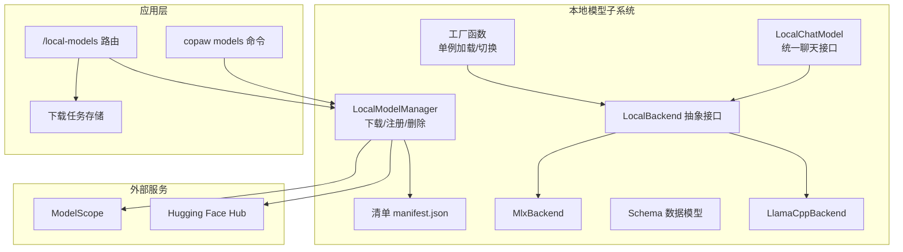
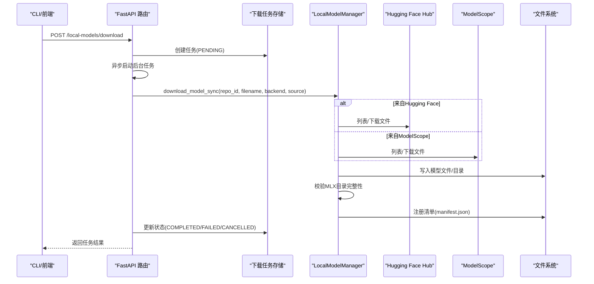
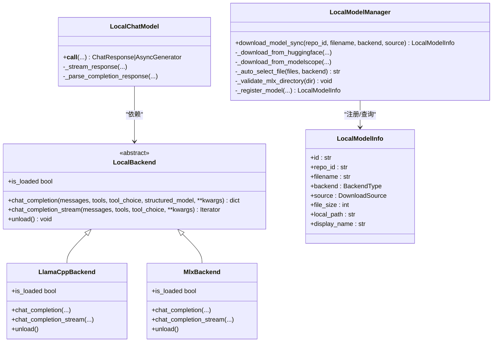
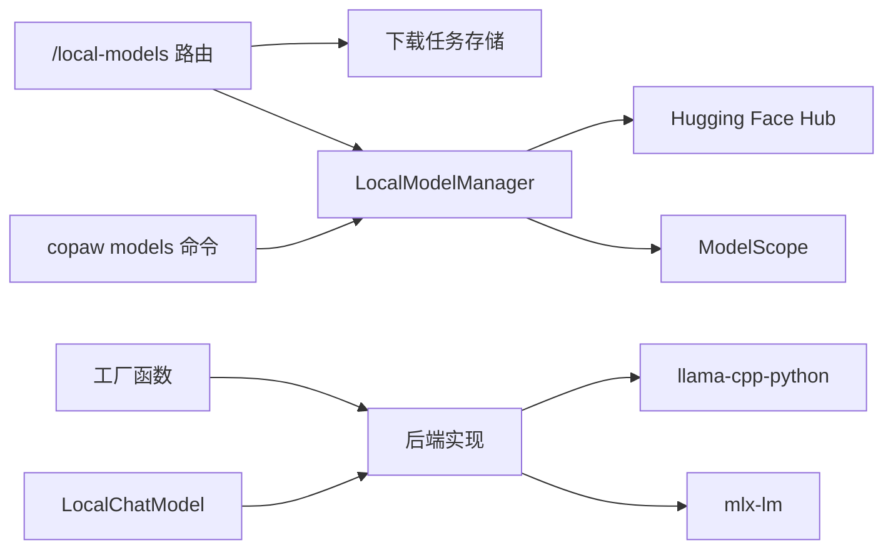
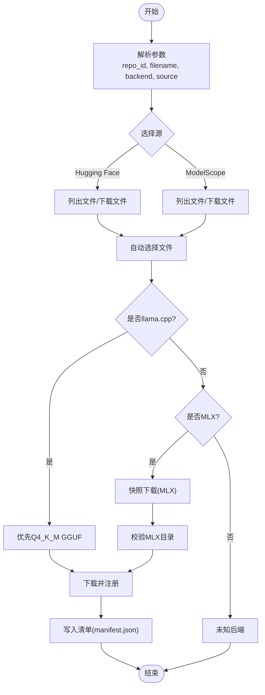

# 模型管理器

<cite>
**本文引用的文件**
- [manager.py](file://src/copaw/local_models/manager.py)
- [factory.py](file://src/copaw/local_models/factory.py)
- [schema.py](file://src/copaw/local_models/schema.py)
- [base.py](file://src/copaw/local_models/backends/base.py)
- [llamacpp_backend.py](file://src/copaw/local_models/backends/llamacpp_backend.py)
- [mlx_backend.py](file://src/copaw/local_models/backends/mlx_backend.py)
- [chat_model.py](file://src/copaw/local_models/chat_model.py)
- [local_models.py](file://src/copaw/app/routers/local_models.py)
- [download_task_store.py](file://src/copaw/app/download_task_store.py)
- [constant.py](file://src/copaw/constant.py)
- [providers_cmd.py](file://src/copaw/cli/providers_cmd.py)
</cite>

## 目录
1. [简介](#简介)
2. [项目结构](#项目结构)
3. [核心组件](#核心组件)
4. [架构总览](#架构总览)
5. [详细组件分析](#详细组件分析)
6. [依赖分析](#依赖分析)
7. [性能考虑](#性能考虑)
8. [故障排查指南](#故障排查指南)
9. [结论](#结论)
10. [附录](#附录)

## 简介
本文件面向CoPaw的本地模型管理器，系统性阐述其架构与实现细节，覆盖以下主题：
- 下载、注册、删除与清单管理机制
- Hugging Face Hub与ModelScope的集成（认证、文件列表获取、增量下载策略）
- 模型文件自动选择逻辑（GGUF优先级、量化级别判断、MLX目录完整性校验）
- 清单持久化存储、版本管理与跨平台兼容性
- 下载进度监控、网络异常处理与存储空间管理最佳实践

## 项目结构
本地模型管理相关代码主要位于src/copaw/local_models目录，并通过FastAPI路由与CLI命令对外提供能力；下载任务状态由内存存储维护，最终结果写入清单文件。

图表来源
- [manager.py:94-413](file://src/copaw/local_models/manager.py#L94-L413)
- [factory.py:42-125](file://src/copaw/local_models/factory.py#L42-L125)
- [base.py:12-64](file://src/copaw/local_models/backends/base.py#L12-L64)
- [llamacpp_backend.py:45-140](file://src/copaw/local_models/backends/llamacpp_backend.py#L45-L140)
- [mlx_backend.py:57-236](file://src/copaw/local_models/backends/mlx_backend.py#L57-L236)
- [chat_model.py:39-362](file://src/copaw/local_models/chat_model.py#L39-L362)
- [local_models.py:94-320](file://src/copaw/app/routers/local_models.py#L94-L320)
- [download_task_store.py:26-131](file://src/copaw/app/download_task_store.py#L26-L131)
- [constant.py:145-146](file://src/copaw/constant.py#L145-L146)

章节来源
- [manager.py:1-413](file://src/copaw/local_models/manager.py#L1-L413)
- [local_models.py:1-320](file://src/copaw/app/routers/local_models.py#L1-L320)
- [download_task_store.py:1-131](file://src/copaw/app/download_task_store.py#L1-L131)
- [constant.py:145-146](file://src/copaw/constant.py#L145-L146)

## 核心组件
- LocalModelManager：负责从Hugging Face或ModelScope下载模型，自动选择文件，校验MLX目录完整性，并将模型注册到清单中。
- 工厂函数：以单例模式创建/复用LocalChatModel，按需卸载旧模型并加载新模型。
- 后端抽象与实现：LocalBackend定义统一接口，LlamaCppBackend与MlxBackend分别封装llama.cpp与mlx-lm。
- LocalChatModel：适配agentscope的ChatModelBase，支持同步/异步推理与流式输出。
- Schema：定义枚举类型、数据模型与清单结构。
- 应用路由与CLI：提供REST API与命令行入口，管理下载任务与本地模型生命周期。
- 下载任务存储：在内存中跟踪任务状态（待处理/下载中/完成/失败/取消）。
- 常量：定义工作目录与模型目录路径，确保跨平台一致性。

章节来源
- [manager.py:94-413](file://src/copaw/local_models/manager.py#L94-L413)
- [factory.py:42-125](file://src/copaw/local_models/factory.py#L42-L125)
- [schema.py:12-59](file://src/copaw/local_models/schema.py#L12-L59)
- [base.py:12-64](file://src/copaw/local_models/backends/base.py#L12-L64)
- [llamacpp_backend.py:45-140](file://src/copaw/local_models/backends/llamacpp_backend.py#L45-L140)
- [mlx_backend.py:57-236](file://src/copaw/local_models/backends/mlx_backend.py#L57-L236)
- [chat_model.py:39-362](file://src/copaw/local_models/chat_model.py#L39-L362)
- [local_models.py:94-320](file://src/copaw/app/routers/local_models.py#L94-L320)
- [download_task_store.py:26-131](file://src/copaw/app/download_task_store.py#L26-L131)
- [constant.py:145-146](file://src/copaw/constant.py#L145-L146)

## 架构总览
本地模型管理器采用“清单驱动 + 多后端适配”的架构：
- 清单（manifest.json）持久化记录已下载模型元信息，支持按后端过滤查询。
- 下载流程：解析参数 → 选择源（HF/MS）→ 自动选择文件（GGUF优先/MLX目录完整性）→ 下载并注册 → 更新清单。
- 推理流程：工厂函数按需加载后端 → LocalChatModel统一对外接口 → 支持流式/非流式输出。
- 任务管理：后台任务在线程池执行下载，状态通过内存存储与前端轮询交互。

图表来源
- [local_models.py:123-256](file://src/copaw/app/routers/local_models.py#L123-L256)
- [download_task_store.py:43-131](file://src/copaw/app/download_task_store.py#L43-L131)
- [manager.py:98-292](file://src/copaw/local_models/manager.py#L98-L292)

章节来源
- [local_models.py:94-320](file://src/copaw/app/routers/local_models.py#L94-L320)
- [download_task_store.py:1-131](file://src/copaw/app/download_task_store.py#L1-L131)
- [manager.py:94-292](file://src/copaw/local_models/manager.py#L94-L292)

## 详细组件分析

### 清单与持久化
- 清单路径：工作目录下的models子目录，文件名为manifest.json。
- 加载/保存：读取JSON并进行校验，错误时回退为空清单；保存时使用UTF-8编码与缩进格式。
- 查询与删除：支持按后端过滤列出，按ID删除并清理文件/空目录。

章节来源
- [manager.py:22-86](file://src/copaw/local_models/manager.py#L22-L86)
- [constant.py:145-146](file://src/copaw/constant.py#L145-L146)

### 下载与注册
- 同步下载入口：根据源（HF/MS）与后端（llamacpp/mlx）调用对应下载方法。
- 文件自动选择：
  - llama.cpp：优先GGUF文件，偏好Q4_K_M量化；若无则报错。
  - MLX：优先safetensors文件，触发完整仓库下载。
- MLX目录完整性校验：要求存在config.json与至少一个顶层safetensors文件，避免半成品。
- 注册流程：计算文件大小（目录递归排除隐藏项），生成唯一ID与显示名，写入清单。

章节来源
- [manager.py:98-413](file://src/copaw/local_models/manager.py#L98-L413)
- [schema.py:22-59](file://src/copaw/local_models/schema.py#L22-L59)

### 后端适配与推理
- 抽象接口：统一初始化、聊天补全（含结构化输出）、流式补全与资源释放。
- llama.cpp后端：消息规范化（内容为字符串、工具调用列表），构造llama-cpp参数并调用。
- MLX后端：解析消息为模板字符串，构建采样器参数，流式生成并聚合token统计。
- 工厂函数：单例模式，按需卸载/加载，支持传入后端参数与生成参数。

章节来源
- [base.py:12-64](file://src/copaw/local_models/backends/base.py#L12-L64)
- [llamacpp_backend.py:45-140](file://src/copaw/local_models/backends/llamacpp_backend.py#L45-L140)
- [mlx_backend.py:57-236](file://src/copaw/local_models/backends/mlx_backend.py#L57-L236)
- [factory.py:42-125](file://src/copaw/local_models/factory.py#L42-L125)

### 统一聊天模型
- LocalChatModel：将后端输出映射为agentscope的ChatResponse，支持思维块与工具调用解析，聚合usage信息。
- 流式处理：通过线程池包装后端同步迭代器，异步队列向客户端推送增量。

章节来源
- [chat_model.py:39-362](file://src/copaw/local_models/chat_model.py#L39-L362)

### 应用路由与CLI
- FastAPI路由：
  - GET /local-models：列出本地模型（可按后端过滤）。
  - POST /local-models/download：创建后台下载任务，返回任务ID。
  - GET /local-models/download-status：查询活动任务。
  - DELETE /local-models/{model_id}：删除本地模型。
  - POST /local-models/cancel-download/{task_id}：取消任务。
- CLI命令：
  - copaw models download：同步下载模型。
  - copaw models local：列出本地模型。
  - copaw models remove-local：删除本地模型。

章节来源
- [local_models.py:94-320](file://src/copaw/app/routers/local_models.py#L94-L320)
- [providers_cmd.py:636-787](file://src/copaw/cli/providers_cmd.py#L636-L787)

### 下载任务存储
- 任务状态：PENDING/DOWNLOADING/COMPLETED/FAILED/CANCELLED。
- 并发支持：线程安全字典存储，支持创建、查询、更新状态、取消与清理已完成任务。

章节来源
- [download_task_store.py:18-131](file://src/copaw/app/download_task_store.py#L18-L131)

### 类关系图

图表来源
- [manager.py:94-413](file://src/copaw/local_models/manager.py#L94-L413)
- [base.py:12-64](file://src/copaw/local_models/backends/base.py#L12-L64)
- [llamacpp_backend.py:45-140](file://src/copaw/local_models/backends/llamacpp_backend.py#L45-L140)
- [mlx_backend.py:57-236](file://src/copaw/local_models/backends/mlx_backend.py#L57-L236)
- [chat_model.py:39-362](file://src/copaw/local_models/chat_model.py#L39-L362)
- [schema.py:22-59](file://src/copaw/local_models/schema.py#L22-L59)

## 依赖分析
- 外部库依赖：
  - Hugging Face Hub：用于文件列表与单文件/快照下载。
  - ModelScope：用于文件列表与单文件下载，MLX场景下使用快照下载。
  - llama-cpp-python：llama.cpp后端推理。
  - mlx-lm：MLX后端推理。
- 内部模块耦合：
  - 路由依赖下载任务存储与LocalModelManager。
  - CLI命令依赖LocalModelManager与枚举类型。
  - 工厂函数依赖LocalModelInfo与后端实现。
  - LocalChatModel依赖后端接口与标签解析工具。

图表来源
- [local_models.py:123-256](file://src/copaw/app/routers/local_models.py#L123-L256)
- [download_task_store.py:43-131](file://src/copaw/app/download_task_store.py#L43-L131)
- [manager.py:125-292](file://src/copaw/local_models/manager.py#L125-L292)
- [factory.py:110-125](file://src/copaw/local_models/factory.py#L110-L125)
- [chat_model.py:39-362](file://src/copaw/local_models/chat_model.py#L39-L362)

章节来源
- [local_models.py:1-320](file://src/copaw/app/routers/local_models.py#L1-L320)
- [download_task_store.py:1-131](file://src/copaw/app/download_task_store.py#L1-L131)
- [manager.py:1-413](file://src/copaw/local_models/manager.py#L1-L413)
- [factory.py:1-125](file://src/copaw/local_models/factory.py#L1-L125)
- [chat_model.py:1-362](file://src/copaw/local_models/chat_model.py#L1-L362)

## 性能考虑
- 目录大小统计：遍历模型目录时排除隐藏目录与临时目录，避免误计与IO开销。
- 单例加载：工厂函数避免重复加载同一模型，减少内存与显存占用。
- 流式输出：后端同步迭代器通过线程池与异步队列解耦，降低主线程阻塞。
- 任务并发：后台任务独立执行，支持取消与清理，避免阻塞主服务。

章节来源
- [manager.py:374-386](file://src/copaw/local_models/manager.py#L374-L386)
- [factory.py:77-107](file://src/copaw/local_models/factory.py#L77-L107)
- [chat_model.py:96-127](file://src/copaw/local_models/chat_model.py#L96-L127)

## 故障排查指南
- 清单损坏：加载manifest.json失败时会记录警告并重新初始化空清单。
- 未安装依赖：下载时缺少huggingface_hub或modelscope会抛出导入异常，提示安装相应可选包。
- MLX目录不完整：缺失config.json或顶层safetensors文件会抛出运行时错误，建议删除目录后重试。
- 下载被取消：任务状态为CANCELLED时会尝试删除已下载模型并清理。
- 网络异常：下载过程异常会被捕获并标记为FAILED，前端可通过轮询获取错误详情。

章节来源
- [manager.py:30-37](file://src/copaw/local_models/manager.py#L30-L37)
- [manager.py:131-136](file://src/copaw/local_models/manager.py#L131-L136)
- [manager.py:206-223](file://src/copaw/local_models/manager.py#L206-L223)
- [manager.py:332-361](file://src/copaw/local_models/manager.py#L332-L361)
- [local_models.py:188-254](file://src/copaw/app/routers/local_models.py#L188-L254)

## 结论
CoPaw的本地模型管理器以清单为中心，结合多后端适配与任务存储，提供了从下载、注册、删除到推理使用的完整闭环。通过自动文件选择与MLX目录校验，保证了模型可用性；通过单例加载与流式输出优化了资源与性能。未来可在以下方面持续改进：
- 增加断点续传与增量下载策略（基于文件哈希/ETag）。
- 扩展下载进度事件推送（WebSocket/Server-Sent Events）。
- 提供更细粒度的存储空间配额与清理策略。
- 完善认证配置（凭据加密存储、令牌刷新）。

## 附录

### 下载流程算法

图表来源
- [manager.py:125-330](file://src/copaw/local_models/manager.py#L125-L330)