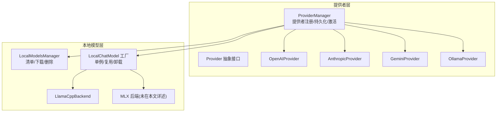
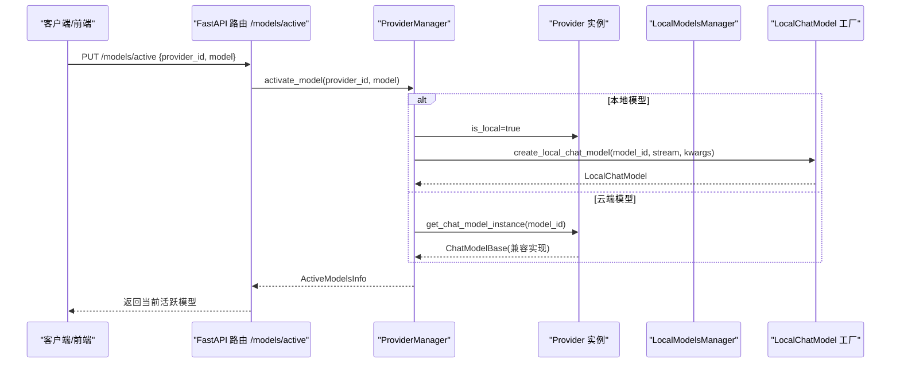
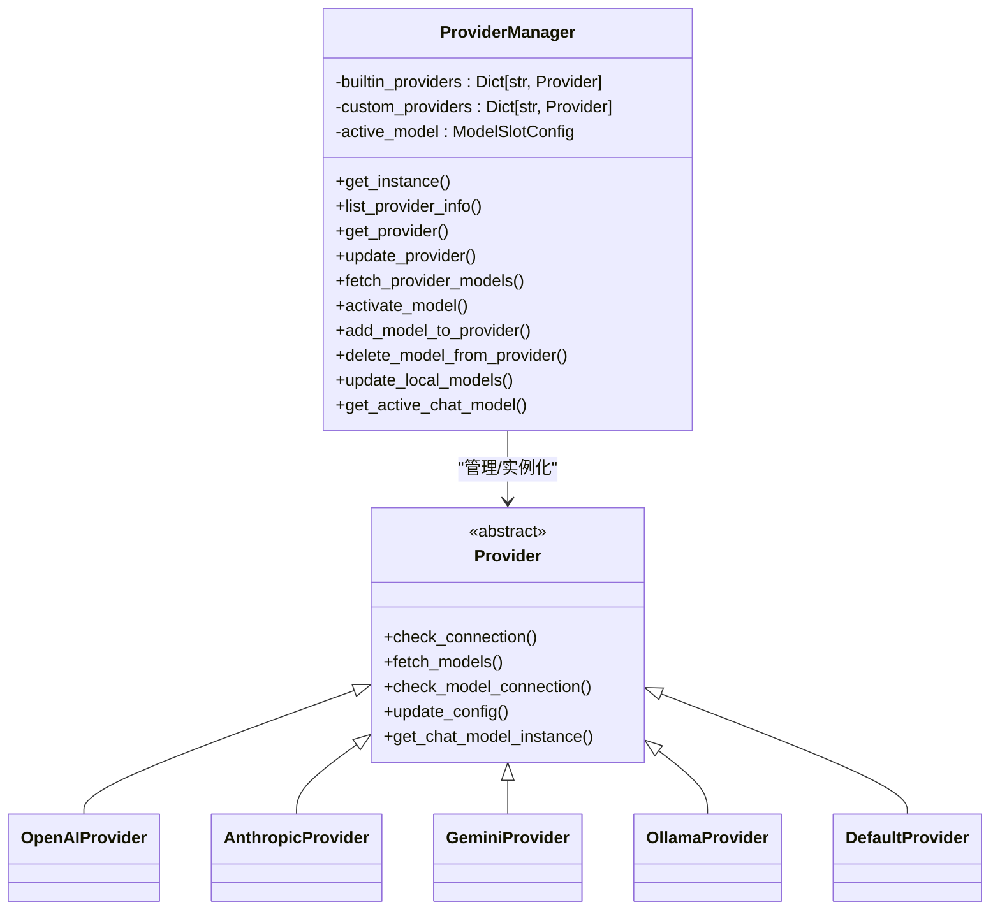
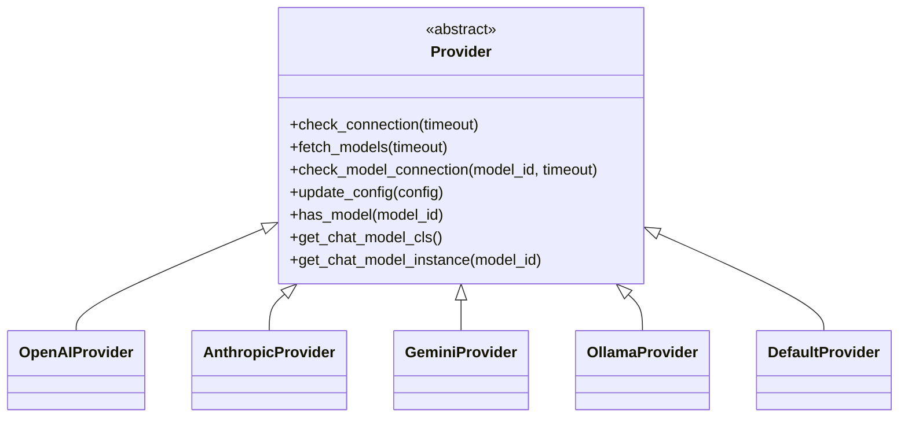
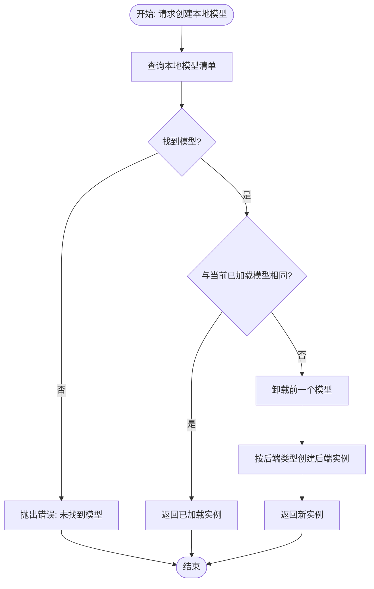
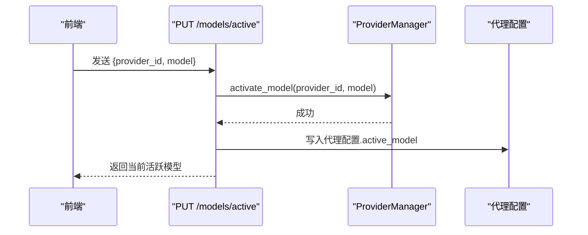
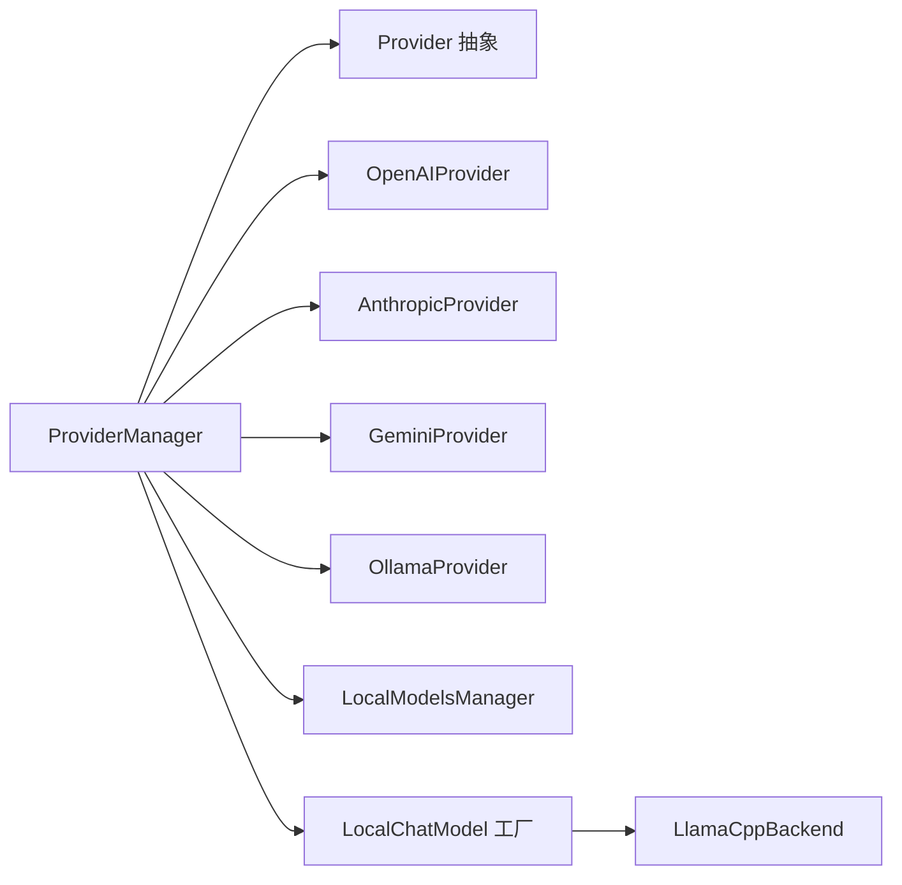

# 模型管理系统

<cite>
**本文引用的文件**
- [provider_manager.py](file://src/copaw/providers/provider_manager.py)
- [provider.py](file://src/copaw/providers/provider.py)
- [openai_provider.py](file://src/copaw/providers/openai_provider.py)
- [anthropic_provider.py](file://src/copaw/providers/anthropic_provider.py)
- [gemini_provider.py](file://src/copaw/providers/gemini_provider.py)
- [ollama_provider.py](file://src/copaw/providers/ollama_provider.py)
- [models.py](file://src/copaw/providers/models.py)
- [manager.py](file://src/copaw/local_models/manager.py)
- [factory.py](file://src/copaw/local_models/factory.py)
- [llamacpp_backend.py](file://src/copaw/local_models/backends/llamacpp_backend.py)
- [schema.py](file://src/copaw/local_models/schema.py)
- [providers.py](file://src/copaw/app/routers/providers.py)
</cite>

## 目录
1. [简介](#简介)
2. [项目结构](#项目结构)
3. [核心组件](#核心组件)
4. [架构总览](#架构总览)
5. [详细组件分析](#详细组件分析)
6. [依赖关系分析](#依赖关系分析)
7. [性能考虑](#性能考虑)
8. [故障排查指南](#故障排查指南)
9. [结论](#结论)
10. [附录：配置与最佳实践](#附录配置与最佳实践)

## 简介
本文件面向CoPaw的模型管理系统，系统性阐述提供者管理器（ProviderManager）的架构设计与动态加载机制，覆盖云模型提供者（OpenAI、Anthropic、Google Gemini等）与本地模型后端（llama.cpp、MLX、Ollama等）的集成实现。文档同时提供模型配置、连接管理、模型发现与持久化、以及从基础配置到高级定制的完整知识体系，并给出性能优化、模型切换、故障转移与成本控制的最佳实践。

## 项目结构
CoPaw的模型管理由“提供者层”和“本地模型层”构成：
- 提供者层：统一抽象Provider接口，内置多家云厂商提供者，支持自定义提供者；通过ProviderManager集中管理、持久化与动态加载。
- 本地模型层：统一本地模型清单与下载、注册、删除流程；按后端类型（llama.cpp、MLX）实例化本地聊天模型，支持单例复用与资源释放。

图表来源
- [provider_manager.py:288-717](file://src/copaw/providers/provider_manager.py#L288-L717)
- [provider.py:73-231](file://src/copaw/providers/provider.py#L73-L231)
- [openai_provider.py:18-157](file://src/copaw/providers/openai_provider.py#L18-L157)
- [anthropic_provider.py:18-156](file://src/copaw/providers/anthropic_provider.py#L18-L156)
- [gemini_provider.py:17-131](file://src/copaw/providers/gemini_provider.py#L17-L131)
- [ollama_provider.py:19-179](file://src/copaw/providers/ollama_provider.py#L19-L179)
- [manager.py:52-413](file://src/copaw/local_models/manager.py#L52-L413)
- [factory.py:42-125](file://src/copaw/local_models/factory.py#L42-L125)
- [llamacpp_backend.py:45-140](file://src/copaw/local_models/backends/llamacpp_backend.py#L45-L140)

章节来源
- [provider_manager.py:288-717](file://src/copaw/providers/provider_manager.py#L288-L717)
- [manager.py:52-413](file://src/copaw/local_models/manager.py#L52-L413)

## 核心组件
- ProviderManager：提供者注册、持久化、迁移、动态加载与激活；负责将“全局/代理特定”的活跃模型槽位映射到具体提供者与模型。
- Provider 抽象：定义统一的连接检查、模型发现、模型可用性检查、配置更新与聊天模型实例化接口。
- 具体提供者：OpenAIProvider、AnthropicProvider、GeminiProvider、OllamaProvider等，分别对接不同协议与SDK。
- 本地模型工厂与后端：LocalChatModel工厂采用单例模式，按需加载/卸载本地模型；llama.cpp后端封装llama-cpp-python调用。

章节来源
- [provider_manager.py:288-717](file://src/copaw/providers/provider_manager.py#L288-L717)
- [provider.py:73-231](file://src/copaw/providers/provider.py#L73-L231)
- [openai_provider.py:18-157](file://src/copaw/providers/openai_provider.py#L18-L157)
- [anthropic_provider.py:18-156](file://src/copaw/providers/anthropic_provider.py#L18-L156)
- [gemini_provider.py:17-131](file://src/copaw/providers/gemini_provider.py#L17-L131)
- [ollama_provider.py:19-179](file://src/copaw/providers/ollama_provider.py#L19-L179)
- [factory.py:42-125](file://src/copaw/local_models/factory.py#L42-L125)
- [llamacpp_backend.py:45-140](file://src/copaw/local_models/backends/llamacpp_backend.py#L45-L140)

## 架构总览
下图展示“请求激活模型”到“返回聊天模型实例”的端到端流程，涵盖云模型与本地模型两条路径。

图表来源
- [providers.py:400-437](file://src/copaw/app/routers/providers.py#L400-L437)
- [provider_manager.py:452-468](file://src/copaw/providers/provider_manager.py#L452-L468)
- [provider_manager.py:716-717](file://src/copaw/providers/provider_manager.py#L716-L717)
- [factory.py:42-125](file://src/copaw/local_models/factory.py#L42-L125)

## 详细组件分析

### 提供者管理器（ProviderManager）
- 单例模式与持久化：使用私有目录存储“内置/自定义”提供者配置与“活跃模型”槽位，启动时完成迁移与初始化。
- 内置提供者：预置多家云厂商与本地提供者，部分提供者冻结URL或不支持连接检查以适配特殊场景。
- 动态加载与激活：支持运行时更新提供者配置、拉取模型列表、添加/删除用户自定义模型；激活后写入全局或代理特定的活跃模型槽位。
- 本地模型同步：扫描已下载本地模型，填充本地提供者（llama.cpp、MLX）的模型列表。

图表来源
- [provider_manager.py:288-717](file://src/copaw/providers/provider_manager.py#L288-L717)
- [provider.py:73-231](file://src/copaw/providers/provider.py#L73-L231)
- [openai_provider.py:18-157](file://src/copaw/providers/openai_provider.py#L18-L157)
- [anthropic_provider.py:18-156](file://src/copaw/providers/anthropic_provider.py#L18-L156)
- [gemini_provider.py:17-131](file://src/copaw/providers/gemini_provider.py#L17-L131)
- [ollama_provider.py:19-179](file://src/copaw/providers/ollama_provider.py#L19-L179)

章节来源
- [provider_manager.py:288-717](file://src/copaw/providers/provider_manager.py#L288-L717)

### Provider 抽象与具体实现
- Provider 抽象：定义统一接口，包括连接检查、模型发现、模型可用性检查、配置更新、模型存在性判断与聊天模型类解析。
- OpenAIProvider：封装AsyncOpenAI客户端，支持模型列表与单模型连通性测试，兼容DashScope等兼容端点。
- AnthropicProvider：封装AsyncAnthropic客户端，支持模型列表与消息流式测试。
- GeminiProvider：封装genai客户端，支持异步模型列表与内容生成流式测试。
- OllamaProvider：封装ollama AsyncClient，支持模型拉取/删除与本地托管场景的OpenAI兼容端点。

图表来源
- [provider.py:73-231](file://src/copaw/providers/provider.py#L73-L231)
- [openai_provider.py:18-157](file://src/copaw/providers/openai_provider.py#L18-L157)
- [anthropic_provider.py:18-156](file://src/copaw/providers/anthropic_provider.py#L18-L156)
- [gemini_provider.py:17-131](file://src/copaw/providers/gemini_provider.py#L17-L131)
- [ollama_provider.py:19-179](file://src/copaw/providers/ollama_provider.py#L19-L179)
- [provider.py:204-231](file://src/copaw/providers/provider.py#L204-L231)

章节来源
- [provider.py:73-231](file://src/copaw/providers/provider.py#L73-L231)
- [openai_provider.py:18-157](file://src/copaw/providers/openai_provider.py#L18-L157)
- [anthropic_provider.py:18-156](file://src/copaw/providers/anthropic_provider.py#L18-L156)
- [gemini_provider.py:17-131](file://src/copaw/providers/gemini_provider.py#L17-L131)
- [ollama_provider.py:19-179](file://src/copaw/providers/ollama_provider.py#L19-L179)

### 本地模型管理与工厂
- LocalModelsManager：负责本地模型清单（manifest.json）的读写、模型下载（HF/ModelScope）、删除与自动文件选择策略。
- LocalChatModel 工厂：采用单例模式，避免重复加载；支持按需卸载与重用；根据模型后端类型选择对应后端实现。
- LlamaCppBackend：封装llama-cpp-python，处理消息归一化、工具调用、结构化输出响应格式等细节。

图表来源
- [factory.py:42-125](file://src/copaw/local_models/factory.py#L42-L125)
- [manager.py:52-413](file://src/copaw/local_models/manager.py#L52-L413)
- [llamacpp_backend.py:45-140](file://src/copaw/local_models/backends/llamacpp_backend.py#L45-L140)

章节来源
- [manager.py:52-413](file://src/copaw/local_models/manager.py#L52-L413)
- [factory.py:42-125](file://src/copaw/local_models/factory.py#L42-L125)
- [llamacpp_backend.py:45-140](file://src/copaw/local_models/backends/llamacpp_backend.py#L45-L140)

### API 路由与模型激活
- FastAPI 路由提供对提供者配置、模型发现、连接测试、模型增删与活跃模型设置的REST接口。
- 激活模型时优先读取代理特定配置，失败回退至全局配置；成功后写回代理配置以便会话复用。

图表来源
- [providers.py:400-437](file://src/copaw/app/routers/providers.py#L400-L437)

章节来源
- [providers.py:400-437](file://src/copaw/app/routers/providers.py#L400-L437)

## 依赖关系分析
- ProviderManager 依赖 Provider 抽象与各具体提供者实现，同时依赖本地模型管理模块以同步本地模型列表。
- 具体提供者依赖各自SDK（如openai、anthropic、google.genai、ollama），并通过AgentScope的聊天模型类进行实例化。
- 本地模型工厂依赖后端实现（llama.cpp/MLX），并在单例锁保护下进行加载/卸载。

图表来源
- [provider_manager.py:288-717](file://src/copaw/providers/provider_manager.py#L288-L717)
- [provider.py:73-231](file://src/copaw/providers/provider.py#L73-L231)
- [openai_provider.py:18-157](file://src/copaw/providers/openai_provider.py#L18-L157)
- [anthropic_provider.py:18-156](file://src/copaw/providers/anthropic_provider.py#L18-L156)
- [gemini_provider.py:17-131](file://src/copaw/providers/gemini_provider.py#L17-L131)
- [ollama_provider.py:19-179](file://src/copaw/providers/ollama_provider.py#L19-L179)
- [manager.py:52-413](file://src/copaw/local_models/manager.py#L52-L413)
- [factory.py:42-125](file://src/copaw/local_models/factory.py#L42-L125)
- [llamacpp_backend.py:45-140](file://src/copaw/local_models/backends/llamacpp_backend.py#L45-L140)

章节来源
- [provider_manager.py:288-717](file://src/copaw/providers/provider_manager.py#L288-L717)

## 性能考虑
- 本地模型单例复用：避免重复加载导致的内存与显存占用上升，减少冷启动延迟。
- 流式输出：默认开启流式生成，降低首字延迟并提升交互体验。
- 生成参数：通过generate_kwargs传递温度、top_p等参数，结合任务特性微调推理质量与速度。
- 连接超时与重试：提供者连接检查与模型连通性测试均设置合理超时，避免阻塞主线程。
- 本地后端参数：llama.cpp可调整上下文长度与GPU分层数，MLX模型需保证权重与配置文件完整性。

[本节为通用性能建议，无需特定文件引用]

## 故障排查指南
- 连接失败
  - 检查API密钥与基础URL是否正确；可通过“测试连接”接口快速验证。
  - 对于自定义提供者，UI可能禁用连接检查以避免误判。
- 模型不可用
  - 使用“测试模型”接口验证指定模型是否可达；若失败，确认模型ID拼写与权限。
- 本地模型问题
  - 若模型未出现在本地提供者列表中，先执行下载并注册，再刷新本地模型列表。
  - MLX模型需确保包含必要配置文件与权重文件，否则会触发完整性校验失败。
- Ollama 集成
  - 缺少Python SDK会导致导入异常；请按要求安装相应依赖包。
  - 确认Ollama服务地址与网络可达性。

章节来源
- [providers.py:206-300](file://src/copaw/app/routers/providers.py#L206-L300)
- [ollama_provider.py:69-118](file://src/copaw/providers/ollama_provider.py#L69-L118)
- [manager.py:332-362](file://src/copaw/local_models/manager.py#L332-L362)

## 结论
CoPaw的模型管理系统通过ProviderManager实现了对多源提供者的统一管理与动态加载，既支持主流云模型（OpenAI、Anthropic、Gemini等），也覆盖本地模型后端（llama.cpp、MLX、Ollama）。配合清单化的模型发现、连接测试与活跃模型槽位机制，系统在易用性、可扩展性与安全性方面达到良好平衡。建议在生产环境中结合代理特定配置、流式输出与合理的生成参数，持续监控成本与性能表现。

[本节为总结性内容，无需特定文件引用]

## 附录：配置与最佳实践

### 基础配置要点
- 提供者配置
  - 可通过路由接口更新API密钥、基础URL与生成参数；部分提供者支持模型发现与连接测试。
- 活跃模型
  - 支持全局与代理特定两种方式；优先读取代理配置，失败回退全局配置。
- 本地模型
  - 下载完成后自动注册到清单；工厂按需加载并复用，避免重复占用资源。

章节来源
- [providers.py:84-122](file://src/copaw/app/routers/providers.py#L84-L122)
- [providers.py:361-437](file://src/copaw/app/routers/providers.py#L361-L437)
- [manager.py:52-87](file://src/copaw/local_models/manager.py#L52-L87)
- [factory.py:42-125](file://src/copaw/local_models/factory.py#L42-L125)

### 高级定制与运维
- 自定义提供者
  - 通过创建自定义提供者接口注入新的协议或兼容端点；注意UI对连接检查的支持策略。
- 模型发现与增删
  - 使用“发现模型”接口拉取最新模型列表；按需添加/删除用户自定义模型。
- 本地模型管理
  - 通过清单管理模型生命周期；删除模型会清理磁盘文件并更新清单。

章节来源
- [providers.py:124-188](file://src/copaw/app/routers/providers.py#L124-L188)
- [providers.py:238-359](file://src/copaw/app/routers/providers.py#L238-L359)
- [manager.py:69-87](file://src/copaw/local_models/manager.py#L69-L87)

### 性能优化建议
- 本地模型
  - llama.cpp：根据硬件能力调整上下文长度与GPU分层；优先选择量化模型以降低显存占用。
  - MLX：确保完整下载模型目录，避免部分文件缺失导致加载失败。
- 云端模型
  - 合理设置生成参数，减少不必要的token消耗；启用流式输出改善交互体验。
- 连接与超时
  - 为不同网络环境设置合适的超时时间；对不稳定网络启用重试策略。

章节来源
- [llamacpp_backend.py:45-140](file://src/copaw/local_models/backends/llamacpp_backend.py#L45-L140)
- [openai_provider.py:50-77](file://src/copaw/providers/openai_provider.py#L50-L77)
- [anthropic_provider.py:57-77](file://src/copaw/providers/anthropic_provider.py#L57-L77)
- [gemini_provider.py:58-91](file://src/copaw/providers/gemini_provider.py#L58-L91)

### 模型切换、故障转移与成本控制
- 切换策略
  - 在代理配置中设置活跃模型，便于在不同任务间快速切换；失败时回退至全局配置。
- 故障转移
  - 当某提供者或模型不可用时，优先尝试其他提供者或模型；结合连接测试与模型可用性检查实现自动化切换。
- 成本控制
  - 通过生成参数限制输出长度与采样多样性；定期清理未使用的本地模型与云端模型缓存；对高成本模型采用限流与队列策略。

章节来源
- [providers.py:361-437](file://src/copaw/app/routers/providers.py#L361-L437)
- [provider_manager.py:452-468](file://src/copaw/providers/provider_manager.py#L452-L468)