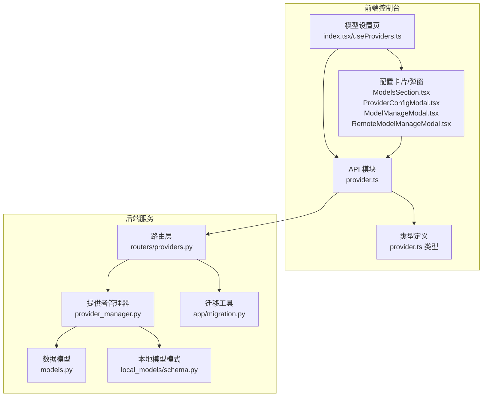
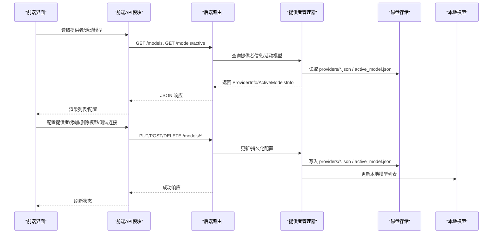
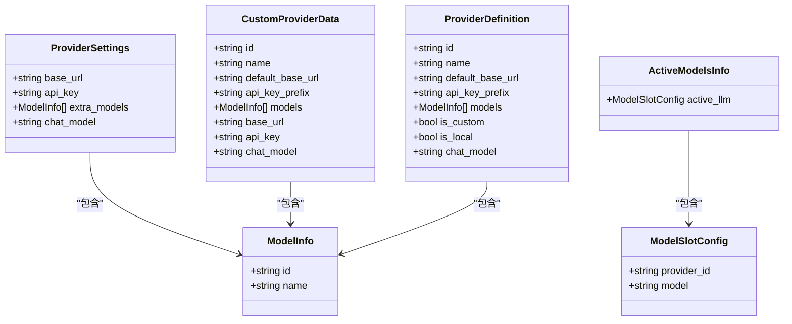
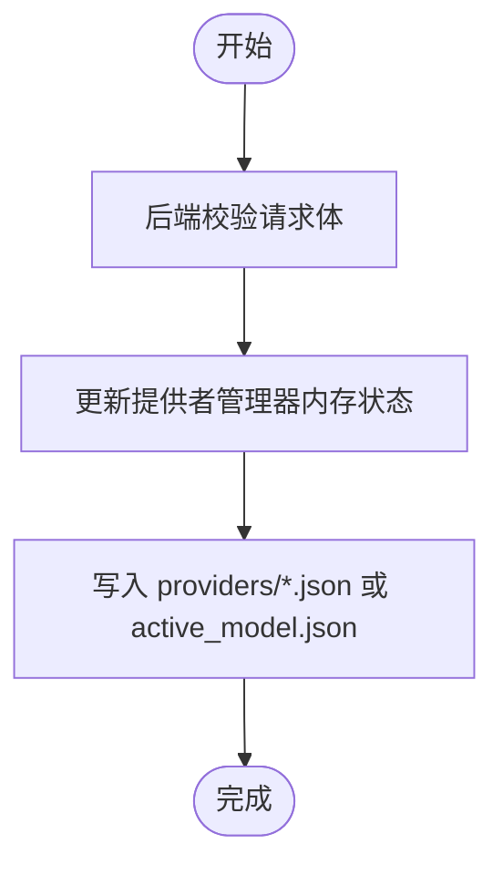
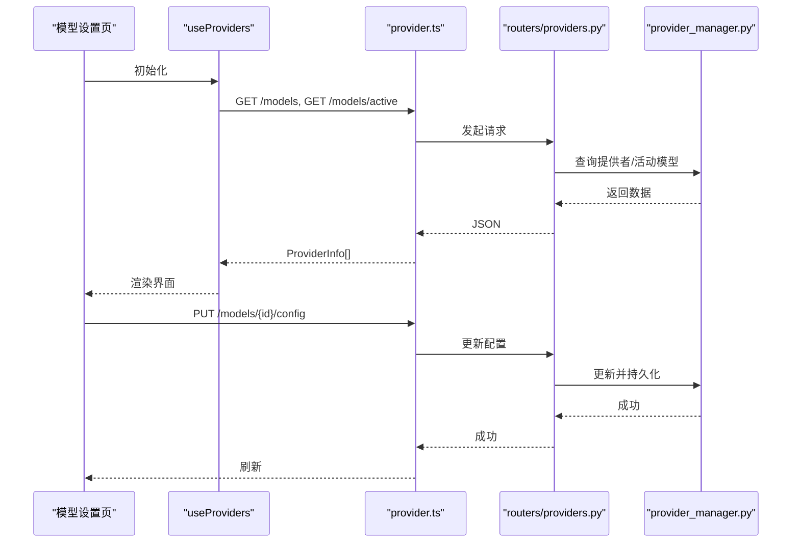
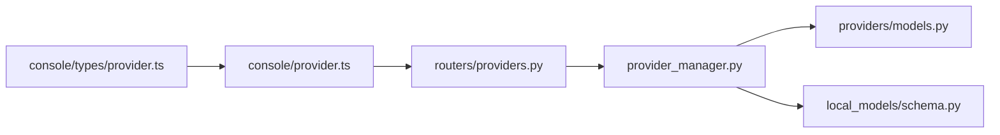

# 模型配置管理

<cite>
**本文引用的文件**
- [src\copaw\providers\models.py](file://src\copaw\providers\models.py)
- [src\copaw\providers\provider_manager.py](file://src\copaw\providers\provider_manager.py)
- [src\copaw\app\routers\providers.py](file://src\copaw\app\routers\providers.py)
- [src\copaw\local_models\schema.py](file://src\copaw\local_models\schema.py)
- [src\copaw\app\migration.py](file://src\copaw\app\migration.py)
- [console\src\api\modules\provider.ts](file://console\src\api\modules\provider.ts)
- [console\src\api\types\provider.ts](file://console\src\api\types\provider.ts)
- [console\src\pages\Settings\Models\index.tsx](file://console\src\pages\Settings\Models\index.tsx)
- [console\src\pages\Settings\Models\useProviders.ts](file://console\src\pages\Settings\Models\useProviders.ts)
- [console\src\pages\Settings\Models\components\sections\ModelsSection.tsx](file://console\src\pages\Settings\Models\components\sections\ModelsSection.tsx)
- [console\src\pages\Settings\Models\components\ModelManageModal.tsx](file://console\src\pages\Settings\Models\components\ModelManageModal.tsx)
- [console\src\pages\Settings\Models\components\modals\RemoteModelManageModal.tsx](file://console\src\pages\Settings\Models\components\modals\RemoteModelManageModal.tsx)
- [console\src\pages\Settings\Models\components\modals\ProviderConfigModal.tsx](file://console\src\pages\Settings\Models\components\modals\ProviderConfigModal.tsx)
</cite>

## 目录
1. [简介](#简介)
2. [项目结构](#项目结构)
3. [核心组件](#核心组件)
4. [架构总览](#架构总览)
5. [详细组件分析](#详细组件分析)
6. [依赖分析](#依赖分析)
7. [性能考虑](#性能考虑)
8. [故障排查指南](#故障排查指南)
9. [结论](#结论)
10. [附录](#附录)

## 简介
本文件系统性阐述 CoPaw 的“模型配置管理”能力，覆盖数据模型设计（ModelInfo、ProviderInfo、ModelSlotConfig）、配置验证与序列化、前后端交互流程、配置继承与默认值策略、冲突处理、模板与批量操作、导入导出、迁移与版本兼容性以及数据完整性保障。目标是帮助开发者与运维人员快速理解并正确使用模型配置管理功能。

## 项目结构
围绕模型配置管理的关键代码分布在后端 Python 包与前端控制台两部分：
- 后端：提供数据模型定义、提供者管理器、FastAPI 路由与持久化逻辑
- 前端：提供者列表、配置编辑、模型增删测、活动模型设置等页面与交互

图表来源
- [console\src\api\modules\provider.ts:1-91](file://console\src\api\modules\provider.ts#L1-L91)
- [console\src\api\types\provider.ts:1-49](file://console\src\api\types\provider.ts#L1-L49)
- [console\src\pages\Settings\Models\index.tsx:1-115](file://console\src\pages\Settings\Models\index.tsx#L1-L115)
- [console\src\pages\Settings\Models\useProviders.ts:1-56](file://console\src\pages\Settings\Models\useProviders.ts#L1-L56)
- [src\copaw\providers\models.py:1-81](file://src\copaw\providers\models.py#L1-L81)
- [src\copaw\providers\provider_manager.py:1-717](file://src\copaw\providers\provider_manager.py#L1-L717)
- [src\copaw\app\routers\providers.py:1-437](file://src\copaw\app\routers\providers.py#L1-L437)
- [src\copaw\local_models\schema.py:1-59](file://src\copaw\local_models\schema.py#L1-L59)
- [src\copaw\app\migration.py:1-312](file://src\copaw\app\migration.py#L1-L312)

章节来源
- [console\src\api\modules\provider.ts:1-91](file://console\src\api\modules\provider.ts#L1-L91)
- [console\src\api\types\provider.ts:1-49](file://console\src\api\types\provider.ts#L1-L49)
- [console\src\pages\Settings\Models\index.tsx:1-115](file://console\src\pages\Settings\Models\index.tsx#L1-L115)
- [console\src\pages\Settings\Models\useProviders.ts:1-56](file://console\src\pages\Settings\Models\useProviders.ts#L1-L56)
- [src\copaw\providers\models.py:1-81](file://src\copaw\providers\models.py#L1-L81)
- [src\copaw\providers\provider_manager.py:1-717](file://src\copaw\providers\provider_manager.py#L1-L717)
- [src\copaw\app\routers\providers.py:1-437](file://src\copaw\app\routers\providers.py#L1-L437)
- [src\copaw\local_models\schema.py:1-59](file://src\copaw\local_models\schema.py#L1-L59)
- [src\copaw\app\migration.py:1-312](file://src\copaw\app\migration.py#L1-L312)

## 核心组件
- 数据模型
  - ModelInfo：模型标识与显示名
  - ProviderDefinition/ProviderSettings/CustomProviderData：提供者静态定义、用户设置与自定义提供者持久化数据
  - ModelSlotConfig：当前激活的提供者与模型槽位
  - ActiveModelsInfo：全局或代理特定的激活模型集合
- 提供者管理器
  - 统一加载内置与自定义提供者、持久化配置、发现可用模型、测试连接、激活模型
- 路由层
  - 对外暴露提供者与模型的 CRUD、连接测试、模型发现、活动模型读写等接口
- 前端交互
  - 列表展示、配置编辑、模型增删测、活动模型切换、本地模型下载等

章节来源
- [src\copaw\providers\models.py:11-81](file://src\copaw\providers\models.py#L11-L81)
- [src\copaw\providers\provider_manager.py:288-717](file://src\copaw\providers\provider_manager.py#L288-L717)
- [src\copaw\app\routers\providers.py:79-437](file://src\copaw\app\routers\providers.py#L79-L437)
- [console\src\api\types\provider.ts:1-49](file://console\src\api\types\provider.ts#L1-L49)
- [console\src\pages\Settings\Models\components\sections\ModelsSection.tsx:84-168](file://console\src\pages\Settings\Models\components\sections\ModelsSection.tsx#L84-L168)

## 架构总览
下图展示了从前端到后端再到本地模型的完整链路，以及配置持久化与迁移路径：

图表来源
- [console\src\api\modules\provider.ts:15-90](file://console\src\api\modules\provider.ts#L15-L90)
- [src\copaw\app\routers\providers.py:79-437](file://src\copaw\app\routers\providers.py#L79-L437)
- [src\copaw\providers\provider_manager.py:312-581](file://src\copaw\providers\provider_manager.py#L312-L581)
- [src\copaw\local_models\schema.py:22-59](file://src\copaw\local_models\schema.py#L22-L59)

## 详细组件分析

### 数据模型与序列化
- ModelInfo：用于描述模型标识与名称
- ProviderDefinition：内置提供者的静态定义（含默认模型、协议类名等）
- ProviderSettings：内置提供者用户设置（如 base_url、api_key、extra_models、chat_model）
- CustomProviderData：自定义提供者持久化数据（独立于内置注册表）
- ModelSlotConfig：激活的提供者与模型组合
- ActiveModelsInfo：封装当前激活模型（支持代理特定覆盖）

序列化与反序列化
- 后端使用 Pydantic 模型进行字段校验与 JSON 序列化/反序列化
- 前端类型与后端模型一一对应，确保请求/响应格式一致

图表来源
- [src\copaw\providers\models.py:11-81](file://src\copaw\providers\models.py#L11-L81)

章节来源
- [src\copaw\providers\models.py:11-81](file://src\copaw\providers\models.py#L11-L81)
- [console\src\api\types\provider.ts:1-49](file://console\src\api\types\provider.ts#L1-L49)

### 配置验证与持久化
- 配置验证
  - 后端路由层对请求体进行 Pydantic 校验（如 ProviderConfigRequest、ModelSlotRequest、TestProviderRequest 等）
  - 提供者管理器在更新/新增时调用具体提供者实例的校验方法（如检查连接、模型存在性）
- 持久化
  - 内置提供者配置保存在 providers/builtin/<id>.json
  - 自定义提供者配置保存在 providers/custom/<id>.json
  - 活动模型保存在 providers/active_model.json
  - 文件权限限制为 0600，提升安全性

图表来源
- [src\copaw\app\routers\providers.py:95-121](file://src\copaw\app\routers\providers.py#L95-L121)
- [src\copaw\providers\provider_manager.py:499-516](file://src\copaw\providers\provider_manager.py#L499-L516)
- [src\copaw\providers\provider_manager.py:555-581](file://src\copaw\providers\provider_manager.py#L555-L581)

章节来源
- [src\copaw\app\routers\providers.py:43-78](file://src\copaw\app\routers\providers.py#L43-L78)
- [src\copaw\providers\provider_manager.py:499-581](file://src\copaw\providers\provider_manager.py#L499-L581)

### 前端交互与REST API
- 前端 API 模块
  - 提供者列表、配置更新、活动模型设置、自定义提供者 CRUD、模型增删测、连接测试、模型发现
- 页面与组件
  - 模型设置页：分组展示常规与本地嵌入提供者，支持添加自定义提供者
  - 配置卡片：展示提供者信息、支持连接测试、生成参数配置
  - 模型管理弹窗：支持添加/删除模型、模型连通性测试
  - 活动模型选择：选择提供者与模型并保存为当前活动配置

图表来源
- [console\src\pages\Settings\Models\index.tsx:19-115](file://console\src\pages\Settings\Models\index.tsx#L19-L115)
- [console\src\pages\Settings\Models\useProviders.ts:6-56](file://console\src\pages\Settings\Models\useProviders.ts#L6-L56)
- [console\src\api\modules\provider.ts:15-31](file://console\src\api\modules\provider.ts#L15-L31)
- [src\copaw\app\routers\providers.py:79-122](file://src\copaw\app\routers\providers.py#L79-L122)
- [src\copaw\providers\provider_manager.py:369-383](file://src\copaw\providers\provider_manager.py#L369-L383)

章节来源
- [console\src\api\modules\provider.ts:15-90](file://console\src\api\modules\provider.ts#L15-L90)
- [console\src\pages\Settings\Models\index.tsx:1-115](file://console\src\pages\Settings\Models\index.tsx#L1-L115)
- [console\src\pages\Settings\Models\useProviders.ts:1-56](file://console\src\pages\Settings\Models\useProviders.ts#L1-L56)
- [console\src\pages\Settings\Models\components\sections\ModelsSection.tsx:84-168](file://console\src\pages\Settings\Models\components\sections\ModelsSection.tsx#L84-L168)
- [console\src\pages\Settings\Models\components\ModelManageModal.tsx:299-334](file://console\src\pages\Settings\Models\components\ModelManageModal.tsx#L299-L334)
- [console\src\pages\Settings\Models\components\modals\RemoteModelManageModal.tsx:45-125](file://console\src\pages\Settings\Models\components\modals\RemoteModelManageModal.tsx#L45-L125)
- [console\src\pages\Settings\Models\components\modals\ProviderConfigModal.tsx:392-431](file://console\src\pages\Settings\Models\components\modals\ProviderConfigModal.tsx#L392-L431)

### 配置继承、默认值与冲突处理
- 继承与默认值
  - 内置提供者定义了默认模型与协议类名；用户仅需覆盖必要字段（如 base_url、api_key、chat_model）
  - 用户配置优先级高于内置默认值，但受 freeze_url 等标志约束（例如某些内置提供者冻结 URL 不可修改）
- 冲突处理
  - 自定义提供者 ID 解析：若与内置提供者冲突，自动追加后缀以避免覆盖
  - 活动模型设置：先校验提供者与模型存在性，再写入；失败时返回明确错误码与消息

章节来源
- [src\copaw\providers\provider_manager.py:408-422](file://src\copaw\providers\provider_manager.py#L408-L422)
- [src\copaw\providers\provider_manager.py:540-554](file://src\copaw\providers\provider_manager.py#L540-L554)

### 创建、更新、删除与批量操作
- 创建自定义提供者
  - 前端提交 CreateCustomProviderRequest，后端校验并持久化
- 更新提供者配置
  - 支持更新 api_key/base_url/chat_model/generate_kwargs
- 删除自定义提供者
  - 删除对应 JSON 文件
- 批量模型管理
  - 添加/删除模型：AddModelRequest/删除路径
  - 连接测试与模型发现：支持对单个模型进行测试与从远端拉取可用模型列表

章节来源
- [src\copaw\app\routers\providers.py:124-149](file://src\copaw\app\routers\providers.py#L124-L149)
- [src\copaw\app\routers\providers.py:302-318](file://src\copaw\app\routers\providers.py#L302-L318)
- [src\copaw\app\routers\providers.py:320-359](file://src\copaw\app\routers\providers.py#L320-L359)
- [console\src\api\modules\provider.ts:32-61](file://console\src\api\modules\provider.ts#L32-L61)

### 导入导出与模板
- 导入
  - 通过“模型发现”接口从远端拉取可用模型列表，自动合并到 extra_models
  - 本地提供者通过本地模型管理器动态更新模型列表
- 导出
  - 当前未提供显式“导出配置”接口；可通过读取 providers/*.json 与 active_model.json 实现
- 模板
  - 自定义提供者创建时可携带初始 models 列表作为模板

章节来源
- [src\copaw\app\routers\providers.py:238-272](file://src\copaw\app\routers\providers.py#L238-L272)
- [src\copaw\providers\provider_manager.py:670-690](file://src\copaw\providers\provider_manager.py#L670-L690)

### 配置迁移、版本兼容性与数据完整性
- 迁移
  - 从 legacy providers.json 迁移到新的目录结构（providers/builtin、providers/custom、active_model.json）
  - 多代理迁移：将旧版单代理工作区迁移到默认代理，并保留根配置字段以便降级兼容
- 版本兼容性
  - 迁移过程中保留旧字段，确保旧版本仍可读取
- 数据完整性
  - 文件权限严格限制（0600），防止敏感信息泄露
  - 异常回退：加载失败时返回空或默认值，不中断整体流程

章节来源
- [src\copaw\providers\provider_manager.py:582-647](file://src\copaw\providers\provider_manager.py#L582-L647)
- [src\copaw\app\migration.py:45-190](file://src\copaw\app\migration.py#L45-L190)
- [src\copaw\providers\provider_manager.py:512-516](file://src\copaw\providers\provider_manager.py#L512-L516)

## 依赖分析
- 组件耦合
  - 路由层依赖提供者管理器；管理器依赖数据模型与本地模型模块
  - 前端 API 模块与类型定义与后端模型保持强一致性
- 外部依赖
  - Pydantic 用于数据校验与序列化
  - FastAPI 用于路由与 HTTP 交互
  - 本地模型模块用于本地提供者模型列表更新

图表来源
- [src\copaw\app\routers\providers.py:1-437](file://src\copaw\app\routers\providers.py#L1-L437)
- [src\copaw\providers\provider_manager.py:1-717](file://src\copaw\providers\provider_manager.py#L1-L717)
- [src\copaw\providers\models.py:1-81](file://src\copaw\providers\models.py#L1-L81)
- [src\copaw\local_models\schema.py:1-59](file://src\copaw\local_models\schema.py#L1-L59)
- [console\src\api\modules\provider.ts:1-91](file://console\src\api\modules\provider.ts#L1-L91)
- [console\src\api\types\provider.ts:1-49](file://console\src\api\types\provider.ts#L1-L49)

章节来源
- [src\copaw\app\routers\providers.py:1-437](file://src\copaw\app\routers\providers.py#L1-L437)
- [src\copaw\providers\provider_manager.py:1-717](file://src\copaw\providers\provider_manager.py#L1-L717)
- [console\src\api\modules\provider.ts:1-91](file://console\src\api\modules\provider.ts#L1-L91)

## 性能考虑
- 并发查询：提供者信息列表采用异步并发获取，减少等待时间
- 本地模型更新：仅在需要时刷新本地模型列表，避免频繁 IO
- 缓存与持久化：配置变更后立即落盘，避免重复写入

章节来源
- [src\copaw\providers\provider_manager.py:342-350](file://src\copaw\providers\provider_manager.py#L342-L350)
- [src\copaw\providers\provider_manager.py:670-690](file://src\copaw\providers\provider_manager.py#L670-L690)

## 故障排查指南
- 常见错误
  - 提供者不存在：返回 404，提示“提供者未找到”
  - 模型不存在：返回 400，提示“模型不在提供者中”
  - 连接测试失败：返回失败信息，前端提示用户确认继续
- 定位建议
  - 查看后端日志中的警告与异常堆栈
  - 检查 providers/*.json 与 active_model.json 是否存在且可读写
  - 确认文件权限是否被意外修改

章节来源
- [src\copaw\app\routers\providers.py:211-236](file://src\copaw\app\routers\providers.py#L211-L236)
- [src\copaw\app\routers\providers.py:279-299](file://src\copaw\app\routers\providers.py#L279-L299)
- [src\copaw\providers\provider_manager.py:570-581](file://src\copaw\providers\provider_manager.py#L570-L581)

## 结论
CoPaw 的模型配置管理以 Pydantic 数据模型为核心，结合后端提供者管理器与 FastAPI 路由，实现了从配置验证、持久化到前端交互的完整闭环。通过内置与自定义提供者并行管理、活动模型代理特定覆盖、迁移与兼容性策略，系统在灵活性与稳定性之间取得良好平衡。建议在生产环境中配合严格的权限控制与监控告警，确保配置安全与数据一致性。

## 附录
- 快速操作清单
  - 新增自定义提供者：填写基本信息与初始模型，提交后持久化
  - 更新提供者配置：修改 api_key/base_url/chat_model/generate_kwargs
  - 测试连接：在配置弹窗中执行连接测试
  - 发现模型：从远端拉取可用模型列表并合并到 extra_models
  - 设置活动模型：在模型设置页选择提供者与模型并保存
  - 删除自定义提供者：确认后删除对应 JSON 文件