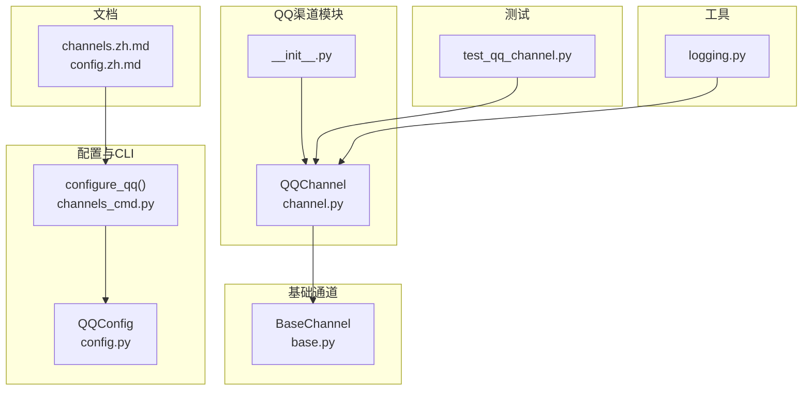
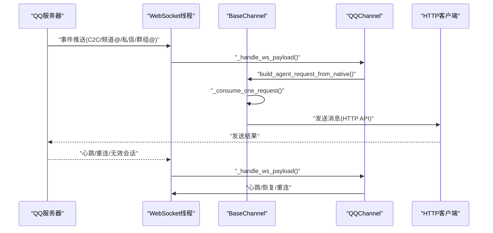
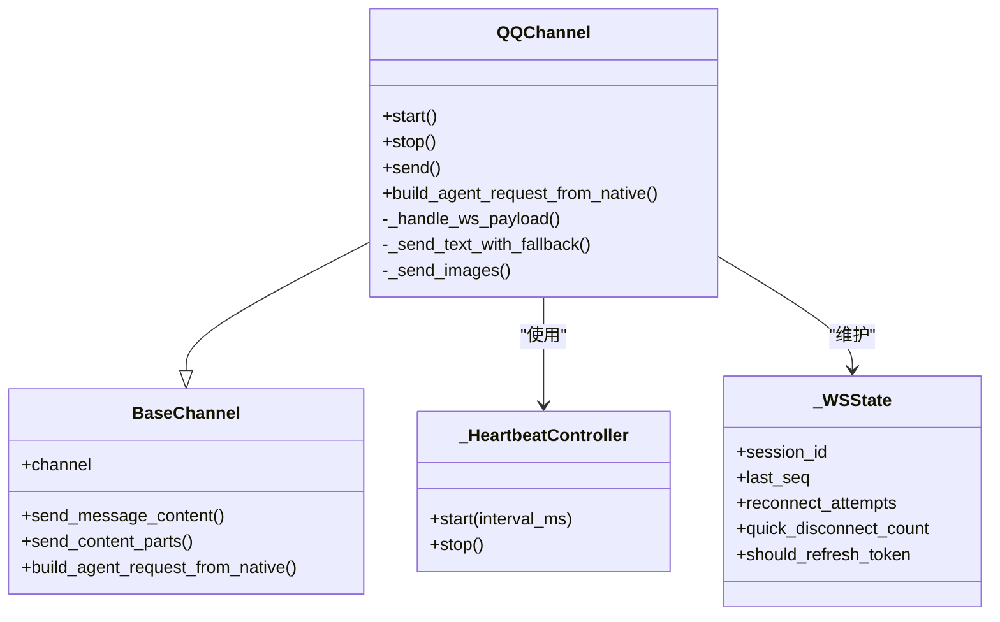
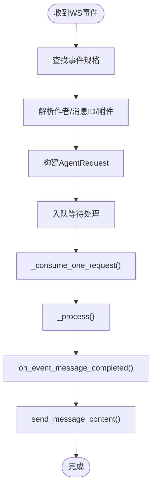
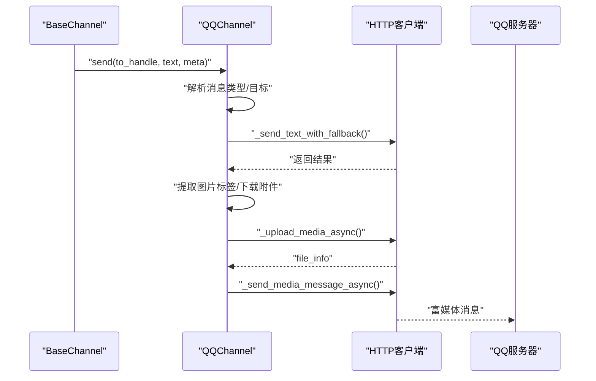
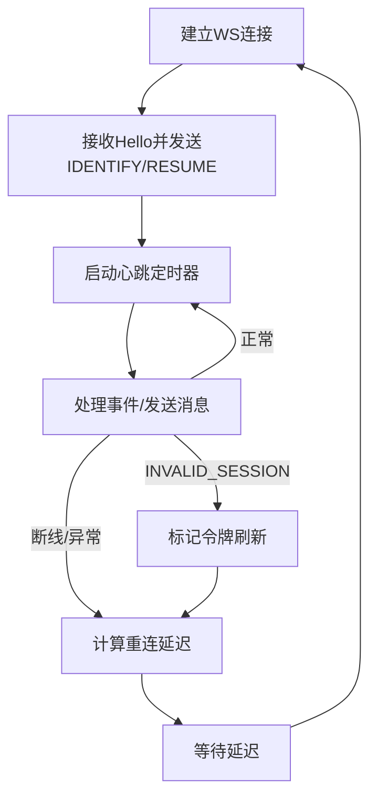
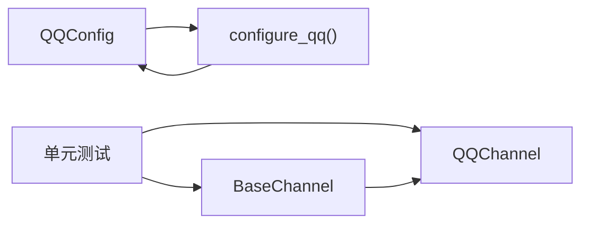

# QQ渠道集成

<cite>
**本文档引用的文件**
- [src\copaw\app\channels\qq\channel.py](file://src/copaw/app/channels/qq/channel.py)
- [src\copaw\app\channels\qq\__init__.py](file://src/copaw/app/channels/qq/__init__.py)
- [src\copaw\app\channels\base.py](file://src/copaw/app/channels/base.py)
- [src\copaw\config\config.py](file://src/copaw/config/config.py)
- [src\copaw\cli\channels_cmd.py](file://src/copaw/cli/channels_cmd.py)
- [tests\unit\channels\test_qq_channel.py](file://tests/unit/channels/test_qq_channel.py)
- [website\public\docs\channels.zh.md](file://website/public/docs/channels.zh.md)
- [website\public\docs\config.zh.md](file://website/public/docs/config.zh.md)
- [src\copaw\utils\logging.py](file://src/copaw/utils/logging.py)
</cite>

## 目录
1. [简介](#简介)
2. [项目结构](#项目结构)
3. [核心组件](#核心组件)
4. [架构总览](#架构总览)
5. [详细组件分析](#详细组件分析)
6. [依赖关系分析](#依赖关系分析)
7. [性能考虑](#性能考虑)
8. [故障排除指南](#故障排除指南)
9. [结论](#结论)
10. [附录](#附录)

## 简介
本文件面向CoPaw项目的QQ渠道集成，提供从应用配置、机器人设置到消息收发、媒体处理、网络连接与重连、错误处理与日志监控的完整技术文档。文档重点覆盖以下方面：
- QQ频道与QQ群聊的接入实现方案
- QQ机器人API使用方法（消息接收、处理与发送）
- QQ消息格式特性（表情、图片、文件等）的处理方式
- QQ应用配置、机器人设置与权限管理步骤
- QQ渠道特有能力（@提醒、消息回执、群组管理）的实现细节
- 网络连接管理、心跳检测与断线重连机制
- 错误处理、日志记录与性能监控方案

## 项目结构
CoPaw的QQ渠道位于`src/copaw/app/channels/qq/`目录下，采用模块化设计：
- `channel.py`：QQ渠道主实现，包含WebSocket事件处理、HTTP API调用、消息序列号、媒体上传与下载、错误处理与重连逻辑
- `__init__.py`：导出QQChannel类
- 与基础通道类`BaseChannel`协作，统一请求构建、内容渲染与发送流程
- 配置定义位于`config.py`，CLI交互位于`cli/channels_cmd.py`
- 单元测试位于`tests/unit/channels/test_qq_channel.py`
- 文档位于`website/public/docs/`，包含配置说明与操作指南

**图表来源**
- [src\copaw\app\channels\qq\channel.py](file://src/copaw/app/channels/qq/channel.py)
- [src\copaw\app\channels\qq\__init__.py](file://src/copaw/app/channels/qq/__init__.py)
- [src\copaw\app\channels\base.py](file://src/copaw/app/channels/base.py)
- [src\copaw\config\config.py](file://src/copaw/config/config.py)
- [src\copaw\cli\channels_cmd.py](file://src/copaw/cli/channels_cmd.py)
- [tests\unit\channels\test_qq_channel.py](file://tests/unit/channels/test_qq_channel.py)
- [website\public\docs\channels.zh.md](file://website/public/docs/channels.zh.md)
- [website\public\docs\config.zh.md](file://website/public/docs/config.zh.md)
- [src\copaw\utils\logging.py](file://src/copaw/utils/logging.py)

**章节来源**
- [src\copaw\app\channels\qq\channel.py](file://src/copaw/app/channels/qq/channel.py)
- [src\copaw\app\channels\qq\__init__.py](file://src/copaw/app/channels/qq/__init__.py)
- [src\copaw\app\channels\base.py](file://src/copaw/app/channels/base.py)
- [src\copaw\config\config.py](file://src/copaw/config/config.py)
- [src\copaw\cli\channels_cmd.py](file://src/copaw/cli/channels_cmd.py)
- [tests\unit\channels\test_qq_channel.py](file://tests/unit/channels/test_qq_channel.py)
- [website\public\docs\channels.zh.md](file://website/public/docs/channels.zh.md)
- [website\public\docs\config.zh.md](file://website/public/docs/config.zh.md)
- [src\copaw\utils\logging.py](file://src/copaw/utils/logging.py)

## 核心组件
- QQChannel：继承自BaseChannel，负责：
  - WebSocket事件监听与分发（C2C、频道@、私信、群组@）
  - HTTP API调用（获取网关、发送消息、富媒体上传与发送）
  - 消息序列号管理、意图配置、心跳控制与断线重连
  - 文本与富媒体内容的解析与转换
- BaseChannel：统一的消息请求构建、内容渲染、发送流程与错误处理钩子
- QQConfig：QQ渠道配置模型（app_id、client_secret、markdown_enabled）
- CLI配置：交互式配置QQ渠道参数（启用开关、前缀、AppID、ClientSecret、Markdown）

关键实现要点：
- 使用WebSocket接收事件，HTTP API发送回复，避免请求-响应耦合
- 支持多类型消息（文本、富媒体），并进行URL与Markdown兼容性处理
- 提供心跳控制、快速断线保护与指数退避重连策略
- 提供媒体下载与本地缓存目录，支持图片上传与发送

**章节来源**
- [src\copaw\app\channels\qq\channel.py](file://src/copaw/app/channels/qq/channel.py)
- [src\copaw\app\channels\base.py](file://src/copaw/app/channels/base.py)
- [src\copaw\config\config.py](file://src/copaw/config/config.py)
- [src\copaw\cli\channels_cmd.py](file://src/copaw/cli/channels_cmd.py)

## 架构总览
QQ渠道的整体架构分为三层：
- 事件层：WebSocket监听来自QQ的事件，解析为统一的native payload
- 处理层：BaseChannel统一构建AgentRequest，派发至Agent处理
- 发送层：根据消息类型路由到对应的HTTP API，支持文本与富媒体

**图表来源**
- [src\copaw\app\channels\qq\channel.py](file://src/copaw/app/channels/qq/channel.py)
- [src\copaw\app\channels\base.py](file://src/copaw/app/channels/base.py)

## 详细组件分析

### QQChannel类与消息处理
- 事件映射表：定义四种消息类型的事件规范，用于区分C2C、频道@、私信、群组@
- 心跳控制器：基于Timer周期发送心跳，确保连接活跃
- 发送路径解析：根据消息类型与目标（用户/群组/频道）选择不同的API路径与msg_seq规则
- 文本发送降级：支持Markdown失败回退为纯文本，以及URL内容错误时的二次清理策略
- 富媒体处理：支持图片上传与发送，音频/视频/文件类型解析与本地下载

**图表来源**
- [src\copaw\app\channels\qq\channel.py](file://src/copaw/app/channels/qq/channel.py)
- [src\copaw\app\channels\base.py](file://src/copaw/app/channels/base.py)

**章节来源**
- [src\copaw\app\channels\qq\channel.py](file://src/copaw/app/channels/qq/channel.py)
- [src\copaw\app\channels\base.py](file://src/copaw/app/channels/base.py)

### 消息接收与处理流程
- 事件分发：根据事件类型查找消息规格，提取作者、消息ID、附件等元数据
- 请求构建：将native payload转换为AgentRequest，附加channel_meta便于后续发送
- 会话解析：基于sender_id与meta生成session_id，保证会话隔离
- 入队处理：通过ChannelManager队列进行统一消费与处理

**图表来源**
- [src\copaw\app\channels\qq\channel.py](file://src/copaw/app/channels/qq/channel.py)
- [src\copaw\app\channels\base.py](file://src/copaw/app/channels/base.py)

**章节来源**
- [src\copaw\app\channels\qq\channel.py](file://src/copaw/app/channels/qq/channel.py)
- [src\copaw\app\channels\base.py](file://src/copaw/app/channels/base.py)

### 消息发送与富媒体处理
- 文本发送：支持Markdown与纯文本两种模式，自动处理URL与验证错误
- 富媒体发送：图片通过上传接口获取file_info后发送，音频/视频/文件类型解析与本地下载
- 附件解析：根据content_type或扩展名判断类型，下载到本地媒体目录
- 发送路径：根据消息类型选择不同API端点，C2C与群组需要msg_seq，频道不需要

**图表来源**
- [src\copaw\app\channels\qq\channel.py](file://src/copaw/app/channels/qq/channel.py)
- [src\copaw\app\channels\base.py](file://src/copaw/app/channels/base.py)

**章节来源**
- [src\copaw\app\channels\qq\channel.py](file://src/copaw/app/channels/qq/channel.py)
- [src\copaw\app\channels\base.py](file://src/copaw/app/channels/base.py)

### 网络连接管理、心跳与断线重连
- 心跳：服务端Hello携带心跳间隔，客户端定时发送心跳包
- 识别与恢复：首次连接发送IDENTIFY，存在session_id时尝试RESUME
- 重连策略：快速断线保护（短时间内多次断线触发速率限制）、指数退避延迟、最大重连次数限制
- 令牌刷新：当会话无效且不可恢复时，清除令牌缓存并重新获取

**图表来源**
- [src\copaw\app\channels\qq\channel.py](file://src/copaw/app/channels/qq/channel.py)

**章节来源**
- [src\copaw\app\channels\qq\channel.py](file://src/copaw/app/channels/qq/channel.py)

### 错误处理与URL/Markdown兼容
- URL清理：两层策略，第一层常规URL匹配，第二层更激进的裸域名匹配
- Markdown回退：当API返回验证错误时，自动切换为纯文本发送
- 异常分类：区分API错误与网络错误，避免重复发送与错误传播

**章节来源**
- [src\copaw\app\channels\qq\channel.py](file://src/copaw/app/channels/qq/channel.py)

## 依赖关系分析
- QQChannel依赖BaseChannel提供的统一请求构建、内容渲染与发送框架
- 配置模型QQConfig与CLI交互式配置共同决定渠道启用、前缀、AppID/ClientSecret与Markdown开关
- 测试用例覆盖核心函数与流程，包括URL清理、Markdown回退、重连策略、消息类型解析等

**图表来源**
- [src\copaw\app\channels\qq\channel.py](file://src/copaw/app/channels/qq/channel.py)
- [src\copaw\app\channels\base.py](file://src/copaw/app/channels/base.py)
- [src\copaw\config\config.py](file://src/copaw/config/config.py)
- [src\copaw\cli\channels_cmd.py](file://src/copaw/cli/channels_cmd.py)
- [tests\unit\channels\test_qq_channel.py](file://tests/unit/channels/test_qq_channel.py)

**章节来源**
- [src\copaw\app\channels\qq\channel.py](file://src/copaw/app/channels/qq/channel.py)
- [src\copaw\app\channels\base.py](file://src/copaw/app/channels/base.py)
- [src\copaw\config\config.py](file://src/copaw/config/config.py)
- [src\copaw\cli\channels_cmd.py](file://src/copaw/cli/channels_cmd.py)
- [tests\unit\channels\test_qq_channel.py](file://tests/unit/channels/test_qq_channel.py)

## 性能考虑
- 消息序列号：为C2C与群组消息维护独立计数器，避免重复与乱序
- 本地媒体缓存：下载的文件保存在本地媒体目录，减少重复下载与带宽占用
- 心跳与重连：合理的延迟与速率限制，降低频繁重连对服务器的压力
- 内容合并：BaseChannel支持时间抖动与内容合并，减少高频消息的处理开销

[本节为通用指导，无需特定文件引用]

## 故障排除指南
常见问题与排查步骤：
- 渠道未启用或凭证缺失：检查环境变量或配置文件，确认QQ_APP_ID与QQ_CLIENT_SECRET
- WebSocket连接失败：查看日志中的token/gateway获取与连接异常，确认网络与IP白名单
- 消息发送失败：优先检查URL清理与Markdown回退逻辑，必要时禁用Markdown
- 重连频繁：关注快速断线保护触发条件与速率限制，检查网络稳定性
- 日志定位：使用CoPaw日志系统，过滤QQ相关日志，结合单元测试用例定位问题

**章节来源**
- [src\copaw\app\channels\qq\channel.py](file://src/copaw/app/channels/qq/channel.py)
- [src\copaw\utils\logging.py](file://src/copaw/utils/logging.py)
- [tests\unit\channels\test_qq_channel.py](file://tests/unit/channels/test_qq_channel.py)

## 结论
CoPaw的QQ渠道通过WebSocket与HTTP API的组合，实现了对QQ频道与QQ群聊的全面支持。其设计遵循统一的通道抽象，具备完善的错误处理、富媒体支持与网络连接管理能力。配合清晰的配置与文档，能够满足生产环境下的稳定运行需求。

[本节为总结性内容，无需特定文件引用]

## 附录

### QQ应用配置与权限管理步骤
- 在QQ开放平台创建机器人应用，配置回调事件（C2C消息事件、群消息事件AT事件）
- 在沙箱配置中添加机器人到消息列表，获取AppID与AppSecret
- 在CoPaw中填写config.json或通过Console前端配置，启用QQ渠道并设置bot_prefix
- 如需公网访问，按文档要求配置IP白名单

**章节来源**
- [website\public\docs\channels.zh.md](file://website/public/docs/channels.zh.md)
- [website\public\docs\config.zh.md](file://website/public/docs/config.zh.md)

### QQ渠道特性与限制
- 多模态支持：接收文本/图片，发送文本/图片（部分类型仍在开发中）
- 权限控制：支持私聊/群聊策略、白名单与@提醒等控制
- 消息回执：通过消息ID与序列号管理，确保消息有序与可追踪

**章节来源**
- [website\public\docs\channels.zh.md](file://website/public/docs/channels.zh.md)
- [src\copaw\app\channels\qq\channel.py](file://src/copaw/app/channels/qq/channel.py)