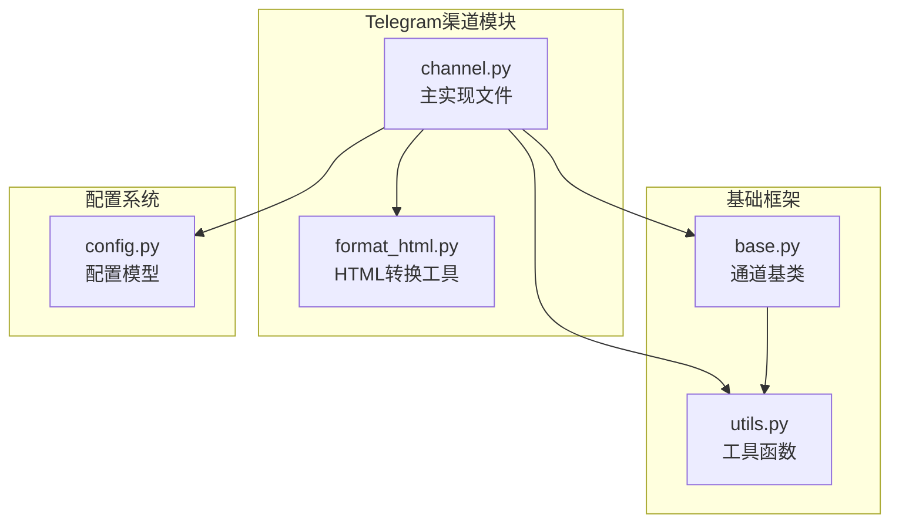
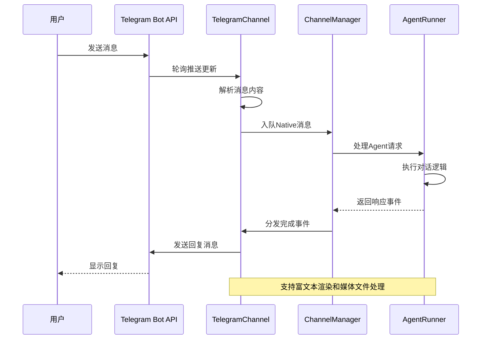
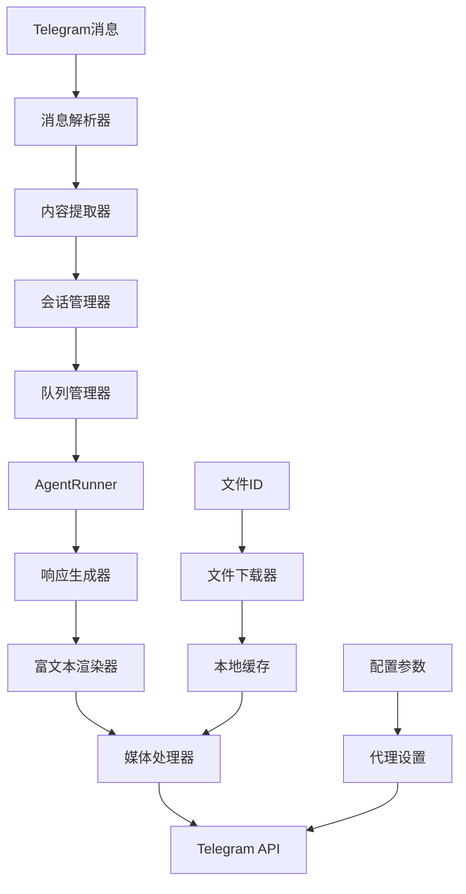
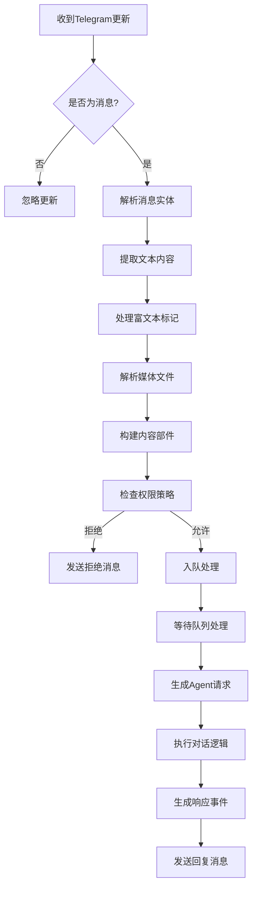
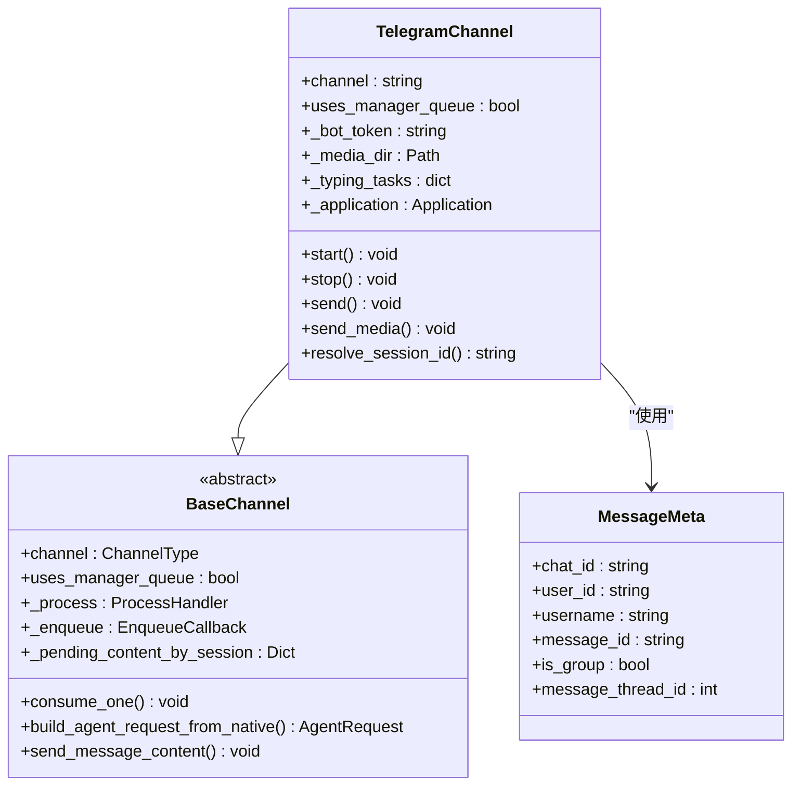
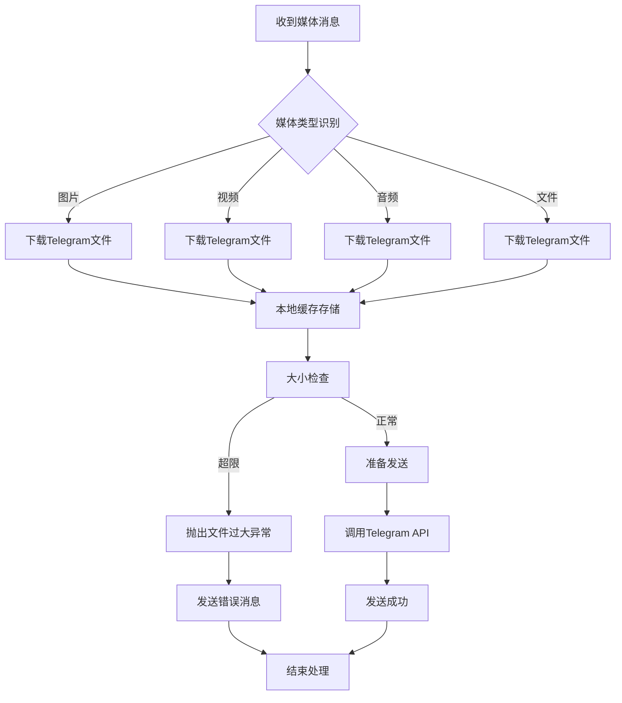
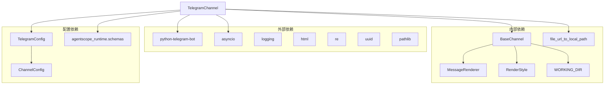

# Telegram渠道集成

<cite>
**本文档引用的文件**
- [channel.py](file://src/copaw/app/channels/telegram/channel.py)
- [format_html.py](file://src/copaw/app/channels/telegram/format_html.py)
- [config.py](file://src/copaw/config/config.py)
- [base.py](file://src/copaw/app/channels/base.py)
- [utils.py](file://src/copaw/app/channels/utils.py)
</cite>

## 目录
1. [简介](#简介)
2. [项目结构](#项目结构)
3. [核心组件](#核心组件)
4. [架构概览](#架构概览)
5. [详细组件分析](#详细组件分析)
6. [依赖关系分析](#依赖关系分析)
7. [性能考虑](#性能考虑)
8. [故障排除指南](#故障排除指南)
9. [结论](#结论)
10. [附录](#附录)

## 简介
本文件为CoPaw项目的Telegram渠道集成技术文档，详细介绍如何在CoPaw中实现Telegram Bot API的完整集成方案。该实现采用轮询模式（Polling）而非Webhook，提供消息接收与发送、富文本渲染、媒体文件处理、会话管理等核心功能。

Telegram渠道通过Telegram Bot API进行通信，使用Python-Telegram-Bot库构建Application实例，注册消息处理器来接收用户消息，并通过统一的通道接口将消息转换为Agent请求，交由运行器处理后返回结果。

## 项目结构
Telegram渠道位于应用层的通道模块中，采用分层设计：
- 渠道实现：`src/copaw/app/channels/telegram/`
- 基类抽象：`src/copaw/app/channels/base.py`
- 配置定义：`src/copaw/config/config.py`
- 工具函数：`src/copaw/app/channels/utils.py`

**图表来源**
- [channel.py:1-1044](file://src/copaw/app/channels/telegram/channel.py#L1-L1044)
- [base.py:1-868](file://src/copaw/app/channels/base.py#L1-L868)
- [config.py:85-90](file://src/copaw/config/config.py#L85-L90)

**章节来源**
- [channel.py:1-1044](file://src/copaw/app/channels/telegram/channel.py#L1-L1044)
- [base.py:1-868](file://src/copaw/app/channels/base.py#L1-L868)
- [config.py:85-90](file://src/copaw/config/config.py#L85-L90)

## 核心组件
Telegram渠道的核心组件包括：

### TelegramChannel类
这是Telegram渠道的主要实现类，继承自BaseChannel，负责：
- Bot应用初始化和轮询启动
- 消息接收和内容解析
- 会话管理和用户识别
- 富文本渲染和媒体文件处理
- 错误处理和重连机制

### HTML格式化工具
提供标准Markdown到Telegram兼容HTML的转换功能，支持：
- 代码块、内联代码
- 链接、标题、水平线
- 引用、列表、删除线
- Spoiler标记、粗体、斜体

### 文件下载和URL解析
实现Telegram文件ID到本地路径的转换，支持：
- 远程文件下载到本地缓存目录
- 文件URL解析和验证
- 大小限制检查和错误处理

**章节来源**
- [channel.py:264-1044](file://src/copaw/app/channels/telegram/channel.py#L264-L1044)
- [format_html.py:22-162](file://src/copaw/app/channels/telegram/format_html.py#L22-L162)
- [utils.py:15-55](file://src/copaw/app/channels/utils.py#L15-L55)

## 架构概览
Telegram渠道采用分层架构设计，确保了良好的可扩展性和维护性。

**图表来源**
- [channel.py:361-434](file://src/copaw/app/channels/telegram/channel.py#L361-L434)
- [base.py:443-583](file://src/copaw/app/channels/base.py#L443-L583)

### 数据流架构

**图表来源**
- [channel.py:140-237](file://src/copaw/app/channels/telegram/channel.py#L140-L237)
- [channel.py:779-833](file://src/copaw/app/channels/telegram/channel.py#L779-L833)

## 详细组件分析

### 消息处理流程
Telegram渠道的消息处理采用异步轮询模式，实现了完整的消息生命周期管理。

**图表来源**
- [channel.py:361-434](file://src/copaw/app/channels/telegram/channel.py#L361-L434)
- [channel.py:140-237](file://src/copaw/app/channels/telegram/channel.py#L140-L237)

### 会话管理机制
Telegram渠道采用基于chat_id的会话管理策略：

**图表来源**
- [channel.py:264-1044](file://src/copaw/app/channels/telegram/channel.py#L264-L1044)
- [base.py:69-402](file://src/copaw/app/channels/base.py#L69-L402)

**章节来源**
- [channel.py:264-1044](file://src/copaw/app/channels/telegram/channel.py#L264-L1044)
- [base.py:69-402](file://src/copaw/app/channels/base.py#L69-L402)

### 富文本渲染系统
Telegram渠道实现了从标准Markdown到Telegram兼容HTML的转换系统：

```mermaid
flowchart LR
A[原始Markdown文本] --> B[保护区域提取]
B --> C[代码块处理]
C --> D[内联代码处理]
D --> E[链接处理]
E --> F[HTML转义]
F --> G[结构元素处理]
G --> H[列表和引用]
H --> I[内联格式处理]
I --> J[Spoiler标记]
J --> K[粗体和斜体]
K --> L[删除线处理]
L --> M[占位符恢复]
M --> N[最终HTML输出]
style N fill:#e1f5fe
```

**图表来源**
- [format_html.py:22-162](file://src/copaw/app/channels/telegram/format_html.py#L22-L162)

**章节来源**
- [format_html.py:22-162](file://src/copaw/app/channels/telegram/format_html.py#L22-L162)

### 媒体文件处理
Telegram渠道支持多种媒体类型的处理和传输：

**图表来源**
- [channel.py:779-833](file://src/copaw/app/channels/telegram/channel.py#L779-L833)
- [channel.py:801-825](file://src/copaw/app/channels/telegram/channel.py#L801-L825)

**章节来源**
- [channel.py:779-833](file://src/copaw/app/channels/telegram/channel.py#L779-L833)
- [channel.py:801-825](file://src/copaw/app/channels/telegram/channel.py#L801-L825)

## 依赖关系分析
Telegram渠道的依赖关系清晰明确，遵循单一职责原则：

**图表来源**
- [channel.py:15-44](file://src/copaw/app/channels/telegram/channel.py#L15-L44)
- [config.py:85-90](file://src/copaw/config/config.py#L85-L90)

**章节来源**
- [channel.py:15-44](file://src/copaw/app/channels/telegram/channel.py#L15-L44)
- [config.py:85-90](file://src/copaw/config/config.py#L85-L90)

## 性能考虑
Telegram渠道在设计时充分考虑了性能优化和资源管理：

### 消息分片发送
- 最大消息长度：4096字符
- 分片大小：4000字符
- 智能换行：优先在换行处或空格处分割
- 避免破坏单词完整性

### 文件上传优化
- 上传限制：50MB
- 缓存策略：本地临时文件存储
- 并发控制：异步文件下载
- 错误恢复：自动重试机制

### 内存管理
- 会话缓冲：按会话ID组织
- 定时清理：超时任务自动取消
- 资源释放：优雅关闭应用实例

## 故障排除指南

### 常见问题及解决方案

#### 1. Bot令牌无效
**症状**：启动时报InvalidToken错误
**原因**：TELEGRAM_BOT_TOKEN配置错误
**解决**：
- 检查Bot令牌格式
- 确认令牌未过期
- 验证Bot权限设置

#### 2. 网络连接问题
**症状**：轮询失败，日志显示网络错误
**原因**：代理配置或防火墙阻拦
**解决**：
- 配置TELEGRAM_HTTP_PROXY
- 设置TELEGRAM_HTTP_PROXY_AUTH
- 在中国地区使用代理服务器

#### 3. 文件上传失败
**症状**：媒体文件无法发送
**原因**：文件过大或权限不足
**解决**：
- 检查文件大小（超过50MB）
- 验证Bot对群组的发送权限
- 确认文件路径有效

#### 4. 消息乱码问题
**症状**：中文显示异常
**原因**：编码处理不当
**解决**：
- 确保使用UTF-8编码
- 检查HTML转义处理
- 验证Telegram客户端支持

**章节来源**
- [channel.py:943-952](file://src/copaw/app/channels/telegram/channel.py#L943-L952)
- [channel.py:716-767](file://src/copaw/app/channels/telegram/channel.py#L716-L767)

### 调试技巧
1. **启用详细日志**：检查DEBUG级别日志输出
2. **监控轮询状态**：观察更新接收情况
3. **验证配置参数**：确认所有必需参数已正确设置
4. **测试媒体功能**：单独测试图片、视频、音频上传

## 结论
CoPaw的Telegram渠道集成为用户提供了完整的Telegram Bot集成解决方案。通过采用轮询模式、完善的富文本渲染、健壮的错误处理和优化的性能设计，该实现能够满足大多数企业级应用场景的需求。

主要优势包括：
- 简化的部署模式（无需Webhook配置）
- 完整的富文本支持
- 强大的媒体文件处理能力
- 可靠的错误恢复机制
- 灵活的会话管理策略

未来可以考虑的改进方向：
- 支持Webhook模式以减少轮询开销
- 增加Inline Keyboard等高级功能
- 实现更精细的速率限制控制
- 添加更多的安全防护措施

## 附录

### 配置参数说明
| 参数名 | 类型 | 默认值 | 描述 |
|--------|------|--------|------|
| TELEGRAM_CHANNEL_ENABLED | bool | False | 是否启用Telegram渠道 |
| TELEGRAM_BOT_TOKEN | string | "" | Telegram Bot令牌 |
| TELEGRAM_HTTP_PROXY | string | "" | HTTP代理地址 |
| TELEGRAM_HTTP_PROXY_AUTH | string | "" | 代理认证信息 |
| TELEGRAM_BOT_PREFIX | string | "" | Bot前缀标识 |
| TELEGRAM_SHOW_TYPING | bool | True | 是否显示输入指示 |
| TELEGRAM_DM_POLICY | string | "open" | 私聊策略 |
| TELEGRAM_GROUP_POLICY | string | "open" | 群组策略 |
| TELEGRAM_ALLOW_FROM | list | [] | 允许的用户ID列表 |
| TELEGRAM_DENY_MESSAGE | string | "" | 拒绝消息内容 |
| TELEGRAM_REQUIRE_MENTION | bool | False | 是否需要提及 |

### 环境变量
- `TELEGRAM_CHANNEL_ENABLED`: 启用/禁用渠道
- `TELEGRAM_BOT_TOKEN`: Bot令牌
- `TELEGRAM_HTTP_PROXY`: HTTP代理
- `TELEGRAM_HTTP_PROXY_AUTH`: 代理认证
- `TELEGRAM_BOT_PREFIX`: Bot前缀
- `TELEGRAM_SHOW_TYPING`: 显示输入指示
- `TELEGRAM_DM_POLICY`: 私聊策略
- `TELEGRAM_GROUP_POLICY`: 群组策略
- `TELEGRAM_ALLOW_FROM`: 允许列表
- `TELEGRAM_DENY_MESSAGE`: 拒绝消息
- `TELEGRAM_REQUIRE_MENTION`: 提及要求

**章节来源**
- [channel.py:467-481](file://src/copaw/app/channels/telegram/channel.py#L467-L481)
- [config.py:85-90](file://src/copaw/config/config.py#L85-L90)