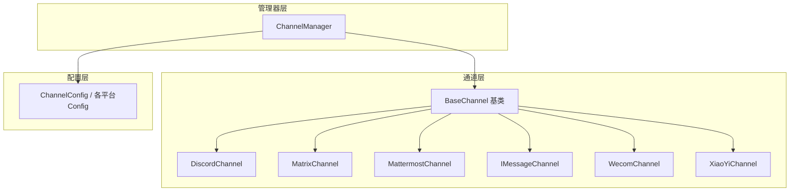
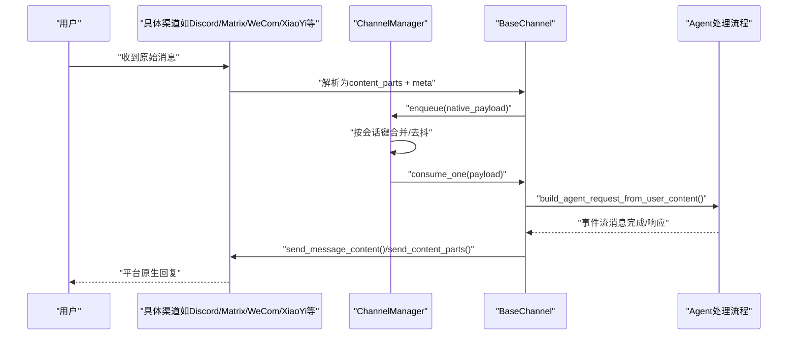
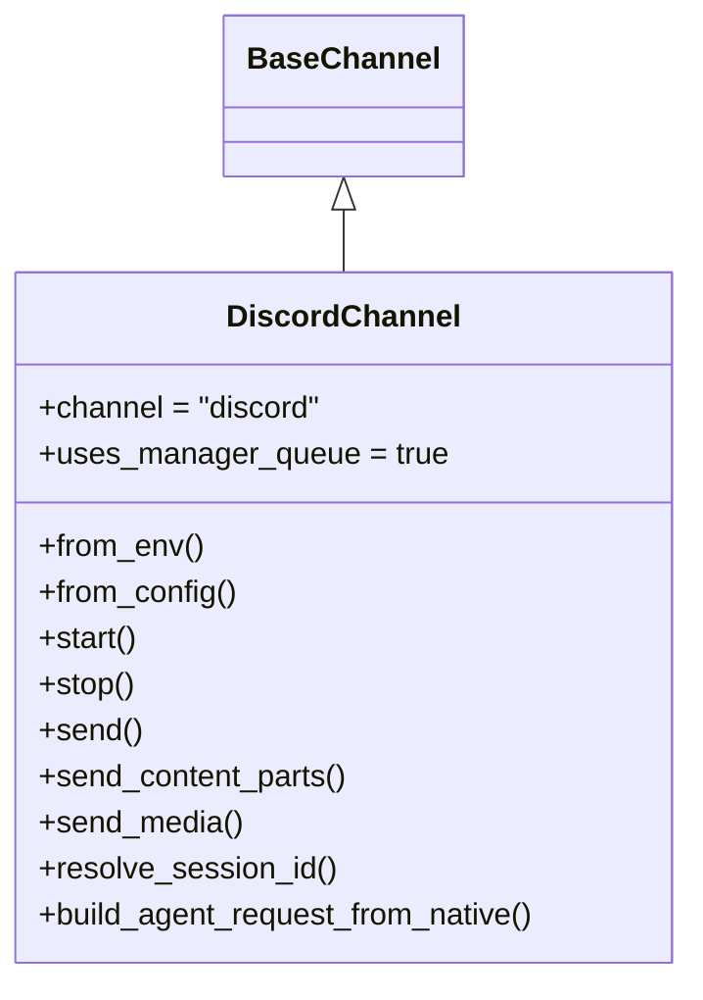
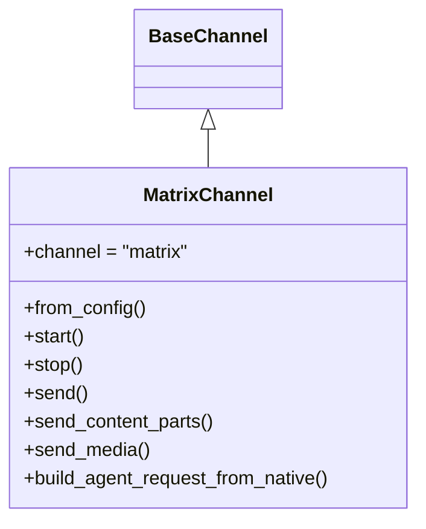
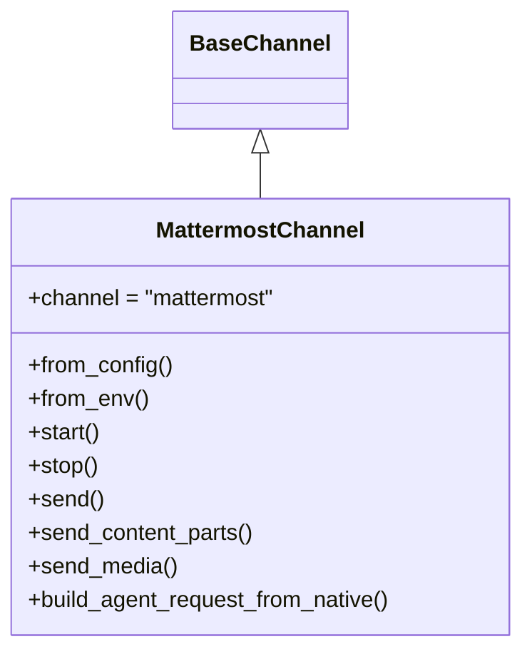
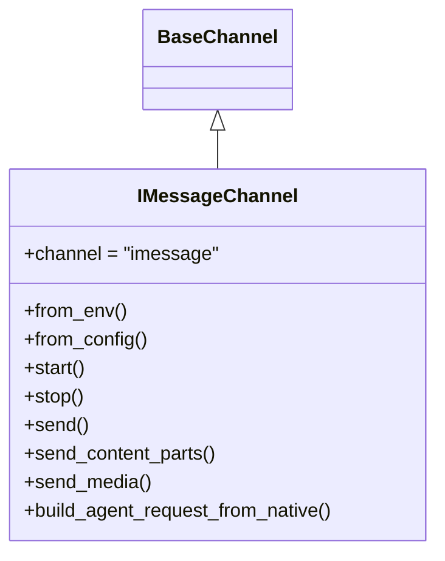
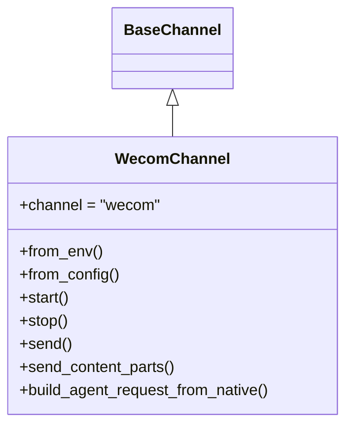
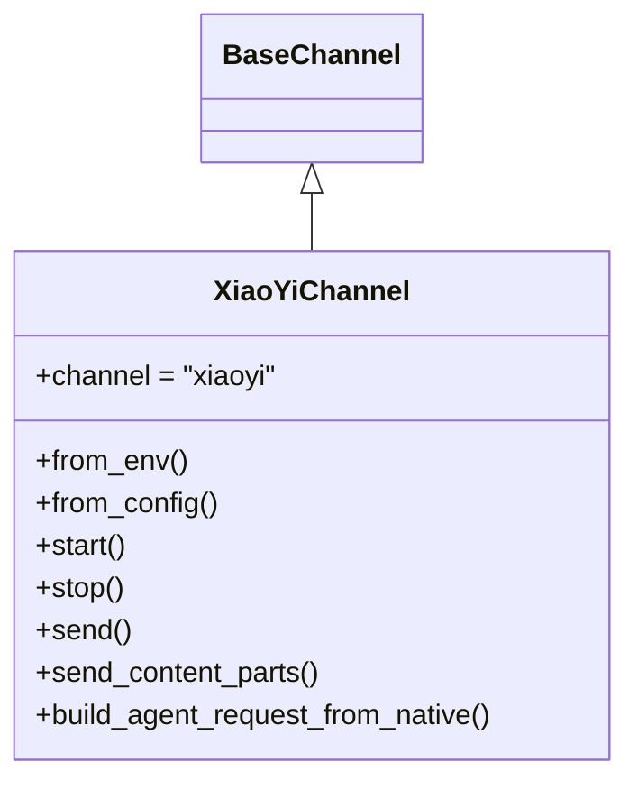
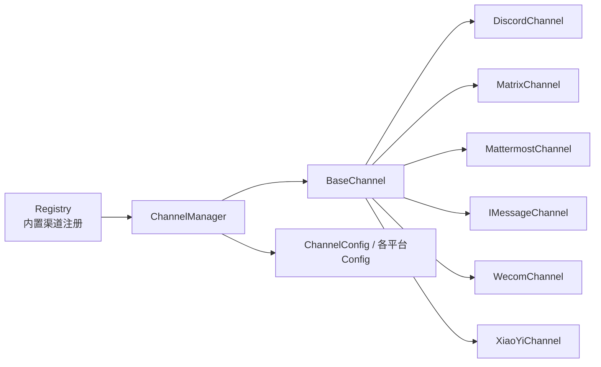

# 其他平台集成

<cite>
**本文档引用的文件**
- [src\copaw\app\channels\discord_\channel.py](file://src\copaw\app\channels\discord_\channel.py)
- [src\copaw\app\channels\matrix\channel.py](file://src\copaw\app\channels\matrix\channel.py)
- [src\copaw\app\channels\mattermost\channel.py](file://src\copaw\app\channels\mattermost\channel.py)
- [src\copaw\app\channels\imessage\channel.py](file://src\copaw\app\channels\imessage\channel.py)
- [src\copaw\app\channels\wecom\channel.py](file://src\copaw\app\channels\wecom\channel.py)
- [src\copaw\app\channels\xiaoyi\channel.py](file://src\copaw\app\channels\xiaoyi\channel.py)
- [src\copaw\app\channels\base.py](file://src\copaw\app\channels\base.py)
- [src\copaw\app\channels\manager.py](file://src\copaw\app\channels\manager.py)
- [src\copaw\app\channels\registry.py](file://src\copaw\app\channels\registry.py)
- [src\copaw\config\config.py](file://src\copaw\config\config.py)
</cite>

## 目录
1. [简介](#简介)
2. [项目结构](#项目结构)
3. [核心组件](#核心组件)
4. [架构总览](#架构总览)
5. [详细组件分析](#详细组件分析)
6. [依赖关系分析](#依赖关系分析)
7. [性能考虑](#性能考虑)
8. [故障排除指南](#故障排除指南)
9. [结论](#结论)

## 简介
本文件面向CoPaw的其他平台渠道集成，系统性梳理Discord、Matrix、Mattermost、iMessage、企业微信（WeCom）、小艺（XiaoYi）等渠道的实现方式与差异。内容覆盖：
- 各平台的共同特征与差异化实现（API使用、消息格式、认证机制）
- 配置要求、权限策略与部署步骤
- 平台特有能力（角色管理、频道/群组分类、文件共享）的处理
- 跨平台消息格式转换、用户标识映射与会话同步
- 错误处理、限流应对与连接稳定性保障
- 调试工具与故障排除建议

## 项目结构
CoPaw采用“通道（Channel）+ 管理器（Manager）”的解耦架构：每个渠道继承统一的基类，遵循一致的消息流转协议；管理器负责队列化、合并、去抖与并发消费。

图示来源
- [src\copaw\app\channels\base.py](file://src\copaw\app\channels\base.py)
- [src\copaw\app\channels\manager.py](file://src\copaw\app\channels\manager.py)
- [src\copaw\app\channels\registry.py](file://src\copaw\app\channels\registry.py)
- [src\copaw\config\config.py](file://src\copaw\config\config.py)

章节来源
- [src\copaw\app\channels\base.py](file://src\copaw\app\channels\base.py)
- [src\copaw\app\channels\manager.py](file://src\copaw\app\channels\manager.py)
- [src\copaw\app\channels\registry.py](file://src\copaw\app\channels\registry.py)
- [src\copaw\config\config.py](file://src\copaw\config\config.py)

## 核心组件
- BaseChannel：定义统一的生命周期（start/stop）、消息构建（build_agent_request_from_native）、发送接口（send/send_content_parts/send_media）、去抖与合并策略、ACL与@提及策略等。
- ChannelManager：为每个启用的通道创建队列与消费者线程，按会话键合并消息，串行化同一会话的处理，支持替换通道与主动发送文本。
- Registry：内置渠道注册表，支持自定义渠道扩展。
- Config：集中定义各平台的配置模型（如DiscordConfig、MatrixConfig、MattermostConfig、IMessageChannelConfig、WecomConfig、XiaoYiConfig）。

章节来源
- [src\copaw\app\channels\base.py](file://src\copaw\app\channels\base.py)
- [src\copaw\app\channels\manager.py](file://src\copaw\app\channels\manager.py)
- [src\copaw\app\channels\registry.py](file://src\copaw\app\channels\registry.py)
- [src\copaw\config\config.py](file://src\copaw\config\config.py)

## 架构总览
下图展示从消息到达至回复发送的端到端流程，以及各平台在架构中的位置与职责边界。

图示来源
- [src\copaw\app\channels\base.py](file://src\copaw\app\channels\base.py)
- [src\copaw\app\channels\manager.py](file://src\copaw\app\channels\manager.py)

章节来源
- [src\copaw\app\channels\base.py](file://src\copaw\app\channels\base.py)
- [src\copaw\app\channels\manager.py](file://src\copaw\app\channels\manager.py)

## 详细组件分析

### Discord 渠道
- 认证与接入
  - 使用discord.py客户端，通过Bot Token鉴权；支持HTTP代理与代理鉴权。
  - 事件监听：on_message，过滤机器人自身消息，支持@提及检测与清理。
- 消息与媒体
  - 文本、图片、视频、音频、文件均映射为统一内容类型；媒体下载后以附件形式发送。
  - 文本长度超过限制时自动分片（保留代码块闭合）。
- 会话与目标
  - 会话ID由“服务器/频道/私聊”决定；发送目标通过meta中的channel_id或user_id解析。
- 安全与策略
  - 支持开放/白名单两种DM/群组策略；可配置require_mention；支持allow_from白名单与deny_message。
- 生命周期
  - start()启动异步客户端；stop()取消任务并关闭客户端。

图示来源
- [src\copaw\app\channels\discord_\channel.py](file://src\copaw\app\channels\discord_\channel.py)
- [src\copaw\app\channels\base.py](file://src\copaw\app\channels\base.py)

章节来源
- [src\copaw\app\channels\discord_\channel.py](file://src\copaw\app\channels\discord_\channel.py)
- [src\copaw\config\config.py](file://src\copaw\config\config.py)

### Matrix 渠道
- 认证与接入
  - 使用nio库，基于Homeserver地址与access_token登录；支持mxc到HTTP的URL转换。
  - 注册多种事件回调（文本、图片、视频、音频、文件）。
- 消息与媒体
  - 文本消息直接发送；媒体通过上传接口后以消息形式发送。
  - 支持@提及检测（本地part与@用户名）。
- 会话与目标
  - 会话ID基于房间ID；发送目标为房间ID。
- 生命周期
  - start()创建AsyncClient并进入同步循环；stop()取消任务并关闭客户端。

图示来源
- [src\copaw\app\channels\matrix\channel.py](file://src\copaw\app\channels\matrix\channel.py)
- [src\copaw\app\channels\base.py](file://src\copaw\app\channels\base.py)

章节来源
- [src\copaw\app\channels\matrix\channel.py](file://src\copaw\app\channels\matrix\channel.py)
- [src\copaw\config\config.py](file://src\copaw\config\config.py)

### Mattermost 渠道
- 认证与接入
  - 使用WebSocket与REST API；通过Bot Token鉴权；支持typing指示器。
  - 连接失败指数退避重连；首次连接需拉取机器人信息。
- 消息与媒体
  - 通过WebSocket接收“posted”事件；支持DM与Thread上下文获取；附件下载到本地后处理。
  - 支持线程跟随（thread_follow_without_mention），无需@即可参与线程。
- 会话与目标
  - DM会话以频道ID命名；群组/线程会话以根帖子ID命名；支持首次联系时的历史上下文补充。
- 生命周期
  - start()启动WebSocket循环；stop()取消任务并关闭HTTP客户端。

图示来源
- [src\copaw\app\channels\mattermost\channel.py](file://src\copaw\app\channels\mattermost\channel.py)
- [src\copaw\app\channels\base.py](file://src\copaw\app\channels\base.py)

章节来源
- [src\copaw\app\channels\mattermost\channel.py](file://src\copaw\app\channels\mattermost\channel.py)
- [src\copaw\config\config.py](file://src\copaw\config\config.py)

### iMessage 渠道
- 接入方式
  - 通过imsg命令行工具发送/接收；轮询Messages数据库（只读）发现新消息。
  - 依赖imsg可执行程序，缺失时报错引导安装。
- 消息与媒体
  - 文本消息直接发送；媒体支持HTTP/HTTPS、本地路径与data URL；对base64数据进行大小限制与校验。
  - 发送媒体失败时回退为文本占位符。
- 会话与目标
  - 会话ID基于发送者；发送目标为收件人标识。
- 生命周期
  - start()启动轮询线程；stop()停止线程并等待退出。

图示来源
- [src\copaw\app\channels\imessage\channel.py](file://src\copaw\app\channels\imessage\channel.py)
- [src\copaw\app\channels\base.py](file://src\copaw\app\channels\base.py)

章节来源
- [src\copaw\app\channels\imessage\channel.py](file://src\copaw\app\channels\imessage\channel.py)
- [src\copaw\config\config.py](file://src\copaw\config\config.py)

### 企业微信（WeCom）渠道
- 接入方式
  - 使用aibot WebSocket SDK，支持消息流式回复；支持文本、图片、语音（ASR）、文件等。
  - 提供enter_chat欢迎语；支持消息去重（message_id）。
- 消息与媒体
  - 图片/文件下载到本地；语音通过ASR转文本；不支持直接上传媒体文件，图片以Markdown链接形式发送。
- 会话与目标
  - 单聊会话以用户ID命名；群聊会话以聊天ID命名；支持处理多条混合消息并合并。
- 生命周期
  - start()在独立线程中运行SDK事件循环；stop()清理任务与连接。

图示来源
- [src\copaw\app\channels\wecom\channel.py](file://src\copaw\app\channels\wecom\channel.py)
- [src\copaw\app\channels\base.py](file://src\copaw\app\channels\base.py)

章节来源
- [src\copaw\app\channels\wecom\channel.py](file://src\copaw\app\channels\wecom\channel.py)
- [src\copaw\config\config.py](file://src\copaw\config\config.py)

### 小艺（XiaoYi）渠道
- 接入方式
  - 使用A2A协议通过WebSocket；支持心跳保活与断线重连；同一agent_id复用已有连接。
  - 支持clearContext与tasks/cancel指令处理。
- 消息与媒体
  - 文件下载到本地；图片/非图片分别处理；文本按TEXT_CHUNK_LIMIT分片发送。
- 会话与目标
  - 会话ID即sessionId；任务ID与会话映射；支持主动清理上下文与取消任务。
- 生命周期
  - start()建立WebSocket连接、发送初始化消息、启动心跳与接收循环；stop()取消任务并关闭连接。

图示来源
- [src\copaw\app\channels\xiaoyi\channel.py](file://src\copaw\app\channels\xiaoyi\channel.py)
- [src\copaw\app\channels\base.py](file://src\copaw\app\channels\base.py)

章节来源
- [src\copaw\app\channels\xiaoyi\channel.py](file://src\copaw\app\channels\xiaoyi\channel.py)
- [src\copaw\config\config.py](file://src\copaw\config\config.py)

## 依赖关系分析
- 统一基类与管理器
  - 所有渠道继承BaseChannel，遵循相同的请求构建、发送与错误处理约定。
  - ChannelManager负责队列、合并、去抖与并发消费，屏蔽不同渠道的差异。
- 注册与发现
  - Registry维护内置渠道清单，支持自定义渠道目录扩展。
- 配置与环境变量
  - 各渠道提供对应的Pydantic模型，支持从配置文件或环境变量加载。

图示来源
- [src\copaw\app\channels\registry.py](file://src\copaw\app\channels\registry.py)
- [src\copaw\app\channels\manager.py](file://src\copaw\app\channels\manager.py)
- [src\copaw\config\config.py](file://src\copaw\config\config.py)

章节来源
- [src\copaw\app\channels\registry.py](file://src\copaw\app\channels\registry.py)
- [src\copaw\app\channels\manager.py](file://src\copaw\app\channels\manager.py)
- [src\copaw\config\config.py](file://src\copaw\config\config.py)

## 性能考虑
- 去抖与合并
  - BaseChannel提供时间去抖与同会话合并，避免重复处理与消息碎片化。
- 并发与队列
  - ChannelManager为每个通道创建固定数量的消费者，按会话键串行化处理，减少竞态。
- 媒体处理
  - 下载/上传采用临时文件与流式处理，避免内存峰值；对大文件与长文本进行分片。
- 连接稳定性
  - Mattermost与XiaoYi采用指数退避重连；Matrix/Discord/iMessage使用框架提供的稳定连接模型。

章节来源
- [src\copaw\app\channels\base.py](file://src\copaw\app\channels\base.py)
- [src\copaw\app\channels\manager.py](file://src\copaw\app\channels\manager.py)
- [src\copaw\app\channels\mattermost\channel.py](file://src\copaw\app\channels\mattermost\channel.py)
- [src\copaw\app\channels\xiaoyi\channel.py](file://src\copaw\app\channels\xiaoyi\channel.py)

## 故障排除指南
- 通用错误处理
  - BaseChannel在消费异常或响应错误时，调用_on_consume_error回传错误文本；各渠道可覆盖该方法实现平台特定的错误上报。
- 常见问题定位
  - Discord：检查Bot Token、代理配置、@提及策略与allowlist；关注消息分片与媒体下载状态。
  - Matrix：确认homeserver、access_token与mxc转换；检查上传/发送返回值。
  - Mattermost：验证bot_token与url；关注typing指示器与线程上下文获取；检查文件下载目录权限。
  - iMessage：确认imsg可执行文件存在与可执行权限；检查数据库路径与轮询间隔。
  - WeCom：核对bot_id/secret；关注消息去重与SDK事件循环；检查媒体下载目录。
  - XiaoYi：校验AK/SK/AgentID；观察心跳与重连日志；检查文件下载与分片发送。
- 调试建议
  - 开启通道日志级别，观察enqueue、consume_one、send_content_parts等关键路径。
  - 使用ChannelManager的主动发送接口验证通道可用性。

章节来源
- [src\copaw\app\channels\base.py](file://src\copaw\app\channels\base.py)
- [src\copaw\app\channels\manager.py](file://src\copaw\app\channels\manager.py)
- [src\copaw\app\channels\discord_\channel.py](file://src\copaw\app\channels\discord_\channel.py)
- [src\copaw\app\channels\matrix\channel.py](file://src\copaw\app\channels\matrix\channel.py)
- [src\copaw\app\channels\mattermost\channel.py](file://src\copaw\app\channels\mattermost\channel.py)
- [src\copaw\app\channels\imessage\channel.py](file://src\copaw\app\channels\imessage\channel.py)
- [src\copaw\app\channels\wecom\channel.py](file://src\copaw\app\channels\wecom\channel.py)
- [src\copaw\app\channels\xiaoyi\channel.py](file://src\copaw\app\channels\xiaoyi\channel.py)

## 结论
CoPaw通过统一的BaseChannel与ChannelManager，实现了多平台渠道的一致接入与消息处理。各平台在认证、消息格式、媒体处理与会话模型上各有差异，但都遵循统一的请求构建与发送流程。通过配置模型与注册机制，系统具备良好的可扩展性与可维护性。建议在生产环境中结合各平台特性完善权限控制、限流与重连策略，并持续监控日志以快速定位问题。