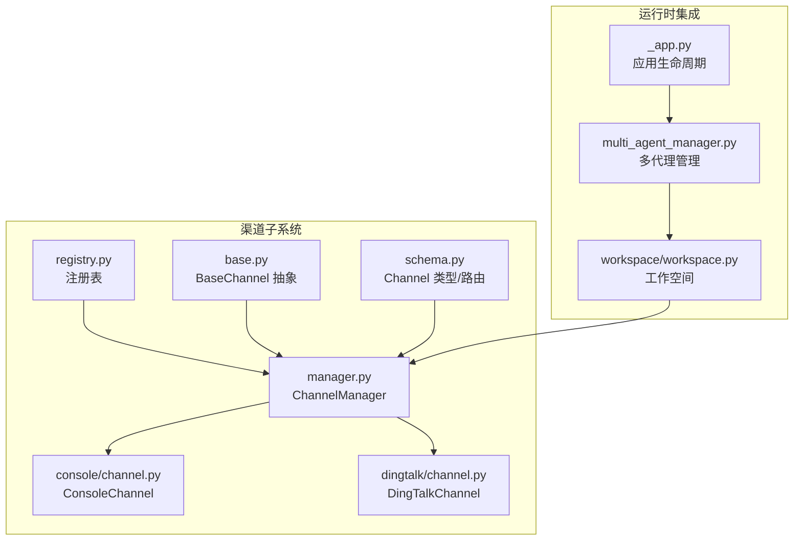
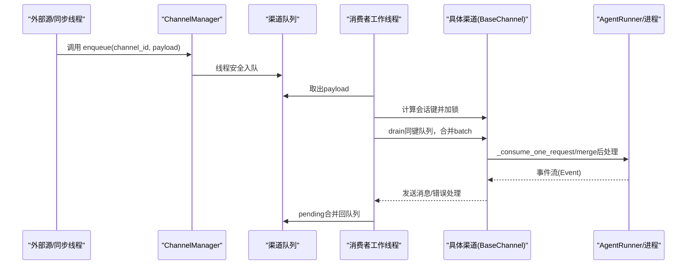
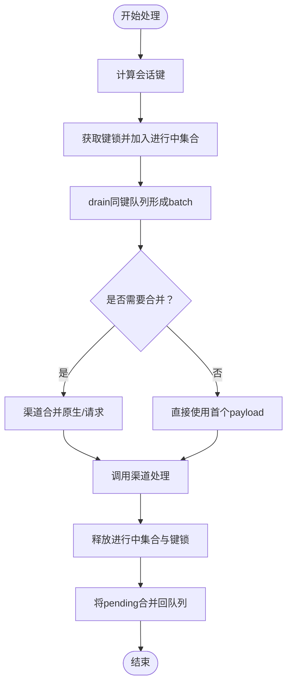
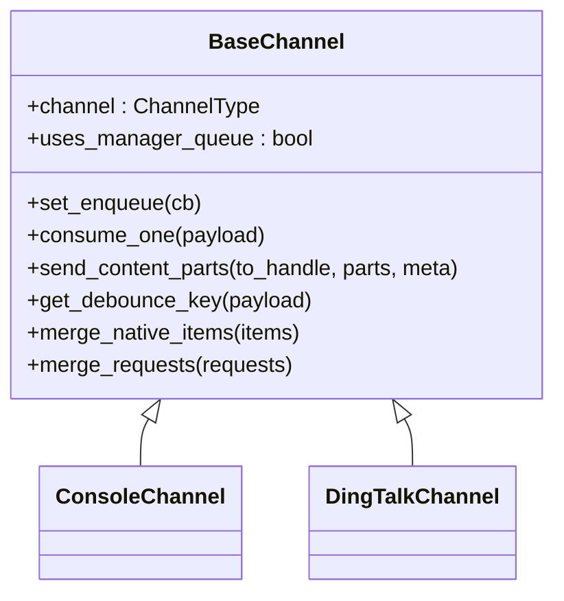
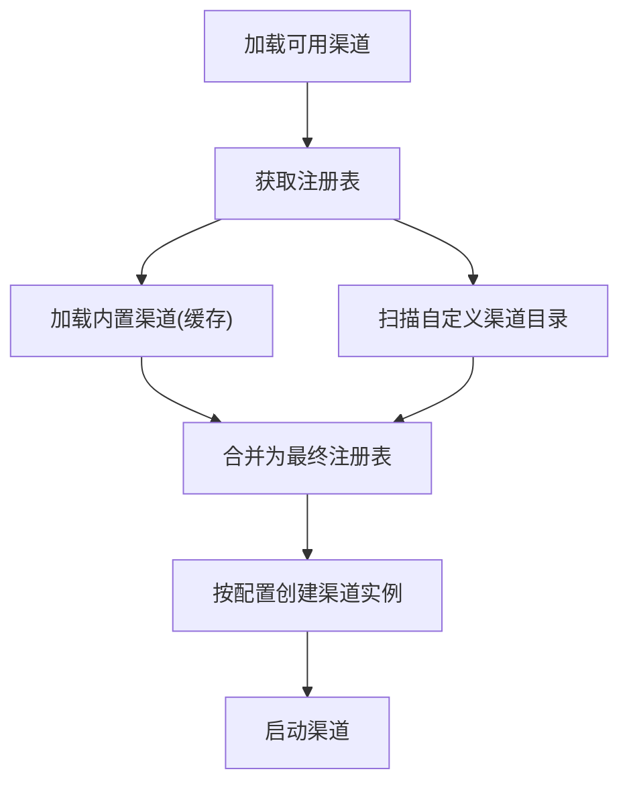
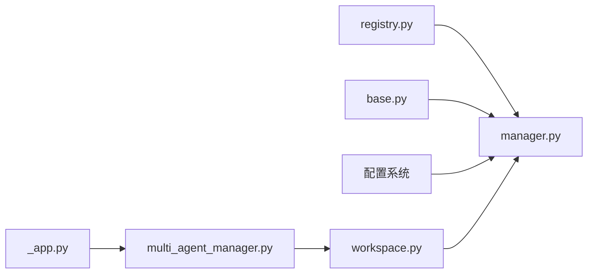

# 渠道管理器

<cite>
**本文引用的文件**
- [manager.py](file://src/copaw/app/channels/manager.py)
- [registry.py](file://src/copaw/app/channels/registry.py)
- [base.py](file://src/copaw/app/channels/base.py)
- [schema.py](file://src/copaw/app/channels/schema.py)
- [channel.py（Console）](file://src/copaw/app/channels/console/channel.py)
- [channel.py（DingTalk）](file://src/copaw/app/channels/dingtalk/channel.py)
- [_app.py](file://src/copaw/app/_app.py)
- [multi_agent_manager.py](file://src/copaw/app/multi_agent_manager.py)
- [workspace.py](file://src/copaw/app/workspace/workspace.py)
</cite>

## 目录
1. [简介](#简介)
2. [项目结构](#项目结构)
3. [核心组件](#核心组件)
4. [架构总览](#架构总览)
5. [详细组件分析](#详细组件分析)
6. [依赖分析](#依赖分析)
7. [性能考虑](#性能考虑)
8. [故障排查指南](#故障排查指南)
9. [结论](#结论)
10. [附录：扩展与调试](#附录扩展与调试)

## 简介
本文件面向开发者与运维人员，系统化阐述 CoPaw 的渠道管理器（ChannelManager）架构与实现细节，覆盖以下主题：
- 异步队列管理与消费者工作线程池
- 会话去重与时间抖动合并机制
- 渠道注册表的动态加载与配置校验流程
- enqueue 的线程安全实现、批量处理策略与错误恢复
- 初始化、启动与停止的正确用法
- 性能优化、内存管理与资源清理最佳实践
- 扩展新渠道类型的开发指南与调试技巧

## 项目结构
渠道子系统位于 src/copaw/app/channels 下，核心文件如下：
- manager.py：ChannelManager 核心实现，负责队列、消费者、会话去重与批量处理
- registry.py：渠道注册表，内置与自定义渠道的发现与缓存
- base.py：渠道抽象基类，统一消费接口、消息渲染、去重与发送协议
- schema.py：渠道类型标识、路由地址与转换协议
- 各具体渠道实现：如 ConsoleChannel、DingTalkChannel 等
- 集成入口：_app.py 中通过 MultiAgentManager 与 Workspace 将 ChannelManager 注入到工作空间

图示来源
- [manager.py:114-565](file://src/copaw/app/channels/manager.py#L114-L565)
- [registry.py:132-137](file://src/copaw/app/channels/registry.py#L132-L137)
- [base.py:69-800](file://src/copaw/app/channels/base.py#L69-L800)
- [schema.py:12-71](file://src/copaw/app/channels/schema.py#L12-L71)
- [_app.py:148-240](file://src/copaw/app/_app.py#L148-L240)
- [multi_agent_manager.py:17-451](file://src/copaw/app/multi_agent_manager.py#L17-L451)
- [workspace.py:39-367](file://src/copaw/app/workspace/workspace.py#L39-L367)

章节来源
- [manager.py:114-565](file://src/copaw/app/channels/manager.py#L114-L565)
- [registry.py:132-137](file://src/copaw/app/channels/registry.py#L132-L137)
- [base.py:69-800](file://src/copaw/app/channels/base.py#L69-L800)
- [schema.py:12-71](file://src/copaw/app/channels/schema.py#L12-L71)
- [_app.py:148-240](file://src/copaw/app/_app.py#L148-L240)
- [multi_agent_manager.py:17-451](file://src/copaw/app/multi_agent_manager.py#L17-L451)
- [workspace.py:39-367](file://src/copaw/app/workspace/workspace.py#L39-L367)

## 核心组件
- ChannelManager：持有各渠道实例、为每个渠道创建队列与消费者任务；实现会话级去重、批量合并与错误恢复；提供 enqueue/send 接口。
- BaseChannel：定义统一的 consume_one 流程、消息渲染、去重与发送协议；子类按需实现解析原生消息、发送内容等。
- 渠道注册表：内置渠道清单与自定义渠道目录扫描，提供统一的渠道类型映射。
- Schema：定义渠道类型、路由地址与转换协议，支持统一的发送目标建模。

章节来源
- [manager.py:114-565](file://src/copaw/app/channels/manager.py#L114-L565)
- [base.py:69-800](file://src/copaw/app/channels/base.py#L69-L800)
- [registry.py:132-137](file://src/copaw/app/channels/registry.py#L132-L137)
- [schema.py:12-71](file://src/copaw/app/channels/schema.py#L12-L71)

## 架构总览
ChannelManager 作为框架所有 BaseChannel 的“拥有者”，负责：
- 从注册表与配置中创建渠道实例
- 为每个启用的渠道建立队列与固定数量的消费者工作线程
- 基于会话键进行去重与批量合并，避免重复与乱序
- 在消费者线程内调用渠道的 consume_one 或其内部流程

图示来源
- [manager.py:289-349](file://src/copaw/app/channels/manager.py#L289-L349)
- [base.py:443-583](file://src/copaw/app/channels/base.py#L443-L583)

章节来源
- [manager.py:289-349](file://src/copaw/app/channels/manager.py#L289-L349)
- [base.py:443-583](file://src/copaw/app/channels/base.py#L443-L583)

## 详细组件分析

### ChannelManager：异步队列、消费者与会话去重
- 队列与消费者
  - 每个启用渠道创建一个有界队列（默认容量），并为每个渠道启动固定数量的消费者工作线程。
  - 消费者循环从队列取出 payload，按会话键去重，drain 同键队列形成 batch，再调用渠道的合并与处理逻辑。
- 会话去重与键锁
  - 使用集合标记“会话进行中”，在处理期间同一会话的后续 payload 进入 pending 缓存。
  - 使用 per-key 锁确保同一会话的 drain 与合并原子性，避免不同工作线程拆分同一会话。
- 批量处理与合并
  - 对原生 payload 与请求 payload 分别提供合并策略，减少重复处理与网络往返。
  - 支持渠道特定的合并（如钉钉 AI 卡场景），并在处理完成后将 pending 合并回队列。
- 线程安全 enqueue
  - 通过事件循环的 call_soon_threadsafe 将入队操作切换到事件循环线程执行，保证队列入队的线程安全。
- 生命周期管理
  - start_all：创建队列、注册回调、启动消费者任务，并逐个启动渠道。
  - stop_all：取消消费者任务、清空状态、停止各渠道，保证优雅关停。

图示来源
- [manager.py:307-349](file://src/copaw/app/channels/manager.py#L307-L349)
- [manager.py:42-112](file://src/copaw/app/channels/manager.py#L42-L112)

章节来源
- [manager.py:114-565](file://src/copaw/app/channels/manager.py#L114-L565)
- [manager.py:42-112](file://src/copaw/app/channels/manager.py#L42-L112)

### BaseChannel：统一消费流程与去重
- 统一消费接口
  - consume_one：支持时间抖动缓冲（native payload）与无文本去重（先缓冲，待文本到达再合并发送）。
  - _consume_one_request：将 payload 转换为 AgentRequest，注入 channel_meta，运行进程并发送消息，最后触发 on_reply_sent 回调。
- 去重与合并
  - get_debounce_key：基于 session_id 或会话解析函数生成键，确保同一会话的去重。
  - merge_native_items/merge_requests：对原生与请求进行合并，减少重复处理。
- 发送协议
  - send_content_parts：将消息拆分为文本与媒体，统一发送；媒体部分可由子类覆盖为真实附件发送。
  - on_event_message_completed/on_event_response：事件钩子，便于子类实现批处理或延迟发送。

图示来源
- [base.py:69-800](file://src/copaw/app/channels/base.py#L69-L800)
- [channel.py（Console）:56-471](file://src/copaw/app/channels/console/channel.py#L56-L471)
- [channel.py（DingTalk）:81-800](file://src/copaw/app/channels/dingtalk/channel.py#L81-L800)

章节来源
- [base.py:69-800](file://src/copaw/app/channels/base.py#L69-L800)
- [channel.py（Console）:56-471](file://src/copaw/app/channels/console/channel.py#L56-L471)
- [channel.py（DingTalk）:81-800](file://src/copaw/app/channels/dingtalk/channel.py#L81-L800)

### 渠道注册表：动态加载与配置校验
- 内置渠道
  - 通过模块名与类名映射内置渠道，失败时根据是否必需决定抛出异常或记录日志。
- 自定义渠道
  - 从自定义目录扫描 Python 文件或包，导入并查找继承自 BaseChannel 的类，注册为可用渠道。
- 缓存与并发
  - 使用全局锁缓存内置渠道列表，避免重复导入；自定义渠道每次扫描。
- 配置校验
  - ChannelManager.from_config 读取可用渠道列表与配置，过滤未启用项，按渠道签名参数动态传参，捕获初始化异常并跳过。

图示来源
- [registry.py:42-137](file://src/copaw/app/channels/registry.py#L42-L137)
- [manager.py:135-247](file://src/copaw/app/channels/manager.py#L135-L247)

章节来源
- [registry.py:42-137](file://src/copaw/app/channels/registry.py#L42-L137)
- [manager.py:135-247](file://src/copaw/app/channels/manager.py#L135-L247)

### 具体渠道实现要点
- ConsoleChannel
  - 仅输出到终端，支持过滤工具详情与思考内容；媒体路径解析到工作区媒体目录。
  - 提供 SSE 流式输出与一次性消费接口。
- DingTalkChannel
  - 复杂的去重与回复机制：基于消息 ID 的去重、早期 ACK、批量回复 Future 解析、会话 Webhook 存储与持久化。
  - 支持 AI 卡状态管理、Markdown 规范化、媒体上传与会话 Webhook 发送。

章节来源
- [channel.py（Console）:56-471](file://src/copaw/app/channels/console/channel.py#L56-L471)
- [channel.py（DingTalk）:81-800](file://src/copaw/app/channels/dingtalk/channel.py#L81-L800)

## 依赖分析
- ChannelManager 依赖
  - 渠道注册表：用于创建渠道实例
  - BaseChannel：统一消费与发送协议
  - 配置系统：读取可用渠道与渠道配置
- 集成点
  - Workspace 通过服务描述符注册 ChannelManager，并在启动阶段调用 start_all，在停止阶段调用 stop_all
  - MultiAgentManager 与应用生命周期在启动/关闭时协调 Workspace 的启停

图示来源
- [manager.py:114-565](file://src/copaw/app/channels/manager.py#L114-L565)
- [workspace.py:217-228](file://src/copaw/app/workspace/workspace.py#L217-L228)
- [multi_agent_manager.py:183-188](file://src/copaw/app/multi_agent_manager.py#L183-L188)
- [_app.py:212-220](file://src/copaw/app/_app.py#L212-L220)

章节来源
- [manager.py:114-565](file://src/copaw/app/channels/manager.py#L114-L565)
- [workspace.py:217-228](file://src/copaw/app/workspace/workspace.py#L217-L228)
- [multi_agent_manager.py:183-188](file://src/copaw/app/multi_agent_manager.py#L183-L188)
- [_app.py:212-220](file://src/copaw/app/_app.py#L212-L220)

## 性能考虑
- 队列容量与并发
  - 默认队列容量与每渠道消费者数量可在 ChannelManager 中调整，以平衡吞吐与内存占用。
- 去重与合并
  - 通过会话键去重与批量合并显著降低重复处理与网络调用次数；注意合并策略的复杂度与内存峰值。
- 时间抖动
  - BaseChannel 的时间抖动缓冲适合长尾输入（如语音片段），但需合理设置抖动窗口，避免响应延迟。
- I/O 与线程切换
  - enqueue 使用事件循环线程安全切换，避免跨线程共享状态；消费者线程内尽量减少阻塞操作，必要时使用异步 I/O。
- 资源清理
  - stop_all 会取消消费者任务并清理状态；确保渠道实现 stop 时释放连接、定时器与文件句柄。

[本节为通用指导，无需列出章节来源]

## 故障排查指南
- 启动失败
  - 检查注册表是否成功加载内置渠道；自定义渠道导入异常会被记录并跳过。
  - from_config 中的初始化异常会被捕获并记录，确认配置字段与签名一致。
- 消费异常
  - 消费者循环捕获异常并记录日志；检查渠道的 consume_one 实现与外部 API 调用。
- 去重与乱序
  - 确认 get_debounce_key 返回稳定的会话键；检查键锁与进行中集合是否正确释放。
- 线程安全问题
  - 确保通过 ChannelManager.enqueue 进行入队；避免在非事件循环线程直接访问队列。
- 资源泄漏
  - 停止时确认消费者任务被取消且等待完成；渠道 stop 应释放 HTTP 客户端、定时器与存储。

章节来源
- [registry.py:42-137](file://src/copaw/app/channels/registry.py#L42-L137)
- [manager.py:135-247](file://src/copaw/app/channels/manager.py#L135-L247)
- [manager.py:341-349](file://src/copaw/app/channels/manager.py#L341-L349)
- [base.py:576-583](file://src/copaw/app/channels/base.py#L576-L583)

## 结论
ChannelManager 通过统一的队列、消费者与会话去重机制，为多渠道接入提供了稳定、可扩展的基础设施。结合 BaseChannel 的抽象与注册表的动态加载能力，系统能够快速适配新的渠道类型，并在高并发场景下保持良好的吞吐与稳定性。遵循本文的初始化、生命周期管理与性能优化建议，可有效提升系统的可靠性与可维护性。

[本节为总结性内容，无需列出章节来源]

## 附录：扩展与调试

### 如何正确初始化、启动与停止 ChannelManager
- 从环境变量创建
  - 使用 from_env 获取可用渠道列表与注册表，注入统一的进程处理器与回调。
- 从配置创建
  - 使用 from_config 读取配置对象，按渠道启用状态与签名参数动态创建实例。
- 启动
  - 调用 start_all 创建队列、注册回调、启动消费者任务并逐个启动渠道。
- 停止
  - 调用 stop_all 取消消费者任务、清空状态并停止各渠道。

章节来源
- [manager.py:135-155](file://src/copaw/app/channels/manager.py#L135-L155)
- [manager.py:157-247](file://src/copaw/app/channels/manager.py#L157-L247)
- [manager.py:350-411](file://src/copaw/app/channels/manager.py#L350-L411)

### 扩展新渠道类型的开发指南
- 继承 BaseChannel
  - 实现 from_env/from_config 以支持两种创建方式；实现 build_agent_request_from_native 解析原生消息为 AgentRequest。
  - 如需时间抖动或会话去重，设置 _debounce_seconds 并实现 get_debounce_key。
- 发送实现
  - 实现 send_content_parts 或更细粒度的 send_* 方法；如需媒体附件，实现 send_media。
- 生命周期
  - 实现 start/stop，确保打开/关闭必要的连接、定时器与后台线程。
- 注册与测试
  - 将新渠道类放入自定义渠道目录，确保类名与 channel 属性正确；通过注册表自动发现。

章节来源
- [base.py:317-800](file://src/copaw/app/channels/base.py#L317-L800)
- [registry.py:94-137](file://src/copaw/app/channels/registry.py#L94-L137)

### 调试技巧
- 日志级别
  - 提升日志级别以观察队列、去重与合并行为；关注消费者异常堆栈。
- 关键路径断点
  - 在 _consume_one_request、merge_native_items/merge_requests、send_content_parts 等关键方法设置断点。
- 会话追踪
  - 通过 get_debounce_key 与 session_id 输出，核对同一会话的消息顺序与去重效果。
- 资源监控
  - 监控队列长度、消费者任务数量与渠道连接数，定位瓶颈与泄漏。

章节来源
- [manager.py:307-349](file://src/copaw/app/channels/manager.py#L307-L349)
- [base.py:443-583](file://src/copaw/app/channels/base.py#L443-L583)