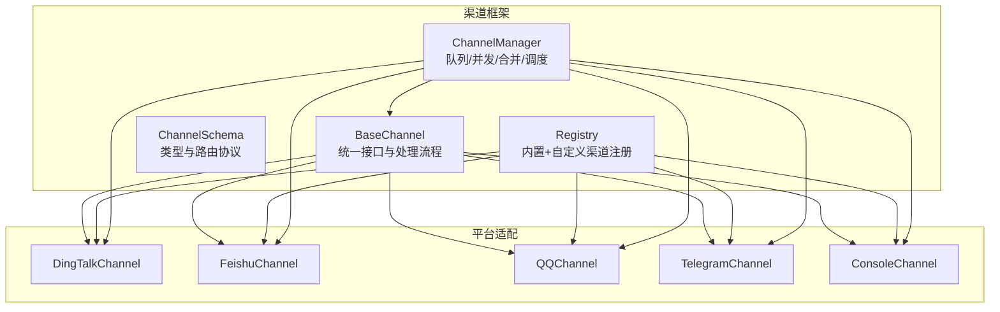
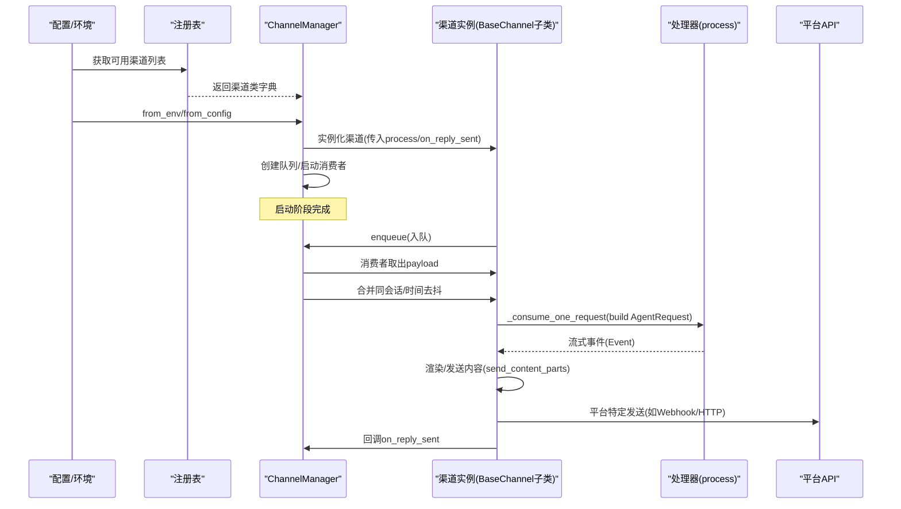
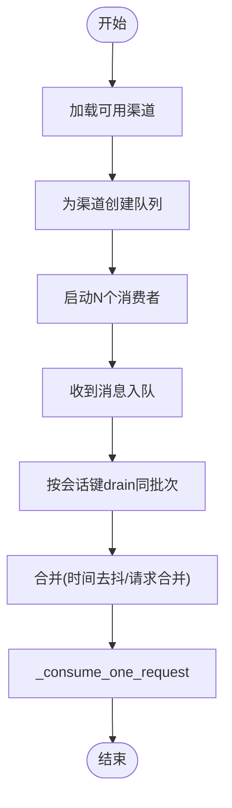
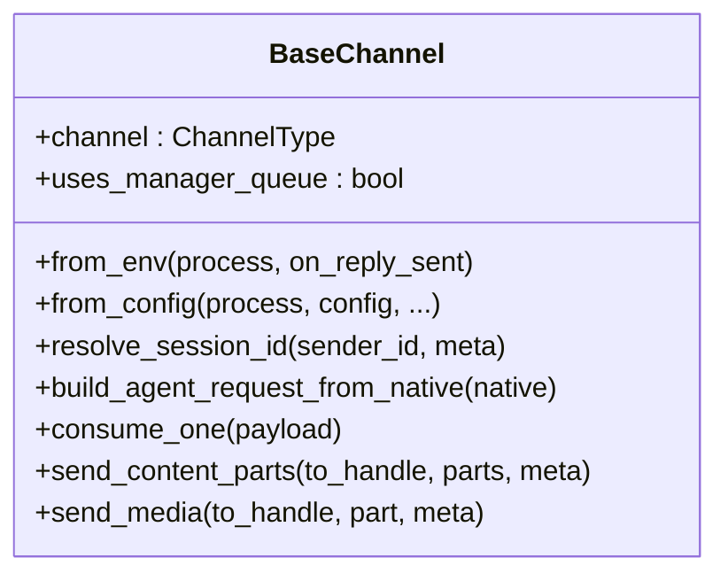
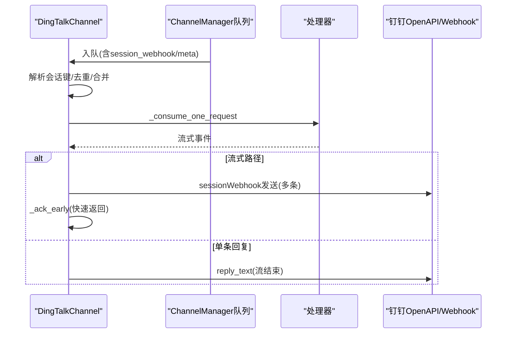
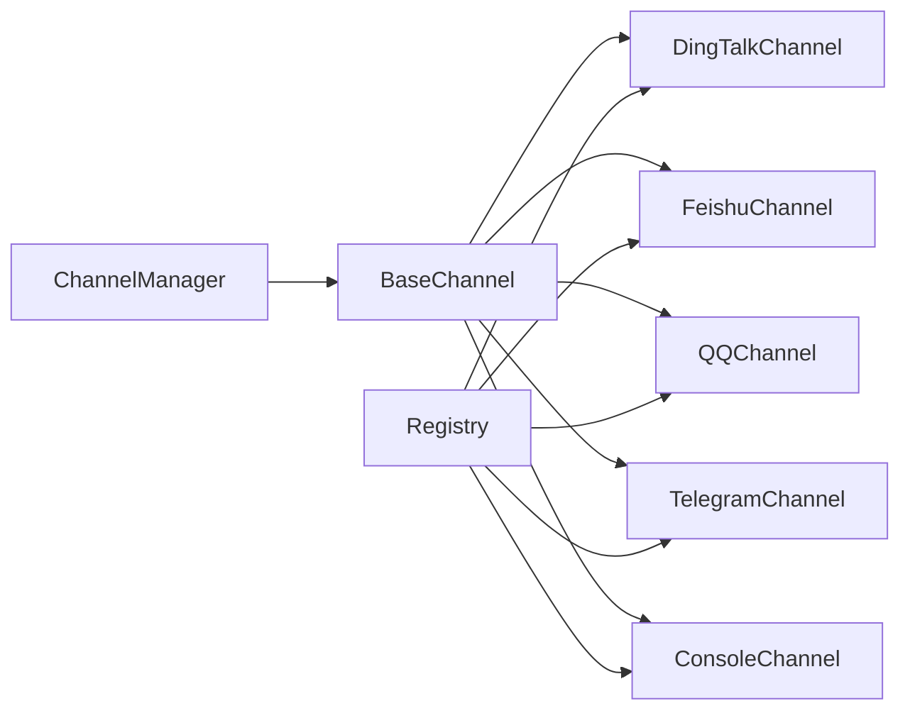

# 聊天渠道系统

<cite>
**本文档引用的文件**
- [src/copaw/app/channels/__init__.py](file://src/copaw/app/channels/__init__.py)
- [src/copaw/app/channels/manager.py](file://src/copaw/app/channels/manager.py)
- [src/copaw/app/channels/base.py](file://src/copaw/app/channels/base.py)
- [src/copaw/app/channels/registry.py](file://src/copaw/app/channels/registry.py)
- [src/copaw/app/channels/schema.py](file://src/copaw/app/channels/schema.py)
- [src/copaw/app/channels/dingtalk/channel.py](file://src/copaw/app/channels/dingtalk/channel.py)
- [src/copaw/app/channels/feishu/channel.py](file://src/copaw/app/channels/feishu/channel.py)
- [src/copaw/app/channels/qq/channel.py](file://src/copaw/app/channels/qq/channel.py)
- [src/copaw/app/channels/telegram/channel.py](file://src/copaw/app/channels/telegram/channel.py)
- [src/copaw/app/channels/console/channel.py](file://src/copaw/app/channels/console/channel.py)
</cite>

## 目录
1. [简介](#简介)
2. [项目结构](#项目结构)
3. [核心组件](#核心组件)
4. [架构总览](#架构总览)
5. [详细组件分析](#详细组件分析)
6. [依赖关系分析](#依赖关系分析)
7. [性能考虑](#性能考虑)
8. [故障排除指南](#故障排除指南)
9. [结论](#结论)
10. [附录](#附录)

## 简介
本文件面向CoPaw聊天渠道系统的使用者与开发者，系统性阐述渠道管理器的架构设计、动态注册机制与运行时行为；详解主流平台（钉钉、飞书、QQ、Telegram等）的集成实现与适配差异；给出渠道配置、消息路由与状态管理的完整说明，并提供扩展新渠道的开发流程与最佳实践。

## 项目结构
CoPaw的渠道系统位于src/copaw/app/channels目录下，采用“基类抽象 + 多平台适配 + 注册表动态加载”的分层设计：
- 基础框架：BaseChannel定义统一接口与处理流程
- 管理器：ChannelManager负责队列、并发消费、会话去重与合并
- 注册表：registry集中管理内置与自定义渠道类
- 平台适配：各平台独立模块实现具体协议与API交互
- 公共模式：schema定义通道类型与路由协议

**图表来源**
- [src/copaw/app/channels/base.py:69-800](file://src/copaw/app/channels/base.py#L69-L800)
- [src/copaw/app/channels/manager.py:114-565](file://src/copaw/app/channels/manager.py#L114-L565)
- [src/copaw/app/channels/registry.py:19-137](file://src/copaw/app/channels/registry.py#L19-L137)
- [src/copaw/app/channels/schema.py:12-71](file://src/copaw/app/channels/schema.py#L12-L71)

**章节来源**
- [src/copaw/app/channels/__init__.py:1-14](file://src/copaw/app/channels/__init__.py#L1-L14)
- [src/copaw/app/channels/registry.py:19-137](file://src/copaw/app/channels/registry.py#L19-L137)
- [src/copaw/app/channels/schema.py:12-71](file://src/copaw/app/channels/schema.py#L12-L71)

## 核心组件
- BaseChannel：所有渠道的抽象基类，定义统一的消息解析、请求构建、事件处理、内容发送与错误处理流程；支持时间去抖、同会话合并、媒体内容渲染与发送等通用能力。
- ChannelManager：持有各渠道实例与队列，启动/停止渠道生命周期，按会话键进行去重与批量合并，多消费者并行处理，支持动态替换单个渠道。
- Registry：内置渠道清单与自定义渠道发现，通过包导入与工作目录扫描实现动态注册。
- Schema：定义通道类型标识、路由地址模型与消息转换协议，统一对外暴露的路由与转换接口。

关键特性
- 会话隔离：基于session_id或平台特定键进行去重与合并，避免重复处理与乱序。
- 时间去抖：对无文本输入的内容进行缓冲合并，待有文本时一次性发送，提升体验。
- 多消费者：每个渠道默认4个消费者并行处理不同会话，提高吞吐。
- 动态替换：支持在运行时替换指定渠道实例，保证服务不中断。

**章节来源**
- [src/copaw/app/channels/base.py:69-800](file://src/copaw/app/channels/base.py#L69-L800)
- [src/copaw/app/channels/manager.py:114-565](file://src/copaw/app/channels/manager.py#L114-L565)
- [src/copaw/app/channels/registry.py:19-137](file://src/copaw/app/channels/registry.py#L19-L137)
- [src/copaw/app/channels/schema.py:12-71](file://src/copaw/app/channels/schema.py#L12-L71)

## 架构总览
下图展示从配置/环境变量到渠道实例化、入队、消费、处理与回复的整体流程：

**图表来源**
- [src/copaw/app/channels/manager.py:135-247](file://src/copaw/app/channels/manager.py#L135-L247)
- [src/copaw/app/channels/base.py:404-583](file://src/copaw/app/channels/base.py#L404-L583)
- [src/copaw/app/channels/registry.py:132-137](file://src/copaw/app/channels/registry.py#L132-L137)

## 详细组件分析

### 渠道管理器 ChannelManager
职责
- 从配置/环境加载渠道类，实例化渠道并注入统一处理器
- 为每个渠道创建队列与固定数量的消费者线程
- 对同会话消息进行去重与合并，支持时间去抖
- 提供动态替换单个渠道的能力
- 统一对外发送接口（文本/事件）

运行机制
- 队列与消费者：每个启用渠道创建容量上限队列，4个消费者并发处理
- 会话去重：同一会话键在同一时刻仅由一个消费者处理，其他消息暂存至pending
- 批量合并：同会话队列中同一批次的消息合并为一次处理
- 动态替换：新渠道先预启动并接管队列，再交换旧渠道并安全停止

**图表来源**
- [src/copaw/app/channels/manager.py:307-378](file://src/copaw/app/channels/manager.py#L307-L378)
- [src/copaw/app/channels/manager.py:419-483](file://src/copaw/app/channels/manager.py#L419-L483)

**章节来源**
- [src/copaw/app/channels/manager.py:114-565](file://src/copaw/app/channels/manager.py#L114-L565)

### 渠道基类 BaseChannel
职责
- 定义统一的Native->AgentRequest转换、会话解析、内容渲染与发送
- 提供时间去抖、同会话合并、媒体渲染与发送钩子
- 提供统一的错误处理与回调(on_reply_sent)

关键点
- 会话键：get_debounce_key优先使用payload中的session_id，否则由resolve_session_id生成
- 内容去抖：_apply_no_text_debounce对纯媒体消息进行缓冲，待出现文本时合并发送
- 发送策略：send_content_parts将多类型内容合并为文本主体+媒体占位，必要时逐个发送媒体
- 钩子扩展：_before_consume_process/on_event_message_completed/on_event_response可被子类覆盖

**图表来源**
- [src/copaw/app/channels/base.py:69-800](file://src/copaw/app/channels/base.py#L69-L800)

**章节来源**
- [src/copaw/app/channels/base.py:69-800](file://src/copaw/app/channels/base.py#L69-L800)

### 渠道注册表 Registry
- 内置渠道清单：imessage、discord、dingtalk、feishu、qq、telegram、mattermost、mqtt、console、matrix、voice、wecom、xiaoyi
- 自定义渠道：扫描CUSTOM_CHANNELS_DIR，动态导入并注册继承自BaseChannel的类
- 缓存与失败策略：内置渠道缓存，必需渠道失败直接抛出异常，非必需渠道记录日志并跳过

**章节来源**
- [src/copaw/app/channels/registry.py:19-137](file://src/copaw/app/channels/registry.py#L19-L137)

### 渠道类型与路由 Schema
- ChannelType：字符串类型，内置渠道使用固定枚举，插件可使用任意字符串
- ChannelAddress：统一路由模型(kind/id/extra)，替代分散的meta键
- 协议：ChannelMessageConverter定义了Native->AgentRequest与响应发送的协议

**章节来源**
- [src/copaw/app/channels/schema.py:12-71](file://src/copaw/app/channels/schema.py#L12-L71)

### 钉钉渠道 DingTalkChannel
特性
- 支持WebSocket流式回调与sessionWebhook两种回复路径
- 会话Webhook持久化存储，支持重启后恢复
- 多消息合并发送，避免重复回复风暴
- 媒体上传与下载，支持AI卡片状态管理

实现要点
- 会话键：短会话ID（基于conversation_id后缀），便于定时任务查找
- 去重：基于message_id集合，防止重复处理
- Webhook存储：内存+磁盘双层持久化，支持按session_id检索
- 响应策略：流式路径提前ACK，完成后统一合并回复

**图表来源**
- [src/copaw/app/channels/dingtalk/channel.py:257-416](file://src/copaw/app/channels/dingtalk/channel.py#L257-L416)
- [src/copaw/app/channels/dingtalk/channel.py:469-541](file://src/copaw/app/channels/dingtalk/channel.py#L469-L541)

**章节来源**
- [src/copaw/app/channels/dingtalk/channel.py:81-800](file://src/copaw/app/channels/dingtalk/channel.py#L81-L800)

### 飞书渠道 FeishuChannel
特性
- 使用WebSocket接收事件，Open API发送消息
- 会话键：群聊用chat_id短键，私聊用open_id短键
- 接收ID缓存：receive_id与receive_id_type映射，支持主动发送
- 媒体下载：图片/文件/音频资源下载到本地媒体目录

实现要点
- 去重：维护消息ID有序集合，超过阈值自动淘汰
- 用户名缓存：昵称缓存限制大小，避免内存膨胀
- 会话解析：优先使用meta中的chat_id/open_id，否则回退到sender_id
- 发送路径：根据receive_id_type选择chat_id或open_id

**章节来源**
- [src/copaw/app/channels/feishu/channel.py:145-800](file://src/copaw/app/channels/feishu/channel.py#L145-L800)

### QQ渠道 QQChannel
特性
- WebSocket接收事件，HTTP API发送消息
- 支持C2C/群组/频道/私信多种场景
- 媒体上传：通过富媒体服务器上传，支持图片/视频/文件
- 文本发送降级：Markdown失败回退纯文本，URL内容二次清洗

实现要点
- 连接管理：心跳控制器、断线重连、快速断开计数
- 发送路由：根据消息类型选择对应API路径与参数
- 错误处理：分级降级（Markdown->纯文本->URL清洗），避免重复发送

**章节来源**
- [src/copaw/app/channels/qq/channel.py:503-800](file://src/copaw/app/channels/qq/channel.py#L503-L800)

### Telegram渠道 TelegramChannel
特性
- Bot API轮询接收，HTML格式发送
- 支持分段发送（超长文本自动切片）
- 媒体发送：图片/视频/音频/文件，带大小与权限检查
- 输入提示：typing动作循环显示，超时自动停止

实现要点
- 会话键：telegram:{chat_id}
- 文本发送：优先HTML，失败回退纯文本
- 媒体发送：统一方法封装，异常分类处理（过大/不可用/权限/网络等）

**章节来源**
- [src/copaw/app/channels/telegram/channel.py:264-800](file://src/copaw/app/channels/telegram/channel.py#L264-L800)

### 控制台渠道 ConsoleChannel
特性
- 将Agent输出打印到终端，支持过滤工具详情与思考内容
- 支持SSE流式输出，便于前端实时展示
- 上传文件解析：将URL映射到工作空间媒体目录

实现要点
- 会话键：显式meta优先，否则console:{sender_id}
- 输出美化：ANSI颜色与时间戳，区分文本/媒体/拒绝信息
- 前端推送：将文本内容推送到控制台推送存储

**章节来源**
- [src/copaw/app/channels/console/channel.py:56-471](file://src/copaw/app/channels/console/channel.py#L56-L471)

## 依赖关系分析
- 模块耦合
  - ChannelManager依赖BaseChannel接口与注册表，解耦具体平台实现
  - 各平台Channel仅依赖BaseChannel与少量公共工具，低耦合高内聚
- 外部依赖
  - 平台SDK：钉钉流、飞书WebSocket、Telegram SDK、QQ API
  - 异步HTTP：aiohttp用于平台API调用
- 可能的循环依赖
  - 通过延迟导入与运行时注册避免循环依赖

**图表来源**
- [src/copaw/app/channels/manager.py:114-156](file://src/copaw/app/channels/manager.py#L114-L156)
- [src/copaw/app/channels/registry.py:132-137](file://src/copaw/app/channels/registry.py#L132-L137)

**章节来源**
- [src/copaw/app/channels/manager.py:114-156](file://src/copaw/app/channels/manager.py#L114-L156)
- [src/copaw/app/channels/registry.py:132-137](file://src/copaw/app/channels/registry.py#L132-L137)

## 性能考虑
- 并发模型：每渠道4个消费者并行处理不同会话，最大化吞吐
- 队列容量：单队列最大1000，避免内存暴涨
- 合并与去抖：减少重复处理与平台API调用次数
- 媒体处理：本地缓存与限流，避免频繁IO与超大文件
- 心跳与重连：平台侧连接稳定性保障（QQ/Telegram）

## 故障排除指南
常见问题与定位
- 渠道未生效
  - 检查配置中的enabled字段与可用渠道列表
  - 查看注册表是否成功导入对应模块
- 消息重复/乱序
  - 确认会话键是否正确（resolve_session_id）
  - 检查去重集合与时间去抖设置
- 平台API错误
  - 钉钉：校验client_id/secret、机器人配置、Webhook有效期
  - 飞书：校验app_id/secret、权限范围、token刷新逻辑
  - QQ：校验app_id/client_secret、API根地址、富媒体上传权限
  - Telegram：校验bot_token、代理配置、文件大小限制
- 媒体发送失败
  - 检查本地媒体目录权限与路径解析
  - 针对Telegram的文件过大/不可用/权限/网络错误进行分类处理
- 动态替换失败
  - 确保新渠道预启动成功且队列已创建
  - 关注旧渠道停止过程中的异常日志

**章节来源**
- [src/copaw/app/channels/dingtalk/channel.py:469-541](file://src/copaw/app/channels/dingtalk/channel.py#L469-L541)
- [src/copaw/app/channels/feishu/channel.py:398-446](file://src/copaw/app/channels/feishu/channel.py#L398-L446)
- [src/copaw/app/channels/qq/channel.py:585-620](file://src/copaw/app/channels/qq/channel.py#L585-L620)
- [src/copaw/app/channels/telegram/channel.py:652-768](file://src/copaw/app/channels/telegram/channel.py#L652-L768)
- [src/copaw/app/channels/manager.py:419-483](file://src/copaw/app/channels/manager.py#L419-L483)

## 结论
CoPaw的聊天渠道系统通过清晰的抽象与动态注册机制，实现了对多平台的统一接入与扩展。ChannelManager提供稳定的并发与合并能力，BaseChannel统一了消息处理与发送流程，Registry与Schema保证了可插拔与可路由性。平台适配模块在保持低耦合的同时，针对各自生态提供了完善的发送与接收能力。对于新增渠道，遵循BaseChannel接口与配置约定即可快速集成。

## 附录

### 渠道配置与启用
- 环境变量驱动：各渠道均支持环境变量配置（如DINGTALK_*、FEISHU_*、QQ_*、TELEGRAM_*、CONSOLE_*）
- 配置文件驱动：from_config支持从配置对象中读取渠道参数
- 启用控制：enabled字段控制渠道是否初始化与参与队列

**章节来源**
- [src/copaw/app/channels/dingtalk/channel.py:182-216](file://src/copaw/app/channels/dingtalk/channel.py#L182-L216)
- [src/copaw/app/channels/feishu/channel.py:230-260](file://src/copaw/app/channels/feishu/channel.py#L230-L260)
- [src/copaw/app/channels/qq/channel.py:621-636](file://src/copaw/app/channels/qq/channel.py#L621-L636)
- [src/copaw/app/channels/telegram/channel.py:453-482](file://src/copaw/app/channels/telegram/channel.py#L453-L482)
- [src/copaw/app/channels/console/channel.py:123-136](file://src/copaw/app/channels/console/channel.py#L123-L136)

### 消息路由与会话管理
- 会话键：resolve_session_id提供平台特定的会话标识
- 路由模型：ChannelAddress统一路由，to_handle_from_target将会话映射为平台目标
- 主动发送：send_text/send_event支持按会话键查找目标并发送

**章节来源**
- [src/copaw/app/channels/base.py:341-352](file://src/copaw/app/channels/base.py#L341-L352)
- [src/copaw/app/channels/feishu/channel.py:369-374](file://src/copaw/app/channels/feishu/channel.py#L369-L374)
- [src/copaw/app/channels/dingtalk/channel.py:293-297](file://src/copaw/app/channels/dingtalk/channel.py#L293-L297)
- [src/copaw/app/channels/manager.py:484-512](file://src/copaw/app/channels/manager.py#L484-L512)

### 扩展新渠道开发流程
- 新建模块：在channels目录下创建新模块，实现类继承BaseChannel
- 实现接口：
  - from_env/from_config：从环境/配置创建实例
  - build_agent_request_from_native：解析平台原生消息为AgentRequest
  - send_content_parts/send_media：发送内容与媒体
  - resolve_session_id/to_handle_from_target：会话与路由
- 注册与测试：
  - 在注册表中添加或放置于自定义目录
  - 启用渠道并验证消息收发、媒体、会话键与去重
- 最佳实践：
  - 明确会话键与去重策略
  - 处理平台API错误与限流
  - 提供必要的媒体下载/上传能力
  - 保持与BaseChannel钩子的一致性

**章节来源**
- [src/copaw/app/channels/base.py:321-340](file://src/copaw/app/channels/base.py#L321-L340)
- [src/copaw/app/channels/registry.py:94-127](file://src/copaw/app/channels/registry.py#L94-L127)