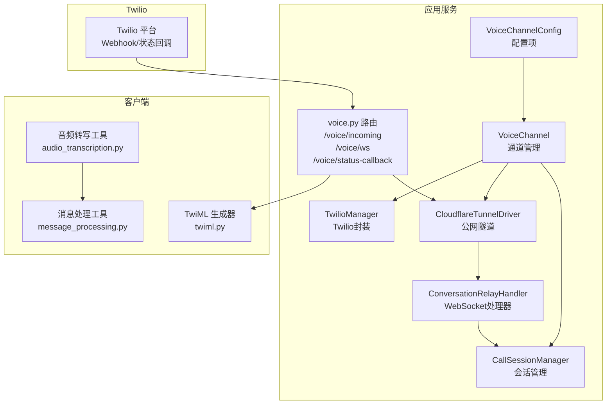
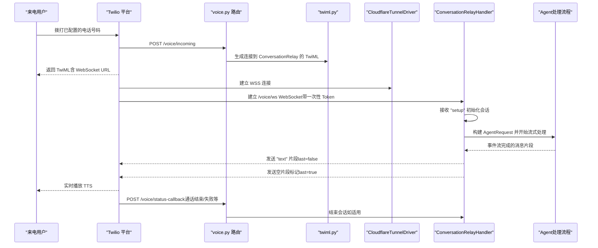
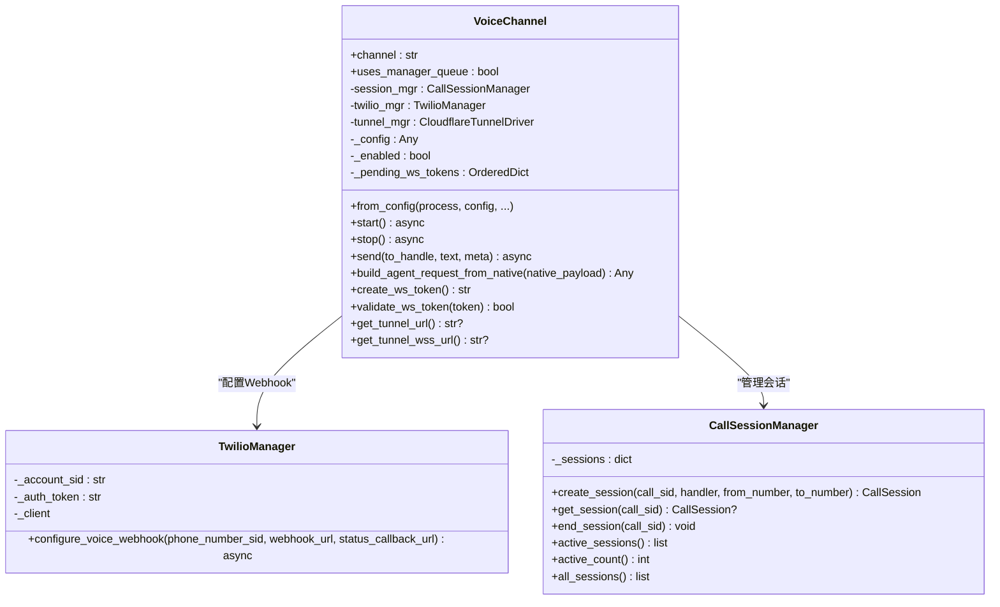
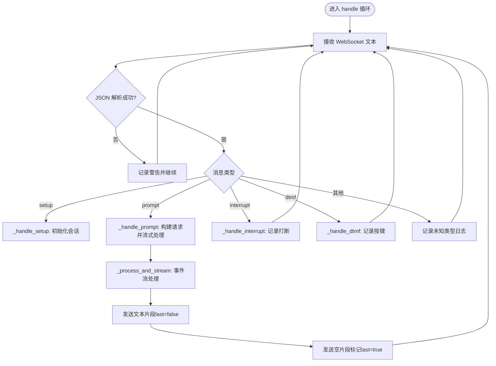
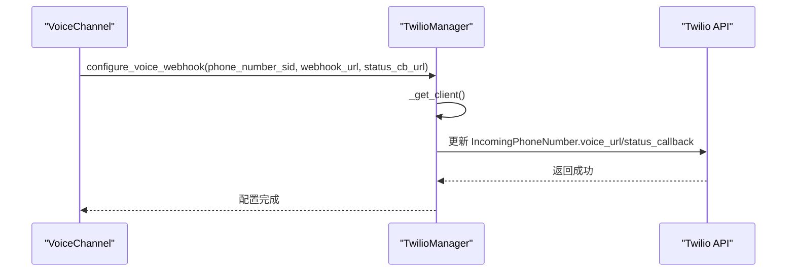
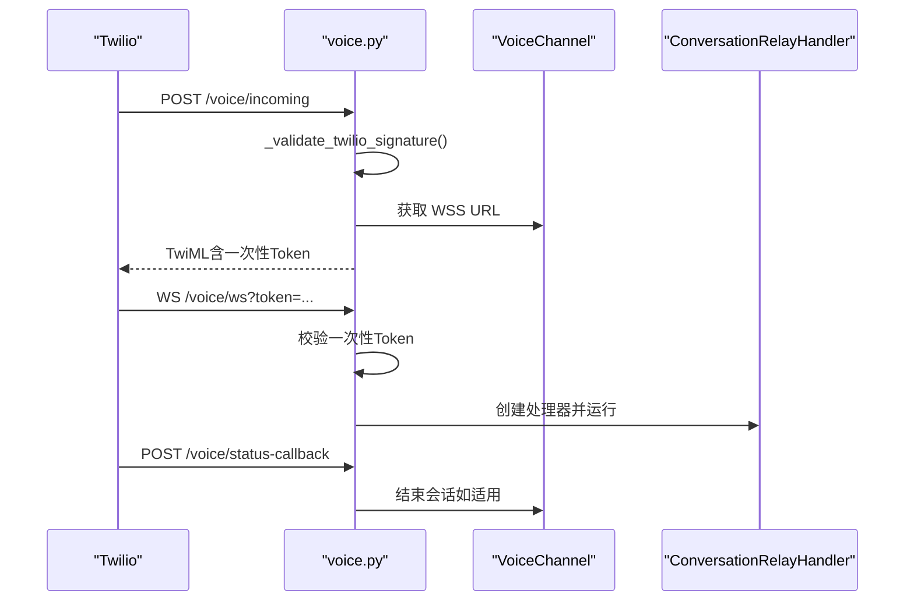
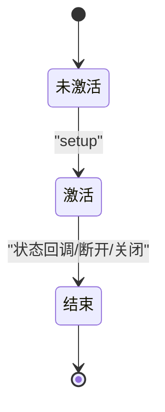
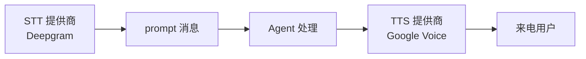
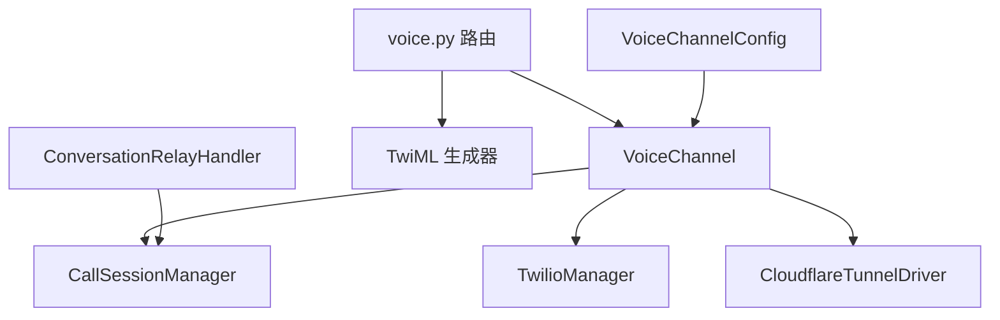

# 语音通道系统

<cite>
**本文档引用的文件**
- [channel.py](file://src/copaw/app/channels/voice/channel.py)
- [twilio_manager.py](file://src/copaw/app/channels/voice/twilio_manager.py)
- [session.py](file://src/copaw/app/channels/voice/session.py)
- [conversation_relay.py](file://src/copaw/app/channels/voice/conversation_relay.py)
- [twiml.py](file://src/copaw/app/channels/voice/twiml.py)
- [voice.py](file://src/copaw/app/routers/voice.py)
- [cloudflare.py](file://src/copaw/tunnel/cloudflare.py)
- [config.py](file://src/copaw/config/config.py)
- [channels_cmd.py](file://src/copaw/cli/channels_cmd.py)
- [audio_transcription.py](file://src/copaw/agents/utils/audio_transcription.py)
- [message_processing.py](file://src/copaw/agents/utils/message_processing.py)
- [index.tsx](file://console/src/pages/Settings/VoiceTranscription/index.tsx)
- [ChannelDrawer.tsx](file://console/src/pages/Control/Channels/components/ChannelDrawer.tsx)
</cite>

## 目录
1. [简介](#简介)
2. [项目结构](#项目结构)
3. [核心组件](#核心组件)
4. [架构总览](#架构总览)
5. [详细组件分析](#详细组件分析)
6. [依赖关系分析](#依赖关系分析)
7. [性能考虑](#性能考虑)
8. [故障排除指南](#故障排除指南)
9. [结论](#结论)
10. [附录](#附录)

## 简介
本文件为 CoPaw 语音通道系统的完整技术文档，聚焦于电话语音集成的实现，包括 Twilio API 使用、语音会话管理与通话转录功能。文档覆盖从电话呼入到实时语音交互的完整链路：Twilio Webhook 接收、Cloudflare 隧道建立、WebSocket 连接、会话状态管理、转录与 TTS 播放、以及异常恢复与安全校验。同时提供 Twilio 账户配置、号码购买与 Webhook 设置流程，以及语音转文字、文字转语音与音频质量优化的技术要点，并给出计费管理、通话记录与质量监控方案，最后提供调试工具、性能优化与故障排除指南。

## 项目结构
语音通道系统主要由以下模块组成：
- 通道层：VoiceChannel（通道入口与生命周期管理）
- 会话层：CallSessionManager（会话注册与状态维护）
- 通信层：ConversationRelayHandler（WebSocket 消息编解码与事件分发）
- TwiML 层：twiml（生成 TwiML 连接至 ConversationRelay 的 XML）
- Twilio 封装：TwilioManager（异步封装 Twilio SDK）
- 路由层：voice.py（Twilio Webhook、WebSocket、状态回调）
- 隧道层：CloudflareTunnelDriver（本地端口暴露至公网）
- 配置层：config.py（VoiceChannelConfig 定义）
- CLI 与控制台：channels_cmd.py、ChannelDrawer.tsx、VoiceTranscription 页面（配置与转录设置）

**图表来源**
- [channel.py:17-136](file://src/copaw/app/channels/voice/channel.py#L17-L136)
- [session.py:28-73](file://src/copaw/app/channels/voice/session.py#L28-L73)
- [conversation_relay.py:29-102](file://src/copaw/app/channels/voice/conversation_relay.py#L29-L102)
- [twiml.py:8-37](file://src/copaw/app/channels/voice/twiml.py#L8-L37)
- [twilio_manager.py:12-57](file://src/copaw/app/channels/voice/twilio_manager.py#L12-L57)
- [voice.py:84-183](file://src/copaw/app/routers/voice.py#L84-L183)
- [cloudflare.py:34-97](file://src/copaw/tunnel/cloudflare.py#L34-L97)
- [config.py:143-155](file://src/copaw/config/config.py#L143-L155)

**章节来源**
- [channel.py:17-136](file://src/copaw/app/channels/voice/channel.py#L17-L136)
- [voice.py:84-183](file://src/copaw/app/routers/voice.py#L84-L183)

## 核心组件
- VoiceChannel：负责通道启动/停止、Twilio Webhook 配置、Cloudflare 隧道管理、WebSocket Token 生成与验证、会话管理器集成。
- TwilioManager：异步封装 Twilio SDK，提供更新电话号码 Webhook 的能力。
- CallSessionManager：维护活动会话集合，支持创建、查询、结束会话及统计活跃数量。
- ConversationRelayHandler：WebSocket 主循环，解析 Twilio 发来的 setup/prompt/interrupt/dtmf 消息，构建 AgentRequest，流式回传文本给 Twilio。
- TwiML 工具：生成连接 ConversationRelay 的 TwiML，支持 TTS/STT 提供商与语言参数。
- 路由 voice.py：/voice/incoming 返回 TwiML；/voice/ws 建立 WebSocket 并进行一次性 Token 校验；/voice/status-callback 处理通话状态变更。
- CloudflareTunnelDriver：启动 cloudflared 子进程，暴露本地端口为公网 WSS 地址。
- 配置 VoiceChannelConfig：包含 Twilio 凭证、电话号码、TTS/STT 提供商、语言、欢迎语等。

**章节来源**
- [channel.py:17-240](file://src/copaw/app/channels/voice/channel.py#L17-L240)
- [twilio_manager.py:12-57](file://src/copaw/app/channels/voice/twilio_manager.py#L12-L57)
- [session.py:16-73](file://src/copaw/app/channels/voice/session.py#L16-L73)
- [conversation_relay.py:29-289](file://src/copaw/app/channels/voice/conversation_relay.py#L29-L289)
- [twiml.py:8-62](file://src/copaw/app/channels/voice/twiml.py#L8-L62)
- [voice.py:84-183](file://src/copaw/app/routers/voice.py#L84-L183)
- [cloudflare.py:34-198](file://src/copaw/tunnel/cloudflare.py#L34-L198)
- [config.py:143-155](file://src/copaw/config/config.py#L143-L155)

## 架构总览
下图展示从 Twilio 呼入到 CoPaw 处理再到 TTS 播放的完整流程，以及状态回调对会话的终止作用。

**图表来源**
- [voice.py:84-183](file://src/copaw/app/routers/voice.py#L84-L183)
- [twiml.py:8-37](file://src/copaw/app/channels/voice/twiml.py#L8-L37)
- [cloudflare.py:52-97](file://src/copaw/tunnel/cloudflare.py#L52-L97)
- [conversation_relay.py:60-102](file://src/copaw/app/channels/voice/conversation_relay.py#L60-L102)
- [channel.py:138-157](file://src/copaw/app/channels/voice/channel.py#L138-L157)

## 详细组件分析

### VoiceChannel 组件
- 启动流程：检查启用状态与凭据，启动 Cloudflare 隧道，生成公网 URL，配置 Twilio 电话号码的 voice_url 与 status_callback。
- 停止流程：关闭所有活动会话的 WebSocket，停止隧道。
- WebSocket Token：生成一次性 Token 并限制最大数量，防止未连接的会话占用资源。
- 会话管理：通过 CallSessionManager 创建/结束会话，记录 call_sid、来电/去电号码与时间戳。

**图表来源**
- [channel.py:17-240](file://src/copaw/app/channels/voice/channel.py#L17-L240)
- [twilio_manager.py:12-57](file://src/copaw/app/channels/voice/twilio_manager.py#L12-L57)
- [session.py:28-73](file://src/copaw/app/channels/voice/session.py#L28-L73)

**章节来源**
- [channel.py:17-240](file://src/copaw/app/channels/voice/channel.py#L17-L240)
- [session.py:28-73](file://src/copaw/app/channels/voice/session.py#L28-L73)

### ConversationRelayHandler 组件
- 主循环：接收并解析来自 Twilio 的 JSON 消息，按类型分派处理。
- setup：初始化 call_sid 与 caller_info，创建会话。
- prompt：提取语音转录文本，构建 AgentRequest，调用 _process_and_stream 流式返回。
- interrupt/dtmf：记录打断信息与按键输入，用于后续上下文或交互策略。
- 文本发送：将事件中的纯文本内容发送给 Twilio，采用“非最后一段 last=false + 空片段 last=true”模式以提前播放 TTS。
- 异常处理：捕获 Agent 错误与未知异常，发送统一错误提示并结束会话。

**图表来源**
- [conversation_relay.py:60-289](file://src/copaw/app/channels/voice/conversation_relay.py#L60-L289)

**章节来源**
- [conversation_relay.py:29-289](file://src/copaw/app/channels/voice/conversation_relay.py#L29-L289)

### TwilioManager 与 TwiML
- TwilioManager：延迟初始化 Client，使用线程池在异步环境中执行同步 SDK 调用，配置电话号码的 voice_url 与 status_callback。
- TwiML：生成 Connect/ConversationRelay 节点，支持设置欢迎语、TTS/STT 提供商、语言与可中断性等参数。

**图表来源**
- [twilio_manager.py:31-57](file://src/copaw/app/channels/voice/twilio_manager.py#L31-L57)
- [channel.py:114-130](file://src/copaw/app/channels/voice/channel.py#L114-L130)

**章节来源**
- [twilio_manager.py:12-57](file://src/copaw/app/channels/voice/twilio_manager.py#L12-L57)
- [twiml.py:8-37](file://src/copaw/app/channels/voice/twiml.py#L8-L37)

### 路由与安全校验
- /voice/incoming：返回 TwiML，包含指向 WebSocket 的 URL，并嵌入一次性 Token。
- /voice/ws：接受 WebSocket 连接前校验一次性 Token，校验通过后交由 ConversationRelayHandler 处理。
- /voice/status-callback：接收 Twilio 状态回调，根据状态结束对应会话。
- 签名校验：使用 Twilio RequestValidator 对请求签名进行校验，支持反向代理场景下的 URL 重构。

**图表来源**
- [voice.py:84-183](file://src/copaw/app/routers/voice.py#L84-L183)

**章节来源**
- [voice.py:42-183](file://src/copaw/app/routers/voice.py#L42-L183)

### 会话状态管理与超时处理
- 会话创建：收到 setup 消息后创建 CallSession，记录 call_sid、caller 号码与时间。
- 会话结束：WebSocket 断开、状态回调、显式关闭均触发结束逻辑，更新状态为 ended。
- 活跃会话统计：提供 active_count 与 active_sessions 列表，便于监控与限流。

**图表来源**
- [session.py:28-73](file://src/copaw/app/channels/voice/session.py#L28-L73)
- [conversation_relay.py:94-102](file://src/copaw/app/channels/voice/conversation_relay.py#L94-L102)
- [voice.py:167-183](file://src/copaw/app/routers/voice.py#L167-L183)

**章节来源**
- [session.py:28-73](file://src/copaw/app/channels/voice/session.py#L28-L73)
- [conversation_relay.py:94-102](file://src/copaw/app/channels/voice/conversation_relay.py#L94-L102)
- [voice.py:167-183](file://src/copaw/app/routers/voice.py#L167-L183)

### 语音转文字、文字转语音与音频质量
- 语音转文字（离线/外部）：通过 Twilio ConversationRelay 的 transcriptionProvider（默认 deepgram）进行实时转写，转写结果以 prompt 消息形式下发。
- 文字转语音（TTS）：通过 Twilio ConversationRelay 的 ttsProvider（默认 google）与 voice 参数控制，结合流式文本片段实现边播边生成。
- 音频质量优化：可通过 twiml 中的语言、提供商与 voice 参数调整；对于外部音频文件转写，提供本地 Whisper 与 Whisper API 两种路径，支持自动检测与配置。

**图表来源**
- [twiml.py:8-37](file://src/copaw/app/channels/voice/twiml.py#L8-L37)
- [conversation_relay.py:127-143](file://src/copaw/app/channels/voice/conversation_relay.py#L127-L143)
- [audio_transcription.py:295-318](file://src/copaw/agents/utils/audio_transcription.py#L295-L318)

**章节来源**
- [twiml.py:8-37](file://src/copaw/app/channels/voice/twiml.py#L8-L37)
- [conversation_relay.py:127-143](file://src/copaw/app/channels/voice/conversation_relay.py#L127-L143)
- [audio_transcription.py:295-318](file://src/copaw/agents/utils/audio_transcription.py#L295-L318)

## 依赖关系分析
- 通道层依赖会话层与 Twilio 封装，通过 VoiceChannel 协调启动/停止与会话生命周期。
- WebSocket 处理器依赖会话管理器与 Agent 处理器，负责消息编解码与事件流转发。
- 路由层依赖 Twilio 签名校验与 TwiML 生成，确保安全接入与正确连接。
- 隧道层独立于业务逻辑，仅负责将本地服务暴露为公网 WSS。
- 配置层提供运行期参数，CLI 与控制台页面负责交互式配置。

**图表来源**
- [channel.py:17-136](file://src/copaw/app/channels/voice/channel.py#L17-L136)
- [voice.py:84-183](file://src/copaw/app/routers/voice.py#L84-L183)
- [cloudflare.py:34-97](file://src/copaw/tunnel/cloudflare.py#L34-L97)

**章节来源**
- [channel.py:17-136](file://src/copaw/app/channels/voice/channel.py#L17-L136)
- [voice.py:84-183](file://src/copaw/app/routers/voice.py#L84-L183)
- [cloudflare.py:34-97](file://src/copaw/tunnel/cloudflare.py#L34-L97)

## 性能考虑
- 流式传输：事件流中采用“非最后一段 + 空片段标记”的模式，降低 TTS 播放延迟，提升用户体验。
- 异步执行：Twilio SDK 在线程池中执行，避免阻塞事件循环；WebSocket 处理器使用异步 I/O。
- 资源清理：会话结束时主动关闭 WebSocket，释放连接；停止通道时遍历关闭所有活动会话。
- 隧道稳定性：Cloudflare 隧道子进程退出时不会自动重启，避免新 URL 导致的配置漂移，需手动重启以获得新 URL。
- Token 限流：一次性 Token 最大数量限制，防止未连接会话长期占用内存。

[本节为通用性能建议，无需特定文件引用]

## 故障排除指南
- Twilio 签名验证失败：检查控制台是否配置了正确的 Auth Token，确认反向代理场景下 URL 重构正确。
- Webhook 配置失败：确认 Twilio Account SID/Auth Token 有效，且电话号码 SID 正确；查看日志中的异常堆栈。
- WebSocket 连接被拒绝：检查 /voice/incoming 是否成功生成带一次性 Token 的 WSS URL，确认 /voice/ws 查询参数 token 有效。
- 会话未结束：检查 /voice/status-callback 是否到达，或 WebSocket 是否正常断开；必要时手动关闭会话。
- 隧道无法启动：确认 cloudflared 可执行文件可用，本地端口未被占用；查看启动超时与错误日志。
- 转写/播放异常：检查 TwiML 中 TTS/STT 提供商与语言设置；对于外部音频转写，确认 Whisper 或 Whisper API 配置正确。

**章节来源**
- [voice.py:42-82](file://src/copaw/app/routers/voice.py#L42-L82)
- [channel.py:114-130](file://src/copaw/app/channels/voice/channel.py#L114-L130)
- [conversation_relay.py:146-160](file://src/copaw/app/channels/voice/conversation_relay.py#L146-L160)
- [cloudflare.py:52-97](file://src/copaw/tunnel/cloudflare.py#L52-L97)
- [audio_transcription.py:295-318](file://src/copaw/agents/utils/audio_transcription.py#L295-L318)

## 结论
CoPaw 语音通道系统通过 Twilio ConversationRelay 实现来电接入与实时语音交互，结合 Cloudflare 隧道与一次性 WebSocket Token 保障安全与可扩展性。系统采用流式事件模型，实现低延迟的 TTS 播放；通过会话管理与状态回调完善生命周期控制；并通过 CLI 与控制台提供便捷的配置入口。配合音频转写与 TTS 配置，可在不同场景下优化音质与识别准确率。

[本节为总结性内容，无需特定文件引用]

## 附录

### Twilio 账户配置与号码购买流程
- 注册并登录 Twilio 控制台，获取 Account SID 与 Auth Token。
- 购买电话号码（支持语音与短信），记录 PhoneNumber 与 PhoneNumber SID。
- 在 VoiceChannel 配置中填写：
  - enabled：启用语音通道
  - twilio_account_sid：Account SID
  - twilio_auth_token：Auth Token
  - phone_number_sid：电话号码 SID
  - 其他可选：tts_provider、tts_voice、stt_provider、language、welcome_greeting

**章节来源**
- [config.py:143-155](file://src/copaw/config/config.py#L143-L155)
- [channels_cmd.py:497-660](file://src/copaw/cli/channels_cmd.py#L497-L660)
- [ChannelDrawer.tsx:602-626](file://console/src/pages/Control/Channels/components/ChannelDrawer.tsx#L602-L626)

### Webhook 设置与安全校验
- 应用启动时，VoiceChannel 自动调用 TwilioManager 配置 voice_url 与 status_callback。
- /voice/incoming 返回 TwiML，其中包含指向 /voice/ws 的 WSS URL，并携带一次性 Token。
- /voice/ws 在接受连接前校验该 Token；/voice/status-callback 用于通知通话结束状态。

**章节来源**
- [channel.py:114-130](file://src/copaw/app/channels/voice/channel.py#L114-L130)
- [voice.py:84-183](file://src/copaw/app/routers/voice.py#L84-L183)

### 语音转文字与音频质量优化
- 实时转写：通过 TwiML 的 transcriptionProvider（默认 deepgram）实现；可在控制台页面选择提供器与模型。
- 外部音频转写：支持本地 Whisper 与 Whisper API，需安装 ffmpeg 与 openai-whisper 或配置兼容的 API。
- TTS 优化：通过 tts_provider 与 tts_voice 参数调整；语言参数 language 影响识别与合成效果。

**章节来源**
- [twiml.py:8-37](file://src/copaw/app/channels/voice/twiml.py#L8-L37)
- [audio_transcription.py:122-147](file://src/copaw/agents/utils/audio_transcription.py#L122-L147)
- [index.tsx:1-118](file://console/src/pages/Settings/VoiceTranscription/index.tsx#L1-L118)

### 计费管理、通话记录与质量监控
- 计费管理：通过 Twilio 控制台查看通话时长、号码费用与 API 调用计费；VoiceChannel 不直接参与计费计算。
- 通话记录：/voice/status-callback 中的 CallStatus 可用于统计通话完成、忙线、无应答、取消与失败等状态。
- 质量监控：结合日志级别与 WebSocket 事件流，监控转写准确性、TTS 播放延迟与会话成功率。

**章节来源**
- [voice.py:167-183](file://src/copaw/app/routers/voice.py#L167-L183)