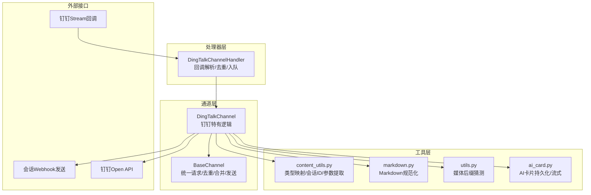
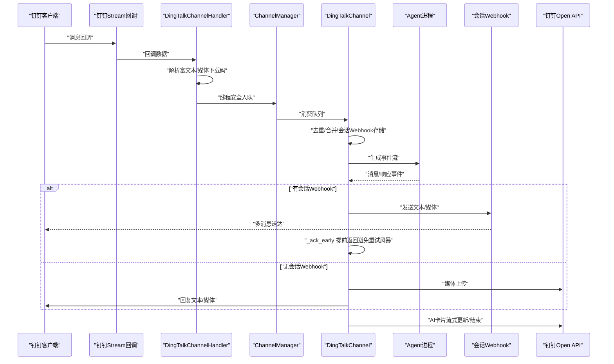
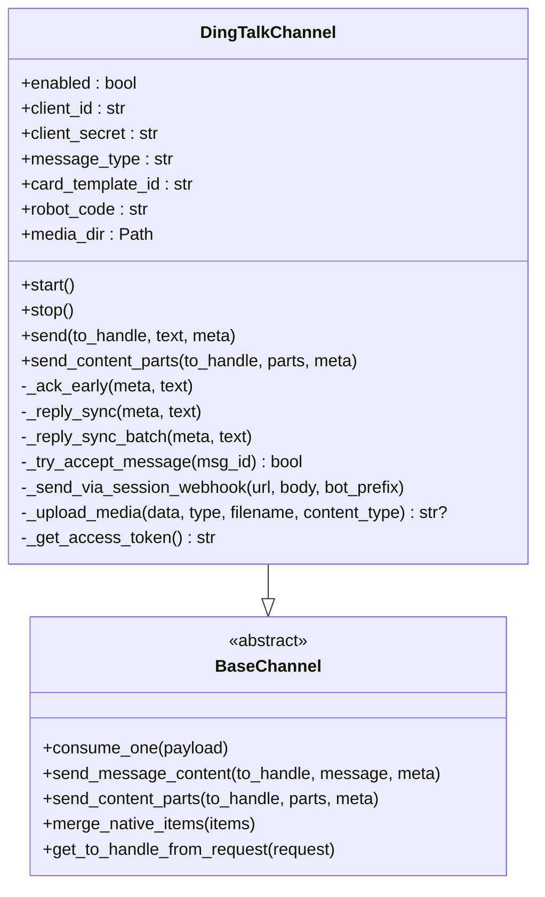
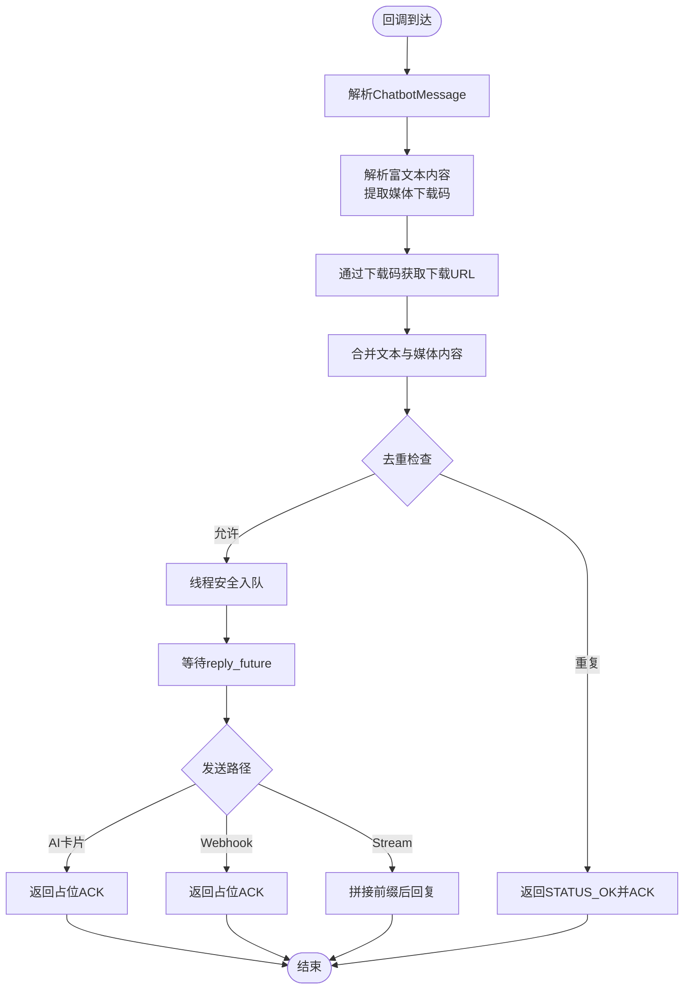
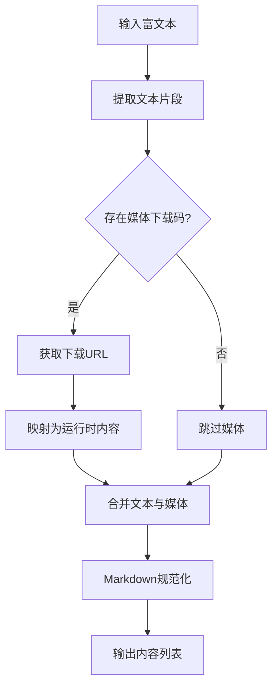
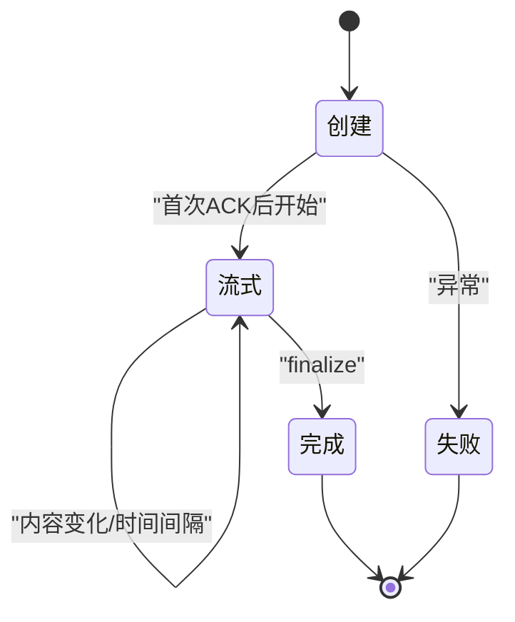
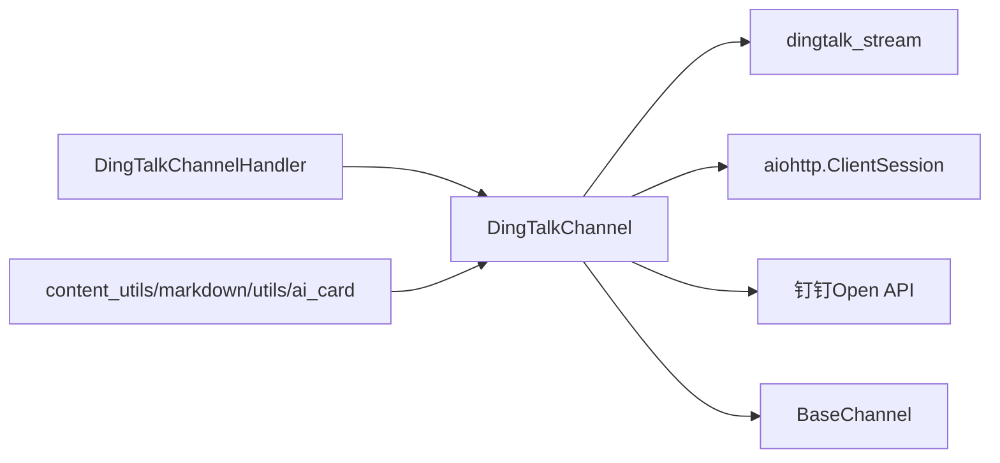

# 钉钉渠道集成

<cite>
**本文档引用的文件**
- [channel.py](file://src/copaw/app/channels/dingtalk/channel.py)
- [handler.py](file://src/copaw/app/channels/dingtalk/handler.py)
- [constants.py](file://src/copaw/app/channels/dingtalk/constants.py)
- [markdown.py](file://src/copaw/app/channels/dingtalk/markdown.py)
- [content_utils.py](file://src/copaw/app/channels/dingtalk/content_utils.py)
- [utils.py](file://src/copaw/app/channels/dingtalk/utils.py)
- [ai_card.py](file://src/copaw/app/channels/dingtalk/ai_card.py)
- [base.py](file://src/copaw/app/channels/base.py)
- [config.py](file://src/copaw/config/config.py)
- [SKILL.md](file://src/copaw/agents/skills/dingtalk_channel/SKILL.md)
</cite>

## 目录
1. [引言](#引言)
2. [项目结构](#项目结构)
3. [核心组件](#核心组件)
4. [架构总览](#架构总览)
5. [详细组件分析](#详细组件分析)
6. [依赖关系分析](#依赖关系分析)
7. [性能考虑](#性能考虑)
8. [故障排除指南](#故障排除指南)
9. [结论](#结论)
10. [附录](#附录)

## 引言
本技术文档面向CoPaw的钉钉渠道集成，系统性阐述企业内部群聊与机器人集成的完整实现方案。文档覆盖从钉钉Webhook接收、消息解析、Markdown渲染与富文本处理，到消息去重、会话管理、批量处理、错误处理与重试、监控告警配置，以及应用配置、机器人设置与权限管理的详细步骤。读者无需深入Python背景即可理解并实施该集成。

## 项目结构
钉钉渠道位于应用通道层，采用分层设计：
- 通道基类：统一请求构建、去重、合并、发送流程
- 钉钉通道：对接钉钉Stream回调与Open API，支持卡片流式渲染与会话Webhook多消息发送
- 处理器：将钉钉回调消息解析为运行时内容列表
- 工具模块：内容类型映射、Markdown规范化、媒体下载与后缀猜测、AI卡片生命周期管理

**图表来源**
- [channel.py:81-251](file://src/copaw/app/channels/dingtalk/channel.py#L81-L251)
- [handler.py:39-57](file://src/copaw/app/channels/dingtalk/handler.py#L39-L57)
- [base.py:69-125](file://src/copaw/app/channels/base.py#L69-L125)

**章节来源**
- [channel.py:1-251](file://src/copaw/app/channels/dingtalk/channel.py#L1-L251)
- [handler.py:1-57](file://src/copaw/app/channels/dingtalk/handler.py#L1-L57)
- [base.py:1-125](file://src/copaw/app/channels/base.py#L1-L125)

## 核心组件
- 钉钉通道（DingTalkChannel）
  - 负责：环境变量/配置加载、会话Webhook存储与恢复、媒体上传、Markdown/富文本发送、AI卡片流式渲染、消息去重、批量合并、错误处理与回退
  - 关键特性：支持sessionWebhook多消息发送、AI卡片流式更新、媒体直传与降级上传、会话ID短尾映射
- 钉钉回调处理器（DingTalkChannelHandler）
  - 负责：回调消息解析、富文本内容抽取、媒体下载URL获取、去重校验、线程安全入队
- 基类（BaseChannel）
  - 负责：统一的请求构建、时间去抖、内容合并、错误回退发送、渲染样式控制
- 工具模块
  - content_utils：类型映射、会话ID短尾、Webhook参数提取、发送者识别
  - markdown：列表间距、代码块缩进、代码行前缀等规范化
  - utils：媒体后缀猜测（魔数）
  - ai_card：AI卡片实例管理、持久化、流式更新、恢复

**章节来源**
- [channel.py:81-251](file://src/copaw/app/channels/dingtalk/channel.py#L81-L251)
- [handler.py:39-57](file://src/copaw/app/channels/dingtalk/handler.py#L39-L57)
- [base.py:69-125](file://src/copaw/app/channels/base.py#L69-L125)
- [content_utils.py:1-142](file://src/copaw/app/channels/dingtalk/content_utils.py#L1-L142)
- [markdown.py:1-111](file://src/copaw/app/channels/dingtalk/markdown.py#L1-L111)
- [utils.py:1-34](file://src/copaw/app/channels/dingtalk/utils.py#L1-L34)
- [ai_card.py:1-105](file://src/copaw/app/channels/dingtalk/ai_card.py#L1-L105)

## 架构总览
钉钉渠道采用“Stream回调 + 会话Webhook + Open API”的混合架构：
- Stream回调：建立长连接，接收消息，解析为运行时内容，入队等待处理
- 会话Webhook：在有会话上下文时，通过Webhook发送多条消息（文本/媒体），提升交互体验
- Open API：媒体上传、AI卡片创建/投递/流式更新、访问令牌管理

**图表来源**
- [handler.py:189-367](file://src/copaw/app/channels/dingtalk/handler.py#L189-L367)
- [channel.py:1412-1637](file://src/copaw/app/channels/dingtalk/channel.py#L1412-L1637)
- [channel.py:2058-2155](file://src/copaw/app/channels/dingtalk/channel.py#L2058-L2155)

**章节来源**
- [handler.py:189-367](file://src/copaw/app/channels/dingtalk/handler.py#L189-L367)
- [channel.py:1412-1637](file://src/copaw/app/channels/dingtalk/channel.py#L1412-L1637)

## 详细组件分析

### 钉钉通道（DingTalkChannel）
- 初始化与配置
  - 支持从环境变量与配置对象加载参数（启用开关、凭证、消息类型、卡片模板、机器人编码、媒体目录等）
  - 实例级令牌缓存（access_token），避免频繁获取
- 会话Webhook管理
  - 存储/恢复：基于会话ID短尾（conversation_id后N位）映射到Webhook URL，支持磁盘持久化
  - 解析路由：支持多种目标标识（dingtalk:sw:、dingtalk:webhook:、直接URL）
- 去重与批处理
  - 基于消息ID的去重集合（线程安全），避免重复处理
  - 合并多个Native Payload为一个请求，保留回复Future列表以便批量完成通知
- 回复路径选择
  - 优先使用会话Webhook进行多消息发送；否则回退至Stream回复
  - 支持AI卡片流式渲染，提前ACK避免重试风暴
- 媒体处理
  - 支持图片直链、上传后以文件形式发送；语音/视频特殊处理
  - 媒体下载与上传：通过Open API上传，支持Content-Type与魔数推断后缀
- 错误处理与回退
  - 统一从响应事件提取错误信息，回退发送错误提示
  - AI卡片异常时回退为Markdown发送

**图表来源**
- [channel.py:81-251](file://src/copaw/app/channels/dingtalk/channel.py#L81-L251)
- [base.py:69-125](file://src/copaw/app/channels/base.py#L69-L125)

**章节来源**
- [channel.py:81-251](file://src/copaw/app/channels/dingtalk/channel.py#L81-L251)
- [channel.py:421-541](file://src/copaw/app/channels/dingtalk/channel.py#L421-L541)
- [channel.py:596-776](file://src/copaw/app/channels/dingtalk/channel.py#L596-L776)
- [channel.py:822-877](file://src/copaw/app/channels/dingtalk/channel.py#L822-L877)
- [channel.py:1204-1311](file://src/copaw/app/channels/dingtalk/channel.py#L1204-L1311)
- [channel.py:1312-1334](file://src/copaw/app/channels/dingtalk/channel.py#L1312-L1334)
- [channel.py:1646-1699](file://src/copaw/app/channels/dingtalk/channel.py#L1646-L1699)

### 钉钉回调处理器（DingTalkChannelHandler）
- 功能要点
  - 从回调数据构建ChatbotMessage，解析富文本内容（文本、图片、音视频、文件）
  - 通过下载码获取媒体下载URL，转换为运行时内容
  - 去重：基于原始msgId检查是否已在处理中
  - 线程安全入队：通过主循环调用，确保与异步处理线程隔离
  - 回复：根据发送路径返回不同ACK，或拼接bot前缀后回复

**图表来源**
- [handler.py:189-367](file://src/copaw/app/channels/dingtalk/handler.py#L189-L367)

**章节来源**
- [handler.py:189-367](file://src/copaw/app/channels/dingtalk/handler.py#L189-L367)

### Markdown渲染与富文本处理
- Markdown规范化
  - 确保编号列表前有空行，避免被钉钉合并
  - 移除围栏代码块的多余缩进
  - 可选对代码行加前缀以规避解析异常
- 富文本解析
  - 支持richText与多种字段变体
  - 优先提取文本，其次解析媒体（图片/音视频/文件）
  - 对纯媒体消息，通过下载码获取URL并转换为内容

**图表来源**
- [handler.py:100-187](file://src/copaw/app/channels/dingtalk/handler.py#L100-L187)
- [markdown.py:96-111](file://src/copaw/app/channels/dingtalk/markdown.py#L96-L111)

**章节来源**
- [markdown.py:1-111](file://src/copaw/app/channels/dingtalk/markdown.py#L1-L111)
- [handler.py:100-187](file://src/copaw/app/channels/dingtalk/handler.py#L100-L187)

### 会话管理与消息去重
- 会话ID短尾映射
  - 使用conversation_id后N位作为session_id，便于定时任务查找Webhook
- 去重策略
  - 基于消息ID的集合，线程安全检查与释放
  - 在AI卡片/会话Webhook流式发送时，先ACK避免重试风暴，结束后再释放ID
- 批量合并
  - 将同一会话内的多个Native Payload合并为一个请求，保留回复Future列表

**章节来源**
- [content_utils.py:117-123](file://src/copaw/app/channels/dingtalk/content_utils.py#L117-L123)
- [channel.py:421-455](file://src/copaw/app/channels/dingtalk/channel.py#L421-L455)
- [channel.py:1646-1699](file://src/copaw/app/channels/dingtalk/channel.py#L1646-L1699)

### AI卡片流式渲染
- 生命周期
  - 创建：通过Open API创建卡片实例并投递给会话
  - 流式：定期更新卡片内容，限制最小间隔，支持预刷新令牌
  - 结束：finalize标记完成，清理内存与持久化
- 恢复机制
  - 应用重启后加载持久化的卡片记录，尝试结束或恢复

**图表来源**
- [channel.py:1885-2056](file://src/copaw/app/channels/dingtalk/channel.py#L1885-L2056)
- [channel.py:2058-2155](file://src/copaw/app/channels/dingtalk/channel.py#L2058-L2155)
- [ai_card.py:33-80](file://src/copaw/app/channels/dingtalk/ai_card.py#L33-L80)

**章节来源**
- [channel.py:1885-2056](file://src/copaw/app/channels/dingtalk/channel.py#L1885-L2056)
- [channel.py:2058-2155](file://src/copaw/app/channels/dingtalk/channel.py#L2058-L2155)
- [ai_card.py:1-105](file://src/copaw/app/channels/dingtalk/ai_card.py#L1-L105)

### 媒体上传与下载
- 下载
  - 通过messageFiles/download获取可下载URL，支持HTTP/HTTPS与file协议
  - 本地缓存到媒体目录，自动推断后缀（Content-Type优先，魔数回退）
- 上传
  - 通过oapi/media/upload上传，支持image/voice/video/file
  - 上传后以file消息发送，避免部分类型不支持的直接发送

**章节来源**
- [channel.py:778-820](file://src/copaw/app/channels/dingtalk/channel.py#L778-L820)
- [channel.py:694-776](file://src/copaw/app/channels/dingtalk/channel.py#L694-L776)
- [utils.py:23-34](file://src/copaw/app/channels/dingtalk/utils.py#L23-L34)

## 依赖关系分析
- 组件耦合
  - DingTalkChannel强依赖钉钉SDK（dingtalk_stream）、aiohttp、钉钉Open API
  - 与BaseChannel高度内聚，遵循统一的请求/响应模型
- 外部依赖
  - 钉钉Stream回调与会话Webhook
  - 钉钉Open API（媒体上传、卡片创建/投递/流式）

**图表来源**
- [channel.py:158-162](file://src/copaw/app/channels/dingtalk/channel.py#L158-L162)
- [handler.py:10-11](file://src/copaw/app/channels/dingtalk/handler.py#L10-L11)

**章节来源**
- [channel.py:158-162](file://src/copaw/app/channels/dingtalk/channel.py#L158-L162)
- [handler.py:10-11](file://src/copaw/app/channels/dingtalk/handler.py#L10-L11)

## 性能考虑
- 去重与ACK策略
  - 在AI卡片/会话Webhook流式发送时提前ACK，避免钉钉重试风暴
  - 保持消息ID集合，直到流式完成再释放，防止重复处理
- 时间去抖与合并
  - 对同一会话的消息进行时间去抖与内容合并，减少Agent处理压力
- 媒体处理优化
  - 优先直链图片发送；上传后以文件形式保证兼容性
  - 魔数推断后缀，避免“.file/.bin”导致的显示问题
- 令牌缓存
  - 实例级access_token缓存，减少API调用频率

[本节为通用指导，无需特定文件引用]

## 故障排除指南
- 无法接收消息
  - 检查Stream客户端是否启动、凭证是否正确
  - 确认回调处理器已注册到指定主题
- 重复消息/重复回复
  - 检查消息ID去重集合是否正常释放
  - 确认AI卡片/会话Webhook路径下是否提前ACK
- Webhook发送失败
  - 检查sessionWebhook是否过期或被回收
  - 查看返回的errcode/errmsg，确认钉钉侧错误原因
- 媒体无法显示
  - 确认媒体上传成功并返回media_id
  - 检查后缀推断是否正确，必要时手动修正
- AI卡片异常
  - 查看卡片流式更新日志，确认令牌有效与模板键匹配
  - 应用重启后检查持久化记录，尝试恢复结束

**章节来源**
- [channel.py:1769-1844](file://src/copaw/app/channels/dingtalk/channel.py#L1769-L1844)
- [channel.py:2268-2306](file://src/copaw/app/channels/dingtalk/channel.py#L2268-L2306)
- [handler.py:365-367](file://src/copaw/app/channels/dingtalk/handler.py#L365-L367)

## 结论
CoPaw的钉钉渠道集成通过“Stream回调 + 会话Webhook + Open API”的组合，实现了高可靠的企业内部群聊与机器人交互。其特性包括：消息去重、会话Webhook多消息发送、AI卡片流式渲染、富文本与媒体处理、令牌缓存与错误回退。配合可视化技能脚本，可快速完成应用创建、机器人配置与发布流程，满足生产环境的稳定性与可维护性需求。

[本节为总结，无需特定文件引用]

## 附录

### 钉钉应用配置与机器人设置步骤
- 使用可视化技能自动完成应用创建、机器人添加与发布
- 获取Client ID/Client Secret并在控制台或配置文件中填入
- 注意：每次配置变更后需创建新版本并发布

**章节来源**
- [SKILL.md:1-197](file://src/copaw/agents/skills/dingtalk_channel/SKILL.md#L1-L197)

### 环境变量与配置项
- 环境变量
  - DINGTALK_CHANNEL_ENABLED、DINGTALK_CLIENT_ID、DINGTALK_CLIENT_SECRET、DINGTALK_BOT_PREFIX、DINGTALK_MESSAGE_TYPE、DINGTALK_CARD_TEMPLATE_ID、DINGTALK_CARD_TEMPLATE_KEY、DINGTALK_ROBOT_CODE、DINGTALK_MEDIA_DIR、DINGTALK_DM_POLICY、DINGTALK_GROUP_POLICY、DINGTALK_ALLOW_FROM、DINGTALK_DENY_MESSAGE、DINGTALK_REQUIRE_MENTION
- 配置文件
  - channels.dingtalk：enabled、client_id、client_secret、message_type、card_template_id、card_template_key、robot_code、media_dir

**章节来源**
- [channel.py:183-251](file://src/copaw/app/channels/dingtalk/channel.py#L183-L251)
- [config.py:57-65](file://src/copaw/config/config.py#L57-L65)