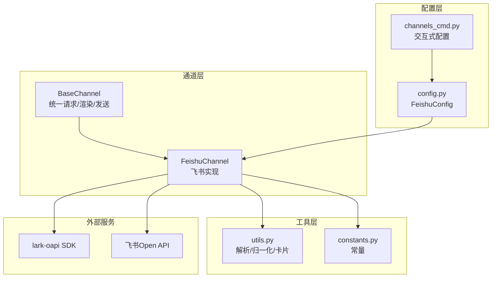
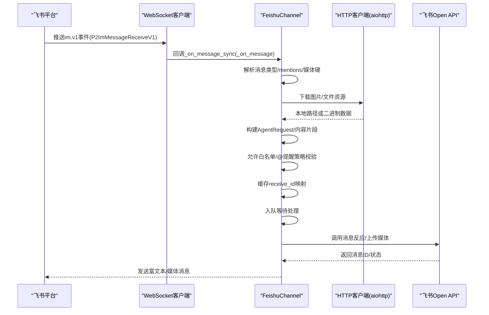
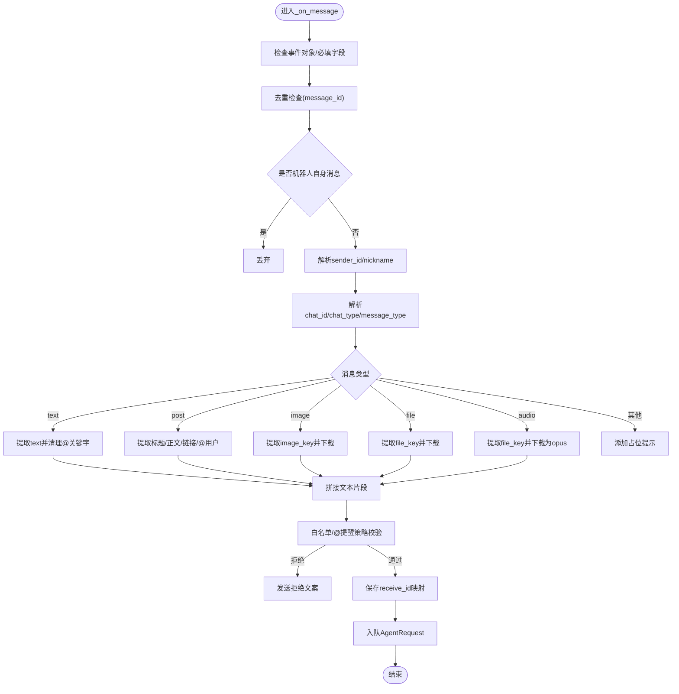
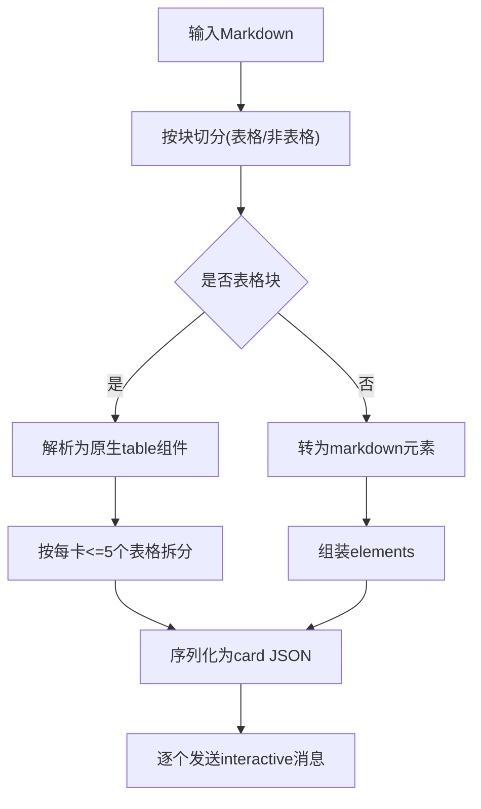
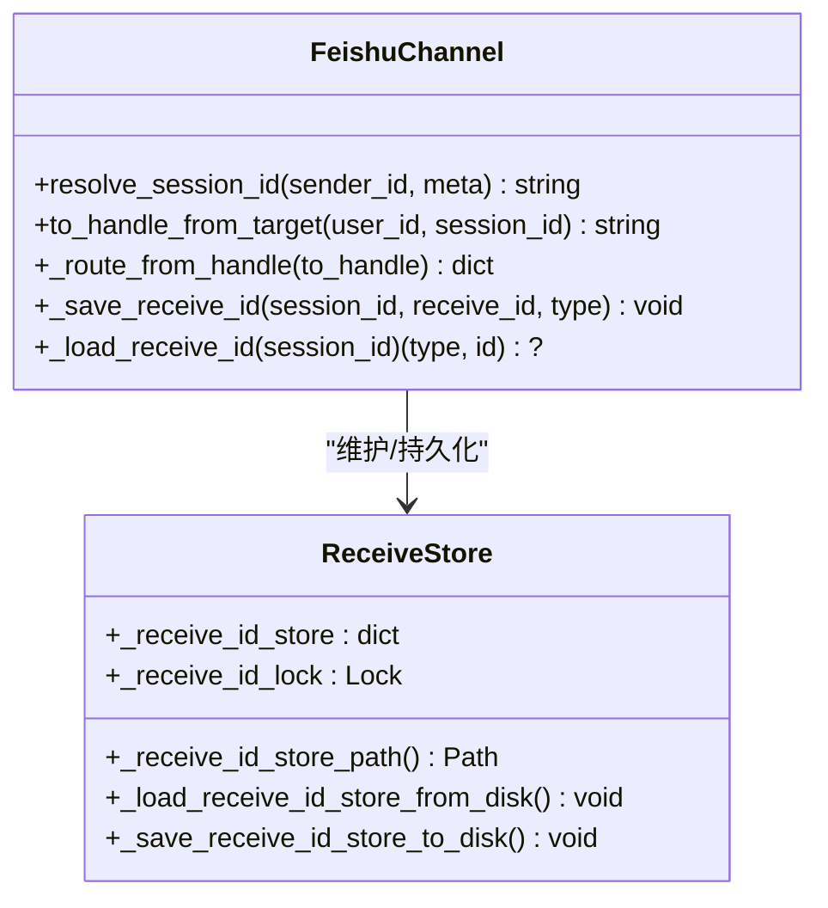
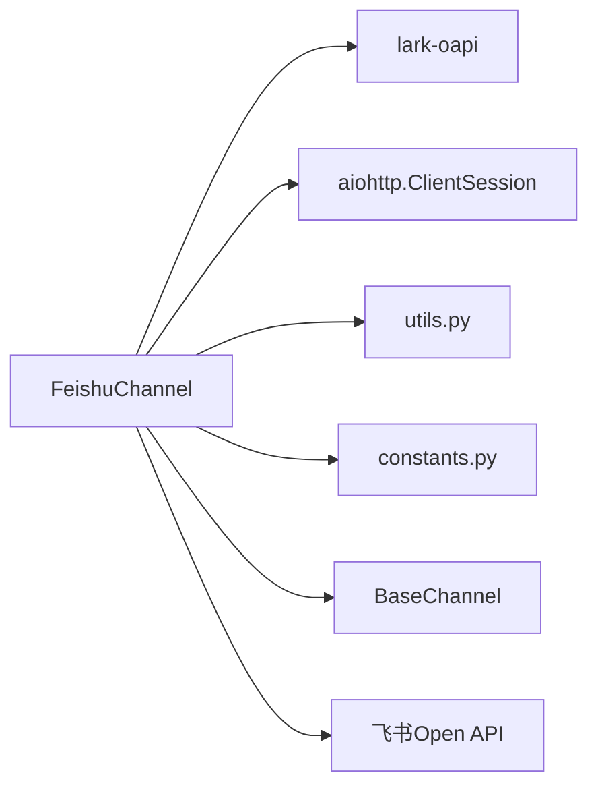

# 飞书渠道集成

<cite>
**本文档引用的文件**
- [channel.py](file://src/copaw/app/channels/feishu/channel.py)
- [constants.py](file://src/copaw/app/channels/feishu/constants.py)
- [utils.py](file://src/copaw/app/channels/feishu/utils.py)
- [base.py](file://src/copaw/app/channels/base.py)
- [config.py](file://src/copaw/config/config.py)
- [channels_cmd.py](file://src/copaw/cli/channels_cmd.py)
</cite>

## 目录
1. [简介](#简介)
2. [项目结构](#项目结构)
3. [核心组件](#核心组件)
4. [架构总览](#架构总览)
5. [详细组件分析](#详细组件分析)
6. [依赖关系分析](#依赖关系分析)
7. [性能考虑](#性能考虑)
8. [故障排查指南](#故障排查指南)
9. [结论](#结论)
10. [附录](#附录)

## 简介
本文件面向CoPaw的飞书（Lark）渠道集成，系统性阐述从飞书机器人接入到消息收发、富文本与媒体处理、会话与用户识别、@提醒与消息回执、错误处理与限流应对，以及调试与运维实践的完整技术方案。文档以源码为依据，结合架构图与流程图，帮助开发者快速理解并部署飞书渠道。

## 项目结构
飞书渠道位于通道子系统中，采用“通道基类 + 具体实现”的分层设计：
- 通道基类：统一请求构建、内容渲染、发送流程与错误回调
- 飞书实现：负责WebSocket事件接收、Open API鉴权与调用、媒体下载上传、@提醒与回执反应
- 工具模块：消息格式解析、Markdown归一化、交互卡片构建
- 配置模型：定义飞书通道的配置项与默认行为
- CLI配置：提供交互式配置向导

**图表来源**
- [channel.py:145-2018](file://src/copaw/app/channels/feishu/channel.py#L145-L2018)
- [base.py:69-800](file://src/copaw/app/channels/base.py#L69-L800)
- [utils.py:1-330](file://src/copaw/app/channels/feishu/utils.py#L1-L330)
- [constants.py:1-21](file://src/copaw/app/channels/feishu/constants.py#L1-L21)
- [config.py:67-77](file://src/copaw/config/config.py#L67-L77)
- [channels_cmd.py:334-371](file://src/copaw/cli/channels_cmd.py#L334-L371)

**章节来源**
- [channel.py:145-2018](file://src/copaw/app/channels/feishu/channel.py#L145-L2018)
- [base.py:69-800](file://src/copaw/app/channels/base.py#L69-L800)
- [utils.py:1-330](file://src/copaw/app/channels/feishu/utils.py#L1-L330)
- [constants.py:1-21](file://src/copaw/app/channels/feishu/constants.py#L1-L21)
- [config.py:67-77](file://src/copaw/config/config.py#L67-L77)
- [channels_cmd.py:334-371](file://src/copaw/cli/channels_cmd.py#L334-L371)

## 核心组件
- 通道基类（BaseChannel）
  - 统一构建AgentRequest、内容渲染、消息发送与错误回调
  - 支持时间去抖（native payload合并）、允许白名单策略、@提醒策略
- 飞书通道（FeishuChannel）
  - 基于lark-oapi的WebSocket长连接接收事件
  - 使用内部租户令牌（tenant_access_token）调用Open API
  - 解析富文本、图片、文件等消息类型，支持@提醒与消息回执
  - 会话管理：短session_id、receive_id持久化映射，支持定时任务派发
- 工具模块（utils.py）
  - 提取消息键值、提取富文本正文、解析图片/文件键列表、Markdown归一化、交互卡片构建
- 配置模型（config.py）
  - FeishuConfig：app_id、app_secret、encrypt_key、verification_token、media_dir等
- CLI配置（channels_cmd.py）
  - 交互式引导填写飞书配置项

**章节来源**
- [base.py:69-800](file://src/copaw/app/channels/base.py#L69-L800)
- [channel.py:145-2018](file://src/copaw/app/channels/feishu/channel.py#L145-L2018)
- [utils.py:1-330](file://src/copaw/app/channels/feishu/utils.py#L1-L330)
- [config.py:67-77](file://src/copaw/config/config.py#L67-L77)
- [channels_cmd.py:334-371](file://src/copaw/cli/channels_cmd.py#L334-L371)

## 架构总览
飞书渠道采用“事件驱动 + 异步HTTP”的混合架构：
- 事件接收：WebSocket长连接监听飞书事件，线程内运行独立事件循环
- 内容解析：根据消息类型解析文本、图片、文件、音频等
- 令牌管理：缓存tenant_access_token，过期前自动刷新
- 发送路径：先发送富文本（post/interactive），再发送媒体（image/file/audio）
- 会话存储：将session_id映射到receive_id，支持重启后恢复

**图表来源**
- [channel.py:590-855](file://src/copaw/app/channels/feishu/channel.py#L590-L855)
- [channel.py:1930-1988](file://src/copaw/app/channels/feishu/channel.py#L1930-L1988)
- [channel.py:1266-1363](file://src/copaw/app/channels/feishu/channel.py#L1266-L1363)
- [channel.py:904-1013](file://src/copaw/app/channels/feishu/channel.py#L904-L1013)

**章节来源**
- [channel.py:590-855](file://src/copaw/app/channels/feishu/channel.py#L590-L855)
- [channel.py:1930-1988](file://src/copaw/app/channels/feishu/channel.py#L1930-L1988)
- [channel.py:1266-1363](file://src/copaw/app/channels/feishu/channel.py#L1266-L1363)
- [channel.py:904-1013](file://src/copaw/app/channels/feishu/channel.py#L904-L1013)

## 详细组件分析

### 1) Webhook与事件接收
- 启动时初始化lark-oapi客户端与WebSocket事件处理器
- 注册im.v1事件回调，线程内启动事件循环，避免与主事件循环冲突
- 事件回调在独立线程中执行，通过异步队列将原生payload投递到通道队列

关键点
- 事件循环隔离：每个实例维护独立的ws事件循环，退出时恢复全局loop引用
- 安全参数：支持encrypt_key与verification_token，确保事件签名验证
- 降级处理：若lark-oapi缺失，启动时报错提示安装

**章节来源**
- [channel.py:1930-1988](file://src/copaw/app/channels/feishu/channel.py#L1930-L1988)
- [channel.py:1841-1928](file://src/copaw/app/channels/feishu/channel.py#L1841-L1928)

### 2) 消息接收与解析
- 去重：基于message_id的有序缓存，超过上限按LRU淘汰
- 识别：优先使用open_id，若缺失则生成占位标识；尝试通过Contact API获取昵称
- 类型解析：
  - 文本：提取JSON中的text字段，移除@关键字
  - 富文本：提取post中的标题与正文，链接转为Markdown
  - 图片/文件：提取image_key/file_key，下载到本地媒体目录
  - 音频：下载为opus文件
- 会话与元信息：记录chat_id、message_id、sender_id、是否群聊、@提醒标记

**图表来源**
- [channel.py:605-855](file://src/copaw/app/channels/feishu/channel.py#L605-L855)
- [utils.py:43-93](file://src/copaw/app/channels/feishu/utils.py#L43-L93)
- [utils.py:125-133](file://src/copaw/app/channels/feishu/utils.py#L125-L133)

**章节来源**
- [channel.py:605-855](file://src/copaw/app/channels/feishu/channel.py#L605-L855)
- [utils.py:43-93](file://src/copaw/app/channels/feishu/utils.py#L43-L93)
- [utils.py:125-133](file://src/copaw/app/channels/feishu/utils.py#L125-L133)

### 3) 令牌与鉴权
- 租户令牌：内部缓存tenant_access_token，过期前60秒自动刷新
- 机器人标识：拉取bot的open_id，用于@提醒识别
- 错误处理：HTTP 4xx/5xx抛出异常；API返回非0 code记录日志

**章节来源**
- [channel.py:398-446](file://src/copaw/app/channels/feishu/channel.py#L398-L446)
- [channel.py:447-463](file://src/copaw/app/channels/feishu/channel.py#L447-L463)

### 4) 富文本与交互卡片
- 富文本：将正文包装为post（zh_cn.content），支持多段落
- 表格：将Markdown表格解析为飞书原生table组件，限制每张卡片最多5个表格
- 交互卡片：当正文含表格时拆分为多个卡片顺序发送，否则发送post

**图表来源**
- [utils.py:146-227](file://src/copaw/app/channels/feishu/utils.py#L146-L227)
- [utils.py:286-314](file://src/copaw/app/channels/feishu/utils.py#L286-L314)
- [utils.py:316-330](file://src/copaw/app/channels/feishu/utils.py#L316-L330)

**章节来源**
- [utils.py:146-227](file://src/copaw/app/channels/feishu/utils.py#L146-L227)
- [utils.py:286-314](file://src/copaw/app/channels/feishu/utils.py#L286-L314)
- [utils.py:316-330](file://src/copaw/app/channels/feishu/utils.py#L316-L330)

### 5) 媒体处理
- 图片：下载image资源到本地媒体目录，上传为image_key后发送image消息
- 文件：限制最大30MB，自动推断文件类型，上传为file_key后发送file消息
- 音频：下载为opus文件，作为音频消息发送
- 失败兜底：下载失败时追加占位提示；上传失败记录警告

**章节来源**
- [channel.py:904-1013](file://src/copaw/app/channels/feishu/channel.py#L904-L1013)
- [channel.py:1175-1248](file://src/copaw/app/channels/feishu/channel.py#L1175-L1248)
- [channel.py:1412-1456](file://src/copaw/app/channels/feishu/channel.py#L1412-L1456)
- [constants.py:7-8](file://src/copaw/app/channels/feishu/constants.py#L7-L8)

### 6) 会话管理与用户识别
- 会话ID：短后缀（默认8字符）来自chat_id或open_id，便于定时任务查找
- 用户显示名：优先昵称，其次Contact API查询，再次open_id后缀
- receive_id映射：将session_id映射为(chat_id/open_id, receive_id)，持久化到磁盘
- 发送路由：支持feishu:sw:短session、feishu:open_id:open_id、feishu:chat_id:chat_id等多种形式

**图表来源**
- [channel.py:293-374](file://src/copaw/app/channels/feishu/channel.py#L293-L374)
- [channel.py:1015-1114](file://src/copaw/app/channels/feishu/channel.py#L1015-L1114)
- [channel.py:1557-1630](file://src/copaw/app/channels/feishu/channel.py#L1557-L1630)

**章节来源**
- [channel.py:293-374](file://src/copaw/app/channels/feishu/channel.py#L293-L374)
- [channel.py:1015-1114](file://src/copaw/app/channels/feishu/channel.py#L1015-L1114)
- [channel.py:1557-1630](file://src/copaw/app/channels/feishu/channel.py#L1557-L1630)

### 7) @提醒与消息回执
- @提醒：检测content中的@_all或mentions中的bot open_id，设置bot_mentioned标记
- 消息回执：发送前添加“打字中”反应，完成后添加“完成”反应
- 策略控制：支持require_mention开关，仅@场景或命令触发的消息才处理

**章节来源**
- [channel.py:654-670](file://src/copaw/app/channels/feishu/channel.py#L654-L670)
- [channel.py:829-831](file://src/copaw/app/channels/feishu/channel.py#L829-L831)
- [channel.py:856-903](file://src/copaw/app/channels/feishu/channel.py#L856-L903)

### 8) 发送流程与错误处理
- 发送顺序：先post/interactive正文，再逐条发送媒体（image/file/audio）
- 错误处理：捕获异常并回调_base_on_consume_error，发送统一错误提示
- 回调通知：on_reply_sent回调携带(user_id, session_id)

**章节来源**
- [channel.py:1632-1734](file://src/copaw/app/channels/feishu/channel.py#L1632-L1734)
- [base.py:541-583](file://src/copaw/app/channels/base.py#L541-L583)
- [channel.py:1818-1827](file://src/copaw/app/channels/feishu/channel.py#L1818-L1827)

### 9) 配置与部署
- 配置项：app_id、app_secret、encrypt_key、verification_token、media_dir、策略开关
- 环境变量：FEISHU_*系列变量可直接注入
- CLI配置：交互式填写并写入配置文件

**章节来源**
- [config.py:67-77](file://src/copaw/config/config.py#L67-L77)
- [channel.py:231-259](file://src/copaw/app/channels/feishu/channel.py#L231-L259)
- [channels_cmd.py:334-371](file://src/copaw/cli/channels_cmd.py#L334-L371)

## 依赖关系分析
- 组件耦合
  - FeishuChannel强依赖lark-oapi与aiohttp；与BaseChannel解耦良好
  - 与utils/constants低耦合，职责清晰
- 外部依赖
  - lark-oapi：WebSocket事件与Open API调用
  - 飞书Open API：鉴权、消息发送、媒体上传/下载、联系人查询
- 可能的循环依赖
  - 未发现循环导入；各模块职责单一

**图表来源**
- [channel.py:101-132](file://src/copaw/app/channels/feishu/channel.py#L101-L132)
- [base.py:69-800](file://src/copaw/app/channels/base.py#L69-L800)

**章节来源**
- [channel.py:101-132](file://src/copaw/app/channels/feishu/channel.py#L101-L132)
- [base.py:69-800](file://src/copaw/app/channels/base.py#L69-L800)

## 性能考虑
- 令牌缓存：过期前60秒刷新，减少频繁鉴权开销
- 去重与缓存：消息ID去重、昵称缓存，降低重复请求与解析成本
- 媒体处理：本地缓存与文件扩展推断，避免重复下载
- 并发模型：WebSocket线程内事件循环，发送路径使用线程池执行同步调用，避免阻塞主事件循环

[本节为通用指导，无需特定文件引用]

## 故障排查指南
常见问题与定位建议
- 无法启动
  - 确认已安装lark-oapi；检查FEISHU_APP_ID/FEISHU_APP_SECRET是否配置
  - 查看启动日志中WebSocket连接与bot open_id拉取结果
- 事件不触发
  - 检查encrypt_key与verification_token是否正确；确认事件订阅配置
  - 确认WebSocket线程正常运行且未被提前停止
- 消息无回复
  - 检查allowlist与require_mention策略；确认@提醒或命令触发
  - 查看receive_id映射是否持久化成功
- 媒体发送失败
  - 检查文件大小是否超过30MB；确认file_key上传返回
  - 图片/音频下载失败时，检查资源URL与网络连通性
- 错误回调
  - 捕获异常后会回调错误提示；可在_base_on_consume_error中自定义处理

**章节来源**
- [channel.py:1936-1945](file://src/copaw/app/channels/feishu/channel.py#L1936-L1945)
- [channel.py:1990-2018](file://src/copaw/app/channels/feishu/channel.py#L1990-L2018)
- [base.py:631-647](file://src/copaw/app/channels/base.py#L631-L647)

## 结论
飞书渠道通过事件驱动与Open API相结合的方式，实现了对富文本、图片、文件、音频的完整支持，并提供了@提醒、消息回执、会话持久化与策略控制等企业级能力。其模块化设计与完善的错误处理，使其具备良好的可维护性与可扩展性。

## 附录

### A. 配置项一览
- 基础开关与策略
  - enabled：启用/禁用
  - bot_prefix：机器人前缀
  - dm_policy/group_policy：私聊/群聊策略（open/allowlist）
  - allow_from：允许列表
  - deny_message：拒绝文案
  - require_mention：仅@触发
- 飞书特有
  - app_id/app_secret：应用凭证
  - encrypt_key/verification_token：事件加密与校验
  - media_dir：媒体下载目录

**章节来源**
- [config.py:28-40](file://src/copaw/config/config.py#L28-L40)
- [config.py:67-77](file://src/copaw/config/config.py#L67-L77)
- [channel.py:231-259](file://src/copaw/app/channels/feishu/channel.py#L231-L259)

### B. 环境变量参考
- FEISHU_CHANNEL_ENABLED
- FEISHU_APP_ID
- FEISHU_APP_SECRET
- FEISHU_ENCRYPT_KEY
- FEISHU_VERIFICATION_TOKEN
- FEISHU_MEDIA_DIR
- FEISHU_DM_POLICY
- FEISHU_GROUP_POLICY
- FEISHU_ALLOW_FROM
- FEISHU_DENY_MESSAGE
- FEISHU_REQUIRE_MENTION
- FEISHU_BOT_PREFIX

**章节来源**
- [channel.py:231-259](file://src/copaw/app/channels/feishu/channel.py#L231-L259)