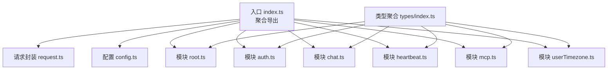
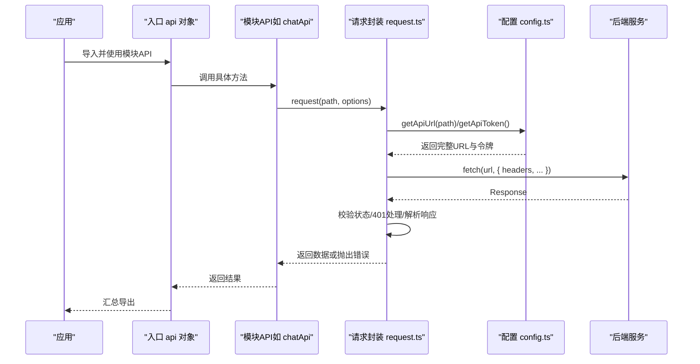
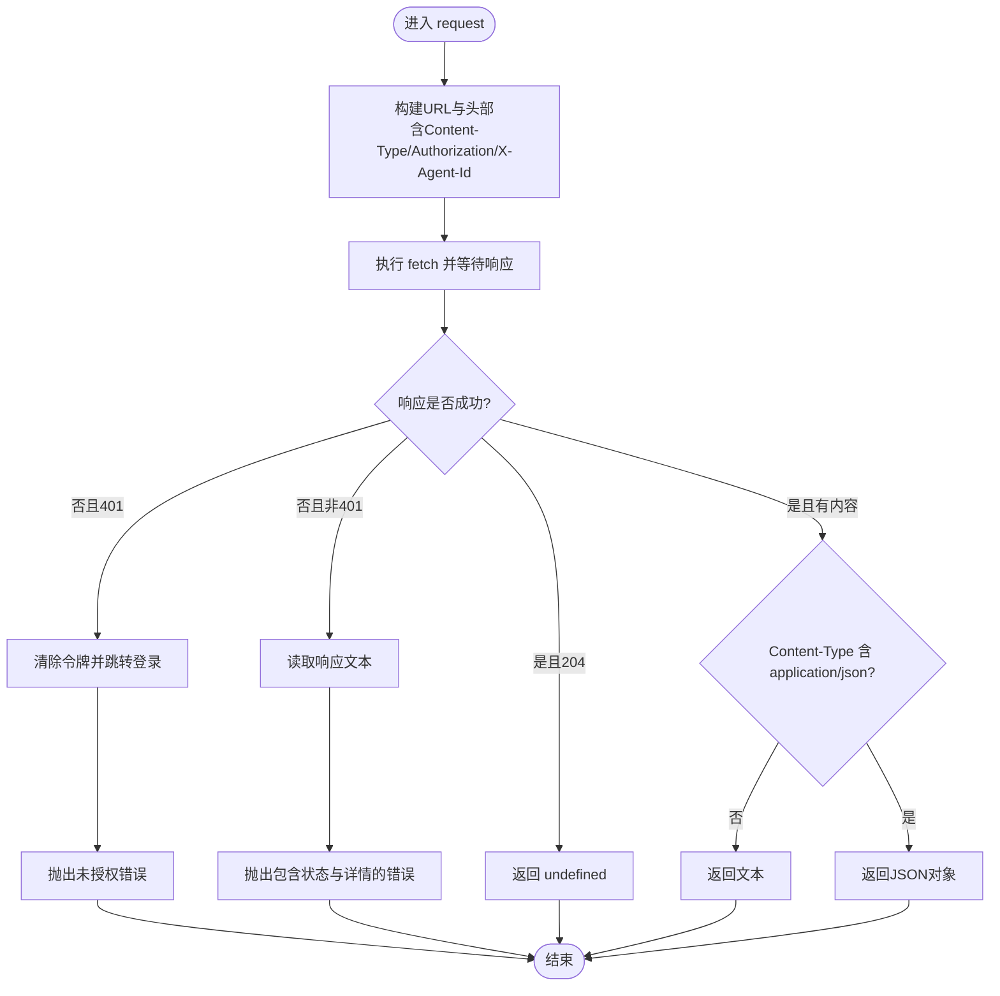
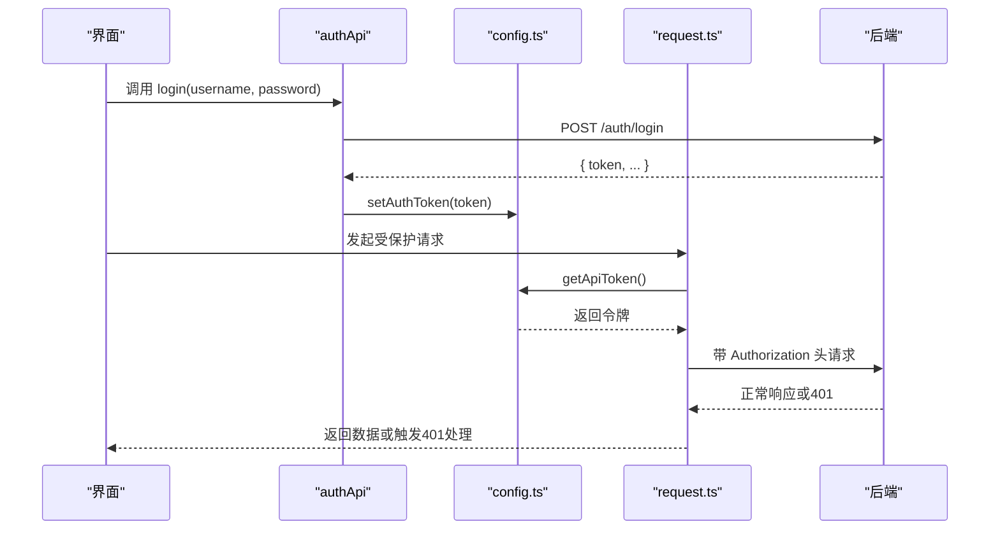
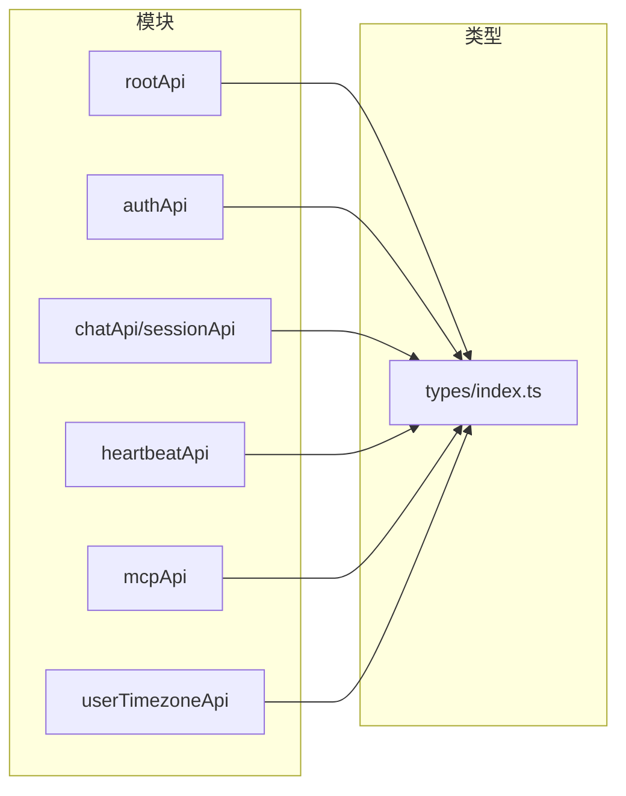
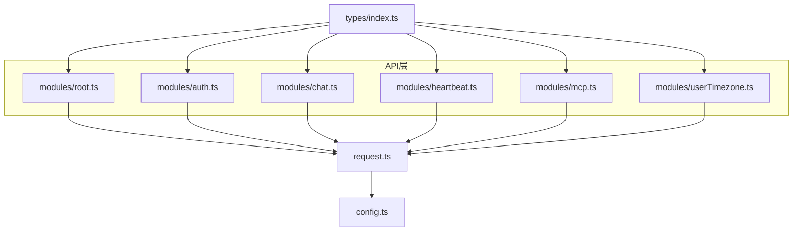

# API客户端

<cite>
**本文引用的文件**
- [console\src\api\index.ts](file://console\src\api\index.ts)
- [console\src\api\request.ts](file://console\src\api\request.ts)
- [console\src\api\config.ts](file://console\src\api\config.ts)
- [console\src\api\modules\root.ts](file://console\src\api\modules\root.ts)
- [console\src\api\modules\auth.ts](file://console\src\api\modules\auth.ts)
- [console\src\api\modules\chat.ts](file://console\src\api\modules\chat.ts)
- [console\src\api\modules\heartbeat.ts](file://console\src\api\modules\heartbeat.ts)
- [console\src\api\modules\mcp.ts](file://console\src\api\modules\mcp.ts)
- [console\src\api\modules\userTimezone.ts](file://console\src\api\modules\userTimezone.ts)
- [console\src\api\types\index.ts](file://console\src\api\types\index.ts)
</cite>

## 目录
1. [简介](#简介)
2. [项目结构](#项目结构)
3. [核心组件](#核心组件)
4. [架构总览](#架构总览)
5. [详细组件分析](#详细组件分析)
6. [依赖关系分析](#依赖关系分析)
7. [性能考量](#性能考量)
8. [故障排查指南](#故障排查指南)
9. [结论](#结论)
10. [附录：使用示例与最佳实践](#附录使用示例与最佳实践)

## 简介
本文件面向CoPaw前端控制台的API客户端，系统性阐述请求封装机制、拦截器配置思路、错误处理策略、模块化设计、类型定义与认证管理，并给出请求配置、响应处理、重试机制建议、客户端初始化、超时设置与并发控制实践。内容以实际源码为依据，辅以图示帮助理解。

## 项目结构
控制台API客户端位于 console/src/api 目录，采用“入口聚合 + 模块化API + 类型导出”的组织方式：
- 入口文件统一导出所有模块API与工具函数，便于上层按需引入或整体导入
- request.ts 提供统一的fetch封装与通用错误处理
- config.ts 提供基础URL与令牌管理
- modules/* 定义各业务域API（如root、auth、chat、mcp等）
- types/index.ts 聚合导出各模块类型定义

图表来源
- [console\src\api\index.ts:1-85](file://console\src\api\index.ts#L1-L85)
- [console\src\api\request.ts:1-81](file://console\src\api\request.ts#L1-L81)
- [console\src\api\config.ts:1-42](file://console\src\api\config.ts#L1-L42)
- [console\src\api\modules\root.ts:1-8](file://console\src\api\modules\root.ts#L1-L8)
- [console\src\api\modules\auth.ts:1-50](file://console\src\api\modules\auth.ts#L1-L50)
- [console\src\api\modules\chat.ts:1-166](file://console\src\api\modules\chat.ts#L1-L166)
- [console\src\api\modules\heartbeat.ts:1-12](file://console\src\api\modules\heartbeat.ts#L1-L12)
- [console\src\api\modules\mcp.ts:1-53](file://console\src\api\modules\mcp.ts#L1-L53)
- [console\src\api\modules\userTimezone.ts:1-15](file://console\src\api\modules\userTimezone.ts#L1-L15)
- [console\src\api\types\index.ts:1-13](file://console\src\api\types\index.ts#L1-L13)

章节来源
- [console\src\api\index.ts:1-85](file://console\src\api\index.ts#L1-L85)
- [console\src\api\request.ts:1-81](file://console\src\api\request.ts#L1-L81)
- [console\src\api\config.ts:1-42](file://console\src\api\config.ts#L1-L42)
- [console\src\api\types\index.ts:1-13](file://console\src\api\types\index.ts#L1-L13)

## 核心组件
- 统一请求封装 request.ts
  - 自动构建请求头：根据方法自动设置Content-Type；注入Authorization；注入X-Agent-Id（来自本地存储）
  - 统一错误处理：非2xx响应抛出带状态与消息的错误；401清空令牌并跳转登录页
  - 响应解析：204返回undefined；非JSON文本返回字符串；否则解析为JSON
- 配置与认证 config.ts
  - getApiUrl：拼接BASE_URL与“/api”前缀及路径
  - getApiToken/setAuthToken/clearAuthToken：优先localStorage，回退构建常量
- 模块化API
  - rootApi：根资源与版本查询
  - authApi：登录、注册、状态查询
  - chatApi/sessionApi：聊天与会话管理、文件上传与访问
  - heartbeatApi：心跳配置
  - mcpApi：MCP客户端增删改查与开关
  - userTimezoneApi：用户时区配置

章节来源
- [console\src\api\request.ts:39-80](file://console\src\api\request.ts#L39-L80)
- [console\src\api\config.ts:11-41](file://console\src\api\config.ts#L11-L41)
- [console\src\api\modules\root.ts:4-7](file://console\src\api\modules\root.ts#L4-L7)
- [console\src\api\modules\auth.ts:14-48](file://console\src\api\modules\auth.ts#L14-L48)
- [console\src\api\modules\chat.ts:50-126](file://console\src\api\modules\chat.ts#L50-L126)
- [console\src\api\modules\chat.ts:128-165](file://console\src\api\modules\chat.ts#L128-L165)
- [console\src\api\modules\heartbeat.ts:4-11](file://console\src\api\modules\heartbeat.ts#L4-L11)
- [console\src\api\modules\mcp.ts:8-52](file://console\src\api\modules\mcp.ts#L8-L52)
- [console\src\api\modules\userTimezone.ts:7-14](file://console\src\api\modules\userTimezone.ts#L7-L14)

## 架构总览
下图展示API客户端的整体交互：应用通过入口聚合导出的api对象调用具体模块API，模块内部通过request.ts进行HTTP请求，request.ts再借助config.ts完成URL与令牌装配，并在返回阶段进行统一错误处理与响应解析。

图表来源
- [console\src\api\index.ts:26-79](file://console\src\api\index.ts#L26-L79)
- [console\src\api\modules\chat.ts:50-126](file://console\src\api\modules\chat.ts#L50-L126)
- [console\src\api\request.ts:39-80](file://console\src\api\request.ts#L39-L80)
- [console\src\api\config.ts:11-27](file://console\src\api\config.ts#L11-L27)

## 详细组件分析

### 请求封装与拦截器配置
- 请求头构建
  - 方法为POST/PUT/PATCH时自动设置Content-Type为application/json（若未显式设置）
  - 注入Authorization: Bearer <token>（从localStorage或构建常量获取）
  - 注入X-Agent-Id：从localStorage中解析选中的代理ID，用于多代理场景
- 错误处理
  - 非2xx响应：读取响应体文本作为错误详情，抛出包含状态码与消息的错误
  - 401未授权：清除本地令牌并跳转至登录页
- 响应解析
  - 204无内容：返回undefined
  - 非JSON内容：返回文本
  - JSON内容：解析为对象
- 可扩展点（拦截器思路）
  - 在request.ts中增加中间件链：鉴权刷新、重试、日志、埋点
  - 通过options参数传递拦截器上下文（如重试次数、超时、并发标记）

图表来源
- [console\src\api\request.ts:39-80](file://console\src\api\request.ts#L39-L80)

章节来源
- [console\src\api\request.ts:3-37](file://console\src\api\request.ts#L3-L37)
- [console\src\api\request.ts:52-79](file://console\src\api\request.ts#L52-L79)

### 认证管理与初始化
- 初始化流程
  - 登录成功后，后端返回token，前端通过setAuthToken持久化到localStorage
  - 后续每次请求由request.ts自动注入Authorization头
  - 401时自动清理令牌并跳转登录
- 令牌来源优先级
  - localStorage中的copaw_auth_token
  - 构建期常量TOKEN（用于特定部署场景）
- 登录/注册/状态查询
  - authApi.login/register/status分别对接/auth/login、/auth/register、/auth/status

图表来源
- [console\src\api\modules\auth.ts:14-48](file://console\src\api\modules\auth.ts#L14-L48)
- [console\src\api\config.ts:23-41](file://console\src\api\config.ts#L23-L41)
- [console\src\api\request.ts:15-19](file://console\src\api\request.ts#L15-L19)

章节来源
- [console\src\api\modules\auth.ts:14-48](file://console\src\api\modules\auth.ts#L14-L48)
- [console\src\api\config.ts:23-41](file://console\src\api\config.ts#L23-L41)

### 模块化设计与类型定义
- 模块划分
  - root：根资源与版本
  - auth：认证相关
  - chat/session：聊天与会话，含文件上传与访问
  - heartbeat：心跳配置
  - mcp：MCP客户端管理
  - userTimezone：用户时区配置
- 类型聚合
  - types/index.ts导出各模块类型，供模块API与上层组件使用

图表来源
- [console\src\api\modules\root.ts:4-7](file://console\src\api\modules\root.ts#L4-L7)
- [console\src\api\modules\auth.ts:14-48](file://console\src\api\modules\auth.ts#L14-L48)
- [console\src\api\modules\chat.ts:50-165](file://console\src\api\modules\chat.ts#L50-L165)
- [console\src\api\modules\heartbeat.ts:4-11](file://console\src\api\modules\heartbeat.ts#L4-L11)
- [console\src\api\modules\mcp.ts:8-52](file://console\src\api\modules\mcp.ts#L8-L52)
- [console\src\api\modules\userTimezone.ts:7-14](file://console\src\api\modules\userTimezone.ts#L7-L14)
- [console\src\api\types\index.ts:1-13](file://console\src\api\types\index.ts#L1-L13)

章节来源
- [console\src\api\modules\root.ts:4-7](file://console\src\api\modules\root.ts#L4-L7)
- [console\src\api\modules\chat.ts:50-165](file://console\src\api\modules\chat.ts#L50-L165)
- [console\src\api\modules\mcp.ts:8-52](file://console\src\api\modules\mcp.ts#L8-L52)
- [console\src\api\types\index.ts:1-13](file://console\src\api\types\index.ts#L1-L13)

### 请求配置、响应处理与重试机制
- 请求配置
  - URL：getApiUrl(path)统一拼接BASE_URL与“/api”前缀
  - 头部：buildHeaders自动注入Content-Type、Authorization、X-Agent-Id
  - 超时：当前实现未内置fetch超时，可在调用侧包装fetch或使用AbortController
- 响应处理
  - 204：返回undefined
  - 非JSON：返回文本
  - JSON：返回对象
- 重试机制（建议）
  - 对幂等GET请求可增加指数退避重试
  - 对非幂等请求避免自动重试
  - 结合并发控制：对相同key的请求去重或合并

章节来源
- [console\src\api\request.ts:43-79](file://console\src\api\request.ts#L43-L79)
- [console\src\api\config.ts:11-16](file://console\src\api\config.ts#L11-L16)

### 并发控制与最佳实践
- 并发控制建议
  - 使用请求去重：基于URL或请求标识缓存Promise
  - 限流：对高频接口设置最大并发数
  - 取消：对用户快速切换或页面卸载及时取消未完成请求
- 最佳实践
  - 明确区分幂等与非幂等操作，仅对幂等操作启用自动重试
  - 将错误信息标准化，便于UI统一提示
  - 对大文件上传使用分片或进度回调

## 依赖关系分析
- 模块间依赖
  - 所有模块API均依赖request.ts进行HTTP请求
  - request.ts依赖config.ts进行URL与令牌装配
  - 类型定义由types/index.ts集中导出，被各模块API引用
- 外部依赖
  - 浏览器原生fetch与Headers
  - localStorage用于令牌与代理选择持久化

图表来源
- [console\src\api\index.ts:7-24](file://console\src\api\index.ts#L7-L24)
- [console\src\api\request.ts:1-1](file://console\src\api\request.ts#L1-L1)
- [console\src\api\config.ts:1-1](file://console\src\api\config.ts#L1-L1)
- [console\src\api\types\index.ts:1-1](file://console\src\api\types\index.ts#L1-L1)

章节来源
- [console\src\api\index.ts:7-24](file://console\src\api\index.ts#L7-L24)

## 性能考量
- 减少不必要的JSON解析：对非JSON响应直接返回文本
- 204无内容优化：避免空对象解析开销
- 本地存储读取：X-Agent-Id与令牌读取为O(1)，注意异常吞吐与降级
- 并发优化：对重复请求去重，减少网络与CPU消耗

## 故障排查指南
- 401未授权
  - 现象：自动清除令牌并跳转登录
  - 排查：确认令牌是否过期或被撤销；检查后端鉴权策略
- 请求失败
  - 现象：抛出包含状态码与响应体文本的错误
  - 排查：查看后端返回的detail字段；确认网络连通性与URL拼接
- 文件上传失败
  - 现象：上传接口返回错误文本
  - 排查：确认FormData构造与Authorization头是否正确注入

章节来源
- [console\src\api\request.ts:52-67](file://console\src\api\request.ts#L52-L67)
- [console\src\api\modules\chat.ts:52-68](file://console\src\api\modules\chat.ts#L52-L68)

## 结论
CoPaw API客户端以简洁的统一请求封装为核心，结合模块化API与类型聚合，实现了清晰的职责分离与良好的可维护性。通过在request.ts中注入通用头部与错误处理，在config.ts中集中管理URL与令牌，既满足了多代理支持与认证需求，也为后续扩展（如拦截器、重试、超时与并发控制）提供了明确的切入点。

## 附录：使用示例与最佳实践
- 客户端初始化
  - 登录成功后调用setAuthToken持久化令牌
  - 通过入口api对象按需导入所需模块API
- 超时设置
  - 使用AbortController在调用侧为fetch设置超时
- 并发控制
  - 对高频接口实施请求去重与限流
- 错误处理模式
  - 统一捕获并提示错误；对401触发登出与跳转
- API调用示例（步骤说明）
  - 获取版本：调用rootApi.getVersion
  - 登录：调用authApi.login，成功后setAuthToken
  - 列举聊天：调用chatApi.listChats
  - 上传文件：调用chatApi.uploadFile
  - 更新MCP客户端：调用mcpApi.updateMCPClient
  - 设置用户时区：调用userTimezoneApi.updateUserTimezone

章节来源
- [console\src\api\index.ts:26-79](file://console\src\api\index.ts#L26-L79)
- [console\src\api\modules\root.ts:6](file://console\src\api\modules\root.ts#L6)
- [console\src\api\modules\auth.ts:15-26](file://console\src\api\modules\auth.ts#L15-L26)
- [console\src\api\modules\chat.ts:83-89](file://console\src\api\modules\chat.ts#L83-L89)
- [console\src\api\modules\chat.ts:52-68](file://console\src\api\modules\chat.ts#L52-L68)
- [console\src\api\modules\mcp.ts:32-36](file://console\src\api\modules\mcp.ts#L32-L36)
- [console\src\api\modules\userTimezone.ts:10-14](file://console\src\api\modules\userTimezone.ts#L10-L14)