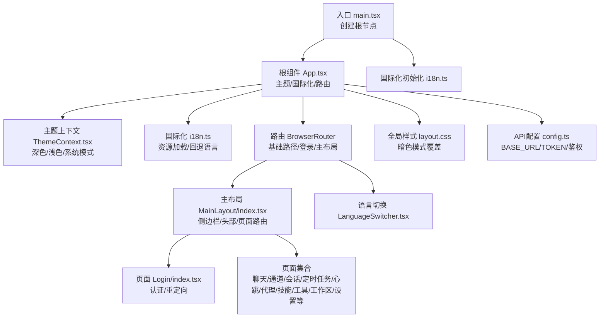
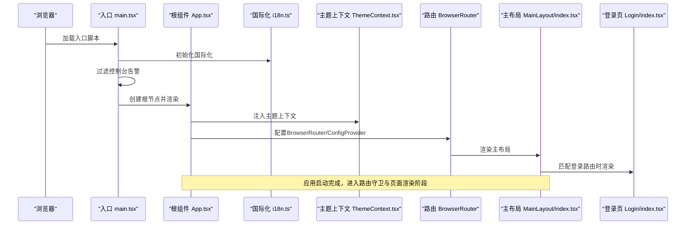
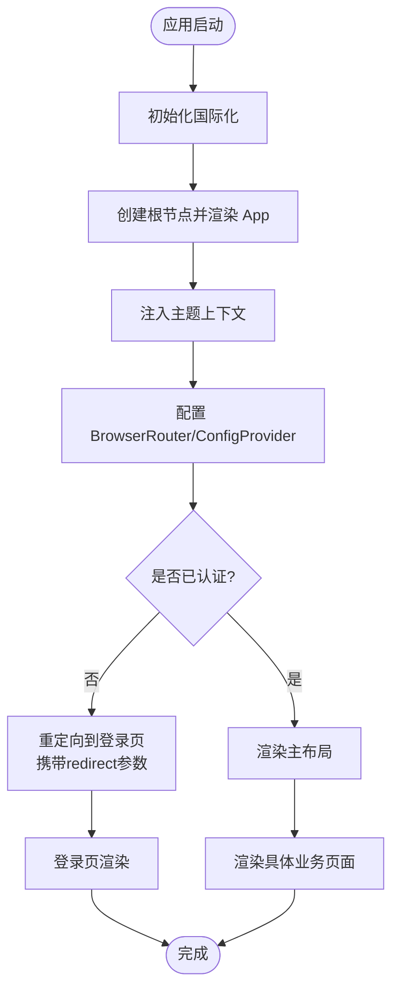
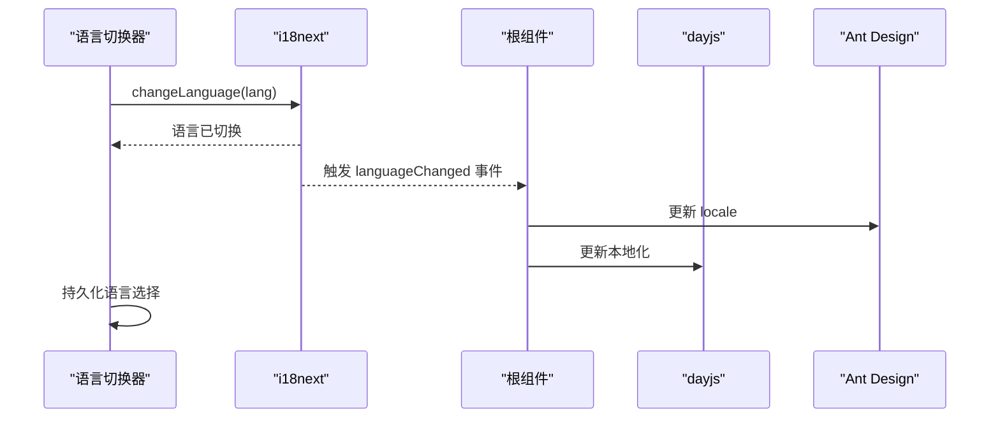
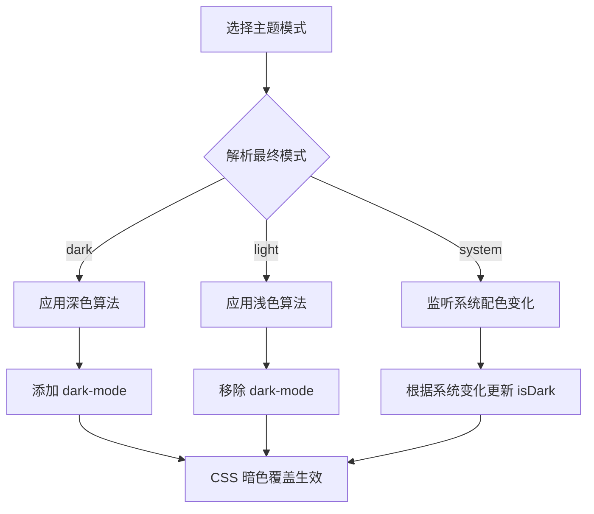
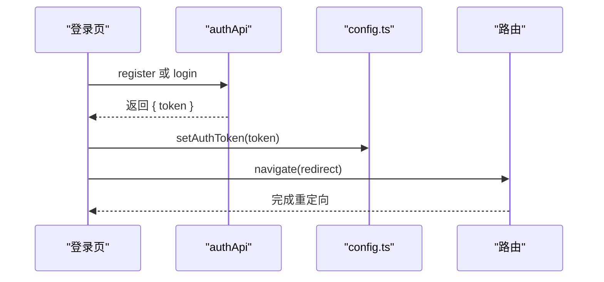
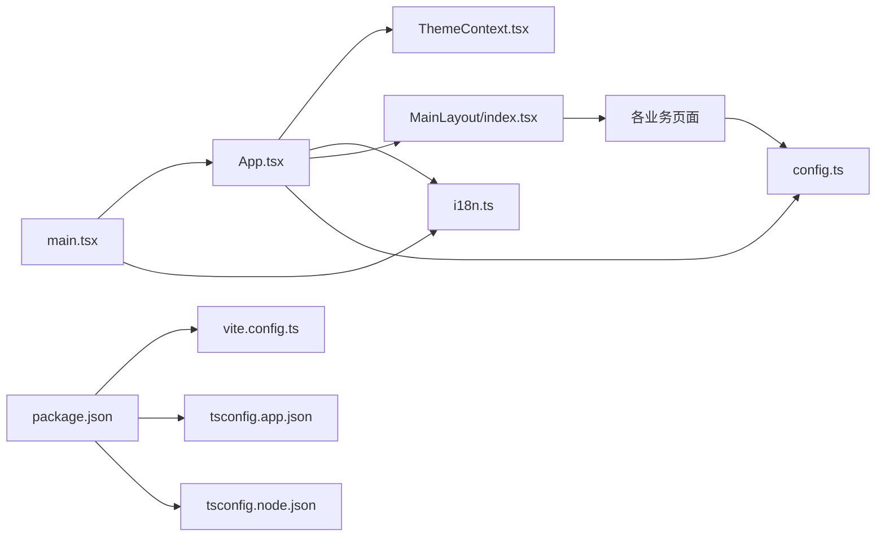

# React应用结构

<cite>
**本文引用的文件**
- [console/src/main.tsx](file://console/src/main.tsx)
- [console/src/App.tsx](file://console/src/App.tsx)
- [console/src/i18n.ts](file://console/src/i18n.ts)
- [console/vite.config.ts](file://console/vite.config.ts)
- [console/package.json](file://console/package.json)
- [console/tsconfig.json](file://console/tsconfig.json)
- [console/tsconfig.app.json](file://console/tsconfig.app.json)
- [console/tsconfig.node.json](file://console/tsconfig.node.json)
- [console/src/contexts/ThemeContext.tsx](file://console/src/contexts/ThemeContext.tsx)
- [console/src/layouts/MainLayout/index.tsx](file://console/src/layouts/MainLayout/index.tsx)
- [console/src/pages/Login/index.tsx](file://console/src/pages/Login/index.tsx)
- [console/src/api/config.ts](file://console/src/api/config.ts)
- [console/src/components/LanguageSwitcher.tsx](file://console/src/components/LanguageSwitcher.tsx)
- [console/src/styles/layout.css](file://console/src/styles/layout.css)
- [console/src/utils/markdown.ts](file://console/src/utils/markdown.ts)
</cite>

## 目录
1. [简介](#简介)
2. [项目结构](#项目结构)
3. [核心组件](#核心组件)
4. [架构总览](#架构总览)
5. [详细组件分析](#详细组件分析)
6. [依赖关系分析](#依赖关系分析)
7. [性能考虑](#性能考虑)
8. [故障排查指南](#故障排查指南)
9. [结论](#结论)
10. [附录](#附录)

## 简介
本文件面向CoPaw控制台前端（React + TypeScript + Vite）应用，系统性梳理应用入口点配置、根组件设计与国际化初始化流程，详解应用启动过程、全局配置管理与路由守卫机制，并给出错误边界处理建议、性能优化策略与开发环境配置要点。文档同时提供应用启动流程图与关键配置示例路径，帮助开发者快速理解并高效迭代。

## 项目结构
控制台前端位于 console 子目录，采用按功能域组织的目录结构：页面、布局、组件、样式、国际化资源、API封装与工具等模块清晰分层。入口文件负责挂载根组件与初始化国际化；根组件负责主题上下文、国际化语言切换、路由与全局样式注入；主布局承载侧边栏、头部与各业务页面路由；国际化与多语言资源通过i18next集中管理；Vite提供开发服务器与构建打包能力；TypeScript配置拆分为应用与Node两类。

图表来源
- [console/src/main.tsx:1-31](file://console/src/main.tsx#L1-L31)
- [console/src/App.tsx:1-171](file://console/src/App.tsx#L1-L171)
- [console/src/i18n.ts:1-32](file://console/src/i18n.ts#L1-L32)
- [console/src/contexts/ThemeContext.tsx:1-105](file://console/src/contexts/ThemeContext.tsx#L1-L105)
- [console/src/layouts/MainLayout/index.tsx:1-86](file://console/src/layouts/MainLayout/index.tsx#L1-L86)
- [console/src/pages/Login/index.tsx:1-152](file://console/src/pages/Login/index.tsx#L1-L152)
- [console/src/styles/layout.css:1-740](file://console/src/styles/layout.css#L1-L740)
- [console/src/api/config.ts:1-42](file://console/src/api/config.ts#L1-L42)
- [console/src/components/LanguageSwitcher.tsx:1-59](file://console/src/components/LanguageSwitcher.tsx#L1-L59)

章节来源
- [console/src/main.tsx:1-31](file://console/src/main.tsx#L1-L31)
- [console/src/App.tsx:1-171](file://console/src/App.tsx#L1-L171)
- [console/src/i18n.ts:1-32](file://console/src/i18n.ts#L1-L32)
- [console/src/contexts/ThemeContext.tsx:1-105](file://console/src/contexts/ThemeContext.tsx#L1-L105)
- [console/src/layouts/MainLayout/index.tsx:1-86](file://console/src/layouts/MainLayout/index.tsx#L1-L86)
- [console/src/pages/Login/index.tsx:1-152](file://console/src/pages/Login/index.tsx#L1-L152)
- [console/src/styles/layout.css:1-740](file://console/src/styles/layout.css#L1-L740)
- [console/src/api/config.ts:1-42](file://console/src/api/config.ts#L1-L42)
- [console/src/components/LanguageSwitcher.tsx:1-59](file://console/src/components/LanguageSwitcher.tsx#L1-L59)

## 核心组件
- 应用入口与启动
  - 入口文件在浏览器环境对console.error/warn进行轻量过滤，避免无害伪类警告干扰；随后创建根节点并渲染根组件。
  - 参考路径：[console/src/main.tsx:1-31](file://console/src/main.tsx#L1-L31)

- 根组件与全局配置
  - 根组件负责：
    - 国际化初始化与语言变更监听，联动Ant Design本地化与dayjs本地化；
    - 主题上下文注入，根据用户偏好与系统设置切换深色/浅色；
    - 路由配置，支持可选的基础路径（如“/console”），登录页与主布局保护路由；
    - 全局样式注入与ConfigProvider统一主题参数。
  - 参考路径：
    - [console/src/App.tsx:106-171](file://console/src/App.tsx#L106-L171)
    - [console/src/App.tsx:24-36](file://console/src/App.tsx#L24-L36)
    - [console/src/App.tsx:115-129](file://console/src/App.tsx#L115-L129)

- 国际化初始化
  - 使用i18next加载多语言资源，从localStorage读取语言偏好，回退到英文；禁用转义以支持富文本渲染。
  - 参考路径：[console/src/i18n.ts:1-32](file://console/src/i18n.ts#L1-L32)

- 主题上下文
  - 支持light/dark/system三种模式，持久化存储于localStorage；当模式为system时监听系统配色变化；向<html>添加dark-mode类名以驱动CSS变量覆盖。
  - 参考路径：[console/src/contexts/ThemeContext.tsx:1-105](file://console/src/contexts/ThemeContext.tsx#L1-L105)

- 主布局与路由
  - 主布局聚合侧边栏、头部与页面路由，内置路径到菜单键映射；默认跳转至聊天页；提供大量业务页面路由占位。
  - 参考路径：[console/src/layouts/MainLayout/index.tsx:1-86](file://console/src/layouts/MainLayout/index.tsx#L1-L86)

- 登录页与认证流程
  - 登录页根据后端认证状态决定注册或登录流程，支持首次用户引导；登录成功后写入令牌并按查询参数重定向。
  - 参考路径：[console/src/pages/Login/index.tsx:1-152](file://console/src/pages/Login/index.tsx#L1-L152)

- API配置与鉴权
  - 统一封装API基础URL与令牌获取逻辑，优先使用localStorage中的令牌，其次使用构建期常量；提供设置与清除令牌方法。
  - 参考路径：[console/src/api/config.ts:1-42](file://console/src/api/config.ts#L1-L42)

章节来源
- [console/src/main.tsx:1-31](file://console/src/main.tsx#L1-L31)
- [console/src/App.tsx:1-171](file://console/src/App.tsx#L1-L171)
- [console/src/i18n.ts:1-32](file://console/src/i18n.ts#L1-L32)
- [console/src/contexts/ThemeContext.tsx:1-105](file://console/src/contexts/ThemeContext.tsx#L1-L105)
- [console/src/layouts/MainLayout/index.tsx:1-86](file://console/src/layouts/MainLayout/index.tsx#L1-L86)
- [console/src/pages/Login/index.tsx:1-152](file://console/src/pages/Login/index.tsx#L1-L152)
- [console/src/api/config.ts:1-42](file://console/src/api/config.ts#L1-L42)

## 架构总览
下图展示从入口到页面渲染的关键调用链路，包括国际化初始化、主题上下文注入、路由守卫与页面渲染。

图表来源
- [console/src/main.tsx:1-31](file://console/src/main.tsx#L1-L31)
- [console/src/App.tsx:1-171](file://console/src/App.tsx#L1-L171)
- [console/src/i18n.ts:1-32](file://console/src/i18n.ts#L1-L32)
- [console/src/contexts/ThemeContext.tsx:1-105](file://console/src/contexts/ThemeContext.tsx#L1-L105)
- [console/src/layouts/MainLayout/index.tsx:1-86](file://console/src/layouts/MainLayout/index.tsx#L1-L86)
- [console/src/pages/Login/index.tsx:1-152](file://console/src/pages/Login/index.tsx#L1-L152)

## 详细组件分析

### 应用启动流程与路由守卫
- 启动流程
  - 入口文件创建根节点并渲染根组件；国际化在入口处先行初始化，确保后续组件可立即使用翻译能力。
  - 根组件中：
    - 解析当前语言，设置Ant Design与dayjs本地化；
    - 注入ConfigProvider，统一前缀与主题算法；
    - 基于访问路径决定basename，支持嵌套子路径部署；
    - 提供路由守卫，未登录时重定向至登录页并携带redirect参数。
- 路由守卫实现要点
  - 通过受保护路由包裹主布局，内部异步校验后端认证状态与令牌有效性；失败则清理令牌并重定向登录。
  - 登录页根据后端返回的认证状态决定注册或登录流程，支持首次用户自动进入注册。
- 参考路径
  - [console/src/main.tsx:1-31](file://console/src/main.tsx#L1-L31)
  - [console/src/App.tsx:45-100](file://console/src/App.tsx#L45-L100)
  - [console/src/App.tsx:106-171](file://console/src/App.tsx#L106-L171)
  - [console/src/pages/Login/index.tsx:17-31](file://console/src/pages/Login/index.tsx#L17-L31)

图表来源
- [console/src/main.tsx:1-31](file://console/src/main.tsx#L1-L31)
- [console/src/App.tsx:45-100](file://console/src/App.tsx#L45-L100)
- [console/src/App.tsx:106-171](file://console/src/App.tsx#L106-L171)
- [console/src/pages/Login/index.tsx:1-152](file://console/src/pages/Login/index.tsx#L1-L152)

章节来源
- [console/src/main.tsx:1-31](file://console/src/main.tsx#L1-L31)
- [console/src/App.tsx:1-171](file://console/src/App.tsx#L1-L171)
- [console/src/pages/Login/index.tsx:1-152](file://console/src/pages/Login/index.tsx#L1-L152)

### 国际化初始化与语言切换
- 初始化策略
  - 从localStorage读取语言偏好，未设置时默认英文；资源集中于本地JSON文件；禁用转义以支持HTML片段。
- 语言切换
  - 语言切换器组件通过i18n.changeLanguage更新语言并持久化；根组件监听languageChanged事件同步Ant Design与dayjs本地化。
- 参考路径
  - [console/src/i18n.ts:1-32](file://console/src/i18n.ts#L1-L32)
  - [console/src/components/LanguageSwitcher.tsx:1-59](file://console/src/components/LanguageSwitcher.tsx#L1-L59)
  - [console/src/App.tsx:115-129](file://console/src/App.tsx#L115-L129)

图表来源
- [console/src/components/LanguageSwitcher.tsx:1-59](file://console/src/components/LanguageSwitcher.tsx#L1-L59)
- [console/src/i18n.ts:1-32](file://console/src/i18n.ts#L1-L32)
- [console/src/App.tsx:115-129](file://console/src/App.tsx#L115-L129)

章节来源
- [console/src/i18n.ts:1-32](file://console/src/i18n.ts#L1-L32)
- [console/src/components/LanguageSwitcher.tsx:1-59](file://console/src/components/LanguageSwitcher.tsx#L1-L59)
- [console/src/App.tsx:115-129](file://console/src/App.tsx#L115-L129)

### 主题系统与暗色模式
- 模式与解析
  - 支持light/dark/system；system模式下监听系统配色变化；切换时向<html>添加/移除dark-mode类名。
- 样式覆盖
  - 全局CSS针对copaw与Ant Design组件在暗色模式下的背景、边框、文字颜色等进行覆盖，保证一致性。
- 参考路径
  - [console/src/contexts/ThemeContext.tsx:1-105](file://console/src/contexts/ThemeContext.tsx#L1-L105)
  - [console/src/styles/layout.css:1-740](file://console/src/styles/layout.css#L1-L740)

图表来源
- [console/src/contexts/ThemeContext.tsx:1-105](file://console/src/contexts/ThemeContext.tsx#L1-L105)
- [console/src/styles/layout.css:1-740](file://console/src/styles/layout.css#L1-L740)

章节来源
- [console/src/contexts/ThemeContext.tsx:1-105](file://console/src/contexts/ThemeContext.tsx#L1-L105)
- [console/src/styles/layout.css:1-740](file://console/src/styles/layout.css#L1-L740)

### API配置与鉴权令牌管理
- 基础URL与令牌
  - getApiUrl拼接BASE_URL与固定前缀“/api”；getApiToken优先localStorage，其次构建期TOKEN；setAuthToken/clearAuthToken用于登录/登出。
- 登录页交互
  - 登录或注册成功后写入令牌并按redirect参数重定向；若后端关闭认证，则直接跳转聊天页。
- 参考路径
  - [console/src/api/config.ts:1-42](file://console/src/api/config.ts#L1-L42)
  - [console/src/pages/Login/index.tsx:33-68](file://console/src/pages/Login/index.tsx#L33-L68)

图表来源
- [console/src/pages/Login/index.tsx:33-68](file://console/src/pages/Login/index.tsx#L33-L68)
- [console/src/api/config.ts:1-42](file://console/src/api/config.ts#L1-L42)

章节来源
- [console/src/api/config.ts:1-42](file://console/src/api/config.ts#L1-L42)
- [console/src/pages/Login/index.tsx:1-152](file://console/src/pages/Login/index.tsx#L1-L152)

### Markdown工具与内容处理
- 前言块剥离
  - 提供stripFrontmatter函数用于去除YAML前言块，便于渲染纯正文内容。
- 参考路径
  - [console/src/utils/markdown.ts:1-10](file://console/src/utils/markdown.ts#L1-L10)

章节来源
- [console/src/utils/markdown.ts:1-10](file://console/src/utils/markdown.ts#L1-L10)

## 依赖关系分析
- 入口与根组件
  - main.tsx依赖App.tsx；App.tsx依赖ThemeContext、i18n、路由与样式。
- 国际化与主题
  - i18n.ts被main.tsx与App.tsx共同依赖；ThemeContext.tsx被App.tsx依赖。
- 路由与页面
  - App.tsx依赖MainLayout；MainLayout依赖各业务页面组件。
- 开发与构建
  - package.json定义脚本与依赖；vite.config.ts提供插件、别名、开发服务器与CSS预处理配置；tsconfig.*.json分别约束应用与Node环境编译选项。
- API与工具
  - 页面组件依赖config.ts提供的API配置；工具模块提供通用处理函数。

图表来源
- [console/src/main.tsx:1-31](file://console/src/main.tsx#L1-L31)
- [console/src/App.tsx:1-171](file://console/src/App.tsx#L1-L171)
- [console/src/i18n.ts:1-32](file://console/src/i18n.ts#L1-L32)
- [console/src/contexts/ThemeContext.tsx:1-105](file://console/src/contexts/ThemeContext.tsx#L1-L105)
- [console/src/layouts/MainLayout/index.tsx:1-86](file://console/src/layouts/MainLayout/index.tsx#L1-L86)
- [console/src/api/config.ts:1-42](file://console/src/api/config.ts#L1-L42)
- [console/package.json:1-57](file://console/package.json#L1-L57)
- [console/vite.config.ts:1-48](file://console/vite.config.ts#L1-L48)
- [console/tsconfig.app.json:1-31](file://console/tsconfig.app.json#L1-L31)
- [console/tsconfig.node.json:1-23](file://console/tsconfig.node.json#L1-L23)

章节来源
- [console/package.json:1-57](file://console/package.json#L1-L57)
- [console/vite.config.ts:1-48](file://console/vite.config.ts#L1-L48)
- [console/tsconfig.json:1-8](file://console/tsconfig.json#L1-L8)
- [console/tsconfig.app.json:1-31](file://console/tsconfig.app.json#L1-L31)
- [console/tsconfig.node.json:1-23](file://console/tsconfig.node.json#L1-L23)

## 性能考虑
- 依赖预优化
  - 在Vite配置中显式声明需要预构建的依赖（如diff），减少冷启动时间与运行时开销。
  - 参考路径：[console/vite.config.ts:37-39](file://console/vite.config.ts#L37-L39)
- CSS模块化与预处理器
  - 启用CSS Modules驼峰命名与短哈希命名，降低样式冲突；开启Less JavaScript启用以支持动态计算。
  - 参考路径：[console/vite.config.ts:17-26](file://console/vite.config.ts#L17-L26)
- 构建输出与别名
  - 通过路径别名简化导入；构建输出目录可按需调整（注释掉的outDir可用于将产物输出到指定目录）。
  - 参考路径：[console/vite.config.ts:28-32](file://console/vite.config.ts#L28-L32)
- TypeScript严格性
  - 应用编译配置启用严格模式与未使用检查，有助于早期发现潜在问题与冗余代码。
  - 参考路径：[console/tsconfig.app.json:18-24](file://console/tsconfig.app.json#L18-L24)

## 故障排查指南
- 控制台告警噪声
  - 入口已对特定伪类与不安全提示进行过滤，若仍出现异常告警，可检查相关组件渲染逻辑或第三方库版本兼容性。
  - 参考路径：[console/src/main.tsx:5-28](file://console/src/main.tsx#L5-L28)
- 国际化显示异常
  - 确认localStorage中的语言键值有效；检查i18n资源文件是否存在对应键；确认languageChanged事件是否正确触发。
  - 参考路径：[console/src/i18n.ts:22-29](file://console/src/i18n.ts#L22-L29)
- 暗色模式不生效
  - 检查<html>元素是否正确添加/移除dark-mode类；确认CSS覆盖规则是否被更高优先级样式覆盖。
  - 参考路径：[console/src/contexts/ThemeContext.tsx:57-65](file://console/src/contexts/ThemeContext.tsx#L57-L65), [console/src/styles/layout.css:9-12](file://console/src/styles/layout.css#L9-L12)
- 认证失败或循环重定向
  - 检查后端认证状态与令牌有效性；确认登录页redirect参数合法性；查看路由守卫逻辑是否正确清理无效令牌。
  - 参考路径：[console/src/App.tsx:45-100](file://console/src/App.tsx#L45-L100), [console/src/pages/Login/index.tsx:33-68](file://console/src/pages/Login/index.tsx#L33-L68)

章节来源
- [console/src/main.tsx:5-28](file://console/src/main.tsx#L5-L28)
- [console/src/i18n.ts:22-29](file://console/src/i18n.ts#L22-L29)
- [console/src/contexts/ThemeContext.tsx:57-65](file://console/src/contexts/ThemeContext.tsx#L57-L65)
- [console/src/styles/layout.css:9-12](file://console/src/styles/layout.css#L9-L12)
- [console/src/App.tsx:45-100](file://console/src/App.tsx#L45-L100)
- [console/src/pages/Login/index.tsx:33-68](file://console/src/pages/Login/index.tsx#L33-L68)

## 结论
该React应用以清晰的入口与根组件为核心，结合国际化、主题与路由守卫，形成稳定的启动与运行框架。通过Vite与TypeScript的现代化配置，兼顾开发体验与构建效率。建议在后续迭代中进一步完善错误边界组件、引入懒加载与缓存策略，并持续优化暗色模式下的视觉一致性与可访问性。

## 附录
- 开发与构建脚本
  - 参考路径：[console/package.json:6-16](file://console/package.json#L6-L16)
- Vite开发服务器与构建配置
  - 参考路径：[console/vite.config.ts:1-48](file://console/vite.config.ts#L1-L48)
- TypeScript应用与Node配置
  - 参考路径：
    - [console/tsconfig.json:1-8](file://console/tsconfig.json#L1-L8)
    - [console/tsconfig.app.json:1-31](file://console/tsconfig.app.json#L1-L31)
    - [console/tsconfig.node.json:1-23](file://console/tsconfig.node.json#L1-L23)
- 国际化资源位置
  - 参考路径：[console/src/i18n.ts:3-6](file://console/src/i18n.ts#L3-L6)