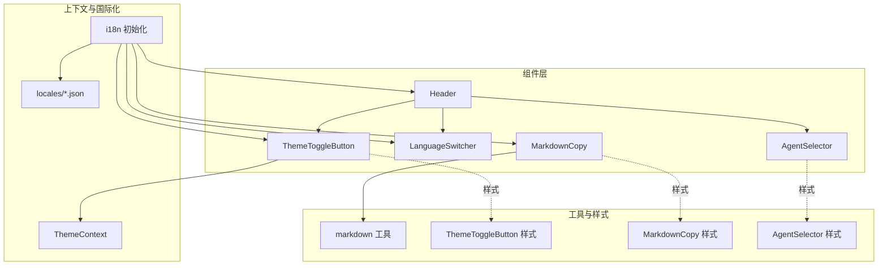
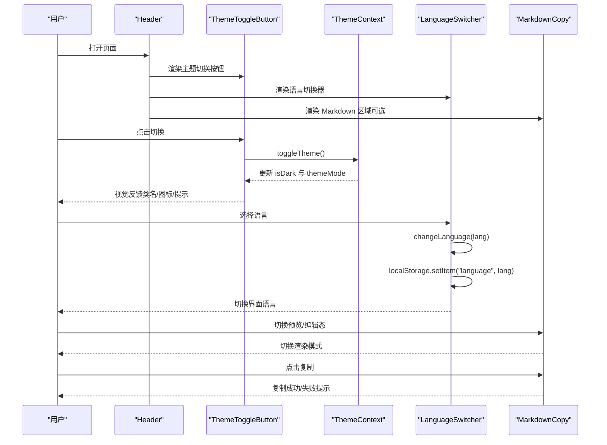
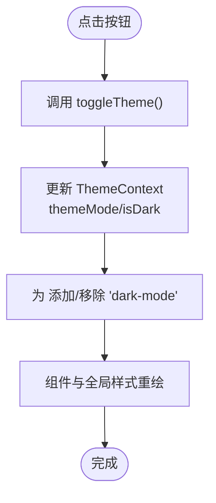
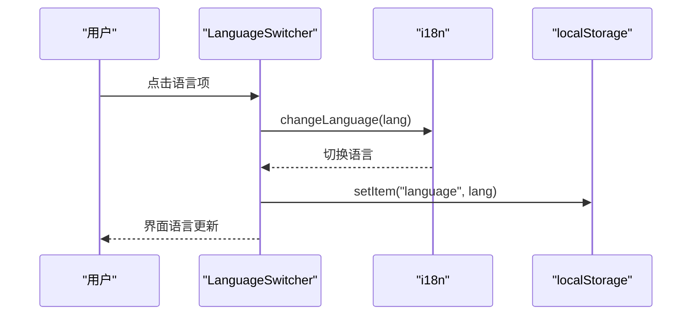
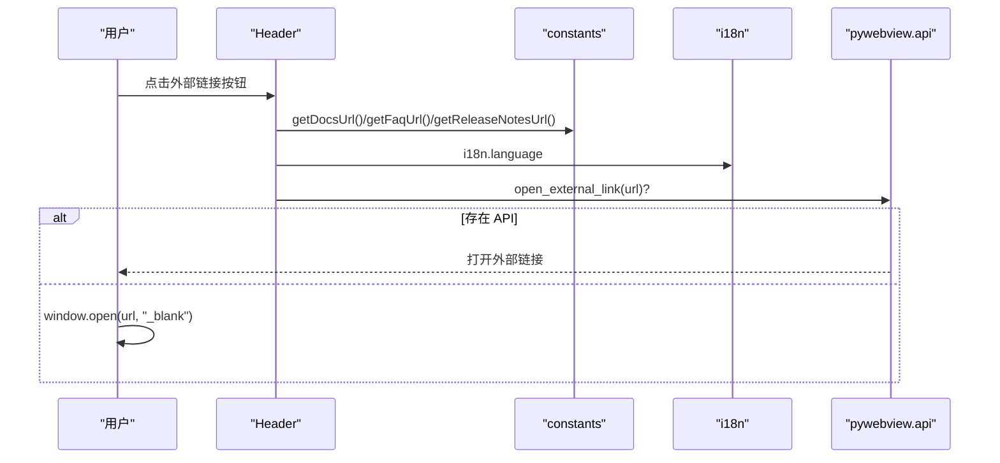
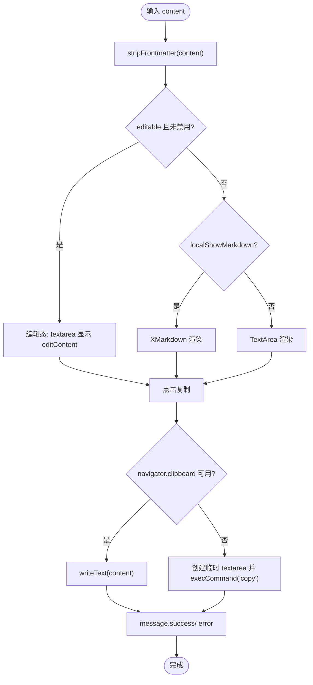
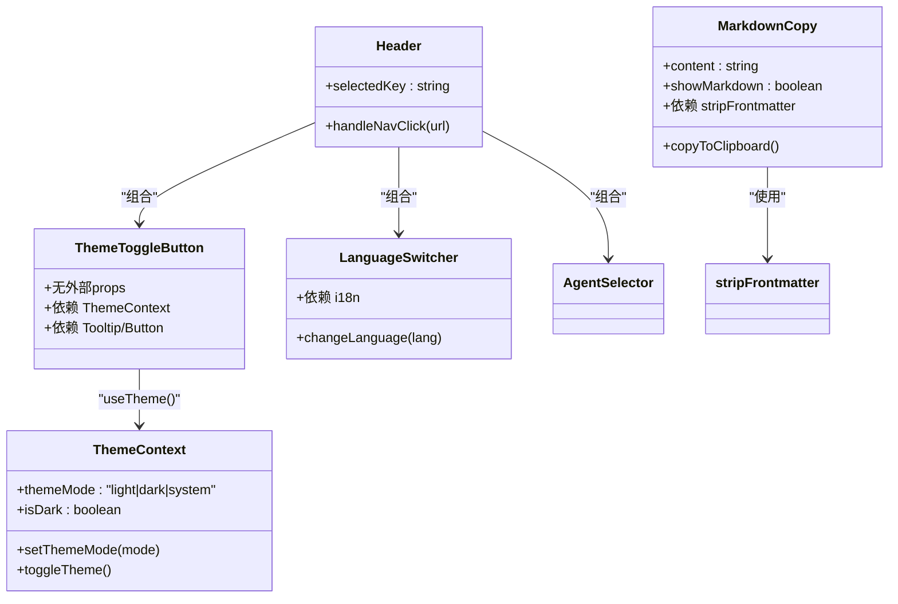
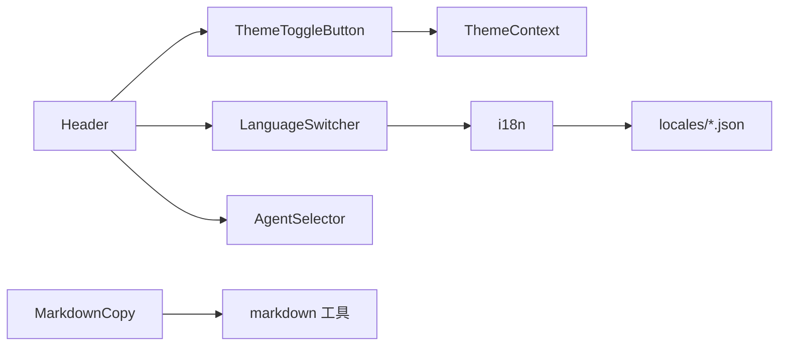

# UI组件库

<cite>
**本文引用的文件**
- [ThemeToggleButton/index.tsx](file://console/src/components/ThemeToggleButton/index.tsx)
- [ThemeToggleButton/index.module.less](file://console/src/components/ThemeToggleButton/index.module.less)
- [ThemeContext.tsx](file://console/src/contexts/ThemeContext.tsx)
- [LanguageSwitcher.tsx](file://console/src/components/LanguageSwitcher.tsx)
- [Header.tsx](file://console/src/layouts/Header.tsx)
- [MarkdownCopy/MarkdownCopy.tsx](file://console/src/components/MarkdownCopy/MarkdownCopy.tsx)
- [MarkdownCopy/index.module.less](file://console/src/components/MarkdownCopy/index.module.less)
- [markdown.ts](file://console/src/utils/markdown.ts)
- [i18n.ts](file://console/src/i18n.ts)
- [AgentSelector/index.tsx](file://console/src/components/AgentSelector/index.tsx)
- [AgentSelector/index.module.less](file://console/src/components/AgentSelector/index.module.less)
- [layouts/constants.ts](file://console/src/layouts/constants.ts)
- [locales/en.json](file://console/src/locales/en.json)
- [locales/zh.json](file://console/src/locales/zh.json)
</cite>

## 目录
1. [简介](#简介)
2. [项目结构](#项目结构)
3. [核心组件](#核心组件)
4. [架构总览](#架构总览)
5. [详细组件分析](#详细组件分析)
6. [依赖关系分析](#依赖关系分析)
7. [性能考量](#性能考量)
8. [故障排查指南](#故障排查指南)
9. [结论](#结论)
10. [附录](#附录)

## 简介
本文件为 CoPaw 控制台前端 UI 组件库的权威文档，聚焦于可复用 UI 组件的设计原则、接口与使用模式。重点覆盖以下组件：
- 主题切换按钮（ThemeToggleButton）
- 语言切换器（LanguageSwitcher）
- 页面头部（Header）
- Markdown 复制组件（MarkdownCopy）

文档将从架构、数据流、处理逻辑、集成点、错误处理与性能优化等维度进行系统化阐述，并提供无障碍访问、响应式设计与样式定制建议，以及使用示例与最佳实践。

## 项目结构
UI 组件主要位于 console/src/components 与 console/src/layouts 下，配合上下文、国际化与样式模块共同构成完整的组件生态。关键目录与职责如下：
- console/src/components：通用 UI 组件（如 ThemeToggleButton、LanguageSwitcher、MarkdownCopy、AgentSelector）
- console/src/contexts：应用级上下文（如 ThemeContext）
- console/src/layouts：布局组件（如 Header）
- console/src/utils：工具函数（如 markdown 去除 YAML frontmatter）
- console/src/locales 与 console/src/i18n.ts：国际化资源与初始化
- console/src/styles：全局样式覆盖（如表单与布局）

图表来源
- [ThemeToggleButton/index.tsx:11-28](file://console/src/components/ThemeToggleButton/index.tsx#L11-L28)
- [ThemeContext.tsx:51-100](file://console/src/contexts/ThemeContext.tsx#L51-L100)
- [LanguageSwitcher.tsx:6-58](file://console/src/components/LanguageSwitcher.tsx#L6-L58)
- [Header.tsx:28-90](file://console/src/layouts/Header.tsx#L28-L90)
- [MarkdownCopy/MarkdownCopy.tsx:43-194](file://console/src/components/MarkdownCopy/MarkdownCopy.tsx#L43-L194)
- [markdown.ts:8-9](file://console/src/utils/markdown.ts#L8-L9)
- [i18n.ts:22-29](file://console/src/i18n.ts#L22-L29)

章节来源
- [ThemeToggleButton/index.tsx:11-28](file://console/src/components/ThemeToggleButton/index.tsx#L11-L28)
- [ThemeContext.tsx:51-100](file://console/src/contexts/ThemeContext.tsx#L51-L100)
- [LanguageSwitcher.tsx:6-58](file://console/src/components/LanguageSwitcher.tsx#L6-L58)
- [Header.tsx:28-90](file://console/src/layouts/Header.tsx#L28-L90)
- [MarkdownCopy/MarkdownCopy.tsx:43-194](file://console/src/components/MarkdownCopy/MarkdownCopy.tsx#L43-L194)
- [markdown.ts:8-9](file://console/src/utils/markdown.ts#L8-L9)
- [i18n.ts:22-29](file://console/src/i18n.ts#L22-L29)

## 核心组件
本节概述四大组件的设计目标、职责边界与典型使用场景：
- 主题切换按钮：在明/暗主题之间切换，支持系统跟随模式，提供无障碍标签与提示气泡。
- 语言切换器：提供多语言切换入口，持久化用户选择，展示当前语言标签。
- 页面头部：承载导航、外部链接、语言与主题切换入口，统一风格与交互。
- Markdown 复制组件：支持 Markdown 预览与文本编辑双态，一键复制，可配置控件与样式。

章节来源
- [ThemeToggleButton/index.tsx:7-28](file://console/src/components/ThemeToggleButton/index.tsx#L7-L28)
- [LanguageSwitcher.tsx:6-58](file://console/src/components/LanguageSwitcher.tsx#L6-L58)
- [Header.tsx:28-90](file://console/src/layouts/Header.tsx#L28-L90)
- [MarkdownCopy/MarkdownCopy.tsx:10-53](file://console/src/components/MarkdownCopy/MarkdownCopy.tsx#L10-L53)

## 架构总览
组件间协作关系与数据流向如下：

图表来源
- [Header.tsx:28-90](file://console/src/layouts/Header.tsx#L28-L90)
- [ThemeToggleButton/index.tsx:11-28](file://console/src/components/ThemeToggleButton/index.tsx#L11-L28)
- [ThemeContext.tsx:79-91](file://console/src/contexts/ThemeContext.tsx#L79-L91)
- [LanguageSwitcher.tsx:11-14](file://console/src/components/LanguageSwitcher.tsx#L11-L14)
- [MarkdownCopy/MarkdownCopy.tsx:75-109](file://console/src/components/MarkdownCopy/MarkdownCopy.tsx#L75-L109)

## 详细组件分析

### 主题切换按钮（ThemeToggleButton）
- 设计原则
  - 以最小交互承载明/暗主题切换，支持“系统跟随”模式。
  - 通过 Tooltip 提供可读性更强的标题文案，结合 aria-label 提升无障碍体验。
  - 使用 CSS 类名动态切换暗色模式，避免硬编码颜色。
- 关键接口
  - 无外部 props，内部通过 ThemeContext 获取 isDark 与 toggleTheme。
  - 国际化文案来自 t()，标题与按钮文本随语言切换。
- 数据流
  - 用户点击 -> 调用 toggleTheme -> 更新 ThemeContext -> 影响 <html> 类名 -> 应用全局样式。
- 样式定制
  - 可通过覆盖 .toggleBtn 与 :global(.dark-mode) .toggleBtn 实现品牌色与悬停效果。
- 无障碍与响应式
  - aria-label 与 Tooltip 提升可访问性；按钮尺寸与间距适配移动端。
- 性能与优化
  - 使用 memo 化与受控状态，避免不必要的重渲染；切换逻辑为常量时间。

图表来源
- [ThemeToggleButton/index.tsx:11-28](file://console/src/components/ThemeToggleButton/index.tsx#L11-L28)
- [ThemeContext.tsx:57-65](file://console/src/contexts/ThemeContext.tsx#L57-L65)
- [ThemeContext.tsx:79-91](file://console/src/contexts/ThemeContext.tsx#L79-L91)

章节来源
- [ThemeToggleButton/index.tsx:7-28](file://console/src/components/ThemeToggleButton/index.tsx#L7-L28)
- [ThemeToggleButton/index.module.less:1-37](file://console/src/components/ThemeToggleButton/index.module.less#L1-L37)
- [ThemeContext.tsx:51-100](file://console/src/contexts/ThemeContext.tsx#L51-L100)

### 语言切换器（LanguageSwitcher）
- 设计原则
  - 下拉菜单展示多语言选项，当前语言高亮，支持本地持久化。
  - 通过 localStorage 记录用户选择，刷新后保持一致。
- 关键接口
  - changeLanguage(lang)：更新 i18n 语言与本地存储。
  - items：菜单项数组，包含语言键与点击回调。
- 数据流
  - 用户选择 -> changeLanguage -> i18n.changeLanguage -> localStorage 更新 -> 组件重渲染。
- 样式定制
  - 可通过 antd/自定义样式覆盖按钮与下拉项外观。
- 无障碍与响应式
  - 使用全局图标与文本标签，适配不同屏幕尺寸。
- 性能与优化
  - 语言切换为 O(1) 操作，菜单项静态配置，渲染成本低。

图表来源
- [LanguageSwitcher.tsx:11-14](file://console/src/components/LanguageSwitcher.tsx#L11-L14)
- [i18n.ts:24-24](file://console/src/i18n.ts#L24-L24)

章节来源
- [LanguageSwitcher.tsx:6-58](file://console/src/components/LanguageSwitcher.tsx#L6-L58)
- [i18n.ts:22-29](file://console/src/i18n.ts#L22-L29)

### 页面头部（Header）
- 设计原则
  - 集成导航、外部链接、语言与主题切换，统一风格与交互。
  - 支持在桌面端显示多按钮，移动端可通过侧边栏或折叠策略优化。
- 关键接口
  - selectedKey：决定标题文案映射。
  - handleNavClick：打开外部链接，优先使用 pywebview API，否则新开窗口。
- 数据流
  - 从 constants.ts 解析 URL 与文案，结合 i18n 与 Tooltip 展示。
- 样式定制
  - 可通过全局样式覆盖 Header 容器与按钮组布局。
- 无障碍与响应式
  - Tooltip 与图标结合，确保可理解性；按钮间距与对齐适配响应式断点。
- 性能与优化
  - 仅在 selectedKey 变更时更新标题；外部链接打开为轻量操作。

图表来源
- [Header.tsx:31-40](file://console/src/layouts/Header.tsx#L31-L40)
- [layouts/constants.ts:62-69](file://console/src/layouts/constants.ts#L62-L69)
- [layouts/constants.ts:59-60](file://console/src/layouts/constants.ts#L59-L60)

章节来源
- [Header.tsx:28-90](file://console/src/layouts/Header.tsx#L28-L90)
- [layouts/constants.ts:59-70](file://console/src/layouts/constants.ts#L59-L70)

### Markdown 复制组件（MarkdownCopy）
- 设计原则
  - 双态呈现：Markdown 预览与文本编辑，支持一键复制，可配置控件与样式。
  - 自动去除 YAML frontmatter，提升渲染质量。
- 关键接口
  - 属性：
    - content：原始内容
    - showMarkdown：初始是否显示 Markdown
    - onShowMarkdownChange：预览态变更回调
    - copyButtonProps/markdownViewerProps/textareaProps：控件与容器样式透传
    - showControls/editable/onContentChange：控制条与编辑态开关
  - 方法：
    - copyToClipboard：复制内容至剪贴板（兼容非安全上下文）
    - handleContentChange：编辑态内容变更
    - handleShowMarkdownChange：切换预览态
- 数据流
  - 输入 content -> 去除 frontmatter -> 预览渲染或文本编辑 -> 复制到剪贴板 -> 成功/失败提示。
- 样式定制
  - 通过 markdownViewerProps/style 与 textareaProps/style 自定义容器尺寸与背景。
- 无障碍与响应式
  - 文本区域支持只读与禁用；复制按钮提供 loading 状态；预览容器具备滚动与边框。
- 性能与优化
  - 使用 useMemo 去除 frontmatter，避免重复计算；编辑态与预览态切换为 O(1)。

图表来源
- [MarkdownCopy/MarkdownCopy.tsx:58-61](file://console/src/components/MarkdownCopy/MarkdownCopy.tsx#L58-L61)
- [MarkdownCopy/MarkdownCopy.tsx:75-109](file://console/src/components/MarkdownCopy/MarkdownCopy.tsx#L75-L109)
- [markdown.ts:8-9](file://console/src/utils/markdown.ts#L8-L9)

章节来源
- [MarkdownCopy/MarkdownCopy.tsx:10-53](file://console/src/components/MarkdownCopy/MarkdownCopy.tsx#L10-L53)
- [MarkdownCopy/MarkdownCopy.tsx:58-73](file://console/src/components/MarkdownCopy/MarkdownCopy.tsx#L58-L73)
- [MarkdownCopy/MarkdownCopy.tsx:75-117](file://console/src/components/MarkdownCopy/MarkdownCopy.tsx#L75-L117)
- [MarkdownCopy/MarkdownCopy.tsx:150-194](file://console/src/components/MarkdownCopy/MarkdownCopy.tsx#L150-L194)
- [MarkdownCopy/index.module.less:1-62](file://console/src/components/MarkdownCopy/index.module.less#L1-L62)
- [markdown.ts:8-9](file://console/src/utils/markdown.ts#L8-L9)

### 组件间关系与依赖
- Header 作为容器组件，组合 ThemeToggleButton、LanguageSwitcher 与 AgentSelector。
- ThemeToggleButton 依赖 ThemeContext 提供主题状态与切换方法。
- MarkdownCopy 依赖 markdown 工具函数与国际化文案。
- 语言切换器与国际化资源配合，实现多语言切换。

图表来源
- [ThemeToggleButton/index.tsx:11-28](file://console/src/components/ThemeToggleButton/index.tsx#L11-L28)
- [ThemeContext.tsx:15-30](file://console/src/contexts/ThemeContext.tsx#L15-L30)
- [LanguageSwitcher.tsx:6-58](file://console/src/components/LanguageSwitcher.tsx#L6-L58)
- [MarkdownCopy/MarkdownCopy.tsx:43-194](file://console/src/components/MarkdownCopy/MarkdownCopy.tsx#L43-L194)
- [Header.tsx:28-90](file://console/src/layouts/Header.tsx#L28-L90)

章节来源
- [ThemeToggleButton/index.tsx:11-28](file://console/src/components/ThemeToggleButton/index.tsx#L11-L28)
- [ThemeContext.tsx:15-30](file://console/src/contexts/ThemeContext.tsx#L15-L30)
- [LanguageSwitcher.tsx:6-58](file://console/src/components/LanguageSwitcher.tsx#L6-L58)
- [MarkdownCopy/MarkdownCopy.tsx:43-194](file://console/src/components/MarkdownCopy/MarkdownCopy.tsx#L43-L194)
- [Header.tsx:28-90](file://console/src/layouts/Header.tsx#L28-L90)

## 依赖关系分析
- 组件依赖
  - ThemeToggleButton 依赖 ThemeContext 与 antd 图标。
  - LanguageSwitcher 依赖 react-i18next 与 antd 组件。
  - MarkdownCopy 依赖 @agentscope-ai/design、@ant-design/x-markdown、react-i18next 与自定义工具。
  - Header 依赖 Header 布局、antd 组件与 constants。
- 外部依赖
  - i18n：多语言资源与初始化。
  - localStorage：主题与语言偏好持久化。
- 潜在循环依赖
  - 组件间为单向依赖，无循环引入风险。

图表来源
- [ThemeToggleButton/index.tsx:1-5](file://console/src/components/ThemeToggleButton/index.tsx#L1-L5)
- [ThemeContext.tsx:1-8](file://console/src/contexts/ThemeContext.tsx#L1-L8)
- [LanguageSwitcher.tsx:1-4](file://console/src/components/LanguageSwitcher.tsx#L1-L4)
- [MarkdownCopy/MarkdownCopy.tsx:1-8](file://console/src/components/MarkdownCopy/MarkdownCopy.tsx#L1-L8)
- [Header.tsx:1-13](file://console/src/layouts/Header.tsx#L1-L13)
- [i18n.ts:1-6](file://console/src/i18n.ts#L1-L6)

章节来源
- [ThemeToggleButton/index.tsx:1-5](file://console/src/components/ThemeToggleButton/index.tsx#L1-L5)
- [ThemeContext.tsx:1-8](file://console/src/contexts/ThemeContext.tsx#L1-L8)
- [LanguageSwitcher.tsx:1-4](file://console/src/components/LanguageSwitcher.tsx#L1-L4)
- [MarkdownCopy/MarkdownCopy.tsx:1-8](file://console/src/components/MarkdownCopy/MarkdownCopy.tsx#L1-L8)
- [Header.tsx:1-13](file://console/src/layouts/Header.tsx#L1-L13)
- [i18n.ts:1-6](file://console/src/i18n.ts#L1-L6)

## 性能考量
- 渲染优化
  - MarkdownCopy 使用 useMemo 去除 frontmatter，避免重复渲染。
  - ThemeToggleButton 与 LanguageSwitcher 为纯展示组件，渲染成本低。
- 状态管理
  - ThemeContext 使用 useState 与 useCallback，减少子组件重渲染。
- I/O 与异步
  - 复制操作在主线程执行，非阻塞；失败时提供错误提示。
- 资源加载
  - 国际化资源在应用启动时一次性初始化，后续切换语言为内存操作。

## 故障排查指南
- 主题切换无效
  - 检查 <html> 是否存在 dark-mode 类名；确认 ThemeContext 的 setThemeMode 是否被调用。
  - 章节来源
    - [ThemeContext.tsx:57-65](file://console/src/contexts/ThemeContext.tsx#L57-L65)
    - [ThemeContext.tsx:79-87](file://console/src/contexts/ThemeContext.tsx#L79-L87)
- 语言切换未生效
  - 确认 localStorage 中 language 键值；检查 i18n.changeLanguage 是否被调用。
  - 章节来源
    - [LanguageSwitcher.tsx:11-14](file://console/src/components/LanguageSwitcher.tsx#L11-L14)
    - [i18n.ts:24-24](file://console/src/i18n.ts#L24-L24)
- Markdown 复制失败
  - 非安全上下文使用 execCommand；检查浏览器权限与 HTTPS 环境。
  - 章节来源
    - [MarkdownCopy/MarkdownCopy.tsx:87-102](file://console/src/components/MarkdownCopy/MarkdownCopy.tsx#L87-L102)
- 外部链接无法打开
  - 检查 pywebview.api 是否可用；否则回退 window.open。
  - 章节来源
    - [Header.tsx:33-39](file://console/src/layouts/Header.tsx#L33-L39)

## 结论
CoPaw UI 组件库以简洁、可复用为核心设计目标，通过上下文与国际化解耦主题与语言逻辑，借助工具函数与样式模块实现灵活定制。四大组件在易用性、可访问性与性能方面均具备良好表现，适合在多场景下快速集成与扩展。

## 附录

### 组件属性与事件清单
- 主题切换按钮（ThemeToggleButton）
  - 无外部属性
  - 依赖：ThemeContext（isDark、toggleTheme）、Tooltip、Button、图标
- 语言切换器（LanguageSwitcher）
  - 无外部属性
  - 依赖：i18n、Dropdown、Button、图标
- 页面头部（Header）
  - 属性：selectedKey
  - 依赖：constants、i18n、Tooltip、Button、图标
- Markdown 复制组件（MarkdownCopy）
  - 属性：content、showMarkdown、onShowMarkdownChange、copyButtonProps、markdownViewerProps、textareaProps、showControls、editable、onContentChange
  - 依赖：stripFrontmatter、XMarkdown、Input.TextArea、Button、message、Switch、i18n

章节来源
- [ThemeToggleButton/index.tsx:11-28](file://console/src/components/ThemeToggleButton/index.tsx#L11-L28)
- [LanguageSwitcher.tsx:6-58](file://console/src/components/LanguageSwitcher.tsx#L6-L58)
- [Header.tsx:24-26](file://console/src/layouts/Header.tsx#L24-L26)
- [MarkdownCopy/MarkdownCopy.tsx:10-41](file://console/src/components/MarkdownCopy/MarkdownCopy.tsx#L10-L41)

### 最佳实践
- 主题与语言
  - 使用 ThemeContext 管理主题状态，避免在组件内直接操作 DOM。
  - 语言切换后同步更新 localStorage，保证刷新后一致性。
- Markdown 复制
  - 在需要展示高质量 Markdown 时启用预览；在需要编辑时切换到文本编辑态。
  - 为复制按钮提供 loading 状态与成功/失败提示。
- 无障碍与响应式
  - 为按钮提供 aria-label 与 Tooltip；确保在小屏设备上按钮间距与可点击区域充足。
- 样式定制
  - 通过模块化样式与全局覆盖相结合，实现品牌化定制；避免内联样式的滥用。