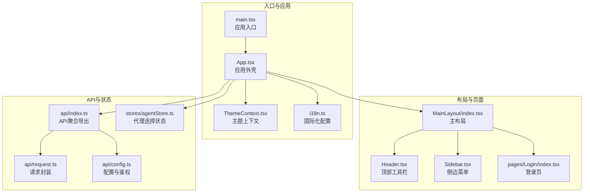
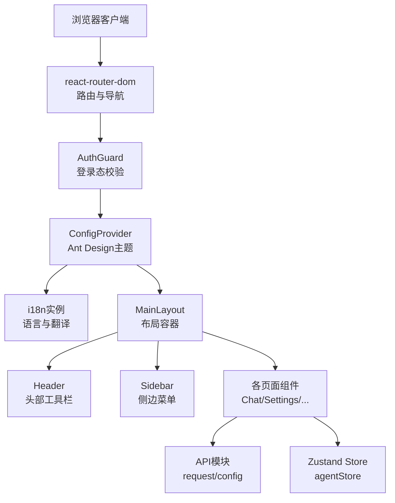
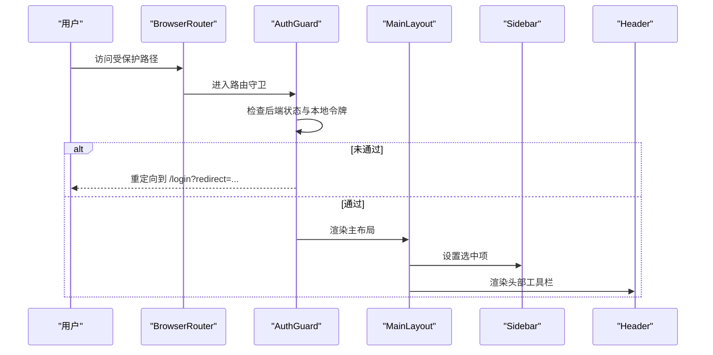
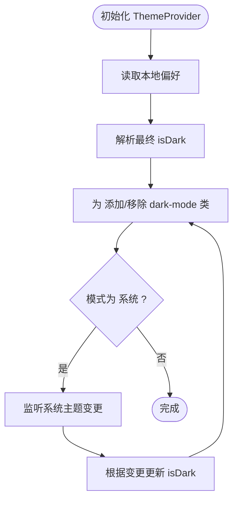
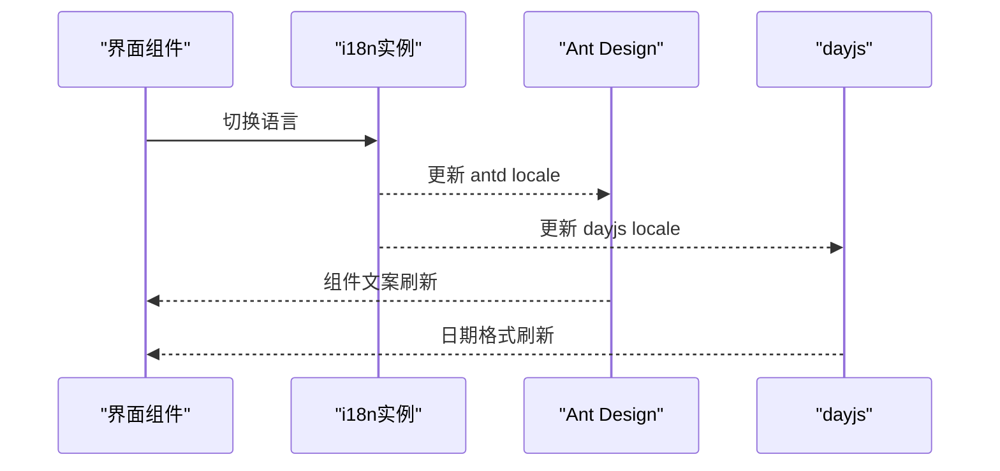
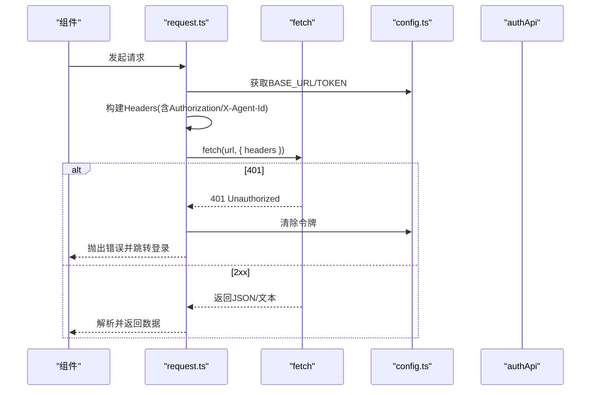
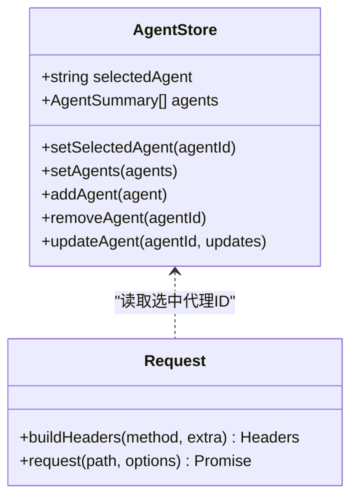
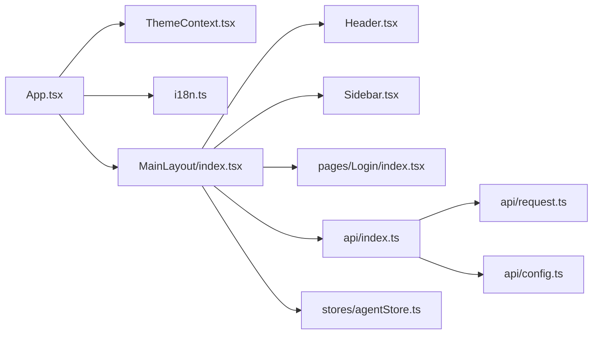

# 前端架构设计

<cite>
**本文档引用的文件**
- [console/src/main.tsx](file://console/src/main.tsx)
- [console/src/App.tsx](file://console/src/App.tsx)
- [console/src/i18n.ts](file://console/src/i18n.ts)
- [console/src/contexts/ThemeContext.tsx](file://console/src/contexts/ThemeContext.tsx)
- [console/src/layouts/MainLayout/index.tsx](file://console/src/layouts/MainLayout/index.tsx)
- [console/src/layouts/Header.tsx](file://console/src/layouts/Header.tsx)
- [console/src/layouts/Sidebar.tsx](file://console/src/layouts/Sidebar.tsx)
- [console/src/components/LanguageSwitcher.tsx](file://console/src/components/LanguageSwitcher.tsx)
- [console/src/components/ThemeToggleButton/index.tsx](file://console/src/components/ThemeToggleButton/index.tsx)
- [console/src/stores/agentStore.ts](file://console/src/stores/agentStore.ts)
- [console/src/pages/Login/index.tsx](file://console/src/pages/Login/index.tsx)
- [console/src/api/index.ts](file://console/src/api/index.ts)
- [console/src/api/request.ts](file://console/src/api/request.ts)
- [console/src/api/config.ts](file://console/src/api/config.ts)
- [console/vite.config.ts](file://console/vite.config.ts)
</cite>

## 目录
1. [引言](#引言)
2. [项目结构](#项目结构)
3. [核心组件](#核心组件)
4. [架构总览](#架构总览)
5. [详细组件分析](#详细组件分析)
6. [依赖分析](#依赖分析)
7. [性能考虑](#性能考虑)
8. [故障排查指南](#故障排查指南)
9. [结论](#结论)
10. [附录](#附录)

## 引言
本文件面向CoPaw前端控制台（console）的架构设计与实现，围绕React应用的整体架构、组件层次、状态管理、路由与布局、主题与国际化、API封装与认证、样式与响应式、以及构建与部署策略进行系统化说明。文档同时提供组件关系图与数据流示例，帮助开发者快速理解并扩展前端能力。

## 项目结构
控制台前端采用以功能域划分的目录组织方式：页面（pages）、布局（layouts）、组件（components）、API封装（api）、上下文（contexts）、状态存储（stores）、样式与国际化资源等。入口文件负责初始化国际化、全局样式与根渲染；应用层负责路由守卫、主题与语言切换、Ant Design主题注入；布局层负责侧边导航、头部工具栏与内容区域；API层统一请求封装与鉴权；状态层通过Zustand提供轻量状态管理；国际化与主题通过上下文与本地存储持久化。

图表来源
- [console/src/main.tsx:1-31](file://console/src/main.tsx#L1-L31)
- [console/src/App.tsx:1-171](file://console/src/App.tsx#L1-L171)
- [console/src/i18n.ts:1-32](file://console/src/i18n.ts#L1-L32)
- [console/src/contexts/ThemeContext.tsx:1-105](file://console/src/contexts/ThemeContext.tsx#L1-L105)
- [console/src/layouts/MainLayout/index.tsx:1-86](file://console/src/layouts/MainLayout/index.tsx#L1-L86)
- [console/src/layouts/Header.tsx:1-91](file://console/src/layouts/Header.tsx#L1-L91)
- [console/src/layouts/Sidebar.tsx:1-459](file://console/src/layouts/Sidebar.tsx#L1-L459)
- [console/src/pages/Login/index.tsx:1-152](file://console/src/pages/Login/index.tsx#L1-L152)
- [console/src/api/index.ts:1-85](file://console/src/api/index.ts#L1-L85)
- [console/src/api/request.ts:1-81](file://console/src/api/request.ts#L1-L81)
- [console/src/api/config.ts:1-42](file://console/src/api/config.ts#L1-L42)
- [console/src/stores/agentStore.ts:1-47](file://console/src/stores/agentStore.ts#L1-L47)

章节来源
- [console/src/main.tsx:1-31](file://console/src/main.tsx#L1-L31)
- [console/src/App.tsx:1-171](file://console/src/App.tsx#L1-L171)
- [console/src/i18n.ts:1-32](file://console/src/i18n.ts#L1-L32)
- [console/src/contexts/ThemeContext.tsx:1-105](file://console/src/contexts/ThemeContext.tsx#L1-L105)
- [console/src/layouts/MainLayout/index.tsx:1-86](file://console/src/layouts/MainLayout/index.tsx#L1-L86)
- [console/src/layouts/Header.tsx:1-91](file://console/src/layouts/Header.tsx#L1-L91)
- [console/src/layouts/Sidebar.tsx:1-459](file://console/src/layouts/Sidebar.tsx#L1-L459)
- [console/src/pages/Login/index.tsx:1-152](file://console/src/pages/Login/index.tsx#L1-L152)
- [console/src/api/index.ts:1-85](file://console/src/api/index.ts#L1-L85)
- [console/src/api/request.ts:1-81](file://console/src/api/request.ts#L1-L81)
- [console/src/api/config.ts:1-42](file://console/src/api/config.ts#L1-L42)
- [console/src/stores/agentStore.ts:1-47](file://console/src/stores/agentStore.ts#L1-L47)

## 核心组件
- 应用外壳与路由守卫：在应用外壳中注入Ant Design主题、国际化与全局样式，并通过路由守卫实现登录态校验与重定向。
- 主布局：组合侧边栏、头部工具栏与内容区，集中管理页面路由与选中项状态。
- 主题上下文：提供明/暗/系统三种模式，持久化用户偏好并通过媒体查询监听系统主题变化。
- 国际化：基于i18next，支持多语言资源加载与语言切换，自动同步Ant Design与dayjs的语言环境。
- API封装：统一请求头构建（含鉴权、内容类型、代理选择），统一错误处理（401清空令牌并跳转登录）。
- 登录页：根据后端认证状态决定注册或登录流程，成功后写入令牌并按重定向参数跳转。
- 状态管理：使用Zustand轻量状态存储代理列表与当前选中代理，持久化到localStorage。

章节来源
- [console/src/App.tsx:45-100](file://console/src/App.tsx#L45-L100)
- [console/src/layouts/MainLayout/index.tsx:45-86](file://console/src/layouts/MainLayout/index.tsx#L45-L86)
- [console/src/contexts/ThemeContext.tsx:51-100](file://console/src/contexts/ThemeContext.tsx#L51-L100)
- [console/src/i18n.ts:22-29](file://console/src/i18n.ts#L22-L29)
- [console/src/api/request.ts:39-81](file://console/src/api/request.ts#L39-L81)
- [console/src/pages/Login/index.tsx:9-31](file://console/src/pages/Login/index.tsx#L9-L31)
- [console/src/stores/agentStore.ts:15-46](file://console/src/stores/agentStore.ts#L15-L46)

## 架构总览
前端采用“入口 -> 应用外壳 -> 布局 -> 页面”的分层结构，配合API层与状态层，形成清晰的职责边界。路由守卫确保受保护页面的访问安全；主题与国际化在应用层统一注入；API层对fetch进行统一封装，减少重复逻辑；Zustand用于跨组件共享的代理选择状态。

图表来源
- [console/src/App.tsx:131-159](file://console/src/App.tsx#L131-L159)
- [console/src/layouts/MainLayout/index.tsx:50-84](file://console/src/layouts/MainLayout/index.tsx#L50-L84)
- [console/src/layouts/Header.tsx:28-90](file://console/src/layouts/Header.tsx#L28-L90)
- [console/src/layouts/Sidebar.tsx:100-459](file://console/src/layouts/Sidebar.tsx#L100-L459)
- [console/src/api/index.ts:26-81](file://console/src/api/index.ts#L26-L81)
- [console/src/stores/agentStore.ts:15-46](file://console/src/stores/agentStore.ts#L15-L46)

## 详细组件分析

### 路由与布局系统
- 路由守卫：在进入受保护路由前检查后端认证状态与本地令牌，未通过则重定向至登录页并携带redirect参数。
- 基座路径：根据当前路径判断是否启用子路径“/console”，保证嵌入式部署的一致性。
- 主布局：集中定义所有页面路由，将当前路径映射为侧边栏选中项，确保导航一致性。
- 头部工具栏：集成语言切换、主题切换、文档/FAQ/发布说明链接、GitHub跳转与代理选择器。
- 侧边菜单：按功能域分组，支持折叠、版本检测与更新提示弹窗，内置登出按钮（当后端启用认证时）。

图表来源
- [console/src/App.tsx:106-160](file://console/src/App.tsx#L106-L160)
- [console/src/layouts/MainLayout/index.tsx:45-86](file://console/src/layouts/MainLayout/index.tsx#L45-L86)
- [console/src/layouts/Sidebar.tsx:100-119](file://console/src/layouts/Sidebar.tsx#L100-L119)

章节来源
- [console/src/App.tsx:102-104](file://console/src/App.tsx#L102-L104)
- [console/src/App.tsx:146-156](file://console/src/App.tsx#L146-L156)
- [console/src/layouts/MainLayout/index.tsx:26-43](file://console/src/layouts/MainLayout/index.tsx#L26-L43)
- [console/src/layouts/Header.tsx:28-90](file://console/src/layouts/Header.tsx#L28-L90)
- [console/src/layouts/Sidebar.tsx:218-303](file://console/src/layouts/Sidebar.tsx#L218-L303)

### 主题切换机制
- 用户偏好：支持“浅色/深色/跟随系统”三种模式，优先从localStorage读取，否则默认“系统”。
- 实时切换：通过useTheme暴露toggleTheme与setThemeMode，内部计算isDark并更新<html>类名以驱动CSS变量覆盖。
- 系统监听：当模式为“系统”时，监听prefers-color-scheme变更，动态调整主题。
- 全局注入：在ConfigProvider中根据isDark选择算法，确保UI组件主题一致。

图表来源
- [console/src/contexts/ThemeContext.tsx:51-100](file://console/src/contexts/ThemeContext.tsx#L51-L100)

章节来源
- [console/src/contexts/ThemeContext.tsx:10-49](file://console/src/contexts/ThemeContext.tsx#L10-L49)
- [console/src/contexts/ThemeContext.tsx:79-91](file://console/src/contexts/ThemeContext.tsx#L79-L91)
- [console/src/App.tsx:134-145](file://console/src/App.tsx#L134-L145)

### 国际化支持
- 资源加载：i18next初始化时加载多语言资源，优先使用localStorage中的语言键值，回退到英语。
- 同步更新：监听languageChanged事件，动态设置Ant Design语言与dayjs语言，确保日期与组件文案一致。
- 语言切换器：下拉菜单支持四种语言，点击后更新i18n语言并持久化到localStorage。

图表来源
- [console/src/i18n.ts:22-29](file://console/src/i18n.ts#L22-L29)
- [console/src/App.tsx:115-129](file://console/src/App.tsx#L115-L129)
- [console/src/components/LanguageSwitcher.tsx:6-58](file://console/src/components/LanguageSwitcher.tsx#L6-L58)

章节来源
- [console/src/i18n.ts:1-32](file://console/src/i18n.ts#L1-L32)
- [console/src/components/LanguageSwitcher.tsx:1-59](file://console/src/components/LanguageSwitcher.tsx#L1-L59)

### API客户端封装与认证管理
- 请求封装：统一构建请求头（方法为POST/PUT/PATCH时默认JSON，自动附加Authorization与X-Agent-Id），调用fetch并处理非2xx与204/非JSON响应。
- 鉴权流程：登录/注册成功后写入localStorage令牌；请求401时清除令牌并跳转登录；应用启动时验证后端认证状态与本地令牌有效性。
- 配置管理：BASE_URL与TOKEN通过Vite define注入，支持同源或跨域部署；getApiUrl自动拼接“/api”前缀。

图表来源
- [console/src/api/request.ts:39-81](file://console/src/api/request.ts#L39-L81)
- [console/src/api/config.ts:11-42](file://console/src/api/config.ts#L11-L42)
- [console/src/App.tsx:50-89](file://console/src/App.tsx#L50-L89)

章节来源
- [console/src/api/request.ts:1-81](file://console/src/api/request.ts#L1-L81)
- [console/src/api/config.ts:1-42](file://console/src/api/config.ts#L1-L42)
- [console/src/pages/Login/index.tsx:33-68](file://console/src/pages/Login/index.tsx#L33-L68)

### 状态管理模式
- 代理选择状态：使用Zustand创建带persist中间件的状态存储，包含选中代理ID与代理列表，提供增删改查操作。
- 代理头传递：request.ts从localStorage读取当前选中代理ID并写入X-Agent-Id请求头，实现多代理场景下的请求路由。

图表来源
- [console/src/stores/agentStore.ts:5-46](file://console/src/stores/agentStore.ts#L5-L46)
- [console/src/api/request.ts:22-34](file://console/src/api/request.ts#L22-L34)

章节来源
- [console/src/stores/agentStore.ts:1-47](file://console/src/stores/agentStore.ts#L1-L47)
- [console/src/api/request.ts:22-34](file://console/src/api/request.ts#L22-L34)

### 错误处理与用户体验
- 控制台日志净化：在入口处屏蔽特定伪类与潜在不安全提示的控制台警告，避免干扰用户。
- 登录页消息反馈：使用Ant Design的消息组件展示注册/登录成功、失败与未启用认证提示。
- 版本更新提示：侧边栏异步获取PyPI最新稳定版本，超过一小时后显示更新徽章，点击弹窗展示更新说明。

章节来源
- [console/src/main.tsx:5-28](file://console/src/main.tsx#L5-L28)
- [console/src/pages/Login/index.tsx:57-68](file://console/src/pages/Login/index.tsx#L57-L68)
- [console/src/layouts/Sidebar.tsx:132-179](file://console/src/layouts/Sidebar.tsx#L132-L179)

### 样式系统与响应式设计
- Ant Design主题：通过ConfigProvider注入bailian主题与自定义算法，prefixCls统一为“copaw”，适配暗/亮主题。
- 全局样式：重置基础样式，确保跨浏览器一致性。
- CSS Modules：Vite配置启用CSS Modules驼峰命名与哈希生成，避免样式冲突。
- 响应式：侧边栏支持折叠，头部工具栏在窄屏下仍保持可用性；图片与卡片采用相对路径与弹性布局。

章节来源
- [console/src/App.tsx:38-43](file://console/src/App.tsx#L38-L43)
- [console/src/App.tsx:134-145](file://console/src/App.tsx#L134-L145)
- [console/vite.config.ts:17-26](file://console/vite.config.ts#L17-L26)

### 构建配置与部署策略
- Vite配置：通过define注入BASE_URL与TOKEN，LESS启用javascriptEnabled，路径别名@指向src，开发服务器host与端口可配置。
- 开发环境：本地运行于0.0.0.0:5173，支持热更新与源码映射。
- 构建输出：注释掉的构建目标指向后端console目录，便于打包后直接嵌入后端分发包。

章节来源
- [console/vite.config.ts:5-47](file://console/vite.config.ts#L5-L47)

## 依赖分析
- 组件耦合：主布局对侧边栏与头部存在直接依赖；页面组件通过API模块与状态存储间接依赖配置与主题上下文。
- 外部依赖：Ant Design、i18next、dayjs、Zustand、react-router-dom、less等。
- 循环依赖：当前结构未发现循环导入；API模块通过index聚合导出，避免深层依赖链。

图表来源
- [console/src/App.tsx:1-171](file://console/src/App.tsx#L1-L171)
- [console/src/layouts/MainLayout/index.tsx:1-86](file://console/src/layouts/MainLayout/index.tsx#L1-L86)
- [console/src/api/index.ts:1-85](file://console/src/api/index.ts#L1-L85)

## 性能考虑
- 路由守卫异步：认证检查在首次渲染后执行，避免阻塞首屏；建议对频繁访问的静态资源启用缓存与预加载。
- 图片与图标：侧边栏Logo使用相对路径，建议在CDN或内嵌Base64以减少HTTP请求数。
- 状态持久化：Zustand持久化仅保存必要字段，避免存储过大数据；代理列表按需加载。
- 国际化：资源一次性加载，建议按需懒加载或拆分语言包以降低初始体积。
- 构建优化：开启CSS Modules与哈希命名，减少样式冲突；生产环境启用压缩与Tree Shaking。

## 故障排查指南
- 登录后仍被重定向到登录页
  - 检查后端认证状态与本地令牌是否正确写入；确认BASE_URL与TOKEN配置。
  - 参考路径：[console/src/pages/Login/index.tsx:33-68](file://console/src/pages/Login/index.tsx#L33-L68)，[console/src/api/config.ts:23-27](file://console/src/api/config.ts#L23-L27)
- 请求401并自动跳转登录
  - 确认Authorization头是否正确附加；检查令牌是否过期或被清理。
  - 参考路径：[console/src/api/request.ts:52-60](file://console/src/api/request.ts#L52-L60)
- 主题切换无效或闪烁
  - 检查<html>类名是否正确添加/移除；确认系统主题监听是否生效。
  - 参考路径：[console/src/contexts/ThemeContext.tsx:58-65](file://console/src/contexts/ThemeContext.tsx#L58-L65)，[console/src/contexts/ThemeContext.tsx:68-77](file://console/src/contexts/ThemeContext.tsx#L68-L77)
- 语言切换后组件未刷新
  - 确认languageChanged事件是否触发；Ant Design与dayjs语言是否同步更新。
  - 参考路径：[console/src/App.tsx:115-129](file://console/src/App.tsx#L115-L129)，[console/src/i18n.ts:22-29](file://console/src/i18n.ts#L22-L29)
- 代理选择未生效
  - 检查localStorage中copaw-agent-storage是否存在且包含selectedAgent；确认请求头X-Agent-Id是否携带。
  - 参考路径：[console/src/api/request.ts:22-34](file://console/src/api/request.ts#L22-L34)，[console/src/stores/agentStore.ts:43](file://console/src/stores/agentStore.ts#L43)

## 结论
CoPaw前端控制台采用清晰的分层架构与模块化设计，结合路由守卫、主题与国际化、统一API封装与轻量状态管理，实现了高内聚低耦合的前端体系。通过合理的构建配置与部署策略，可在多种运行环境中稳定交付。后续可进一步优化国际化按需加载、代理状态的增量更新与缓存策略，以及引入更细粒度的错误边界与监控埋点。

## 附录
- 关键实现路径索引
  - 应用入口与初始化：[console/src/main.tsx:1-31](file://console/src/main.tsx#L1-L31)
  - 应用外壳与路由守卫：[console/src/App.tsx:106-160](file://console/src/App.tsx#L106-L160)
  - 主布局与路由映射：[console/src/layouts/MainLayout/index.tsx:45-86](file://console/src/layouts/MainLayout/index.tsx#L45-L86)
  - 主题上下文与切换：[console/src/contexts/ThemeContext.tsx:51-100](file://console/src/contexts/ThemeContext.tsx#L51-L100)
  - 国际化配置与切换器：[console/src/i18n.ts:22-29](file://console/src/i18n.ts#L22-L29)，[console/src/components/LanguageSwitcher.tsx:6-58](file://console/src/components/LanguageSwitcher.tsx#L6-L58)
  - API封装与鉴权：[console/src/api/request.ts:39-81](file://console/src/api/request.ts#L39-L81)，[console/src/api/config.ts:11-42](file://console/src/api/config.ts#L11-L42)
  - 登录页与重定向：[console/src/pages/Login/index.tsx:9-31](file://console/src/pages/Login/index.tsx#L9-L31)
  - 代理状态与请求头：[console/src/stores/agentStore.ts:15-46](file://console/src/stores/agentStore.ts#L15-L46)，[console/src/api/request.ts:22-34](file://console/src/api/request.ts#L22-L34)
  - 构建与开发配置：[console/vite.config.ts:5-47](file://console/vite.config.ts#L5-L47)