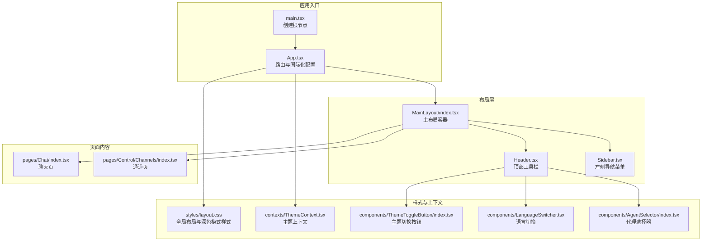
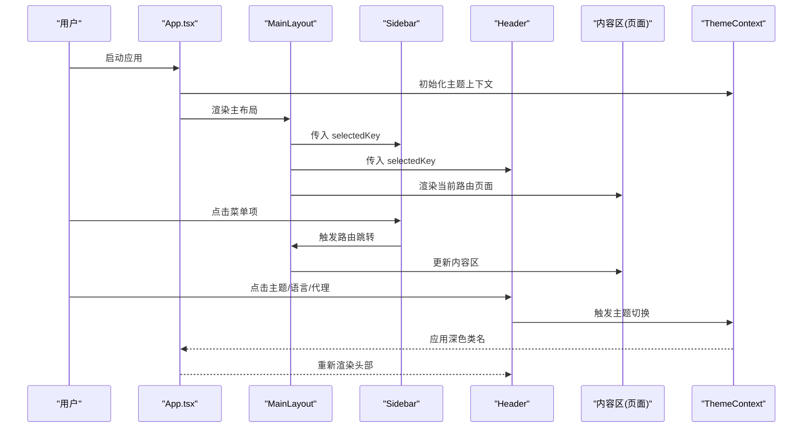
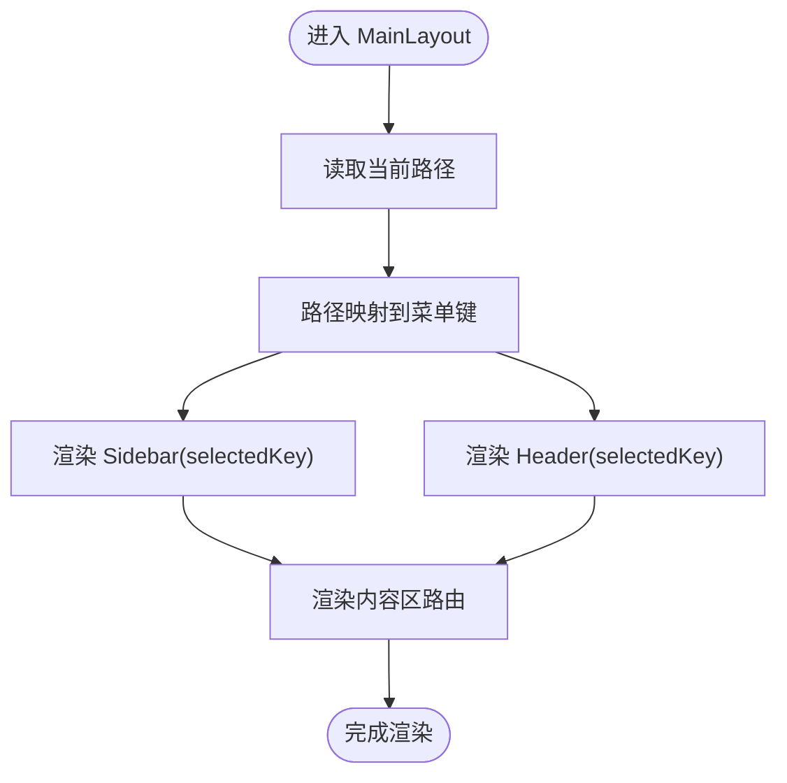
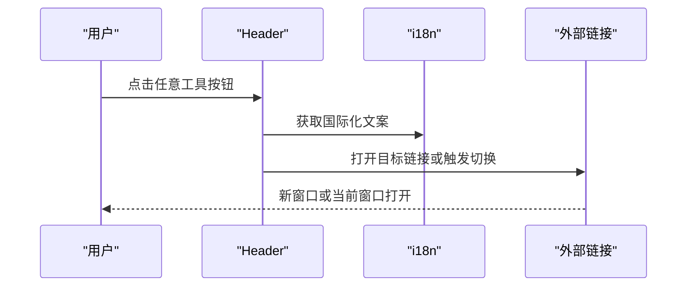
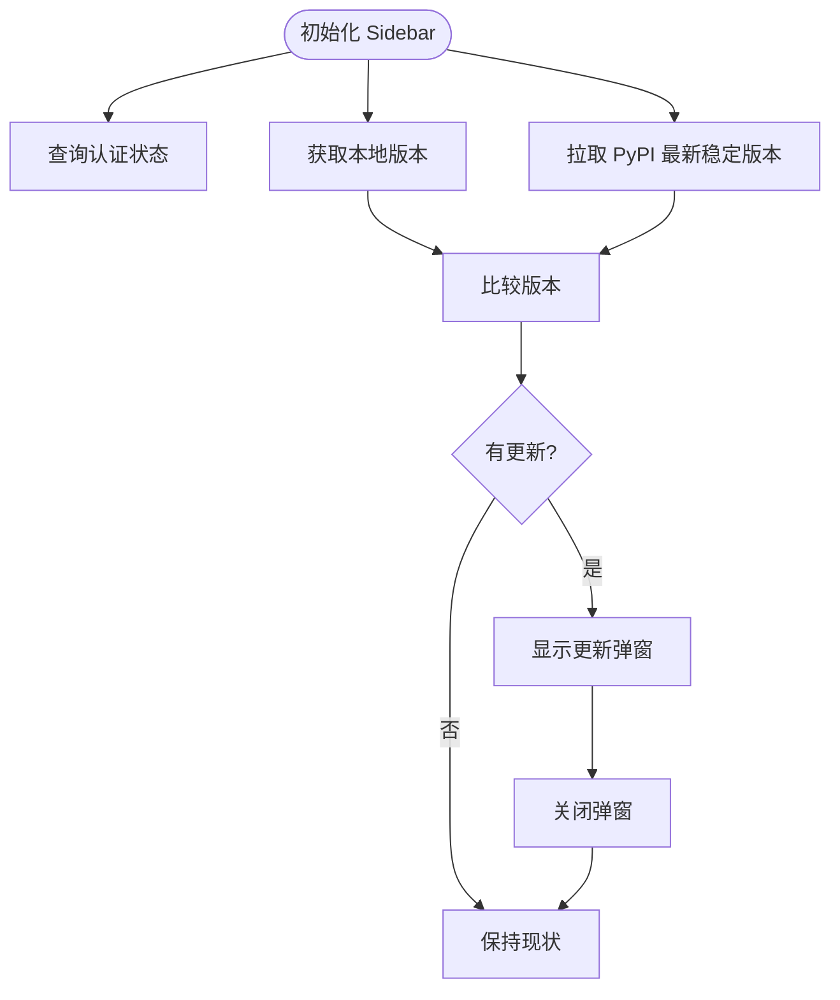
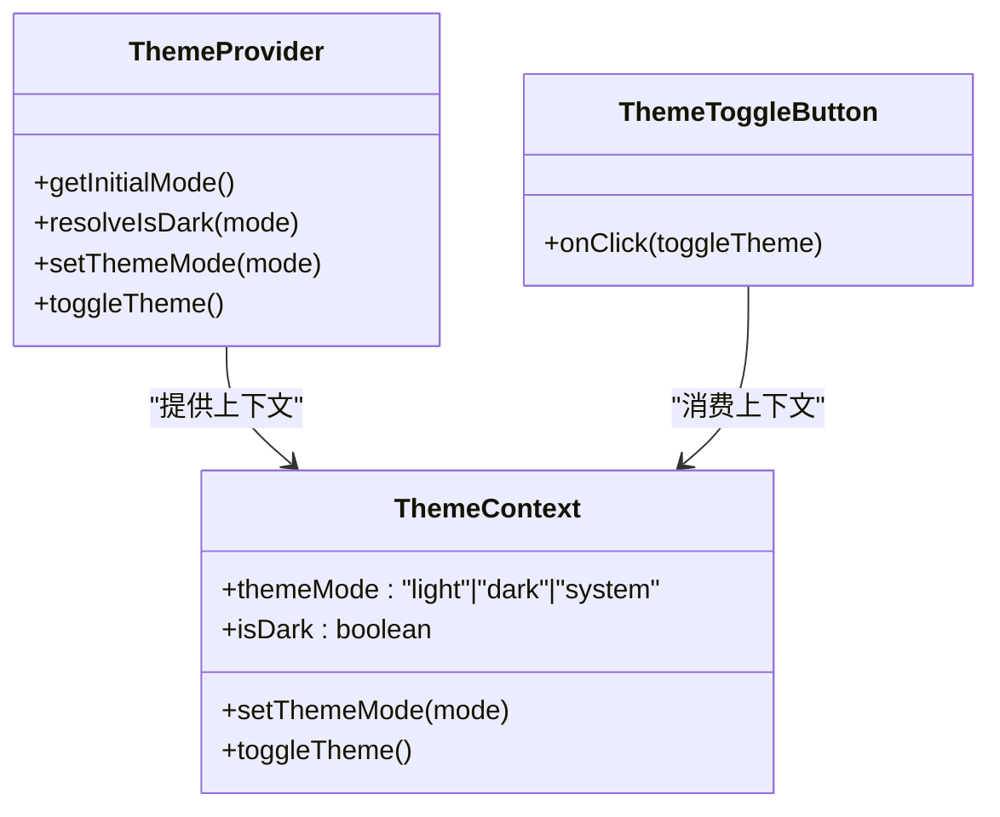
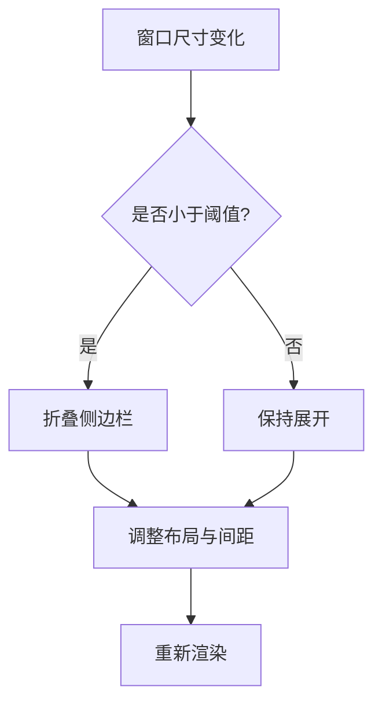
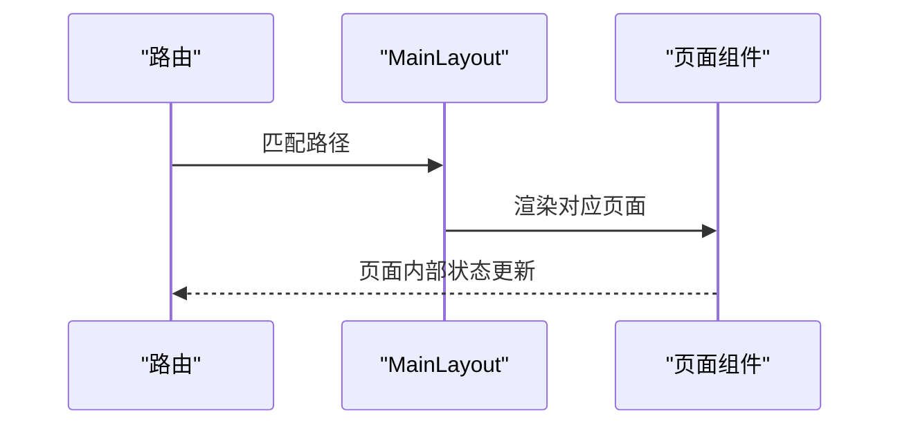
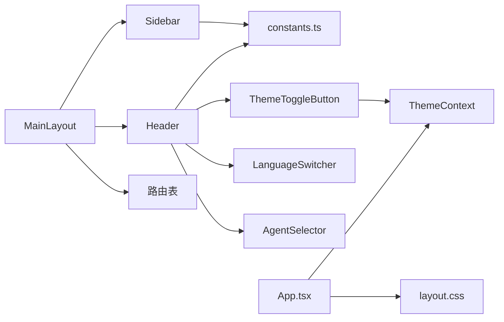

# 布局系统

<cite>
**本文档引用的文件**
- [console/src/layouts/MainLayout/index.tsx](file://console/src/layouts/MainLayout/index.tsx)
- [console/src/layouts/Header.tsx](file://console/src/layouts/Header.tsx)
- [console/src/layouts/Sidebar.tsx](file://console/src/layouts/Sidebar.tsx)
- [console/src/layouts/constants.ts](file://console/src/layouts/constants.ts)
- [console/src/styles/layout.css](file://console/src/styles/layout.css)
- [console/src/components/ThemeToggleButton/index.tsx](file://console/src/components/ThemeToggleButton/index.tsx)
- [console/src/contexts/ThemeContext.tsx](file://console/src/contexts/ThemeContext.tsx)
- [console/src/App.tsx](file://console/src/App.tsx)
- [console/src/main.tsx](file://console/src/main.tsx)
- [console/src/components/LanguageSwitcher.tsx](file://console/src/components/LanguageSwitcher.tsx)
- [console/src/components/AgentSelector/index.tsx](file://console/src/components/AgentSelector/index.tsx)
- [console/src/pages/Chat/index.tsx](file://console/src/pages/Chat/index.tsx)
- [console/src/pages/Control/Channels/index.tsx](file://console/src/pages/Control/Channels/index.tsx)
</cite>

## 目录
1. [简介](#简介)
2. [项目结构](#项目结构)
3. [核心组件](#核心组件)
4. [架构总览](#架构总览)
5. [详细组件分析](#详细组件分析)
6. [依赖分析](#依赖分析)
7. [性能考虑](#性能考虑)
8. [故障排除指南](#故障排除指南)
9. [结论](#结论)
10. [附录](#附录)

## 简介
本文件系统性地文档化 CoPaw 控制台前端的布局系统，重点覆盖主布局组件的设计理念、响应式布局实现与导航结构；详细说明头部组件、侧边栏组件与内容区域的协作机制；文档化布局断点、主题切换集成与移动端适配策略；涵盖布局组件属性、事件处理与状态管理；并提供布局组件关系图与响应式设计示例。

## 项目结构
控制台布局系统位于 console/src/layouts 目录下，采用“主布局 + 头部 + 侧边栏”的三层嵌套结构，并通过路由在内容区渲染不同页面。全局样式通过 layout.css 统一约束 Ant Design 与自定义组件在深色模式下的表现。主题切换通过 ThemeContext 提供，语言切换由 LanguageSwitcher 组件提供，AgentSelector 在头部展示当前工作空间代理。

**图表来源**
- [console/src/main.tsx:1-31](file://console/src/main.tsx#L1-L31)
- [console/src/App.tsx:1-171](file://console/src/App.tsx#L1-L171)
- [console/src/layouts/MainLayout/index.tsx:1-86](file://console/src/layouts/MainLayout/index.tsx#L1-L86)
- [console/src/layouts/Header.tsx:1-91](file://console/src/layouts/Header.tsx#L1-L91)
- [console/src/layouts/Sidebar.tsx:1-459](file://console/src/layouts/Sidebar.tsx#L1-L459)
- [console/src/styles/layout.css:1-740](file://console/src/styles/layout.css#L1-L740)
- [console/src/contexts/ThemeContext.tsx:1-105](file://console/src/contexts/ThemeContext.tsx#L1-L105)
- [console/src/components/ThemeToggleButton/index.tsx:1-29](file://console/src/components/ThemeToggleButton/index.tsx#L1-L29)
- [console/src/components/LanguageSwitcher.tsx:1-59](file://console/src/components/LanguageSwitcher.tsx#L1-L59)
- [console/src/components/AgentSelector/index.tsx:1-101](file://console/src/components/AgentSelector/index.tsx#L1-L101)
- [console/src/pages/Chat/index.tsx:1-200](file://console/src/pages/Chat/index.tsx#L1-L200)
- [console/src/pages/Control/Channels/index.tsx:1-167](file://console/src/pages/Control/Channels/index.tsx#L1-L167)

**章节来源**
- [console/src/main.tsx:1-31](file://console/src/main.tsx#L1-L31)
- [console/src/App.tsx:1-171](file://console/src/App.tsx#L1-L171)
- [console/src/layouts/MainLayout/index.tsx:1-86](file://console/src/layouts/MainLayout/index.tsx#L1-L86)
- [console/src/styles/layout.css:1-740](file://console/src/styles/layout.css#L1-L740)

## 核心组件
- 主布局容器（MainLayout）
  - 负责组织侧边栏、头部与内容区域，维护当前路径到菜单项的映射，驱动路由渲染。
  - 关键职责：路由匹配、菜单选中态、内容区容器。
- 头部组件（Header）
  - 展示当前页面标题（基于 i18n），提供文档、变更日志、FAQ、GitHub 导航链接，集成语言切换与主题切换。
  - 关键职责：国际化标题、外部链接打开、工具按钮集合。
- 侧边栏组件（Sidebar）
  - 内置多组导航菜单（聊天、控制、智能体、设置），支持折叠、分组展开、版本检查与更新提示。
  - 关键职责：菜单渲染、路由跳转、版本检测、登出处理、更新弹窗。
- 常量与导航（constants.ts）
  - 定义默认展开组、路径到菜单键的映射、国际化标签映射、版本比较与更新文案等。
- 全局样式（layout.css）
  - 统一 Ant Design 与自定义组件在深色模式下的外观，约束布局高度、滚动与容器尺寸。
- 主题上下文（ThemeContext）
  - 提供 light/dark/system 三种模式，持久化用户偏好，监听系统主题变化，向全局注入 dark-mode 类名。
- 主题切换按钮（ThemeToggleButton）
  - 基于 ThemeContext 切换主题，显示当前模式名称与图标。
- 语言切换（LanguageSwitcher）
  - 支持多语言切换，持久化语言选择。
- 代理选择器（AgentSelector）
  - 展示与切换当前工作空间代理，提供代理数量徽标与成功提示。

**章节来源**
- [console/src/layouts/MainLayout/index.tsx:1-86](file://console/src/layouts/MainLayout/index.tsx#L1-L86)
- [console/src/layouts/Header.tsx:1-91](file://console/src/layouts/Header.tsx#L1-L91)
- [console/src/layouts/Sidebar.tsx:1-459](file://console/src/layouts/Sidebar.tsx#L1-L459)
- [console/src/layouts/constants.ts:1-186](file://console/src/layouts/constants.ts#L1-L186)
- [console/src/styles/layout.css:1-740](file://console/src/styles/layout.css#L1-L740)
- [console/src/contexts/ThemeContext.tsx:1-105](file://console/src/contexts/ThemeContext.tsx#L1-L105)
- [console/src/components/ThemeToggleButton/index.tsx:1-29](file://console/src/components/ThemeToggleButton/index.tsx#L1-L29)
- [console/src/components/LanguageSwitcher.tsx:1-59](file://console/src/components/LanguageSwitcher.tsx#L1-L59)
- [console/src/components/AgentSelector/index.tsx:1-101](file://console/src/components/AgentSelector/index.tsx#L1-L101)

## 架构总览
布局系统采用“容器-组件”分层设计，主布局作为容器协调侧边栏与头部，内容区通过路由按需渲染页面组件。主题与语言通过上下文与组件注入全局，样式通过全局 CSS 与 Ant Design 的 ConfigProvider 配置统一风格。

**图表来源**
- [console/src/App.tsx:106-160](file://console/src/App.tsx#L106-L160)
- [console/src/layouts/MainLayout/index.tsx:45-84](file://console/src/layouts/MainLayout/index.tsx#L45-L84)
- [console/src/layouts/Sidebar.tsx:356-367](file://console/src/layouts/Sidebar.tsx#L356-L367)
- [console/src/layouts/Header.tsx:28-90](file://console/src/layouts/Header.tsx#L28-L90)
- [console/src/contexts/ThemeContext.tsx:51-100](file://console/src/contexts/ThemeContext.tsx#L51-L100)

## 详细组件分析

### 主布局组件（MainLayout）
- 设计理念
  - 以 Ant Design Layout 为基础，左侧固定宽度侧边栏，右侧为自适应内容区；头部与侧边栏联动，保持一致的选中态。
  - 使用路由表集中管理页面映射，简化新增页面时的维护成本。
- 响应式与导航
  - 通过 selectedKey 将当前路径映射到菜单键，确保菜单高亮与标题同步。
  - 路由表覆盖聊天、控制、智能体、设置等模块，保证导航一致性。
- 协作机制
  - Header 与 Sidebar 接收来自 MainLayout 的 selectedKey，分别用于标题与菜单选中态。
  - 内容区通过 Routes 动态渲染对应页面组件。

**图表来源**
- [console/src/layouts/MainLayout/index.tsx:26-48](file://console/src/layouts/MainLayout/index.tsx#L26-L48)
- [console/src/layouts/MainLayout/index.tsx:50-84](file://console/src/layouts/MainLayout/index.tsx#L50-L84)

**章节来源**
- [console/src/layouts/MainLayout/index.tsx:1-86](file://console/src/layouts/MainLayout/index.tsx#L1-L86)

### 头部组件（Header）
- 组件属性
  - selectedKey: 当前选中的菜单键，用于动态生成标题文本。
- 事件处理
  - 外部链接点击：优先通过 pywebview API 打开，否则回退到新窗口。
  - 工具按钮：文档、变更日志、FAQ、GitHub、语言切换、主题切换。
- 国际化与标题
  - 通过 KEY_TO_LABEL 将菜单键映射到 i18n 键，实现标题随语言与选中项动态变化。

**图表来源**
- [console/src/layouts/Header.tsx:28-90](file://console/src/layouts/Header.tsx#L28-L90)
- [console/src/layouts/constants.ts:39-55](file://console/src/layouts/constants.ts#L39-L55)

**章节来源**
- [console/src/layouts/Header.tsx:1-91](file://console/src/layouts/Header.tsx#L1-L91)
- [console/src/layouts/constants.ts:1-186](file://console/src/layouts/constants.ts#L1-L186)

### 侧边栏组件（Sidebar）
- 组件属性
  - selectedKey: 用于高亮当前菜单项。
- 事件处理
  - 菜单点击：根据 KEY_TO_PATH 映射进行路由跳转。
  - 折叠切换：控制侧边栏宽度与图标。
  - 登出：清除认证令牌并跳转登录页。
  - 版本更新：拉取 PyPI 最新稳定版本，对比本地版本并在满足条件时显示更新弹窗。
- 状态管理
  - openKeys: 默认展开组，受折叠状态影响。
  - 版本信息：本地版本与远端最新版本，用于更新提示。
  - 更新弹窗：异步加载更新说明，支持复制代码块。

**图表来源**
- [console/src/layouts/Sidebar.tsx:114-179](file://console/src/layouts/Sidebar.tsx#L114-L179)
- [console/src/layouts/constants.ts:73-94](file://console/src/layouts/constants.ts#L73-L94)

**章节来源**
- [console/src/layouts/Sidebar.tsx:1-459](file://console/src/layouts/Sidebar.tsx#L1-L459)
- [console/src/layouts/constants.ts:1-186](file://console/src/layouts/constants.ts#L1-L186)

### 主题切换与深色模式
- 主题上下文
  - 支持 light/dark/system 三种模式，持久化到 localStorage；当模式为 system 时监听系统主题变化。
  - 通过向 <html> 添加/移除 dark-mode 类名，全局生效 layout.css 中的深色模式规则。
- 按钮组件
  - ThemeToggleButton 基于上下文切换主题，显示当前模式名称与图标。
- Ant Design 主题
  - App.tsx 中通过 ConfigProvider 设置算法为暗色或默认算法，确保组件库主题一致。

**图表来源**
- [console/src/contexts/ThemeContext.tsx:1-105](file://console/src/contexts/ThemeContext.tsx#L1-L105)
- [console/src/components/ThemeToggleButton/index.tsx:1-29](file://console/src/components/ThemeToggleButton/index.tsx#L1-L29)
- [console/src/App.tsx:134-144](file://console/src/App.tsx#L134-L144)

**章节来源**
- [console/src/contexts/ThemeContext.tsx:1-105](file://console/src/contexts/ThemeContext.tsx#L1-L105)
- [console/src/components/ThemeToggleButton/index.tsx:1-29](file://console/src/components/ThemeToggleButton/index.tsx#L1-L29)
- [console/src/App.tsx:134-144](file://console/src/App.tsx#L134-L144)

### 响应式布局与移动端适配
- 布局断点
  - 侧边栏宽度固定为 275px，折叠后仅保留图标与按钮区域，适合窄屏设备。
  - 通过 collapseBtn 实现一键折叠，避免移动端拥挤。
- 滚动与高度
  - 全局样式限制 html/body 高度与溢出，Ant Design Layout 高度约束与滚动交由 page-container 与 page-content 分层处理。
- 移动端策略
  - 建议在更窄屏幕下优先使用折叠状态；若需要进一步优化，可在样式层增加媒体查询以调整字体大小、内边距与按钮尺寸。

**图表来源**
- [console/src/layouts/Sidebar.tsx:308-354](file://console/src/layouts/Sidebar.tsx#L308-L354)
- [console/src/styles/layout.css:661-740](file://console/src/styles/layout.css#L661-L740)

**章节来源**
- [console/src/layouts/Sidebar.tsx:1-459](file://console/src/layouts/Sidebar.tsx#L1-L459)
- [console/src/styles/layout.css:1-740](file://console/src/styles/layout.css#L1-L740)

### 页面内容与路由协作
- 路由表
  - MainLayout 内部集中定义所有页面路由，包括聊天、控制、智能体与设置等模块。
- 页面示例
  - Chat 页面：集成运行时 UI、消息流处理、模型选择与会话管理。
  - Channels 页面：通道卡片列表、筛选与抽屉配置，演示内容区复杂交互。

**图表来源**
- [console/src/layouts/MainLayout/index.tsx:58-79](file://console/src/layouts/MainLayout/index.tsx#L58-L79)
- [console/src/pages/Chat/index.tsx:1-200](file://console/src/pages/Chat/index.tsx#L1-L200)
- [console/src/pages/Control/Channels/index.tsx:1-167](file://console/src/pages/Control/Channels/index.tsx#L1-L167)

**章节来源**
- [console/src/layouts/MainLayout/index.tsx:1-86](file://console/src/layouts/MainLayout/index.tsx#L1-L86)
- [console/src/pages/Chat/index.tsx:1-200](file://console/src/pages/Chat/index.tsx#L1-L200)
- [console/src/pages/Control/Channels/index.tsx:1-167](file://console/src/pages/Control/Channels/index.tsx#L1-L167)

## 依赖分析
- 组件耦合
  - MainLayout 与 Header/Sidebar 弱耦合，通过 selectedKey 传递状态；内容区通过路由解耦。
  - Sidebar 与 constants.ts 存在强耦合（KEY_TO_PATH、DEFAULT_OPEN_KEYS）。
  - Header 与 constants.ts 存在强耦合（KEY_TO_LABEL、URL 帮助函数）。
- 外部依赖
  - Ant Design Layout/Menu/ConfigProvider 提供布局与主题能力。
  - react-router-dom 提供路由与导航。
  - @agentscope-ai/design 提供定制组件与主题算法。
- 循环依赖
  - 未发现循环导入；各组件通过常量文件与上下文进行松耦合通信。

**图表来源**
- [console/src/layouts/MainLayout/index.tsx:1-86](file://console/src/layouts/MainLayout/index.tsx#L1-L86)
- [console/src/layouts/Header.tsx:1-91](file://console/src/layouts/Header.tsx#L1-L91)
- [console/src/layouts/Sidebar.tsx:1-459](file://console/src/layouts/Sidebar.tsx#L1-L459)
- [console/src/layouts/constants.ts:1-186](file://console/src/layouts/constants.ts#L1-L186)
- [console/src/contexts/ThemeContext.tsx:1-105](file://console/src/contexts/ThemeContext.tsx#L1-L105)
- [console/src/components/ThemeToggleButton/index.tsx:1-29](file://console/src/components/ThemeToggleButton/index.tsx#L1-L29)
- [console/src/components/LanguageSwitcher.tsx:1-59](file://console/src/components/LanguageSwitcher.tsx#L1-L59)
- [console/src/components/AgentSelector/index.tsx:1-101](file://console/src/components/AgentSelector/index.tsx#L1-L101)
- [console/src/styles/layout.css:1-740](file://console/src/styles/layout.css#L1-L740)
- [console/src/App.tsx:1-171](file://console/src/App.tsx#L1-L171)

**章节来源**
- [console/src/layouts/MainLayout/index.tsx:1-86](file://console/src/layouts/MainLayout/index.tsx#L1-L86)
- [console/src/layouts/constants.ts:1-186](file://console/src/layouts/constants.ts#L1-L186)
- [console/src/contexts/ThemeContext.tsx:1-105](file://console/src/contexts/ThemeContext.tsx#L1-L105)

## 性能考虑
- 路由懒加载
  - 可将页面组件改为动态导入以减少首屏体积，提升启动速度。
- 主题切换
  - ThemeContext 使用 localStorage 缓存用户偏好，避免每次刷新重算；系统模式监听仅在 mode 为 system 时启用。
- 侧边栏渲染
  - 菜单项按组展开，避免一次性渲染大量子项；折叠状态下仅渲染必要元素。
- 样式
  - 全局样式集中管理，避免重复注入；深色模式通过类名切换，减少内联样式的计算。

## 故障排除指南
- 主题不生效
  - 检查 <html> 是否存在 dark-mode 类名；确认 ThemeContext 的 setThemeMode 是否正确写入 localStorage。
- 外部链接无法打开
  - 若无 pywebview 环境，Header 将回退到 window.open；请确认浏览器未拦截弹窗。
- 菜单选中异常
  - 确认 selectedKey 来源于当前路径映射；检查 constants.ts 中 KEY_TO_LABEL 与 KEY_TO_PATH 是否匹配。
- 登录状态失效
  - 登出流程会清除认证令牌并跳转登录页；如频繁跳转，请检查认证接口与令牌存储。

**章节来源**
- [console/src/contexts/ThemeContext.tsx:51-100](file://console/src/contexts/ThemeContext.tsx#L51-L100)
- [console/src/layouts/Header.tsx:28-40](file://console/src/layouts/Header.tsx#L28-L40)
- [console/src/layouts/constants.ts:20-55](file://console/src/layouts/constants.ts#L20-L55)
- [console/src/layouts/Sidebar.tsx:374-378](file://console/src/layouts/Sidebar.tsx#L374-L378)

## 结论
CoPaw 布局系统以清晰的分层与弱耦合设计实现了稳定的桌面端控制台体验。主布局容器、头部与侧边栏协同工作，结合路由与上下文，提供了良好的可扩展性与可维护性。通过全局样式与主题上下文，系统在深色模式下具备一致的视觉体验；通过常量与路由表，导航与国际化得到统一管理。建议后续引入路由懒加载与媒体查询以进一步优化性能与移动端体验。

## 附录
- 常用属性与事件速览
  - MainLayout
    - 属性：无（通过路由与上下文驱动）
    - 事件：无（依赖路由与上下文）
  - Header
    - 属性：selectedKey
    - 事件：导航按钮点击、语言切换、主题切换
  - Sidebar
    - 属性：selectedKey
    - 事件：菜单点击、折叠切换、登出、更新弹窗
  - ThemeContext
    - 属性：themeMode, isDark
    - 方法：setThemeMode(), toggleTheme()
  - ThemeToggleButton
    - 属性：无
    - 事件：点击切换主题
  - LanguageSwitcher
    - 属性：无
    - 事件：点击切换语言
  - AgentSelector
    - 属性：无
    - 事件：选择代理、加载失败提示