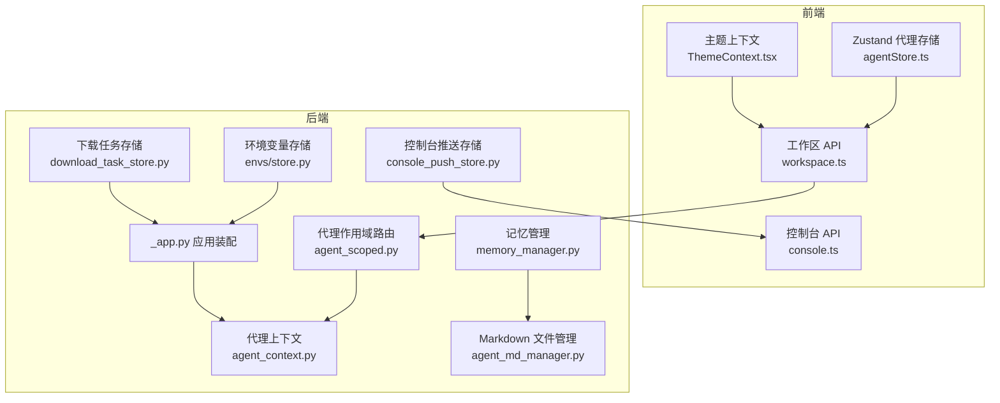
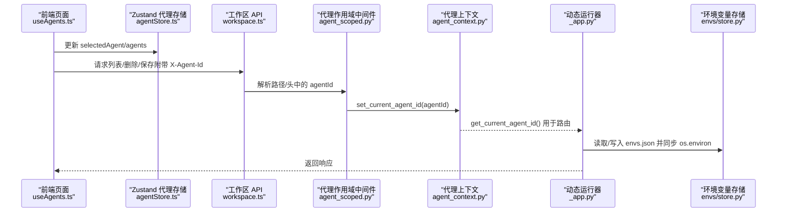
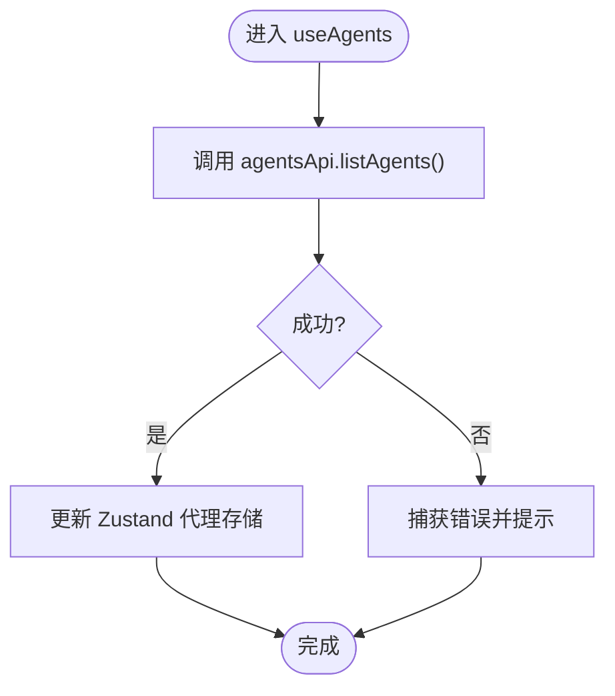
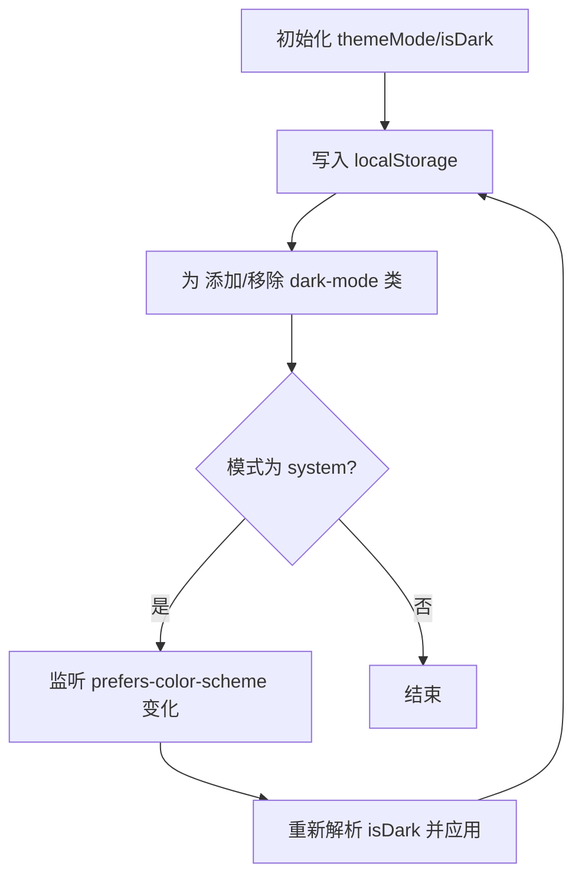
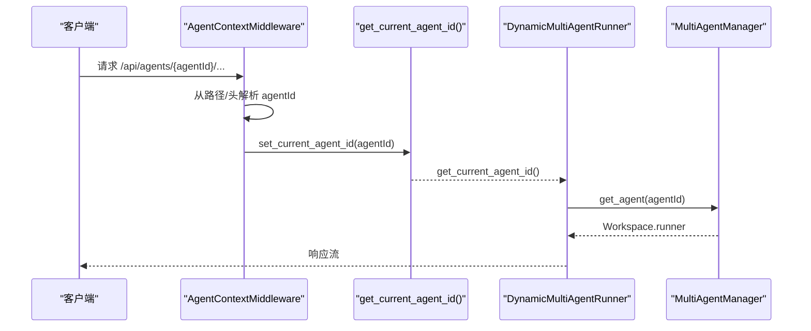
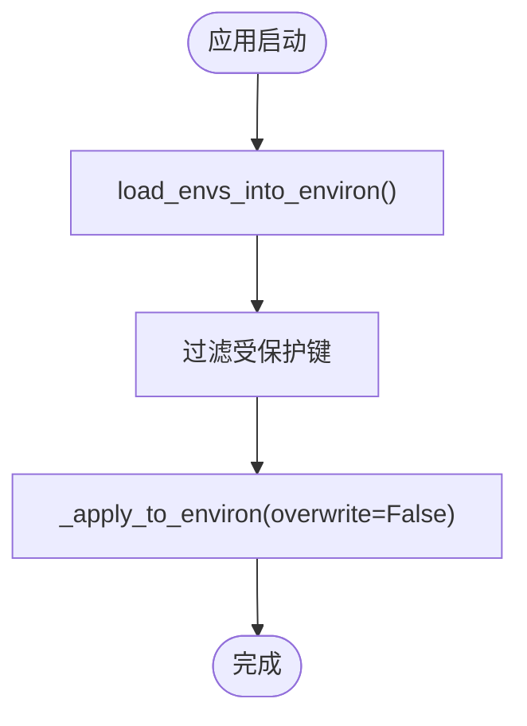
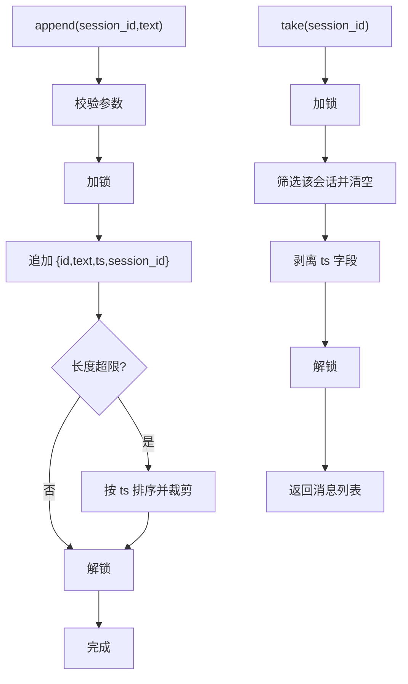
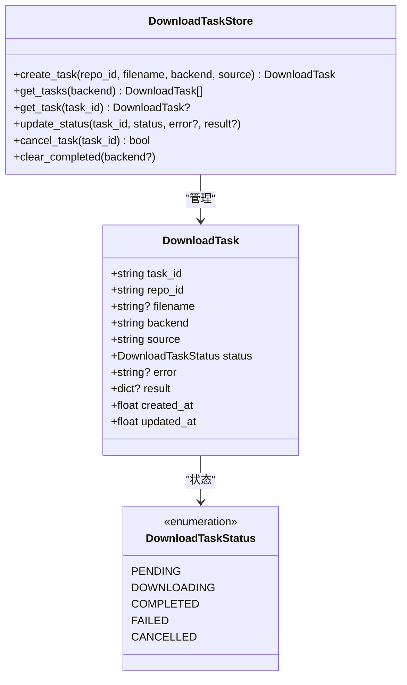
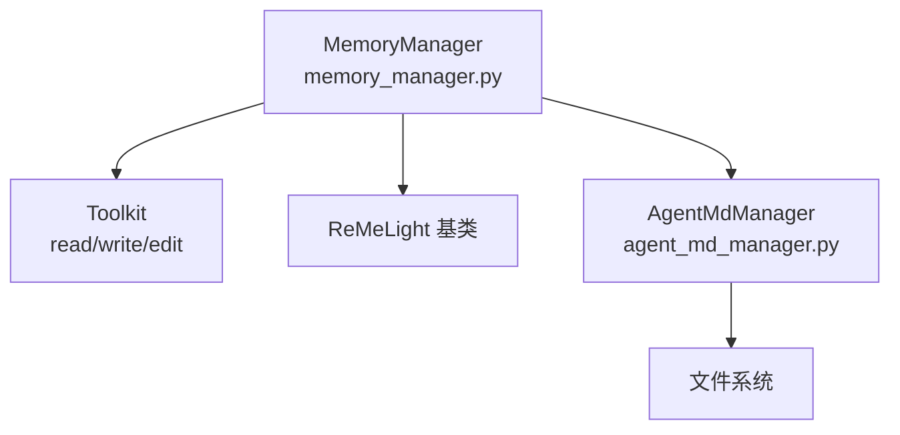
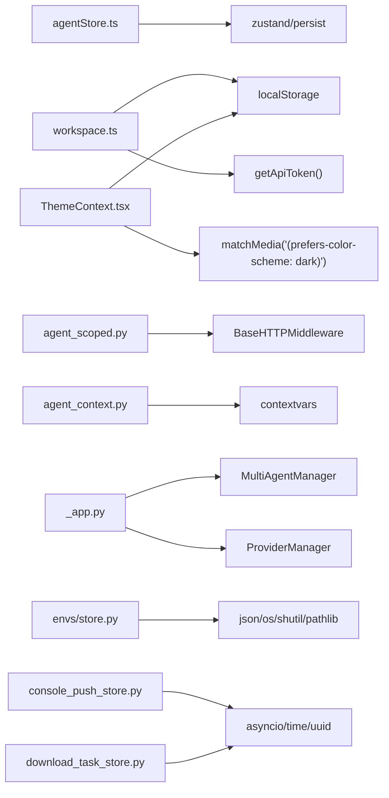

# 状态管理

<cite>
**本文引用的文件**
- [console/src/stores/agentStore.ts](file://console/src/stores/agentStore.ts)
- [console/src/pages/Settings/Agents/useAgents.ts](file://console/src/pages/Settings/Agents/useAgents.ts)
- [console/src/contexts/ThemeContext.tsx](file://console/src/contexts/ThemeContext.tsx)
- [console/src/api/modules/workspace.ts](file://console/src/api/modules/workspace.ts)
- [console/src/api/modules/console.ts](file://console/src/api/modules/console.ts)
- [src/copaw/app/agent_context.py](file://src/copaw/app/agent_context.py)
- [src/copaw/app/routers/agent_scoped.py](file://src/copaw/app/routers/agent_scoped.py)
- [src/copaw/app/_app.py](file://src/copaw/app/_app.py)
- [src/copaw/envs/store.py](file://src/copaw/envs/store.py)
- [src/copaw/app/console_push_store.py](file://src/copaw/app/console_push_store.py)
- [src/copaw/app/download_task_store.py](file://src/copaw/app/download_task_store.py)
- [src/copaw/agents/memory/memory_manager.py](file://src/copaw/agents/memory/memory_manager.py)
- [src/copaw/agents/memory/agent_md_manager.py](file://src/copaw/agents/memory/agent_md_manager.py)
</cite>

## 目录
1. [简介](#简介)
2. [项目结构](#项目结构)
3. [核心组件](#核心组件)
4. [架构总览](#架构总览)
5. [详细组件分析](#详细组件分析)
6. [依赖分析](#依赖分析)
7. [性能考虑](#性能考虑)
8. [故障排查指南](#故障排查指南)
9. [结论](#结论)
10. [附录](#附录)

## 简介
本文件系统化梳理 CoPaw 的状态管理方案，覆盖前端 Zustand 代理状态、主题上下文、后端多智能体上下文与路由隔离、环境变量持久化与同步、控制台推送消息与下载任务等状态存储，并对状态更新机制、副作用处理、性能优化、状态持久化与同步、错误恢复进行深入说明。同时提供示例与最佳实践，帮助开发者快速理解并正确使用状态管理。

## 项目结构
CoPaw 的状态管理横跨前后端：
- 前端
  - 代理状态：Zustand 存储 + 浏览器本地持久化
  - 主题状态：React Context + 本地存储
  - API 层：根据代理选择头注入 X-Agent-Id
- 后端
  - 多智能体上下文：contextvars + 路由中间件
  - 环境变量：JSON 文件持久化 + 注入进程环境
  - 控制台推送：内存队列 + 年龄/数量限制
  - 下载任务：内存状态 + 锁保护
  - 记忆与文件：内存检索 + 文件系统读写

图表来源
- [console/src/stores/agentStore.ts:1-47](file://console/src/stores/agentStore.ts#L1-L47)
- [console/src/contexts/ThemeContext.tsx:1-105](file://console/src/contexts/ThemeContext.tsx#L1-L105)
- [console/src/api/modules/workspace.ts:1-171](file://console/src/api/modules/workspace.ts#L1-L171)
- [src/copaw/app/routers/agent_scoped.py:1-92](file://src/copaw/app/routers/agent_scoped.py#L1-L92)
- [src/copaw/app/agent_context.py:1-118](file://src/copaw/app/agent_context.py#L1-L118)
- [src/copaw/app/_app.py:148-246](file://src/copaw/app/_app.py#L148-L246)
- [src/copaw/envs/store.py:151-243](file://src/copaw/envs/store.py#L151-L243)
- [src/copaw/app/console_push_store.py:22-83](file://src/copaw/app/console_push_store.py#L22-L83)
- [src/copaw/app/download_task_store.py:43-131](file://src/copaw/app/download_task_store.py#L43-L131)
- [src/copaw/agents/memory/memory_manager.py:43-310](file://src/copaw/agents/memory/memory_manager.py#L43-L310)
- [src/copaw/agents/memory/agent_md_manager.py:8-124](file://src/copaw/agents/memory/agent_md_manager.py#L8-L124)

章节来源
- [console/src/stores/agentStore.ts:1-47](file://console/src/stores/agentStore.ts#L1-L47)
- [console/src/contexts/ThemeContext.tsx:1-105](file://console/src/contexts/ThemeContext.tsx#L1-L105)
- [console/src/api/modules/workspace.ts:1-171](file://console/src/api/modules/workspace.ts#L1-L171)
- [src/copaw/app/routers/agent_scoped.py:1-92](file://src/copaw/app/routers/agent_scoped.py#L1-L92)
- [src/copaw/app/agent_context.py:1-118](file://src/copaw/app/agent_context.py#L1-L118)
- [src/copaw/app/_app.py:148-246](file://src/copaw/app/_app.py#L148-L246)
- [src/copaw/envs/store.py:151-243](file://src/copaw/envs/store.py#L151-L243)
- [src/copaw/app/console_push_store.py:22-83](file://src/copaw/app/console_push_store.py#L22-L83)
- [src/copaw/app/download_task_store.py:43-131](file://src/copaw/app/download_task_store.py#L43-L131)
- [src/copaw/agents/memory/memory_manager.py:43-310](file://src/copaw/agents/memory/memory_manager.py#L43-L310)
- [src/copaw/agents/memory/agent_md_manager.py:8-124](file://src/copaw/agents/memory/agent_md_manager.py#L8-L124)

## 核心组件
- 前端代理状态存储（Zustand）
  - 提供 selectedAgent、agents 列表及增删改查方法，并持久化到浏览器存储
- 主题上下文（React Context）
  - 统一管理主题模式与解析结果，支持系统跟随与本地存储
- 后端代理上下文（contextvars + 中间件）
  - 从路径或请求头提取 agentId，注入到当前请求上下文，供下游路由与运行器使用
- 环境变量存储（JSON + 进程环境）
  - 双层持久化：envs.json + os.environ；启动时注入，运行时同步
- 控制台推送存储（内存队列）
  - 有界队列 + 时间戳过滤，按会话取回并去重
- 下载任务存储（内存状态机）
  - 任务状态枚举与并发安全更新，保留完成/失败结果以便轮询
- 记忆与文件（ReMe + 文件系统）
  - 内存检索与向量/全文搜索；工作区与记忆目录的 Markdown 读写

章节来源
- [console/src/stores/agentStore.ts:1-47](file://console/src/stores/agentStore.ts#L1-L47)
- [console/src/contexts/ThemeContext.tsx:1-105](file://console/src/contexts/ThemeContext.tsx#L1-L105)
- [src/copaw/app/agent_context.py:1-118](file://src/copaw/app/agent_context.py#L1-L118)
- [src/copaw/envs/store.py:151-243](file://src/copaw/envs/store.py#L151-L243)
- [src/copaw/app/console_push_store.py:22-83](file://src/copaw/app/console_push_store.py#L22-L83)
- [src/copaw/app/download_task_store.py:43-131](file://src/copaw/app/download_task_store.py#L43-L131)
- [src/copaw/agents/memory/memory_manager.py:43-310](file://src/copaw/agents/memory/memory_manager.py#L43-L310)
- [src/copaw/agents/memory/agent_md_manager.py:8-124](file://src/copaw/agents/memory/agent_md_manager.py#L8-L124)

## 架构总览
下图展示从前端到后端的状态流转：前端通过代理选择头 X-Agent-Id 发起请求，后端中间件解析并注入上下文，动态运行器按 agentId 路由至对应 Workspace Runner，期间可能访问环境变量、推送队列、下载任务等状态存储。

图表来源
- [console/src/pages/Settings/Agents/useAgents.ts:16-42](file://console/src/pages/Settings/Agents/useAgents.ts#L16-L42)
- [console/src/stores/agentStore.ts:15-46](file://console/src/stores/agentStore.ts#L15-L46)
- [console/src/api/modules/workspace.ts:5-27](file://console/src/api/modules/workspace.ts#L5-L27)
- [src/copaw/app/routers/agent_scoped.py:15-51](file://src/copaw/app/routers/agent_scoped.py#L15-L51)
- [src/copaw/app/agent_context.py:99-118](file://src/copaw/app/agent_context.py#L99-L118)
- [src/copaw/app/_app.py:64-125](file://src/copaw/app/_app.py#L64-L125)
- [src/copaw/envs/store.py:182-201](file://src/copaw/envs/store.py#L182-L201)

章节来源
- [console/src/pages/Settings/Agents/useAgents.ts:16-42](file://console/src/pages/Settings/Agents/useAgents.ts#L16-L42)
- [console/src/api/modules/workspace.ts:5-27](file://console/src/api/modules/workspace.ts#L5-L27)
- [src/copaw/app/routers/agent_scoped.py:15-51](file://src/copaw/app/routers/agent_scoped.py#L15-L51)
- [src/copaw/app/agent_context.py:99-118](file://src/copaw/app/agent_context.py#L99-L118)
- [src/copaw/app/_app.py:64-125](file://src/copaw/app/_app.py#L64-L125)
- [src/copaw/envs/store.py:182-201](file://src/copaw/envs/store.py#L182-L201)

## 详细组件分析

### 前端代理状态存储（Zustand）
- 数据模型
  - selectedAgent: 当前选中代理 ID
  - agents: 代理摘要数组
  - 方法：设置、添加、移除、更新代理
- 持久化策略
  - 使用 persist 中间件，键名为 copaw-agent-storage
- 更新机制
  - 通过 set 与派生 set 函数更新状态
- 性能与副作用
  - 小型内存对象，更新复杂度 O(n)（map/filter）
  - 与 API 层协作，加载时批量写入，删除时同步更新
- 错误恢复
  - 初始化默认值，异常时降级为默认代理 ID

图表来源
- [console/src/pages/Settings/Agents/useAgents.ts:23-39](file://console/src/pages/Settings/Agents/useAgents.ts#L23-L39)
- [console/src/stores/agentStore.ts:15-46](file://console/src/stores/agentStore.ts#L15-L46)

章节来源
- [console/src/stores/agentStore.ts:1-47](file://console/src/stores/agentStore.ts#L1-L47)
- [console/src/pages/Settings/Agents/useAgents.ts:16-42](file://console/src/pages/Settings/Agents/useAgents.ts#L16-L42)

### 主题上下文（React Context）
- 数据模型
  - themeMode: light/dark/system
  - isDark: 最终解析后的布尔值
  - 方法：setThemeMode、toggleTheme
- 持久化策略
  - 本地存储键名 copaw-theme
- 更新机制
  - 通过回调 setState 并应用到 <html> 元素类名以驱动全局样式
- 副作用
  - 监听系统配色变化，当模式为 system 时动态切换
- 错误恢复
  - 读取失败时回退到 system 模式

图表来源
- [console/src/contexts/ThemeContext.tsx:51-100](file://console/src/contexts/ThemeContext.tsx#L51-L100)

章节来源
- [console/src/contexts/ThemeContext.tsx:1-105](file://console/src/contexts/ThemeContext.tsx#L1-L105)

### 后端代理上下文与路由隔离
- 上下文注入
  - 中间件优先从路径提取 agentId，其次从 X-Agent-Id 头获取
  - 使用 contextvars 设置当前 agentId
- 动态路由
  - 动态运行器根据上下文获取对应 Workspace Runner
- 容错与错误处理
  - 未找到代理返回 404，初始化失败返回 500

图表来源
- [src/copaw/app/routers/agent_scoped.py:15-51](file://src/copaw/app/routers/agent_scoped.py#L15-L51)
- [src/copaw/app/agent_context.py:99-118](file://src/copaw/app/agent_context.py#L99-L118)
- [src/copaw/app/_app.py:64-125](file://src/copaw/app/_app.py#L64-L125)

章节来源
- [src/copaw/app/routers/agent_scoped.py:1-92](file://src/copaw/app/routers/agent_scoped.py#L1-L92)
- [src/copaw/app/agent_context.py:1-118](file://src/copaw/app/agent_context.py#L1-L118)
- [src/copaw/app/_app.py:148-246](file://src/copaw/app/_app.py#L148-L246)

### 环境变量持久化与同步
- 持久化策略
  - envs.json 作为规范存储，位于秘密目录，权限严格
  - 启动时将受保护键排除后注入 os.environ
- 同步与覆盖
  - 新旧映射差异同步，避免覆盖显式系统/运行时环境变量
- 迁移与兼容
  - 自动迁移历史位置的 envs.json

图表来源
- [src/copaw/envs/store.py:222-243](file://src/copaw/envs/store.py#L222-L243)
- [src/copaw/envs/store.py:113-144](file://src/copaw/envs/store.py#L113-L144)
- [src/copaw/envs/store.py:65-91](file://src/copaw/envs/store.py#L65-L91)

章节来源
- [src/copaw/envs/store.py:151-243](file://src/copaw/envs/store.py#L151-L243)

### 控制台推送消息存储
- 存储特性
  - 内存列表，带时间戳与会话标识
  - 有界容量与年龄阈值，自动清理
- 接口语义
  - append：追加消息（超过上限按时间排序丢弃最早）
  - take/take_all：取走并清除指定会话/全部
  - get_recent：返回近期未消费消息并裁剪过期项

图表来源
- [src/copaw/app/console_push_store.py:22-83](file://src/copaw/app/console_push_store.py#L22-L83)

章节来源
- [src/copaw/app/console_push_store.py:1-83](file://src/copaw/app/console_push_store.py#L1-L83)

### 下载任务状态存储
- 数据模型
  - DownloadTask：包含任务 ID、仓库/文件名、后端、来源、状态、错误、结果、时间戳
  - 状态枚举：pending/downloading/completed/failed/cancelled
- 并发与一致性
  - 使用 asyncio.Lock 保护共享字典
- 生命周期
  - 创建、查询、更新状态、取消、清理已完成/失败/取消的任务

图表来源
- [src/copaw/app/download_task_store.py:26-131](file://src/copaw/app/download_task_store.py#L26-L131)

章节来源
- [src/copaw/app/download_task_store.py:1-131](file://src/copaw/app/download_task_store.py#L1-L131)

### 记忆与文件状态
- 记忆管理
  - 扩展 ReMeLight，支持消息压缩、总结、向量/全文检索
  - 通过工具集读写文件辅助总结
- 文件管理
  - 工作区与记忆目录的 Markdown 文件读写与列表

图表来源
- [src/copaw/agents/memory/memory_manager.py:43-310](file://src/copaw/agents/memory/memory_manager.py#L43-L310)
- [src/copaw/agents/memory/agent_md_manager.py:8-124](file://src/copaw/agents/memory/agent_md_manager.py#L8-L124)

章节来源
- [src/copaw/agents/memory/memory_manager.py:1-310](file://src/copaw/agents/memory/memory_manager.py#L1-L310)
- [src/copaw/agents/memory/agent_md_manager.py:1-124](file://src/copaw/agents/memory/agent_md_manager.py#L1-L124)

## 依赖分析
- 前端
  - agentStore.ts 依赖 zustand 与 persist 中间件
  - workspace.ts 依赖 localStorage 与 API Token，构建请求头
  - ThemeContext.tsx 依赖 localStorage 与媒体查询
- 后端
  - agent_context.py 依赖 contextvars、FastAPI Request
  - agent_scoped.py 依赖 Starlette BaseHTTPMiddleware
  - _app.py 依赖 MultiAgentManager、AgentApp、ProviderManager
  - envs/store.py 依赖 json、os、shutil、pathlib
  - console_push_store.py 与 download_task_store.py 依赖 asyncio、time、uuid

图表来源
- [console/src/stores/agentStore.ts:1-47](file://console/src/stores/agentStore.ts#L1-L47)
- [console/src/api/modules/workspace.ts:1-171](file://console/src/api/modules/workspace.ts#L1-L171)
- [console/src/contexts/ThemeContext.tsx:1-105](file://console/src/contexts/ThemeContext.tsx#L1-L105)
- [src/copaw/app/routers/agent_scoped.py:1-92](file://src/copaw/app/routers/agent_scoped.py#L1-L92)
- [src/copaw/app/agent_context.py:1-118](file://src/copaw/app/agent_context.py#L1-L118)
- [src/copaw/app/_app.py:148-246](file://src/copaw/app/_app.py#L148-L246)
- [src/copaw/envs/store.py:151-243](file://src/copaw/envs/store.py#L151-L243)
- [src/copaw/app/console_push_store.py:22-83](file://src/copaw/app/console_push_store.py#L22-L83)
- [src/copaw/app/download_task_store.py:43-131](file://src/copaw/app/download_task_store.py#L43-L131)

章节来源
- [console/src/stores/agentStore.ts:1-47](file://console/src/stores/agentStore.ts#L1-L47)
- [console/src/api/modules/workspace.ts:1-171](file://console/src/api/modules/workspace.ts#L1-L171)
- [console/src/contexts/ThemeContext.tsx:1-105](file://console/src/contexts/ThemeContext.tsx#L1-L105)
- [src/copaw/app/routers/agent_scoped.py:1-92](file://src/copaw/app/routers/agent_scoped.py#L1-L92)
- [src/copaw/app/agent_context.py:1-118](file://src/copaw/app/agent_context.py#L1-L118)
- [src/copaw/app/_app.py:148-246](file://src/copaw/app/_app.py#L148-L246)
- [src/copaw/envs/store.py:151-243](file://src/copaw/envs/store.py#L151-L243)
- [src/copaw/app/console_push_store.py:22-83](file://src/copaw/app/console_push_store.py#L22-L83)
- [src/copaw/app/download_task_store.py:43-131](file://src/copaw/app/download_task_store.py#L43-L131)

## 性能考虑
- 前端
  - Zustand 默认浅比较，派生 set 函数避免不必要的重渲染
  - 代理列表更新为 O(n) 操作，建议批量更新
- 后端
  - 多智能体管理器懒加载与零停机热重载，最小化锁持有时间
  - 动态运行器按需获取 Workspace Runner，减少全局锁竞争
- 存储
  - 控制台推送与下载任务均使用 asyncio.Lock 保证并发安全
  - 推送存储按时间排序裁剪，避免无限增长
- 搜索与记忆
  - 记忆管理器支持向量/全文检索，结合令牌计数与批处理参数优化

## 故障排查指南
- 代理选择无效
  - 检查前端是否正确写入 localStorage 并在请求头中携带 X-Agent-Id
  - 确认后端中间件已解析路径或头部
- 代理上下文为空
  - 若未设置 agentId，回退逻辑会使用配置中的 active_agent 或默认值
- 环境变量未生效
  - 确认 envs.json 权限与路径，检查受保护键是否被跳过注入
- 控制台推送丢失
  - 检查消息是否超过最大数量或超出年龄阈值
- 下载任务状态不更新
  - 确认 update_status 是否被调用且 task_id 存在
- 记忆检索无结果
  - 检查 embedding 配置与向量后端可用性

章节来源
- [console/src/api/modules/workspace.ts:29-43](file://console/src/api/modules/workspace.ts#L29-L43)
- [src/copaw/app/routers/agent_scoped.py:28-48](file://src/copaw/app/routers/agent_scoped.py#L28-L48)
- [src/copaw/app/agent_context.py:86-96](file://src/copaw/app/agent_context.py#L86-L96)
- [src/copaw/envs/store.py:182-201](file://src/copaw/envs/store.py#L182-L201)
- [src/copaw/app/console_push_store.py:70-83](file://src/copaw/app/console_push_store.py#L70-L83)
- [src/copaw/app/download_task_store.py:76-94](file://src/copaw/app/download_task_store.py#L76-L94)
- [src/copaw/agents/memory/memory_manager.py:279-287](file://src/copaw/agents/memory/memory_manager.py#L279-L287)

## 结论
CoPaw 的状态管理以“前端轻量存储 + 后端强一致上下文”为核心，辅以双层持久化与内存有界队列，满足多智能体场景下的状态一致性与性能需求。通过明确的更新机制、副作用处理与错误恢复策略，开发者可以稳定地扩展代理状态、主题状态与业务状态。

## 附录
- 状态更新示例（前端）
  - 在 useAgents 中加载代理列表并写入 Zustand 存储
  - 参考路径：[console/src/pages/Settings/Agents/useAgents.ts:23-39](file://console/src/pages/Settings/Agents/useAgents.ts#L23-L39)
- 状态持久化示例（前端）
  - 代理存储使用 persist 中间件，键名为 copaw-agent-storage
  - 参考路径：[console/src/stores/agentStore.ts:42-45](file://console/src/stores/agentStore.ts#L42-L45)
- 主题状态示例（前端）
  - 通过 ThemeProvider 管理主题模式与系统跟随
  - 参考路径：[console/src/contexts/ThemeContext.tsx:51-100](file://console/src/contexts/ThemeContext.tsx#L51-L100)
- 代理上下文示例（后端）
  - 中间件解析 agentId 并注入上下文
  - 参考路径：[src/copaw/app/routers/agent_scoped.py:15-51](file://src/copaw/app/routers/agent_scoped.py#L15-L51)
- 环境变量持久化示例（后端）
  - 启动时注入 envs.json 并同步到 os.environ
  - 参考路径：[src/copaw/envs/store.py:222-243](file://src/copaw/envs/store.py#L222-L243)