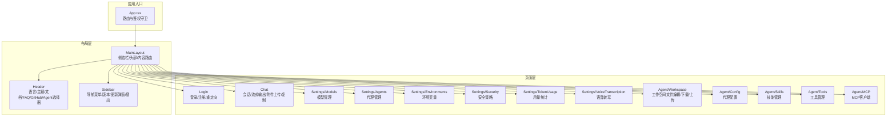
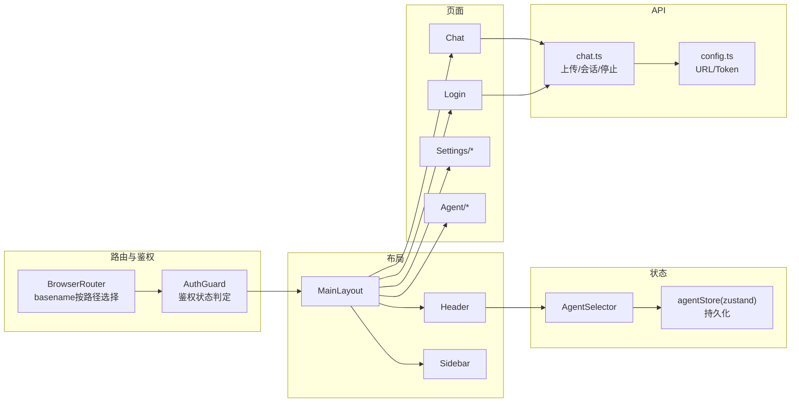
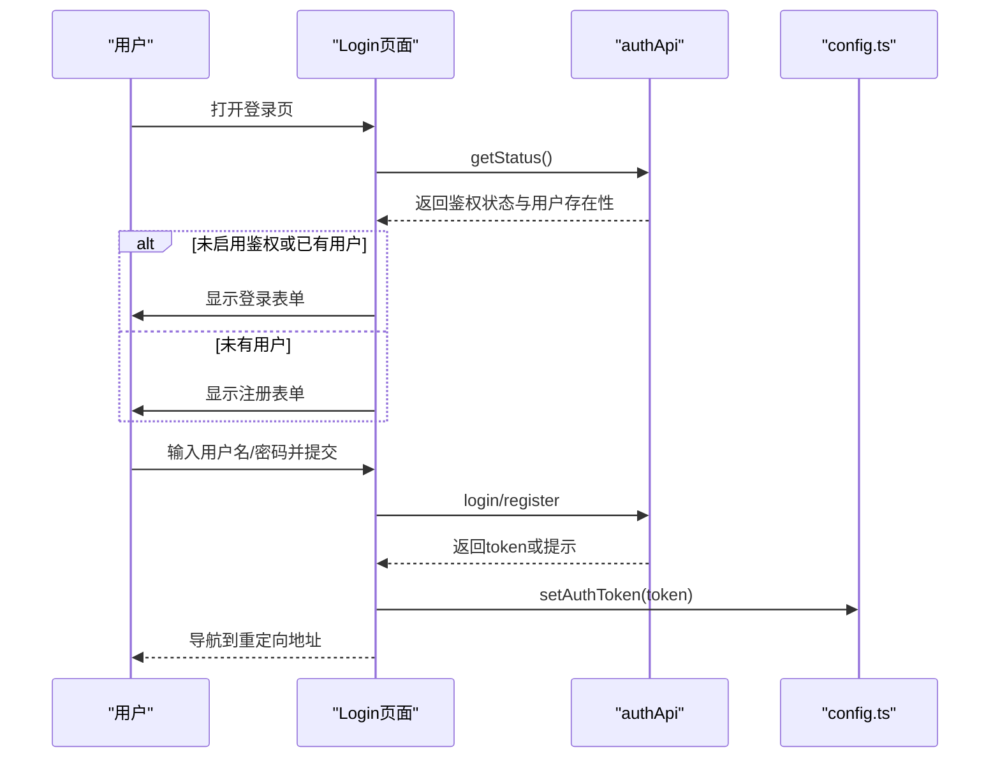
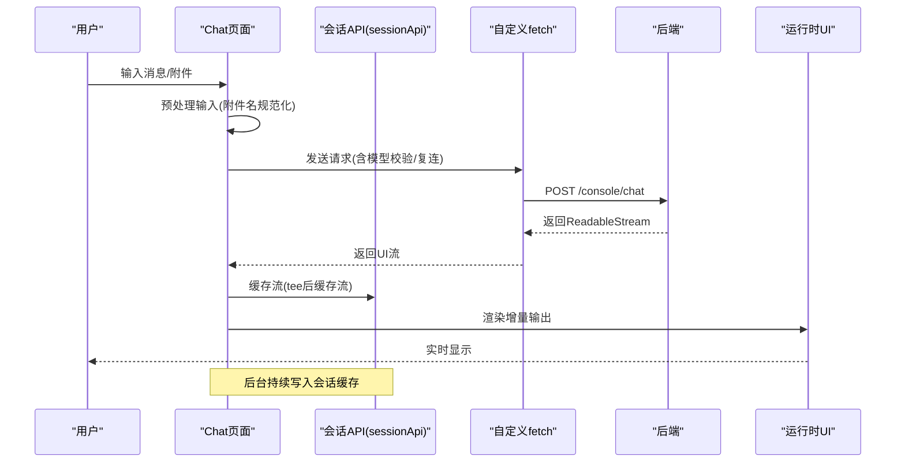
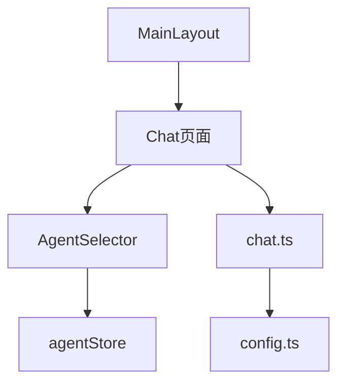

# 页面组件

<cite>
**本文引用的文件**
- [console/src/App.tsx](file://console/src/App.tsx)
- [console/src/layouts/MainLayout/index.tsx](file://console/src/layouts/MainLayout/index.tsx)
- [console/src/layouts/Header.tsx](file://console/src/layouts/Header.tsx)
- [console/src/layouts/Sidebar.tsx](file://console/src/layouts/Sidebar.tsx)
- [console/src/pages/Chat/index.tsx](file://console/src/pages/Chat/index.tsx)
- [console/src/pages/Chat/OptionsPanel/defaultConfig.ts](file://console/src/pages/Chat/OptionsPanel/defaultConfig.ts)
- [console/src/pages/Login/index.tsx](file://console/src/pages/Login/index.tsx)
- [console/src/stores/agentStore.ts](file://console/src/stores/agentStore.ts)
- [console/src/components/AgentSelector/index.tsx](file://console/src/components/AgentSelector/index.tsx)
- [console/src/api/modules/chat.ts](file://console/src/api/modules/chat.ts)
- [console/src/api/config.ts](file://console/src/api/config.ts)
</cite>

## 目录
1. [引言](#引言)
2. [项目结构](#项目结构)
3. [核心组件](#核心组件)
4. [架构总览](#架构总览)
5. [详细组件分析](#详细组件分析)
6. [依赖分析](#依赖分析)
7. [性能考虑](#性能考虑)
8. [故障排查指南](#故障排查指南)
9. [结论](#结论)
10. [附录](#附录)

## 引言
本文件聚焦于CoPaw控制台前端的页面级组件，系统性阐述页面级组件的设计模式、路由集成与状态管理。文档覆盖聊天页面、设置页面、登录页面以及代理（Agent）相关页面的实现细节，包括props接口、事件处理、数据流、生命周期、性能优化与用户体验设计，并提供页面组件示例与组合模式。

## 项目结构
控制台采用“布局 + 页面”分层组织：顶层通过路由与鉴权守卫统一装配；主布局负责导航与内容区路由分发；页面组件各自封装业务逻辑与UI交互；全局状态通过轻量store与本地存储协同；API模块集中封装后端交互。

图表来源
- [console/src/App.tsx:146-156](file://console/src/App.tsx#L146-L156)
- [console/src/layouts/MainLayout/index.tsx:58-79](file://console/src/layouts/MainLayout/index.tsx#L58-L79)
- [console/src/layouts/Header.tsx:28-88](file://console/src/layouts/Header.tsx#L28-L88)
- [console/src/layouts/Sidebar.tsx:218-303](file://console/src/layouts/Sidebar.tsx#L218-L303)

章节来源
- [console/src/App.tsx:146-156](file://console/src/App.tsx#L146-L156)
- [console/src/layouts/MainLayout/index.tsx:58-79](file://console/src/layouts/MainLayout/index.tsx#L58-L79)

## 核心组件
- 应用与路由
  - App.tsx：配置国际化、主题、路由基础路径、全局样式，定义鉴权守卫并挂载主布局。
  - MainLayout：根据当前路径渲染侧边栏、头部与内容区域路由表，承载所有页面路由。
- 页面组件
  - Login：登录/注册流程，基于后端鉴权状态动态切换注册态，支持重定向回跳。
  - Chat：基于第三方运行时UI组件构建的聊天页面，集成会话管理、流式输出、附件上传、复制等能力。
- 状态与选择器
  - AgentSelector：从后端拉取代理列表，维护当前选中代理并在store中持久化。
  - agentStore：Zustand轻量store，持久化保存当前选中代理与代理列表。
- API与配置
  - chat.ts：封装控制台聊天相关API（上传、会话、停止等），统一注入鉴权头与代理头。
  - config.ts：统一生成API完整URL与令牌读取/写入/清理。

章节来源
- [console/src/App.tsx:106-159](file://console/src/App.tsx#L106-L159)
- [console/src/layouts/MainLayout/index.tsx:45-84](file://console/src/layouts/MainLayout/index.tsx#L45-L84)
- [console/src/pages/Login/index.tsx:9-151](file://console/src/pages/Login/index.tsx#L9-L151)
- [console/src/pages/Chat/index.tsx:240-906](file://console/src/pages/Chat/index.tsx#L240-L906)
- [console/src/components/AgentSelector/index.tsx:9-100](file://console/src/components/AgentSelector/index.tsx#L9-L100)
- [console/src/stores/agentStore.ts:15-46](file://console/src/stores/agentStore.ts#L15-L46)
- [console/src/api/modules/chat.ts:50-165](file://console/src/api/modules/chat.ts#L50-L165)
- [console/src/api/config.ts:11-41](file://console/src/api/config.ts#L11-L41)

## 架构总览
页面组件围绕“路由 + 布局 + 页面 + 状态 + API”的分层架构展开，遵循以下原则：
- 路由与鉴权：顶层App统一处理basename、国际化与鉴权守卫，未登录自动跳转登录页。
- 布局与导航：MainLayout集中管理侧边栏与头部，头部包含AgentSelector，便于跨页面切换代理。
- 页面职责单一：每个页面专注自身业务，避免跨页面耦合。
- 状态持久化：代理选择使用本地持久化store，确保刷新后仍保持用户选择。
- API统一：所有页面通过API模块访问后端，统一处理鉴权头与代理头。

图表来源
- [console/src/App.tsx:132-159](file://console/src/App.tsx#L132-L159)
- [console/src/layouts/MainLayout/index.tsx:50-84](file://console/src/layouts/MainLayout/index.tsx#L50-L84)
- [console/src/components/AgentSelector/index.tsx:9-100](file://console/src/components/AgentSelector/index.tsx#L9-L100)
- [console/src/stores/agentStore.ts:15-46](file://console/src/stores/agentStore.ts#L15-L46)
- [console/src/api/modules/chat.ts:50-165](file://console/src/api/modules/chat.ts#L50-L165)
- [console/src/api/config.ts:11-41](file://console/src/api/config.ts#L11-L41)

## 详细组件分析

### 登录页面（Login）
- 设计模式
  - 纯函数组件 + 表单校验 + 异步提交。
  - 基于后端鉴权状态决定是否显示注册态与初始跳转。
- 路由集成
  - 直接暴露在根路由下，未登录时由AuthGuard强制跳转。
- 状态管理
  - 组件内状态：加载态、是否注册态、是否存在用户。
  - 提交成功后写入令牌并按重定向参数跳转。
- 数据流
  - 获取鉴权状态 → 判断是否需要注册 → 用户输入 → 调用登录/注册API → 写入令牌 → 导航。
- 生命周期
  - 挂载时检查后端鉴权状态与用户存在性，决定初始UI与行为。
- 性能与体验
  - 防重复提交（加载态）、错误提示、首次用户提示。
- Props与事件
  - 无外部props；内部使用表单onFinish回调与按钮点击事件。

图表来源
- [console/src/pages/Login/index.tsx:17-68](file://console/src/pages/Login/index.tsx#L17-L68)
- [console/src/api/modules/auth.ts:1-200](file://console/src/api/modules/auth.ts#L1-L200)
- [console/src/api/config.ts:32-41](file://console/src/api/config.ts#L32-L41)

章节来源
- [console/src/pages/Login/index.tsx:9-151](file://console/src/pages/Login/index.tsx#L9-L151)

### 聊天页面（Chat）
- 设计模式
  - 页面级组件聚合：会话API包装、自定义fetch、主题与欢迎语配置、附件上传、复制响应。
  - 使用第三方运行时UI组件作为核心渲染容器，页面负责桥接数据与行为。
- 路由集成
  - 通过MainLayout在“/chat/*”下渲染，支持多会话与临时ID解析。
- 状态管理
  - 依赖agentStore中的selectedAgent，当代理变化时触发页面刷新。
  - 通过会话API与本地状态维持消息与会话列表。
- 数据流
  - 输入预处理（附件名规范化）→ 校验模型配置 → 发送请求（可复连）→ 流式读取 → 缓存持久化 → UI更新。
- 生命周期
  - 监听输入法合成状态，避免误触提交；监听会话状态变化以触发复连；监听代理切换以刷新。
- 性能与体验
  - 流式输出双流拆分（UI流与缓存流），后台释放过期加载态；文件上传限制大小与类型。
- Props与事件
  - 无外部props；内部通过options配置运行时UI，暴露actions与api钩子。

图表来源
- [console/src/pages/Chat/index.tsx:583-732](file://console/src/pages/Chat/index.tsx#L583-L732)
- [console/src/pages/Chat/index.tsx:480-581](file://console/src/pages/Chat/index.tsx#L480-L581)
- [console/src/api/modules/chat.ts:128-165](file://console/src/api/modules/chat.ts#L128-L165)

章节来源
- [console/src/pages/Chat/index.tsx:240-906](file://console/src/pages/Chat/index.tsx#L240-L906)
- [console/src/pages/Chat/OptionsPanel/defaultConfig.ts:3-56](file://console/src/pages/Chat/OptionsPanel/defaultConfig.ts#L3-L56)
- [console/src/api/modules/chat.ts:50-165](file://console/src/api/modules/chat.ts#L50-L165)

### 设置页面（Settings）
- 模型管理（Models）
  - 展示与管理可用模型与提供方，支持卡片/模态交互。
- 代理管理（Agents）
  - 代理列表与操作，配合AgentSelector进行切换。
- 环境变量（Environments）
  - 变量增删改查与批量操作。
- 安全（Security）
  - 技能扫描与工具守卫策略配置。
- 用量统计（TokenUsage）
  - 计费与用量可视化。
- 语音转写（VoiceTranscription）
  - 语音输入与转写配置。

章节来源
- [console/src/layouts/MainLayout/index.tsx:17-22](file://console/src/layouts/MainLayout/index.tsx#L17-L22)

### 代理页面（Agent）
- 工作空间（Workspace）
  - 文件列表与编辑器，支持下载/上传ZIP包，文件启用/禁用与排序。
- 代理配置（Config）
  - 代理上下文与配置卡片化管理。
- 技能（Skills）
  - 技能卡片与抽屉详情，支持增删改查。
- 工具（Tools）
  - 工具卡片与抽屉详情。
- MCP（MCP）
  - MCP客户端卡片与抽屉详情。

章节来源
- [console/src/layouts/MainLayout/index.tsx:12-16](file://console/src/layouts/MainLayout/index.tsx#L12-L16)

## 依赖分析
- 组件耦合
  - Chat依赖AgentSelector与agentStore，形成“代理选择 → 页面刷新”的弱耦合。
  - MainLayout集中路由，降低页面间直接耦合。
- 外部依赖
  - 第三方运行时UI组件用于渲染聊天界面。
  - Ant Design与自研design库提供UI基础。
- 接口契约
  - Chat通过options注入fetch与session API，形成清晰的扩展点。
  - AgentSelector通过agentsApi拉取代理列表，约定返回结构。

图表来源
- [console/src/pages/Chat/index.tsx:240-906](file://console/src/pages/Chat/index.tsx#L240-L906)
- [console/src/components/AgentSelector/index.tsx:9-100](file://console/src/components/AgentSelector/index.tsx#L9-L100)
- [console/src/stores/agentStore.ts:15-46](file://console/src/stores/agentStore.ts#L15-L46)
- [console/src/layouts/MainLayout/index.tsx:58-79](file://console/src/layouts/MainLayout/index.tsx#L58-L79)
- [console/src/api/modules/chat.ts:50-165](file://console/src/api/modules/chat.ts#L50-L165)
- [console/src/api/config.ts:11-41](file://console/src/api/config.ts#L11-L41)

章节来源
- [console/src/pages/Chat/index.tsx:240-906](file://console/src/pages/Chat/index.tsx#L240-L906)
- [console/src/components/AgentSelector/index.tsx:9-100](file://console/src/components/AgentSelector/index.tsx#L9-L100)
- [console/src/stores/agentStore.ts:15-46](file://console/src/stores/agentStore.ts#L15-L46)
- [console/src/layouts/MainLayout/index.tsx:58-79](file://console/src/layouts/MainLayout/index.tsx#L58-L79)
- [console/src/api/modules/chat.ts:50-165](file://console/src/api/modules/chat.ts#L50-L165)
- [console/src/api/config.ts:11-41](file://console/src/api/config.ts#L11-L41)

## 性能考虑
- 流式渲染与缓存分离
  - Chat对ReadableStream进行tee，分别用于UI渲染与后台缓存，避免阻塞主线程。
- 加载态释放
  - 在后台会话无实时消息时释放加载态，减少无效渲染。
- 输入法合成防抖
  - 监听compositionstart/compositionend，避免输入法期间误触发提交。
- 代理切换刷新
  - 通过key强制刷新运行时UI，保证新代理配置生效。
- 本地持久化
  - agentStore持久化代理选择，减少后端查询与页面闪烁。

章节来源
- [console/src/pages/Chat/index.tsx:270-317](file://console/src/pages/Chat/index.tsx#L270-L317)
- [console/src/pages/Chat/index.tsx:463-478](file://console/src/pages/Chat/index.tsx#L463-L478)
- [console/src/pages/Chat/index.tsx:852-856](file://console/src/pages/Chat/index.tsx#L852-L856)
- [console/src/stores/agentStore.ts:15-46](file://console/src/stores/agentStore.ts#L15-L46)

## 故障排查指南
- 登录失败
  - 检查后端鉴权状态与网络请求；确认重定向参数合法性。
- 聊天无输出或卡住
  - 确认模型已配置；检查会话状态与复连逻辑；查看流式输出是否正常。
- 附件上传失败
  - 检查文件大小与类型限制；确认上传接口返回与错误信息。
- 代理切换不生效
  - 确认agentStore中selectedAgent已更新；检查页面刷新key是否变化。

章节来源
- [console/src/pages/Login/index.tsx:33-68](file://console/src/pages/Login/index.tsx#L33-L68)
- [console/src/pages/Chat/index.tsx:655-667](file://console/src/pages/Chat/index.tsx#L655-L667)
- [console/src/pages/Chat/index.tsx:788-803](file://console/src/pages/Chat/index.tsx#L788-L803)
- [console/src/components/AgentSelector/index.tsx:32-35](file://console/src/components/AgentSelector/index.tsx#L32-L35)

## 结论
CoPaw页面组件通过清晰的分层与职责划分，实现了路由、布局、状态与API的解耦。聊天页面以运行时UI为核心，结合会话与流式处理，提供了良好的交互体验；登录页面简洁可靠，配合鉴权守卫保障安全；设置与代理页面以卡片化与抽屉化设计提升可维护性。建议在后续迭代中进一步抽象页面通用能力（如会话管理、流式处理），以增强复用性与一致性。

## 附录
- 组件组合模式
  - 布局层（MainLayout）承载导航与内容路由，页面层专注于业务，组件层（AgentSelector）提供可复用功能。
- 最佳实践
  - 将页面级组件视为“粘合层”，将复杂逻辑下沉至API模块与store；保持页面props最小化，通过context与hooks传递依赖。