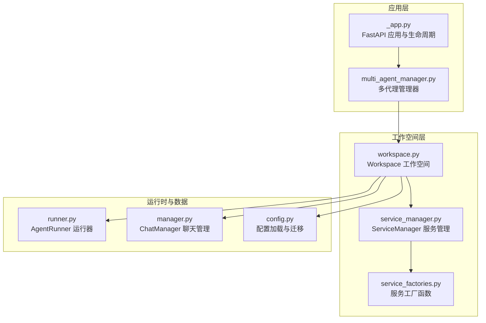
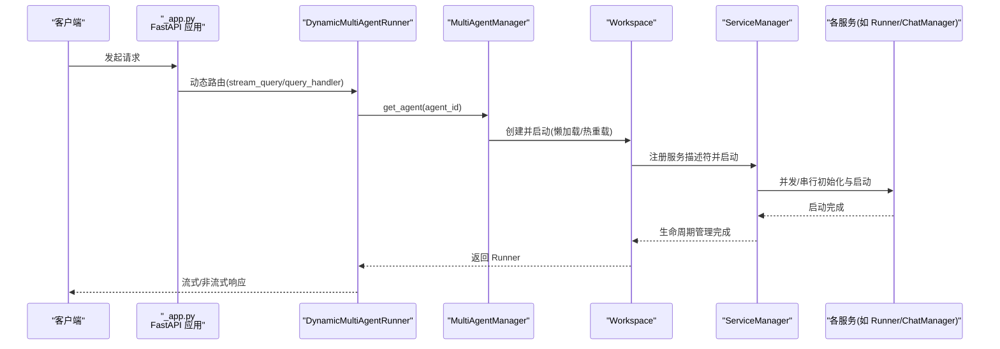
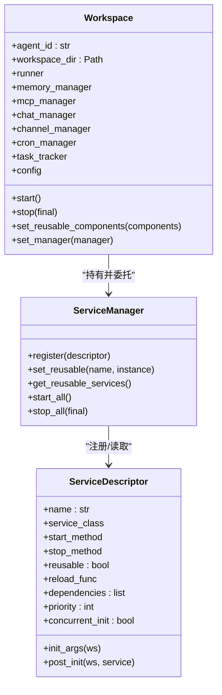
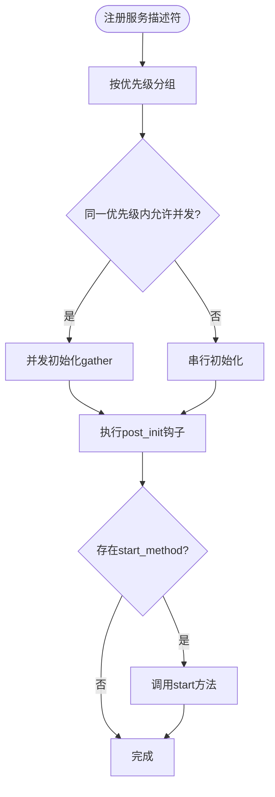
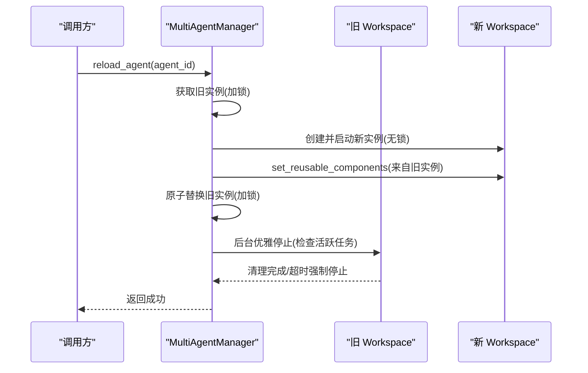
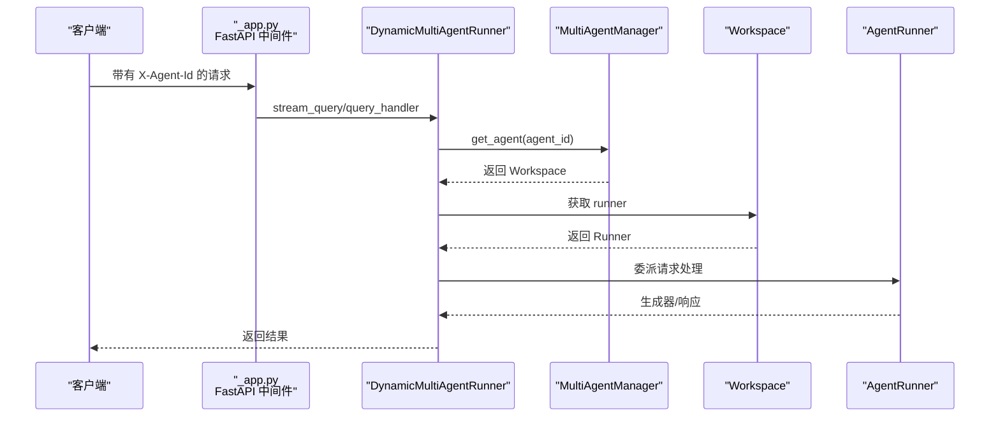
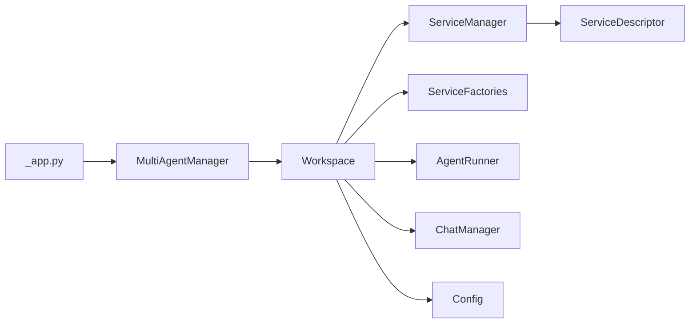

# 代理工作空间管理

<cite>
**本文引用的文件**
- [workspace.py](file://src/copaw/app/workspace/workspace.py)
- [service_manager.py](file://src/copaw/app/workspace/service_manager.py)
- [service_factories.py](file://src/copaw/app/workspace/service_factories.py)
- [_app.py](file://src/copaw/app/_app.py)
- [multi_agent_manager.py](file://src/copaw/app/multi_agent_manager.py)
- [config.py](file://src/copaw/config/config.py)
- [runner.py](file://src/copaw/app/runner/runner.py)
- [manager.py](file://src/copaw/app/runner/manager.py)
- [test_workspace.py](file://tests/unit/workspace/test_workspace.py)
</cite>

## 目录
1. [简介](#简介)
2. [项目结构](#项目结构)
3. [核心组件](#核心组件)
4. [架构总览](#架构总览)
5. [详细组件分析](#详细组件分析)
6. [依赖分析](#依赖分析)
7. [性能考虑](#性能考虑)
8. [故障排除指南](#故障排除指南)
9. [结论](#结论)
10. [附录](#附录)

## 简介
本文件系统性阐述 CoPaw 的代理工作空间管理方案，重点覆盖以下方面：
- Workspace 类的设计架构与职责边界
- 服务管理器的组件注册机制与工厂模式应用
- 工作空间生命周期管理、服务初始化顺序与依赖注入
- 服务重用机制、资源清理策略与异常处理流程
- 工作空间隔离原理、配置加载过程与性能优化技巧
- 具体的服务注册示例与故障排除指南

## 项目结构
围绕工作空间管理的关键模块如下：
- 应用入口与多代理编排：_app.py、multi_agent_manager.py
- 工作空间与服务管理：workspace.py、service_manager.py、service_factories.py
- 配置体系：config.py
- 运行器与聊天管理：runner.py、runner/manager.py
- 单元测试：tests/unit/workspace/test_workspace.py

图表来源
- [_app.py:148-246](file://src/copaw/app/_app.py#L148-L246)
- [multi_agent_manager.py:17-32](file://src/copaw/app/multi_agent_manager.py#L17-L32)
- [workspace.py:39-78](file://src/copaw/app/workspace/workspace.py#L39-L78)
- [service_manager.py:74-91](file://src/copaw/app/workspace/service_manager.py#L74-L91)
- [service_factories.py:18-34](file://src/copaw/app/workspace/service_factories.py#L18-L34)
- [runner.py:63-94](file://src/copaw/app/runner/runner.py#L63-L94)
- [manager.py:17-41](file://src/copaw/app/runner/manager.py#L17-L41)
- [config.py:844-928](file://src/copaw/config/config.py#L844-L928)

章节来源
- [_app.py:148-246](file://src/copaw/app/_app.py#L148-L246)
- [multi_agent_manager.py:17-32](file://src/copaw/app/multi_agent_manager.py#L17-L32)
- [workspace.py:39-78](file://src/copaw/app/workspace/workspace.py#L39-L78)

## 核心组件
- Workspace：封装单个代理的完整运行时环境，统一管理 Runner、ChannelManager、MemoryManager、MCPClientManager、CronManager 等组件，并通过 ServiceManager 实现声明式注册与生命周期控制。
- ServiceManager：提供服务描述符（ServiceDescriptor）注册、并发/串行启动、依赖解析、可复用服务标记与热重载支持、统一停止逻辑等能力。
- ServiceFactories：以工厂函数形式实现服务创建与装配，解耦 Workspace 初始化逻辑，便于测试与扩展。
- MultiAgentManager：集中管理多个 Workspace，支持懒加载、零停机热重载、后台清理任务与全局停止。
- AgentRunner：承载代理请求处理流程，负责与 ChatManager、MCPClientManager 等协作。
- ChatManager：负责聊天会话规范（ChatSpec）的持久化与查询。
- Config：提供根配置与代理配置的加载、保存与兼容性迁移。

章节来源
- [workspace.py:39-115](file://src/copaw/app/workspace/workspace.py#L39-L115)
- [service_manager.py:30-72](file://src/copaw/app/workspace/service_manager.py#L30-L72)
- [service_factories.py:18-62](file://src/copaw/app/workspace/service_factories.py#L18-L62)
- [multi_agent_manager.py:17-32](file://src/copaw/app/multi_agent_manager.py#L17-L32)
- [runner.py:63-94](file://src/copaw/app/runner/runner.py#L63-L94)
- [manager.py:17-41](file://src/copaw/app/runner/manager.py#L17-L41)
- [config.py:844-928](file://src/copaw/config/config.py#L844-L928)

## 架构总览
下图展示从应用启动到请求路由、工作空间实例化与服务启动的整体流程：

图表来源
- [_app.py:48-136](file://src/copaw/app/_app.py#L48-L136)
- [multi_agent_manager.py:34-82](file://src/copaw/app/multi_agent_manager.py#L34-L82)
- [workspace.py:311-358](file://src/copaw/app/workspace/workspace.py#L311-L358)
- [service_manager.py:171-229](file://src/copaw/app/workspace/service_manager.py#L171-L229)

## 详细组件分析

### Workspace 设计与生命周期
- 职责边界
  - 统一管理代理运行时组件（Runner、ChannelManager、MemoryManager、MCPClientManager、CronManager、ChatManager）
  - 通过 ServiceManager 实现声明式注册与生命周期控制
  - 提供可复用组件设置接口，支持热重载
- 关键属性与方法
  - 属性：runner/memory_manager/mcp_manager/chat_manager/channel_manager/cron_manager/task_tracker/config
  - 方法：start()/stop()/set_reusable_components()/set_manager()
- 生命周期
  - start()：加载代理配置、委托 ServiceManager 启动所有服务、记录成功状态
  - stop(final)：按优先级逆序停止服务；final=False用于热重载跳过可复用服务
  - set_reusable_components()：在 start() 前设置可复用组件（如 MemoryManager、ChatManager）
  - set_manager()：向 Runner 注入 MultiAgentManager 引用，支撑 /daemon restart 等场景

图表来源
- [workspace.py:39-115](file://src/copaw/app/workspace/workspace.py#L39-L115)
- [service_manager.py:30-72](file://src/copaw/app/workspace/service_manager.py#L30-L72)
- [service_manager.py:74-91](file://src/copaw/app/workspace/service_manager.py#L74-L91)

章节来源
- [workspace.py:39-115](file://src/copaw/app/workspace/workspace.py#L39-L115)
- [workspace.py:134-278](file://src/copaw/app/workspace/workspace.py#L134-L278)
- [workspace.py:311-358](file://src/copaw/app/workspace/workspace.py#L311-L358)

### 服务管理器与工厂模式
- ServiceDescriptor
  - 描述服务名称、类、初始化参数、后置初始化钩子、启动/停止方法、是否可复用、依赖、优先级、是否并发初始化等
- ServiceManager
  - 注册服务描述符、分组按优先级启动（并发/串行）、执行 post_init、调用 start_method
  - 支持 set_reusable() 标记可复用服务并在新实例中直接复用
  - stop_all(final) 按优先级逆序停止，final=False跳过可复用服务
- 工厂函数（ServiceFactories）
  - create_mcp_service：根据配置初始化 MCPClientManager 并注入 Runner
  - create_chat_service：创建或复用 ChatManager 并绑定到 Runner
  - create_channel_service：按配置创建 ChannelManager 并注入 Runner
  - create_agent_config_watcher/create_mcp_config_watcher：条件创建配置监听器

图表来源
- [service_manager.py:158-200](file://src/copaw/app/workspace/service_manager.py#L158-L200)
- [service_manager.py:201-323](file://src/copaw/app/workspace/service_manager.py#L201-L323)

章节来源
- [service_manager.py:30-72](file://src/copaw/app/workspace/service_manager.py#L30-L72)
- [service_manager.py:92-157](file://src/copaw/app/workspace/service_manager.py#L92-L157)
- [service_manager.py:171-323](file://src/copaw/app/workspace/service_manager.py#L171-L323)
- [service_factories.py:18-163](file://src/copaw/app/workspace/service_factories.py#L18-L163)

### 多代理管理与零停机热重载
- MultiAgentManager
  - 懒加载：首次请求才创建并启动 Workspace
  - 热重载：原子替换旧实例，后台优雅停止，支持活跃任务等待与强制清理
  - 并发启动：启动所有已配置代理
  - 全局停止：取消后台清理任务并逐个停止代理
- 关键流程
  - get_agent()：懒加载与错误处理
  - reload_agent()：创建新实例、设置可复用组件、原子替换、后台清理旧实例
  - stop_all()：取消清理任务并停止所有代理

图表来源
- [multi_agent_manager.py:200-311](file://src/copaw/app/multi_agent_manager.py#L200-L311)
- [multi_agent_manager.py:83-179](file://src/copaw/app/multi_agent_manager.py#L83-L179)

章节来源
- [multi_agent_manager.py:34-82](file://src/copaw/app/multi_agent_manager.py#L34-L82)
- [multi_agent_manager.py:200-311](file://src/copaw/app/multi_agent_manager.py#L200-L311)
- [multi_agent_manager.py:338-361](file://src/copaw/app/multi_agent_manager.py#L338-L361)

### 请求路由与动态运行器
- DynamicMultiAgentRunner
  - 通过中间件/上下文获取当前 agent_id
  - 从 MultiAgentManager 获取对应 Workspace 的 Runner
  - 将流式/非流式请求委派给 Runner 执行
  - 错误捕获并返回客户端可感知的错误消息

图表来源
- [_app.py:48-136](file://src/copaw/app/_app.py#L48-L136)
- [multi_agent_manager.py:34-82](file://src/copaw/app/multi_agent_manager.py#L34-L82)
- [workspace.py:80-108](file://src/copaw/app/workspace/workspace.py#L80-L108)

章节来源
- [_app.py:48-136](file://src/copaw/app/_app.py#L48-L136)

### 配置加载与工作空间隔离
- 配置加载
  - load_agent_config(agent_id)：从工作空间目录加载 agent.json，必要时回退到根配置字段并保存
  - 支持路径归一化、兼容性迁移（legacy 到多代理结构）
- 工作空间隔离
  - 每个 Workspace 拥有独立的工作目录与服务实例
  - 通过 agent_id 与 workspace_dir 实现物理隔离
  - 可复用组件（如 MemoryManager、ChatManager）在热重载时跨实例传递

章节来源
- [config.py:844-928](file://src/copaw/config/config.py#L844-L928)
- [config.py:966-1101](file://src/copaw/config/config.py#L966-L1101)
- [workspace.py:116-122](file://src/copaw/app/workspace/workspace.py#L116-L122)
- [workspace.py:279-310](file://src/copaw/app/workspace/workspace.py#L279-L310)

### 服务初始化顺序与依赖注入
- 初始化顺序
  - Runner（优先级10）：最先创建并注入 workspace_dir/agent_id
  - MemoryManager（优先级20，可复用）：创建后注入 Runner 的 memory_manager
  - MCPClientManager（优先级20）：由工厂函数初始化并注入 Runner
  - ChatManager（优先级20，可复用）：创建或复用并注入 Runner
  - Runner 启动（优先级25）：在 Runner 创建后显式启动
  - ChannelManager（优先级30）：按配置创建并启动
  - CronManager（优先级40）：依赖 Runner/ChannelManager 等
  - 配置监听器（优先级50/51）：条件创建
- 依赖注入
  - 通过 ServiceDescriptor 的 init_args/post_init/start_method 实现
  - 工厂函数在 post_init 阶段完成跨组件绑定（如 Runner.set_chat_manager）

章节来源
- [workspace.py:145-278](file://src/copaw/app/workspace/workspace.py#L145-L278)
- [service_manager.py:201-323](file://src/copaw/app/workspace/service_manager.py#L201-L323)
- [service_factories.py:18-101](file://src/copaw/app/workspace/service_factories.py#L18-L101)

### 服务重用机制与资源清理
- 重用机制
  - set_reusable_components() 在 start() 前调用，ServiceManager 记录 reused_services 集合
  - stop_all(final=False) 跳过可复用服务，避免重复关闭
  - reload_agent() 从旧实例提取可复用服务集合并注入新实例
- 资源清理
  - stop_all(final=True) 停止所有服务（含可复用）
  - MultiAgentManager 后台清理：等待活跃任务完成或超时后停止旧实例
  - 异常处理：启动失败自动回滚已启动服务；停止阶段记录警告但不中断流程

章节来源
- [workspace.py:279-358](file://src/copaw/app/workspace/workspace.py#L279-L358)
- [service_manager.py:106-157](file://src/copaw/app/workspace/service_manager.py#L106-L157)
- [service_manager.py:324-415](file://src/copaw/app/workspace/service_manager.py#L324-L415)
- [multi_agent_manager.py:83-179](file://src/copaw/app/multi_agent_manager.py#L83-L179)

### 异常处理流程
- 启动阶段
  - start() 捕获异常并调用 stop() 回滚，确保部分启动的服务被清理
- 停止阶段
  - stop_all() 使用 gather(return_exceptions=True) 并对每个服务的异常进行日志记录
- 请求阶段
  - DynamicMultiAgentRunner 对 stream_query/query_handler 捕获异常并向客户端返回错误消息

章节来源
- [workspace.py:330-337](file://src/copaw/app/workspace/workspace.py#L330-L337)
- [service_manager.py:346-360](file://src/copaw/app/workspace/service_manager.py#L346-L360)
- [_app.py:95-118](file://src/copaw/app/_app.py#L95-L118)

## 依赖分析
- 组件耦合
  - Workspace 与 ServiceManager 强耦合（委托生命周期管理）
  - ServiceManager 与 ServiceDescriptor 弱耦合（通过描述符驱动）
  - ServiceFactories 与 Workspace 解耦（通过 post_init 钩子装配）
  - MultiAgentManager 与 Workspace 弱耦合（仅在需要时创建/替换）
- 外部依赖
  - 配置系统（config.py）提供 agent.json 加载与迁移
  - 运行器（runner.py）与聊天管理（manager.py）作为服务被注入 Workspace

图表来源
- [workspace.py:17-31](file://src/copaw/app/workspace/workspace.py#L17-L31)
- [service_manager.py:81-91](file://src/copaw/app/workspace/service_manager.py#L81-L91)
- [service_factories.py:18-34](file://src/copaw/app/workspace/service_factories.py#L18-L34)
- [runner.py:63-94](file://src/copaw/app/runner/runner.py#L63-L94)
- [manager.py:17-41](file://src/copaw/app/runner/manager.py#L17-L41)
- [config.py:844-928](file://src/copaw/config/config.py#L844-L928)
- [multi_agent_manager.py:17-32](file://src/copaw/app/multi_agent_manager.py#L17-L32)
- [_app.py:148-246](file://src/copaw/app/_app.py#L148-L246)

章节来源
- [workspace.py:17-31](file://src/copaw/app/workspace/workspace.py#L17-L31)
- [service_manager.py:81-91](file://src/copaw/app/workspace/service_manager.py#L81-L91)
- [service_factories.py:18-34](file://src/copaw/app/workspace/service_factories.py#L18-L34)
- [runner.py:63-94](file://src/copaw/app/runner/runner.py#L63-L94)
- [manager.py:17-41](file://src/copaw/app/runner/manager.py#L17-L41)
- [config.py:844-928](file://src/copaw/config/config.py#L844-L928)
- [multi_agent_manager.py:17-32](file://src/copaw/app/multi_agent_manager.py#L17-L32)
- [_app.py:148-246](file://src/copaw/app/_app.py#L148-L246)

## 性能考虑
- 并发初始化
  - 同优先级内尽可能并发启动服务（concurrent_init=True），显著缩短启动时间
- 串行依赖
  - 通过优先级与 post_init 显式控制依赖顺序，避免竞态
- 可复用组件
  - MemoryManager、ChatManager 等可复用服务在热重载时避免重建，降低延迟
- 零停机热重载
  - 新实例先启动，再原子替换，旧实例后台优雅停止，最大化可用性
- I/O 与网络
  - ChannelManager、MCPClientManager 的启动与停止采用异步/同步适配，避免阻塞事件循环

## 故障排除指南
- 启动失败
  - 现象：start() 抛出异常并触发回滚
  - 排查：查看 Workspace 启动日志与 ServiceManager 的异常记录；确认配置文件是否存在且格式正确
- 热重载失败
  - 现象：新实例启动失败，旧实例继续提供服务
  - 排查：检查 MultiAgentManager 的日志；确认可复用组件是否正确设置；验证配置监听器是否正常
- 停止异常
  - 现象：stop_all() 某些服务停止时抛出异常
  - 排查：查看 ServiceManager 的警告日志；确认服务实现了正确的 stop_method
- 请求错误
  - 现象：客户端收到错误消息
  - 排查：检查 DynamicMultiAgentRunner 的异常捕获与日志；确认 agent_id 是否正确传递

章节来源
- [workspace.py:330-337](file://src/copaw/app/workspace/workspace.py#L330-L337)
- [service_manager.py:346-360](file://src/copaw/app/workspace/service_manager.py#L346-L360)
- [_app.py:95-118](file://src/copaw/app/_app.py#L95-L118)
- [multi_agent_manager.py:274-289](file://src/copaw/app/multi_agent_manager.py#L274-L289)

## 结论
CoPaw 的工作空间管理通过 Workspace + ServiceManager + 工厂函数的组合，实现了：
- 声明式服务注册与生命周期管理
- 明确的初始化顺序与依赖注入
- 可复用组件与零停机热重载
- 统一的异常处理与资源清理策略
- 与应用入口的无缝集成与隔离

该设计既保证了扩展性与可维护性，又兼顾了性能与稳定性，适合在多代理场景下提供高可用的服务。

## 附录

### 服务注册示例（步骤说明）
- 注册 Runner（优先级10，串行初始化）
  - name="runner"，service_class=AgentRunner，init_args 提供 agent_id/workspace_dir
  - stop_method="stop"
- 注册 MemoryManager（优先级20，可复用，允许并发）
  - name="memory_manager"，service_class=MemoryManager
  - post_init 将其注入 Runner 的 memory_manager
  - start_method="start"，stop_method="close"
- 注册 MCPClientManager（优先级20，允许并发）
  - name="mcp_manager"，service_class=MCPClientManager
  - post_init 使用 create_mcp_service 完成配置初始化与 Runner 注入
- 注册 ChatManager（优先级20，可复用，允许并发）
  - name="chat_manager"，post_init 使用 create_chat_service
  - 注入 Runner 的 chat_manager
- 注册 Runner 启动（优先级25，串行）
  - name="runner_start"，post_init 调用 runner.start()
- 注册 ChannelManager（优先级30，串行）
  - name="channel_manager"，post_init 使用 create_channel_service
  - start_method="start_all"，stop_method="stop_all"
- 注册 CronManager（优先级40，串行）
  - name="cron_manager"，service_class=CronManager
  - init_args 提供 repo/runner/channel_manager/timezone/agent_id
  - start_method="start"，stop_method="stop"
- 注册配置监听器（优先级50/51，串行）
  - name="agent_config_watcher"/"mcp_config_watcher"，post_init 条件创建

章节来源
- [workspace.py:145-278](file://src/copaw/app/workspace/workspace.py#L145-L278)
- [service_factories.py:18-163](file://src/copaw/app/workspace/service_factories.py#L18-L163)

### 单元测试要点
- Workspace 创建与默认状态校验
- 启动前组件属性为 None
- 默认代理与短 UUID 代理的行为
- 字符串表示与状态

章节来源
- [test_workspace.py:8-97](file://tests/unit/workspace/test_workspace.py#L8-L97)