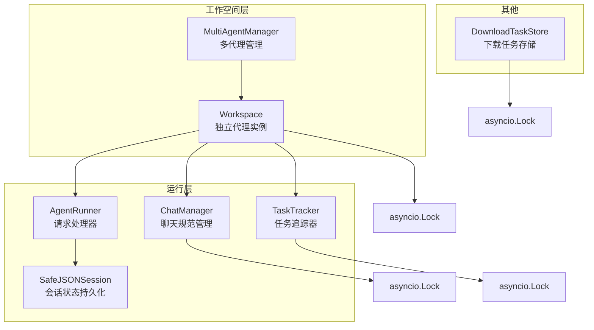
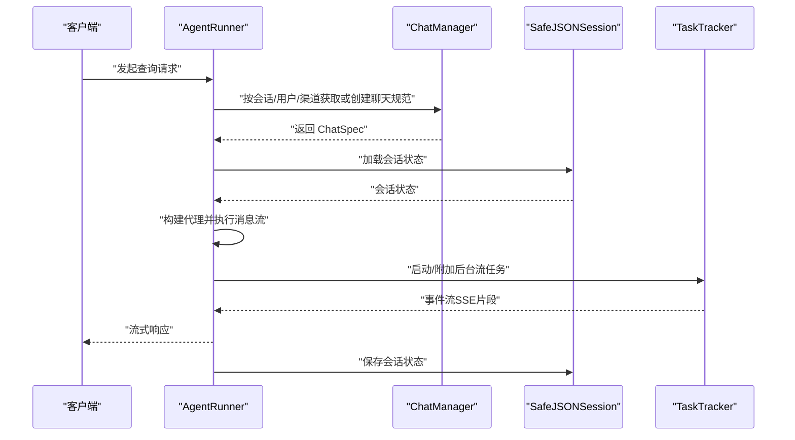
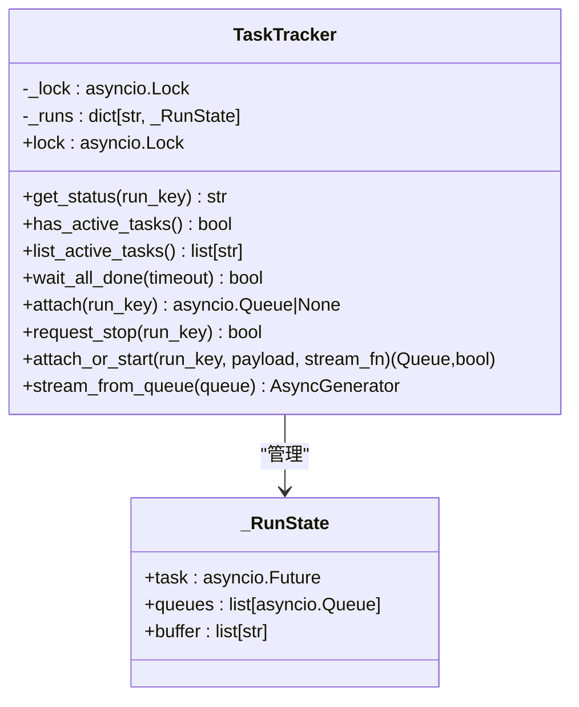
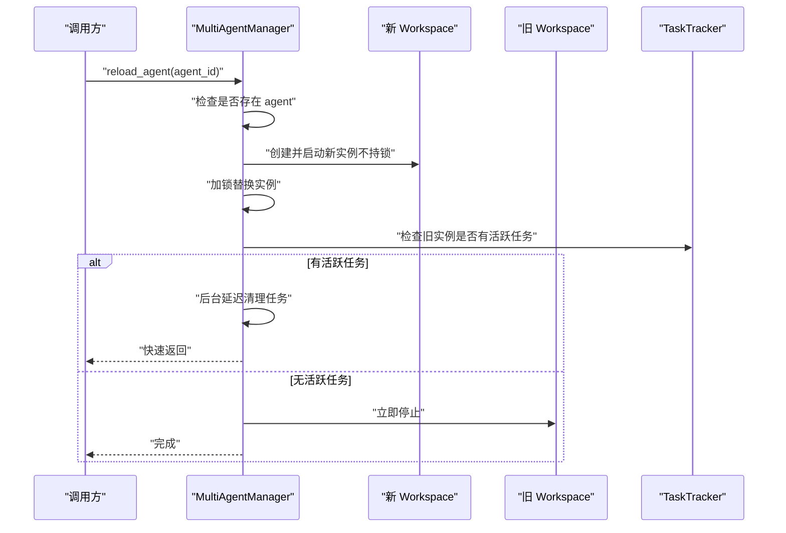
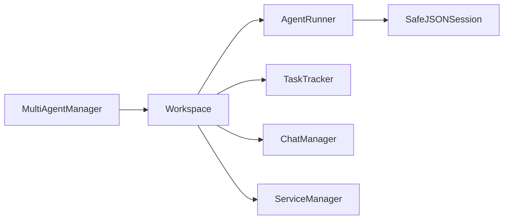

# 代理并发控制机制

<cite>
**本文引用的文件**
- [task_tracker.py](file://src/copaw/app/runner/task_tracker.py)
- [multi_agent_manager.py](file://src/copaw/app/multi_agent_manager.py)
- [workspace.py](file://src/copaw/app/workspace/workspace.py)
- [runner.py](file://src/copaw/app/runner/runner.py)
- [session.py](file://src/copaw/app/runner/session.py)
- [manager.py](file://src/copaw/app/runner/manager.py)
- [download_task_store.py](file://src/copaw/app/download_task_store.py)
</cite>

## 目录
1. [引言](#引言)
2. [项目结构](#项目结构)
3. [核心组件](#核心组件)
4. [架构总览](#架构总览)
5. [详细组件分析](#详细组件分析)
6. [依赖分析](#依赖分析)
7. [性能考量](#性能考量)
8. [故障排查指南](#故障排查指南)
9. [结论](#结论)
10. [附录](#附录)

## 引言
本文件系统性阐述 CoPaw 的代理并发控制机制，重点覆盖以下方面：
- asyncio.Lock 的使用模式与作用域
- 异步任务管理与并发访问控制策略
- 代理实例间的隔离与资源共享
- 冲突解决方案与死锁预防
- 任务追踪器的工作原理、活动任务监控与超时处理
- 资源竞争与性能瓶颈的优化方案
- 并发编程最佳实践、调试技巧与性能优化建议
- 具体并发场景示例与实现细节定位

## 项目结构
围绕并发控制的关键模块分布于应用运行层与工作空间层：
- 运行层：AgentRunner、ChatManager、TaskTracker、SafeJSONSession
- 工作空间层：Workspace、MultiAgentManager
- 下载任务存储：download_task_store（演示并发任务与锁的使用）

图表来源
- [workspace.py:39-122](file://src/copaw/app/workspace/workspace.py#L39-L122)
- [multi_agent_manager.py:17-32](file://src/copaw/app/multi_agent_manager.py#L17-L32)
- [runner.py:63-95](file://src/copaw/app/runner/runner.py#L63-L95)
- [task_tracker.py:31-44](file://src/copaw/app/runner/task_tracker.py#L31-L44)
- [manager.py:26-40](file://src/copaw/app/runner/manager.py#L26-L40)
- [session.py:37-70](file://src/copaw/app/runner/session.py#L37-L70)
- [download_task_store.py:39-40](file://src/copaw/app/download_task_store.py#L39-L40)

章节来源
- [workspace.py:39-122](file://src/copaw/app/workspace/workspace.py#L39-L122)
- [multi_agent_manager.py:17-32](file://src/copaw/app/multi_agent_manager.py#L17-L32)
- [runner.py:63-95](file://src/copaw/app/runner/runner.py#L63-L95)
- [task_tracker.py:31-44](file://src/copaw/app/runner/task_tracker.py#L31-L44)
- [manager.py:26-40](file://src/copaw/app/runner/manager.py#L26-L40)
- [session.py:37-70](file://src/copaw/app/runner/session.py#L37-L70)
- [download_task_store.py:39-40](file://src/copaw/app/download_task_store.py#L39-L40)

## 核心组件
- 多代理管理器（MultiAgentManager）：负责代理实例的懒加载、生命周期管理与零停机热重载；通过 asyncio.Lock 保证并发安全。
- 工作空间（Workspace）：封装单个代理的完整运行时环境，包含 Runner、ChannelManager、MemoryManager、MCPClientManager、CronManager 等，并内置 TaskTracker 用于后台流式任务与重连。
- 任务追踪器（TaskTracker）：以 run_key 为维度维护每个运行实例的任务、队列集合与事件缓冲，使用 asyncio.Lock 保护内部状态，广播事件到多个订阅者队列。
- 请求处理器（AgentRunner）：处理用户查询、自动注册聊天会话、加载/保存会话状态、中断与异常处理。
- 会话管理（SafeJSONSession）：对会话状态进行跨平台安全的异步文件 I/O 持久化。
- 聊天管理（ChatManager）：线程安全地进行 ChatSpec 的 CRUD 操作，使用 asyncio.Lock 保护仓库访问。
- 下载任务存储（DownloadTaskStore）：并发下载任务的状态管理，使用 asyncio.Lock 保护共享字典。

章节来源
- [multi_agent_manager.py:17-32](file://src/copaw/app/multi_agent_manager.py#L17-L32)
- [workspace.py:39-122](file://src/copaw/app/workspace/workspace.py#L39-L122)
- [task_tracker.py:31-44](file://src/copaw/app/runner/task_tracker.py#L31-L44)
- [runner.py:63-95](file://src/copaw/app/runner/runner.py#L63-L95)
- [session.py:37-70](file://src/copaw/app/runner/session.py#L37-L70)
- [manager.py:26-40](file://src/copaw/app/runner/manager.py#L26-L40)
- [download_task_store.py:39-40](file://src/copaw/app/download_task_store.py#L39-L40)

## 架构总览
下图展示并发控制在系统中的关键交互路径：请求进入 AgentRunner，可能触发 ChatManager 自动注册与 SafeJSONSession 的读写；后台流式任务由 TaskTracker 统一管理；多代理管理器在热重载期间协调旧实例与新实例的切换，确保任务不中断。

图表来源
- [runner.py:175-378](file://src/copaw/app/runner/runner.py#L175-L378)
- [manager.py:80-135](file://src/copaw/app/runner/manager.py#L80-L135)
- [session.py:95-132](file://src/copaw/app/runner/session.py#L95-L132)
- [task_tracker.py:124-207](file://src/copaw/app/runner/task_tracker.py#L124-L207)

## 详细组件分析

### 任务追踪器（TaskTracker）
- 角色与职责
  - 以 run_key（通常为 ChatSpec.id）为键，维护每个运行实例的 Future 任务、订阅队列列表与事件缓冲。
  - 使用 asyncio.Lock 保护内部状态变更与广播过程，避免竞态条件。
  - 支持“附加到现有运行”或“启动新运行”，并在取消/错误时清理资源。
- 关键方法与行为
  - get_status：判断任务是否 idle 或 running。
  - has_active_tasks/list_active_tasks：检查与列出活跃任务。
  - wait_all_done：等待所有任务完成，支持超时。
  - attach：为现有运行附加新的订阅队列，预填充事件缓冲。
  - request_stop：取消指定 run_key 的任务。
  - attach_or_start：若存在未完成运行则复用，否则创建新运行并通过弱引用回调更新缓冲与队列。
  - stream_from_queue：从队列消费事件直至收到哨兵值。
- 并发与隔离
  - 所有对 _runs 的修改均在锁内进行；广播阶段同样持有锁，确保一致性。
  - 订阅队列满时会修剪“死亡队列”，防止内存膨胀。
- 死锁预防与资源竞争
  - 锁范围最小化：仅在状态变更与广播期间持有锁；生产者协程在锁外生成事件，减少阻塞。
  - 哨兵值用于优雅结束消费者；错误时写入统一错误事件并继续广播。
- 性能特性
  - 队列最大长度限制，避免无限增长。
  - 事件缓冲可被新订阅者预取，支持断线重连。

图表来源
- [task_tracker.py:22-44](file://src/copaw/app/runner/task_tracker.py#L22-L44)
- [task_tracker.py:31-222](file://src/copaw/app/runner/task_tracker.py#L31-L222)

章节来源
- [task_tracker.py:31-222](file://src/copaw/app/runner/task_tracker.py#L31-L222)

### 多代理管理器（MultiAgentManager）
- 角色与职责
  - 提供代理实例的懒加载、生命周期管理与零停机热重载。
  - 使用 asyncio.Lock 保护代理映射与清理任务集合。
- 零停机热重载流程
  - 创建并启动新实例（不持锁）
  - 在极短时间的锁内原子替换旧实例
  - 对旧实例进行“优雅停止”：若有活跃任务，则在后台等待完成后停止；否则立即停止
  - 延迟清理任务通过 asyncio.create_task 跟踪，避免阻塞主流程
- 并发与隔离
  - 锁仅在实例替换与清理任务集合操作时持有，最大限度降低阻塞。
  - 通过 TaskTracker 查询活跃任务，避免强制中断正在进行的流式任务。
- 死锁预防
  - 不在锁内执行耗时操作；延迟清理任务在后台异步完成。
- 性能特性
  - 启动所有配置代理时使用 asyncio.gather 并发启动，提升冷启动效率。

图表来源
- [multi_agent_manager.py:200-311](file://src/copaw/app/multi_agent_manager.py#L200-L311)
- [multi_agent_manager.py:83-178](file://src/copaw/app/multi_agent_manager.py#L83-L178)

章节来源
- [multi_agent_manager.py:17-32](file://src/copaw/app/multi_agent_manager.py#L17-L32)
- [multi_agent_manager.py:200-311](file://src/copaw/app/multi_agent_manager.py#L200-L311)
- [multi_agent_manager.py:83-178](file://src/copaw/app/multi_agent_manager.py#L83-L178)

### 工作空间（Workspace）
- 角色与职责
  - 封装单个代理的完整运行时组件，包括 Runner、ChannelManager、MemoryManager、MCPClientManager、CronManager。
  - 内置 TaskTracker 用于后台流式任务与重连。
  - 通过 ServiceManager 统一注册与启动服务，支持可复用组件的热重载。
- 并发与隔离
  - 通过 ServiceDescriptor 的 concurrent_init 控制服务初始化的并发性。
  - stop 方法支持 final=False 的场景，用于热重载时保留可复用组件。
- 资源共享
  - set_reusable_components 允许在新实例中复用旧实例的组件（如 MemoryManager、ChatManager），减少重启成本。

章节来源
- [workspace.py:39-122](file://src/copaw/app/workspace/workspace.py#L39-L122)
- [workspace.py:279-310](file://src/copaw/app/workspace/workspace.py#L279-L310)
- [workspace.py:338-357](file://src/copaw/app/workspace/workspace.py#L338-L357)

### 请求处理器（AgentRunner）
- 角色与职责
  - 处理用户查询，自动注册聊天会话，加载/保存会话状态，中断与异常处理。
  - 与 ApprovalService 协作处理工具调用审批，支持超时与人工确认。
- 并发与隔离
  - 会话状态的加载/保存在 finally 中完成，确保即使异常也能持久化。
  - 取消时主动中断代理，抛出特定异常以便上层感知。
- 资源竞争
  - 通过 ChatManager 的 asyncio.Lock 保护仓库访问，避免并发 CRUD 导致的数据不一致。

章节来源
- [runner.py:175-378](file://src/copaw/app/runner/runner.py#L175-L378)
- [manager.py:26-40](file://src/copaw/app/runner/manager.py#L26-L40)

### 会话管理（SafeJSONSession）
- 角色与职责
  - 对会话状态进行跨平台安全的异步文件 I/O 持久化，避免阻塞事件循环。
- 并发与隔离
  - 使用 aiofiles 进行异步读写，减少阻塞。
  - 文件名进行非法字符清洗，确保在 Windows/macOS/Linux 上均可正确保存。

章节来源
- [session.py:37-70](file://src/copaw/app/runner/session.py#L37-L70)
- [session.py:71-132](file://src/copaw/app/runner/session.py#L71-L132)
- [session.py:134-237](file://src/copaw/app/runner/session.py#L134-L237)

### 聊天管理（ChatManager）
- 角色与职责
  - 提供 ChatSpec 的 CRUD 操作，不直接管理 Redis 会话状态。
- 并发与隔离
  - 所有仓库访问在 asyncio.Lock 保护下进行，避免并发写导致的竞争。

章节来源
- [manager.py:26-40](file://src/copaw/app/runner/manager.py#L26-L40)
- [manager.py:44-203](file://src/copaw/app/runner/manager.py#L44-L203)

### 下载任务存储（DownloadTaskStore）
- 角色与职责
  - 管理后台模型下载任务的生命周期：创建、查询、更新状态、取消、清理已完成任务。
- 并发与隔离
  - 使用 asyncio.Lock 保护共享任务字典，确保并发更新的一致性。
- 资源竞争
  - 仅允许对 PENDING/DOWNLOADING 状态的任务进行取消，避免对已完成任务的无效操作。

章节来源
- [download_task_store.py:39-40](file://src/copaw/app/download_task_store.py#L39-L40)
- [download_task_store.py:43-131](file://src/copaw/app/download_task_store.py#L43-L131)

## 依赖分析
- 组件耦合
  - Workspace 内部组合 TaskTracker、ServiceManager、各子管理器，形成高内聚低耦合的运行时容器。
  - MultiAgentManager 仅通过 Workspace 的公共接口与其交互，避免直接访问内部状态。
  - AgentRunner 依赖 ChatManager 与 SafeJSONSession，但不直接持有锁，通过上层管理器协调。
- 外部依赖
  - TaskTracker 依赖 asyncio.Queue 与 asyncio.Lock 实现事件广播与同步。
  - SafeJSONSession 依赖 aiofiles 与 agentscope.SessionBase，确保跨平台文件名安全与异步 I/O。
- 循环依赖
  - 未发现直接循环依赖；Workspace 与 MultiAgentManager 通过弱引用与回调避免强耦合。

图表来源
- [multi_agent_manager.py:17-32](file://src/copaw/app/multi_agent_manager.py#L17-L32)
- [workspace.py:39-122](file://src/copaw/app/workspace/workspace.py#L39-L122)
- [runner.py:63-95](file://src/copaw/app/runner/runner.py#L63-L95)
- [session.py:37-70](file://src/copaw/app/runner/session.py#L37-L70)
- [manager.py:26-40](file://src/copaw/app/runner/manager.py#L26-L40)

章节来源
- [multi_agent_manager.py:17-32](file://src/copaw/app/multi_agent_manager.py#L17-L32)
- [workspace.py:39-122](file://src/copaw/app/workspace/workspace.py#L39-L122)
- [runner.py:63-95](file://src/copaw/app/runner/runner.py#L63-L95)
- [session.py:37-70](file://src/copaw/app/runner/session.py#L37-L70)
- [manager.py:26-40](file://src/copaw/app/runner/manager.py#L26-L40)

## 性能考量
- 锁粒度与范围
  - TaskTracker 与 ChatManager 在状态变更与广播期间持有锁，其余时间释放，降低阻塞。
  - MultiAgentManager 在替换实例与清理任务集合时短暂持锁，其余时间完全并发。
- 队列与缓冲
  - 事件缓冲与队列大小限制有助于控制内存占用；满队列时修剪“死亡队列”避免资源泄漏。
- 并发启动
  - MultiAgentManager 使用 asyncio.gather 并发启动所有配置代理，缩短冷启动时间。
- 异步 I/O
  - SafeJSONSession 使用 aiofiles 异步读写，避免阻塞事件循环。
- 超时与取消
  - TaskTracker.wait_all_done 支持超时，避免无限等待；request_stop 提供显式取消能力。

## 故障排查指南
- 任务无法停止或超时
  - 检查 TaskTracker.request_stop 是否被调用，以及 wait_all_done 的超时参数设置。
  - 若存在大量订阅队列且长时间未消费，可能导致队列满而被修剪，需检查客户端消费逻辑。
- 热重载后旧实例未停止
  - 确认 MultiAgentManager 是否检测到旧实例仍有活跃任务；若等待超时，系统会强制停止。
  - 查看延迟清理任务的回调日志，确认异常与取消状态。
- 会话状态读写异常
  - SafeJSONSession 在文件不存在时可选择跳过加载；若需要严格校验，应允许 NotExist 行为或捕获异常。
- 聊天规范并发冲突
  - ChatManager 的 CRUD 操作受 asyncio.Lock 保护；若出现阻塞，检查是否存在长时间持有锁的操作。
- 下载任务状态异常
  - 仅对 PENDING/DOWNLOADING 状态的任务允许取消；对已完成任务的取消会被忽略。

章节来源
- [task_tracker.py:79-98](file://src/copaw/app/runner/task_tracker.py#L79-L98)
- [task_tracker.py:115-123](file://src/copaw/app/runner/task_tracker.py#L115-L123)
- [multi_agent_manager.py:108-156](file://src/copaw/app/multi_agent_manager.py#L108-L156)
- [session.py:122-132](file://src/copaw/app/runner/session.py#L122-L132)
- [manager.py:164-181](file://src/copaw/app/runner/manager.py#L164-L181)
- [download_task_store.py:96-112](file://src/copaw/app/download_task_store.py#L96-L112)

## 结论
CoPaw 的并发控制以 asyncio.Lock 为核心，结合 TaskTracker 的事件广播与 MultiAgentManager 的零停机热重载策略，实现了代理实例间的强隔离与高效的资源共享。通过最小化锁持有时间、异步 I/O 与并发启动等手段，系统在保证一致性的同时提升了吞吐与可用性。针对死锁、资源竞争与性能瓶颈，本文提供了明确的预防与优化建议，并给出了可操作的故障排查路径。

## 附录
- 最佳实践
  - 将锁范围最小化，仅在必要时持有；在锁外进行耗时操作。
  - 使用队列与缓冲控制内存占用，及时修剪“死亡队列”。
  - 对后台任务采用超时与取消机制，避免无限等待。
  - 利用异步 I/O 替代同步阻塞操作，保持事件循环的响应性。
- 调试技巧
  - 为关键路径添加细粒度日志，记录锁持有与释放点。
  - 使用 TaskTracker 的 list_active_tasks 与 wait_all_done 辅助定位卡顿任务。
  - 在热重载前后对比活跃任务数量，确保无缝切换。
- 性能优化建议
  - 合理设置队列上限与缓冲大小，平衡内存与延迟。
  - 并发启动与初始化服务，缩短启动时间。
  - 对热点数据（如会话状态）进行缓存与批量写入，减少磁盘压力。