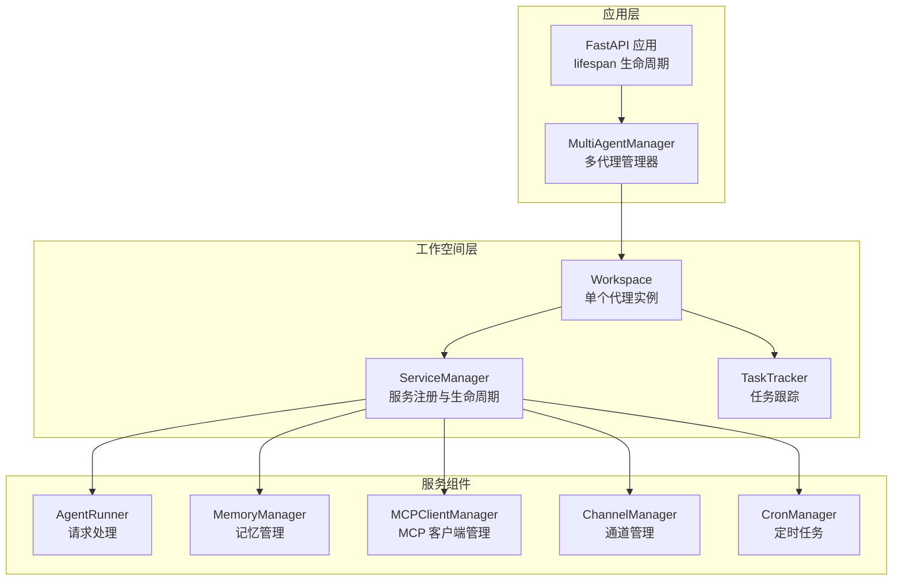
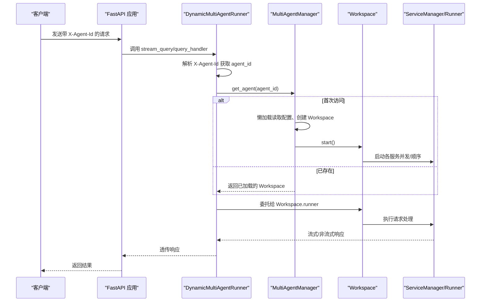
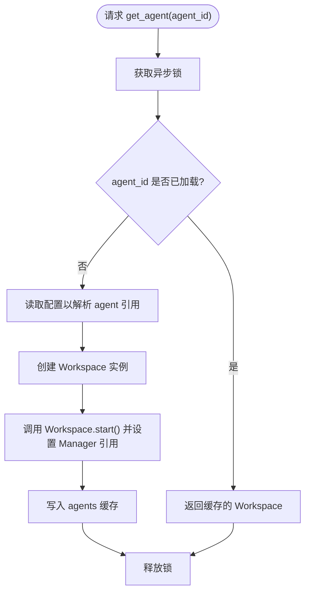
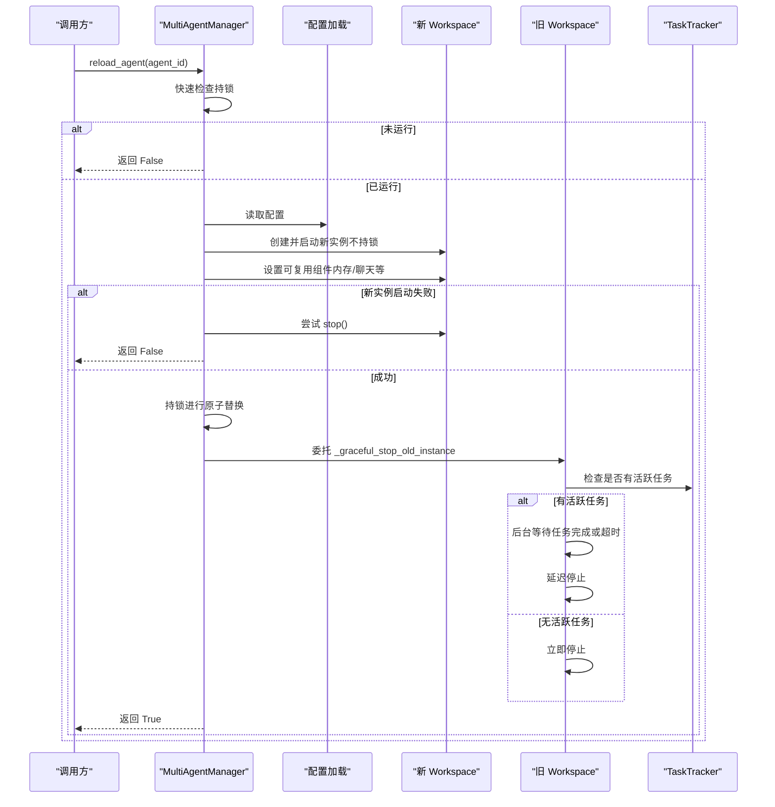
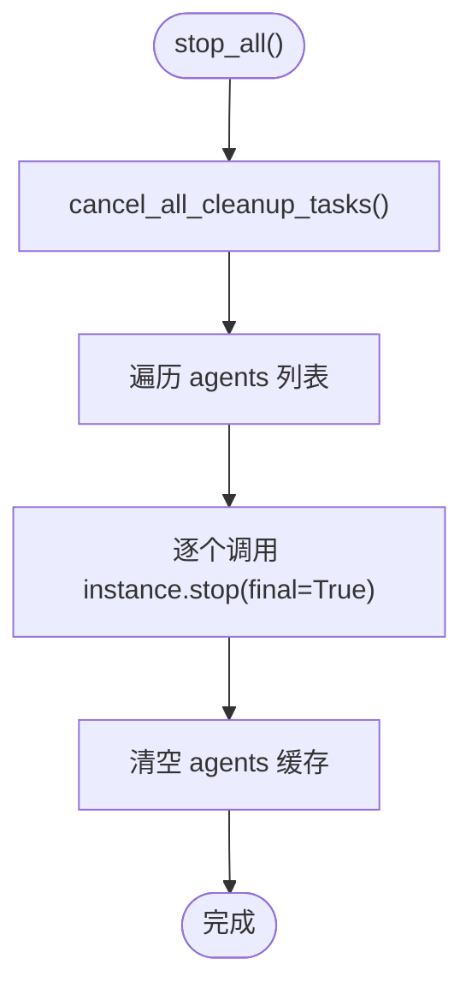
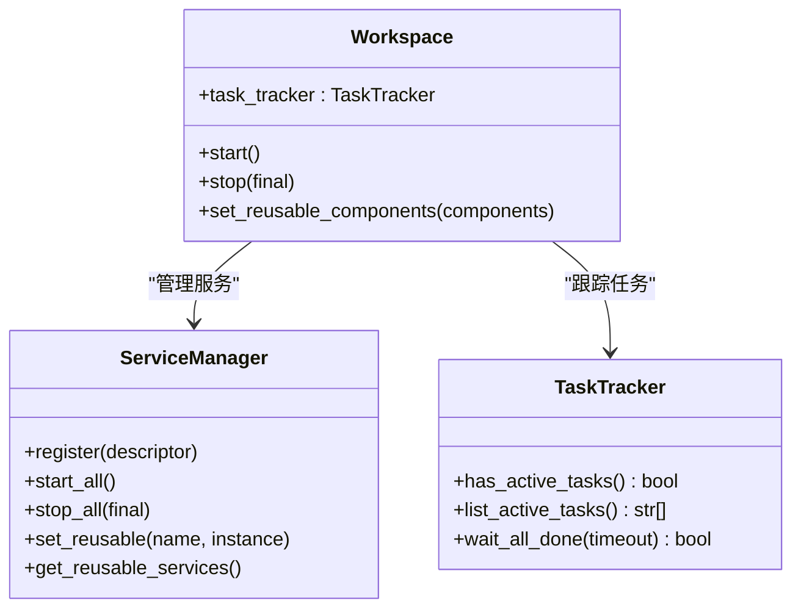
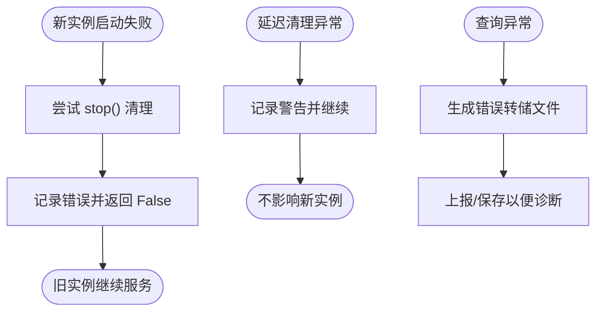
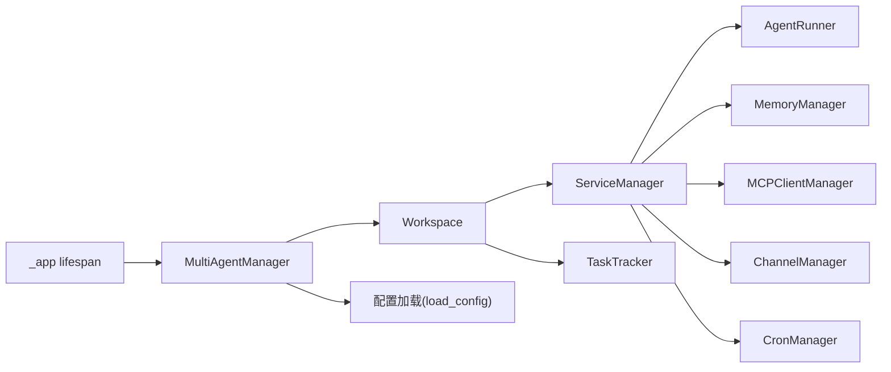

# 多代理生命周期管理

<cite>
**本文引用的文件列表**
- [multi_agent_manager.py](file://src/copaw/app/multi_agent_manager.py)
- [workspace.py](file://src/copaw/app/workspace/workspace.py)
- [service_manager.py](file://src/copaw/app/workspace/service_manager.py)
- [task_tracker.py](file://src/copaw/app/runner/task_tracker.py)
- [_app.py](file://src/copaw/app/_app.py)
- [daemon_cmd.py](file://src/copaw/cli/daemon_cmd.py)
- [config.py](file://src/copaw/config/config.py)
- [react_agent.py](file://src/copaw/agents/react_agent.py)
- [query_error_dump.py](file://src/copaw/app/runner/query_error_dump.py)
</cite>

## 目录
1. [简介](#简介)
2. [项目结构](#项目结构)
3. [核心组件](#核心组件)
4. [架构总览](#架构总览)
5. [详细组件分析](#详细组件分析)
6. [依赖关系分析](#依赖关系分析)
7. [性能考量](#性能考量)
8. [故障排查指南](#故障排查指南)
9. [结论](#结论)
10. [附录](#附录)

## 简介
本文件围绕 CoPaw 的多代理生命周期管理进行系统化文档化，重点阐述 MultiAgentManager 的核心设计理念、懒加载机制与线程安全实现；解释代理实例的创建、启动、停止与重载流程；详述零停机重载算法、优雅关闭机制与资源清理策略；涵盖并发控制、任务跟踪与异常恢复机制，并提供最佳实践、性能监控指标与故障诊断方法。文档同时给出具体代码示例路径与使用场景，帮助读者快速理解并正确使用该能力。

## 项目结构
CoPaw 将多代理管理集中在应用层，通过 MultiAgentManager 统一调度多个 Workspace 实例。每个 Workspace 是一个独立的代理运行时，内部由 ServiceManager 管理服务组件（Runner、ChannelManager、MemoryManager、MCPClientManager、CronManager 等），并通过 TaskTracker 跟踪后台任务状态。

图表来源
- [multi_agent_manager.py:17-451](file://src/copaw/app/multi_agent_manager.py#L17-L451)
- [_app.py:148-200](file://src/copaw/app/_app.py#L148-L200)
- [workspace.py:39-367](file://src/copaw/app/workspace/workspace.py#L39-L367)
- [service_manager.py:74-200](file://src/copaw/app/workspace/service_manager.py#L74-L200)
- [task_tracker.py:31-89](file://src/copaw/app/runner/task_tracker.py#L31-L89)

章节来源
- [multi_agent_manager.py:17-451](file://src/copaw/app/multi_agent_manager.py#L17-L451)
- [_app.py:148-200](file://src/copaw/app/_app.py#L148-L200)

## 核心组件
- MultiAgentManager：集中式多代理管理器，负责懒加载、生命周期管理、零停机重载与优雅关闭。
- Workspace：单个代理实例，封装 Runner、ChannelManager、MemoryManager、MCPClientManager、CronManager 等组件。
- ServiceManager：统一的服务注册、生命周期与依赖管理，支持可复用组件在重载时转移。
- TaskTracker：按 run_key 跟踪后台任务（如流式对话、重连等），用于零停机重载中的延迟清理。
- FastAPI 应用生命周期：在 lifespan 中初始化 MultiAgentManager 并预加载所有已配置代理。

章节来源
- [multi_agent_manager.py:17-451](file://src/copaw/app/multi_agent_manager.py#L17-L451)
- [workspace.py:39-367](file://src/copaw/app/workspace/workspace.py#L39-L367)
- [service_manager.py:74-200](file://src/copaw/app/workspace/service_manager.py#L74-L200)
- [task_tracker.py:31-89](file://src/copaw/app/runner/task_tracker.py#L31-L89)
- [_app.py:148-200](file://src/copaw/app/_app.py#L148-L200)

## 架构总览
下图展示从 FastAPI 请求到具体代理实例的动态路由过程，以及 MultiAgentManager 如何基于请求头选择正确的 Workspace。

图表来源
- [_app.py:49-135](file://src/copaw/app/_app.py#L49-L135)
- [multi_agent_manager.py:34-82](file://src/copaw/app/multi_agent_manager.py#L34-L82)

## 详细组件分析

### MultiAgentManager 设计理念与懒加载
- 懒加载：首次请求某 agent_id 时才创建并启动对应 Workspace，避免启动时的资源浪费。
- 线程安全：使用 asyncio.Lock 保护共享状态（agents 字典、清理任务集合）。
- 可扩展性：支持预加载、并发启动所有已配置代理、按需停止与重载。

图表来源
- [multi_agent_manager.py:34-82](file://src/copaw/app/multi_agent_manager.py#L34-L82)

章节来源
- [multi_agent_manager.py:34-82](file://src/copaw/app/multi_agent_manager.py#L34-L82)

### 零停机重载算法
零停机重载通过“先创建新实例、再原子替换、最后优雅停止旧实例”的三段式策略实现：
- 步骤1：快速检查（持有锁）确认旧实例存在。
- 步骤2：读取配置并创建新 Workspace（不持锁，避免阻塞其他代理）。
- 步骤3：将旧实例中可复用组件（如 MemoryManager、ChatManager）转移到新实例。
- 步骤4：启动新实例，若失败则尽力清理并返回失败。
- 步骤5：最小时间持有锁进行原子替换。
- 步骤6：委托 _graceful_stop_old_instance 优雅停止旧实例：
  - 若存在活跃任务，则创建后台任务等待任务完成或超时后停止；
  - 若无活跃任务，则立即停止。

图表来源
- [multi_agent_manager.py:200-311](file://src/copaw/app/multi_agent_manager.py#L200-L311)
- [multi_agent_manager.py:83-179](file://src/copaw/app/multi_agent_manager.py#L83-L179)
- [workspace.py:279-310](file://src/copaw/app/workspace/workspace.py#L279-L310)

章节来源
- [multi_agent_manager.py:200-311](file://src/copaw/app/multi_agent_manager.py#L200-L311)
- [multi_agent_manager.py:83-179](file://src/copaw/app/multi_agent_manager.py#L83-L179)
- [workspace.py:279-310](file://src/copaw/app/workspace/workspace.py#L279-L310)

### 优雅关闭与资源清理
- stop_agent：停止指定 agent 并移除缓存。
- stop_all：停止所有 agent，优先取消待执行的延迟清理任务，再逐一停止。
- cancel_all_cleanup_tasks：取消并等待所有延迟清理任务完成，确保无孤儿实例。
- ServiceManager 在 final=True 时停止所有服务，final=False 时跳过可复用服务，配合零停机重载。

图表来源
- [multi_agent_manager.py:338-361](file://src/copaw/app/multi_agent_manager.py#L338-L361)
- [multi_agent_manager.py:313-337](file://src/copaw/app/multi_agent_manager.py#L313-L337)
- [service_manager.py:342-379](file://src/copaw/app/workspace/service_manager.py#L342-L379)

章节来源
- [multi_agent_manager.py:338-361](file://src/copaw/app/multi_agent_manager.py#L338-L361)
- [multi_agent_manager.py:313-337](file://src/copaw/app/multi_agent_manager.py#L313-L337)
- [service_manager.py:342-379](file://src/copaw/app/workspace/service_manager.py#L342-L379)

### 并发控制与任务跟踪
- ServiceManager：按优先级分组启动/停止服务，同一优先级内可并发启动，顺序服务串行启动。
- TaskTracker：按 run_key 维护任务状态（idle/running）、活跃任务列表与等待完成能力，用于零停机重载的延迟清理。
- Workspace：在 start/stop 中通过 ServiceManager 统一管理组件生命周期。

图表来源
- [service_manager.py:74-200](file://src/copaw/app/workspace/service_manager.py#L74-L200)
- [service_manager.py:342-379](file://src/copaw/app/workspace/service_manager.py#L342-L379)
- [task_tracker.py:31-89](file://src/copaw/app/runner/task_tracker.py#L31-L89)
- [workspace.py:311-357](file://src/copaw/app/workspace/workspace.py#L311-L357)

章节来源
- [service_manager.py:74-200](file://src/copaw/app/workspace/service_manager.py#L74-L200)
- [service_manager.py:342-379](file://src/copaw/app/workspace/service_manager.py#L342-L379)
- [task_tracker.py:31-89](file://src/copaw/app/runner/task_tracker.py#L31-L89)
- [workspace.py:311-357](file://src/copaw/app/workspace/workspace.py#L311-L357)

### 异常恢复与错误处理
- 零停机重载失败：新实例启动失败时尽力 stop 并返回 False，旧实例继续服务。
- 优雅停止异常：延迟清理过程中出现异常会记录警告并继续清理流程。
- 请求错误转储：查询错误时生成 JSON 错误转储文件，便于诊断。
- MCP 客户端异常恢复：在 ReactAgent 中提供 MCP 客户端重建与重连逻辑，提升稳定性。

图表来源
- [multi_agent_manager.py:274-288](file://src/copaw/app/multi_agent_manager.py#L274-L288)
- [multi_agent_manager.py:131-135](file://src/copaw/app/multi_agent_manager.py#L131-L135)
- [query_error_dump.py:76-104](file://src/copaw/app/runner/query_error_dump.py#L76-L104)
- [react_agent.py:434-462](file://src/copaw/agents/react_agent.py#L434-L462)

章节来源
- [multi_agent_manager.py:274-288](file://src/copaw/app/multi_agent_manager.py#L274-L288)
- [multi_agent_manager.py:131-135](file://src/copaw/app/multi_agent_manager.py#L131-L135)
- [query_error_dump.py:76-104](file://src/copaw/app/runner/query_error_dump.py#L76-L104)
- [react_agent.py:434-462](file://src/copaw/agents/react_agent.py#L434-L462)

### 使用场景与最佳实践
- 动态路由：通过 X-Agent-Id 请求头选择不同代理实例，实现多租户或多角色代理。
- 零停机升级：修改代理配置或模型参数后，使用 reload_agent 实现无缝切换。
- 并发启动：在应用启动阶段并发启动所有已配置代理，缩短冷启动时间。
- 预加载策略：对热点代理进行预加载，降低首访延迟。
- 资源回收：定期调用 stop_all 或针对特定 agent 调用 stop_agent 进行资源回收。

章节来源
- [_app.py:49-135](file://src/copaw/app/_app.py#L49-L135)
- [multi_agent_manager.py:382-445](file://src/copaw/app/multi_agent_manager.py#L382-L445)

## 依赖关系分析
- MultiAgentManager 依赖 Workspace 与配置加载工具，通过 asyncio.Lock 保证线程安全。
- Workspace 依赖 ServiceManager 管理服务组件，依赖 TaskTracker 跟踪任务。
- ServiceManager 内部按优先级与并发策略启动/停止服务，支持可复用组件转移。
- FastAPI 应用在 lifespan 中初始化 MultiAgentManager 并预加载代理。

图表来源
- [multi_agent_manager.py:11-14](file://src/copaw/app/multi_agent_manager.py#L11-L14)
- [workspace.py:17-31](file://src/copaw/app/workspace/workspace.py#L17-L31)
- [_app.py:182-197](file://src/copaw/app/_app.py#L182-L197)

章节来源
- [multi_agent_manager.py:11-14](file://src/copaw/app/multi_agent_manager.py#L11-L14)
- [workspace.py:17-31](file://src/copaw/app/workspace/workspace.py#L17-L31)
- [_app.py:182-197](file://src/copaw/app/_app.py#L182-L197)

## 性能考量
- 懒加载与预加载：按需创建减少启动开销，热点预加载降低首访延迟。
- 并发启动：start_all_configured_agents 并发启动所有代理，缩短启动时间。
- 最小锁持有时间：零停机重载仅在原子替换阶段持锁，其余步骤不持锁，最大化并发度。
- 可复用组件：在重载时转移可复用组件（如 MemoryManager、ChatManager），避免重复初始化。
- 任务等待超时：延迟清理默认等待最多 5 分钟，防止长时间阻塞。

章节来源
- [multi_agent_manager.py:400-445](file://src/copaw/app/multi_agent_manager.py#L400-L445)
- [multi_agent_manager.py:292-311](file://src/copaw/app/multi_agent_manager.py#L292-L311)
- [workspace.py:279-310](file://src/copaw/app/workspace/workspace.py#L279-L310)
- [task_tracker.py:79-89](file://src/copaw/app/runner/task_tracker.py#L79-L89)

## 故障排查指南
- 日志定位：关注 MultiAgentManager 与 Workspace 的日志输出，定位启动/停止/重载阶段的问题。
- CLI 辅助：使用 daemon 子命令查看状态、版本、重载配置与日志尾部，辅助诊断。
- 错误转储：查询异常时生成 JSON 转储文件，包含请求信息与堆栈，便于回溯。
- MCP 客户端恢复：在 ReactAgent 中实现 MCP 客户端重建与重连逻辑，提升稳定性。
- 延迟清理异常：若旧实例延迟清理失败，系统会记录警告并继续，不影响新实例。

章节来源
- [daemon_cmd.py:53-124](file://src/copaw/cli/daemon_cmd.py#L53-L124)
- [query_error_dump.py:76-104](file://src/copaw/app/runner/query_error_dump.py#L76-L104)
- [react_agent.py:434-462](file://src/copaw/agents/react_agent.py#L434-L462)
- [multi_agent_manager.py:131-135](file://src/copaw/app/multi_agent_manager.py#L131-L135)

## 结论
MultiAgentManager 通过懒加载、零停机重载与优雅关闭机制，实现了多代理的高效、稳定与可维护的生命周期管理。结合 ServiceManager 的服务编排与 TaskTracker 的任务跟踪，系统在高并发场景下仍能保持良好的响应性与可靠性。建议在生产环境中采用预加载、并发启动与可复用组件策略，并配合完善的日志与错误转储机制进行持续监控与优化。

## 附录
- 代码示例路径（不含具体代码内容）：
  - 懒加载与获取代理：[get_agent:34-82](file://src/copaw/app/multi_agent_manager.py#L34-L82)
  - 零停机重载流程：[reload_agent:200-311](file://src/copaw/app/multi_agent_manager.py#L200-L311)
  - 优雅停止旧实例：[_graceful_stop_old_instance:83-179](file://src/copaw/app/multi_agent_manager.py#L83-L179)
  - 停止所有代理：[stop_all:338-361](file://src/copaw/app/multi_agent_manager.py#L338-L361)
  - 并发启动所有代理：[start_all_configured_agents:399-445](file://src/copaw/app/multi_agent_manager.py#L399-L445)
  - Workspace 启动与停止：[start/stop:311-357](file://src/copaw/app/workspace/workspace.py#L311-L357)
  - 可复用组件设置：[set_reusable_components:279-310](file://src/copaw/app/workspace/workspace.py#L279-L310)
  - 服务注册与生命周期：[ServiceManager:74-200](file://src/copaw/app/workspace/service_manager.py#L74-L200)
  - 任务跟踪与等待：[TaskTracker:54-89](file://src/copaw/app/runner/task_tracker.py#L54-L89)
  - 应用生命周期初始化：[lifespan:148-200](file://src/copaw/app/_app.py#L148-L200)
  - CLI 调试命令：[daemon 子命令:48-124](file://src/copaw/cli/daemon_cmd.py#L48-L124)
  - 配置结构参考：[agents 配置:877-911](file://src/copaw/config/config.py#L877-L911)