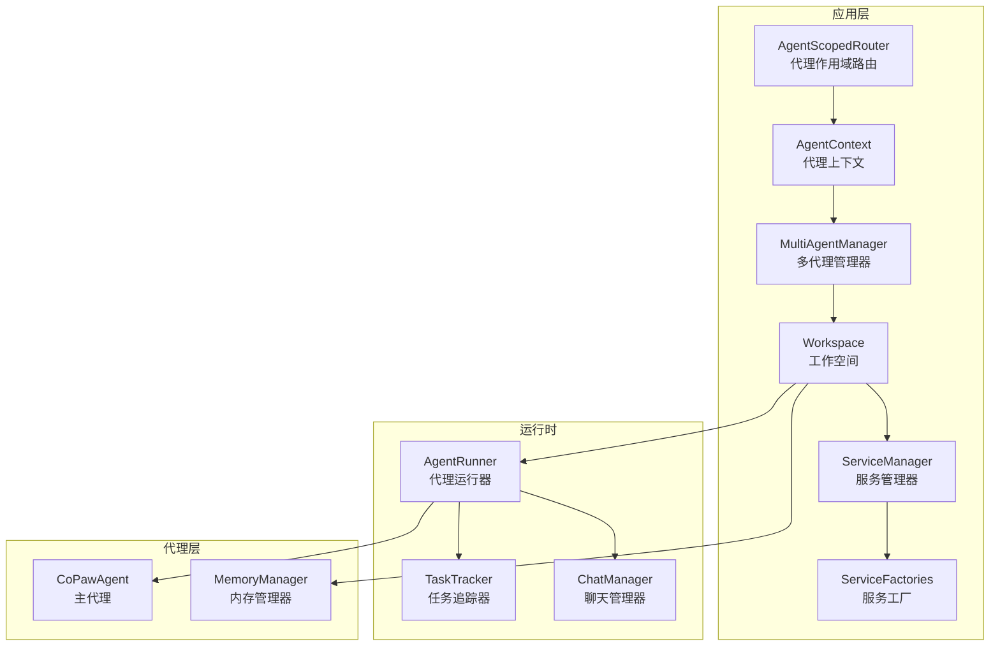
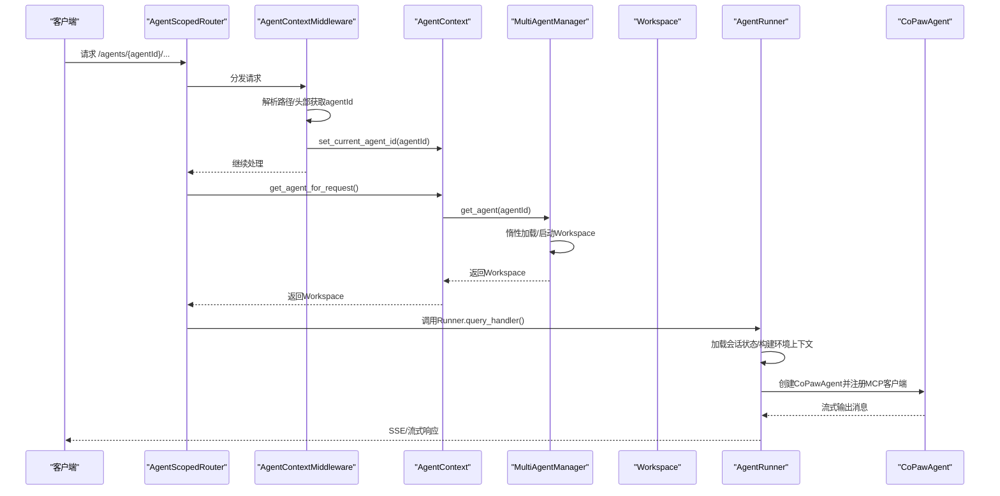
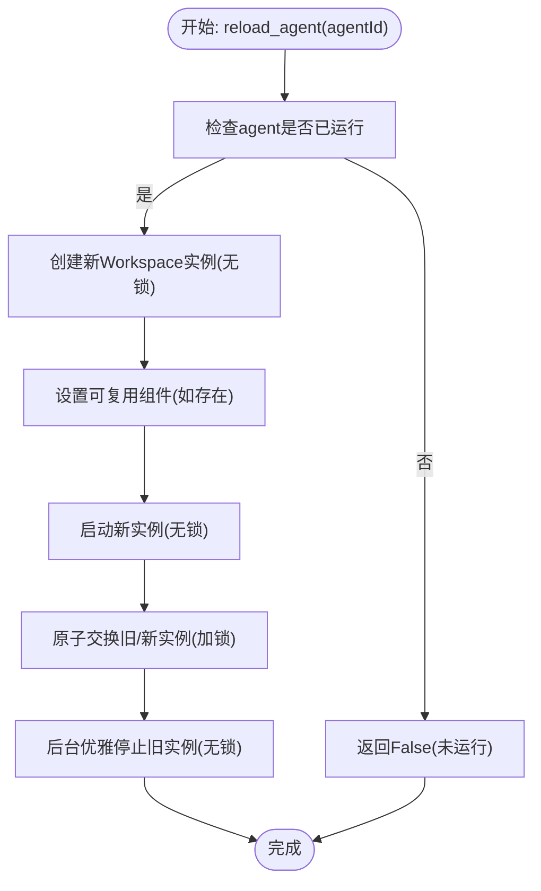
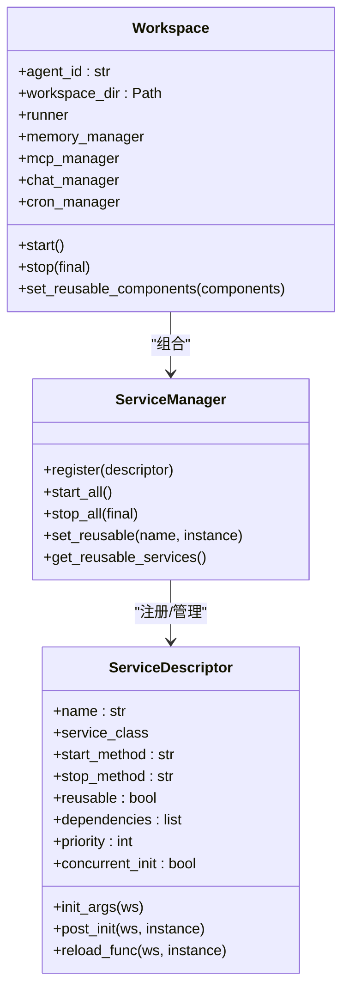
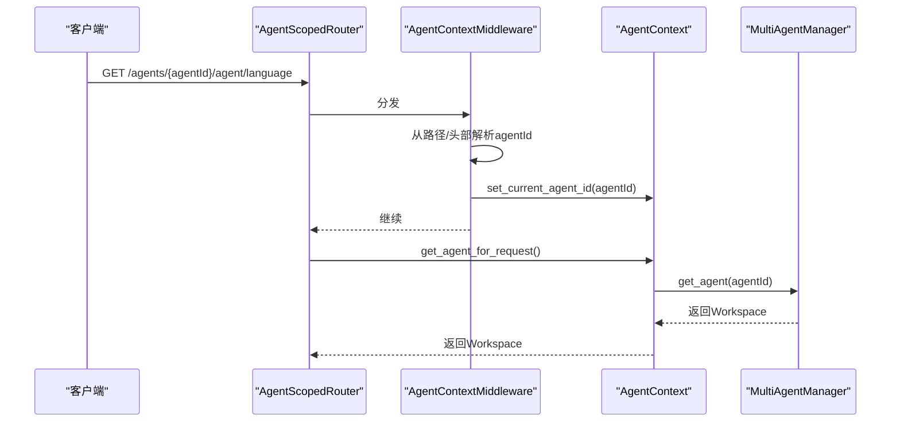
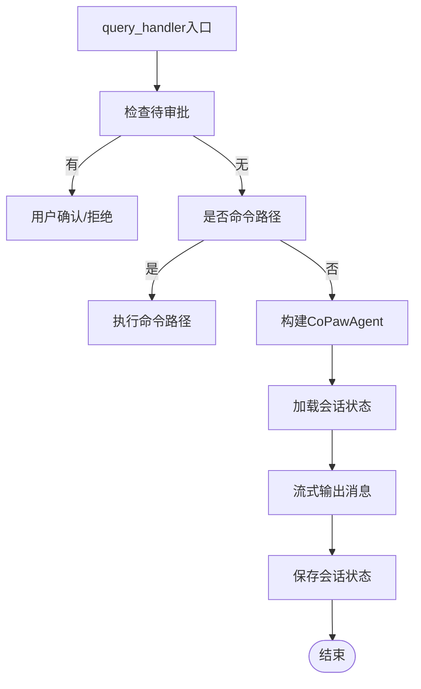
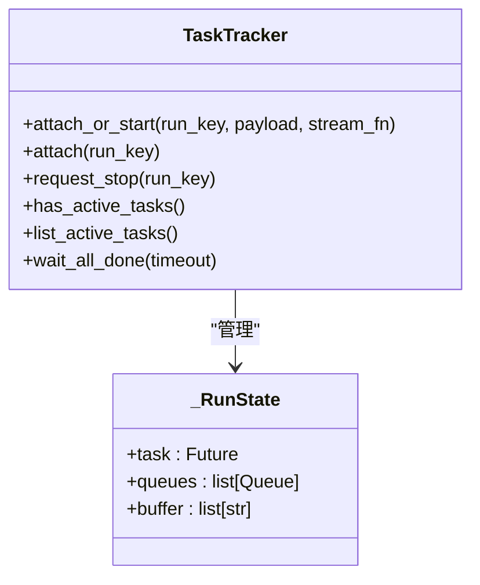
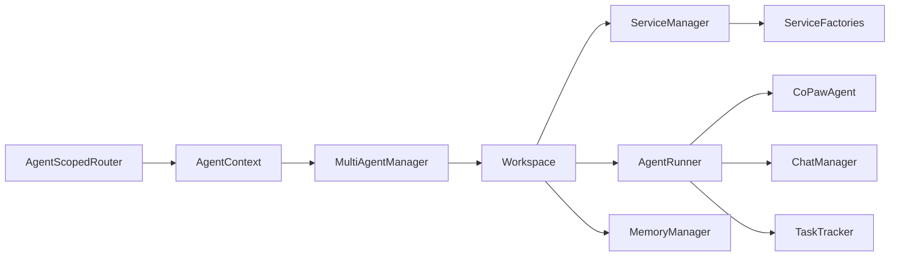

# 多代理系统架构

<cite>
**本文档引用的文件**
- [multi_agent_manager.py](file://src/copaw/app/multi_agent_manager.py)
- [agent_context.py](file://src/copaw/app/agent_context.py)
- [workspace.py](file://src/copaw/app/workspace/workspace.py)
- [service_manager.py](file://src/copaw/app/workspace/service_manager.py)
- [service_factories.py](file://src/copaw/app/workspace/service_factories.py)
- [agent_scoped.py](file://src/copaw/app/routers/agent_scoped.py)
- [agent.py](file://src/copaw/app/routers/agent.py)
- [runner.py](file://src/copaw/app/runner/runner.py)
- [task_tracker.py](file://src/copaw/app/runner/task_tracker.py)
- [config.py](file://src/copaw/config/config.py)
- [react_agent.py](file://src/copaw/agents/react_agent.py)
- [memory_manager.py](file://src/copaw/agents/memory/memory_manager.py)
</cite>

## 目录
1. [简介](#简介)
2. [项目结构](#项目结构)
3. [核心组件](#核心组件)
4. [架构总览](#架构总览)
5. [详细组件分析](#详细组件分析)
6. [依赖关系分析](#依赖关系分析)
7. [性能考虑](#性能考虑)
8. [故障排查指南](#故障排查指南)
9. [结论](#结论)
10. [附录](#附录)

## 简介
本文件面向CoPaw多代理系统，系统性阐述其多代理管理器设计模式、代理实例生命周期与并发控制机制；解释工作空间隔离、服务工厂模式与资源管理策略；文档化代理上下文切换、动态路由与状态同步机制；并给出代理配置管理、内存管理与性能优化策略，以及多代理协作的架构图与数据流示例。

## 项目结构
CoPaw采用“应用层-运行时-代理层”的分层组织：
- 应用层：多代理管理器、工作空间、路由器与中间件
- 运行时：Runner、任务追踪器、聊天管理器
- 代理层：CoPawAgent、内存管理器、工具与技能

图表来源
- [multi_agent_manager.py:17-451](file://src/copaw/app/multi_agent_manager.py#L17-L451)
- [workspace.py:39-367](file://src/copaw/app/workspace/workspace.py#L39-L367)
- [service_manager.py:74-415](file://src/copaw/app/workspace/service_manager.py#L74-L415)
- [service_factories.py:18-164](file://src/copaw/app/workspace/service_factories.py#L18-L164)
- [agent_context.py:22-118](file://src/copaw/app/agent_context.py#L22-L118)
- [agent_scoped.py:15-92](file://src/copaw/app/routers/agent_scoped.py#L15-L92)
- [runner.py:63-515](file://src/copaw/app/runner/runner.py#L63-L515)
- [task_tracker.py:31-222](file://src/copaw/app/runner/task_tracker.py#L31-L222)
- [react_agent.py:63-840](file://src/copaw/agents/react_agent.py#L63-L840)
- [memory_manager.py:43-310](file://src/copaw/agents/memory/memory_manager.py#L43-L310)

章节来源
- [multi_agent_manager.py:17-451](file://src/copaw/app/multi_agent_manager.py#L17-L451)
- [workspace.py:39-367](file://src/copaw/app/workspace/workspace.py#L39-L367)
- [service_manager.py:74-415](file://src/copaw/app/workspace/service_manager.py#L74-L415)
- [service_factories.py:18-164](file://src/copaw/app/workspace/service_factories.py#L18-L164)
- [agent_context.py:22-118](file://src/copaw/app/agent_context.py#L22-L118)
- [agent_scoped.py:15-92](file://src/copaw/app/routers/agent_scoped.py#L15-L92)
- [runner.py:63-515](file://src/copaw/app/runner/runner.py#L63-L515)
- [task_tracker.py:31-222](file://src/copaw/app/runner/task_tracker.py#L31-L222)
- [react_agent.py:63-840](file://src/copaw/agents/react_agent.py#L63-L840)
- [memory_manager.py:43-310](file://src/copaw/agents/memory/memory_manager.py#L43-L310)

## 核心组件
- 多代理管理器（MultiAgentManager）：集中管理多个Workspace实例，支持惰性加载、生命周期管理、零停机热重载与后台清理。
- 工作空间（Workspace）：单个代理的完整运行时容器，封装Runner、ChannelManager、MemoryManager、MCPClientManager、CronManager等组件。
- 服务管理器（ServiceManager）：声明式注册与生命周期管理所有服务，支持优先级、并发初始化、可复用组件与重启回调。
- 服务工厂（ServiceFactories）：将复杂初始化逻辑拆分为可测试的工厂函数，负责MCP、聊天、通道、配置监听等服务的创建与注入。
- 代理上下文（AgentContext）：通过FastAPI中间件与请求上下文变量实现代理ID解析与传递，确保每个请求落到正确的代理实例。
- 代理作用域路由（AgentScopedRouter）：在URL路径与请求头中提取agentId，注入到请求上下文中，实现多代理隔离。
- 代理运行器（AgentRunner）：处理查询、会话状态加载/保存、命令路径、工具守卫审批、MCP客户端热重载与会话持久化。
- 任务追踪器（TaskTracker）：跟踪运行中的任务，支持SSE事件缓冲、断线重连回放、批量取消与超时等待。
- 配置系统（Config）：定义代理配置模型（AgentProfileConfig、AgentsConfig、ToolsConfig等），支持运行时参数与热重载。
- 主代理（CoPawAgent）：基于ReActAgent扩展，集成工具、技能、内存管理、系统提示构建与媒体块降级处理。
- 内存管理器（MemoryManager）：基于ReMeLight的内存压缩、摘要、向量/全文检索能力，并支持嵌入模型热重启。

章节来源
- [multi_agent_manager.py:17-451](file://src/copaw/app/multi_agent_manager.py#L17-L451)
- [workspace.py:39-367](file://src/copaw/app/workspace/workspace.py#L39-L367)
- [service_manager.py:74-415](file://src/copaw/app/workspace/service_manager.py#L74-L415)
- [service_factories.py:18-164](file://src/copaw/app/workspace/service_factories.py#L18-L164)
- [agent_context.py:22-118](file://src/copaw/app/agent_context.py#L22-L118)
- [agent_scoped.py:15-92](file://src/copaw/app/routers/agent_scoped.py#L15-L92)
- [runner.py:63-515](file://src/copaw/app/runner/runner.py#L63-L515)
- [task_tracker.py:31-222](file://src/copaw/app/runner/task_tracker.py#L31-L222)
- [config.py:394-525](file://src/copaw/config/config.py#L394-L525)
- [react_agent.py:63-840](file://src/copaw/agents/react_agent.py#L63-L840)
- [memory_manager.py:43-310](file://src/copaw/agents/memory/memory_manager.py#L43-L310)

## 架构总览
多代理系统以“按需加载 + 零停机热重载”为核心目标，通过以下机制实现：
- 路由层：AgentScopedRouter从路径或头部提取agentId，中间件写入上下文变量
- 上下文层：AgentContext根据优先级解析当前代理ID
- 管理层：MultiAgentManager惰性创建/启动Workspace，支持reload与后台清理
- 运行层：Workspace使用ServiceManager统一管理服务，Runner处理请求与会话状态
- 数据层：TaskTracker保障SSE/流式任务的连续性与可恢复性

图表来源
- [agent_scoped.py:15-92](file://src/copaw/app/routers/agent_scoped.py#L15-L92)
- [agent_context.py:22-118](file://src/copaw/app/agent_context.py#L22-L118)
- [multi_agent_manager.py:34-82](file://src/copaw/app/multi_agent_manager.py#L34-L82)
- [runner.py:175-378](file://src/copaw/app/runner/runner.py#L175-L378)
- [react_agent.py:263-276](file://src/copaw/agents/react_agent.py#L263-L276)

## 详细组件分析

### 多代理管理器（MultiAgentManager）
- 设计要点
  - 惰性加载：首次请求才创建并启动Workspace
  - 生命周期：start/stop/reload，支持零停机热重载
  - 并发安全：全局锁保护实例表，最小化锁持有时间
  - 可靠清理：后台任务跟踪旧实例，避免悬挂资源
- 关键流程
  - get_agent：检查缓存，不存在则读取配置、创建实例并启动
  - reload_agent：原子替换旧实例，后台优雅停止，支持可复用组件迁移
  - stop_all/cancel_all_cleanup_tasks：优雅关闭，取消并等待后台清理任务
- 性能与可靠性
  - 最小化锁持有时间，长耗时步骤在持有锁外完成
  - 后台清理任务集合，避免阻塞主线程
  - 原子交换与双重检查，保证并发安全

图表来源
- [multi_agent_manager.py:200-311](file://src/copaw/app/multi_agent_manager.py#L200-L311)

章节来源
- [multi_agent_manager.py:17-451](file://src/copaw/app/multi_agent_manager.py#L17-L451)

### 工作空间（Workspace）与服务管理
- 设计要点
  - 工作空间隔离：每个agent拥有独立目录与组件实例
  - 服务注册：通过ServiceDescriptor声明式注册，支持优先级、并发初始化、可复用组件与重启回调
  - 工厂注入：通过ServiceFactories将复杂初始化逻辑解耦，便于测试与维护
- 生命周期
  - start：加载配置，按优先级并发启动服务，跳过可复用组件
  - stop：按逆优先级停止服务，final=true时停止可复用组件
  - set_reusable_components：在start前标记可复用组件，用于热重载
- 关键服务
  - Runner：请求处理与会话状态管理
  - MemoryManager：内存压缩、摘要与检索
  - MCPClientManager：MCP客户端管理与热重载
  - ChatManager：聊天规格持久化
  - CronManager：定时任务管理

图表来源
- [workspace.py:39-367](file://src/copaw/app/workspace/workspace.py#L39-L367)
- [service_manager.py:74-415](file://src/copaw/app/workspace/service_manager.py#L74-L415)
- [service_factories.py:18-164](file://src/copaw/app/workspace/service_factories.py#L18-L164)

章节来源
- [workspace.py:39-367](file://src/copaw/app/workspace/workspace.py#L39-L367)
- [service_manager.py:74-415](file://src/copaw/app/workspace/service_manager.py#L74-L415)
- [service_factories.py:18-164](file://src/copaw/app/workspace/service_factories.py#L18-L164)

### 代理上下文与动态路由
- AgentScopedRouter
  - 在路径中提取agentId，注入到request.state.agent_id
  - 支持X-Agent-Id请求头覆盖
- AgentContext
  - 解析优先级：显式参数 > 请求状态 > 请求头 > 配置默认
  - 提供get_agent_for_request，统一获取当前代理的Workspace
- 中间件与上下文变量
  - 中间件将agentId写入contextvar，供后续组件使用

图表来源
- [agent_scoped.py:15-92](file://src/copaw/app/routers/agent_scoped.py#L15-L92)
- [agent_context.py:22-118](file://src/copaw/app/agent_context.py#L22-L118)
- [multi_agent_manager.py:34-82](file://src/copaw/app/multi_agent_manager.py#L34-L82)

章节来源
- [agent_scoped.py:15-92](file://src/copaw/app/routers/agent_scoped.py#L15-L92)
- [agent_context.py:22-118](file://src/copaw/app/agent_context.py#L22-L118)

### 代理运行器与状态同步
- AgentRunner
  - 查询处理：解析待审批项、命令路径、会话自动注册、加载/保存会话状态
  - MCP客户端热重载：从Manager获取最新客户端列表
  - 错误处理：生成调试转储、保留错误上下文
- 会话状态
  - SafeJSONSession持久化会话，支持跨页面导航与刷新
  - 加载时重建系统提示，确保提示文件变更即时生效
- 工具守卫与审批
  - 待审批查询检测与超时处理，支持用户确认/拒绝

图表来源
- [runner.py:175-378](file://src/copaw/app/runner/runner.py#L175-L378)

章节来源
- [runner.py:63-515](file://src/copaw/app/runner/runner.py#L63-L515)

### 任务追踪与并发控制
- TaskTracker
  - per-run状态：任务Future、队列列表、事件缓冲
  - attach_or_start：连接现有运行或启动新运行，预填充缓冲
  - attach：断线重连时回放缓冲并新增订阅
  - request_stop：取消运行
  - wait_all_done：等待所有运行完成，支持超时
- 并发与背压
  - 队列最大长度限制，满载丢弃死订阅
  - 弱引用避免循环引用

图表来源
- [task_tracker.py:31-222](file://src/copaw/app/runner/task_tracker.py#L31-L222)

章节来源
- [task_tracker.py:31-222](file://src/copaw/app/runner/task_tracker.py#L31-L222)

### 配置管理与热重载
- 配置模型
  - AgentProfileConfig：代理配置（通道、MCP、心跳、运行参数、语言、工具、安全等）
  - AgentsConfig：根配置（活动代理、代理引用）
  - ToolsConfig：内置工具开关与显示策略
- 热重载
  - 更新运行配置后异步触发manager.reload_agent，非阻塞
  - 通过AgentScopedRouter与AgentContext确保新配置立即生效

章节来源
- [config.py:394-525](file://src/copaw/config/config.py#L394-L525)
- [agent.py:420-524](file://src/copaw/app/routers/agent.py#L420-L524)

### 内存管理与性能优化
- MemoryManager
  - 基于ReMeLight：消息压缩、摘要生成、向量/全文检索
  - 嵌入配置优先级：配置 > 环境变量 > 默认值
  - 热重启嵌入模型：restart_embedding_model
  - 平台自适应：自动选择本地/Chroma后端
- 性能建议
  - 控制max_input_length与memory_compact_ratio，平衡吞吐与成本
  - 启用/禁用FTS与向量检索，依据部署环境权衡
  - 使用可复用组件（MemoryManager、ChatManager）减少热重载开销

章节来源
- [memory_manager.py:43-310](file://src/copaw/agents/memory/memory_manager.py#L43-L310)

## 依赖关系分析
- 组件耦合
  - MultiAgentManager依赖Workspace与配置加载
  - Workspace依赖ServiceManager与ServiceFactories
  - AgentRunner依赖CoPawAgent、ChatManager、TaskTracker
  - AgentContext依赖MultiAgentManager与配置
- 外部依赖
  - MCP客户端管理（MCPClientManager）
  - 会话存储（SafeJSONSession）
  - 内存后端（ReMeLight）

图表来源
- [multi_agent_manager.py:17-451](file://src/copaw/app/multi_agent_manager.py#L17-L451)
- [workspace.py:39-367](file://src/copaw/app/workspace/workspace.py#L39-L367)
- [service_manager.py:74-415](file://src/copaw/app/workspace/service_manager.py#L74-L415)
- [service_factories.py:18-164](file://src/copaw/app/workspace/service_factories.py#L18-L164)
- [agent_context.py:22-118](file://src/copaw/app/agent_context.py#L22-L118)
- [agent_scoped.py:15-92](file://src/copaw/app/routers/agent_scoped.py#L15-L92)
- [runner.py:63-515](file://src/copaw/app/runner/runner.py#L63-L515)
- [task_tracker.py:31-222](file://src/copaw/app/runner/task_tracker.py#L31-L222)
- [react_agent.py:63-840](file://src/copaw/agents/react_agent.py#L63-L840)
- [memory_manager.py:43-310](file://src/copaw/agents/memory/memory_manager.py#L43-L310)

章节来源
- [multi_agent_manager.py:17-451](file://src/copaw/app/multi_agent_manager.py#L17-L451)
- [workspace.py:39-367](file://src/copaw/app/workspace/workspace.py#L39-L367)
- [service_manager.py:74-415](file://src/copaw/app/workspace/service_manager.py#L74-L415)
- [service_factories.py:18-164](file://src/copaw/app/workspace/service_factories.py#L18-L164)
- [agent_context.py:22-118](file://src/copaw/app/agent_context.py#L22-L118)
- [agent_scoped.py:15-92](file://src/copaw/app/routers/agent_scoped.py#L15-L92)
- [runner.py:63-515](file://src/copaw/app/runner/runner.py#L63-L515)
- [task_tracker.py:31-222](file://src/copaw/app/runner/task_tracker.py#L31-L222)
- [react_agent.py:63-840](file://src/copaw/agents/react_agent.py#L63-L840)
- [memory_manager.py:43-310](file://src/copaw/agents/memory/memory_manager.py#L43-L310)

## 性能考虑
- 并发初始化：ServiceManager按优先级分组，同优先级并发启动，降低启动延迟
- 惰性加载：仅在首次请求创建Workspace，减少冷启动开销
- 零停机热重载：最小化锁持有时间，后台优雅清理，避免请求中断
- 任务追踪背压：队列满载丢弃死订阅，防止内存膨胀
- 内存管理：合理设置max_input_length与压缩比例，启用/禁用向量检索以平衡性能与效果

## 故障排查指南
- 热重载失败
  - 检查新实例启动日志，确认异常并尝试清理失败实例
  - 查看后台清理任务状态，必要时调用cancel_all_cleanup_tasks
- 会话状态异常
  - 确认SafeJSONSession路径与权限
  - 检查会话schema兼容性，必要时允许重新保存
- 工具守卫审批
  - 检查待审批查询与超时设置
  - 确认用户确认/拒绝意图识别正则
- 任务追踪问题
  - 检查队列满载警告，调整订阅端读取节奏
  - 使用wait_all_done等待任务完成，避免资源泄漏

章节来源
- [multi_agent_manager.py:313-336](file://src/copaw/app/multi_agent_manager.py#L313-L336)
- [runner.py:379-487](file://src/copaw/app/runner/runner.py#L379-L487)
- [task_tracker.py:79-97](file://src/copaw/app/runner/task_tracker.py#L79-L97)

## 结论
CoPaw多代理系统通过“代理作用域路由 + 代理上下文 + 多代理管理器 + 工作空间 + 服务管理器 + 运行器 + 任务追踪器”的协同，实现了高可用、可扩展、可热重载的多代理架构。声明式服务注册与工厂模式提升了可维护性，惰性加载与并发初始化兼顾了性能与资源占用。配合完善的配置热重载与内存管理策略，系统能够在生产环境中稳定运行并持续演进。

## 附录
- 多代理协作示例
  - 客户端通过路径/头部指定agentId，中间件注入上下文
  - 路由器将请求转发至对应代理的Workspace
  - 运行器加载会话状态，构建代理实例，流式输出结果
  - 任务追踪器保障SSE/流式任务的连续性与可恢复性

章节来源
- [agent_scoped.py:15-92](file://src/copaw/app/routers/agent_scoped.py#L15-L92)
- [agent_context.py:22-118](file://src/copaw/app/agent_context.py#L22-L118)
- [runner.py:175-378](file://src/copaw/app/runner/runner.py#L175-L378)
- [task_tracker.py:124-207](file://src/copaw/app/runner/task_tracker.py#L124-L207)