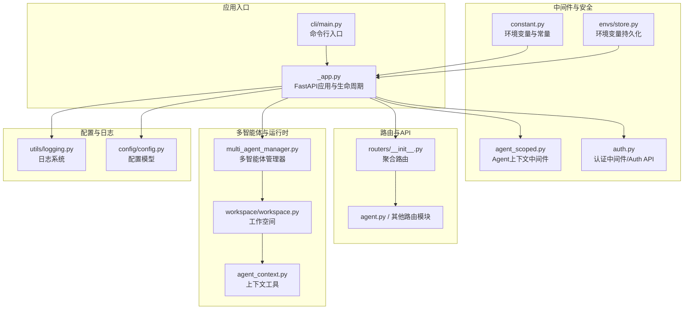
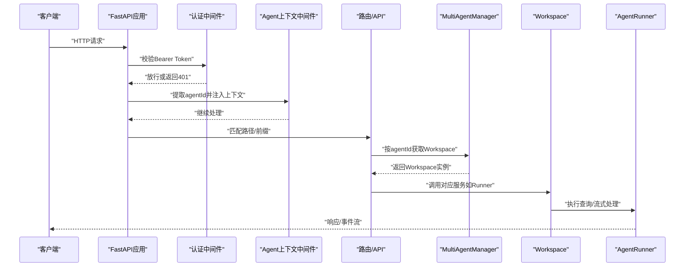
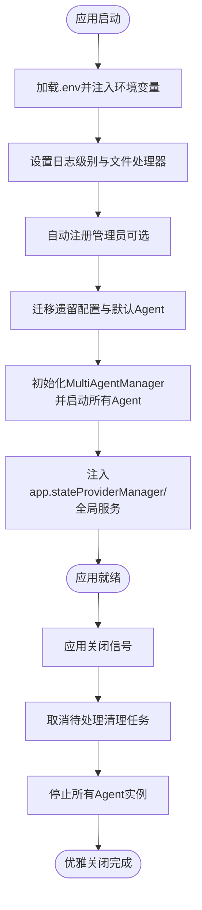
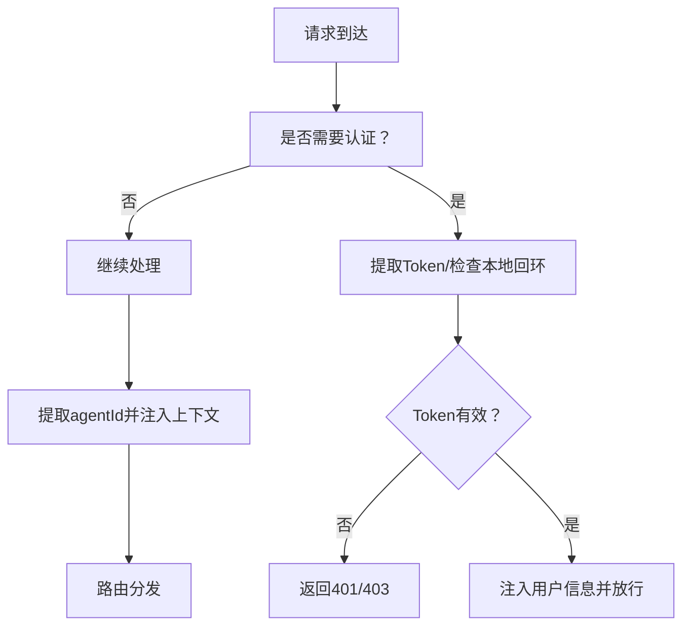
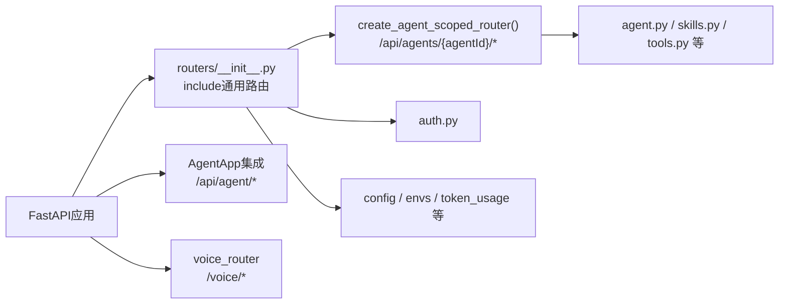
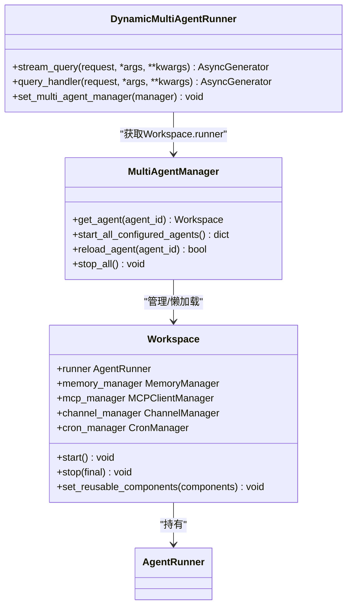
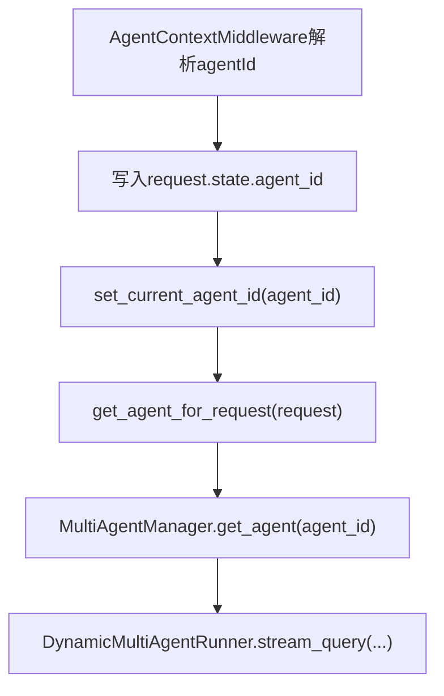
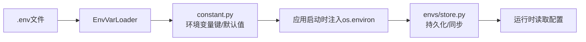
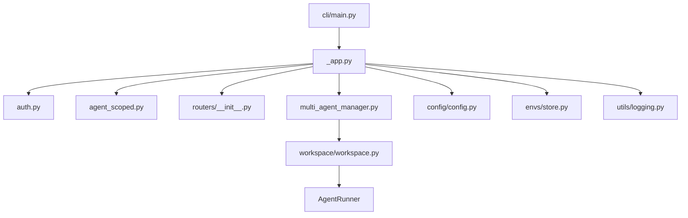

# 应用核心架构

<cite>
**本文档引用的文件**
- [src/copaw/app/_app.py](file://src/copaw/app/_app.py)
- [src/copaw/app/auth.py](file://src/copaw/app/auth.py)
- [src/copaw/app/routers/__init__.py](file://src/copaw/app/routers/__init__.py)
- [src/copaw/app/routers/agent_scoped.py](file://src/copaw/app/routers/agent_scoped.py)
- [src/copaw/app/multi_agent_manager.py](file://src/copaw/app/multi_agent_manager.py)
- [src/copaw/app/workspace/workspace.py](file://src/copaw/app/workspace/workspace.py)
- [src/copaw/app/agent_context.py](file://src/copaw/app/agent_context.py)
- [src/copaw/constant.py](file://src/copaw/constant.py)
- [src/copaw/envs/store.py](file://src/copaw/envs/store.py)
- [src/copaw/utils/logging.py](file://src/copaw/utils/logging.py)
- [src/copaw/config/config.py](file://src/copaw/config/config.py)
- [src/copaw/cli/main.py](file://src/copaw/cli/main.py)
</cite>

## 目录
1. [简介](#简介)
2. [项目结构](#项目结构)
3. [核心组件](#核心组件)
4. [架构总览](#架构总览)
5. [详细组件分析](#详细组件分析)
6. [依赖关系分析](#依赖关系分析)
7. [性能考虑](#性能考虑)
8. [故障排除指南](#故障排除指南)
9. [结论](#结论)

## 简介
本文件面向CoPaw应用的核心架构，围绕FastAPI应用的生命周期管理、中间件系统与路由组织展开，重点覆盖以下主题：
- 应用启动流程、资源初始化与优雅关闭机制
- 认证中间件、CORS配置与安全策略
- 多智能体管理（MultiAgentManager）与AgentApp集成
- 动态代理路由与请求处理机制
- 应用配置、环境变量管理与日志系统
- 架构图展示组件间的依赖关系与数据流向

## 项目结构
CoPaw采用模块化分层设计：应用入口在FastAPI层，业务逻辑分布在多智能体工作空间（Workspace）、路由与中间件层，并通过统一的配置与环境变量管理实现可插拔扩展。

**图表来源**
- [src/copaw/app/_app.py:241-409](file://src/copaw/app/_app.py#L241-L409)
- [src/copaw/app/auth.py:302-368](file://src/copaw/app/auth.py#L302-L368)
- [src/copaw/app/routers/__init__.py:1-56](file://src/copaw/app/routers/__init__.py#L1-L56)
- [src/copaw/app/multi_agent_manager.py:17-451](file://src/copaw/app/multi_agent_manager.py#L17-L451)
- [src/copaw/app/workspace/workspace.py:39-367](file://src/copaw/app/workspace/workspace.py#L39-L367)
- [src/copaw/app/agent_context.py:22-118](file://src/copaw/app/agent_context.py#L22-L118)
- [src/copaw/constant.py:1-201](file://src/copaw/constant.py#L1-L201)
- [src/copaw/envs/store.py:1-243](file://src/copaw/envs/store.py#L1-L243)
- [src/copaw/utils/logging.py:1-185](file://src/copaw/utils/logging.py#L1-L185)
- [src/copaw/config/config.py:1-800](file://src/copaw/config/config.py#L1-L800)
- [src/copaw/cli/main.py:1-173](file://src/copaw/cli/main.py#L1-L173)

**章节来源**
- [src/copaw/app/_app.py:1-409](file://src/copaw/app/_app.py#L1-L409)
- [src/copaw/cli/main.py:1-173](file://src/copaw/cli/main.py#L1-L173)

## 核心组件
- FastAPI应用与生命周期：通过lifespan钩子完成日志、迁移、多智能体初始化与优雅关闭。
- 中间件体系：认证中间件（Bearer Token）、CORS中间件、Agent上下文中间件。
- 路由组织：统一聚合路由，支持通用API与按agentId隔离的代理路由。
- 多智能体管理：MultiAgentManager负责懒加载、零停机热重载与任务追踪。
- 工作空间（Workspace）：封装Runner、ChannelManager、MemoryManager、MCPClientManager、CronManager等组件。
- 配置与环境变量：类型安全的EnvVarLoader、envs.json持久化与注入。
- 日志系统：彩色控制台输出、可选文件处理器与访问日志过滤。

**章节来源**
- [src/copaw/app/_app.py:148-246](file://src/copaw/app/_app.py#L148-L246)
- [src/copaw/app/auth.py:302-368](file://src/copaw/app/auth.py#L302-L368)
- [src/copaw/app/routers/__init__.py:1-56](file://src/copaw/app/routers/__init__.py#L1-L56)
- [src/copaw/app/multi_agent_manager.py:17-451](file://src/copaw/app/multi_agent_manager.py#L17-L451)
- [src/copaw/app/workspace/workspace.py:39-367](file://src/copaw/app/workspace/workspace.py#L39-L367)
- [src/copaw/constant.py:12-201](file://src/copaw/constant.py#L12-L201)
- [src/copaw/envs/store.py:1-243](file://src/copaw/envs/store.py#L1-L243)
- [src/copaw/utils/logging.py:1-185](file://src/copaw/utils/logging.py#L1-L185)

## 架构总览
下图展示了从请求进入、中间件处理、路由分发到多智能体工作空间执行的整体流程。

**图表来源**
- [src/copaw/app/_app.py:241-338](file://src/copaw/app/_app.py#L241-L338)
- [src/copaw/app/auth.py:302-368](file://src/copaw/app/auth.py#L302-L368)
- [src/copaw/app/routers/agent_scoped.py:15-92](file://src/copaw/app/routers/agent_scoped.py#L15-L92)
- [src/copaw/app/multi_agent_manager.py:34-82](file://src/copaw/app/multi_agent_manager.py#L34-L82)
- [src/copaw/app/workspace/workspace.py:311-358](file://src/copaw/app/workspace/workspace.py#L311-L358)

## 详细组件分析

### 生命周期管理与启动/关闭流程
- 启动阶段：
  - 加载.env并注入环境变量，设置日志级别
  - 自动注册管理员账户（若启用）
  - 执行遗留配置迁移与默认Agent确保
  - 初始化MultiAgentManager并并发启动所有已配置Agent
  - 获取ProviderManager实例并注入app.state
  - 设置审批服务的ChannelManager
- 关闭阶段：
  - 取消待处理的延迟清理任务
  - 停止所有Agent实例及其组件
  - 输出优雅关闭完成日志

**图表来源**
- [src/copaw/app/_app.py:148-239](file://src/copaw/app/_app.py#L148-L239)
- [src/copaw/envs/store.py:222-243](file://src/copaw/envs/store.py#L222-L243)
- [src/copaw/utils/logging.py:142-185](file://src/copaw/utils/logging.py#L142-L185)

**章节来源**
- [src/copaw/app/_app.py:148-239](file://src/copaw/app/_app.py#L148-L239)
- [src/copaw/envs/store.py:222-243](file://src/copaw/envs/store.py#L222-L243)
- [src/copaw/utils/logging.py:104-185](file://src/copaw/utils/logging.py#L104-L185)

### 中间件系统与安全策略
- 认证中间件（AuthMiddleware）
  - 仅对受保护路径生效（/api/），跳过OPTIONS与静态资源
  - 支持本地回环地址免认证（便于CLI）
  - 提取Authorization头或WebSocket查询参数中的Bearer Token
  - 返回401/403/404错误码以明确失败原因
- CORS中间件
  - 通过COPAW_CORS_ORIGINS环境变量配置允许的源
  - 允许凭据、方法与头部，暴露Content-Disposition
- Agent上下文中间件（AgentContextMiddleware）
  - 优先从路径提取agentId，其次从X-Agent-Id头
  - 将agentId写入request.state与上下文变量，供后续路由使用

**图表来源**
- [src/copaw/app/auth.py:302-368](file://src/copaw/app/auth.py#L302-L368)
- [src/copaw/app/routers/agent_scoped.py:15-51](file://src/copaw/app/routers/agent_scoped.py#L15-L51)
- [src/copaw/constant.py:167-171](file://src/copaw/constant.py#L167-L171)

**章节来源**
- [src/copaw/app/auth.py:302-368](file://src/copaw/app/auth.py#L302-L368)
- [src/copaw/app/routers/agent_scoped.py:15-51](file://src/copaw/app/routers/agent_scoped.py#L15-L51)
- [src/copaw/constant.py:167-171](file://src/copaw/constant.py#L167-L171)

### 路由组织与动态代理
- 聚合路由：routers/__init__.py统一include各功能路由（agents、agent、config、skills、tools、workspace、envs、token_usage、auth等）
- 代理路由：create_agent_scoped_router将通用路由包装在“/api/agents/{agentId}”前缀下，实现按agentId隔离
- AgentApp集成：通过DynamicMultiAgentRunner动态选择对应Workspace的Runner，支持stream_query/query_handler的异步生成器转发
- 语音通道：voice_router挂载Twilio相关端点，位于根路径而非/api/

**图表来源**
- [src/copaw/app/routers/__init__.py:23-56](file://src/copaw/app/routers/__init__.py#L23-L56)
- [src/copaw/app/routers/agent_scoped.py:53-92](file://src/copaw/app/routers/agent_scoped.py#L53-L92)
- [src/copaw/app/_app.py:327-342](file://src/copaw/app/_app.py#L327-L342)

**章节来源**
- [src/copaw/app/routers/__init__.py:23-56](file://src/copaw/app/routers/__init__.py#L23-L56)
- [src/copaw/app/routers/agent_scoped.py:53-92](file://src/copaw/app/routers/agent_scoped.py#L53-L92)
- [src/copaw/app/_app.py:327-342](file://src/copaw/app/_app.py#L327-L342)

### 多智能体管理与AgentApp集成
- MultiAgentManager
  - 懒加载：首次请求才创建Workspace并启动
  - 零停机热重载：新实例完全启动后原子替换旧实例，后台延迟清理旧实例
  - 并发启动：启动所有已配置Agent
  - 任务追踪：检测活跃任务，避免强制终止
- Workspace
  - 统一的服务管理器（ServiceManager）负责Runner、MemoryManager、MCPClientManager、ChannelManager、CronManager等组件的注册、启动、停止与复用
  - 支持在reload前设置可复用组件，减少重启成本
- AgentApp集成
  - DynamicMultiAgentRunner根据请求中的agentId动态选择Workspace.runner
  - 实现stream_query与query_handler的异步转发，异常时向客户端返回错误消息

**图表来源**
- [src/copaw/app/multi_agent_manager.py:17-451](file://src/copaw/app/multi_agent_manager.py#L17-L451)
- [src/copaw/app/workspace/workspace.py:39-367](file://src/copaw/app/workspace/workspace.py#L39-L367)
- [src/copaw/app/_app.py:49-136](file://src/copaw/app/_app.py#L49-L136)

**章节来源**
- [src/copaw/app/multi_agent_manager.py:17-451](file://src/copaw/app/multi_agent_manager.py#L17-L451)
- [src/copaw/app/workspace/workspace.py:39-367](file://src/copaw/app/workspace/workspace.py#L39-L367)
- [src/copaw/app/_app.py:49-136](file://src/copaw/app/_app.py#L49-L136)

### 请求处理机制与上下文传递
- 上下文工具
  - get_agent_for_request：按优先级解析agentId（参数 > request.state > 头部 > 配置）
  - set_current_agent_id/get_current_agent_id：基于contextvars在异步链路中传递当前agentId
- 代理路由
  - AgentContextMiddleware从路径或头部提取agentId，注入request.state并设置上下文
- 运行时选择
  - DynamicMultiAgentRunner通过get_current_agent_id获取agentId，定位MultiAgentManager中的Workspace.runner

**图表来源**
- [src/copaw/app/routers/agent_scoped.py:18-50](file://src/copaw/app/routers/agent_scoped.py#L18-L50)
- [src/copaw/app/agent_context.py:22-118](file://src/copaw/app/agent_context.py#L22-L118)
- [src/copaw/app/_app.py:64-94](file://src/copaw/app/_app.py#L64-L94)

**章节来源**
- [src/copaw/app/agent_context.py:22-118](file://src/copaw/app/agent_context.py#L22-L118)
- [src/copaw/app/routers/agent_scoped.py:18-50](file://src/copaw/app/routers/agent_scoped.py#L18-L50)
- [src/copaw/app/_app.py:64-94](file://src/copaw/app/_app.py#L64-L94)

### 配置与环境变量管理
- 环境变量加载
  - EnvVarLoader提供类型安全的布尔/整数/浮点/字符串读取，默认值与边界约束
  - constant.py集中定义COPAW_*环境变量键名与默认值
- 环境变量持久化
  - envs/store.py将敏感信息保存在SECRET_DIR下的envs.json，并同步到os.environ（受保护键不注入）
- 配置模型
  - config/config.py定义了Agent、Channel、Tools、Security等配置模型，支持默认值与校验

**图表来源**
- [src/copaw/constant.py:12-201](file://src/copaw/constant.py#L12-L201)
- [src/copaw/envs/store.py:103-243](file://src/copaw/envs/store.py#L103-L243)
- [src/copaw/config/config.py:1-800](file://src/copaw/config/config.py#L1-L800)

**章节来源**
- [src/copaw/constant.py:12-201](file://src/copaw/constant.py#L12-L201)
- [src/copaw/envs/store.py:103-243](file://src/copaw/envs/store.py#L103-L243)
- [src/copaw/config/config.py:1-800](file://src/copaw/config/config.py#L1-L800)

### 日志系统
- 控制台输出：ColorFormatter彩色打印，相对路径显示，支持Windows ANSI增强
- 文件输出：add_copaw_file_handler按平台选择FileHandler或RotatingFileHandler，避免重复句柄
- 访问日志过滤：SuppressPathAccessLogFilter抑制特定路径的uvicorn访问日志

**章节来源**
- [src/copaw/utils/logging.py:104-185](file://src/copaw/utils/logging.py#L104-L185)

## 依赖关系分析
- 组件耦合
  - FastAPI应用通过app.state共享MultiAgentManager与ProviderManager，降低路由层对具体实现的耦合
  - AgentApp集成通过DynamicMultiAgentRunner解耦，仅依赖agent_id解析与Workspace.runner接口
- 外部依赖
  - FastAPI中间件链：AuthMiddleware -> AgentContextMiddleware -> 路由
  - CLI通过click分组命令驱动应用启动与管理

**图表来源**
- [src/copaw/app/_app.py:241-338](file://src/copaw/app/_app.py#L241-L338)
- [src/copaw/app/auth.py:302-368](file://src/copaw/app/auth.py#L302-L368)
- [src/copaw/app/routers/__init__.py:1-56](file://src/copaw/app/routers/__init__.py#L1-L56)
- [src/copaw/app/multi_agent_manager.py:17-451](file://src/copaw/app/multi_agent_manager.py#L17-L451)
- [src/copaw/app/workspace/workspace.py:39-367](file://src/copaw/app/workspace/workspace.py#L39-L367)
- [src/copaw/config/config.py:1-800](file://src/copaw/config/config.py#L1-L800)
- [src/copaw/envs/store.py:1-243](file://src/copaw/envs/store.py#L1-L243)
- [src/copaw/utils/logging.py:1-185](file://src/copaw/utils/logging.py#L1-L185)
- [src/copaw/cli/main.py:1-173](file://src/copaw/cli/main.py#L1-L173)

**章节来源**
- [src/copaw/app/_app.py:241-338](file://src/copaw/app/_app.py#L241-L338)
- [src/copaw/cli/main.py:1-173](file://src/copaw/cli/main.py#L1-L173)

## 性能考虑
- 启动性能
  - MultiAgentManager并发启动所有Agent，缩短冷启动时间
  - Workspace服务按优先级与依赖分组启动，避免不必要的串行
- 运行时性能
  - DynamicMultiAgentRunner仅在必要时创建/切换runner，减少对象创建开销
  - 任务追踪与零停机热重载避免长时间阻塞，提升可用性
- I/O与资源
  - 日志文件处理器按平台优化，避免锁竞争
  - 环境变量持久化与注入减少磁盘IO与进程间通信

## 故障排除指南
- 认证问题
  - 确认COPAW_AUTH_ENABLED开启且已注册用户；检查Authorization头格式与Token有效性
  - 本地回环地址（127.0.0.1）可免认证，用于CLI调试
- CORS问题
  - 检查COPAW_CORS_ORIGINS是否正确配置，确认允许的方法与头部
- 多智能体问题
  - 使用get_agent_for_request的错误信息定位agentId解析失败原因
  - 若出现“Agent not found”，检查配置中agents.profiles是否存在该ID
- 日志排查
  - 启用debug级别日志，结合add_copaw_file_handler输出定位异常
  - 使用SuppressPathAccessLogFilter过滤无关访问日志，聚焦业务日志

**章节来源**
- [src/copaw/app/auth.py:335-368](file://src/copaw/app/auth.py#L335-L368)
- [src/copaw/app/agent_context.py:62-84](file://src/copaw/app/agent_context.py#L62-L84)
- [src/copaw/utils/logging.py:142-185](file://src/copaw/utils/logging.py#L142-L185)

## 结论
CoPaw通过清晰的模块划分与中间件链实现了高内聚、低耦合的应用架构。FastAPI生命周期管理确保资源有序初始化与优雅关闭；多智能体管理器与Workspace抽象提供了灵活的运行时隔离与热重载能力；认证与CORS中间件保障了安全与跨域需求；统一的配置与环境变量管理提升了可维护性与可移植性。整体架构既满足单智能体场景，又为多智能体协作与扩展预留了充足空间。