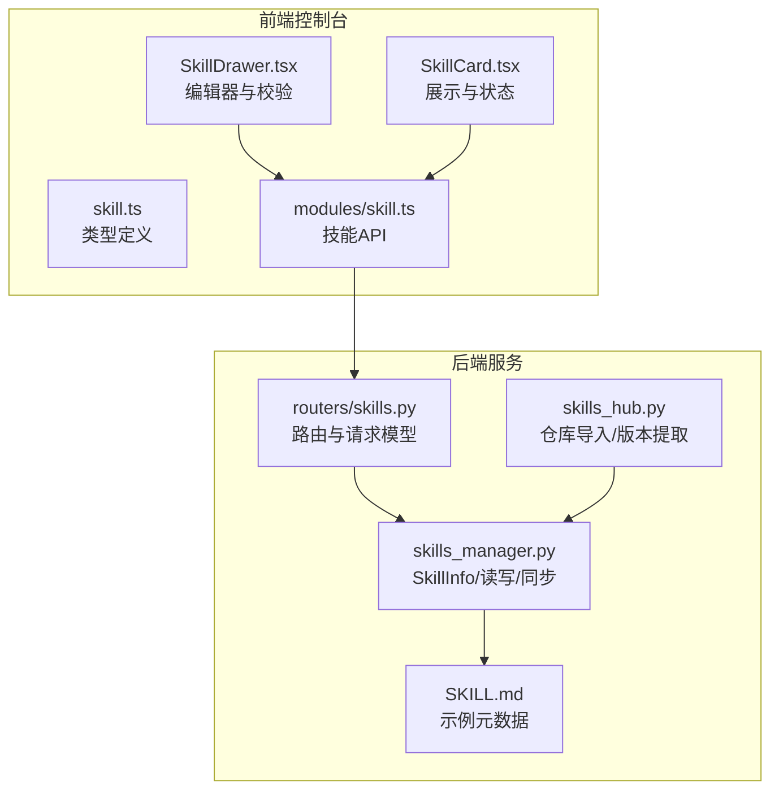
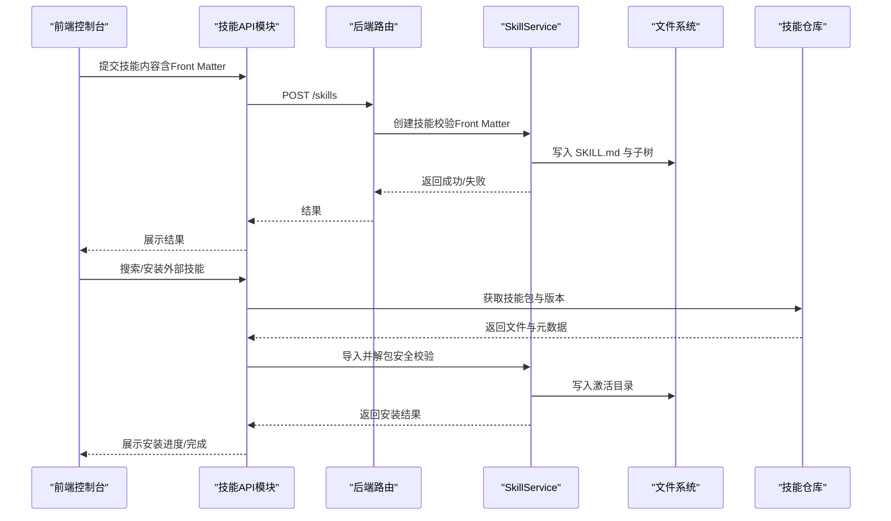
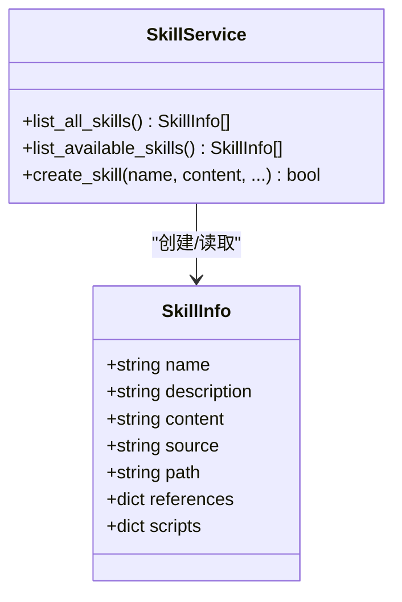
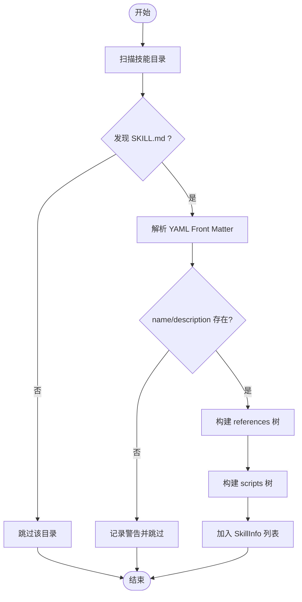
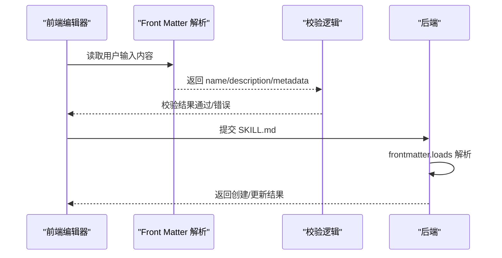
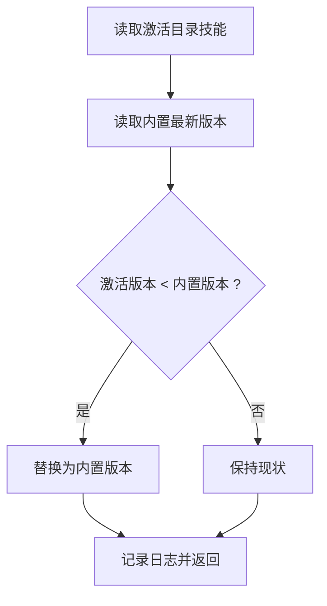
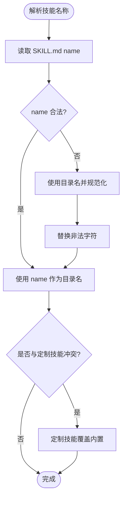
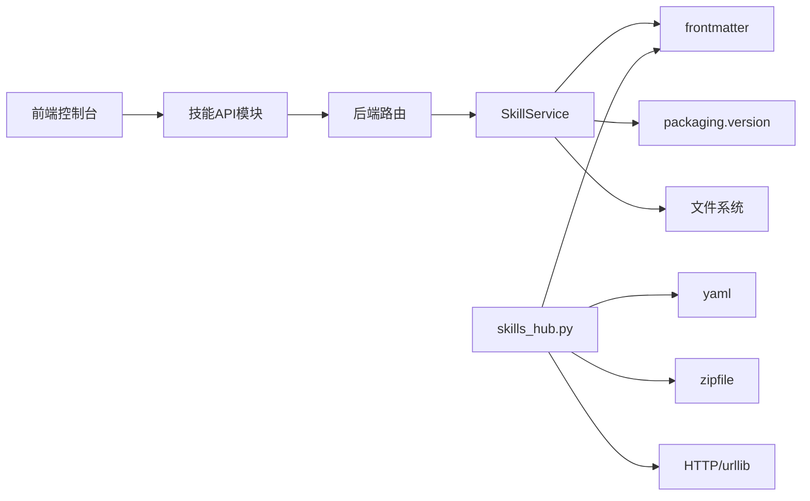

# 技能元数据系统

<cite>
**本文档引用的文件**
- [skills_manager.py](file://src/copaw/agents/skills_manager.py)
- [skills_hub.py](file://src/copaw/agents/skills_hub.py)
- [skill.ts](file://console/src/api/types/skill.ts)
- [skill.ts](file://console/src/api/modules/skill.ts)
- [SkillDrawer.tsx](file://console/src/pages/Agent/Skills/components/SkillDrawer.tsx)
- [SkillCard.tsx](file://console/src/pages/Agent/Skills/components/SkillCard.tsx)
- [SKILL.md（docx）](file://src/copaw/agents/skills/docx/SKILL.md)
- [SKILL.md（pdf）](file://src/copaw/agents/skills/pdf/SKILL.md)
- [SKILL.md（news）](file://src/copaw/agents/skills/news/SKILL.md)
- [SKILL.md（file_reader）](file://src/copaw/agents/skills/file_reader/SKILL.md)
- [skills.py](file://src/copaw/app/routers/skills.py)
</cite>

## 目录
1. [简介](#简介)
2. [项目结构](#项目结构)
3. [核心组件](#核心组件)
4. [架构总览](#架构总览)
5. [详细组件分析](#详细组件分析)
6. [依赖关系分析](#依赖关系分析)
7. [性能考量](#性能考量)
8. [故障排查指南](#故障排查指南)
9. [结论](#结论)
10. [附录](#附录)

## 简介
本文件系统性阐述 CoPaw 技能元数据系统的设计与实现，重点覆盖以下方面：
- SkillInfo 数据模型的字段设计与语义
- 技能元数据的读取、解析与验证流程（含 YAML Front Matter）
- 技能版本管理、兼容性检查与升级策略
- 技能标识符生成、名称规范化与冲突避免机制
- 元数据 schema 定义、验证规则与错误处理
- 元数据编辑工具与最佳实践

该系统以 Python 后端为核心，结合前端控制台对技能进行可视化编辑、校验与导入，形成“前端编辑 + 后端解析 + 版本管理 + 升级策略”的完整闭环。

## 项目结构
围绕技能元数据的关键目录与文件如下：
- 后端核心
  - 技能管理与模型：src/copaw/agents/skills_manager.py
  - 技能仓库与导入：src/copaw/agents/skills_hub.py
  - API 路由与请求模型：src/copaw/app/routers/skills.py
- 前端控制台
  - 类型定义：console/src/api/types/skill.ts
  - 技能 API 模块：console/src/api/modules/skill.ts
  - 技能抽屉与卡片组件：console/src/pages/Agent/Skills/components/SkillDrawer.tsx、SkillCard.tsx
- 示例技能元数据
  - docx、pdf、news、file_reader 的 SKILL.md

图表来源
- [skills_manager.py:28-61](file://src/copaw/agents/skills_manager.py#L28-L61)
- [skills_hub.py:488-633](file://src/copaw/agents/skills_hub.py#L488-L633)
- [skill.ts:1-30](file://console/src/api/types/skill.ts#L1-L30)
- [skill.ts:38-248](file://console/src/api/modules/skill.ts#L38-L248)
- [SKILL.md（docx）:1-6](file://src/copaw/agents/skills/docx/SKILL.md#L1-L6)

章节来源
- [skills_manager.py:1-1206](file://src/copaw/agents/skills_manager.py#L1-L1206)
- [skills_hub.py:1-800](file://src/copaw/agents/skills_hub.py#L1-L800)
- [skill.ts:1-30](file://console/src/api/types/skill.ts#L1-L30)
- [skill.ts:1-249](file://console/src/api/modules/skill.ts#L1-L249)
- [SKILL.md（docx）:1-487](file://src/copaw/agents/skills/docx/SKILL.md#L1-L487)

## 核心组件
- SkillInfo 数据模型
  - 字段：name、description、content、source、path、references、scripts
  - 用途：统一描述内置、定制与激活中的技能信息
- 技能服务 SkillService
  - 列出技能、创建技能、从工作区回写定制技能、同步内置与定制技能到激活目录
- 技能仓库客户端
  - 解析外部技能包、提取版本信息、下载并解包、安全校验
- 前端技能编辑器
  - 基于 YAML Front Matter 的校验、Markdown 预览与优化流式输出

章节来源
- [skills_manager.py:28-61](file://src/copaw/agents/skills_manager.py#L28-L61)
- [skills_manager.py:627-800](file://src/copaw/agents/skills_manager.py#L627-L800)
- [skills_hub.py:488-633](file://src/copaw/agents/skills_hub.py#L488-L633)
- [SkillDrawer.tsx:1-253](file://console/src/pages/Agent/Skills/components/SkillDrawer.tsx#L1-L253)
- [skill.ts:1-30](file://console/src/api/types/skill.ts#L1-L30)

## 架构总览
技能元数据系统采用“前端编辑 + 后端解析 + 仓库导入 + 版本管理”的分层架构。前端负责用户交互与基础校验；后端负责技能树构建、元数据解析、版本比较与升级；仓库模块负责从外部源获取技能包并进行安全解包。

图表来源
- [skill.ts:38-148](file://console/src/api/modules/skill.ts#L38-L148)
- [skills.py:57-89](file://src/copaw/app/routers/skills.py#L57-L89)
- [skills_manager.py:699-800](file://src/copaw/agents/skills_manager.py#L699-L800)
- [skills_hub.py:488-633](file://src/copaw/agents/skills_hub.py#L488-L633)

## 详细组件分析

### SkillInfo 数据模型与字段语义
- name：技能名称，作为目录名与唯一标识
- description：技能描述，用于 UI 展示
- content：完整的 SKILL.md 文本（含 YAML Front Matter）
- source：来源标记（builtin/customized/active）
- path：技能根目录路径
- references/scripts：技能资源树（字典嵌套结构），支持扁平或嵌套
- 设计要点
  - 通过 frontmatter.loads 解析 YAML Front Matter，确保 name 与 description 存在
  - 目录树结构统一使用字典表示：文件为 None，目录为嵌套字典
  - 支持从 zip 包中恢复 references/scripts 与额外文件

图表来源
- [skills_manager.py:28-61](file://src/copaw/agents/skills_manager.py#L28-L61)
- [skills_manager.py:627-800](file://src/copaw/agents/skills_manager.py#L627-L800)

章节来源
- [skills_manager.py:28-61](file://src/copaw/agents/skills_manager.py#L28-L61)
- [skills_manager.py:394-471](file://src/copaw/agents/skills_manager.py#L394-L471)

### 技能元数据读取、解析与验证
- 读取流程
  - 扫描内置与定制目录，定位每个技能目录下的 SKILL.md
  - 使用 frontmatter.loads 解析 YAML Front Matter，提取 name、description
  - 递归构建 references 与 scripts 子树
- 验证规则
  - 必须包含 name 与 description
  - 若解析失败，记录警告并跳过该技能
- 错误处理
  - 文件编码异常、权限不足、路径不合法时记录日志并继续处理其他技能

图表来源
- [skills_manager.py:394-471](file://src/copaw/agents/skills_manager.py#L394-L471)

章节来源
- [skills_manager.py:394-471](file://src/copaw/agents/skills_manager.py#L394-L471)

### YAML Front Matter 处理与前端校验
- 后端解析
  - 使用 frontmatter.loads 读取 SKILL.md 的 YAML 头部
  - 从 metadata 中读取内置技能版本号（如 builtin_skill_version）
- 前端校验
  - 在编辑器中解析 Front Matter，要求 name 与 description 存在
  - 提供 Markdown 预览与 AI 优化流式输出

图表来源
- [SkillDrawer.tsx:14-77](file://console/src/pages/Agent/Skills/components/SkillDrawer.tsx#L14-L77)
- [skills_manager.py:752-775](file://src/copaw/agents/skills_manager.py#L752-L775)

章节来源
- [SkillDrawer.tsx:14-77](file://console/src/pages/Agent/Skills/components/SkillDrawer.tsx#L14-L77)
- [skills_manager.py:752-775](file://src/copaw/agents/skills_manager.py#L752-L775)

### 技能版本管理、兼容性检查与升级策略
- 版本来源
  - 内置技能：从 SKILL.md 的 metadata.builtin_skill_version 读取
- 升级策略
  - 当激活目录中的技能版本低于内置最新版本时，自动回写内置版本
  - 定制技能优先级高于内置，仅当定制版本较旧时才回写
- 回写流程
  - 比较版本号（使用 packaging.version.Version）
  - 若内置版本更高，则替换激活目录中的技能

图表来源
- [skills_manager.py:297-318](file://src/copaw/agents/skills_manager.py#L297-L318)
- [skills_manager.py:142-161](file://src/copaw/agents/skills_manager.py#L142-L161)

章节来源
- [skills_manager.py:297-318](file://src/copaw/agents/skills_manager.py#L297-L318)
- [skills_manager.py:142-161](file://src/copaw/agents/skills_manager.py#L142-L161)

### 技能标识符生成、名称规范化与冲突避免
- 名称规范化
  - 优先使用 SKILL.md 中的 name 字段
  - 若缺失或非法，回退到目录名，并用正则替换非法字符
- 冲突避免
  - 定制技能覆盖内置同名技能
  - 同步时若定制版本变更，优先回写定制版本
- 目录命名
  - sanitize_skill_dir_name 将包含斜杠等非法字符的显示名转换为安全目录名

图表来源
- [skills_manager.py:552-567](file://src/copaw/agents/skills_manager.py#L552-L567)
- [skills_manager.py:644-647](file://src/copaw/agents/skills_manager.py#L644-L647)
- [skills_manager.py:699-700](file://src/copaw/agents/skills_manager.py#L699-L700)

章节来源
- [skills_manager.py:552-567](file://src/copaw/agents/skills_manager.py#L552-L567)
- [skills_manager.py:644-647](file://src/copaw/agents/skills_manager.py#L644-L647)
- [skills_manager.py:699-700](file://src/copaw/agents/skills_manager.py#L699-L700)

### 元数据 schema 定义、验证规则与错误处理
- schema 要求
  - 必填：name、description
  - 可选：metadata（如 builtin_skill_version）、license 等
- 验证规则
  - Front Matter 必须可解析且包含 name 与 description
  - references/scripts 支持嵌套字典结构，需进行安全过滤
- 错误处理
  - 解析失败：记录警告并跳过
  - 路径不安全：拒绝 zip 中的符号链接与越界路径
  - 超大压缩包：限制未压缩大小

章节来源
- [skills_manager.py:752-775](file://src/copaw/agents/skills_manager.py#L752-L775)
- [skills_manager.py:473-520](file://src/copaw/agents/skills_manager.py#L473-L520)
- [skills_manager.py:529-550](file://src/copaw/agents/skills_manager.py#L529-L550)

### 元数据编辑工具与最佳实践
- 编辑器功能
  - Front Matter 校验（name/description 必填）
  - Markdown 预览与复制
  - AI 优化流式输出（SSE）
- 最佳实践
  - 始终在 Front Matter 中设置清晰的 name 与 description
  - 使用 metadata.builtin_skill_version 管理内置技能版本
  - 将依赖脚本与参考文档放入 references/scripts 子树
  - 避免在 SKILL.md 中硬编码敏感信息，必要时使用环境变量或外部配置

章节来源
- [SkillDrawer.tsx:59-77](file://console/src/pages/Agent/Skills/components/SkillDrawer.tsx#L59-L77)
- [SkillDrawer.tsx:150-253](file://console/src/pages/Agent/Skills/components/SkillDrawer.tsx#L150-L253)
- [SKILL.md（docx）:1-6](file://src/copaw/agents/skills/docx/SKILL.md#L1-L6)
- [SKILL.md（pdf）:1-6](file://src/copaw/agents/skills/pdf/SKILL.md#L1-L6)
- [SKILL.md（news）:4-12](file://src/copaw/agents/skills/news/SKILL.md#L4-L12)
- [SKILL.md（file_reader）:4-12](file://src/copaw/agents/skills/file_reader/SKILL.md#L4-L12)

## 依赖关系分析
- 组件耦合
  - SkillService 依赖 frontmatter 与 packaging.version 进行解析与版本比较
  - skills_hub.py 依赖 frontmatter、yaml、urllib、zipfile 等进行远程导入与安全校验
  - 前端 skill.ts 与 modules/skill.ts 定义了与后端一致的数据契约
- 外部依赖
  - frontmatter：解析 YAML Front Matter
  - yaml：解析仓库返回的 JSON/YAML
  - packaging.version：语义化版本比较
  - urllib/requests：HTTP 请求与重试、超时、背压

图表来源
- [skills_manager.py:12-14](file://src/copaw/agents/skills_manager.py#L12-L14)
- [skills_hub.py:22-23](file://src/copaw/agents/skills_hub.py#L22-L23)
- [skill.ts:38-248](file://console/src/api/modules/skill.ts#L38-L248)

章节来源
- [skills_manager.py:12-14](file://src/copaw/agents/skills_manager.py#L12-L14)
- [skills_hub.py:22-23](file://src/copaw/agents/skills_hub.py#L22-L23)
- [skill.ts:38-248](file://console/src/api/modules/skill.ts#L38-L248)

## 性能考量
- I/O 与解析
  - 扫描技能目录与 frontmatter.loads 为 O(n) 操作，建议缓存已解析技能列表
- 网络导入
  - 技能仓库导入支持超时、重试与指数退避，避免瞬时网络波动影响
- 压缩包安全
  - 限制未压缩大小与 zip 项数量，拒绝符号链接与越界路径，防止资源耗尽攻击

## 故障排查指南
- Front Matter 缺失或格式错误
  - 现象：创建/导入失败，日志提示解析失败
  - 处理：确保 SKILL.md 顶部包含合法 YAML Front Matter，包含 name 与 description
- 版本不兼容
  - 现象：内置技能版本高于激活版本但未自动回写
  - 处理：确认 metadata.builtin_skill_version 设置正确；手动触发同步或删除旧版本
- 导入失败（仓库）
  - 现象：HTTP 429/5xx 或速率限制
  - 处理：设置 GITHUB_TOKEN 提高配额；重试或更换镜像源
- 安全校验失败（zip）
  - 现象：导入时报路径不安全或大小超限
  - 处理：检查压缩包结构，移除符号链接与越界路径；拆分大包

章节来源
- [skills_manager.py:464-468](file://src/copaw/agents/skills_manager.py#L464-L468)
- [skills_manager.py:529-550](file://src/copaw/agents/skills_manager.py#L529-L550)
- [skills_hub.py:251-301](file://src/copaw/agents/skills_hub.py#L251-L301)
- [skills_hub.py:657-667](file://src/copaw/agents/skills_hub.py#L657-L667)

## 结论
CoPaw 技能元数据系统通过统一的 SkillInfo 模型与严格的 Front Matter 校验，实现了技能的标准化管理。结合版本比较与自动回写机制，保证了内置技能的持续演进与兼容性。前端编辑器与仓库导入能力进一步提升了用户体验与可扩展性。建议在生产环境中启用版本管理与安全校验，并遵循最佳实践以获得稳定可靠的技能生态。

## 附录
- 示例元数据字段
  - name：技能名称
  - description：技能描述
  - metadata：包含 builtin_skill_version 等
  - license：许可证信息
- 示例技能参考
  - [SKILL.md（docx）:1-6](file://src/copaw/agents/skills/docx/SKILL.md#L1-L6)
  - [SKILL.md（pdf）:1-6](file://src/copaw/agents/skills/pdf/SKILL.md#L1-L6)
  - [SKILL.md（news）:4-12](file://src/copaw/agents/skills/news/SKILL.md#L4-L12)
  - [SKILL.md（file_reader）:4-12](file://src/copaw/agents/skills/file_reader/SKILL.md#L4-L12)