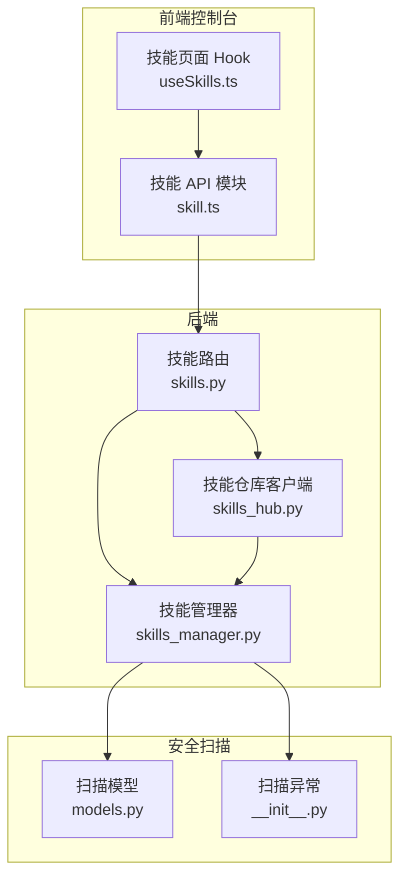
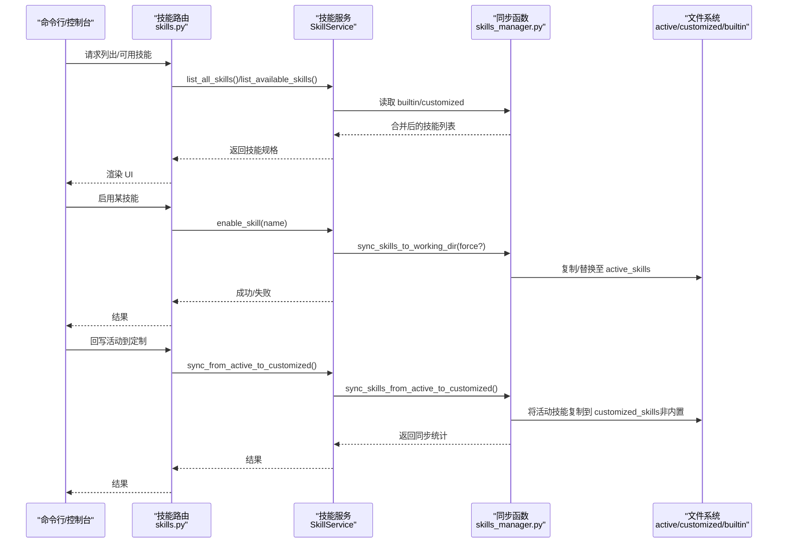
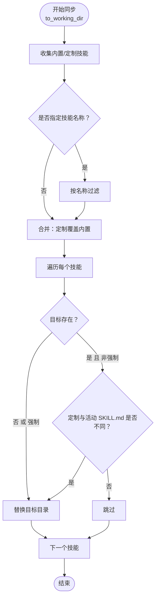
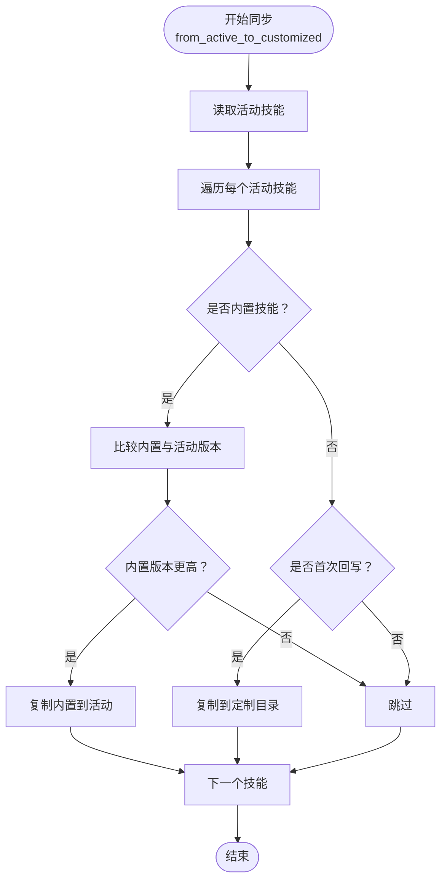
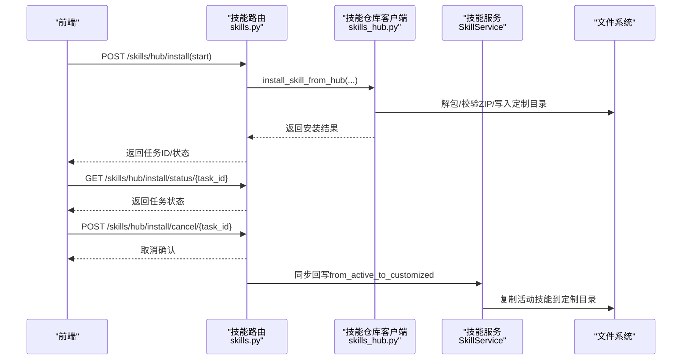
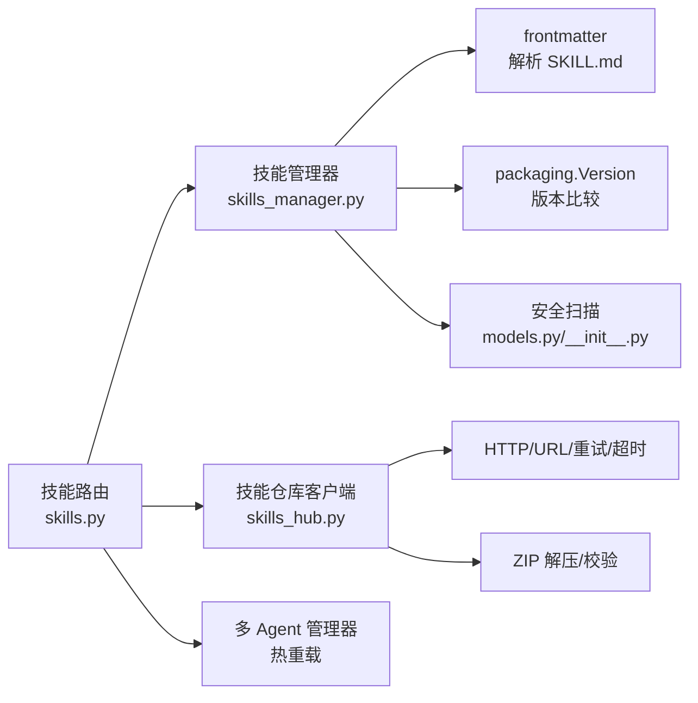

# 技能同步机制

<cite>
**本文引用的文件**
- [skills_manager.py](file://src/copaw/agents/skills_manager.py)
- [skills_hub.py](file://src/copaw/agents/skills_hub.py)
- [skills.py](file://src/copaw/app/routers/skills.py)
- [skill.ts](file://console/src/api/modules/skill.ts)
- [PDF 技能示例 SKILL.md](file://src/copaw/agents/skills/pdf/SKILL.md)
- [新闻技能示例 SKILL.md](file://src/copaw/agents/skills/news/SKILL.md)
- [技能扫描模型定义](file://src/copaw/security/skill_scanner/models.py)
- [技能扫描异常定义](file://src/copaw/security/skill_scanner/__init__.py)
- [技能管理器使用示例（前端）](file://console/src/pages/Agent/Skills/useSkills.ts)
</cite>

## 目录
1. [简介](#简介)
2. [项目结构](#项目结构)
3. [核心组件](#核心组件)
4. [架构总览](#架构总览)
5. [详细组件分析](#详细组件分析)
6. [依赖分析](#依赖分析)
7. [性能考虑](#性能考虑)
8. [故障排查指南](#故障排查指南)
9. [结论](#结论)
10. [附录](#附录)

## 简介
本文件系统性阐述 CoPaw 的“技能同步机制”，重点覆盖以下方面：
- 内置技能与定制技能之间的同步算法与策略
- 技能版本比较、冲突解决与优先级处理
- 双向同步流程：从内置到活动的同步与从活动到定制的回写机制
- 差异检测算法、增量同步与全量同步的区别
- 同步配置选项、性能优化与错误处理策略
- 调试方法与常见问题解决方案

## 项目结构
围绕技能同步的核心代码分布在以下模块：
- 后端服务层：技能管理与同步逻辑、技能仓库（Hub）交互、API 路由
- 前端控制台：技能列表、安装、启用/禁用、上传等操作的 UI 与 API 调用
- 安全扫描：在启用/导入时对技能进行安全扫描，阻断高危风险

图表来源
- [skills_manager.py:183-341](file://src/copaw/agents/skills_manager.py#L183-L341)
- [skills_hub.py:131-160](file://src/copaw/agents/skills_hub.py#L131-L160)
- [skills.py:122-193](file://src/copaw/app/routers/skills.py#L122-L193)
- [skill.ts:38-49](file://console/src/api/modules/skill.ts#L38-L49)
- [技能扫描模型定义:19-235](file://src/copaw/security/skill_scanner/models.py#L19-L235)
- [技能扫描异常定义:393-410](file://src/copaw/security/skill_scanner/__init__.py#L393-L410)

章节来源
- [skills_manager.py:183-341](file://src/copaw/agents/skills_manager.py#L183-L341)
- [skills_hub.py:131-160](file://src/copaw/agents/skills_hub.py#L131-L160)
- [skills.py:122-193](file://src/copaw/app/routers/skills.py#L122-L193)
- [skill.ts:38-49](file://console/src/api/modules/skill.ts#L38-L49)

## 核心组件
- 技能管理器（SkillService）：封装技能目录结构、读取/创建/删除技能、启用/禁用、从 Hub 导入、安全扫描等能力，并提供双向同步接口。
- 同步函数：将内置与定制技能合并到活动目录；将活动目录回写到定制目录。
- 技能仓库客户端（Skills Hub）：解析 Hub 地址、下载/解包、提取元数据与内容、版本选择与校验。
- API 路由：对外暴露技能列表、启用/禁用、上传、Hub 安装、状态查询与取消等接口。
- 安全扫描：在关键节点执行扫描，支持阻断与告警两种模式。

章节来源
- [skills_manager.py:627-1086](file://src/copaw/agents/skills_manager.py#L627-L1086)
- [skills_hub.py:488-633](file://src/copaw/agents/skills_hub.py#L488-L633)
- [skills.py:122-753](file://src/copaw/app/routers/skills.py#L122-L753)
- [技能扫描模型定义:19-235](file://src/copaw/security/skill_scanner/models.py#L19-L235)

## 架构总览
下图展示从内置/定制到活动目录的单向同步，以及从活动目录回写到定制目录的回写流程。

图表来源
- [skills.py:122-193](file://src/copaw/app/routers/skills.py#L122-L193)
- [skills_manager.py:627-1086](file://src/copaw/agents/skills_manager.py#L627-L1086)

## 详细组件分析

### 组件一：技能目录与版本语义
- 目录结构
  - 内置技能：位于代码包内固定路径，随应用分发。
  - 定制技能：位于工作区的 customized_skills 目录，用户可编辑。
  - 活动技能：位于工作区的 active_skills 目录，运行时生效。
- 版本语义
  - 内置技能通过 SKILL.md front matter 中的 metadata.builtin_skill_version 字段声明版本号，使用语义化版本解析。
  - 版本用于“从活动到定制”的回写决策：仅当内置版本高于活动版本时才回写，避免降级覆盖。

章节来源
- [PDF 技能示例 SKILL.md](file://src/copaw/agents/skills/pdf/SKILL.md#L5)
- [新闻技能示例 SKILL.md:4-12](file://src/copaw/agents/skills/news/SKILL.md#L4-L12)
- [skills_manager.py:142-161](file://src/copaw/agents/skills_manager.py#L142-L161)

### 组件二：从内置/定制到活动的同步（单向）
- 合并策略
  - 先收集内置技能，再收集定制技能；定制技能同名覆盖内置技能。
  - 支持按名称过滤与强制覆盖。
- 差异检测
  - 使用 SKILL.md 文件内容差异判断是否需要更新；若目标不存在或强制覆盖则直接替换。
  - 若定制技能与活动技能的 SKILL.md 不一致，则以定制为准覆盖到活动目录。
- 性能与行为
  - 未发生变更时跳过，返回跳过计数。
  - 支持批量同步与按需同步。

图表来源
- [skills_manager.py:183-260](file://src/copaw/agents/skills_manager.py#L183-L260)

章节来源
- [skills_manager.py:183-260](file://src/copaw/agents/skills_manager.py#L183-L260)

### 组件三：从活动到定制的回写（单向）
- 回写规则
  - 对于内置技能：检查版本升级，若内置版本更高则回写到活动目录，不回写到定制目录。
  - 对于非内置技能：首次回写到定制目录；若目标已存在则跳过。
- 差异检测
  - 通过 SKILL.md 内容差异判断是否需要回写。
- 行为与结果
  - 返回同步与跳过计数；失败会记录日志但不中断流程。

图表来源
- [skills_manager.py:263-341](file://src/copaw/agents/skills_manager.py#L263-L341)

章节来源
- [skills_manager.py:263-341](file://src/copaw/agents/skills_manager.py#L263-L341)

### 组件四：技能仓库（Hub）安装与回写
- Hub 安装流程
  - 解析 URL，支持多种 Hub 提供商与外部链接。
  - 下载/解包技能包，提取 SKILL.md 与附加文件树（references/scripts 等）。
  - 校验 ZIP 安全性（大小限制、路径合法性、禁止符号链接）。
  - 创建定制技能目录，必要时执行安全扫描。
  - 可选启用新导入的技能。
- 回写策略
  - Hub 安装成功后，调用“从活动到定制”的回写逻辑，确保定制目录保留最新变更。
- 取消与错误处理
  - 支持任务取消、重试与超时控制。
  - 对网络错误、速率限制、内容过大等进行分类处理与提示。

图表来源
- [skills.py:344-452](file://src/copaw/app/routers/skills.py#L344-L452)
- [skills_hub.py:488-633](file://src/copaw/agents/skills_hub.py#L488-L633)
- [skills_manager.py:982-998](file://src/copaw/agents/skills_manager.py#L982-L998)

章节来源
- [skills_hub.py:226-335](file://src/copaw/agents/skills_hub.py#L226-L335)
- [skills_hub.py:488-633](file://src/copaw/agents/skills_hub.py#L488-L633)
- [skills.py:344-452](file://src/copaw/app/routers/skills.py#L344-L452)
- [skills_manager.py:982-998](file://src/copaw/agents/skills_manager.py#L982-L998)

### 组件五：启用/禁用与热重载
- 启用流程
  - 在启用前对源目录（内置或定制）执行安全扫描。
  - 调用同步函数将技能复制到活动目录。
  - 触发后台热重载，使 Agent 实时生效。
- 禁用流程
  - 删除活动目录中的对应技能目录。
  - 触发后台热重载。

章节来源
- [skills_manager.py:893-940](file://src/copaw/agents/skills_manager.py#L893-L940)
- [skills.py:591-693](file://src/copaw/app/routers/skills.py#L591-L693)

### 组件六：差异检测与版本比较
- 差异检测
  - 以 SKILL.md 文件内容作为差异判定依据；任一侧缺失即视为不同。
- 版本比较
  - 使用语义化版本解析内置技能版本，仅在内置版本更高时进行回写。
- 优先级
  - 定制技能优先于内置技能；活动目录中最终以定制为准。

章节来源
- [skills_manager.py:171-180](file://src/copaw/agents/skills_manager.py#L171-L180)
- [skills_manager.py:142-161](file://src/copaw/agents/skills_manager.py#L142-L161)

### 组件七：API 与前端集成
- 列表与可用技能
  - 获取所有技能（内置+定制），并标注启用状态。
- Hub 搜索与安装
  - 提供搜索、安装、状态轮询与取消。
- 上传与创建
  - 支持 ZIP 上传与手动创建技能。
- 安全扫描错误响应
  - 当扫描阻断时，后端返回结构化错误，前端弹窗展示详细发现项。

章节来源
- [skills.py:122-193](file://src/copaw/app/routers/skills.py#L122-L193)
- [skills.py:344-452](file://src/copaw/app/routers/skills.py#L344-L452)
- [skill.ts:38-49](file://console/src/api/modules/skill.ts#L38-L49)
- [技能扫描模型定义:168-235](file://src/copaw/security/skill_scanner/models.py#L168-L235)
- [技能扫描异常定义:393-410](file://src/copaw/security/skill_scanner/__init__.py#L393-L410)
- [技能管理器使用示例（前端）:10-24](file://console/src/pages/Agent/Skills/useSkills.ts#L10-L24)

## 依赖分析
- 技能管理器依赖
  - 文件系统：读取/写入 SKILL.md、references/scripts 子目录
  - 版本解析：语义化版本比较
  - 安全扫描：在关键节点执行扫描
- 技能仓库客户端依赖
  - HTTP 请求与重试、超时、速率限制处理
  - ZIP 解压与安全校验
  - Hub 协议解析与文件树构建
- API 路由依赖
  - 技能服务、Agent 上下文、多 Agent 管理器（热重载）

图表来源
- [skills_manager.py:14-14](file://src/copaw/agents/skills_manager.py#L14-L14)
- [skills_hub.py:167-180](file://src/copaw/agents/skills_hub.py#L167-L180)
- [skills.py:1-25](file://src/copaw/app/routers/skills.py#L1-L25)

章节来源
- [skills_manager.py:14-14](file://src/copaw/agents/skills_manager.py#L14-L14)
- [skills_hub.py:167-180](file://src/copaw/agents/skills_hub.py#L167-L180)
- [skills.py:1-25](file://src/copaw/app/routers/skills.py#L1-L25)

## 性能考虑
- 增量同步
  - 通过 SKILL.md 内容差异判断是否需要复制，避免不必要的磁盘 IO。
- 批量与按需
  - 支持按技能名称过滤，减少不必要的遍历与复制。
- 安全扫描
  - 在启用/导入前执行扫描，避免后续运行期阻断；扫描结果可缓存以降低重复开销。
- ZIP 安全与大小限制
  - 限制 ZIP 解压后的总大小与路径合法性，防止恶意包导致资源耗尽。
- HTTP 重试与退避
  - 对临时错误采用指数退避重试，提升 Hub 访问稳定性。

章节来源
- [skills_manager.py:171-180](file://src/copaw/agents/skills_manager.py#L171-L180)
- [skills_manager.py:521-550](file://src/copaw/agents/skills_manager.py#L521-L550)
- [skills_hub.py:226-335](file://src/copaw/agents/skills_hub.py#L226-L335)

## 故障排查指南
- 常见错误与定位
  - Hub 安装失败：检查 URL 完整性、网络访问、速率限制（设置 GITHUB_TOKEN）、返回状态码与错误消息。
  - ZIP 上传失败：确认文件类型、大小限制、ZIP 结构合法性。
  - 安全扫描阻断：查看扫描结果中的严重级别与具体发现项，必要时调整策略或修复技能。
  - 版本不回写：内置版本低于活动版本时不会回写，属预期行为。
- 调试建议
  - 查看后端日志（同步统计、差异判断、安全扫描结果）。
  - 前端通过状态轮询确认 Hub 安装任务进度与错误详情。
  - 在本地验证 SKILL.md front matter 语法与 references/scripts 结构。

章节来源
- [skills_hub.py:226-335](file://src/copaw/agents/skills_hub.py#L226-L335)
- [skills.py:344-452](file://src/copaw/app/routers/skills.py#L344-L452)
- [技能扫描模型定义:168-235](file://src/copaw/security/skill_scanner/models.py#L168-L235)
- [技能扫描异常定义:393-410](file://src/copaw/security/skill_scanner/__init__.py#L393-L410)
- [技能管理器使用示例（前端）:10-24](file://console/src/pages/Agent/Skills/useSkills.ts#L10-L24)

## 结论
CoPaw 的技能同步机制以“定制优先、内置覆盖、版本驱动”为核心原则，结合差异检测与增量同步，实现了高效稳定的双向同步流程。内置与定制技能的版本语义与安全扫描贯穿关键环节，既保证了功能一致性，也强化了运行期安全性。通过 Hub 安装与回写机制，用户可以便捷地引入与维护技能生态。

## 附录
- 同步配置选项
  - 环境变量（技能仓库客户端）
    - COPAW_SKILLS_HUB_BASE_URL：Hub 基础地址
    - COPAW_SKILLS_HUB_SEARCH_PATH：搜索路径
    - COPAW_SKILLS_HUB_VERSION_PATH：版本详情路径
    - COPAW_SKILLS_HUB_FILE_PATH：文件下载路径
    - COPAW_SKILLS_HUB_HTTP_TIMEOUT：HTTP 超时
    - COPAW_SKILLS_HUB_HTTP_RETRIES：HTTP 重试次数
    - COPAW_SKILLS_HUB_HTTP_BACKOFF_BASE：退避基础值
    - COPAW_SKILLS_HUB_HTTP_BACKOFF_CAP：退避上限
  - 技能扫描
    - 扫描模式与白名单配置可通过安全扫描模块进行管理。

章节来源
- [skills_hub.py:70-105](file://src/copaw/agents/skills_hub.py#L70-L105)
- [skills_hub.py:131-160](file://src/copaw/agents/skills_hub.py#L131-L160)
- [技能扫描模型定义:19-235](file://src/copaw/security/skill_scanner/models.py#L19-L235)