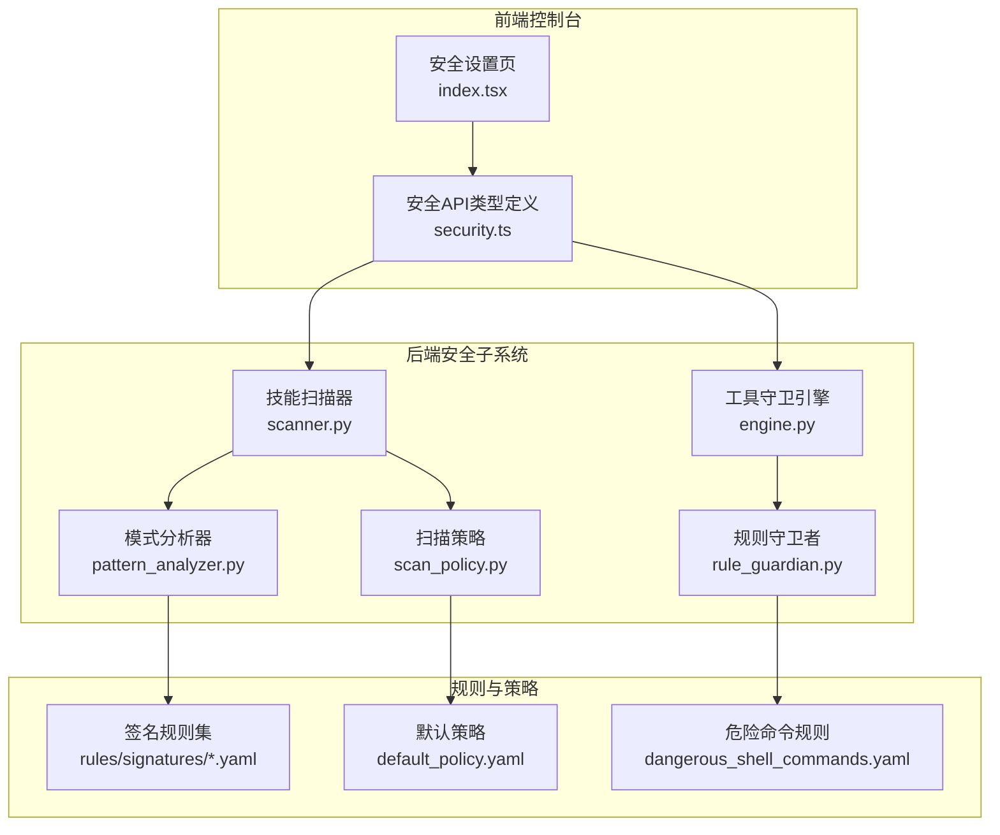
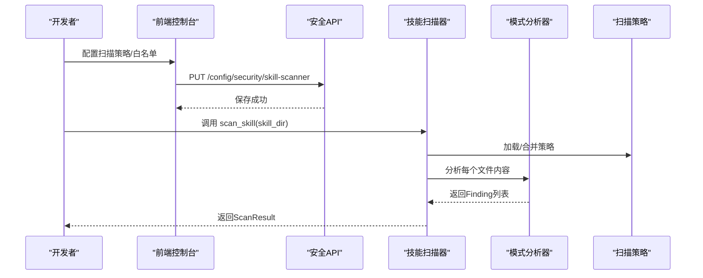
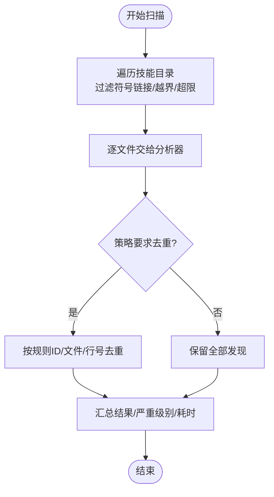
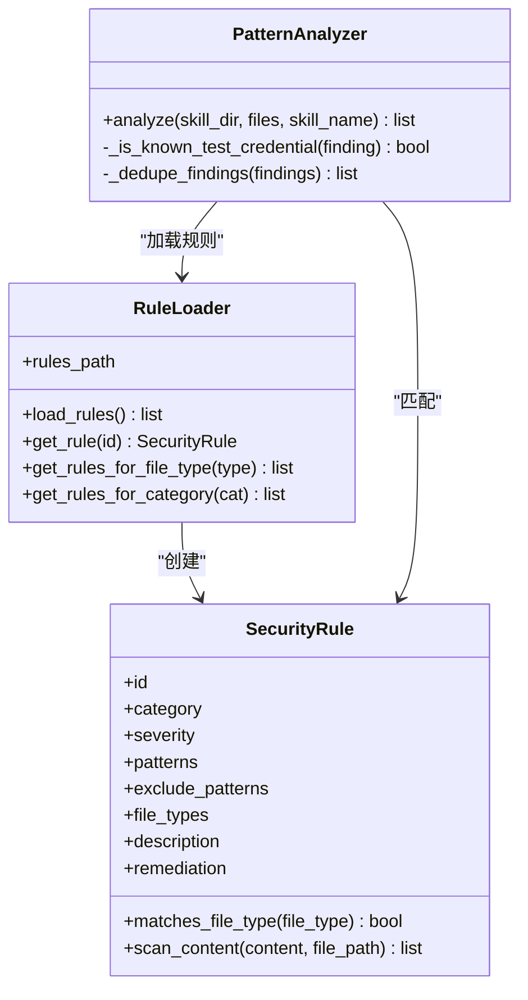
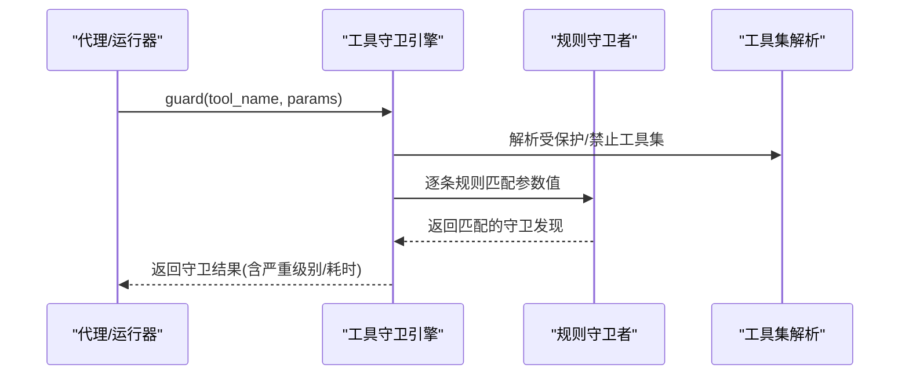
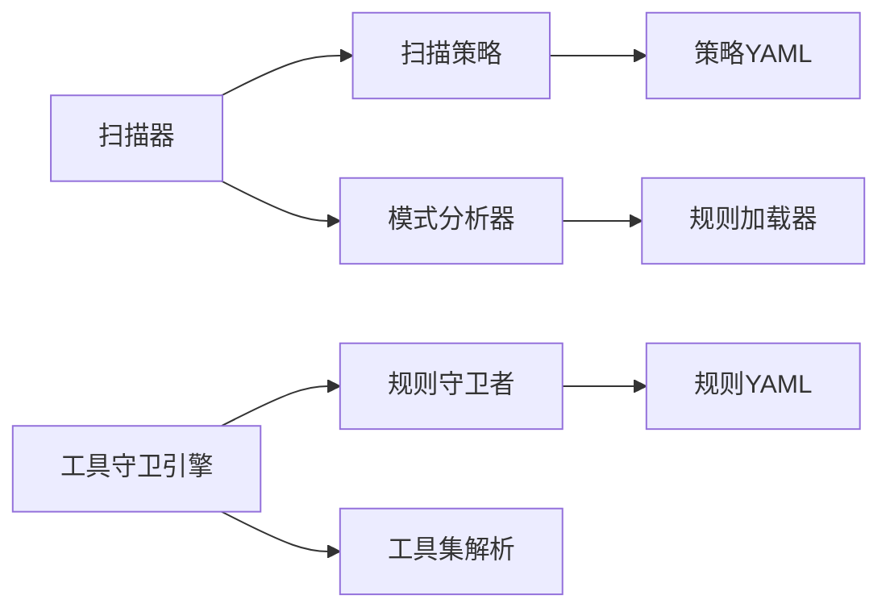

# 技能安全扫描

<cite>
**本文引用的文件**
- [src\copaw\security\skill_scanner\scanner.py](file://src\copaw\security\skill_scanner\scanner.py)
- [src\copaw\security\skill_scanner\models.py](file://src\copaw\security\skill_scanner\models.py)
- [src\copaw\security\skill_scanner\scan_policy.py](file://src\copaw\security\skill_scanner\scan_policy.py)
- [src\copaw\security\skill_scanner\analyzers\pattern_analyzer.py](file://src\copaw\security\skill_scanner\analyzers\pattern_analyzer.py)
- [src\copaw\security\skill_scanner\data\default_policy.yaml](file://src\copaw\security\skill_scanner\data\default_policy.yaml)
- [src\copaw\security\skill_scanner\rules\signatures\command_injection.yaml](file://src\copaw\security\skill_scanner\rules\signatures\command_injection.yaml)
- [src\copaw\security\skill_scanner\rules\signatures\data_exfiltration.yaml](file://src\copaw\security\skill_scanner\rules\signatures\data_exfiltration.yaml)
- [src\copaw\security\skill_scanner\rules\signatures\hardcoded_secrets.yaml](file://src\copaw\security\skill_scanner\rules\signatures\hardcoded_secrets.yaml)
- [src\copaw\security\tool_guard\engine.py](file://src\copaw\security\tool_guard\engine.py)
- [src\copaw\security\tool_guard\models.py](file://src\copaw\security\tool_guard\models.py)
- [src\copaw\security\tool_guard\guardians\rule_guardian.py](file://src\copaw\security\tool_guard\guardians\rule_guardian.py)
- [src\copaw\security\tool_guard\rules\dangerous_shell_commands.yaml](file://src\copaw\security\tool_guard\rules\dangerous_shell_commands.yaml)
- [src\copaw\security\tool_guard\utils.py](file://src\copaw\security\tool_guard\utils.py)
- [console\src\api\modules\security.ts](file://console\src\api\modules\security.ts)
- [console\src\pages\Settings\Security\index.tsx](file://console\src\pages\Settings\Security\index.tsx)
</cite>

## 目录
1. [简介](#简介)
2. [项目结构](#项目结构)
3. [核心组件](#核心组件)
4. [架构总览](#架构总览)
5. [详细组件分析](#详细组件分析)
6. [依赖分析](#依赖分析)
7. [性能考量](#性能考量)
8. [故障排查指南](#故障排查指南)
9. [结论](#结论)
10. [附录](#附录)

## 简介
本文件面向CoPaw技能安全扫描系统，系统性阐述技能代码的安全审查机制与威胁检测算法，覆盖扫描规则定义、威胁分类与风险评估标准、白名单与策略配置、工具调用前置守卫（Tool Guard）、以及扫描结果解读与违规处置流程。文档同时给出可操作的配置建议与最佳实践，帮助组织在保证安全的前提下高效使用技能。

## 项目结构
安全子系统由“技能扫描器”和“工具守卫”两大子系统构成，分别负责离线静态扫描与运行时参数守卫。前端通过API模块暴露配置与历史记录管理能力，支持在线调整扫描模式、白名单、规则集与查看被阻断记录。

图表来源
- [src\copaw\security\skill_scanner\scanner.py:76-319](file://src\copaw\security\skill_scanner\scanner.py#L76-L319)
- [src\copaw\security\skill_scanner\scan_policy.py:156-476](file://src\copaw\security\skill_scanner\scan_policy.py#L156-L476)
- [src\copaw\security\tool_guard\engine.py:52-218](file://src\copaw\security\tool_guard\engine.py#L52-L218)
- [console\src\api\modules\security.ts:1-127](file://console\src\api\modules\security.ts#L1-L127)

章节来源
- [src\copaw\security\skill_scanner\scanner.py:1-319](file://src\copaw\security\skill_scanner\scanner.py#L1-L319)
- [src\copaw\security\tool_guard\engine.py:1-218](file://src\copaw\security\tool_guard\engine.py#L1-L218)
- [console\src\api\modules\security.ts:1-127](file://console\src\api\modules\security.ts#L1-L127)

## 核心组件
- 技能扫描器：遍历技能包文件，加载策略与分析器，聚合发现并输出扫描结果。
- 扫描策略：组织化的规则范围、文件分类、阈值、严重性覆盖与禁用规则等。
- 模式分析器：基于YAML签名规则进行正则匹配，支持行内与多行模式。
- 工具守卫引擎：在工具调用前对参数进行规则匹配，判定是否允许或需要审批。
- 规则守卫者：加载危险命令与通用规则，按工具名/参数维度匹配。
- 前端API与界面：提供策略与规则的读取、更新、规则预览与阻断历史管理。

章节来源
- [src\copaw\security\skill_scanner\models.py:19-235](file://src\copaw\security\skill_scanner\models.py#L19-L235)
- [src\copaw\security\skill_scanner\scan_policy.py:156-476](file://src\copaw\security\skill_scanner\scan_policy.py#L156-L476)
- [src\copaw\security\tool_guard\models.py:25-185](file://src\copaw\security\tool_guard\models.py#L25-L185)

## 架构总览
技能安全扫描系统采用“离线静态扫描 + 运行时参数守卫”的双层防护架构。扫描器负责在技能入库前进行静态规则检测；工具守卫在运行期拦截高危工具调用，结合审批流程实现动态阻断。

图表来源
- [src\copaw\security\skill_scanner\scanner.py:148-242](file://src\copaw\security\skill_scanner\scanner.py#L148-L242)
- [src\copaw\security\skill_scanner\analyzers\pattern_analyzer.py:265-347](file://src\copaw\security\skill_scanner\analyzers\pattern_analyzer.py#L265-L347)
- [src\copaw\security\skill_scanner\scan_policy.py:261-304](file://src\copaw\security\skill_scanner\scan_policy.py#L261-L304)
- [console\src\api\modules\security.ts:84-88](file://console\src\api\modules\security.ts#L84-L88)

## 详细组件分析

### 技能扫描器与策略
- 扫描器职责
  - 文件发现：递归遍历技能目录，跳过符号链接、非文件、超出大小/数量限制的文件，并根据策略扩展集合决定跳过类型。
  - 分析器编排：按顺序调用已注册分析器，收集并去重，生成统一结果对象。
  - 结果汇总：统计最高严重级别、是否安全、耗时等元数据。
- 策略作用
  - 规则范围：仅在特定文件类型/路径生效，避免误报。
  - 文件分类：将扩展名路由到“惰性/结构化/归档/代码”，影响扫描范围与性能。
  - 阈值与覆盖：最大文件数/大小、正则长度、最小置信度、严重性覆盖、禁用规则等。
  - 已知测试凭证抑制：自动过滤常见占位符与测试值，降低噪音。

图表来源
- [src\copaw\security\skill_scanner\scanner.py:248-299](file://src\copaw\security\skill_scanner\scanner.py#L248-L299)
- [src\copaw\security\skill_scanner\scanner.py:214-242](file://src\copaw\security\skill_scanner\scanner.py#L214-L242)
- [src\copaw\security\skill_scanner\scan_policy.py:82-140](file://src\copaw\security\skill_scanner\scan_policy.py#L82-L140)

章节来源
- [src\copaw\security\skill_scanner\scanner.py:76-319](file://src\copaw\security\skill_scanner\scanner.py#L76-L319)
- [src\copaw\security\skill_scanner\scan_policy.py:156-476](file://src\copaw\security\skill_scanner\scan_policy.py#L156-L476)
- [src\copaw\security\skill_scanner\data\default_policy.yaml:1-245](file://src\copaw\security\skill_scanner\data\default_policy.yaml#L1-L245)

### 模式分析器与规则体系
- 规则加载
  - 从规则目录加载YAML列表，构建SecurityRule对象，预编译正则。
  - 支持排除模式、文件类型限定、描述与修复建议。
- 匹配策略
  - 行内快速匹配 + 多行模式回退，定位命中文本与上下文片段。
  - 应用策略：文档路径跳过、仅代码规则、严重性覆盖、已知测试凭证抑制、去重。
- 威胁分类
  - 命令注入、数据外泄、硬编码密钥、混淆、社会工程、资源滥用、供应链攻击等。

图表来源
- [src\copaw\security\skill_scanner\analyzers\pattern_analyzer.py:38-156](file://src\copaw\security\skill_scanner\analyzers\pattern_analyzer.py#L38-L156)
- [src\copaw\security\skill_scanner\analyzers\pattern_analyzer.py:163-232](file://src\copaw\security\skill_scanner\analyzers\pattern_analyzer.py#L163-L232)
- [src\copaw\security\skill_scanner\analyzers\pattern_analyzer.py:236-393](file://src\copaw\security\skill_scanner\analyzers\pattern_analyzer.py#L236-L393)

章节来源
- [src\copaw\security\skill_scanner\analyzers\pattern_analyzer.py:1-393](file://src\copaw\security\skill_scanner\analyzers\pattern_analyzer.py#L1-L393)
- [src\copaw\security\skill_scanner\rules\signatures\command_injection.yaml:1-195](file://src\copaw\security\skill_scanner\rules\signatures\command_injection.yaml#L1-L195)
- [src\copaw\security\skill_scanner\rules\signatures\data_exfiltration.yaml:1-142](file://src\copaw\security\skill_scanner\rules\signatures\data_exfiltration.yaml#L1-L142)
- [src\copaw\security\skill_scanner\rules\signatures\hardcoded_secrets.yaml:1-150](file://src\copaw\security\skill_scanner\rules\signatures\hardcoded_secrets.yaml#L1-L150)

### 工具守卫引擎与规则
- 引擎职责
  - 懒加载默认守卫（规则守卫者），支持运行时注册/注销守卫。
  - 依据配置/环境变量决定是否启用、受保护工具集与禁止工具集。
  - 对单次工具调用参数进行扫描，聚合结果并记录耗时。
- 规则守卫者
  - 从规则目录加载危险命令与通用规则，支持自定义规则与禁用规则。
  - 将参数值转换为字符串后进行正则匹配，提取上下文片段与修复建议。
- 工具集解析
  - 支持环境变量、配置文件与默认集合，通配符与空集合语义明确。

图表来源
- [src\copaw\security\tool_guard\engine.py:161-206](file://src\copaw\security\tool_guard\engine.py#L161-L206)
- [src\copaw\security\tool_guard\guardians\rule_guardian.py:329-382](file://src\copaw\security\tool_guard\guardians\rule_guardian.py#L329-L382)
- [src\copaw\security\tool_guard\utils.py:56-118](file://src\copaw\security\tool_guard\utils.py#L56-L118)

章节来源
- [src\copaw\security\tool_guard\engine.py:1-218](file://src\copaw\security\tool_guard\engine.py#L1-L218)
- [src\copaw\security\tool_guard\guardians\rule_guardian.py:1-383](file://src\copaw\security\tool_guard\guardians\rule_guardian.py#L1-L383)
- [src\copaw\security\tool_guard\rules\dangerous_shell_commands.yaml:1-120](file://src\copaw\security\tool_guard\rules\dangerous_shell_commands.yaml#L1-L120)
- [src\copaw\security\tool_guard\utils.py:1-156](file://src\copaw\security\tool_guard\utils.py#L1-L156)

### 威胁分类与风险评估
- 威胁类别
  - 技能扫描：命令注入、数据外泄、硬编码密钥、混淆、社会工程、资源滥用、供应链攻击等。
  - 工具守卫：命令注入、数据外泄、路径穿越、敏感文件访问、网络滥用、凭据暴露、资源滥用、代码执行、权限提升等。
- 严重性等级
  - 技能扫描：CRITICAL/HIGH/MEDIUM/LOW/INFO/SAFE。
  - 工具守卫：CRITICAL/HIGH/MEDIUM/LOW/INFO/SAFE。
- 风险评估标准
  - 以规则严重性为基准，策略可覆盖/禁用规则，最终以最高严重性决定是否阻断或警告。

章节来源
- [src\copaw\security\skill_scanner\models.py:19-54](file://src\copaw\security\skill_scanner\models.py#L19-L54)
- [src\copaw\security\tool_guard\models.py:25-53](file://src\copaw\security\tool_guard\models.py#L25-L53)

### 白名单机制与策略配置
- 技能扫描白名单
  - 通过API维护“技能名称+内容哈希”白名单条目，支持添加/删除。
  - 可配置扫描模式（阻断/警告/关闭）与超时。
- 工具守卫白名单
  - 受保护工具集与禁止工具集可通过环境变量/配置文件/前端界面设置。
- 策略定制
  - 使用策略YAML覆盖默认策略，包括规则范围、文件分类、阈值、严重性覆盖与禁用规则。
  - 默认策略包含常见文档路径指示词、示例文件名模式、已知测试凭证与占位符等。

章节来源
- [console\src\api\modules\security.ts:25-55](file://console\src\api\modules\security.ts#L25-L55)
- [console\src\api\modules\security.ts:81-99](file://console\src\api\modules\security.ts#L81-L99)
- [src\copaw\security\skill_scanner\data\default_policy.yaml:1-245](file://src\copaw\security\skill_scanner\data\default_policy.yaml#L1-L245)
- [src\copaw\security\tool_guard\utils.py:56-118](file://src\copaw\security\tool_guard\utils.py#L56-L118)

### 动态代码执行限制与监控
- 动态执行限制
  - 模式分析器不执行代码，仅基于规则匹配；工具守卫对参数进行字符串级匹配，不执行任何命令。
- 监控与日志
  - 工具守卫输出结构化日志，区分高/低严重性，便于审计与告警。
  - 扫描器记录分析器失败、文件跳过、耗时等信息。

章节来源
- [src\copaw\security\tool_guard\utils.py:121-156](file://src\copaw\security\tool_guard\utils.py#L121-L156)
- [src\copaw\security\skill_scanner\scanner.py:194-213](file://src\copaw\security\skill_scanner\scanner.py#L194-L213)

### 扫描策略配置、自定义规则与合规检查
- 策略配置
  - 通过策略YAML定义规则范围、文件分类、阈值、严重性覆盖与禁用规则。
  - 支持从默认策略叠加自定义策略，生成完整策略树。
- 自定义规则
  - 技能扫描：在签名规则目录新增YAML文件，遵循规则格式。
  - 工具守卫：在规则目录新增YAML文件或通过配置注入自定义规则。
- 合规检查
  - 基于策略与规则的组合，形成组织级合规基线；可通过白名单与模式控制放宽范围。

章节来源
- [src\copaw\security\skill_scanner\scan_policy.py:261-304](file://src\copaw\security\skill_scanner\scan_policy.py#L261-L304)
- [src\copaw\security\tool_guard\guardians\rule_guardian.py:280-324](file://src\copaw\security\tool_guard\guardians\rule_guardian.py#L280-L324)

### 安全扫描报告解读与违规处理流程
- 报告字段
  - 技能名称、目录、是否安全、最高严重性、发现数量、耗时、分析器使用情况、时间戳、失败分析器列表。
- 违规处理
  - CRITICAL/HIGH：阻断或警告，需人工复核与修复。
  - MEDIUM/LOW/INFO：建议修复，纳入后续扫描基线。
- 历史与白名单
  - 查看被阻断历史，必要时加入白名单以放行经审核的技能。

章节来源
- [src\copaw\security\skill_scanner\models.py:168-235](file://src\copaw\security\skill_scanner\models.py#L168-L235)
- [console\src\api\modules\security.ts:48-63](file://console\src\api\modules\security.ts#L48-L63)
- [console\src\pages\Settings\Security\index.tsx:340-347](file://console\src\pages\Settings\Security\index.tsx#L340-L347)

## 依赖分析
- 组件耦合
  - 扫描器依赖策略与分析器；分析器依赖规则加载器与策略；策略依赖YAML解析与深度合并。
  - 工具守卫引擎依赖守卫者与工具集解析；守卫者依赖规则加载与配置。
- 外部依赖
  - 正则表达式、YAML解析、文件系统遍历、环境变量与配置文件。

图表来源
- [src\copaw\security\skill_scanner\scanner.py:100-134](file://src\copaw\security\skill_scanner\scanner.py#L100-L134)
- [src\copaw\security\skill_scanner\analyzers\pattern_analyzer.py:163-232](file://src\copaw\security\skill_scanner\analyzers\pattern_analyzer.py#L163-L232)
- [src\copaw\security\tool_guard\engine.py:64-77](file://src\copaw\security\tool_guard\engine.py#L64-L77)
- [src\copaw\security\tool_guard\guardians\rule_guardian.py:280-324](file://src\copaw\security\tool_guard\guardians\rule_guardian.py#L280-L324)

章节来源
- [src\copaw\security\skill_scanner\scanner.py:1-319](file://src\copaw\security\skill_scanner\scanner.py#L1-L319)
- [src\copaw\security\tool_guard\engine.py:1-218](file://src\copaw\security\tool_guard\engine.py#L1-L218)

## 性能考量
- 文件发现与过滤
  - 通过策略扩展集合与大小/数量阈值限制扫描规模，避免大体积技能包导致扫描时间过长。
- 正则匹配优化
  - 行内快速匹配优先，多行模式仅在必要时触发；预编译正则减少重复开销。
- 去重与抑制
  - 在策略允许下进行去重与已知测试凭证抑制，降低结果噪声与后续处理成本。
- 工具守卫延迟
  - 守卫引擎按需初始化，默认守卫仅在可用时加载，避免不必要的启动开销。

章节来源
- [src\copaw\security\skill_scanner\scanner.py:248-299](file://src\copaw\security\skill_scanner\scanner.py#L248-L299)
- [src\copaw\security\skill_scanner\analyzers\pattern_analyzer.py:93-155](file://src\copaw\security\skill_scanner\analyzers\pattern_analyzer.py#L93-L155)
- [src\copaw\security\tool_guard\engine.py:83-94](file://src\copaw\security\tool_guard\engine.py#L83-L94)

## 故障排查指南
- 扫描器问题
  - 目录不存在：记录警告并返回空结果。
  - 分析器异常：捕获异常并记录失败分析器，不影响其他分析器。
  - 文件遍历失败：记录警告并跳过不可访问路径。
- 策略问题
  - YAML加载失败：抛出错误并提示文件不存在或格式不正确。
  - 正则无效：跳过该规则并记录警告。
- 工具守卫问题
  - 守卫未启用：返回None。
  - 守卫器异常：记录失败并继续其他守卫器。
  - 日志输出：高严重性发现以warning输出，低严重性以info输出，便于快速定位。

章节来源
- [src\copaw\security\skill_scanner\scanner.py:173-179](file://src\copaw\security\skill_scanner\scanner.py#L173-L179)
- [src\copaw\security\skill_scanner\scanner.py:203-213](file://src\copaw\security\skill_scanner\scanner.py#L203-L213)
- [src\copaw\security\skill_scanner\scan_policy.py:267-282](file://src\copaw\security\skill_scanner\scan_policy.py#L267-L282)
- [src\copaw\security\tool_guard\engine.py:189-204](file://src\copaw\security\tool_guard\engine.py#L189-L204)
- [src\copaw\security\tool_guard\utils.py:121-156](file://src\copaw\security\tool_guard\utils.py#L121-L156)

## 结论
CoPaw技能安全扫描系统通过“策略驱动的静态扫描 + 规则驱动的运行时守卫”形成闭环安全防护。系统提供灵活的策略与规则扩展能力、完善的白名单与合规基线管理，以及清晰的报告与日志输出，既满足企业合规要求，又兼顾开发效率与可运维性。

## 附录
- 常用配置要点
  - 扫描模式：block/warn/off，结合白名单与超时控制。
  - 工具守卫：受保护工具集与禁止工具集，配合审批流程。
  - 规则定制：在各自规则目录新增YAML，遵循规则格式与命名规范。
- 威胁识别参考
  - 命令注入、数据外泄、硬编码密钥、路径穿越、权限提升、资源滥用等。