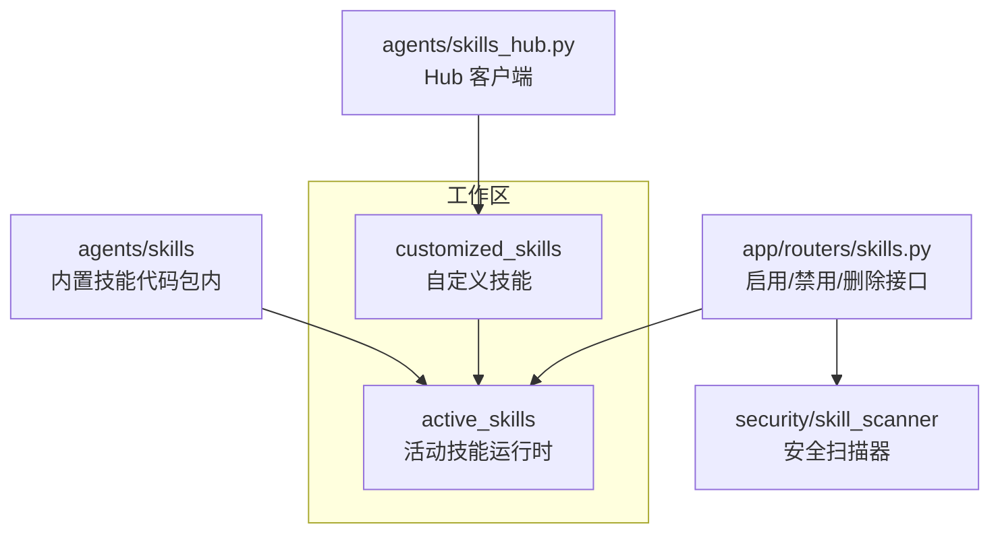
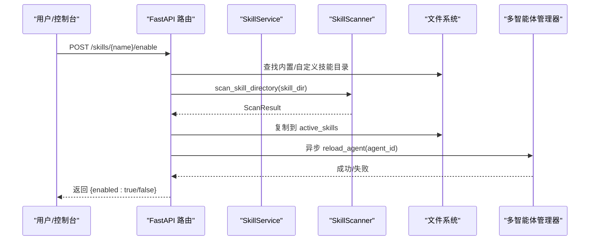
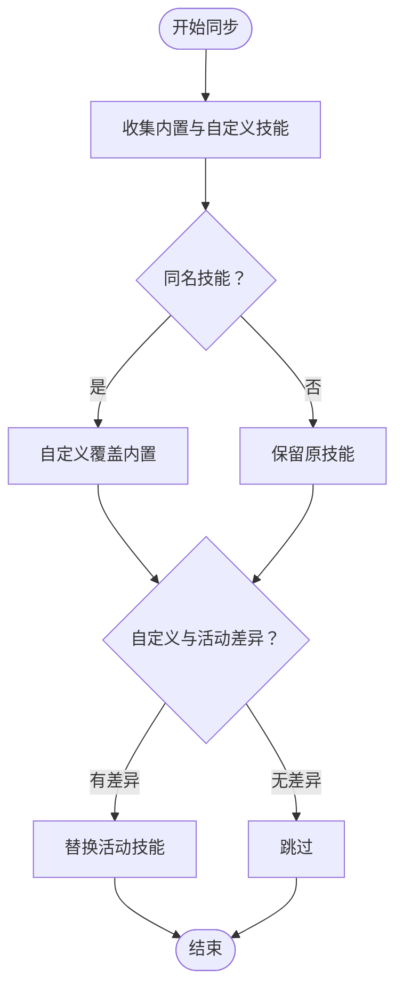
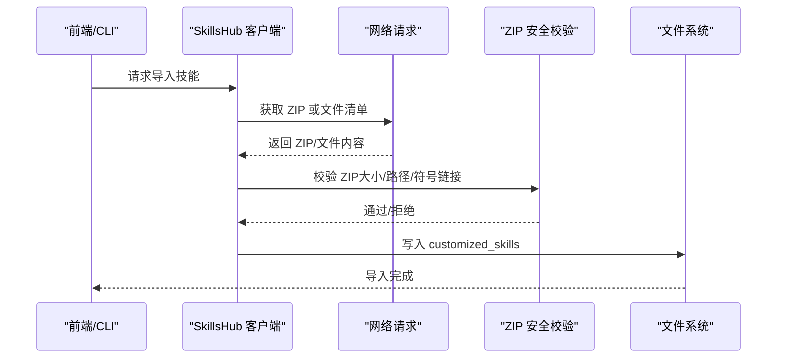
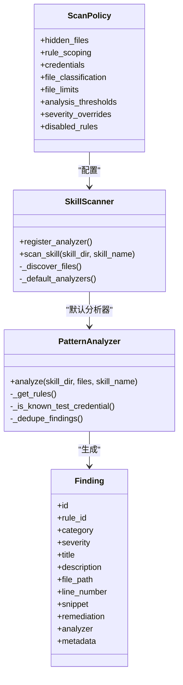
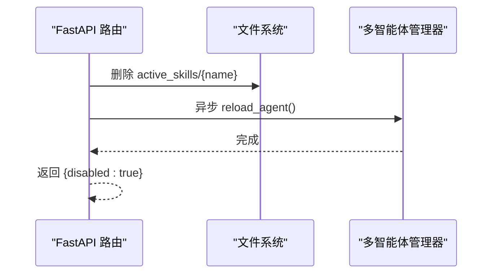
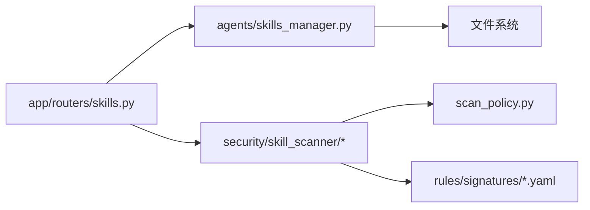

# 技能插件系统

<cite>
**本文档引用的文件**
- [skills_manager.py](file://src/copaw/agents/skills_manager.py)
- [skills_hub.py](file://src/copaw/agents/skills_hub.py)
- [skills.py](file://src/copaw/app/routers/skills.py)
- [__init__.py（技能扫描器）](file://src/copaw/security/skill_scanner/__init__.py)
- [scanner.py](file://src/copaw/security/skill_scanner/scanner.py)
- [models.py](file://src/copaw/security/skill_scanner/models.py)
- [scan_policy.py](file://src/copaw/security/skill_scanner/scan_policy.py)
- [default_policy.yaml](file://src/copaw/security/skill_scanner/data/default_policy.yaml)
- [pattern_analyzer.py](file://src/copaw/security/skill_scanner/analyzers/pattern_analyzer.py)
- [command_injection.yaml](file://src/copaw/security/skill_scanner/rules/signatures/command_injection.yaml)
- [useSkillScanner.ts](file://console/src/pages/Settings/Security/useSkillScanner.ts)
</cite>

## 目录
1. [简介](#简介)
2. [项目结构](#项目结构)
3. [核心组件](#核心组件)
4. [架构总览](#架构总览)
5. [详细组件分析](#详细组件分析)
6. [依赖关系分析](#依赖关系分析)
7. [性能考虑](#性能考虑)
8. [故障排除指南](#故障排除指南)
9. [结论](#结论)
10. [附录](#附录)

## 简介
本文件系统性阐述 CoPaw 技能插件系统的架构设计、动态加载机制与生命周期管理，覆盖内置技能、自定义技能与活动技能的目录结构与同步机制；文档化技能元数据系统、版本管理与冲突解决策略；解释技能安全扫描机制、缓存与白名单策略；并提供技能开发规范、模板结构与最佳实践指南。

## 项目结构
技能插件系统围绕“工作区”组织，关键目录如下：
- 内置技能：位于代码包内，作为基础能力来源
- 自定义技能：位于工作区的 customized_skills 目录，可覆盖内置技能
- 活动技能：位于工作区的 active_skills 目录，运行时生效
- 技能中心（Hub）：支持从外部源导入技能包

图示来源
- [skills_manager.py:183-260](file://src/copaw/agents/skills_manager.py#L183-L260)
- [skills.py:626-693](file://src/copaw/app/routers/skills.py#L626-L693)
- [skills_hub.py:573-633](file://src/copaw/agents/skills_hub.py#L573-L633)

章节来源
- [skills_manager.py:63-84](file://src/copaw/agents/skills_manager.py#L63-L84)
- [skills.py:626-693](file://src/copaw/app/routers/skills.py#L626-L693)

## 核心组件
- 技能服务（SkillService）
  - 负责读取、创建、同步与删除技能
  - 维护技能树结构（references/scripts 子目录）
  - 提供列表与可用技能查询
- 技能同步器
  - 将内置与自定义技能合并到活动目录
  - 支持强制覆盖与版本比较
- 技能 Hub 客户端
  - 支持从外部 Hub 搜索、拉取与安装技能包
  - ZIP 安全校验与解压
- 安全扫描器（SkillScanner）
  - 基于 YAML 规则的正则签名匹配
  - 支持策略配置、缓存、白名单与超时控制
- 控制器（FastAPI 路由）
  - 提供启用/禁用/删除技能的 API
  - 在启用前执行安全扫描

章节来源
- [skills_manager.py:627-868](file://src/copaw/agents/skills_manager.py#L627-L868)
- [skills_manager.py:183-260](file://src/copaw/agents/skills_manager.py#L183-L260)
- [skills_hub.py:573-633](file://src/copaw/agents/skills_hub.py#L573-L633)
- [__init__.py（技能扫描器）:415-505](file://src/copaw/security/skill_scanner/__init__.py#L415-L505)
- [skills.py:626-693](file://src/copaw/app/routers/skills.py#L626-L693)

## 架构总览
技能插件系统采用“三层目录 + 一个扫描器”的架构：
- 目录层：内置技能（只读）、自定义技能（可写）、活动技能（运行时）
- 同步层：将内置与自定义技能合并到活动目录，并处理版本与覆盖逻辑
- 扫描层：在启用或导入前对技能进行安全扫描，支持缓存、白名单与超时
- 控制层：通过 API 实现启用/禁用/删除技能，并触发热重载

图示来源
- [skills.py:626-693](file://src/copaw/app/routers/skills.py#L626-L693)
- [__init__.py（技能扫描器）:415-505](file://src/copaw/security/skill_scanner/__init__.py#L415-L505)
- [scanner.py:148-242](file://src/copaw/security/skill_scanner/scanner.py#L148-L242)

## 详细组件分析

### 技能服务与目录同步
- 目录结构
  - 内置技能：agents/skills
  - 自定义技能：workspace/customized_skills
  - 活动技能：workspace/active_skills
- 同步策略
  - 内置优先级低于自定义：同名时自定义覆盖内置
  - 支持强制覆盖与差异检测（基于 SKILL.md 内容）
  - 反向同步：将活动技能回写到自定义目录（非内置首次）
- 元数据与树形结构
  - 使用 SKILL.md 作为元数据入口，frontmatter 解析描述与名称
  - references 与 scripts 子目录以嵌套字典表示树结构
- 创建与导入
  - create_skill 支持传入 references/scripts 的树形内容
  - 导入 ZIP 时进行大小与路径合法性检查

图示来源
- [skills_manager.py:183-260](file://src/copaw/agents/skills_manager.py#L183-L260)
- [skills_manager.py:263-341](file://src/copaw/agents/skills_manager.py#L263-L341)

章节来源
- [skills_manager.py:63-84](file://src/copaw/agents/skills_manager.py#L63-L84)
- [skills_manager.py:394-470](file://src/copaw/agents/skills_manager.py#L394-L470)
- [skills_manager.py:473-520](file://src/copaw/agents/skills_manager.py#L473-L520)
- [skills_manager.py:529-550](file://src/copaw/agents/skills_manager.py#L529-L550)

### 技能 Hub 与导入流程
- 支持从多种 Hub 源（ClawHub、Skills.sh、SkillsMP、ModelScope）解析标识
- 下载 ZIP 并进行安全校验（大小限制、路径合法性、禁止符号链接）
- 解析为树形文件结构，生成 references/scripts 与额外文件
- 将技能写入 customized_skills 目录

图示来源
- [skills_hub.py:573-633](file://src/copaw/agents/skills_hub.py#L573-L633)
- [skills_hub.py:529-550](file://src/copaw/agents/skills_hub.py#L529-L550)

章节来源
- [skills_hub.py:131-160](file://src/copaw/agents/skills_hub.py#L131-L160)
- [skills_hub.py:225-335](file://src/copaw/agents/skills_hub.py#L225-L335)
- [skills_hub.py:529-550](file://src/copaw/agents/skills_hub.py#L529-L550)

### 安全扫描器与策略
- 扫描器
  - 默认使用 PatternAnalyzer（基于 YAML 正则签名）
  - 文件发现：遍历技能目录，跳过符号链接与指定扩展
  - 结果聚合：按严重度与规则 ID 去重
- 策略（ScanPolicy）
  - 隐藏文件白名单、规则作用域（仅代码文件、文档路径跳过等）
  - 凭证占位符过滤、文件分类（二进制/结构化/归档/代码）
  - 文件数量与大小限制、正则长度限制
- 缓存与白名单
  - mtime 缓存：目录不变则复用结果
  - 白名单：按技能名或内容哈希匹配
- 超时与阻断
  - 可配置扫描超时
  - 按模式（block/warn/off）决定是否阻断

图示来源
- [scan_policy.py:156-177](file://src/copaw/security/skill_scanner/scan_policy.py#L156-L177)
- [scanner.py:76-147](file://src/copaw/security/skill_scanner/scanner.py#L76-L147)
- [pattern_analyzer.py:236-347](file://src/copaw/security/skill_scanner/analyzers/pattern_analyzer.py#L236-L347)
- [models.py:129-161](file://src/copaw/security/skill_scanner/models.py#L129-L161)

章节来源
- [__init__.py（技能扫描器）:415-505](file://src/copaw/security/skill_scanner/__init__.py#L415-L505)
- [scanner.py:148-242](file://src/copaw/security/skill_scanner/scanner.py#L148-L242)
- [pattern_analyzer.py:38-155](file://src/copaw/security/skill_scanner/analyzers/pattern_analyzer.py#L38-L155)
- [scan_policy.py:236-397](file://src/copaw/security/skill_scanner/scan_policy.py#L236-L397)
- [default_policy.yaml:1-245](file://src/copaw/security/skill_scanner/data/default_policy.yaml#L1-L245)

### 控制器与生命周期
- 启用技能
  - 选择源目录（自定义优先于内置）
  - 执行安全扫描（可阻断）
  - 复制到 active_skills
  - 异步触发多智能体管理器热重载
- 禁用技能
  - 删除 active_skills 中对应目录
  - 异步热重载
- 删除技能
  - 仅允许删除自定义技能（内置不可删除）

图示来源
- [skills.py:626-693](file://src/copaw/app/routers/skills.py#L626-L693)
- [skills.py:600-623](file://src/copaw/app/routers/skills.py#L600-L623)

章节来源
- [skills.py:626-693](file://src/copaw/app/routers/skills.py#L626-L693)
- [skills.py:600-623](file://src/copaw/app/routers/skills.py#L600-L623)

### 元数据系统、版本管理与冲突解决
- 元数据
  - SKILL.md 使用 frontmatter，包含 name、description、metadata
  - metadata 可包含 builtin_skill_version 等版本信息
- 版本管理
  - 比较内置与活动技能的版本，当内置版本更高时更新活动技能
- 冲突解决
  - 自定义技能优先覆盖内置同名技能
  - 差异检测基于 SKILL.md 内容，避免不必要的覆盖

章节来源
- [skills_manager.py:142-161](file://src/copaw/agents/skills_manager.py#L142-L161)
- [skills_manager.py:297-318](file://src/copaw/agents/skills_manager.py#L297-L318)
- [skills_manager.py:244-256](file://src/copaw/agents/skills_manager.py#L244-L256)

### 开发规范与模板结构
- 目录结构
  - 必需：SKILL.md
  - 可选：references/（文档与参考文件）、scripts/（脚本）
- SKILL.md
  - 必须包含 name 与 description
  - metadata 可用于版本与元信息
- 规则编写
  - YAML 规则文件位于 rules/signatures/，每条规则包含：
    - id、category、severity
    - patterns/exclude_patterns（正则）
    - file_types（适用文件类型）
    - description/remediation

章节来源
- [skills_manager.py:699-751](file://src/copaw/agents/skills_manager.py#L699-L751)
- [pattern_analyzer.py:38-92](file://src/copaw/security/skill_scanner/analyzers/pattern_analyzer.py#L38-L92)
- [command_injection.yaml:1-195](file://src/copaw/security/skill_scanner/rules/signatures/command_injection.yaml#L1-L195)

## 依赖关系分析
- 组件耦合
  - 控制器依赖技能服务与安全扫描器
  - 技能服务依赖目录结构与 frontmatter 解析
  - 扫描器依赖策略与规则集
- 外部依赖
  - YAML/正则/并发线程池
  - 文件系统与路径解析

图示来源
- [skills.py:626-693](file://src/copaw/app/routers/skills.py#L626-L693)
- [skills_manager.py:627-868](file://src/copaw/agents/skills_manager.py#L627-L868)
- [scan_policy.py:156-177](file://src/copaw/security/skill_scanner/scan_policy.py#L156-L177)
- [pattern_analyzer.py:236-347](file://src/copaw/security/skill_scanner/analyzers/pattern_analyzer.py#L236-L347)

章节来源
- [skills.py:626-693](file://src/copaw/app/routers/skills.py#L626-L693)
- [skills_manager.py:627-868](file://src/copaw/agents/skills_manager.py#L627-L868)
- [scan_policy.py:156-177](file://src/copaw/security/skill_scanner/scan_policy.py#L156-L177)

## 性能考虑
- 扫描性能
  - 默认单线程扫描，可通过 ThreadPoolExecutor 扩展
  - 文件发现阶段跳过符号链接与大文件，减少 IO
  - 缓存 mtime 结果，避免重复扫描
- 同步性能
  - 差异检测基于 SKILL.md 内容，减少不必要的复制
  - 反向同步仅在首次写入自定义目录时进行
- 导入性能
  - ZIP 安全校验在解压前完成，避免无效解压
  - 限制最大解压体积与条目数，防止内存压力

## 故障排除指南
- 启用失败（扫描阻断）
  - 检查 ScanResult 中的最高严重度与规则 ID
  - 若需要，调整策略或修复技能内容
- 导入失败（Hub）
  - 检查网络请求与返回状态码
  - 确认 ZIP 安全校验未被拒绝（大小/路径/符号链接）
- 热重载失败
  - 查看后台任务日志，确认 agent_id 与多智能体管理器状态
- 控制台配置
  - 通过 useSkillScanner.ts 获取扫描配置与历史记录，必要时调整策略

章节来源
- [__init__.py（技能扫描器）:393-413](file://src/copaw/security/skill_scanner/__init__.py#L393-L413)
- [skills.py:685-691](file://src/copaw/app/routers/skills.py#L685-L691)
- [useSkillScanner.ts:1-47](file://console/src/pages/Settings/Security/useSkillScanner.ts#L1-L47)

## 结论
CoPaw 技能插件系统通过清晰的三层目录结构与严格的同步策略，实现了内置、自定义与活动技能的有序管理；结合可配置的安全扫描器与策略，确保了启用前的安全性与可维护性；控制器提供简洁的生命周期管理接口，并通过热重载实现无缝更新。整体设计兼顾安全性、灵活性与易用性。

## 附录
- 最佳实践
  - 在 SKILL.md 中明确 name/description/metadata
  - 将脚本与文档分离至 scripts/ 与 references/
  - 避免在代码中硬编码敏感信息，使用占位符并通过策略过滤
  - 定期更新内置技能，利用版本比较自动升级
- 常见问题
  - 启用后未生效：检查 active_skills 是否存在且包含 SKILL.md
  - 导入 ZIP 失败：确认 ZIP 未包含危险路径或符号链接
  - 扫描告警过多：调整策略或规则，必要时添加白名单