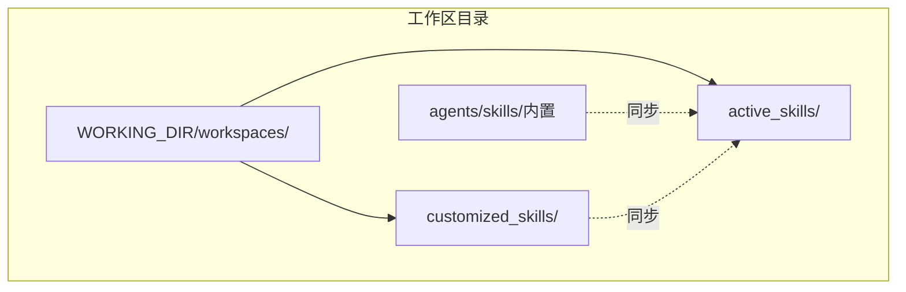
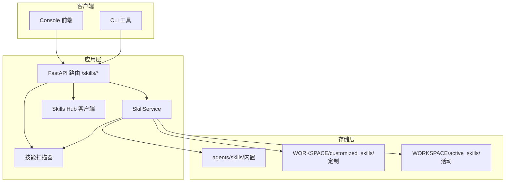
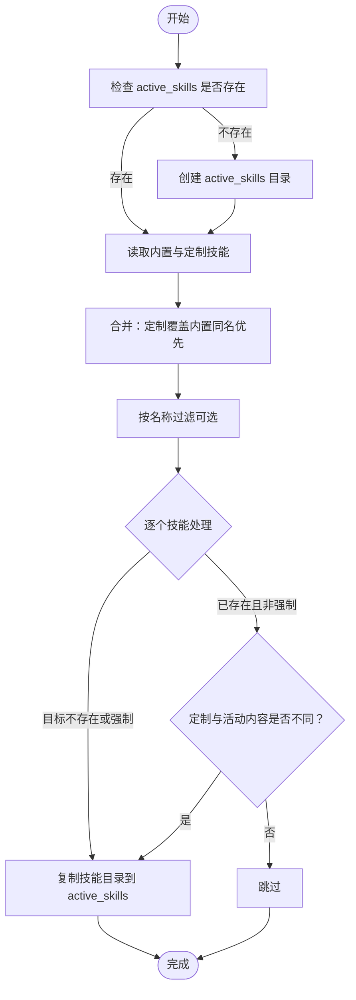
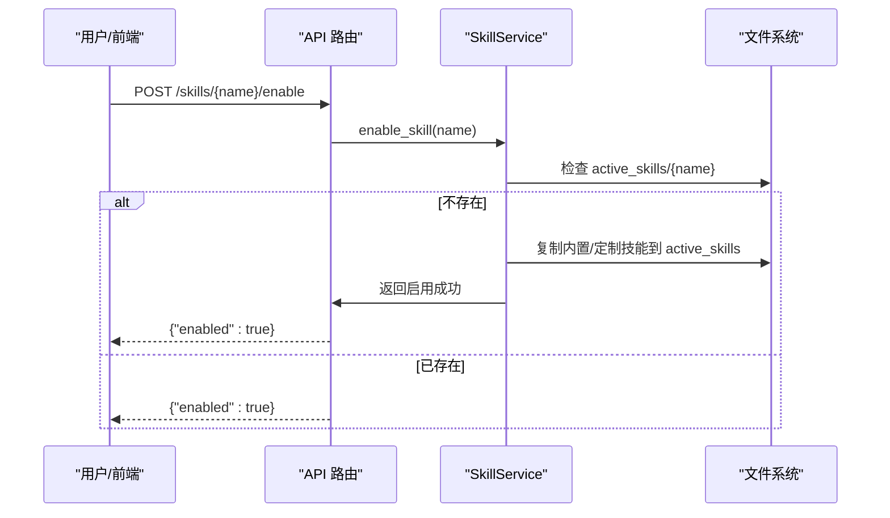
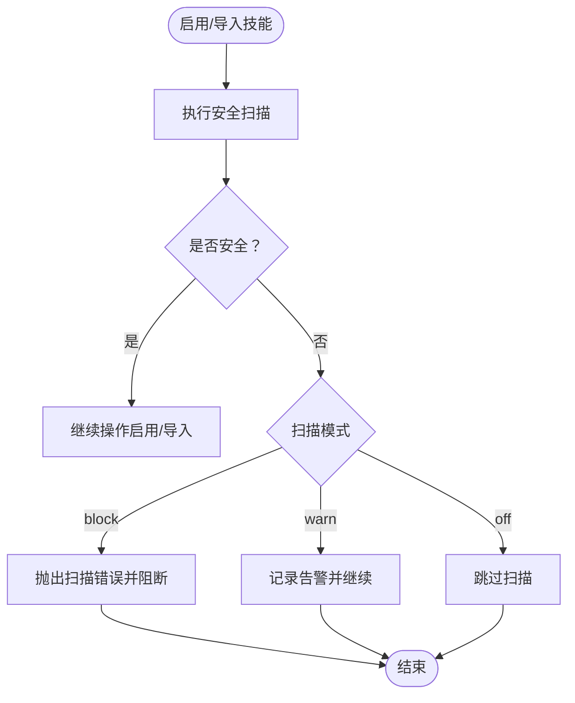
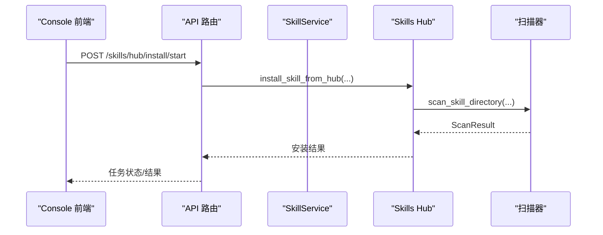
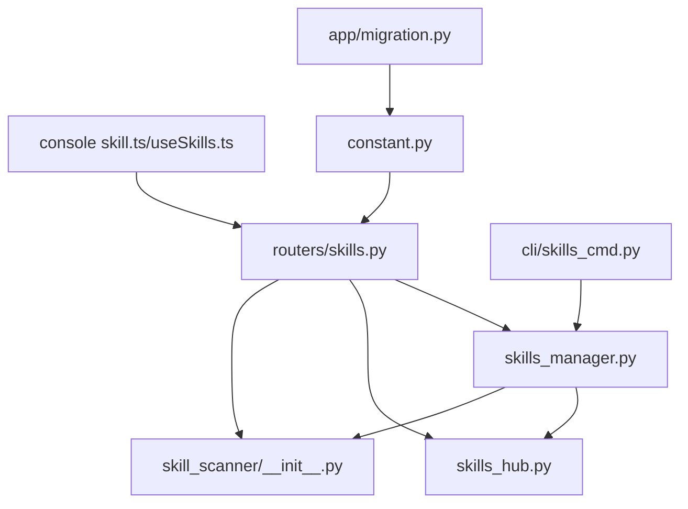

# 技能目录管理

<cite>
**本文档引用的文件**
- [skills_manager.py](file://src/copaw/agents/skills_manager.py)
- [skills_hub.py](file://src/copaw/agents/skills_hub.py)
- [skills.py](file://src/copaw/app/routers/skills.py)
- [skill.ts](file://console/src/api/modules/skill.ts)
- [useSkills.ts](file://console/src/pages/Agent/Skills/useSkills.ts)
- [skill.ts 类型定义](file://console/src/api/types/skill.ts)
- [PDF 技能示例 SKILL.md](file://src/copaw/agents/skills/pdf/SKILL.md)
- [新闻技能示例 SKILL.md](file://src/copaw/agents/skills/news/SKILL.md)
- [可见浏览器技能示例 SKILL.md](file://src/copaw/agents/skills/browser_visible/SKILL.md)
- [技能扫描器 __init__.py](file://src/copaw/security/skill_scanner/__init__.py)
- [技能扫描规则 default_policy.yaml](file://src/copaw/security/skill_scanner/data/default_policy.yaml)
- [技能扫描规则 命令注入.yaml](file://src/copaw/security/skill_scanner/rules/signatures/command_injection.yaml)
- [技能扫描规则 数据泄露.yaml](file://src/copaw/security/skill_scanner/rules/signatures/data_exfiltration.yaml)
- [技能扫描规则 硬编码密钥.yaml](file://src/copaw/security/skill_scanner/rules/signatures/hardcoded_secrets.yaml)
- [技能扫描规则 混淆技术.yaml](file://src/copaw/security/skill_scanner/rules/signatures/obfuscation.yaml)
- [技能扫描规则 提示词注入.yaml](file://src/copaw/security/skill_scanner/rules/signatures/prompt_injection.yaml)
- [技能扫描规则 资源滥用.yaml](file://src/copaw/security/skill_scanner/rules/signatures/resource_abuse.yaml)
- [技能扫描规则 社工攻击.yaml](file://src/copaw/security/skill_scanner/rules/signatures/social_engineering.yaml)
- [技能扫描规则 供应链攻击.yaml](file://src/copaw/security/skill_scanner/rules/signatures/supply_chain.yaml)
- [技能扫描规则 未授权工具使用.yaml](file://src/copaw/security/skill_scanner/rules/signatures/unauthorized_tool_use.yaml)
- [CLI 技能命令 skills_cmd.py](file://src/copaw/cli/skills_cmd.py)
- [常量 constant.py](file://src/copaw/constant.py)
- [工作区迁移 migration.py](file://src/copaw/app/migration.py)
- [工作区测试 test_workspace.py](file://tests/unit/workspace/test_workspace.py)
- [Console 技能接口文档](file://website/public/docs/cli.en.md)
</cite>

## 目录
1. [简介](#简介)
2. [项目结构](#项目结构)
3. [核心组件](#核心组件)
4. [架构总览](#架构总览)
5. [详细组件分析](#详细组件分析)
6. [依赖关系分析](#依赖关系分析)
7. [性能考虑](#性能考虑)
8. [故障排除指南](#故障排除指南)
9. [结论](#结论)
10. [附录](#附录)

## 简介
本文件系统性阐述 CoPaw 技能目录管理系统的实现与使用方法，覆盖内置技能、定制技能与活动技能三大目录的结构、职责与协作关系；详述技能目录的创建、组织与管理机制（含目录树结构、文件命名规范与路径解析）、生命周期管理（从初始化到销毁）、权限控制与安全限制（含技能扫描与访问控制），并提供配置示例、最佳实践与故障排除指南。

## 项目结构
CoPaw 技能系统围绕工作区（workspace）展开，每个代理（agent）拥有独立的工作区目录，技能目录位于该工作区内。核心目录包括：
- 内置技能目录：代码内嵌，不可修改，用于提供基础能力。
- 定制技能目录：工作区内的自定义技能，可覆盖内置技能同名项。
- 活动技能目录：当前启用的技能集合，由内置与定制技能同步而来。

**图表来源**
- [skills_manager.py:63-76](file://src/copaw/agents/skills_manager.py#L63-L76)
- [skills_manager.py:183-260](file://src/copaw/agents/skills_manager.py#L183-L260)
- [skills_manager.py:263-341](file://src/copaw/agents/skills_manager.py#L263-L341)

**章节来源**
- [skills_manager.py:63-85](file://src/copaw/agents/skills_manager.py#L63-L85)
- [skills_manager.py:183-260](file://src/copaw/agents/skills_manager.py#L183-L260)
- [skills_manager.py:263-341](file://src/copaw/agents/skills_manager.py#L263-L341)

## 核心组件
- 技能服务（SkillService）：负责技能的读取、创建、删除、启用/禁用、导入导出与同步。
- 技能中心（Skills Hub）：提供从外部 Hub 源搜索、安装与导入技能的能力，并进行安全扫描与取消控制。
- API 路由（FastAPI）：对外暴露技能列表、启用/禁用、上传、批量操作、Hub 安装等接口。
- Console 前端：提供技能管理的可视化界面与交互逻辑。
- 安全扫描器：对技能进行威胁检测，支持阻断、告警与白名单机制。
- CLI 工具：提供命令行下的技能配置与交互式选择。

**章节来源**
- [skills_manager.py:627-981](file://src/copaw/agents/skills_manager.py#L627-L981)
- [skills_hub.py:1-120](file://src/copaw/agents/skills_hub.py#L1-L120)
- [skills.py:119-753](file://src/copaw/app/routers/skills.py#L119-L753)
- [skill.ts:43-95](file://console/src/api/modules/skill.ts#L43-L95)
- [useSkills.ts:334-410](file://console/src/pages/Agent/Skills/useSkills.ts#L334-L410)
- [skill_scanner/__init__.py:1-505](file://src/copaw/security/skill_scanner/__init__.py#L1-L505)
- [skills_cmd.py:1-182](file://src/copaw/cli/skills_cmd.py#L1-L182)

## 架构总览
技能系统采用“工作区隔离 + 多源同步 + 安全前置”的设计：每个代理拥有独立工作区，内置与定制技能通过同步机制进入活动目录；启用前执行安全扫描，失败则阻断或告警；前端与 CLI 提供统一的管理入口。

**图表来源**
- [skills.py:119-753](file://src/copaw/app/routers/skills.py#L119-L753)
- [skills_manager.py:627-981](file://src/copaw/agents/skills_manager.py#L627-L981)
- [skills_hub.py:1-120](file://src/copaw/agents/skills_hub.py#L1-L120)
- [skill_scanner/__init__.py:1-505](file://src/copaw/security/skill_scanner/__init__.py#L1-L505)

## 详细组件分析

### 目录结构与职责
- 内置技能（builtin）
  - 位置：代码内嵌于 agents/skills/
  - 特点：只读、版本化（metadata.builtin_skill_version），作为技能基线。
  - 示例：PDF、新闻、可见浏览器等技能均以 SKILL.md 为核心元数据文件。
- 定制技能（customized）
  - 位置：WORKSPACE_DIR/customized_skills/
  - 特点：可编辑、可覆盖内置同名技能；删除仅限定制目录。
- 活动技能（active）
  - 位置：WORKSPACE_DIR/active_skills/
  - 特点：当前生效的技能集合；启用时从内置或定制复制而来；禁用即删除该目录副本。

**图表来源**
- [skills_manager.py:183-260](file://src/copaw/agents/skills_manager.py#L183-L260)
- [skills_manager.py:263-341](file://src/copaw/agents/skills_manager.py#L263-L341)

**章节来源**
- [skills_manager.py:63-85](file://src/copaw/agents/skills_manager.py#L63-L85)
- [skills_manager.py:183-260](file://src/copaw/agents/skills_manager.py#L183-L260)
- [skills_manager.py:263-341](file://src/copaw/agents/skills_manager.py#L263-L341)

### 文件命名规范与路径解析
- 必需文件
  - SKILL.md：技能元数据与描述，使用 YAML Front Matter，必须包含 name 与 description 字段。
- 可选子目录
  - references/：存放技能参考资料（可嵌套目录树）。
  - scripts/：存放可执行脚本（可嵌套目录树）。
- 目录树结构
  - 读取时将目录结构转为嵌套字典（文件为 None，目录为嵌套字典）。
  - 创建时支持从树结构生成文件与目录，确保内容与结构一致。

**章节来源**
- [skills_manager.py:28-61](file://src/copaw/agents/skills_manager.py#L28-L61)
- [skills_manager.py:394-471](file://src/copaw/agents/skills_manager.py#L394-L471)
- [skills_manager.py:473-520](file://src/copaw/agents/skills_manager.py#L473-L520)

### 生命周期管理
- 初始化
  - 确保 active_skills 目录存在；若为空则提示未配置技能。
- 同步
  - 将内置与定制技能同步至 active_skills，定制覆盖内置。
  - 支持按名称过滤与强制覆盖。
- 回写
  - 将 active_skills 中的技能回写至 customized_skills（非内置技能首次出现时）。
- 启用/禁用
  - 启用：从内置或定制复制到 active_skills，并触发热重载。
  - 禁用：删除 active_skills 对应目录。
- 删除
  - 仅允许删除定制技能目录中的技能，内置技能不可删除。

**图表来源**
- [skills.py:626-693](file://src/copaw/app/routers/skills.py#L626-L693)
- [skills_manager.py:931-941](file://src/copaw/agents/skills_manager.py#L931-L941)

**章节来源**
- [skills_manager.py:366-392](file://src/copaw/agents/skills_manager.py#L366-L392)
- [skills_manager.py:627-981](file://src/copaw/agents/skills_manager.py#L627-L981)
- [skills.py:591-624](file://src/copaw/app/routers/skills.py#L591-L624)

### 权限控制、安全限制与访问控制
- 访问控制
  - API 路由通过 agent_context 获取当前代理的工作区，确保各代理技能相互隔离。
- 安全扫描
  - 启用前扫描：在启用或导入时对技能目录执行扫描，根据策略决定阻断或告警。
  - 扫描模式：block（阻断）、warn（告警）、off（关闭）。
  - 白名单：基于技能名称与内容哈希，命中则跳过扫描。
  - 历史记录：记录被阻断或告警的技能，支持查看、清理与移除。
- 规则与策略
  - 默认策略与多种签名规则（命令注入、数据泄露、硬编码密钥、混淆、提示词注入、资源滥用、社工、供应链、未授权工具使用）。
  - 支持自定义策略与规则目录。

**图表来源**
- [skills.py:661-674](file://src/copaw/app/routers/skills.py#L661-L674)
- [skill_scanner/__init__.py:415-505](file://src/copaw/security/skill_scanner/__init__.py#L415-L505)

**章节来源**
- [skills.py:28-51](file://src/copaw/app/routers/skills.py#L28-L51)
- [skill_scanner/__init__.py:82-114](file://src/copaw/security/skill_scanner/__init__.py#L82-L114)
- [skill_scanner/__init__.py:141-168](file://src/copaw/security/skill_scanner/__init__.py#L141-L168)
- [skill_scanner/__init__.py:262-303](file://src/copaw/security/skill_scanner/__init__.py#L262-L303)

### 技能目录的创建、组织与管理
- 创建技能
  - 通过 API 或 CLI 创建定制技能，要求 SKILL.md 具备合法的 YAML Front Matter。
  - 支持同时创建 references 与 scripts 子树，以及额外根文件。
- 导入技能
  - 支持从 Zip 包导入，包含安全扫描与取消机制。
  - 支持从 Skills Hub 搜索与安装，支持版本选择与覆盖选项。
- 管理接口
  - 列表、启用/禁用、批量操作、删除、文件读取等。

**图表来源**
- [skills.py:391-453](file://src/copaw/app/routers/skills.py#L391-L453)
- [skills_hub.py:1-120](file://src/copaw/agents/skills_hub.py#L1-L120)
- [skill_scanner/__init__.py:415-505](file://src/copaw/security/skill_scanner/__init__.py#L415-L505)

**章节来源**
- [skills.py:344-389](file://src/copaw/app/routers/skills.py#L344-L389)
- [skills.py:463-514](file://src/copaw/app/routers/skills.py#L463-L514)
- [skills_manager.py:699-830](file://src/copaw/agents/skills_manager.py#L699-L830)

### Console 与 CLI 集成
- Console
  - 技能列表、启用/禁用、删除、从 Hub 安装、上传 Zip 等。
  - 支持批量操作与安装任务状态查询与取消。
- CLI
  - 交互式选择启用/禁用技能，支持预览变更与确认保存。

**章节来源**
- [skill.ts:43-95](file://console/src/api/modules/skill.ts#L43-L95)
- [useSkills.ts:334-410](file://console/src/pages/Agent/Skills/useSkills.ts#L334-L410)
- [skills_cmd.py:29-182](file://src/copaw/cli/skills_cmd.py#L29-L182)

## 依赖关系分析

**图表来源**
- [skills_manager.py:1-120](file://src/copaw/agents/skills_manager.py#L1-L120)
- [skills_hub.py:1-120](file://src/copaw/agents/skills_hub.py#L1-L120)
- [skills.py:1-120](file://src/copaw/app/routers/skills.py#L1-L120)
- [skill.ts:1-120](file://console/src/api/modules/skill.ts#L1-L120)
- [useSkills.ts:1-120](file://console/src/pages/Agent/Skills/useSkills.ts#L1-L120)
- [skills_cmd.py:1-120](file://src/copaw/cli/skills_cmd.py#L1-L120)
- [constant.py:72-86](file://src/copaw/constant.py#L72-L86)
- [migration.py:247-311](file://src/copaw/app/migration.py#L247-L311)

**章节来源**
- [skills_manager.py:1-120](file://src/copaw/agents/skills_manager.py#L1-L120)
- [skills_hub.py:1-120](file://src/copaw/agents/skills_hub.py#L1-L120)
- [skills.py:1-120](file://src/copaw/app/routers/skills.py#L1-L120)
- [constant.py:72-86](file://src/copaw/constant.py#L72-L86)
- [migration.py:247-311](file://src/copaw/app/migration.py#L247-L311)

## 性能考虑
- 目录扫描与树构建
  - 递归遍历与树构建的时间复杂度与技能数量及层级深度成正比，建议控制 references/scripts 子树规模。
- ZIP 导入安全校验
  - 解压前进行大小与路径合法性检查，避免过大或危险路径导致资源耗尽。
- 扫描缓存
  - 基于目录 mtime 的缓存减少重复扫描，提升性能。
- 并发与异步
  - Hub 安装与扫描使用线程池与异步任务，避免阻塞主线程。

[本节为通用指导，无需特定文件引用]

## 故障排除指南
- 启用失败（安全扫描阻断）
  - 检查扫描模式与告警历史，必要时加入白名单或修复技能内容。
  - 参考：[scan_skill_directory:415-505](file://src/copaw/security/skill_scanner/__init__.py#L415-L505)
- 技能未显示
  - 确认 active_skills 目录存在且包含 SKILL.md；检查内置/定制同步是否成功。
  - 参考：[ensure_skills_initialized:366-392](file://src/copaw/agents/skills_manager.py#L366-L392)
- 删除失败
  - 仅定制技能可删除；确认路径与权限。
  - 参考：[delete_skill:942-981](file://src/copaw/agents/skills_manager.py#L942-L981)
- Hub 安装超时/失败
  - 检查网络与速率限制，设置 GITHUB_TOKEN；查看任务状态与取消事件。
  - 参考：[start_install_from_hub:391-422](file://src/copaw/app/routers/skills.py#L391-L422)
- 工作区路径问题
  - 检查 COPAW_WORKING_DIR 环境变量与默认路径。
  - 参考：[WORKING_DIR:72-76](file://src/copaw/constant.py#L72-L76)

**章节来源**
- [skill_scanner/__init__.py:415-505](file://src/copaw/security/skill_scanner/__init__.py#L415-L505)
- [skills_manager.py:366-392](file://src/copaw/agents/skills_manager.py#L366-L392)
- [skills_manager.py:942-981](file://src/copaw/agents/skills_manager.py#L942-L981)
- [skills.py:391-422](file://src/copaw/app/routers/skills.py#L391-L422)
- [constant.py:72-76](file://src/copaw/constant.py#L72-L76)

## 结论
CoPaw 技能目录管理系统通过“工作区隔离 + 多源同步 + 安全前置”的架构，实现了内置、定制与活动技能的清晰分层与高效管理。结合 Console 与 CLI 的可视化与交互能力，以及完善的扫描与白名单机制，既保证了灵活性与安全性，也为扩展与维护提供了良好的基础。

[本节为总结性内容，无需特定文件引用]

## 附录

### 配置示例与最佳实践
- 设置工作区目录
  - 通过 COPAW_WORKING_DIR 指定工作区根目录。
  - 参考：[WORKING_DIR:72-76](file://src/copaw/constant.py#L72-L76)
- 扫描模式
  - 在 Console 安全设置中调整扫描模式，或通过 COPAW_SKILL_SCAN_MODE 环境变量设置。
  - 参考：[scan_mode:95-108](file://src/copaw/security/skill_scanner/__init__.py#L95-L108)
- 自定义策略
  - 参考默认策略与规则目录，按需新增或调整规则。
  - 参考：[default_policy.yaml](file://src/copaw/security/skill_scanner/data/default_policy.yaml)
- 技能示例
  - PDF、新闻、可见浏览器等技能展示了标准的 SKILL.md 结构与 references/scripts 使用方式。
  - 参考：[PDF 技能示例](file://src/copaw/agents/skills/pdf/SKILL.md)、[新闻技能示例](file://src/copaw/agents/skills/news/SKILL.md)、[可见浏览器技能示例](file://src/copaw/agents/skills/browser_visible/SKILL.md)

**章节来源**
- [constant.py:72-76](file://src/copaw/constant.py#L72-L76)
- [skill_scanner/__init__.py:95-108](file://src/copaw/security/skill_scanner/__init__.py#L95-L108)
- [default_policy.yaml](file://src/copaw/security/skill_scanner/data/default_policy.yaml)
- [PDF 技能示例 SKILL.md:1-329](file://src/copaw/agents/skills/pdf/SKILL.md#L1-L329)
- [新闻技能示例 SKILL.md:1-52](file://src/copaw/agents/skills/news/SKILL.md#L1-L52)
- [可见浏览器技能示例 SKILL.md:1-53](file://src/copaw/agents/skills/browser_visible/SKILL.md#L1-L53)