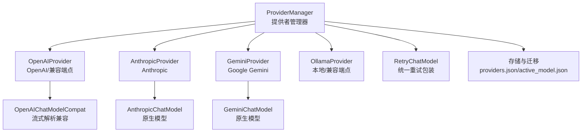
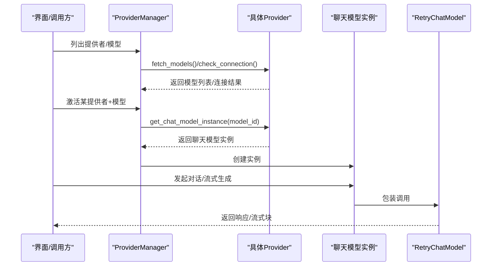
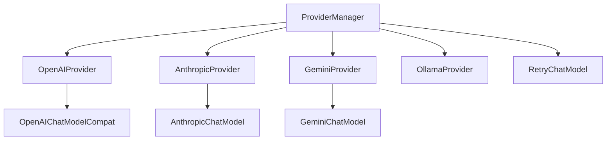
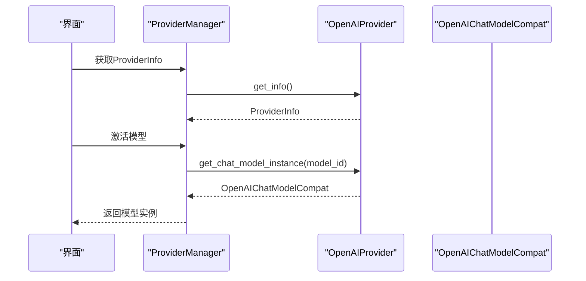
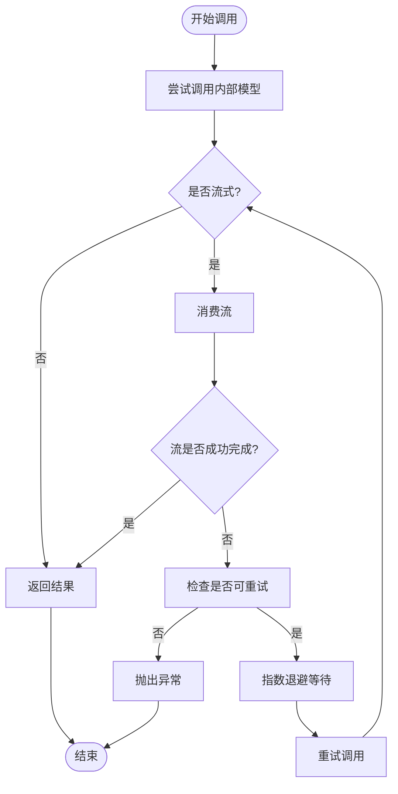

# 云模型提供者

<cite>
**本文引用的文件**
- [src\copaw\providers\__init__.py](file://src\copaw\providers\__init__.py)
- [src\copaw\providers\provider.py](file://src\copaw\providers\provider.py)
- [src\copaw\providers\models.py](file://src\copaw\providers\models.py)
- [src\copaw\providers\provider_manager.py](file://src\copaw\providers\provider_manager.py)
- [src\copaw\providers\openai_provider.py](file://src\copaw\providers\openai_provider.py)
- [src\copaw\providers\openai_chat_model_compat.py](file://src\copaw\providers\openai_chat_model_compat.py)
- [src\copaw\providers\anthropic_provider.py](file://src\copaw\providers\anthropic_provider.py)
- [src\copaw\providers\gemini_provider.py](file://src\copaw\providers\gemini_provider.py)
- [src\copaw\providers\ollama_provider.py](file://src\copaw\providers\ollama_provider.py)
- [src\copaw\providers\retry_chat_model.py](file://src\copaw\providers\retry_chat_model.py)
- [src\copaw\constant.py](file://src\copaw\constant.py)
- [tests\unit\providers\test_openai_provider.py](file://tests\unit\providers\test_openai_provider.py)
- [tests\unit\providers\test_anthropic_provider.py](file://tests\unit\providers\test_anthropic_provider.py)
- [tests\unit\providers\test_gemini_provider.py](file://tests\unit\providers\test_gemini_provider.py)
</cite>

## 目录
1. [简介](#简介)
2. [项目结构](#项目结构)
3. [核心组件](#核心组件)
4. [架构总览](#架构总览)
5. [详细组件分析](#详细组件分析)
6. [依赖分析](#依赖分析)
7. [性能考虑](#性能考虑)
8. [故障排除指南](#故障排除指南)
9. [结论](#结论)
10. [附录](#附录)

## 简介
本文件面向CoPaw云模型提供者，系统化说明如何在平台中集成与使用主流云模型提供者（OpenAI、Anthropic、Google Gemini），以及兼容的本地/第三方提供者（如Ollama）。文档覆盖以下主题：
- 认证机制：API密钥前缀、密钥存储与脱敏展示
- API端点配置：基础URL、是否冻结、连接检查能力
- 模型发现：从提供商API拉取可用模型列表
- 参数处理：生成参数（generate_kwargs）与模型实例化
- 错误重试策略：统一的指数退避重试包装器
- 速率限制与超时：环境变量控制与默认行为
- 差异与兼容：不同提供者在接口、流式解析、头部注入等方面的差异
- 配置示例、最佳实践与故障排除

## 项目结构
围绕“提供者”这一核心概念，代码采用分层组织：
- 抽象基类与通用模型定义位于 providers/provider.py 与 providers/models.py
- 具体提供者实现位于 openai_provider.py、anthropic_provider.py、gemini_provider.py、ollama_provider.py
- 提供者管理器负责内置与自定义提供者的注册、持久化、激活与模型发现
- 兼容层与重试包装器分别用于流式解析健壮性与统一重试策略
- 常量模块集中管理环境变量与默认值

图表来源
- [src\copaw\providers\provider_manager.py:288-717](file://src\copaw\providers\provider_manager.py#L288-L717)
- [src\copaw\providers\openai_provider.py:18-157](file://src\copaw\providers\openai_provider.py#L18-L157)
- [src\copaw\providers\anthropic_provider.py:18-156](file://src\copaw\providers\anthropic_provider.py#L18-L156)
- [src\copaw\providers\gemini_provider.py:17-131](file://src\copaw\providers\gemini_provider.py#L17-L131)
- [src\copaw\providers\ollama_provider.py:19-179](file://src\copaw\providers\ollama_provider.py#L19-L179)
- [src\copaw\providers\openai_chat_model_compat.py:186-213](file://src\copaw\providers\openai_chat_model_compat.py#L186-L213)
- [src\copaw\providers\retry_chat_model.py:82-204](file://src\copaw\providers\retry_chat_model.py#L82-L204)

章节来源
- [src\copaw\providers\__init__.py:1-24](file://src\copaw\providers\__init__.py#L1-L24)
- [src\copaw\providers\provider_manager.py:288-717](file://src\copaw\providers\provider_manager.py#L288-L717)

## 核心组件
- Provider/ProviderInfo：抽象提供者与只读信息对象，定义基础字段（ID、名称、基础URL、API密钥、聊天模型类名、预置模型、用户新增模型、API密钥前缀、本地/冻结URL/需要密钥、支持模型发现/连接检查、生成参数）
- ProviderManager：内置与自定义提供者注册、持久化、加载、迁移、激活当前模型、更新本地模型列表
- 各具体Provider：OpenAIProvider、AnthropicProvider、GeminiProvider、OllamaProvider，实现连接检查、模型发现、模型连通性检查、聊天模型实例化
- 兼容层：OpenAIChatModelCompat，增强OpenAI风格流式响应的工具调用解析健壮性
- 重试包装：RetryChatModel，对任意ChatModelBase进行透明重试（指数退避、状态码识别）

章节来源
- [src\copaw\providers\provider.py:11-231](file://src\copaw\providers\provider.py#L11-L231)
- [src\copaw\providers\models.py:11-81](file://src\copaw\providers\models.py#L11-L81)
- [src\copaw\providers\provider_manager.py:288-717](file://src\copaw\providers\provider_manager.py#L288-L717)
- [src\copaw\providers\openai_chat_model_compat.py:186-213](file://src\copaw\providers\openai_chat_model_compat.py#L186-L213)
- [src\copaw\providers\retry_chat_model.py:82-204](file://src\copaw\providers\retry_chat_model.py#L82-L204)

## 架构总览
下图展示从“选择提供者/模型”到“实际发起请求”的关键流程，包括模型发现、连接检查、实例化与重试。

图表来源
- [src\copaw\providers\provider_manager.py:384-407](file://src\copaw\providers\provider_manager.py#L384-L407)
- [src\copaw\providers\provider_manager.py:452-468](file://src\copaw\providers\provider_manager.py#L452-L468)
- [src\copaw\providers\provider_manager.py:699-717](file://src\copaw\providers\provider_manager.py#L699-L717)
- [src\copaw\providers\retry_chat_model.py:101-141](file://src\copaw\providers\retry_chat_model.py#L101-L141)

## 详细组件分析

### Provider 抽象与通用模型
- 关键字段：基础URL、API密钥、聊天模型类名、预置模型、额外模型、API密钥前缀、是否本地、URL是否冻结、是否需要API密钥、是否支持模型发现/连接检查、生成参数
- 方法：连接检查、模型发现、模型连通性检查、添加/删除模型、更新配置、获取只读信息、返回聊天模型类或实例
- 默认实现：DefaultProvider用于本地/无操作场景

章节来源
- [src\copaw\providers\provider.py:11-231](file://src\copaw\providers\provider.py#L11-L231)

### ProviderManager 管理器
- 内置提供者注册：OpenAI、Azure OpenAI、DashScope、Aliyun CodingPlan、Anthropic、Gemini、MiniMax（国际/国内）、DeepSeek、Ollama、LM Studio、llama.cpp、MLX
- 自定义提供者：支持用户创建并持久化，冻结连接检查以避免误判
- 存储与迁移：providers.json/active_model.json，支持从旧格式迁移
- 激活模型：记录当前使用的提供者与模型，并在本地/云端提供不同实例化路径
- 本地模型更新：动态拉取本地后端（llama.cpp/MLX）可用模型

章节来源
- [src\copaw\providers\provider_manager.py:321-338](file://src\copaw\providers\provider_manager.py#L321-L338)
- [src\copaw\providers\provider_manager.py:423-440](file://src\copaw\providers\provider_manager.py#L423-L440)
- [src\copaw\providers\provider_manager.py:582-647](file://src\copaw\providers\provider_manager.py#L582-L647)
- [src\copaw\providers\provider_manager.py:670-690](file://src\copaw\providers\provider_manager.py#L670-L690)
- [src\copaw\providers\provider_manager.py:699-717](file://src\copaw\providers\provider_manager.py#L699-L717)

### OpenAIProvider
- 连接检查：通过models.list；对DashScope/Coding端点有特殊处理
- 模型发现：标准化payload，去重与清洗
- 模型连通性：以极短流式请求验证
- 实例化：OpenAIChatModelCompat，支持DashScope头部注入
- 生成参数：透传generate_kwargs

章节来源
- [src\copaw\providers\openai_provider.py:50-118](file://src\copaw\providers\openai_provider.py#L50-L118)
- [src\copaw\providers\openai_provider.py:119-157](file://src\copaw\providers\openai_provider.py#L119-L157)

### AnthropicProvider
- 连接检查：models.list
- 模型发现：标准化payload，支持字典/对象两种形态
- 模型连通性：messages.create + 流式消费
- 实例化：AnthropicChatModel，支持DashScope头部注入
- 生成参数：透传generate_kwargs

章节来源
- [src\copaw\providers\anthropic_provider.py:57-117](file://src\copaw\providers\anthropic_provider.py#L57-L117)
- [src\copaw\providers\anthropic_provider.py:119-156](file://src\copaw\providers\anthropic_provider.py#L119-L156)

### GeminiProvider
- 连接检查：aio.models.list
- 模型发现：剥离“models/”前缀，显示名回退策略
- 模型连通性：generate_content_stream
- 实例化：GeminiChatModel
- 生成参数：透传generate_kwargs

章节来源
- [src\copaw\providers\gemini_provider.py:58-121](file://src\copaw\providers\gemini_provider.py#L58-L121)
- [src\copaw\providers\gemini_provider.py:122-131](file://src\copaw\providers\gemini_provider.py#L122-L131)

### OllamaProvider
- 连接检查：client.list
- 模型发现：client.list
- 模型连通性：client.chat（极短num_predict）
- 添加/删除模型：通过client.pull/push
- 实例化：OpenAIChatModelCompat，基于OpenAI兼容端点（/v1）
- 本地特性：自动推断默认host，支持freeze_url

章节来源
- [src\copaw\providers\ollama_provider.py:69-118](file://src\copaw\providers\ollama_provider.py#L69-L118)
- [src\copaw\providers\ollama_provider.py:119-162](file://src\copaw\providers\ollama_provider.py#L119-L162)
- [src\copaw\providers\ollama_provider.py:163-179](file://src\copaw\providers\ollama_provider.py#L163-L179)

### OpenAIChatModelCompat 兼容层
- 功能：对OpenAI风格流式响应中的工具调用进行清洗与补全，捕获额外内容（如Gemini思维签名）
- 适用：OpenAIProvider、OllamaProvider（OpenAI兼容端点）

章节来源
- [src\copaw\providers\openai_chat_model_compat.py:186-213](file://src\copaw\providers\openai_chat_model_compat.py#L186-L213)

### RetryChatModel 重试包装器
- 行为：对调用与流式响应进行透明重试，指数退避，最大重试次数、基础延迟、上限可配置
- 识别：OpenAI/Anthropic常见异常类型与常见HTTP状态码
- 使用：ProviderManager在获取活跃模型时可结合该包装器提升稳定性

章节来源
- [src\copaw\providers\retry_chat_model.py:82-204](file://src\copaw\providers\retry_chat_model.py#L82-L204)
- [src\copaw\constant.py:172-189](file://src\copaw\constant.py#L172-L189)

## 依赖分析
- ProviderManager依赖各具体Provider类与AgentScope聊天模型类，负责实例化与激活
- OpenAIProvider/OllamaProvider依赖OpenAI风格SDK，可能需要DashScope头部注入
- AnthropicProvider依赖anthropic SDK
- GeminiProvider依赖google-genai SDK
- RetryChatModel依赖AgentScope ChatModelBase，对异常与状态码进行统一处理

图表来源
- [src\copaw\providers\provider_manager.py:23-28](file://src\copaw\providers\provider_manager.py#L23-L28)
- [src\copaw\providers\openai_provider.py:12-12](file://src\copaw\providers\openai_provider.py#L12-L12)
- [src\copaw\providers\anthropic_provider.py:12-12](file://src\copaw\providers\anthropic_provider.py#L12-L12)
- [src\copaw\providers\gemini_provider.py:14-14](file://src\copaw\providers\gemini_provider.py#L14-L14)
- [src\copaw\providers\ollama_provider.py:16-16](file://src\copaw\providers\ollama_provider.py#L16-L16)
- [src\copaw\providers\openai_chat_model_compat.py:11-13](file://src\copaw\providers\openai_chat_model_compat.py#L11-L13)
- [src\copaw\providers\retry_chat_model.py:19-21](file://src\copaw\providers\retry_chat_model.py#L19-L21)

## 性能考虑
- 超时控制：Provider方法普遍接受timeout参数，默认值由常量模块提供
- 重试策略：通过指数退避降低抖动，避免雪崩
- 流式解析：兼容层对工具调用进行清洗，减少上层解析成本
- 本地模型：OllamaProvider支持长耗时的pull/delete操作，注意超时设置

章节来源
- [src\copaw\constant.py:123-129](file://src\copaw\constant.py#L123-L129)
- [src\copaw\providers\retry_chat_model.py:77-79](file://src\copaw\providers\retry_chat_model.py#L77-L79)
- [src\copaw\providers\ollama_provider.py:123-124](file://src\copaw\providers\ollama_provider.py#L123-L124)

## 故障排除指南
- 连接失败
  - OpenAIProvider：检查基础URL、API密钥与网络；DashScope/Coding端点有特殊逻辑
  - AnthropicProvider：确认API密钥与网络可达
  - GeminiProvider：检查API密钥有效性与网络
  - OllamaProvider：确认SDK安装、主机地址与服务运行
- 模型不可用
  - 使用模型连通性检查方法，确认模型ID正确且已部署
  - 对于Gemini，注意显示名与内部ID的映射
- 重试与限流
  - 观察重试日志与退避延迟；必要时调整最大重试次数与基础/上限延迟
- 配置与持久化
  - 自定义提供者默认不支持无模型连接检查，避免UI误报
  - 旧版providers.json会迁移至新结构

章节来源
- [src\copaw\providers\openai_provider.py:50-64](file://src\copaw\providers\openai_provider.py#L50-L64)
- [src\copaw\providers\anthropic_provider.py:57-69](file://src\copaw\providers\anthropic_provider.py#L57-L69)
- [src\copaw\providers\gemini_provider.py:58-76](file://src\copaw\providers\gemini_provider.py#L58-L76)
- [src\copaw\providers\ollama_provider.py:69-83](file://src\copaw\providers\ollama_provider.py#L69-L83)
- [src\copaw\providers\retry_chat_model.py:64-74](file://src\copaw\providers\retry_chat_model.py#L64-L74)
- [src\copaw\providers\provider_manager.py:434-436](file://src\copaw\providers\provider_manager.py#L434-L436)
- [src\copaw\providers\provider_manager.py:582-647](file://src\copaw\providers\provider_manager.py#L582-L647)

## 结论
CoPaw通过统一的Provider抽象与ProviderManager，实现了对多家云模型提供者的统一接入与管理。OpenAI/Anthropic/Gemini/Ollama等提供者在连接检查、模型发现、连通性验证与实例化方面保持一致的交互模式，同时针对各自SDK与API差异提供了适配层（如DashScope头部注入、Gemini前缀处理、Ollama兼容端点）。配合RetryChatModel的统一重试策略与环境变量配置，系统在稳定性与易用性之间取得平衡。

## 附录

### 配置示例与最佳实践
- 认证与密钥
  - 设置API密钥与前缀（如sk-、sk-sp、sk-ant-、空等）
  - 对于DashScope/Coding端点，按需注入头部
- 基础URL
  - 冻结URL的内置提供者（如OpenAI、DashScope）不建议修改
  - 自定义提供者可自由配置，但需确保端点兼容
- 生成参数
  - 通过generate_kwargs传递温度、采样比例等参数
  - 本地提供者可设置max_tokens为None以允许无限输出
- 重试策略
  - 通过环境变量调整最大重试次数、基础/上限延迟
- 模型发现
  - 优先使用支持模型发现的提供者（如Gemini、Ollama）
  - 对不支持的提供者，可通过“额外模型”手动添加

章节来源
- [src\copaw\providers\models.py:41-71](file://src\copaw\providers\models.py#L41-L71)
- [src\copaw\providers\provider_manager.py:262-271](file://src\copaw\providers\provider_manager.py#L262-L271)
- [src\copaw\constant.py:172-189](file://src\copaw\constant.py#L172-L189)

### API工作流（以OpenAI为例）

图表来源
- [src\copaw\providers\provider_manager.py:361-364](file://src\copaw\providers\provider_manager.py#L361-L364)
- [src\copaw\providers\provider_manager.py:452-468](file://src\copaw\providers\provider_manager.py#L452-L468)
- [src\copaw\providers\openai_provider.py:149-157](file://src\copaw\providers\openai_provider.py#L149-L157)

### 错误重试流程（RetryChatModel）

图表来源
- [src\copaw\providers\retry_chat_model.py:101-141](file://src\copaw\providers\retry_chat_model.py#L101-L141)
- [src\copaw\providers\retry_chat_model.py:142-204](file://src\copaw\providers\retry_chat_model.py#L142-L204)