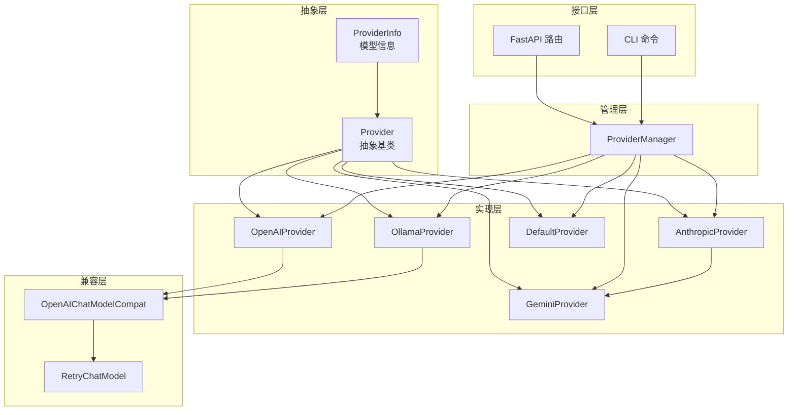
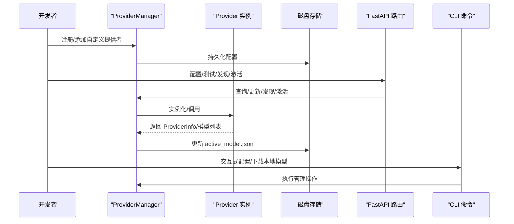
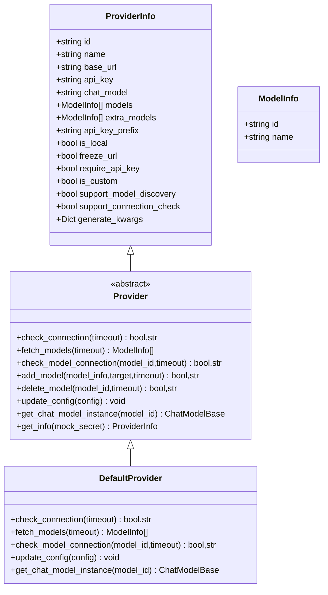
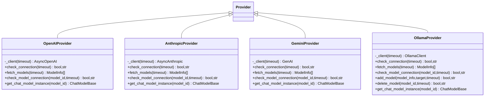
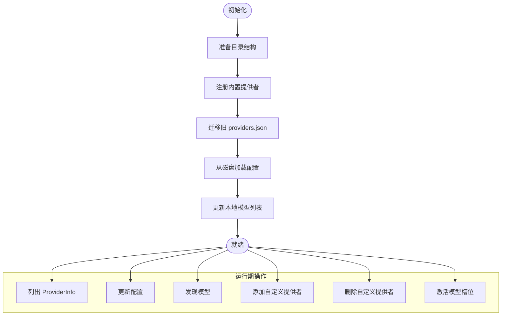
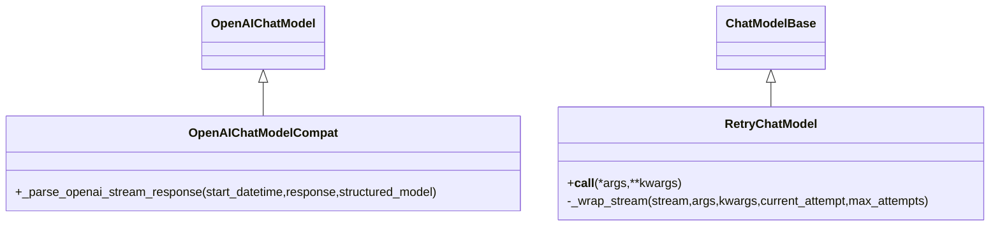
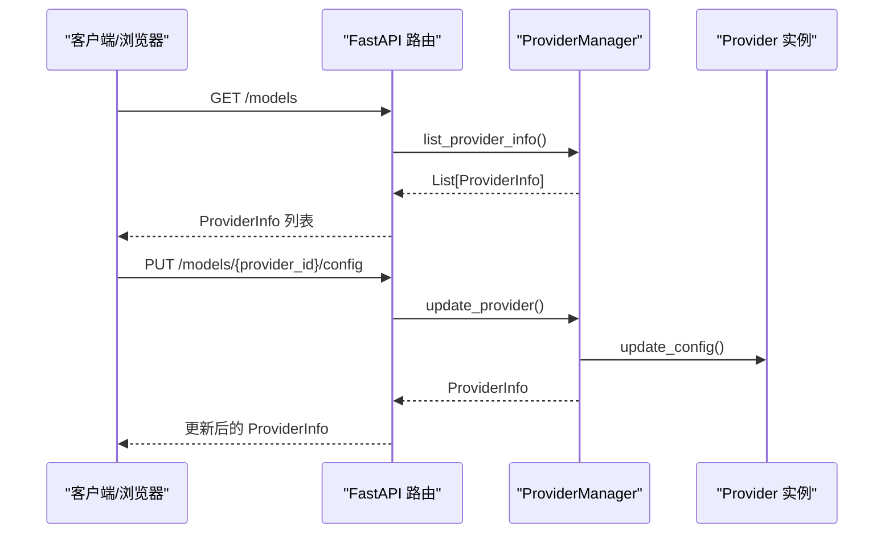
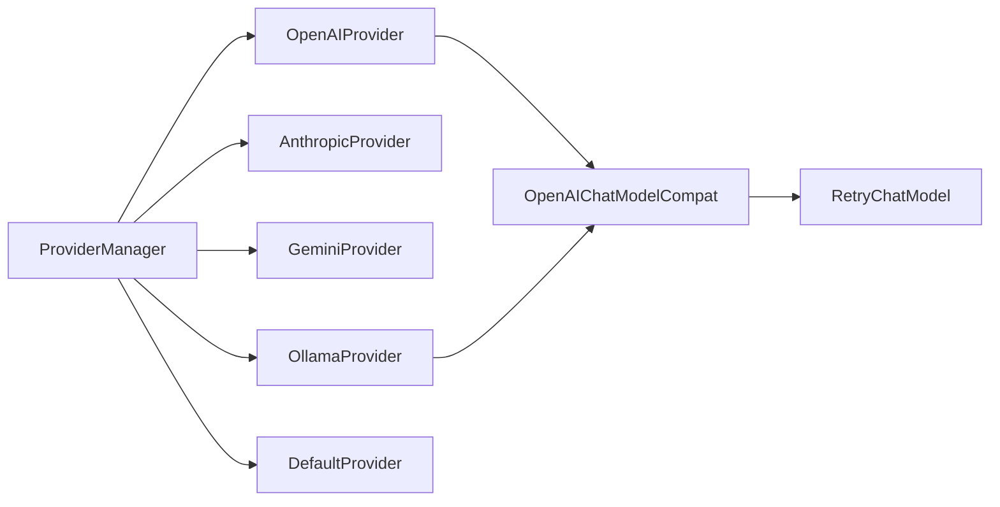

# 提供者开发指南

<cite>
**本文档引用的文件**
- [provider.py](file://src/copaw/providers/provider.py)
- [models.py](file://src/copaw/providers/models.py)
- [provider_manager.py](file://src/copaw/providers/provider_manager.py)
- [openai_provider.py](file://src/copaw/providers/openai_provider.py)
- [anthropic_provider.py](file://src/copaw/providers/anthropic_provider.py)
- [gemini_provider.py](file://src/copaw/providers/gemini_provider.py)
- [ollama_provider.py](file://src/copaw/providers/ollama_provider.py)
- [openai_chat_model_compat.py](file://src/copaw/providers/openai_chat_model_compat.py)
- [retry_chat_model.py](file://src/copaw/providers/retry_chat_model.py)
- [providers.py](file://src/copaw/app/routers/providers.py)
- [providers_cmd.py](file://src/copaw/cli/providers_cmd.py)
- [test_openai_provider.py](file://tests/unit/providers/test_openai_provider.py)
- [test_provider_manager.py](file://tests/unit/providers/test_provider_manager.py)
</cite>

## 目录
1. [简介](#简介)
2. [项目结构](#项目结构)
3. [核心组件](#核心组件)
4. [架构总览](#架构总览)
5. [详细组件分析](#详细组件分析)
6. [依赖关系分析](#依赖关系分析)
7. [性能考虑](#性能考虑)
8. [故障排除指南](#故障排除指南)
9. [结论](#结论)
10. [附录](#附录)

## 简介
本指南面向希望为 CoPaw 开发自定义提供者的开发者，系统讲解提供者接口实现、配置规范与认证处理，覆盖生命周期管理、错误处理与日志记录、注册机制、动态加载与版本兼容、测试策略、调试技巧与性能优化，并提供完整开发示例、最佳实践与发布指南。

## 项目结构
CoPaw 的提供者体系由以下层次构成：
- 抽象层：定义 Provider 基类与通用模型数据结构
- 实现层：内置提供者（OpenAI、Anthropic、Gemini、Ollama 等）
- 管理层：ProviderManager 负责注册、持久化、迁移与实例获取
- 接口层：FastAPI 路由与 CLI 命令提供对外管理能力
- 兼容层：聊天模型兼容包装与重试机制

图表来源
- [provider.py:11-201](file://src/copaw/providers/provider.py#L11-L201)
- [openai_provider.py:18-157](file://src/copaw/providers/openai_provider.py#L18-L157)
- [anthropic_provider.py:18-156](file://src/copaw/providers/anthropic_provider.py#L18-L156)
- [gemini_provider.py:17-131](file://src/copaw/providers/gemini_provider.py#L17-L131)
- [ollama_provider.py:19-179](file://src/copaw/providers/ollama_provider.py#L19-L179)
- [provider_manager.py:288-717](file://src/copaw/providers/provider_manager.py#L288-L717)
- [openai_chat_model_compat.py:186-213](file://src/copaw/providers/openai_chat_model_compat.py#L186-L213)
- [retry_chat_model.py:82-204](file://src/copaw/providers/retry_chat_model.py#L82-L204)

章节来源
- [provider.py:11-201](file://src/copaw/providers/provider.py#L11-L201)
- [provider_manager.py:288-717](file://src/copaw/providers/provider_manager.py#L288-L717)

## 核心组件
- Provider 抽象基类：定义连接检查、模型发现、模型连通性验证、模型增删、配置更新、聊天模型实例化等接口
- ProviderInfo/ModelInfo：提供者与模型的元数据描述
- ProviderManager：提供者注册、持久化、迁移、激活模型槽位、从磁盘加载与序列化
- 兼容模型与重试：OpenAIChatModelCompat 对流式响应进行工具调用清洗；RetryChatModel 对瞬时错误透明重试

章节来源
- [provider.py:73-201](file://src/copaw/providers/provider.py#L73-L201)
- [models.py:11-81](file://src/copaw/providers/models.py#L11-L81)
- [provider_manager.py:288-717](file://src/copaw/providers/provider_manager.py#L288-L717)
- [openai_chat_model_compat.py:186-213](file://src/copaw/providers/openai_chat_model_compat.py#L186-L213)
- [retry_chat_model.py:82-204](file://src/copaw/providers/retry_chat_model.py#L82-L204)

## 架构总览
提供者生命周期从“定义与注册”到“运行时实例化”，贯穿“配置持久化与迁移”“模型槽位激活”“API/CLI 管理”。下图展示关键交互：

图表来源
- [provider_manager.py:342-498](file://src/copaw/providers/provider_manager.py#L342-L498)
- [providers.py:84-437](file://src/copaw/app/routers/providers.py#L84-L437)
- [providers_cmd.py:474-800](file://src/copaw/cli/providers_cmd.py#L474-L800)

## 详细组件分析

### Provider 抽象基类与数据模型
- ProviderInfo/ModelInfo：描述提供者标识、名称、基础 URL、API Key、聊天模型类型、支持的模型列表、生成参数等
- Provider：定义异步接口：check_connection、fetch_models、check_model_connection、add_model/delete_model、update_config、get_chat_model_instance/get_info
- DefaultProvider：默认实现，用于本地或占位场景

图表来源
- [provider.py:16-201](file://src/copaw/providers/provider.py#L16-L201)

章节来源
- [provider.py:16-201](file://src/copaw/providers/provider.py#L16-L201)
- [models.py:11-81](file://src/copaw/providers/models.py#L11-L81)

### 内置提供者实现模式
- OpenAIProvider：基于 AsyncOpenAI 客户端，支持模型发现、连通性测试、模型测试与聊天模型实例化
- AnthropicProvider：基于 AsyncAnthropic 客户端，适配模型列表与消息流式响应
- GeminiProvider：基于 google.genai 客户端，处理模型名前缀与异步流式内容
- OllamaProvider：基于 ollama.AsyncClient，支持拉取/删除模型并转换为 OpenAI 兼容接口

图表来源
- [openai_provider.py:18-157](file://src/copaw/providers/openai_provider.py#L18-L157)
- [anthropic_provider.py:18-156](file://src/copaw/providers/anthropic_provider.py#L18-L156)
- [gemini_provider.py:17-131](file://src/copaw/providers/gemini_provider.py#L17-L131)
- [ollama_provider.py:19-179](file://src/copaw/providers/ollama_provider.py#L19-L179)

章节来源
- [openai_provider.py:18-157](file://src/copaw/providers/openai_provider.py#L18-L157)
- [anthropic_provider.py:18-156](file://src/copaw/providers/anthropic_provider.py#L18-L156)
- [gemini_provider.py:17-131](file://src/copaw/providers/gemini_provider.py#L17-L131)
- [ollama_provider.py:19-179](file://src/copaw/providers/ollama_provider.py#L19-L179)

### ProviderManager 生命周期与持久化
- 初始化：准备目录、注册内置提供者、迁移旧格式、从磁盘加载配置、更新本地模型
- 提供者管理：列出、查询、更新配置、发现模型、添加/删除自定义提供者、激活模型槽位
- 序列化：按内置/自定义路径保存 Provider JSON，active_model.json 记录当前激活槽位
- 反序列化：根据 id/chat_model/chat_model 字段分派到具体 Provider 类型

图表来源
- [provider_manager.py:294-338](file://src/copaw/providers/provider_manager.py#L294-L338)
- [provider_manager.py:582-696](file://src/copaw/providers/provider_manager.py#L582-L696)

章节来源
- [provider_manager.py:294-338](file://src/copaw/providers/provider_manager.py#L294-L338)
- [provider_manager.py:582-696](file://src/copaw/providers/provider_manager.py#L582-L696)

### 聊天模型兼容与重试
- OpenAIChatModelCompat：对流式响应中的工具调用进行清洗与补全，确保解析安全，并透传额外内容（如 Gemini 思维签名）
- RetryChatModel：对速率限制、超时、连接失败等瞬时错误进行指数退避重试，支持同步与流式响应

图表来源
- [openai_chat_model_compat.py:186-213](file://src/copaw/providers/openai_chat_model_compat.py#L186-L213)
- [retry_chat_model.py:82-204](file://src/copaw/providers/retry_chat_model.py#L82-L204)

章节来源
- [openai_chat_model_compat.py:186-213](file://src/copaw/providers/openai_chat_model_compat.py#L186-L213)
- [retry_chat_model.py:82-204](file://src/copaw/providers/retry_chat_model.py#L82-L204)

### API 与 CLI 管理流程
- FastAPI 路由：提供者列表、配置、测试连接、模型发现、模型测试、增删自定义提供者、增删模型、设置/获取激活模型
- CLI 命令：交互式配置 API Key、添加/删除模型、下载本地模型、列出/删除本地模型、Ollama 模型拉取

图表来源
- [providers.py:84-122](file://src/copaw/app/routers/providers.py#L84-L122)
- [providers_cmd.py:474-533](file://src/copaw/cli/providers_cmd.py#L474-L533)

章节来源
- [providers.py:84-122](file://src/copaw/app/routers/providers.py#L84-L122)
- [providers_cmd.py:474-533](file://src/copaw/cli/providers_cmd.py#L474-L533)

## 依赖关系分析
- ProviderManager 依赖各具体 Provider 类型与本地模型管理器，负责统一调度与持久化
- 各 Provider 依赖对应 SDK（OpenAI、Anthropic、Google GenAI、Ollama），并通过兼容层适配聊天模型
- API/CLI 层通过 ProviderManager 提供统一入口，避免直接耦合具体 Provider

图表来源
- [provider_manager.py:23-28](file://src/copaw/providers/provider_manager.py#L23-L28)
- [openai_provider.py:12-12](file://src/copaw/providers/openai_provider.py#L12-L12)
- [ollama_provider.py:16-16](file://src/copaw/providers/ollama_provider.py#L16-L16)
- [openai_chat_model_compat.py:11-13](file://src/copaw/providers/openai_chat_model_compat.py#L11-L13)
- [retry_chat_model.py:19-22](file://src/copaw/providers/retry_chat_model.py#L19-L22)

章节来源
- [provider_manager.py:23-28](file://src/copaw/providers/provider_manager.py#L23-L28)

## 性能考虑
- 连接超时与重试：Provider 接口均支持 timeout 参数；RetryChatModel 提供可配置的指数退避重试
- 流式响应：兼容层对流式响应进行清洗，避免因异常片段导致整次请求失败
- 本地模型：OllamaProvider 支持长耗时的模型拉取/删除，需合理设置超时
- 并发与批量：ProviderManager 在列举与获取信息时使用并发 gather，提升 UI/CLI 响应速度

章节来源
- [openai_provider.py:50-117](file://src/copaw/providers/openai_provider.py#L50-L117)
- [anthropic_provider.py:57-117](file://src/copaw/providers/anthropic_provider.py#L57-L117)
- [gemini_provider.py:58-120](file://src/copaw/providers/gemini_provider.py#L58-L120)
- [ollama_provider.py:69-161](file://src/copaw/providers/ollama_provider.py#L69-L161)
- [retry_chat_model.py:77-140](file://src/copaw/providers/retry_chat_model.py#L77-L140)
- [provider_manager.py:342-350](file://src/copaw/providers/provider_manager.py#L342-L350)

## 故障排除指南
- 连接失败
  - 检查 base_url 与网络可达性
  - 对于需要 API Key 的提供者，确认 api_key 是否正确且符合 api_key_prefix
  - 使用路由 /models/{provider_id}/test 或 CLI 命令进行连通性测试
- 模型不可用
  - 使用 /models/{provider_id}/models/test 或 CLI 的相应命令验证模型连通性
  - 对于 Ollama，确认模型已通过 ollama 拉取成功
- 配置未生效
  - ProviderManager 在冻结 URL 的情况下不会覆盖用户配置；检查 freeze_url 与 require_api_key
  - 确认配置已持久化至 providers.json 或自定义提供者 JSON 文件
- 日志与调试
  - ProviderManager 使用标准日志模块记录警告与异常
  - CLI 输出掩码 API Key，便于在终端中核对配置

章节来源
- [provider_manager.py:309-310](file://src/copaw/providers/provider_manager.py#L309-L310)
- [providers.py:211-236](file://src/copaw/app/routers/providers.py#L211-L236)
- [providers_cmd.py:95-177](file://src/copaw/cli/providers_cmd.py#L95-L177)
- [test_openai_provider.py:21-55](file://tests/unit/providers/test_openai_provider.py#L21-L55)

## 结论
通过抽象基类与具体实现分离、统一的管理器与持久化机制、完善的 API/CLI 管理能力，CoPaw 为自定义提供者开发提供了清晰的扩展点。遵循本文档的接口规范、配置约定与最佳实践，即可快速实现稳定、可维护的提供者插件。

## 附录

### 自定义提供者开发步骤
- 继承 Provider，实现以下方法：
  - check_connection：校验基础 URL 与凭据连通性
  - fetch_models：从远端获取可用模型列表并去重
  - check_model_connection：对指定模型发起最小成本请求以验证可用性
  - get_chat_model_instance：返回兼容的聊天模型实例（可结合 OpenAIChatModelCompat）
- 在 ProviderManager 中注册（如需内置）或通过 CLI/API 创建自定义提供者
- 配置 generate_kwargs 与 api_key_prefix，必要时冻结 base_url
- 编写单元测试，覆盖连接测试、模型发现、配置更新与错误分支

章节来源
- [provider.py:73-175](file://src/copaw/providers/provider.py#L73-L175)
- [openai_provider.py:50-157](file://src/copaw/providers/openai_provider.py#L50-L157)
- [anthropic_provider.py:57-156](file://src/copaw/providers/anthropic_provider.py#L57-L156)
- [gemini_provider.py:58-131](file://src/copaw/providers/gemini_provider.py#L58-L131)
- [ollama_provider.py:69-179](file://src/copaw/providers/ollama_provider.py#L69-L179)
- [openai_chat_model_compat.py:186-213](file://src/copaw/providers/openai_chat_model_compat.py#L186-L213)

### 配置规范与认证
- 必填字段：id、name
- 认证：api_key 与 api_key_prefix；部分提供者 require_api_key=false
- 协议：chat_model 指定使用的聊天模型类名（如 OpenAIChatModel、AnthropicChatModel、GeminiChatModel）
- 模型：models 为内置模型，extra_models 为用户添加的模型
- 特性开关：support_model_discovery、support_connection_check、freeze_url、is_local、is_custom

章节来源
- [provider.py:16-71](file://src/copaw/providers/provider.py#L16-L71)
- [models.py:16-81](file://src/copaw/providers/models.py#L16-L81)

### 动态加载与版本兼容
- ProviderManager 从磁盘加载 providers.json 与 active_model.json，支持迁移旧格式
- 反序列化时根据 id/chat_model/chat_model 字段分派到具体 Provider 类型
- 内置提供者列表集中初始化，支持热更新本地模型列表

章节来源
- [provider_manager.py:582-696](file://src/copaw/providers/provider_manager.py#L582-L696)
- [provider_manager.py:648-690](file://src/copaw/providers/provider_manager.py#L648-L690)

### 测试策略与调试技巧
- 单元测试要点：连接测试、模型发现、模型连通性、配置更新、错误分支
- 调试技巧：使用 CLI 交互式配置与模型选择；在 API 层调用 /models/{provider_id}/test 与 /models/{provider_id}/discover
- 性能验证：对慢速操作（如 Ollama 拉取）设置合理超时；利用 RetryChatModel 处理瞬时错误

章节来源
- [test_openai_provider.py:21-269](file://tests/unit/providers/test_openai_provider.py#L21-L269)
- [test_provider_manager.py:85-440](file://tests/unit/providers/test_provider_manager.py#L85-L440)
- [providers.py:211-272](file://src/copaw/app/routers/providers.py#L211-L272)
- [providers_cmd.py:284-405](file://src/copaw/cli/providers_cmd.py#L284-L405)

### 发布指南
- 包含必要的依赖：如 ollama 包用于 OllamaProvider
- 文档化提供者特性：是否支持模型发现、连接检查、本地托管等
- 提供示例配置：base_url、chat_model、generate_kwargs
- 版本兼容：遵循 ProviderManager 的迁移逻辑，确保旧配置可平滑升级

章节来源
- [ollama_provider.py:32-40](file://src/copaw/providers/ollama_provider.py#L32-L40)
- [provider_manager.py:582-647](file://src/copaw/providers/provider_manager.py#L582-L647)