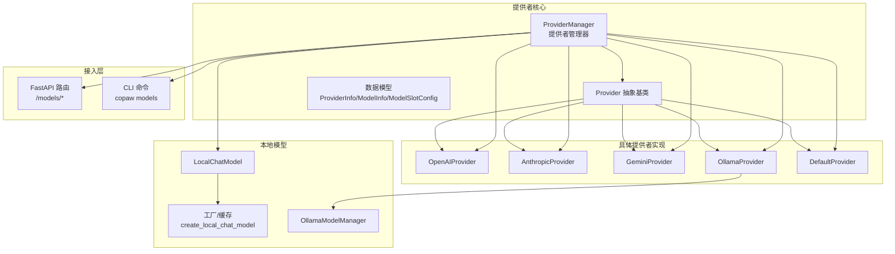
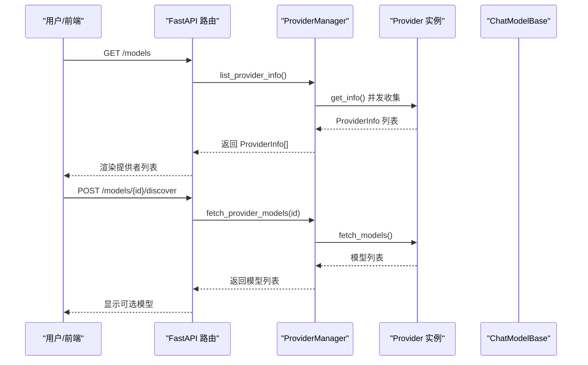
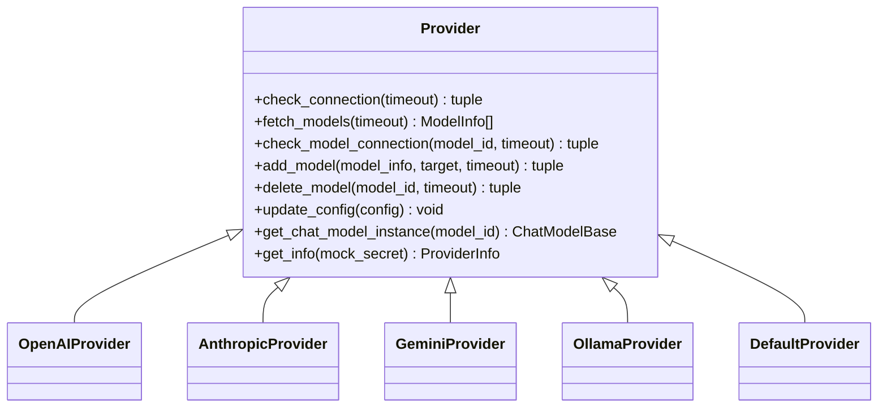
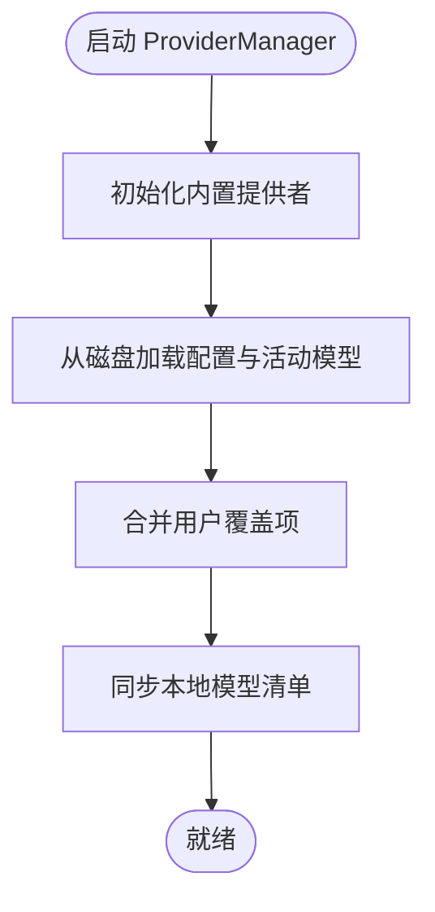
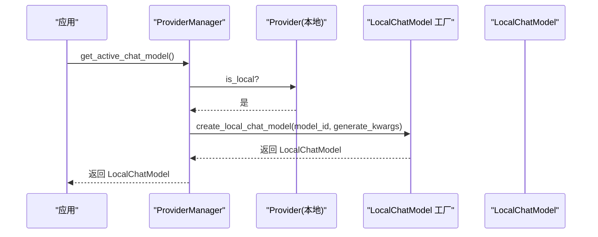
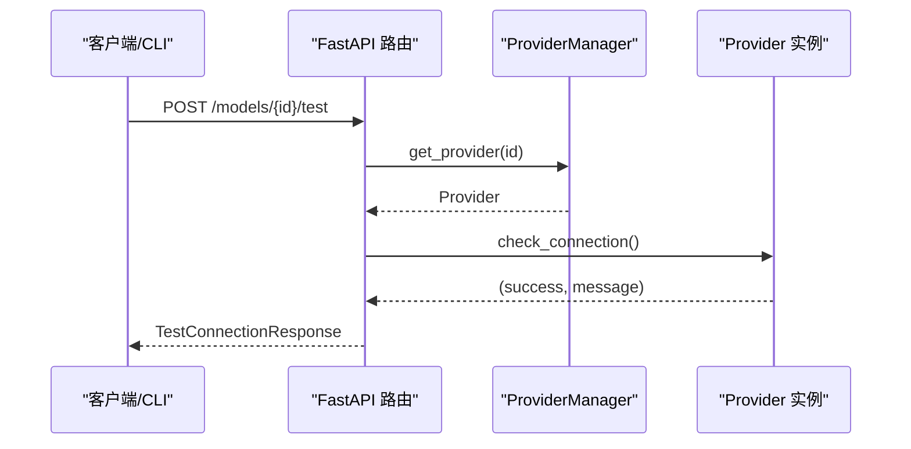
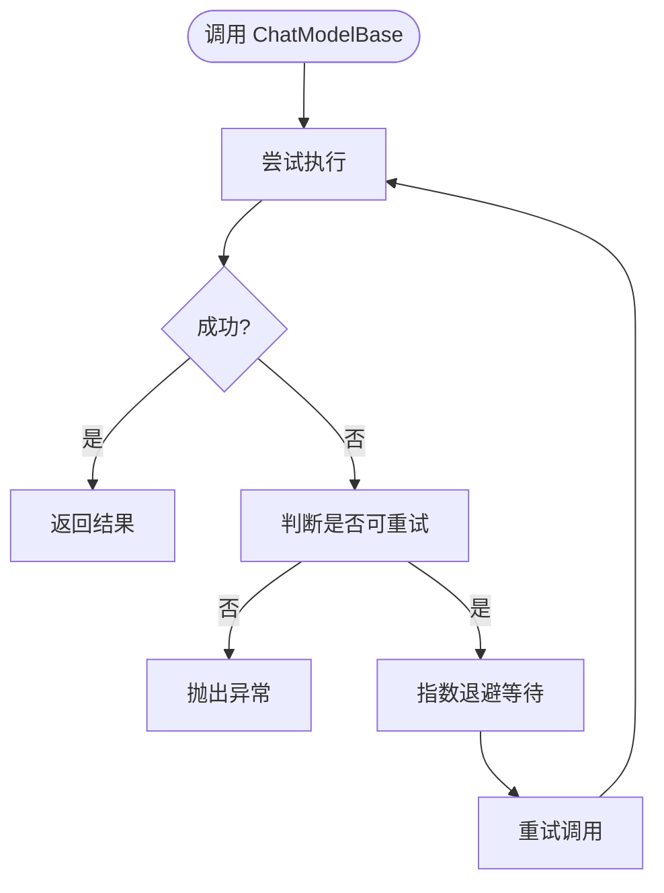
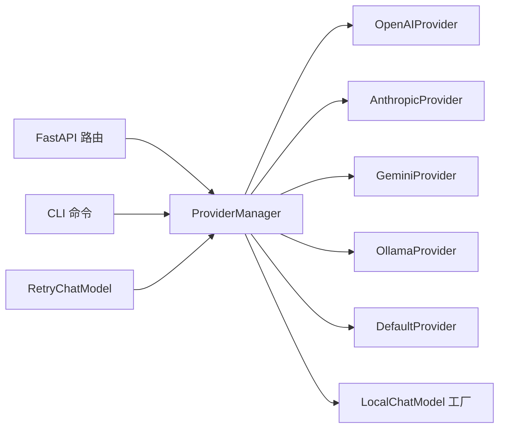

# 提供者插件系统

<cite>
**本文引用的文件**
- [provider.py](file://src/copaw/providers/provider.py)
- [provider_manager.py](file://src/copaw/providers/provider_manager.py)
- [models.py](file://src/copaw/providers/models.py)
- [openai_provider.py](file://src/copaw/providers/openai_provider.py)
- [anthropic_provider.py](file://src/copaw/providers/anthropic_provider.py)
- [gemini_provider.py](file://src/copaw/providers/gemini_provider.py)
- [ollama_provider.py](file://src/copaw/providers/ollama_provider.py)
- [ollama_manager.py](file://src/copaw/providers/ollama_manager.py)
- [chat_model.py](file://src/copaw/local_models/chat_model.py)
- [factory.py](file://src/copaw/local_models/factory.py)
- [providers.py](file://src/copaw/app/routers/providers.py)
- [providers_cmd.py](file://src/copaw/cli/providers_cmd.py)
- [retry_chat_model.py](file://src/copaw/providers/retry_chat_model.py)
- [constant.py](file://src/copaw/constant.py)
</cite>

## 目录
1. [简介](#简介)
2. [项目结构](#项目结构)
3. [核心组件](#核心组件)
4. [架构总览](#架构总览)
5. [详细组件分析](#详细组件分析)
6. [依赖分析](#依赖分析)
7. [性能考虑](#性能考虑)
8. [故障排查指南](#故障排查指南)
9. [结论](#结论)
10. [附录](#附录)

## 简介
本文件系统性阐述 CoPaw 提供者插件体系的设计与实现，覆盖以下主题：
- 模型提供者的抽象与多提供商实现（OpenAI、Anthropic、Gemini、Ollama、本地 llama.cpp/MLX）
- 动态加载与持久化存储（内置与自定义提供者）
- 连接性检查、模型发现与单模型可用性验证
- 本地模型支持与本地后端适配
- 云模型集成与兼容层（OpenAI 兼容接口）
- 混合推理架构：本地与云端的统一接入
- 健康检查、重试与超时控制
- 新提供者开发指南、配置规范与性能优化建议

## 项目结构
提供者系统主要位于 src/copaw/providers 及其子模块，配合本地模型模块 src/copaw/local_models，以及 API 路由与 CLI 命令进行统一管理。

图示来源
- [provider_manager.py:288-717](file://src/copaw/providers/provider_manager.py#L288-L717)
- [provider.py:73-231](file://src/copaw/providers/provider.py#L73-L231)
- [openai_provider.py:18-157](file://src/copaw/providers/openai_provider.py#L18-L157)
- [anthropic_provider.py:18-156](file://src/copaw/providers/anthropic_provider.py#L18-L156)
- [gemini_provider.py:17-131](file://src/copaw/providers/gemini_provider.py#L17-L131)
- [ollama_provider.py:19-179](file://src/copaw/providers/ollama_provider.py#L19-L179)
- [chat_model.py:39-362](file://src/copaw/local_models/chat_model.py#L39-L362)
- [factory.py:42-125](file://src/copaw/local_models/factory.py#L42-L125)
- [providers.py:22-437](file://src/copaw/app/routers/providers.py#L22-L437)
- [providers_cmd.py:1-889](file://src/copaw/cli/providers_cmd.py#L1-L889)

章节来源
- [provider_manager.py:288-717](file://src/copaw/providers/provider_manager.py#L288-L717)
- [provider.py:73-231](file://src/copaw/providers/provider.py#L73-L231)
- [models.py:11-81](file://src/copaw/providers/models.py#L11-L81)

## 核心组件
- Provider 抽象基类：定义提供者元信息、连接检查、模型发现、单模型连通性验证、模型增删、配置更新、聊天模型实例化等接口。
- ProviderManager：提供者注册表与生命周期管理，内置提供者初始化、自定义提供者 CRUD、磁盘持久化、活动模型槽位管理、本地模型同步。
- 具体提供者实现：OpenAIProvider、AnthropicProvider、GeminiProvider、OllamaProvider、DefaultProvider（用于本地/自定义）。
- 数据模型：ProviderInfo、ModelInfo、ModelSlotConfig 等，用于序列化与跨层传递。
- 本地模型适配：LocalChatModel 将本地后端（llama.cpp/MLX/Ollama）统一到 ChatModelBase 接口；工厂模式管理后端实例与缓存。
- 接入层：FastAPI 路由与 CLI 命令，提供配置、测试、模型发现、活动模型设置等能力。
- 重试与超时：RetryChatModel 包装器与常量配置，统一处理速率限制、超时与连接错误的指数退避重试。

章节来源
- [provider.py:73-231](file://src/copaw/providers/provider.py#L73-L231)
- [provider_manager.py:288-717](file://src/copaw/providers/provider_manager.py#L288-L717)
- [models.py:11-81](file://src/copaw/providers/models.py#L11-L81)
- [retry_chat_model.py:82-204](file://src/copaw/providers/retry_chat_model.py#L82-L204)
- [constant.py:123-189](file://src/copaw/constant.py#L123-L189)

## 架构总览
提供者系统采用“抽象基类 + 多实现 + 统一管理器”的分层设计。管理器负责：
- 初始化内置提供者并注入默认模型列表
- 加载/保存自定义提供者配置
- 同步本地模型清单（llama.cpp/MLX/Ollama）
- 维护全局或代理级活动模型槽位
- 通过路由与 CLI 对外暴露配置、测试、发现与切换能力

图示来源
- [providers.py:84-272](file://src/copaw/app/routers/providers.py#L84-L272)
- [provider_manager.py:342-407](file://src/copaw/providers/provider_manager.py#L342-L407)

## 详细组件分析

### 抽象基类与数据模型
- Provider 抽象基类定义了统一接口：check_connection、fetch_models、check_model_connection、add_model/delete_model、update_config、get_chat_model_instance、get_info。
- ProviderInfo/ModelInfo/ModelSlotConfig 作为跨层数据契约，确保前后端与 CLI 的一致性。
- DefaultProvider 作为“占位”实现，适用于无需网络调用的本地/自定义场景。

图示来源
- [provider.py:73-231](file://src/copaw/providers/provider.py#L73-L231)
- [openai_provider.py:18-157](file://src/copaw/providers/openai_provider.py#L18-L157)
- [anthropic_provider.py:18-156](file://src/copaw/providers/anthropic_provider.py#L18-L156)
- [gemini_provider.py:17-131](file://src/copaw/providers/gemini_provider.py#L17-L131)
- [ollama_provider.py:19-179](file://src/copaw/providers/ollama_provider.py#L19-L179)

章节来源
- [provider.py:11-201](file://src/copaw/providers/provider.py#L11-L201)
- [models.py:11-81](file://src/copaw/providers/models.py#L11-L81)

### ProviderManager：动态加载与持久化
- 内置提供者集中初始化，包含 OpenAI、Azure OpenAI、DashScope、ModelScope、Gemini、Anthropic、MiniMax、Ollama、LM Studio、llama.cpp、MLX 等。
- 自定义提供者通过 JSON 文件持久化于 SECRET_DIR/providers/custom，支持冲突 ID 解析与迁移。
- 支持从磁盘加载配置、合并用户覆盖项（如 base_url、api_key、extra_models、generate_kwargs），并维护活动模型槽位。
- 本地模型同步：扫描本地模型清单并填充 llama.cpp/MLX 提供者的 models 字段。

图示来源
- [provider_manager.py:321-338](file://src/copaw/providers/provider_manager.py#L321-L338)
- [provider_manager.py:648-690](file://src/copaw/providers/provider_manager.py#L648-L690)

章节来源
- [provider_manager.py:288-717](file://src/copaw/providers/provider_manager.py#L288-L717)

### 具体提供者实现

#### OpenAIProvider
- 使用 AsyncOpenAI 客户端，支持 models.list 获取模型列表与 chat.completions.ping 验证单模型可用性。
- DashScope/CodingPlan 特殊头注入以标识来源。
- get_chat_model_instance 返回 OpenAIChatModelCompat，支持流式输出与工具调用解析。

章节来源
- [openai_provider.py:18-157](file://src/copaw/providers/openai_provider.py#L18-L157)

#### AnthropicProvider
- 使用 AsyncAnthropic 客户端，支持 models.list 与 messages.create 流式验证。
- 支持 DashScope/CodingPlan 特殊头注入。
- get_chat_model_instance 返回 AnthropicChatModel。

章节来源
- [anthropic_provider.py:18-156](file://src/copaw/providers/anthropic_provider.py#L18-L156)

#### GeminiProvider
- 使用 google.genai 客户端，异步遍历 models.list 并规范化返回的模型名称。
- check_model_connection 使用 generate_content_stream 验证可用性。
- get_chat_model_instance 返回 GeminiChatModel。

章节来源
- [gemini_provider.py:17-131](file://src/copaw/providers/gemini_provider.py#L17-L131)

#### OllamaProvider
- 通过 AsyncClient 访问本地 Ollama 守护进程，支持 list/pull/delete 与 OpenAI 兼容路径转换。
- add_model/delete_model 通过 Ollama SDK 实现，适合远程主机（host 参数）。
- get_chat_model_instance 返回 OpenAIChatModelCompat，将 base_url 转换为 /v1。

章节来源
- [ollama_provider.py:19-179](file://src/copaw/providers/ollama_provider.py#L19-L179)
- [ollama_manager.py:75-140](file://src/copaw/providers/ollama_manager.py#L75-L140)

#### DefaultProvider
- 无网络调用的默认实现，适用于本地/自定义场景。
- check_connection 依赖已配置模型列表；check_model_connection 依赖模型存在性。

章节来源
- [provider.py:204-231](file://src/copaw/providers/provider.py#L204-L231)

### 本地模型支持与工厂模式
- LocalChatModel 将本地后端（llama.cpp/MLX/Ollama）封装为 ChatModelBase，支持同步后端在线程池中运行以兼容异步调用。
- 工厂函数 create_local_chat_model 采用单例缓存策略，避免重复加载，支持生成参数透传。
- OllamaModelManager 通过 Ollama SDK 列举、拉取与删除模型，屏蔽文件与清单细节。

图示来源
- [provider_manager.py:699-717](file://src/copaw/providers/provider_manager.py#L699-L717)
- [factory.py:42-125](file://src/copaw/local_models/factory.py#L42-L125)
- [chat_model.py:39-362](file://src/copaw/local_models/chat_model.py#L39-L362)

章节来源
- [chat_model.py:39-362](file://src/copaw/local_models/chat_model.py#L39-L362)
- [factory.py:42-125](file://src/copaw/local_models/factory.py#L42-L125)
- [ollama_manager.py:75-140](file://src/copaw/providers/ollama_manager.py#L75-L140)

### 接入层：API 路由与 CLI
- FastAPI 路由提供：列出提供者、配置提供者、测试连接、发现模型、测试单模型、增删自定义提供者、增删模型、查询/设置活动模型。
- CLI 命令提供：交互式配置、下载本地模型、列出本地模型、删除本地模型、Ollama 拉取等。

图示来源
- [providers.py:211-236](file://src/copaw/app/routers/providers.py#L211-L236)
- [providers_cmd.py:95-177](file://src/copaw/cli/providers_cmd.py#L95-L177)

章节来源
- [providers.py:22-437](file://src/copaw/app/routers/providers.py#L22-L437)
- [providers_cmd.py:1-889](file://src/copaw/cli/providers_cmd.py#L1-L889)

### 健康检查、重试与超时
- 健康检查：各 Provider 的 check_connection/check_model_connection 在各自 SDK 上执行最小成本验证。
- 超时控制：通过 MODEL_PROVIDER_CHECK_TIMEOUT 常量统一提供者侧检查超时。
- 重试包装：RetryChatModel 对 ChatModelBase 调用进行透明重试，基于环境变量 COPAW_LLM_MAX_RETRIES、COPAW_LLM_BACKOFF_BASE、COPAW_LLM_BACKOFF_CAP 控制重试次数与退避上限。

图示来源
- [retry_chat_model.py:64-140](file://src/copaw/providers/retry_chat_model.py#L64-L140)
- [constant.py:123-189](file://src/copaw/constant.py#L123-L189)

章节来源
- [retry_chat_model.py:82-204](file://src/copaw/providers/retry_chat_model.py#L82-L204)
- [constant.py:123-189](file://src/copaw/constant.py#L123-L189)

## 依赖分析
- ProviderManager 依赖各 Provider 实现与本地模型工厂；通过 Pydantic 序列化/反序列化实现配置持久化。
- 各 Provider 依赖对应 SDK（openai、anthropic、google.genai、ollama）。
- 接入层依赖 ProviderManager 与 FastAPI/Click。
- 重试包装器独立于具体 Provider，仅依赖 ChatModelBase 接口。

图示来源
- [provider_manager.py:288-717](file://src/copaw/providers/provider_manager.py#L288-L717)
- [providers.py:22-437](file://src/copaw/app/routers/providers.py#L22-L437)
- [providers_cmd.py:1-889](file://src/copaw/cli/providers_cmd.py#L1-L889)
- [retry_chat_model.py:82-204](file://src/copaw/providers/retry_chat_model.py#L82-L204)

章节来源
- [provider_manager.py:288-717](file://src/copaw/providers/provider_manager.py#L288-L717)

## 性能考虑
- 异步优先：Provider 的连接检查与模型发现均使用对应 SDK 的异步接口，减少阻塞。
- 本地推理：LocalChatModel 在线程池中执行同步后端，避免阻塞事件循环；流式响应通过队列桥接。
- 重试策略：指数退避降低对上游的压力峰值，结合最大重试次数避免无限等待。
- 超时控制：统一的 MODEL_PROVIDER_CHECK_TIMEOUT 与各 Provider 的 timeout 参数，防止长时间阻塞。
- 缓存与复用：LocalChatModel 工厂单例缓存已加载后端，避免重复初始化。

章节来源
- [chat_model.py:58-127](file://src/copaw/local_models/chat_model.py#L58-L127)
- [retry_chat_model.py:77-140](file://src/copaw/providers/retry_chat_model.py#L77-L140)
- [constant.py:123-129](file://src/copaw/constant.py#L123-L129)

## 故障排查指南
- 连接失败
  - 检查 base_url 与 api_key 是否正确配置（OpenAI/Anthropic/Gemini）。
  - 对于 DashScope/CodingPlan，确认特殊头是否按要求注入。
  - 使用 /models/{id}/test 或 CLI 命令进行快速验证。
- 模型不可用
  - 使用 /models/{id}/models/test 或 CLI 命令验证指定模型。
  - 对于 Ollama，确认模型已在本地守护进程中存在。
- 本地模型问题
  - 使用 copaw models local/list 查看已下载模型。
  - 使用 copaw models download 下载模型；使用 copaw models remove-local 删除。
  - 对于 Ollama，使用 copaw models ollama-pull 拉取模型。
- 重试与退避
  - 若出现 429/5xx 错误，RetryChatModel 会自动重试；可通过环境变量调整重试策略。
- 配置持久化
  - 自定义提供者保存在 SECRET_DIR/providers/custom；若冲突，系统会自动重命名。

章节来源
- [providers.py:211-300](file://src/copaw/app/routers/providers.py#L211-L300)
- [providers_cmd.py:473-889](file://src/copaw/cli/providers_cmd.py#L473-L889)
- [retry_chat_model.py:64-140](file://src/copaw/providers/retry_chat_model.py#L64-L140)

## 结论
CoPaw 提供者插件系统通过抽象基类与多实现解耦不同提供商协议，借助 ProviderManager 实现统一的生命周期管理与持久化；本地模型通过工厂与适配器无缝融入统一的 ChatModelBase 接口。配合健康检查、重试与超时控制，系统在复杂网络环境下具备良好的鲁棒性与可扩展性。新增提供者只需遵循 Provider 接口与 ProviderManager 的序列化约定，即可快速集成。

## 附录

### 新提供者开发指南
- 继承 Provider，实现以下方法：
  - check_connection：最小成本验证连接
  - fetch_models：获取可用模型列表并去重
  - check_model_connection：验证单个模型可用性
  - get_chat_model_instance：返回对应 ChatModelBase 实例
  - update_config：支持 base_url、api_key、chat_model、generate_kwargs 等字段更新
- 在 ProviderManager 中注册内置提供者，并在 _provider_from_data 中支持反序列化
- 如需本地模型支持，提供本地后端适配器并纳入工厂

章节来源
- [provider.py:73-231](file://src/copaw/providers/provider.py#L73-L231)
- [provider_manager.py:540-554](file://src/copaw/providers/provider_manager.py#L540-L554)

### 配置规范
- ProviderInfo 字段
  - id、name、base_url、api_key、chat_model、models、extra_models、api_key_prefix、is_local、freeze_url、require_api_key、is_custom、support_model_discovery、support_connection_check、generate_kwargs
- ModelInfo 字段
  - id、name
- ModelSlotConfig 字段
  - provider_id、model
- 环境变量
  - COPAW_MODEL_PROVIDER_CHECK_TIMEOUT：提供者连接检查超时
  - COPAW_LLM_MAX_RETRIES、COPAW_LLM_BACKOFF_BASE、COPAW_LLM_BACKOFF_CAP：重试策略

章节来源
- [models.py:11-81](file://src/copaw/providers/models.py#L11-L81)
- [constant.py:123-189](file://src/copaw/constant.py#L123-L189)