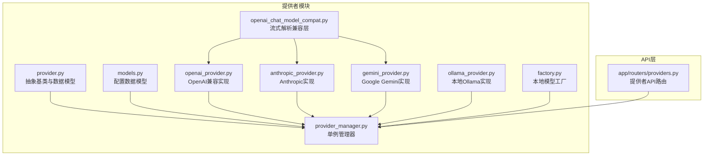
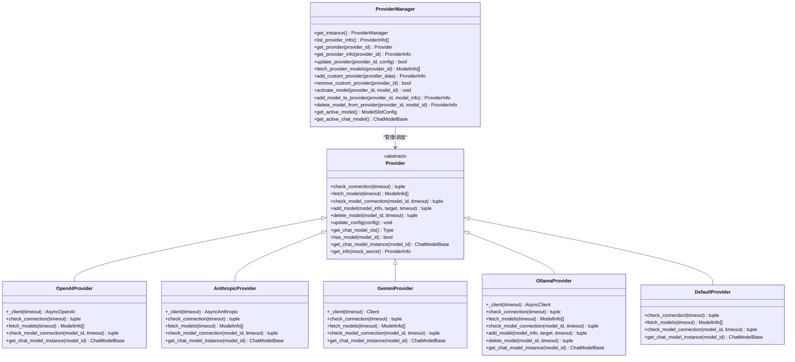
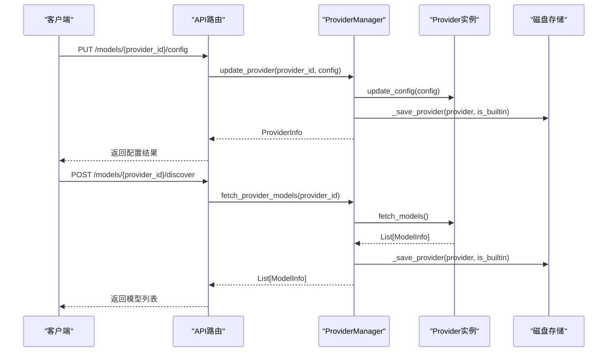
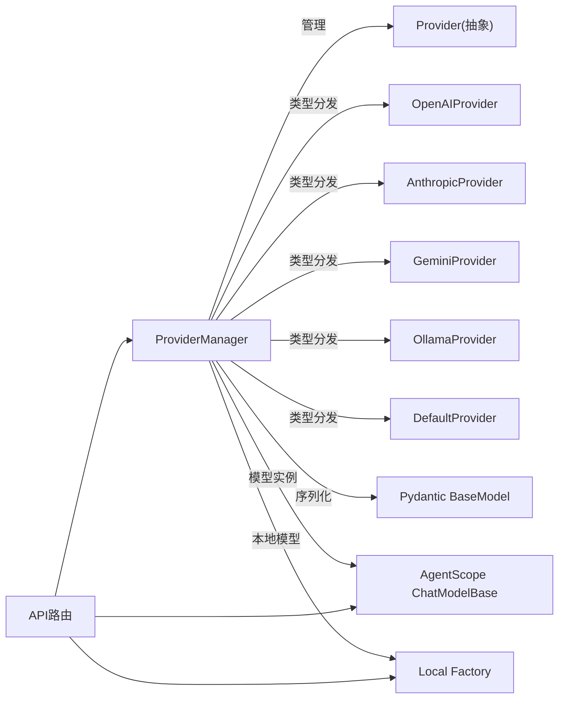

# 提供者架构设计

<cite>
**本文档引用的文件**
- [provider.py](file://src/copaw/providers/provider.py)
- [provider_manager.py](file://src/copaw/providers/provider_manager.py)
- [models.py](file://src/copaw/providers/models.py)
- [openai_provider.py](file://src/copaw/providers/openai_provider.py)
- [anthropic_provider.py](file://src/copaw/providers/anthropic_provider.py)
- [gemini_provider.py](file://src/copaw/providers/gemini_provider.py)
- [ollama_provider.py](file://src/copaw/providers/ollama_provider.py)
- [openai_chat_model_compat.py](file://src/copaw/providers/openai_chat_model_compat.py)
- [providers.py](file://src/copaw/app/routers/providers.py)
- [factory.py](file://src/copaw/local_models/factory.py)
- [test_provider_manager.py](file://tests/unit/providers/test_provider_manager.py)
- [test_openai_provider.py](file://tests/unit/providers/test_openai_provider.py)
</cite>

## 目录
1. [简介](#简介)
2. [项目结构](#项目结构)
3. [核心组件](#核心组件)
4. [架构总览](#架构总览)
5. [详细组件分析](#详细组件分析)
6. [依赖关系分析](#依赖关系分析)
7. [性能考虑](#性能考虑)
8. [故障排除指南](#故障排除指南)
9. [结论](#结论)
10. [附录](#附录)

## 简介
本文件面向CoPaw提供者架构设计，系统性阐述Provider抽象基类的设计理念与接口规范，ProviderManager单例模式实现、动态加载机制与生命周期管理，提供者配置的数据结构、序列化与持久化策略，以及提供者之间的继承关系、多态实现与扩展点设计。文档同时给出架构图解、设计模式应用与扩展指南，帮助开发者在不直接阅读源码的情况下快速理解并扩展提供者体系。

## 项目结构
CoPaw的提供者体系位于src/copaw/providers目录，围绕Provider抽象基类构建，通过ProviderManager统一管理内置与自定义提供者，并通过FastAPI路由暴露REST接口供前端或外部系统调用。

图表来源
- [provider.py:1-231](file://src/copaw/providers/provider.py#L1-L231)
- [provider_manager.py:1-717](file://src/copaw/providers/provider_manager.py#L1-L717)
- [models.py:1-81](file://src/copaw/providers/models.py#L1-L81)
- [openai_provider.py:1-157](file://src/copaw/providers/openai_provider.py#L1-L157)
- [anthropic_provider.py:1-156](file://src/copaw/providers/anthropic_provider.py#L1-L156)
- [gemini_provider.py:1-131](file://src/copaw/providers/gemini_provider.py#L1-L131)
- [ollama_provider.py:1-179](file://src/copaw/providers/ollama_provider.py#L1-L179)
- [openai_chat_model_compat.py:1-213](file://src/copaw/providers/openai_chat_model_compat.py#L1-L213)
- [factory.py:1-125](file://src/copaw/local_models/factory.py#L1-L125)
- [providers.py:1-437](file://src/copaw/app/routers/providers.py#L1-L437)

章节来源
- [provider.py:1-231](file://src/copaw/providers/provider.py#L1-L231)
- [provider_manager.py:1-717](file://src/copaw/providers/provider_manager.py#L1-L717)
- [models.py:1-81](file://src/copaw/providers/models.py#L1-L81)
- [providers.py:1-437](file://src/copaw/app/routers/providers.py#L1-L437)

## 核心组件
- 抽象基类Provider：定义提供者通用接口（连接检查、模型发现、模型连通性检查、模型增删、配置更新、聊天模型实例化等），并提供默认实现（如add_model、delete_model、update_config、get_info）。
- 具体提供者实现：
  - OpenAIProvider：适配OpenAI及其兼容端点（含DashScope、Aliyun CodingPlan等），支持模型发现与连通性测试。
  - AnthropicProvider：适配Anthropic API，支持模型发现与连通性测试。
  - GeminiProvider：适配Google Gemini API，支持模型发现与连通性测试。
  - OllamaProvider：适配本地Ollama平台，支持模型拉取/删除与连通性测试。
  - DefaultProvider：默认实现，用于本地llama.cpp/MLX等场景。
- ProviderManager：单例管理器，负责内置提供者的初始化、自定义提供者的增删改查、持久化与迁移、活动模型激活与获取。
- 数据模型：ProviderInfo、ModelInfo、ProviderDefinition、ProviderSettings、CustomProviderData、ModelSlotConfig等，支撑配置的序列化与持久化。
- API路由：提供者列表、配置、连接测试、模型发现、模型测试、活动模型设置等REST接口。
- 兼容层：OpenAIChatModelCompat统一处理流式响应中的工具调用解析与额外内容透传，提升跨Provider的稳定性。

章节来源
- [provider.py:73-231](file://src/copaw/providers/provider.py#L73-L231)
- [openai_provider.py:18-157](file://src/copaw/providers/openai_provider.py#L18-L157)
- [anthropic_provider.py:18-156](file://src/copaw/providers/anthropic_provider.py#L18-L156)
- [gemini_provider.py:17-131](file://src/copaw/providers/gemini_provider.py#L17-L131)
- [ollama_provider.py:19-179](file://src/copaw/providers/ollama_provider.py#L19-L179)
- [provider_manager.py:288-717](file://src/copaw/providers/provider_manager.py#L288-L717)
- [models.py:11-81](file://src/copaw/providers/models.py#L11-L81)
- [openai_chat_model_compat.py:186-213](file://src/copaw/providers/openai_chat_model_compat.py#L186-L213)
- [providers.py:31-437](file://src/copaw/app/routers/providers.py#L31-L437)

## 架构总览
提供者架构采用“抽象基类 + 多态实现 + 统一管理器”的分层设计，结合单例模式与持久化策略，形成可扩展、可配置、可测试的提供者生态。

图表来源
- [provider.py:73-231](file://src/copaw/providers/provider.py#L73-L231)
- [openai_provider.py:18-157](file://src/copaw/providers/openai_provider.py#L18-L157)
- [anthropic_provider.py:18-156](file://src/copaw/providers/anthropic_provider.py#L18-L156)
- [gemini_provider.py:17-131](file://src/copaw/providers/gemini_provider.py#L17-L131)
- [ollama_provider.py:19-179](file://src/copaw/providers/ollama_provider.py#L19-L179)
- [provider_manager.py:288-717](file://src/copaw/providers/provider_manager.py#L288-L717)

## 详细组件分析

### Provider抽象基类与接口规范
- 设计理念
  - 以ProviderInfo为基础数据模型，承载提供者标识、名称、基础URL、API密钥、聊天模型类名、预置模型列表、用户自定义模型列表、API密钥前缀、是否本地、URL冻结、是否需要API密钥、是否自定义、是否支持模型发现、是否支持连接检查、生成参数等字段。
  - 通过抽象方法约束具体提供者必须实现的最小接口集，确保不同Provider在统一契约下工作。
- 关键接口
  - 连接检查：check_connection(timeout)，用于验证当前配置是否可达。
  - 模型发现：fetch_models(timeout)，从Provider API获取可用模型列表。
  - 模型连通性：check_model_connection(model_id, timeout)，验证特定模型是否可用。
  - 模型管理：add_model、delete_model，默认实现支持在extra_models中增删。
  - 配置更新：update_config(config)，按字段粒度更新Provider配置，尊重freeze_url、is_custom等约束。
  - 聊天模型实例：get_chat_model_cls/get_chat_model_instance，返回对应AgentScope聊天模型类或实例。
  - 信息导出：get_info(mock_secret)，返回ProviderInfo副本，支持脱敏显示。
- 默认实现与约束
  - DefaultProvider提供无操作实现，适用于本地提供者场景。
  - 支持generate_kwargs字典传递给AgentScope聊天模型，便于参数透传。

章节来源
- [provider.py:11-71](file://src/copaw/providers/provider.py#L11-L71)
- [provider.py:73-231](file://src/copaw/providers/provider.py#L73-L231)

### ProviderManager单例模式与生命周期管理
- 单例模式
  - 使用静态变量保存唯一实例，首次访问时构造；通过get_instance()提供全局访问入口，避免重复初始化。
- 生命周期阶段
  - 初始化：准备磁盘存储目录（providers/builtin、providers/custom、active_model.json），初始化内置Provider集合，迁移旧格式providers.json，从磁盘加载持久化配置，更新本地模型列表。
  - 运行期：提供查询、更新、添加、删除、模型发现、活动模型激活等能力。
  - 关闭/重载：通过重新构造ProviderManager实例实现状态刷新。
- 存储与迁移
  - 内置Provider配置写入builtin目录，自定义Provider写入custom目录，均以JSON文件形式持久化，权限限制为0600。
  - 迁移逻辑：从legacy providers.json读取providers/custom_providers/active_llm，映射到新结构并删除旧文件。
- 活动模型
  - 通过ModelSlotConfig记录当前激活的provider_id与model，支持全局与代理级（通过API层）覆盖。

图表来源
- [providers.py:95-121](file://src/copaw/app/routers/providers.py#L95-L121)
- [providers.py:243-271](file://src/copaw/app/routers/providers.py#L243-L271)
- [provider_manager.py:369-407](file://src/copaw/providers/provider_manager.py#L369-L407)
- [provider_manager.py:499-516](file://src/copaw/providers/provider_manager.py#L499-L516)

章节来源
- [provider_manager.py:288-717](file://src/copaw/providers/provider_manager.py#L288-L717)
- [providers.py:31-437](file://src/copaw/app/routers/providers.py#L31-L437)

### 提供者配置的数据结构、序列化与持久化
- 数据模型
  - ProviderInfo：对外展示的提供者信息，包含敏感字段脱敏输出。
  - ModelInfo：模型标识与名称。
  - ProviderDefinition：内置/自定义提供者的静态定义。
  - ProviderSettings：内置提供者的运行时设置（base_url、api_key、extra_models、chat_model）。
  - CustomProviderData：自定义提供者的完整持久化形态。
  - ModelSlotConfig：活动模型槽位。
- 序列化与反序列化
  - 所有Provider与配置对象基于Pydantic BaseModel，使用model_dump()/model_validate()进行序列化与反序列化。
  - ProviderManager根据is_local、chat_model、id等字段进行类型分发，确保正确恢复Provider类型。
- 持久化策略
  - 内置Provider：仅持久化运行时变更（api_key、extra_models、generate_kwargs），默认base_url保持内置值。
  - 自定义Provider：完整持久化，支持后续重建。
  - 权限控制：写入文件权限设为0600，提升安全性。

章节来源
- [models.py:11-81](file://src/copaw/providers/models.py#L11-L81)
- [provider_manager.py:540-554](file://src/copaw/providers/provider_manager.py#L540-L554)
- [provider_manager.py:499-516](file://src/copaw/providers/provider_manager.py#L499-L516)

### 提供者间的继承关系、多态实现与扩展点
- 继承关系
  - OpenAIProvider、AnthropicProvider、GeminiProvider、OllamaProvider、DefaultProvider均继承自Provider，遵循统一接口契约。
- 多态实现
  - ProviderManager通过get_provider()返回具体Provider实例，调用方无需关心具体类型差异。
  - get_chat_model_instance()返回对应聊天模型实例，实现跨Provider的统一调用。
- 扩展点设计
  - 新增Provider：继承Provider，实现check_connection、fetch_models、check_model_connection、get_chat_model_instance。
  - 类型分发：ProviderManager._provider_from_data()根据id/chat_model/is_local进行类型选择，便于扩展新的Provider类型。
  - 兼容层：OpenAIChatModelCompat统一处理流式响应解析，降低Provider间差异带来的兼容成本。

章节来源
- [openai_provider.py:18-157](file://src/copaw/providers/openai_provider.py#L18-L157)
- [anthropic_provider.py:18-156](file://src/copaw/providers/anthropic_provider.py#L18-L156)
- [gemini_provider.py:17-131](file://src/copaw/providers/gemini_provider.py#L17-L131)
- [ollama_provider.py:19-179](file://src/copaw/providers/ollama_provider.py#L19-L179)
- [provider_manager.py:540-554](file://src/copaw/providers/provider_manager.py#L540-L554)
- [openai_chat_model_compat.py:186-213](file://src/copaw/providers/openai_chat_model_compat.py#L186-L213)

### 动态加载机制与本地模型集成
- 动态加载
  - ProviderManager在初始化时加载builtin/custom目录下的JSON文件，重建Provider实例。
  - 通过get_active_chat_model()根据活动模型选择本地或远程Provider实例。
- 本地模型集成
  - OllamaProvider支持模型拉取/删除，结合本地模型工厂factory.py实现本地模型的统一管理与复用。
  - DefaultProvider配合本地模型工厂，支持llama.cpp/MLX等本地后端。

章节来源
- [provider_manager.py:648-690](file://src/copaw/providers/provider_manager.py#L648-L690)
- [factory.py:42-125](file://src/copaw/local_models/factory.py#L42-L125)
- [ollama_provider.py:119-179](file://src/copaw/providers/ollama_provider.py#L119-L179)

### API工作流与错误处理
- API路由
  - 列表：GET /models
  - 配置：PUT /models/{provider_id}/config
  - 测试连接：POST /models/{provider_id}/test
  - 发现模型：POST /models/{provider_id}/discover
  - 测试模型：POST /models/{provider_id}/models/test
  - 添加/删除模型：POST /models/{provider_id}/models、DELETE /models/{provider_id}/models/{model_id}
  - 自定义提供者：POST /models/custom-providers、DELETE /models/custom-providers/{provider_id}
  - 活动模型：GET /models/active、PUT /models/active
- 错误处理
  - 对未知Provider返回404，非法参数返回400。
  - Provider内部异常捕获并返回友好消息，避免崩溃。
  - 测试流程使用深拷贝临时Provider，避免修改原配置。

章节来源
- [providers.py:79-437](file://src/copaw/app/routers/providers.py#L79-L437)

## 依赖关系分析
- ProviderManager对各Provider实现存在直接依赖，但通过抽象基类与类型分发实现松耦合。
- ProviderManager依赖Pydantic进行配置序列化，依赖agentscope模型类进行聊天模型实例化。
- API路由依赖ProviderManager完成业务编排，依赖AgentScope模型类与本地模型工厂。

图表来源
- [provider_manager.py:288-717](file://src/copaw/providers/provider_manager.py#L288-L717)
- [providers.py:31-437](file://src/copaw/app/routers/providers.py#L31-L437)

章节来源
- [provider_manager.py:288-717](file://src/copaw/providers/provider_manager.py#L288-L717)
- [providers.py:31-437](file://src/copaw/app/routers/providers.py#L31-L437)

## 性能考虑
- 异步并发
  - ProviderManager在列举Provider信息时使用asyncio.gather并发执行多个Provider的get_info()，提升UI加载速度。
- I/O优化
  - JSON文件读写采用UTF-8编码与缩进格式，便于调试与版本控制。
  - 文件权限严格限制为0600，减少安全风险。
- 本地模型缓存
  - DefaultProvider与本地模型工厂结合，避免重复加载本地模型，提高响应速度。
- 参数透传
  - generate_kwargs通过ProviderInfo传递至聊天模型，减少中间层开销。

章节来源
- [provider_manager.py:342-350](file://src/copaw/providers/provider_manager.py#L342-L350)
- [provider_manager.py:499-516](file://src/copaw/providers/provider_manager.py#L499-L516)
- [factory.py:42-125](file://src/copaw/local_models/factory.py#L42-L125)

## 故障排除指南
- 常见问题
  - Provider未找到：检查provider_id是否正确，确认是否为内置或自定义。
  - 模型不存在：确认模型ID存在于Provider.models或extra_models中。
  - 连接失败：检查base_url、api_key、网络连通性；部分Provider支持连接检查，可通过/test接口验证。
  - 本地模型不可用：确认本地模型已下载且路径有效；检查后端库安装情况。
- 定位建议
  - 查看ProviderManager日志输出，关注迁移、加载、保存过程中的警告信息。
  - 使用/test与/models/test接口进行端到端验证。
  - 检查providers/builtin与providers/custom目录下JSON文件是否损坏或权限不足。

章节来源
- [provider_manager.py:582-647](file://src/copaw/providers/provider_manager.py#L582-L647)
- [providers.py:211-236](file://src/copaw/app/routers/providers.py#L211-L236)
- [test_provider_manager.py:178-186](file://tests/unit/providers/test_provider_manager.py#L178-L186)

## 结论
CoPaw提供者架构通过抽象基类统一接口、单例管理器集中治理、完善的序列化与持久化策略，实现了跨Provider的一致体验与良好扩展性。借助多态与兼容层，系统在保证易用性的同时兼顾了性能与安全性。未来扩展新Provider时，遵循Provider接口契约与ProviderManager类型分发规则即可快速接入。

## 附录

### 设计模式应用
- 抽象工厂/模板方法：Provider抽象基类定义模板方法，具体Provider实现关键步骤。
- 单例模式：ProviderManager使用静态实例确保全局唯一。
- 工厂模式：ProviderManager根据配置类型分发具体Provider实例。
- 兼容模式：OpenAIChatModelCompat统一流式响应解析，降低Provider差异影响。

### 扩展指南
- 新增Provider步骤
  - 继承Provider，实现check_connection、fetch_models、check_model_connection、get_chat_model_instance。
  - 在ProviderManager中注册内置Provider或允许用户通过API创建自定义Provider。
  - 如需本地模型支持，可在OllamaProvider或DefaultProvider基础上扩展。
- 最佳实践
  - 明确freeze_url与require_api_key等属性，避免误配置。
  - 合理使用generate_kwargs，确保参数与目标Provider兼容。
  - 为Provider实现连接检查与模型连通性检查，提升用户体验。
  - 使用测试接口验证Provider连通性与模型可用性。