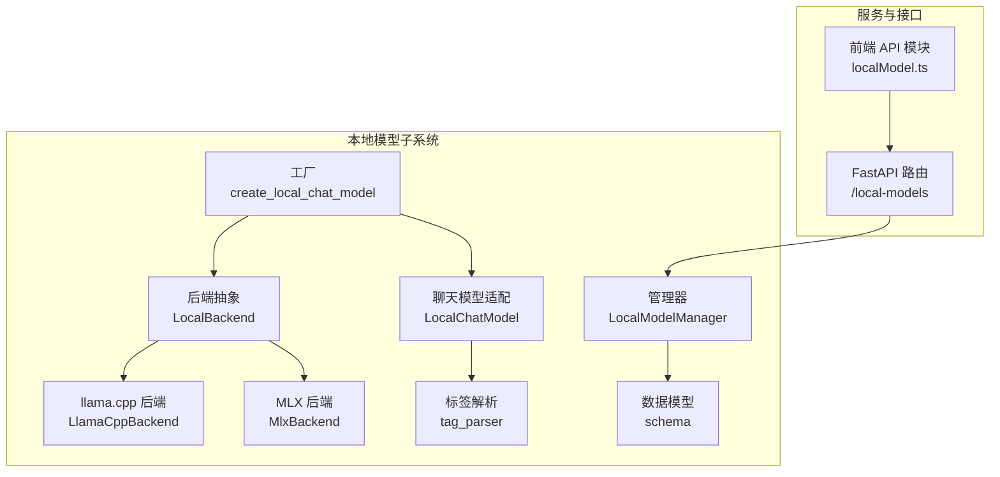
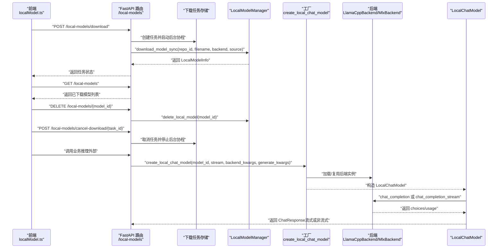
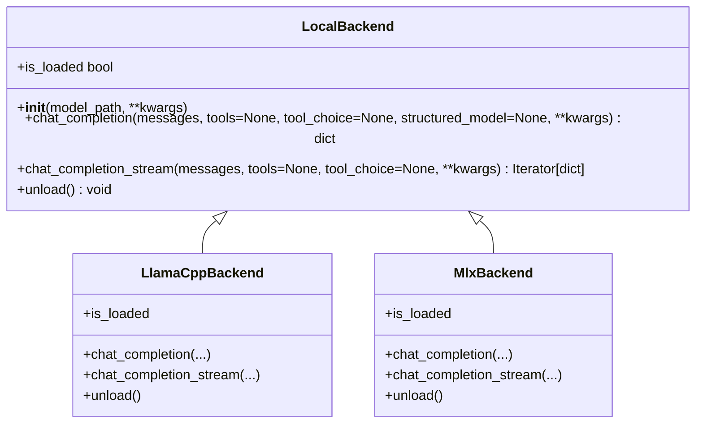
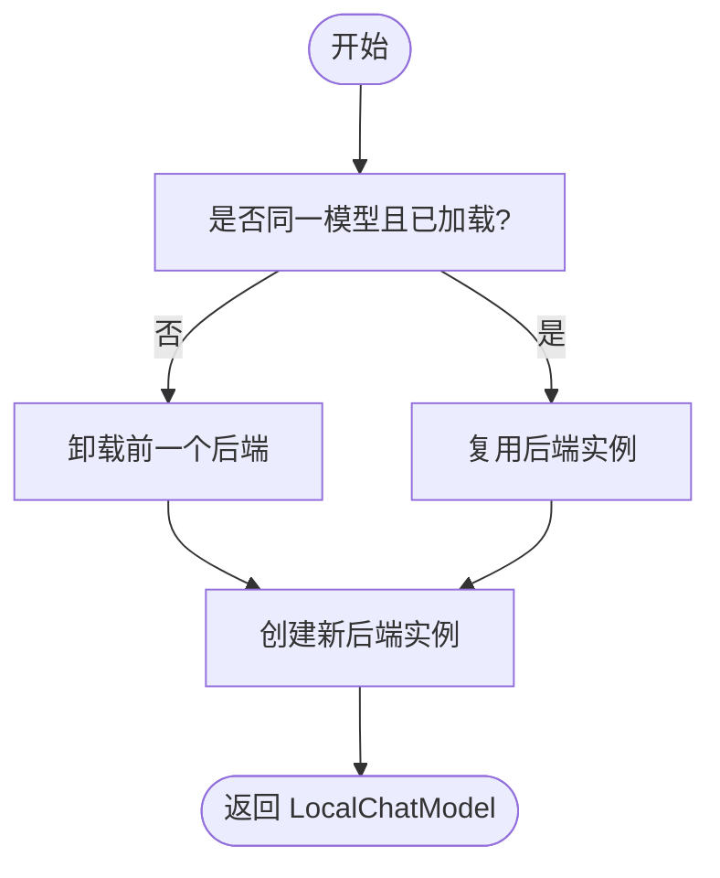
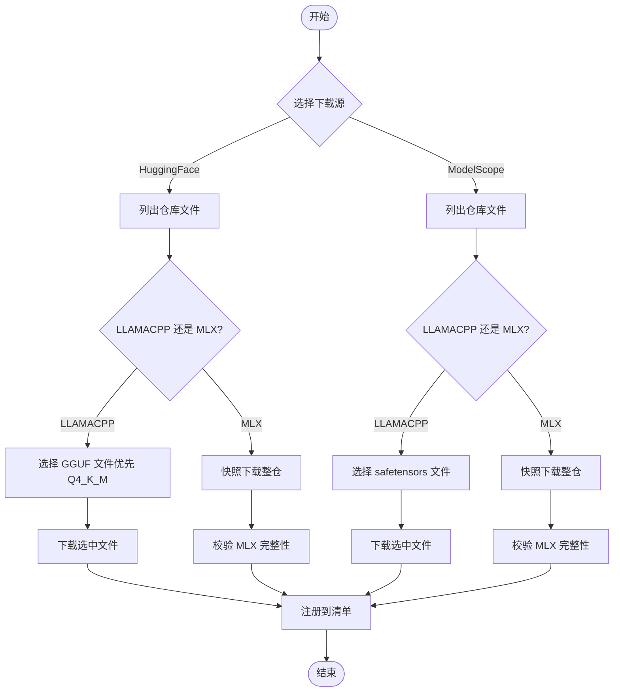
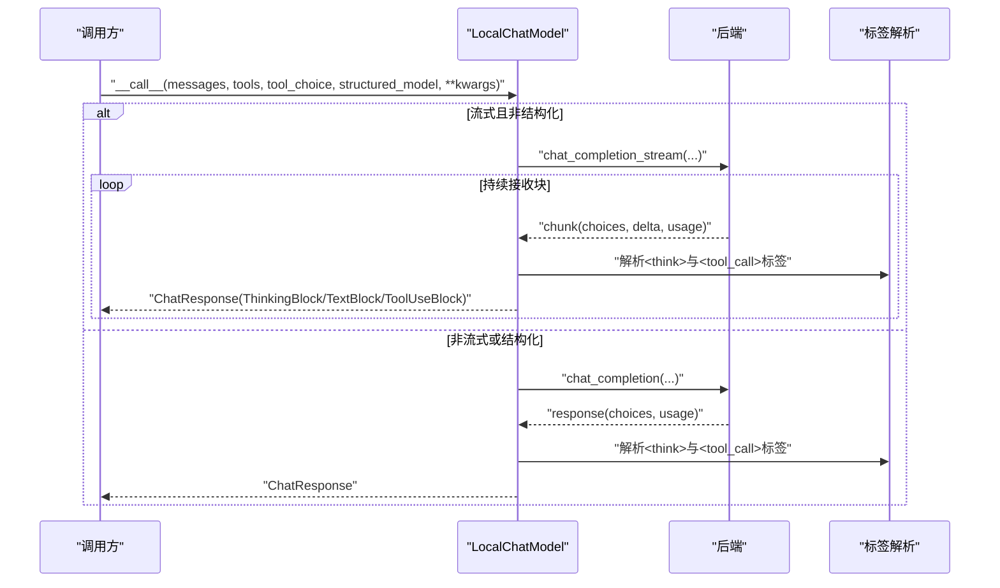
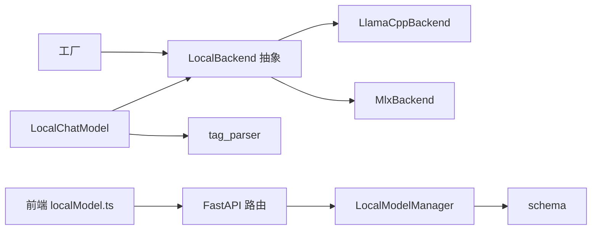

# 本地模型支持

<cite>
**本文引用的文件**
- [llamacpp_backend.py](file://src/copaw/local_models/backends/llamacpp_backend.py)
- [mlx_backend.py](file://src/copaw/local_models/backends/mlx_backend.py)
- [base.py](file://src/copaw/local_models/backends/base.py)
- [chat_model.py](file://src/copaw/local_models/chat_model.py)
- [factory.py](file://src/copaw/local_models/factory.py)
- [manager.py](file://src/copaw/local_models/manager.py)
- [schema.py](file://src/copaw/local_models/schema.py)
- [tag_parser.py](file://src/copaw/local_models/tag_parser.py)
- [local_models.py](file://src/copaw/app/routers/local_models.py)
- [localModel.ts](file://console/src/api/modules/localModel.ts)
</cite>

## 目录
1. [简介](#简介)
2. [项目结构](#项目结构)
3. [核心组件](#核心组件)
4. [架构总览](#架构总览)
5. [详细组件分析](#详细组件分析)
6. [依赖分析](#依赖分析)
7. [性能考虑](#性能考虑)
8. [故障排查指南](#故障排查指南)
9. [结论](#结论)
10. [附录](#附录)

## 简介
本文件面向 CoPaw 的本地模型支持子系统，系统性阐述基于 llama.cpp 与 MLX 后端的本地推理架构、模型加载与卸载机制、消息规范化与流式输出处理、以及与云端模型的切换与混合推理能力。文档同时覆盖安装指引、性能调优建议与常见问题排查，帮助开发者与运维人员在不同硬件平台（x86_64 与 Apple Silicon）上高效部署与使用本地大模型。

## 项目结构
本地模型支持位于 src/copaw/local_models 目录，围绕“后端抽象 + 工厂 + 管理器 + 聊天模型适配 + API 路由 + 前端接口”组织代码，形成清晰的分层与职责边界：
- 后端抽象与实现：LocalBackend 抽象类定义统一接口；llama.cpp 与 MLX 分别提供具体实现。
- 工厂与管理：工厂负责单例复用与后端选择；管理器负责下载、注册、清单持久化与校验。
- 聊天模型适配：LocalChatModel 将后端输出映射到统一的 ChatResponse 结构，并兼容流式与非流式。
- API 路由与前端：FastAPI 提供本地模型列表、下载、取消、删除等接口；前端通过模块化 API 客户端调用。

图表来源
- [base.py:12-64](file://src/copaw/local_models/backends/base.py#L12-L64)
- [llamacpp_backend.py:45-140](file://src/copaw/local_models/backends/llamacpp_backend.py#L45-L140)
- [mlx_backend.py:57-236](file://src/copaw/local_models/backends/mlx_backend.py#L57-L236)
- [factory.py:42-125](file://src/copaw/local_models/factory.py#L42-L125)
- [manager.py:94-413](file://src/copaw/local_models/manager.py#L94-L413)
- [chat_model.py:39-362](file://src/copaw/local_models/chat_model.py#L39-L362)
- [tag_parser.py:1-230](file://src/copaw/local_models/tag_parser.py#L1-L230)
- [schema.py:12-59](file://src/copaw/local_models/schema.py#L12-L59)
- [local_models.py:27-320](file://src/copaw/app/routers/local_models.py#L27-L320)
- [localModel.ts:1-39](file://console/src/api/modules/localModel.ts#L1-L39)

章节来源
- [base.py:12-64](file://src/copaw/local_models/backends/base.py#L12-L64)
- [llamacpp_backend.py:45-140](file://src/copaw/local_models/backends/llamacpp_backend.py#L45-L140)
- [mlx_backend.py:57-236](file://src/copaw/local_models/backends/mlx_backend.py#L57-L236)
- [factory.py:42-125](file://src/copaw/local_models/factory.py#L42-L125)
- [manager.py:94-413](file://src/copaw/local_models/manager.py#L94-L413)
- [chat_model.py:39-362](file://src/copaw/local_models/chat_model.py#L39-L362)
- [tag_parser.py:1-230](file://src/copaw/local_models/tag_parser.py#L1-L230)
- [schema.py:12-59](file://src/copaw/local_models/schema.py#L12-L59)
- [local_models.py:27-320](file://src/copaw/app/routers/local_models.py#L27-L320)
- [localModel.ts:1-39](file://console/src/api/modules/localModel.ts#L1-L39)

## 核心组件
- 后端抽象 LocalBackend：定义统一的初始化、聊天补全（含流式）、卸载与状态查询接口，屏蔽底层库差异。
- llama.cpp 后端 LlamaCppBackend：封装 llama-cpp-python，支持 n_ctx、n_gpu_layers、chat_format 等参数，提供标准化的 OpenAI 兼容响应。
- MLX 后端 MlxBackend：封装 mlx-lm，针对 Apple Silicon 优化，支持目录型模型（safetensors + 配置），内置采样器参数映射与结构化输出提示拼接。
- 工厂 create_local_chat_model：单例模式复用已加载后端，按需卸载/加载新模型，支持生成参数透传。
- 管理器 LocalModelManager：从 Hugging Face 或 ModelScope 下载模型，自动选择文件格式，注册清单并校验 MLX 模型完整性。
- 聊天模型适配 LocalChatModel：将后端返回的 choices/usage 映射为统一的 ChatResponse，支持思考内容与工具调用解析，兼容流式与非流式。
- 标签解析 tag_parser：解析模型输出中的<think>与<tool_call>...</tool_call>标签，用于提取思维与工具调用信息。
- 数据模型 schema：定义后端类型、下载源、模型元数据与清单结构。
- API 路由与前端：提供本地模型列表、下载任务、取消与删除接口，前端模块化封装请求。

章节来源
- [base.py:12-64](file://src/copaw/local_models/backends/base.py#L12-L64)
- [llamacpp_backend.py:45-140](file://src/copaw/local_models/backends/llamacpp_backend.py#L45-L140)
- [mlx_backend.py:57-236](file://src/copaw/local_models/backends/mlx_backend.py#L57-L236)
- [factory.py:42-125](file://src/copaw/local_models/factory.py#L42-L125)
- [manager.py:94-413](file://src/copaw/local_models/manager.py#L94-L413)
- [chat_model.py:39-362](file://src/copaw/local_models/chat_model.py#L39-L362)
- [tag_parser.py:1-230](file://src/copaw/local_models/tag_parser.py#L1-L230)
- [schema.py:12-59](file://src/copaw/local_models/schema.py#L12-L59)
- [local_models.py:27-320](file://src/copaw/app/routers/local_models.py#L27-L320)
- [localModel.ts:1-39](file://console/src/api/modules/localModel.ts#L1-L39)

## 架构总览
下图展示从 API 请求到本地模型推理与响应的端到端流程，包括下载、加载、推理与流式输出的关键节点。

图表来源
- [local_models.py:94-320](file://src/copaw/app/routers/local_models.py#L94-L320)
- [manager.py:94-413](file://src/copaw/local_models/manager.py#L94-L413)
- [factory.py:42-125](file://src/copaw/local_models/factory.py#L42-L125)
- [chat_model.py:39-362](file://src/copaw/local_models/chat_model.py#L39-L362)
- [llamacpp_backend.py:86-140](file://src/copaw/local_models/backends/llamacpp_backend.py#L86-L140)
- [mlx_backend.py:98-236](file://src/copaw/local_models/backends/mlx_backend.py#L98-L236)
- [localModel.ts:1-39](file://console/src/api/modules/localModel.ts#L1-L39)

## 详细组件分析

### 后端抽象与实现
- LocalBackend 抽象类定义了统一接口：初始化、非流式聊天补全、流式聊天补全、卸载与加载状态检查。
- LlamaCppBackend 实现：
  - 初始化时读取 n_ctx、n_gpu_layers、verbose、chat_format 等参数，调用底层 Llama 对象。
  - 聊天补全支持 tools/tool_choice 与结构化输出（通过 response_format 的 JSON Schema）。
  - 流式补全直接透传底层迭代器，逐块产出。
  - 卸载释放底层对象并记录日志。
- MlxBackend 实现：
  - 解析模型路径（目录或文件），加载模型与分词器。
  - 构建提示时应用 tokenizer 的 chat template，并可注入工具描述（若分词器支持）。
  - 采样参数映射：将 temperature 映射为 temp，保留 top_p、min_p、top_k。
  - 结构化输出通过在提示末尾追加 JSON Schema 指令实现（MLX 不原生支持）。
  - 流式生成累积文本并按块返回 delta，最终附加 usage。

图表来源
- [base.py:12-64](file://src/copaw/local_models/backends/base.py#L12-L64)
- [llamacpp_backend.py:45-140](file://src/copaw/local_models/backends/llamacpp_backend.py#L45-L140)
- [mlx_backend.py:57-236](file://src/copaw/local_models/backends/mlx_backend.py#L57-L236)

章节来源
- [base.py:12-64](file://src/copaw/local_models/backends/base.py#L12-L64)
- [llamacpp_backend.py:45-140](file://src/copaw/local_models/backends/llamacpp_backend.py#L45-L140)
- [mlx_backend.py:57-236](file://src/copaw/local_models/backends/mlx_backend.py#L57-L236)

### 工厂与模型生命周期
- 单例工厂 create_local_chat_model：
  - 若相同 model_id 已加载且仍可用，则直接复用后端实例，避免重复加载。
  - 若不同模型被请求，先卸载旧后端再加载新后端。
  - 支持向后端构造函数传递 backend_kwargs，向每次生成传递 generate_kwargs。
- 活跃模型查询与卸载：
  - get_active_local_model 返回当前已加载的 (model_id, backend)。
  - unload_active_model 主动释放资源，便于切换或内存回收。

图表来源
- [factory.py:22-107](file://src/copaw/local_models/factory.py#L22-L107)

章节来源
- [factory.py:22-107](file://src/copaw/local_models/factory.py#L22-L107)

### 管理器与下载流程
- LocalModelManager：
  - 列表与查找：读取并解析 manifest.json，支持按后端过滤。
  - 删除：移除模型文件/目录并更新清单。
  - 下载：
    - HuggingFace：自动选择 GGUF（优先 Q4_K_M）或完整仓库（MLX）。
    - ModelScope：自动选择 safetensors 或完整仓库（MLX），兼容旧版本。
  - 注册：计算大小、生成显示名、写入清单。
  - 校验：MLX 模型必须包含 config.json 与至少一个 .safetensors 文件。

图表来源
- [manager.py:94-413](file://src/copaw/local_models/manager.py#L94-L413)

章节来源
- [manager.py:94-413](file://src/copaw/local_models/manager.py#L94-L413)

### 聊天模型适配与流式处理
- LocalChatModel：
  - 非流式：在线程池执行后端同步调用，解析 choices/message，提取 thinking 与 tool_calls，构建 ChatResponse 并附带 usage。
  - 流式：在后台线程驱动后端同步迭代器，通过 asyncio.Queue 异步投递块，累积文本与工具调用，解析<think>与<tool_call>标签，最终产出 ChatResponse 流。
  - 结构化输出：当提供 Pydantic 模型时，非流式直接解析 JSON，流式在文本末尾追加 JSON Schema 指令（MLX 后端）。
  - 思维与工具解析：优先使用后端返回的结构化字段，否则回退到标签解析。

图表来源
- [chat_model.py:58-362](file://src/copaw/local_models/chat_model.py#L58-L362)
- [tag_parser.py:134-230](file://src/copaw/local_models/tag_parser.py#L134-L230)

章节来源
- [chat_model.py:58-362](file://src/copaw/local_models/chat_model.py#L58-L362)
- [tag_parser.py:134-230](file://src/copaw/local_models/tag_parser.py#L134-L230)

### API 路由与前端交互
- FastAPI 路由：
  - GET /local-models：返回本地模型清单（可按后端过滤）。
  - POST /local-models/download：异步下载，返回任务 ID；后台线程执行下载，周期检查取消状态。
  - GET /local-models/download-status：查询活动任务。
  - DELETE /local-models/{model_id}：删除模型并刷新提供方列表。
  - POST /local-models/cancel-download/{task_id}：取消任务并停止后台协程。
- 前端模块：
  - localModel.ts 封装列表、下载、状态查询、取消与删除请求，参数编码与 JSON 序列化。

章节来源
- [local_models.py:94-320](file://src/copaw/app/routers/local_models.py#L94-L320)
- [localModel.ts:1-39](file://console/src/api/modules/localModel.ts#L1-L39)

## 依赖分析
- 组件内聚与耦合：
  - LocalBackend 抽象隔离了 llama.cpp 与 MLX 的差异，工厂与聊天模型仅依赖抽象接口，降低耦合。
  - LocalModelManager 与 schema 独立于推理路径，仅在下载与清单层面耦合。
  - LocalChatModel 依赖标签解析模块以增强对非结构化输出的兼容性。
- 外部依赖：
  - llama.cpp：llama-cpp-python，需要安装可选依赖。
  - MLX：mlx-lm，Apple Silicon 推荐。
  - 下载：huggingface_hub、modelscope（可选），分别用于 HuggingFace 与 ModelScope。
- 可能的循环依赖：未发现直接循环导入；各模块职责清晰，通过接口解耦。

图表来源
- [chat_model.py:39-362](file://src/copaw/local_models/chat_model.py#L39-L362)
- [factory.py:42-125](file://src/copaw/local_models/factory.py#L42-L125)
- [manager.py:94-413](file://src/copaw/local_models/manager.py#L94-L413)
- [schema.py:12-59](file://src/copaw/local_models/schema.py#L12-L59)
- [local_models.py:27-320](file://src/copaw/app/routers/local_models.py#L27-L320)
- [localModel.ts:1-39](file://console/src/api/modules/localModel.ts#L1-L39)

章节来源
- [chat_model.py:39-362](file://src/copaw/local_models/chat_model.py#L39-L362)
- [factory.py:42-125](file://src/copaw/local_models/factory.py#L42-L125)
- [manager.py:94-413](file://src/copaw/local_models/manager.py#L94-L413)
- [schema.py:12-59](file://src/copaw/local_models/schema.py#L12-L59)
- [local_models.py:27-320](file://src/copaw/app/routers/local_models.py#L27-L320)
- [localModel.ts:1-39](file://console/src/api/modules/localModel.ts#L1-L39)

## 性能考虑
- 内存与显存管理
  - llama.cpp：通过 n_gpu_layers 控制加载至 GPU 的层数；n_ctx 控制上下文长度，过长会增加显存占用。
  - MLX：模型与分词器常驻内存；可通过卸载后端释放资源，减少峰值内存。
- 推理吞吐与延迟
  - 流式输出：LocalChatModel 在后台线程消费后端流，前端可即时渲染，提升感知延迟。
  - 采样参数：MLX 后端将 temperature 映射为 temp，结合 top_p/min_p/top_k 调整多样性与稳定性。
- 模型选择与量化
  - llama.cpp：优先选择 Q4_K_M 等较高压缩比的 GGUF 文件以降低磁盘与加载时间。
  - MLX：确保完整仓库（包含 config.json 与 safetensors）以获得最佳兼容性。
- 线程与并发
  - 非流式推理在线程池执行，避免阻塞事件循环；流式通过队列异步投递，注意队列容量与背压。

[本节为通用性能建议，不直接分析特定文件]

## 故障排查指南
- 依赖缺失
  - 缺少 llama.cpp：安装可选依赖以启用 llamacpp 后端。
  - 缺少 MLX：安装可选依赖以启用 mlx 后端。
  - 下载依赖：缺少 huggingface_hub 或 modelscope：根据源站安装相应库。
- 模型不完整（MLX）
  - 缺失 config.json 或 .safetensors 文件：重新下载完整仓库并校验。
- 下载任务异常
  - 任务状态错误：检查任务 ID、取消状态与后台协程日志。
  - 取消后残留文件：取消完成后尝试删除模型并重试。
- 推理异常
  - 流式解析：若<think>或<tool_call>标签未闭合，解析器会保留部分文本，前端应正确处理“开放标签”场景。
  - 结构化输出：MLX 后端通过提示追加 JSON Schema 指令，若模型未遵循，可改用非结构化模式或调整提示。
- 资源释放
  - 切换模型：使用工厂的单例复用与卸载逻辑，避免重复加载导致的内存压力。

章节来源
- [llamacpp_backend.py:58-63](file://src/copaw/local_models/backends/llamacpp_backend.py#L58-L63)
- [mlx_backend.py:66-72](file://src/copaw/local_models/backends/mlx_backend.py#L66-L72)
- [manager.py:130-136](file://src/copaw/local_models/manager.py#L130-L136)
- [manager.py:332-361](file://src/copaw/local_models/manager.py#L332-L361)
- [local_models.py:134-141](file://src/copaw/app/routers/local_models.py#L134-L141)
- [local_models.py:191-199](file://src/copaw/app/routers/local_models.py#L191-L199)
- [local_models.py:209-217](file://src/copaw/app/routers/local_models.py#L209-L217)

## 结论
CoPaw 的本地模型支持通过“抽象后端 + 工厂 + 管理器 + 适配层”的分层设计，在保持统一接口的同时兼顾 llama.cpp 与 MLX 的特性。系统提供了完善的下载、校验、清单管理与资源释放机制，并通过标签解析与流式适配提升对非结构化输出的兼容性。配合 API 与前端模块，用户可在不同硬件平台上便捷地进行本地推理与模型切换。

[本节为总结性内容，不直接分析特定文件]

## 附录

### 安装与配置要点
- 可选依赖
  - llamacpp：安装可选依赖以启用 llama-cpp-python。
  - MLX：安装可选依赖以启用 mlx-lm。
  - 下载：安装 huggingface_hub 或 modelscope 以支持从对应源站下载。
- 后端参数
  - llama.cpp：n_ctx、n_gpu_layers、verbose、chat_format 等。
  - MLX：max_tokens、采样参数（temp/temperature、top_p、min_p、top_k）等。
- 生成参数透传
  - 工厂支持 generate_kwargs 透传至每次生成调用，便于动态调整温度、top_p 等。

章节来源
- [llamacpp_backend.py:57-82](file://src/copaw/local_models/backends/llamacpp_backend.py#L57-L82)
- [mlx_backend.py:60-82](file://src/copaw/local_models/backends/mlx_backend.py#L60-L82)
- [factory.py:42-60](file://src/copaw/local_models/factory.py#L42-L60)

### 本地模型与云模型的切换与混合推理
- 切换机制
  - 使用工厂的单例复用与卸载逻辑，按需加载不同后端或云端提供方。
  - 删除本地模型后刷新提供方列表，确保 UI 与后端一致。
- 混合推理
  - 前端与后端通过统一的 ChatResponse 结构对接，可在本地与云端之间无缝切换。
  - 对于需要工具调用与结构化输出的场景，优先使用本地后端以获得更稳定的解析与控制。

章节来源
- [factory.py:32-40](file://src/copaw/local_models/factory.py#L32-L40)
- [local_models.py:288-289](file://src/copaw/app/routers/local_models.py#L288-L289)