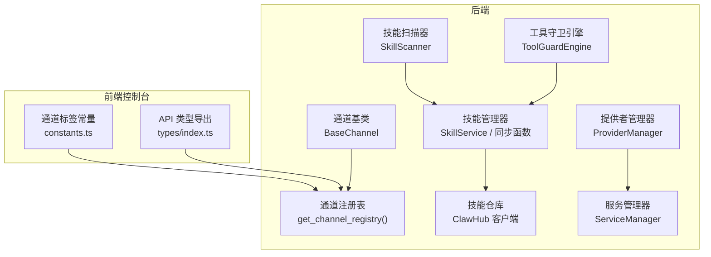
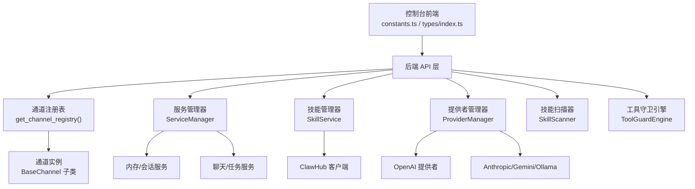
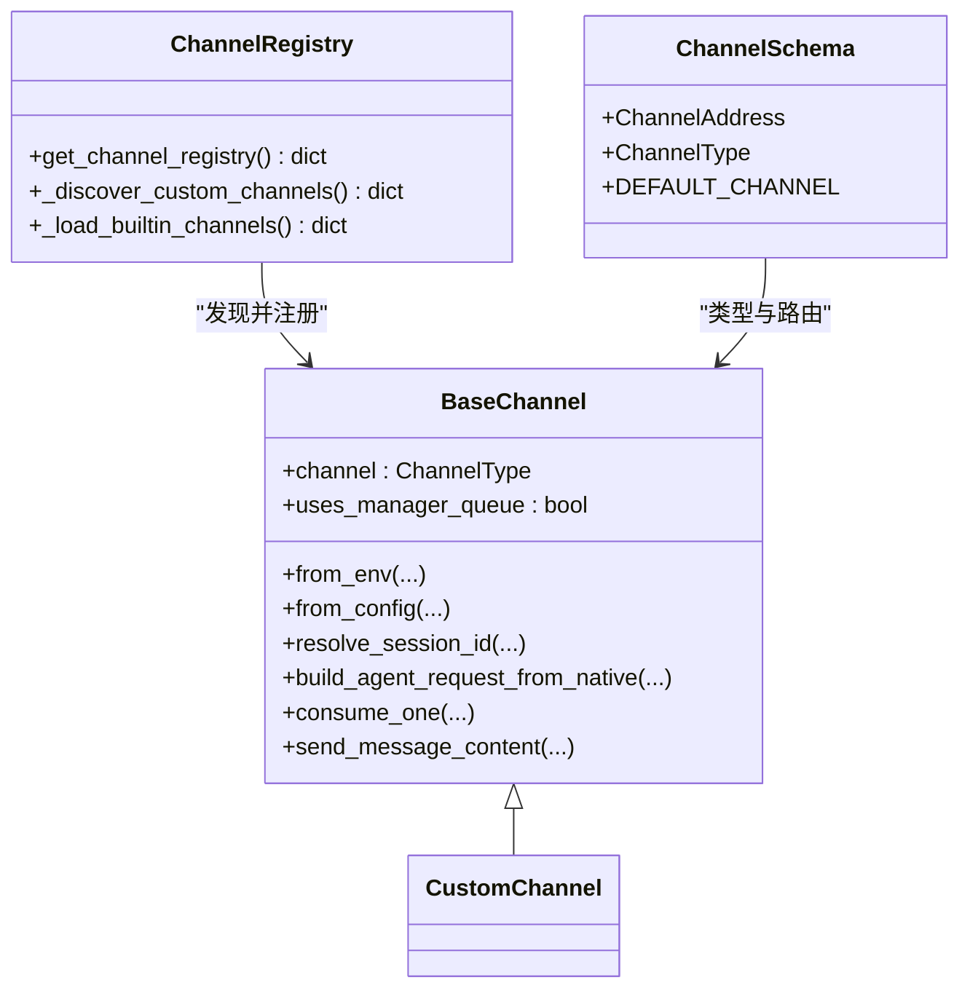
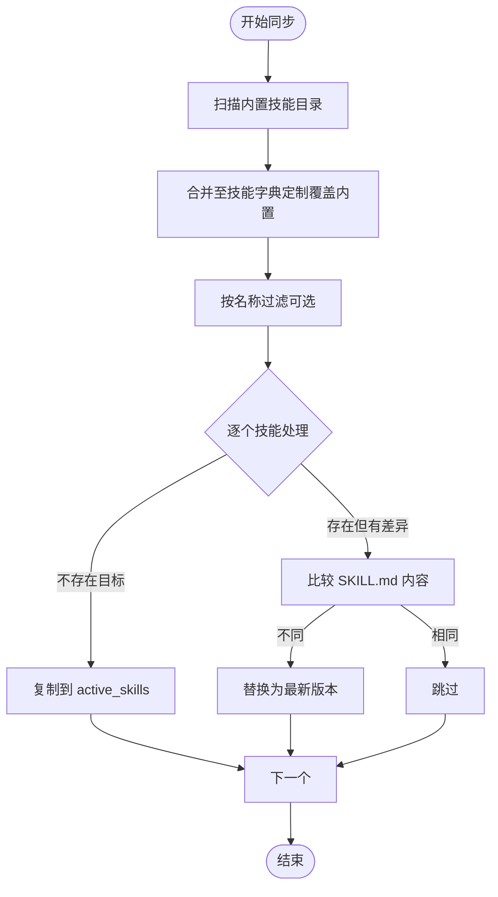
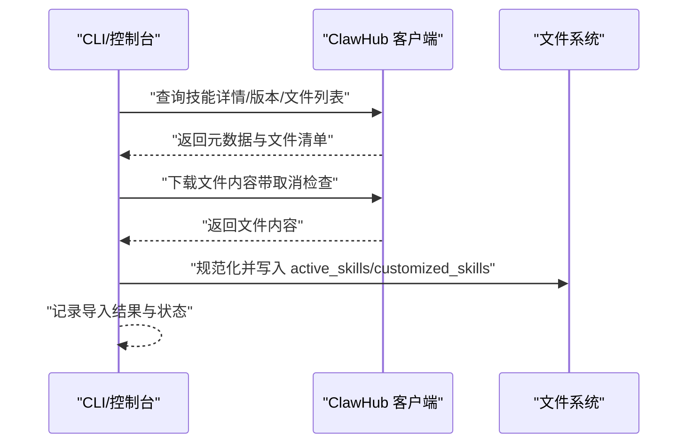
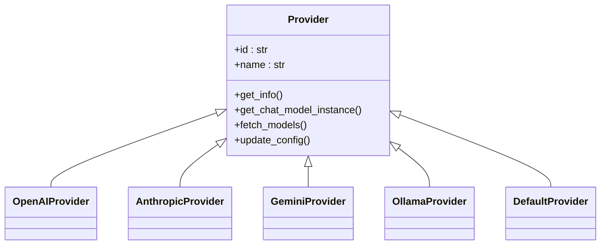
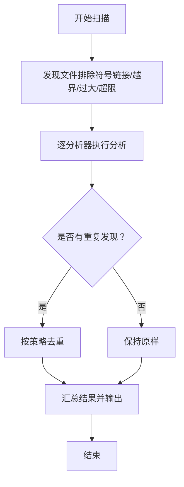
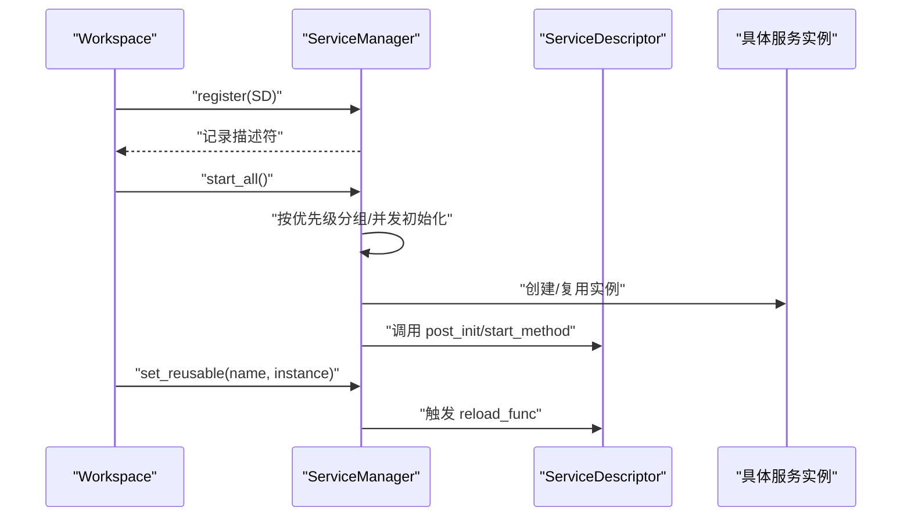
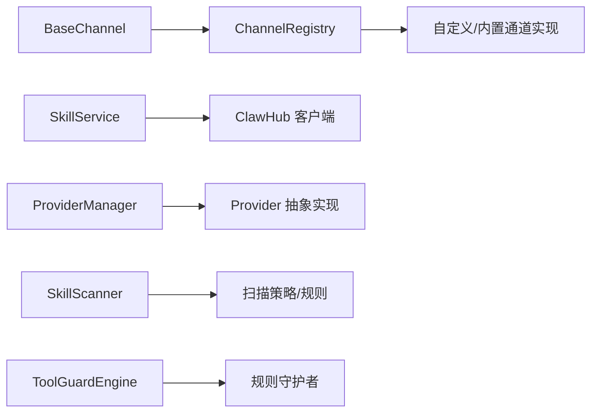

# 插件化架构

<cite>
**本文引用的文件**
- [src/copaw/app/channels/base.py](file://src/copaw/app/channels/base.py)
- [src/copaw/app/channels/registry.py](file://src/copaw/app/channels/registry.py)
- [src/copaw/app/channels/schema.py](file://src/copaw/app/channels/schema.py)
- [src/copaw/agents/skills_manager.py](file://src/copaw/agents/skills_manager.py)
- [src/copaw/agents/skills_hub.py](file://src/copaw/agents/skills_hub.py)
- [src/copaw/providers/provider_manager.py](file://src/copaw/providers/provider_manager.py)
- [src/copaw/security/skill_scanner/scanner.py](file://src/copaw/security/skill_scanner/scanner.py)
- [src/copaw/security/tool_guard/engine.py](file://src/copaw/security/tool_guard/engine.py)
- [src/copaw/agents/tool_guard_mixin.py](file://src/copaw/agents/tool_guard_mixin.py)
- [src/copaw/app/workspace/service_manager.py](file://src/copaw/app/workspace/service_manager.py)
- [src/copaw/constant.py](file://src/copaw/constant.py)
- [SECURITY.md](file://SECURITY.md)
- [website/public/docs/channels.zh.md](file://website/public/docs/channels.zh.md)
- [console/src/pages/Control/Channels/components/constants.ts](file://console/src/pages/Control/Channels/components/constants.ts)
- [console/src/api/types/index.ts](file://console/src/api/types/index.ts)
</cite>

## 目录
1. [引言](#引言)
2. [项目结构](#项目结构)
3. [核心组件](#核心组件)
4. [架构总览](#架构总览)
5. [组件详解](#组件详解)
6. [依赖关系分析](#依赖关系分析)
7. [性能考量](#性能考量)
8. [故障排查指南](#故障排查指南)
9. [结论](#结论)
10. [附录](#附录)

## 引言
本文件系统化阐述 CoPaw 的插件化架构设计与实现，重点覆盖以下方面：
- 插件系统的设计原则与扩展点：通道插件、技能插件、提供者插件的注册与发现机制
- 动态加载与生命周期管理：服务描述符、依赖解析、并发初始化与重用策略
- 接口规范与约定：通道基类、技能目录结构、提供者抽象
- 安全与隔离：技能扫描器、工具守卫引擎、权限与边界约束
- 版本兼容与升级：环境变量、工作目录、版本比较与迁移
- 开发指南与最佳实践：如何编写自定义通道、技能与提供者，调试技巧与常见问题

## 项目结构
CoPaw 将“插件”以模块化方式组织在 Python 包内，并通过统一的注册表与管理器实现动态加载与生命周期管理。前端控制台通过类型导出与常量映射支持插件化展示。

图示来源
- [src/copaw/app/channels/base.py:69-120](file://src/copaw/app/channels/base.py#L69-L120)
- [src/copaw/app/channels/registry.py:132-137](file://src/copaw/app/channels/registry.py#L132-L137)
- [src/copaw/agents/skills_manager.py:627-686](file://src/copaw/agents/skills_manager.py#L627-L686)
- [src/copaw/agents/skills_hub.py:1-120](file://src/copaw/agents/skills_hub.py#L1-L120)
- [src/copaw/providers/provider_manager.py:288-311](file://src/copaw/providers/provider_manager.py#L288-L311)
- [src/copaw/app/workspace/service_manager.py:74-105](file://src/copaw/app/workspace/service_manager.py#L74-L105)
- [src/copaw/security/skill_scanner/scanner.py:76-110](file://src/copaw/security/skill_scanner/scanner.py#L76-L110)
- [src/copaw/security/tool_guard/engine.py:52-76](file://src/copaw/security/tool_guard/engine.py#L52-L76)
- [console/src/pages/Control/Channels/components/constants.ts:1-31](file://console/src/pages/Control/Channels/components/constants.ts#L1-L31)
- [console/src/api/types/index.ts:1-12](file://console/src/api/types/index.ts#L1-L12)

章节来源
- [src/copaw/app/channels/base.py:69-120](file://src/copaw/app/channels/base.py#L69-L120)
- [src/copaw/app/channels/registry.py:132-137](file://src/copaw/app/channels/registry.py#L132-L137)
- [src/copaw/agents/skills_manager.py:627-686](file://src/copaw/agents/skills_manager.py#L627-L686)
- [src/copaw/agents/skills_hub.py:1-120](file://src/copaw/agents/skills_hub.py#L1-L120)
- [src/copaw/providers/provider_manager.py:288-311](file://src/copaw/providers/provider_manager.py#L288-L311)
- [src/copaw/app/workspace/service_manager.py:74-105](file://src/copaw/app/workspace/service_manager.py#L74-L105)
- [src/copaw/security/skill_scanner/scanner.py:76-110](file://src/copaw/security/skill_scanner/scanner.py#L76-L110)
- [src/copaw/security/tool_guard/engine.py:52-76](file://src/copaw/security/tool_guard/engine.py#L52-L76)
- [console/src/pages/Control/Channels/components/constants.ts:1-31](file://console/src/pages/Control/Channels/components/constants.ts#L1-L31)
- [console/src/api/types/index.ts:1-12](file://console/src/api/types/index.ts#L1-L12)

## 核心组件
- 通道插件体系
  - 基类与协议：统一的消息转换、会话键、入站/出站处理
  - 注册表：内置通道与自定义通道的合并发现
- 技能插件体系
  - 目录结构与同步：内置/定制/激活三层目录，版本与差异检测
  - 仓库集成：ClawHub 等外部仓库的拉取、校验与导入
- 提供者插件体系
  - 抽象与多实现：OpenAI、Anthropic、Gemini、Ollama 等
  - 配置持久化与迁移：磁盘存储、权限限制、本地模型更新
- 安全与隔离
  - 技能扫描：模式匹配、文件限制、跳过扩展集
  - 工具守卫：规则引擎、预批准、审批流程
- 生命周期与服务管理
  - 服务描述符：依赖、优先级、可复用、后置初始化钩子
  - 并发启动与重用：按优先级分组、并发初始化、重启时复用

章节来源
- [src/copaw/app/channels/base.py:69-120](file://src/copaw/app/channels/base.py#L69-L120)
- [src/copaw/app/channels/registry.py:132-137](file://src/copaw/app/channels/registry.py#L132-L137)
- [src/copaw/agents/skills_manager.py:627-686](file://src/copaw/agents/skills_manager.py#L627-L686)
- [src/copaw/agents/skills_hub.py:1-120](file://src/copaw/agents/skills_hub.py#L1-L120)
- [src/copaw/providers/provider_manager.py:288-311](file://src/copaw/providers/provider_manager.py#L288-L311)
- [src/copaw/security/skill_scanner/scanner.py:76-110](file://src/copaw/security/skill_scanner/scanner.py#L76-L110)
- [src/copaw/security/tool_guard/engine.py:52-76](file://src/copaw/security/tool_guard/engine.py#L52-L76)
- [src/copaw/app/workspace/service_manager.py:74-105](file://src/copaw/app/workspace/service_manager.py#L74-L105)

## 架构总览
下图展示了插件化架构的关键交互：前端控制台通过 API 与后端通信；后端通过注册表发现通道插件，通过管理器管理服务生命周期；技能与提供者插件分别由各自管理器统一调度；安全模块贯穿运行期检查。

图示来源
- [console/src/pages/Control/Channels/components/constants.ts:1-31](file://console/src/pages/Control/Channels/components/constants.ts#L1-L31)
- [console/src/api/types/index.ts:1-12](file://console/src/api/types/index.ts#L1-L12)
- [src/copaw/app/channels/registry.py:132-137](file://src/copaw/app/channels/registry.py#L132-L137)
- [src/copaw/app/workspace/service_manager.py:74-105](file://src/copaw/app/workspace/service_manager.py#L74-L105)
- [src/copaw/agents/skills_manager.py:627-686](file://src/copaw/agents/skills_manager.py#L627-L686)
- [src/copaw/providers/provider_manager.py:288-311](file://src/copaw/providers/provider_manager.py#L288-L311)
- [src/copaw/security/skill_scanner/scanner.py:76-110](file://src/copaw/security/skill_scanner/scanner.py#L76-L110)
- [src/copaw/security/tool_guard/engine.py:52-76](file://src/copaw/security/tool_guard/engine.py#L52-L76)

## 组件详解

### 通道插件：注册与发现
- 设计要点
  - 通道基类定义统一的入站/出站协议、会话键解析、内容合并与去抖策略
  - 注册表聚合内置通道与自定义通道，支持缓存与失败降级
  - Schema 定义通道类型标识与路由地址，支持扩展键
- 动态加载
  - 自定义通道位于工作目录下的自定义通道目录，通过 importlib 动态导入
  - 仅选择继承自基类且具备 channel 字段的类进行注册
- 生命周期
  - 通道实例由 ChannelManager 注入 enqueue 回调，消费循环由管理器驱动
- 前端映射
  - 控制台使用通道标签常量与 API 类型导出，支持显示自定义通道名称

图示来源
- [src/copaw/app/channels/base.py:69-120](file://src/copaw/app/channels/base.py#L69-L120)
- [src/copaw/app/channels/registry.py:94-136](file://src/copaw/app/channels/registry.py#L94-L136)
- [src/copaw/app/channels/schema.py:12-53](file://src/copaw/app/channels/schema.py#L12-L53)

章节来源
- [src/copaw/app/channels/base.py:69-120](file://src/copaw/app/channels/base.py#L69-L120)
- [src/copaw/app/channels/registry.py:94-136](file://src/copaw/app/channels/registry.py#L94-L136)
- [src/copaw/app/channels/schema.py:12-53](file://src/copaw/app/channels/schema.py#L12-L53)
- [console/src/pages/Control/Channels/components/constants.ts:1-31](file://console/src/pages/Control/Channels/components/constants.ts#L1-L31)
- [console/src/api/types/index.ts:1-12](file://console/src/api/types/index.ts#L1-L12)
- [website/public/docs/channels.zh.md:788-806](file://website/public/docs/channels.zh.md#L788-L806)

### 技能插件：目录结构与同步
- 目录层次
  - 内置技能：代码库内 skills 目录
  - 定制技能：工作目录 customized_skills
  - 激活技能：工作目录 active_skills（运行时生效）
- 同步策略
  - 内置覆盖定制：同名时定制优先
  - 差异检测：基于 SKILL.md 内容差异决定是否覆盖
  - 版本升级：内置技能版本高于激活版本时回滚覆盖
- 导入与校验
  - ZIP 导入：解压前安全校验（大小、路径合法性、符号链接禁止）
  - YAML Front Matter 校验：要求 name 与 description
- 运行时读取
  - 列表去重：同一名称以定制版为准
  - 目录树构建：references/scripts 子目录结构化表示

图示来源
- [src/copaw/agents/skills_manager.py:183-260](file://src/copaw/agents/skills_manager.py#L183-L260)
- [src/copaw/agents/skills_manager.py:263-341](file://src/copaw/agents/skills_manager.py#L263-L341)
- [src/copaw/agents/skills_manager.py:394-471](file://src/copaw/agents/skills_manager.py#L394-L471)
- [src/copaw/agents/skills_manager.py:529-550](file://src/copaw/agents/skills_manager.py#L529-L550)

章节来源
- [src/copaw/agents/skills_manager.py:63-85](file://src/copaw/agents/skills_manager.py#L63-L85)
- [src/copaw/agents/skills_manager.py:183-260](file://src/copaw/agents/skills_manager.py#L183-L260)
- [src/copaw/agents/skills_manager.py:263-341](file://src/copaw/agents/skills_manager.py#L263-L341)
- [src/copaw/agents/skills_manager.py:394-471](file://src/copaw/agents/skills_manager.py#L394-L471)
- [src/copaw/agents/skills_manager.py:529-550](file://src/copaw/agents/skills_manager.py#L529-L550)

### 技能仓库与安装流程
- 外部仓库集成
  - 支持 ClawHub 等仓库，通过环境变量配置基础 URL 与路径模板
  - 支持超时、重试、指数退避与取消检查
- 安全与体积限制
  - 响应体大小限制、ZIP 解压前安全校验
  - 文件数量上限与最大文件大小限制
- 结果归一化
  - 规范化包结构，提取 references/scripts 与额外文件
  - 从 frontmatter 中提取技能元数据

图示来源
- [src/copaw/agents/skills_hub.py:131-161](file://src/copaw/agents/skills_hub.py#L131-L161)
- [src/copaw/agents/skills_hub.py:226-335](file://src/copaw/agents/skills_hub.py#L226-L335)
- [src/copaw/agents/skills_hub.py:489-571](file://src/copaw/agents/skills_hub.py#L489-L571)
- [src/copaw/agents/skills_hub.py:574-634](file://src/copaw/agents/skills_hub.py#L574-L634)
- [src/copaw/agents/skills_hub.py:529-550](file://src/copaw/agents/skills_hub.py#L529-L550)

章节来源
- [src/copaw/agents/skills_hub.py:1-120](file://src/copaw/agents/skills_hub.py#L1-L120)
- [src/copaw/agents/skills_hub.py:226-335](file://src/copaw/agents/skills_hub.py#L226-L335)
- [src/copaw/agents/skills_hub.py:489-571](file://src/copaw/agents/skills_hub.py#L489-L571)
- [src/copaw/agents/skills_hub.py:574-634](file://src/copaw/agents/skills_hub.py#L574-L634)
- [src/copaw/agents/skills_hub.py:529-550](file://src/copaw/agents/skills_hub.py#L529-L550)

### 提供者插件：抽象与多实现
- 抽象层
  - Provider 抽象、OpenAI 兼容、Anthropic、Gemini、Ollama 等具体实现
  - ProviderInfo/ModelInfo 模型化配置与模型列表
- 管理与持久化
  - ProviderManager 单例，内置与自定义提供者合并
  - 磁盘存储（JSON）与权限限制（0600/0700）
  - 迁移逻辑：从旧格式 providers.json 迁移到新结构
- 激活与本地模型
  - 激活模型持久化 active_model.json
  - 本地模型（llama.cpp/MLX）动态枚举并注入

图示来源
- [src/copaw/providers/provider_manager.py:288-311](file://src/copaw/providers/provider_manager.py#L288-L311)
- [src/copaw/providers/provider_manager.py:540-554](file://src/copaw/providers/provider_manager.py#L540-L554)
- [src/copaw/providers/provider_manager.py:670-690](file://src/copaw/providers/provider_manager.py#L670-L690)

章节来源
- [src/copaw/providers/provider_manager.py:288-311](file://src/copaw/providers/provider_manager.py#L288-L311)
- [src/copaw/providers/provider_manager.py:540-554](file://src/copaw/providers/provider_manager.py#L540-L554)
- [src/copaw/providers/provider_manager.py:670-690](file://src/copaw/providers/provider_manager.py#L670-L690)

### 安全与隔离：技能扫描与工具守卫
- 技能扫描
  - 默认模式匹配分析器，可扩展其他分析器
  - 文件发现：递归遍历、跳过符号链接、路径相对性校验、大小与数量限制
  - 策略与分类：基于策略的扩展名跳过集合与文件限额
- 工具守卫
  - 规则引擎：默认规则守护者，支持动态重载
  - 预批准：按会话维度的即时批准
  - 审批流程：阻断高风险工具调用，等待人工审批

图示来源
- [src/copaw/security/skill_scanner/scanner.py:148-242](file://src/copaw/security/skill_scanner/scanner.py#L148-L242)
- [src/copaw/security/skill_scanner/scanner.py:248-299](file://src/copaw/security/skill_scanner/scanner.py#L248-L299)

章节来源
- [src/copaw/security/skill_scanner/scanner.py:76-110](file://src/copaw/security/skill_scanner/scanner.py#L76-L110)
- [src/copaw/security/skill_scanner/scanner.py:148-242](file://src/copaw/security/skill_scanner/scanner.py#L148-L242)
- [src/copaw/security/skill_scanner/scanner.py:248-299](file://src/copaw/security/skill_scanner/scanner.py#L248-L299)
- [src/copaw/security/tool_guard/engine.py:52-76](file://src/copaw/security/tool_guard/engine.py#L52-L76)
- [src/copaw/security/tool_guard/engine.py:161-207](file://src/copaw/security/tool_guard/engine.py#L161-L207)
- [src/copaw/agents/tool_guard_mixin.py:103-182](file://src/copaw/agents/tool_guard_mixin.py#L103-L182)

### 生命周期与服务管理
- 服务描述符
  - name、service_class、init_args、post_init、start_method、stop_method、reusable、reload_func、dependencies、priority、concurrent_init
- 生命周期
  - 注册、按优先级分组、并发初始化、依赖解析、重启时复用、后置初始化钩子
- 重用策略
  - 可复用服务在工作区切换时保留实例并触发 reload_func

图示来源
- [src/copaw/app/workspace/service_manager.py:92-105](file://src/copaw/app/workspace/service_manager.py#L92-L105)
- [src/copaw/app/workspace/service_manager.py:171-180](file://src/copaw/app/workspace/service_manager.py#L171-L180)
- [src/copaw/app/workspace/service_manager.py:106-145](file://src/copaw/app/workspace/service_manager.py#L106-L145)
- [src/copaw/app/workspace/service_manager.py:297-307](file://src/copaw/app/workspace/service_manager.py#L297-L307)

章节来源
- [src/copaw/app/workspace/service_manager.py:30-72](file://src/copaw/app/workspace/service_manager.py#L30-L72)
- [src/copaw/app/workspace/service_manager.py:92-105](file://src/copaw/app/workspace/service_manager.py#L92-L105)
- [src/copaw/app/workspace/service_manager.py:171-180](file://src/copaw/app/workspace/service_manager.py#L171-L180)
- [src/copaw/app/workspace/service_manager.py:106-145](file://src/copaw/app/workspace/service_manager.py#L106-L145)
- [src/copaw/app/workspace/service_manager.py:297-307](file://src/copaw/app/workspace/service_manager.py#L297-L307)

## 依赖关系分析
- 组件耦合
  - 通道插件与注册表低耦合：通过字符串键与类映射，动态导入
  - 技能管理器与仓库客户端弱耦合：通过标准化包结构与 frontmatter
  - 提供者管理器与具体实现强类型抽象：通过 Provider 抽象与 Pydantic 模型
  - 安全模块独立于业务逻辑：扫描器与守卫引擎作为横切关注点
- 外部依赖
  - Python 标准库与第三方库（如 pydantic、packaging、frontmatter）
  - 前端类型与常量用于控制台展示与配置

图示来源
- [src/copaw/app/channels/registry.py:132-137](file://src/copaw/app/channels/registry.py#L132-L137)
- [src/copaw/agents/skills_manager.py:627-686](file://src/copaw/agents/skills_manager.py#L627-L686)
- [src/copaw/providers/provider_manager.py:288-311](file://src/copaw/providers/provider_manager.py#L288-L311)
- [src/copaw/security/skill_scanner/scanner.py:76-110](file://src/copaw/security/skill_scanner/scanner.py#L76-L110)
- [src/copaw/security/tool_guard/engine.py:52-76](file://src/copaw/security/tool_guard/engine.py#L52-L76)

章节来源
- [src/copaw/app/channels/registry.py:132-137](file://src/copaw/app/channels/registry.py#L132-L137)
- [src/copaw/agents/skills_manager.py:627-686](file://src/copaw/agents/skills_manager.py#L627-L686)
- [src/copaw/providers/provider_manager.py:288-311](file://src/copaw/providers/provider_manager.py#L288-L311)
- [src/copaw/security/skill_scanner/scanner.py:76-110](file://src/copaw/security/skill_scanner/scanner.py#L76-L110)
- [src/copaw/security/tool_guard/engine.py:52-76](file://src/copaw/security/tool_guard/engine.py#L52-L76)

## 性能考量
- 动态导入与缓存
  - 通道注册表对内置通道进行进程级缓存，避免重复导入开销
- 并发初始化
  - 服务管理器按优先级分组，同优先级并发初始化，缩短启动时间
- I/O 与网络
  - 技能仓库客户端支持超时、重试与指数退避，ZIP 解压前进行体积与路径安全检查
- 内存与磁盘
  - 提供者配置与活动模型采用最小权限文件权限（0600/0700），降低安全风险

## 故障排查指南
- 通道相关
  - 自定义通道未生效：确认类继承自基类且定义 channel 字段；检查工作目录自定义通道目录是否存在
  - 会话键冲突：检查 resolve_session_id 的实现与 meta 字段
- 技能相关
  - 技能未出现在激活列表：确认 SKILL.md Front Matter 完整；检查内置/定制覆盖关系
  - ZIP 导入失败：检查 ZIP 是否包含符号链接、路径越界或压缩包过大
- 提供者相关
  - 配置未持久化：检查 secret 目录权限与 JSON 写入异常
  - 本地模型未显示：确认本地模型后端可用与枚举逻辑
- 安全相关
  - 技能扫描被拒绝：调整策略文件或跳过扩展集；检查文件大小与数量限制
  - 工具调用被阻断：查看审批状态与规则严重级别；必要时预批准

章节来源
- [src/copaw/app/channels/registry.py:94-136](file://src/copaw/app/channels/registry.py#L94-L136)
- [src/copaw/agents/skills_manager.py:529-550](file://src/copaw/agents/skills_manager.py#L529-L550)
- [src/copaw/providers/provider_manager.py:517-539](file://src/copaw/providers/provider_manager.py#L517-L539)
- [src/copaw/security/skill_scanner/scanner.py:248-299](file://src/copaw/security/skill_scanner/scanner.py#L248-L299)
- [src/copaw/security/tool_guard/engine.py:161-207](file://src/copaw/security/tool_guard/engine.py#L161-L207)

## 结论
CoPaw 的插件化架构以“抽象+注册表+管理器”的组合实现高扩展性与强隔离。通道、技能与提供者三大插件域均遵循统一的发现与生命周期管理模式，辅以安全扫描与工具守卫，确保在开放生态中维持可控边界。通过环境变量与工作目录约定，系统实现了版本兼容与平滑升级。

## 附录

### 开发指南与最佳实践
- 编写自定义通道
  - 继承基类并实现必要的类方法；定义 channel 键与 from_config/from_env
  - 使用注册表进行测试：get_channel_registry() 返回合并后的通道映射
- 编写技能
  - 遵循 SKILL.md Front Matter 规范；references/scripts 子目录结构化
  - 使用 SkillService.list_all_skills 与 create_skill 辅助开发
- 编写提供者
  - 实现 Provider 抽象并注册到 ProviderManager；注意配置持久化与权限
- 安全与合规
  - 使用 SkillScanner 与 ToolGuardEngine 进行预检与审批
  - 参考信任边界与工作目录权限策略

章节来源
- [src/copaw/app/channels/base.py:321-339](file://src/copaw/app/channels/base.py#L321-L339)
- [src/copaw/app/channels/registry.py:132-137](file://src/copaw/app/channels/registry.py#L132-L137)
- [src/copaw/agents/skills_manager.py:687-698](file://src/copaw/agents/skills_manager.py#L687-L698)
- [src/copaw/agents/skills_manager.py:699-751](file://src/copaw/agents/skills_manager.py#L699-L751)
- [src/copaw/providers/provider_manager.py:423-440](file://src/copaw/providers/provider_manager.py#L423-L440)
- [SECURITY.md:120-141](file://SECURITY.md#L120-L141)