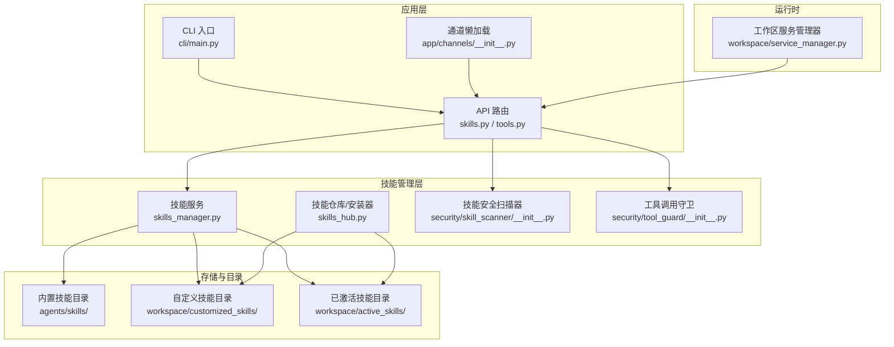
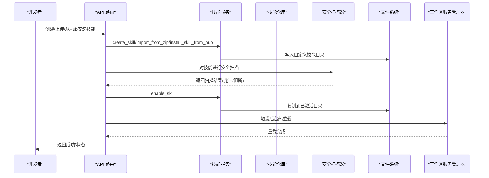
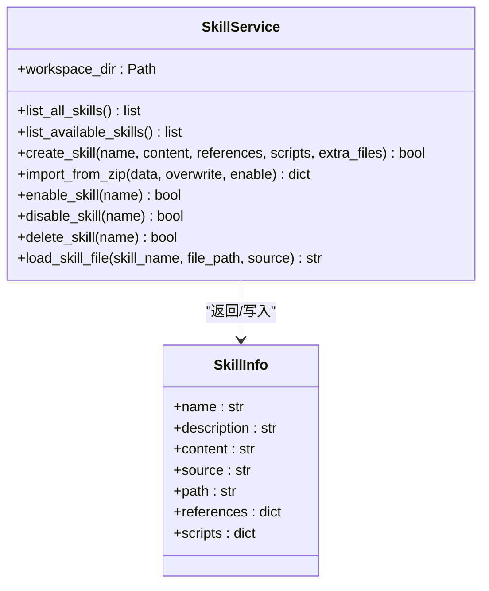
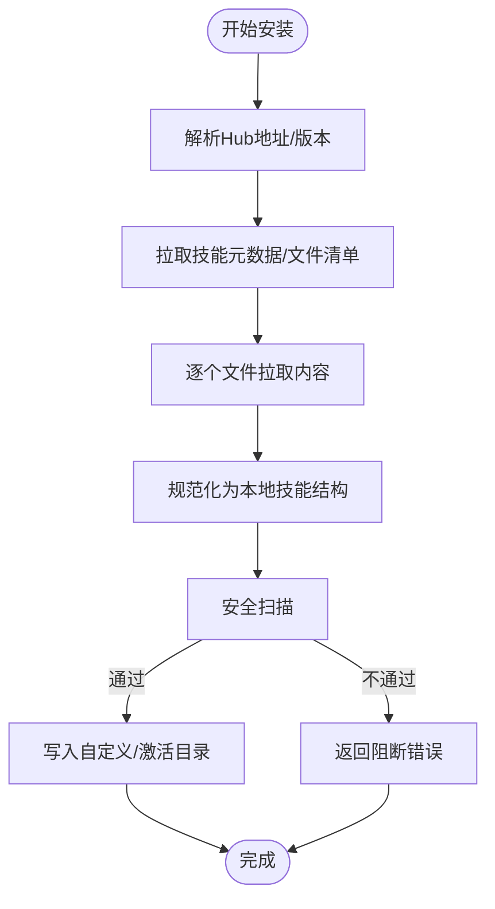
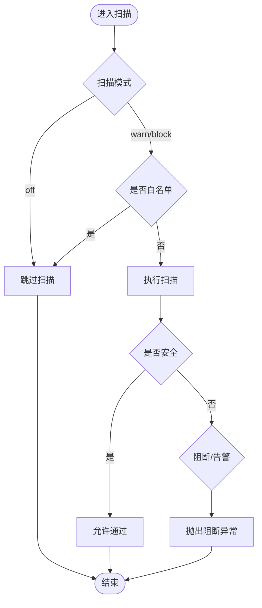
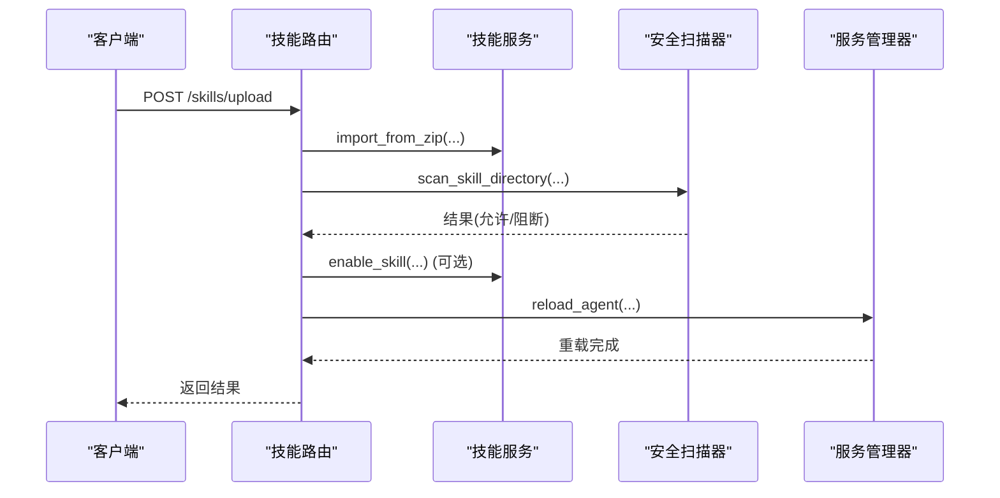
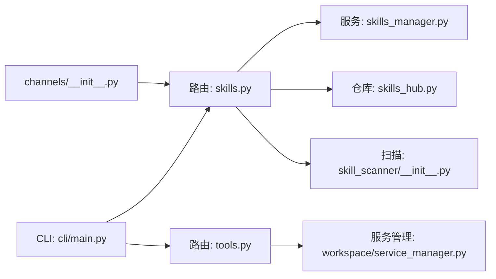

# 插件开发指南

<cite>
**本文档引用的文件**
- [src/copaw/__init__.py](file://src/copaw/__init__.py)
- [src/copaw/app/channels/__init__.py](file://src/copaw/app/channels/__init__.py)
- [src/copaw/cli/main.py](file://src/copaw/cli/main.py)
- [src/copaw/agents/skills/__init__.py](file://src/copaw/agents/skills/__init__.py)
- [src/copaw/app/routers/skills.py](file://src/copaw/app/routers/skills.py)
- [src/copaw/app/routers/tools.py](file://src/copaw/app/routers/tools.py)
- [src/copaw/agents/skills_hub.py](file://src/copaw/agents/skills_hub.py)
- [src/copaw/agents/skills_manager.py](file://src/copaw/agents/skills_manager.py)
- [src/copaw/security/skill_scanner/__init__.py](file://src/copaw/security/skill_scanner/__init__.py)
- [src/copaw/security/tool_guard/__init__.py](file://src/copaw/security/tool_guard/__init__.py)
- [src/copaw/app/workspace/service_manager.py](file://src/copaw/app/workspace/service_manager.py)
</cite>

## 目录
1. [简介](#简介)
2. [项目结构](#项目结构)
3. [核心组件](#核心组件)
4. [架构总览](#架构总览)
5. [详细组件分析](#详细组件分析)
6. [依赖分析](#依赖分析)
7. [性能考虑](#性能考虑)
8. [故障排查指南](#故障排查指南)
9. [结论](#结论)
10. [附录](#附录)

## 简介
本指南面向希望在 CoPaw 平台上开发与分发生态插件（技能）的开发者，覆盖从模板结构、元数据配置、安全扫描、安装与启用、到打包分发与版本管理的完整流程。文档同时提供接口规范、最佳实践、测试与调试建议以及社区贡献指引，帮助你快速构建高质量、可复用且安全可控的插件。

## 项目结构
CoPaw 的插件体系围绕“内置技能目录”、“工作区自定义技能目录”和“已激活技能目录”三者协作展开，并通过 API 路由、安全扫描器与工具守卫框架实现全链路管控。CLI 提供命令入口，服务管理器负责运行时生命周期管理。

**图表来源**
- [src/copaw/app/routers/skills.py](file://src/copaw/app/routers/skills.py)
- [src/copaw/app/routers/tools.py](file://src/copaw/app/routers/tools.py)
- [src/copaw/cli/main.py](file://src/copaw/cli/main.py)
- [src/copaw/app/channels/__init__.py](file://src/copaw/app/channels/__init__.py)
- [src/copaw/agents/skills_manager.py](file://src/copaw/agents/skills_manager.py)
- [src/copaw/agents/skills_hub.py](file://src/copaw/agents/skills_hub.py)
- [src/copaw/security/skill_scanner/__init__.py](file://src/copaw/security/skill_scanner/__init__.py)
- [src/copaw/security/tool_guard/__init__.py](file://src/copaw/security/tool_guard/__init__.py)
- [src/copaw/app/workspace/service_manager.py](file://src/copaw/app/workspace/service_manager.py)

**章节来源**
- [src/copaw/__init__.py](file://src/copaw/__init__.py)
- [src/copaw/app/channels/__init__.py](file://src/copaw/app/channels/__init__.py)
- [src/copaw/cli/main.py](file://src/copaw/cli/main.py)

## 核心组件
- 技能服务与目录管理：负责内置、自定义与已激活技能的读取、同步、创建与删除。
- 技能仓库与安装器：支持从 Hub 搜索、下载、校验与安装技能包，支持取消与状态跟踪。
- 安全扫描器：对技能进行预激活/导入前的安全扫描，支持白名单、缓存与阻断策略。
- 工具守卫：在工具执行前进行参数级安全检查，防止危险操作。
- API 路由：提供技能列表、启用/禁用、上传 ZIP、Hub 安装等接口。
- CLI：提供命令行入口，组织各子命令模块。
- 通道懒加载：按需加载通道管理器，降低 CLI 启动成本。
- 服务管理器：统一管理工作区服务的注册、启动、停止与重载。

**章节来源**
- [src/copaw/agents/skills_manager.py](file://src/copaw/agents/skills_manager.py)
- [src/copaw/agents/skills_hub.py](file://src/copaw/agents/skills_hub.py)
- [src/copaw/security/skill_scanner/__init__.py](file://src/copaw/security/skill_scanner/__init__.py)
- [src/copaw/security/tool_guard/__init__.py](file://src/copaw/security/tool_guard/__init__.py)
- [src/copaw/app/routers/skills.py](file://src/copaw/app/routers/skills.py)
- [src/copaw/app/routers/tools.py](file://src/copaw/app/routers/tools.py)
- [src/copaw/cli/main.py](file://src/copaw/cli/main.py)
- [src/copaw/app/channels/__init__.py](file://src/copaw/app/channels/__init__.py)
- [src/copaw/app/workspace/service_manager.py](file://src/copaw/app/workspace/service_manager.py)

## 架构总览
下图展示技能从“被发现/创建”到“被启用/运行”的端到端流程，包括安全扫描与工具守卫的关键节点。

**图表来源**
- [src/copaw/app/routers/skills.py](file://src/copaw/app/routers/skills.py)
- [src/copaw/agents/skills_manager.py](file://src/copaw/agents/skills_manager.py)
- [src/copaw/agents/skills_hub.py](file://src/copaw/agents/skills_hub.py)
- [src/copaw/security/skill_scanner/__init__.py](file://src/copaw/security/skill_scanner/__init__.py)
- [src/copaw/app/workspace/service_manager.py](file://src/copaw/app/workspace/service_manager.py)

## 详细组件分析

### 技能服务与目录管理（SkillService）
- 职责
  - 列出内置与自定义技能，合并去重优先自定义。
  - 读取 SKILL.md 前言元数据，构建 references/scripts 目录树。
  - 创建新技能（含 references/scripts 额外文件树）、从 ZIP 导入、启用/禁用、删除。
  - 同步内置/自定义到已激活目录，处理版本差异与覆盖策略。
- 关键点
  - 目录结构：内置/自定义/已激活三类目录，名称即技能名。
  - 版本语义：通过 SKILL.md metadata 中的内置版本号比较，决定是否回滚或升级。
  - 安全约束：ZIP 导入进行大小与路径合法性校验，禁止符号链接与越界路径。

**图表来源**
- [src/copaw/agents/skills_manager.py](file://src/copaw/agents/skills_manager.py)

**章节来源**
- [src/copaw/agents/skills_manager.py](file://src/copaw/agents/skills_manager.py)

### 技能仓库与安装器（SkillsHub）
- 职责
  - 支持从多源 Hub 搜索与安装技能包，自动解析 URL、版本与文件清单。
  - 将 Hub 返回的元数据与文件内容规范化为本地技能结构。
  - 提供取消安装、并发任务管理与状态查询。
- 关键点
  - 取消机制：通过上下文变量传递取消检查器，支持中途取消。
  - 重试与退避：针对 429/5xx 与网络错误采用指数退避重试。
  - 安全校验：限制最大响应体与 ZIP 解压大小，校验路径安全性。

**图表来源**
- [src/copaw/agents/skills_hub.py](file://src/copaw/agents/skills_hub.py)
- [src/copaw/app/routers/skills.py](file://src/copaw/app/routers/skills.py)

**章节来源**
- [src/copaw/agents/skills_hub.py](file://src/copaw/agents/skills_hub.py)
- [src/copaw/app/routers/skills.py](file://src/copaw/app/routers/skills.py)

### 安全扫描器（SkillScanner）
- 职责
  - 在技能启用/导入前进行扫描，支持白名单、超时与缓存。
  - 提供阻断模式（block）与告警模式（warn），异常时抛出结构化错误。
- 关键点
  - 扫描模式与超时来自配置，支持环境变量覆盖。
  - 缓存基于目录 mtime，避免重复扫描。
  - 历史记录持久化，便于审计与回溯。

**图表来源**
- [src/copaw/security/skill_scanner/__init__.py](file://src/copaw/security/skill_scanner/__init__.py)

**章节来源**
- [src/copaw/security/skill_scanner/__init__.py](file://src/copaw/security/skill_scanner/__init__.py)

### 工具守卫（ToolGuard）
- 职责
  - 在工具调用前对参数进行规则匹配，识别高危模式（如命令注入、敏感文件访问）。
  - 提供规则引擎与扩展接口，支持未来接入更复杂的检测能力。
- 关键点
  - 与技能扫描器一致的“可插拔”设计思想，便于演进。

**章节来源**
- [src/copaw/security/tool_guard/__init__.py](file://src/copaw/security/tool_guard/__init__.py)

### API 路由（技能与工具）
- 技能路由
  - 列表、可用技能、搜索 Hub、从 Hub 安装（含异步任务与取消）、上传 ZIP、启用/禁用、删除、读取技能文件。
  - 安全扫描集成：上传与启用前均触发扫描，失败返回结构化错误。
- 工具路由
  - 列出内置工具并支持切换启用状态，变更后触发后台热重载。

**图表来源**
- [src/copaw/app/routers/skills.py](file://src/copaw/app/routers/skills.py)
- [src/copaw/app/routers/tools.py](file://src/copaw/app/routers/tools.py)
- [src/copaw/app/workspace/service_manager.py](file://src/copaw/app/workspace/service_manager.py)

**章节来源**
- [src/copaw/app/routers/skills.py](file://src/copaw/app/routers/skills.py)
- [src/copaw/app/routers/tools.py](file://src/copaw/app/routers/tools.py)

### CLI 入口与通道懒加载
- CLI 入口
  - 统一注册各子命令组（应用、通道、聊天、守护、清理、定时任务、环境、初始化、模型、技能、卸载、桌面、更新、关机、认证）。
  - 按需计时日志，便于诊断启动耗时。
- 通道懒加载
  - 通过动态导入避免 CLI 启动时加载第三方依赖（如飞书 SDK）。

**章节来源**
- [src/copaw/cli/main.py](file://src/copaw/cli/main.py)
- [src/copaw/app/channels/__init__.py](file://src/copaw/app/channels/__init__.py)

## 依赖分析
- 组件耦合
  - API 路由依赖技能服务与安全扫描器；工具路由依赖配置与服务管理器。
  - 技能服务依赖文件系统与前端言解析；仓库安装器依赖 HTTP 客户端与 ZIP 解析。
  - 服务管理器为工作区组件提供统一生命周期管理，被 API 调用触发重载。
- 外部依赖
  - HTTP 请求、ZIP 解析、前端言解析、并发执行器等标准库与第三方库。
- 循环依赖
  - 当前结构以“路由 → 服务 → 文件系统/网络”单向依赖为主，未见明显循环。

**图表来源**
- [src/copaw/app/routers/skills.py](file://src/copaw/app/routers/skills.py)
- [src/copaw/app/routers/tools.py](file://src/copaw/app/routers/tools.py)
- [src/copaw/agents/skills_manager.py](file://src/copaw/agents/skills_manager.py)
- [src/copaw/agents/skills_hub.py](file://src/copaw/agents/skills_hub.py)
- [src/copaw/security/skill_scanner/__init__.py](file://src/copaw/security/skill_scanner/__init__.py)
- [src/copaw/app/workspace/service_manager.py](file://src/copaw/app/workspace/service_manager.py)
- [src/copaw/cli/main.py](file://src/copaw/cli/main.py)
- [src/copaw/app/channels/__init__.py](file://src/copaw/app/channels/__init__.py)

**章节来源**
- [src/copaw/app/routers/skills.py](file://src/copaw/app/routers/skills.py)
- [src/copaw/app/routers/tools.py](file://src/copaw/app/routers/tools.py)
- [src/copaw/agents/skills_manager.py](file://src/copaw/agents/skills_manager.py)
- [src/copaw/agents/skills_hub.py](file://src/copaw/agents/skills_hub.py)
- [src/copaw/security/skill_scanner/__init__.py](file://src/copaw/security/skill_scanner/__init__.py)
- [src/copaw/app/workspace/service_manager.py](file://src/copaw/app/workspace/service_manager.py)
- [src/copaw/cli/main.py](file://src/copaw/cli/main.py)
- [src/copaw/app/channels/__init__.py](file://src/copaw/app/channels/__init__.py)

## 性能考虑
- 启动与导入
  - CLI 使用延迟导入与计时日志，减少冷启动时间。
  - 通道管理器按需加载，避免不必要的第三方依赖。
- 并发与异步
  - Hub 安装使用异步任务与锁，支持取消与状态查询。
  - 技能扫描使用线程池执行，避免阻塞主流程。
- 缓存与去重
  - 扫描结果按目录 mtime 缓存，避免重复扫描。
  - 列表时按名称去重，优先自定义技能。
- I/O 与安全
  - ZIP 解压与文件系统写入均进行大小与路径校验，防止过大或越界写入。
  - 已激活技能变更后触发后台热重载，非阻塞式更新。

[本节为通用指导，无需特定文件来源]

## 故障排查指南
- 安全扫描阻断
  - 现象：启用/上传技能时报 422，包含严重等级与具体发现。
  - 排查：查看扫描器返回的详细信息，确认规则命中与文件位置；必要时调整策略或修复技能内容。
- Hub 安装失败
  - 现象：安装返回 400/502，或任务状态为失败。
  - 排查：检查网络与速率限制（GitHub API），设置凭据；查看任务 ID 获取详细错误。
- 工具调用被拒
  - 现象：工具执行被拒绝标记。
  - 排查：检查工具守卫规则，确认参数是否命中高危模式。
- 启动慢/内存占用高
  - 现象：CLI 或 API 启动缓慢。
  - 排查：查看 CLI 计时日志定位耗时模块；确认懒加载是否生效。

**章节来源**
- [src/copaw/app/routers/skills.py](file://src/copaw/app/routers/skills.py)
- [src/copaw/security/skill_scanner/__init__.py](file://src/copaw/security/skill_scanner/__init__.py)
- [src/copaw/security/tool_guard/__init__.py](file://src/copaw/security/tool_guard/__init__.py)
- [src/copaw/cli/main.py](file://src/copaw/cli/main.py)

## 结论
CoPaw 的插件开发体系以“目录结构 + 服务管理 + 安全扫描 + 工具守卫 + API 路由 + CLI + 通道懒加载”为核心，形成从创建、安装、启用到运行的闭环。遵循本文档的模板结构、元数据规范与安全策略，可确保插件具备良好的可维护性、可移植性与安全性。

[本节为总结，无需特定文件来源]

## 附录

### 插件模板结构与元数据规范
- 目录结构
  - SKILL.md：必需，包含 YAML 前言元数据（name、description 等）。
  - references/：可选，存放文档、配置等只读资源。
  - scripts/：可选，存放运行脚本或辅助程序。
- 元数据字段
  - 必填：name、description。
  - 可选：metadata.builtin_skill_version 等用于版本管理。
- 示例参考
  - 参考内置技能目录中的现有结构与 SKILL.md 内容格式。

**章节来源**
- [src/copaw/agents/skills/__init__.py](file://src/copaw/agents/skills/__init__.py)
- [src/copaw/agents/skills_manager.py](file://src/copaw/agents/skills_manager.py)

### 接口规范（技能）
- 列表与可用技能
  - GET /skills、GET /skills/available
- Hub 搜索与安装
  - GET /skills/hub/search
  - POST /skills/hub/install（同步）、POST /skills/hub/install/start（异步）、GET /skills/hub/install/status/{task_id}、POST /skills/hub/install/cancel/{task_id}
- 上传与创建
  - POST /skills/upload（ZIP）
  - POST /skills（JSON：name、content、references、scripts）
- 启用/禁用/删除/读取文件
  - POST /skills/{skill_name}/enable/disable/delete
  - GET /skills/{skill_name}/files/{source}/{file_path:path}

**章节来源**
- [src/copaw/app/routers/skills.py](file://src/copaw/app/routers/skills.py)

### 接口规范（工具）
- 列表与切换
  - GET /tools
  - PATCH /tools/{tool_name}/toggle

**章节来源**
- [src/copaw/app/routers/tools.py](file://src/copaw/app/routers/tools.py)

### 测试方法与调试技巧
- 单元测试
  - 使用 Python 测试框架，覆盖技能服务、扫描器、工具守卫等模块。
- 集成测试
  - 通过 API 路由发起请求，验证启用/禁用、上传、Hub 安装等端到端流程。
- 调试建议
  - 设置 COPAW_LOG_LEVEL 控制日志级别。
  - 使用 CLI 计时日志定位启动耗时。
  - Hub 安装使用异步任务 ID 追踪进度与错误。

**章节来源**
- [src/copaw/__init__.py](file://src/copaw/__init__.py)
- [src/copaw/cli/main.py](file://src/copaw/cli/main.py)

### 性能优化策略
- 使用异步与并发：Hub 安装与扫描采用异步与线程池。
- 缓存与懒加载：扫描结果缓存、通道懒加载。
- I/O 安全：ZIP 与文件系统写入严格校验，避免大文件与越界路径。

**章节来源**
- [src/copaw/agents/skills_hub.py](file://src/copaw/agents/skills_hub.py)
- [src/copaw/security/skill_scanner/__init__.py](file://src/copaw/security/skill_scanner/__init__.py)
- [src/copaw/app/channels/__init__.py](file://src/copaw/app/channels/__init__.py)

### 打包、分发与版本管理
- 打包
  - 将技能目录打包为 ZIP，包含 SKILL.md 与 references/scripts 子树。
- 分发
  - 通过 Hub 搜索与安装，或直接上传 ZIP。
- 版本管理
  - 使用 SKILL.md metadata.builtin_skill_version 字段标识内置版本，安装时比较并决定升级/回滚。
  - 支持指定版本标签与覆盖策略。

**章节来源**
- [src/copaw/agents/skills_manager.py](file://src/copaw/agents/skills_manager.py)
- [src/copaw/agents/skills_hub.py](file://src/copaw/agents/skills_hub.py)

### 社区贡献指南
- 提交规范
  - 使用 Pull Request 模板，描述变更内容与影响范围。
- 文档与测试
  - 新功能需补充单元/集成测试与文档。
- 安全与合规
  - 引入新规则或修改扫描策略需经安全评审。

[本节为通用指导，无需特定文件来源]