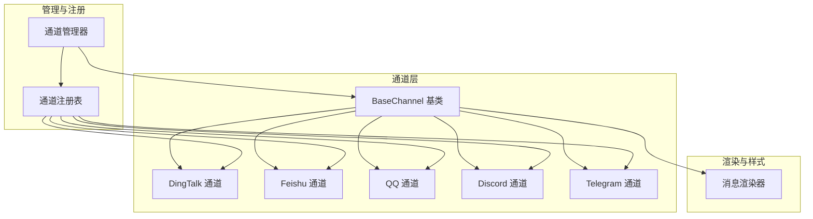
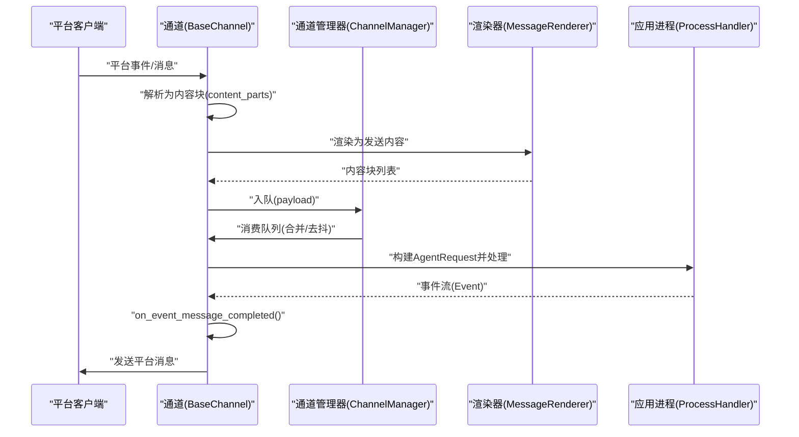
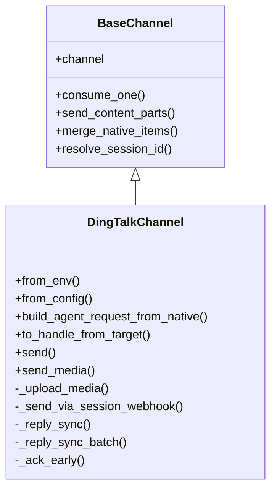
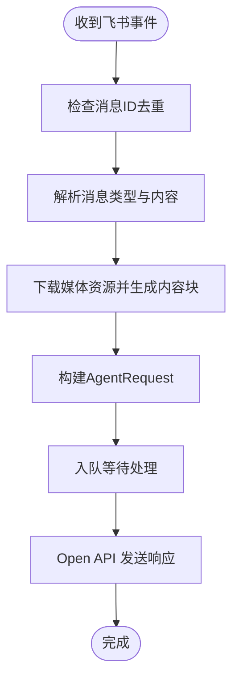
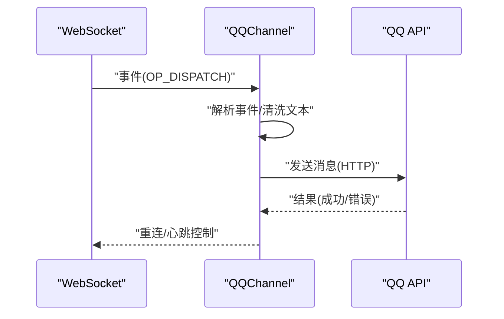
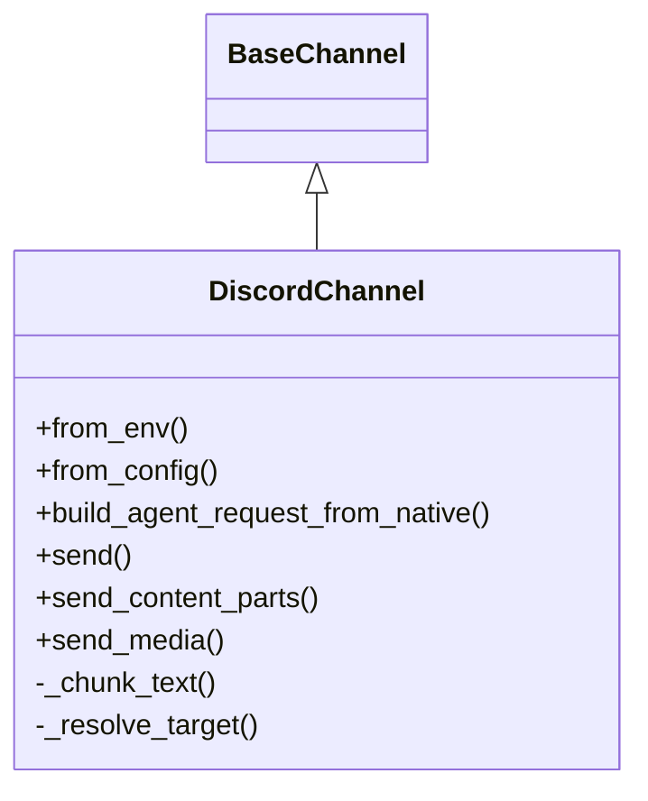
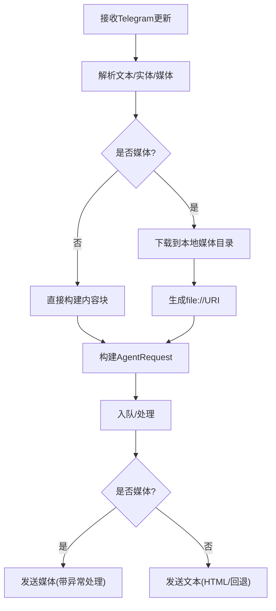
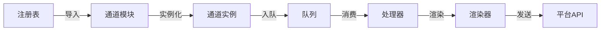

# 平台集成实现

<cite>
**本文档引用的文件**
- [src/copaw/app/channels/base.py](file://src/copaw/app/channels/base.py)
- [src/copaw/app/channels/manager.py](file://src/copaw/app/channels/manager.py)
- [src/copaw/app/channels/registry.py](file://src/copaw/app/channels/registry.py)
- [src/copaw/app/channels/renderer.py](file://src/copaw/app/channels/renderer.py)
- [src/copaw/app/channels/dingtalk/channel.py](file://src/copaw/app/channels/dingtalk/channel.py)
- [src/copaw/app/channels/feishu/channel.py](file://src/copaw/app/channels/feishu/channel.py)
- [src/copaw/app/channels/qq/channel.py](file://src/copaw/app/channels/qq/channel.py)
- [src/copaw/app/channels/discord_/channel.py](file://src/copaw/app/channels/discord_/channel.py)
- [src/copaw/app/channels/telegram/channel.py](file://src/copaw/app/channels/telegram/channel.py)
</cite>

## 目录
1. [简介](#简介)
2. [项目结构](#项目结构)
3. [核心组件](#核心组件)
4. [架构总览](#架构总览)
5. [详细组件分析](#详细组件分析)
6. [依赖关系分析](#依赖关系分析)
7. [性能考虑](#性能考虑)
8. [故障排除指南](#故障排除指南)
9. [结论](#结论)

## 简介
本文件系统性梳理 CoPaw 平台在多聊天平台上的集成实现，重点覆盖钉钉、飞书、QQ、Discord、Telegram 等平台的适配器设计与运行机制。文档从架构、数据流、消息转换与内容渲染、认证与 Webhook 处理、API 集成、平台差异与最佳实践、配置与部署、以及新平台接入模板与测试方法等方面进行深入说明，帮助开发者快速理解并扩展新的平台适配。

## 项目结构
CoPaw 的通道（Channel）体系以统一的抽象基类为核心，通过注册表动态加载内置与自定义通道，由通道管理器统一调度队列与消费者线程，实现跨平台的一致交互体验。

**图表来源**
- [src/copaw/app/channels/base.py](file://src/copaw/app/channels/base.py)
- [src/copaw/app/channels/manager.py](file://src/copaw/app/channels/manager.py)
- [src/copaw/app/channels/registry.py](file://src/copaw/app/channels/registry.py)
- [src/copaw/app/channels/renderer.py](file://src/copaw/app/channels/renderer.py)

**章节来源**
- [src/copaw/app/channels/base.py](file://src/copaw/app/channels/base.py)
- [src/copaw/app/channels/manager.py](file://src/copaw/app/channels/manager.py)
- [src/copaw/app/channels/registry.py](file://src/copaw/app/channels/registry.py)
- [src/copaw/app/channels/renderer.py](file://src/copaw/app/channels/renderer.py)

## 核心组件
- BaseChannel：所有平台通道的抽象基类，定义统一的请求构建、消息发送、去抖与合并策略、会话解析、渲染样式控制等接口与默认行为。
- ChannelManager：负责通道实例的生命周期管理、队列创建与消费者任务调度、批量合并与去重、会话级并发控制。
- ChannelRegistry：内置通道注册表，按需懒加载，支持自定义通道目录扩展。
- MessageRenderer：可插拔的消息渲染器，将 Agent 输出转换为各平台可发送的内容块，并支持过滤工具消息、思考内容、代码块等。

关键特性
- 统一会话键生成：基于平台语义（如会话 ID、群聊 ID、用户 ID）生成稳定 session_id，确保跨平台一致的会话语义。
- 内容去抖与合并：对无文本输入进行缓冲合并，避免空消息与重复内容；对同一会话内的多个事件进行合并处理。
- 渲染样式控制：通过 RenderStyle 控制 Markdown、Emoji、代码块等渲染能力，支持工具调用与输出的展示策略。
- 允许列表与提及策略：支持私聊/群聊白名单、未提及拦截等安全策略。

**章节来源**
- [src/copaw/app/channels/base.py](file://src/copaw/app/channels/base.py)
- [src/copaw/app/channels/manager.py](file://src/copaw/app/channels/manager.py)
- [src/copaw/app/channels/renderer.py](file://src/copaw/app/channels/renderer.py)

## 架构总览
下图展示了从平台事件到 Agent 处理再到平台回复的整体流程，以及各组件间的依赖关系。

**图表来源**
- [src/copaw/app/channels/base.py](file://src/copaw/app/channels/base.py)
- [src/copaw/app/channels/manager.py](file://src/copaw/app/channels/manager.py)
- [src/copaw/app/channels/renderer.py](file://src/copaw/app/channels/renderer.py)

## 详细组件分析

### 钉钉（DingTalk）通道
- 认证与连接
  - 使用 Stream 客户端建立长连接，接收事件后解析为内容块。
  - 支持会话 Webhook 主动推送，存储会话 Webhook 于内存并持久化，支持定时清理。
  - 令牌缓存与刷新：实例级令牌缓存，过期前自动刷新。
- 消息处理
  - 去抖与合并：禁用时间去抖，由管理器合并同会话消息；支持批量回复与早期确认（_ack_early）降低重试风暴。
  - 会话键：使用会话 ID 的短后缀，便于定时任务查找。
  - 媒体上传：通过 Open API 上传图片/媒体，返回 media_id 后再发送。
- 发送策略
  - 文本优先使用 Markdown，超长文本回退为纯文本。
  - 支持卡片模板与机器人编码配置。
- 安全与合规
  - 消息去重：基于 message_id 去重，防止重复处理。
  - 允许列表与提及策略：支持私聊/群聊白名单与未提及拦截。

**图表来源**
- [src/copaw/app/channels/base.py](file://src/copaw/app/channels/base.py)
- [src/copaw/app/channels/dingtalk/channel.py](file://src/copaw/app/channels/dingtalk/channel.py)

**章节来源**
- [src/copaw/app/channels/dingtalk/channel.py](file://src/copaw/app/channels/dingtalk/channel.py)

### 飞书（Feishu）通道
- 认证与连接
  - 使用 lark-oapi WebSocket 接收事件，Open API 发送消息。
  - 租户访问令牌缓存与刷新，支持机器人 open_id 缓存与昵称查询。
- 消息处理
  - 会话键：群聊使用 chat_id 短后缀，私聊使用 open_id 短后缀。
  - 消息去重：维护 processed_message_ids 队列，超过上限时淘汰最旧项。
  - 内容解析：支持文本、富文本、图片、文件、音频等多种类型，自动下载资源并转为内容块。
- 发送策略
  - 支持 Markdown 渲染与交互式内容分块发送。
  - 存储 receive_id 与 receive_id_type，用于后续主动发送。

**图表来源**
- [src/copaw/app/channels/feishu/channel.py](file://src/copaw/app/channels/feishu/channel.py)

**章节来源**
- [src/copaw/app/channels/feishu/channel.py](file://src/copaw/app/channels/feishu/channel.py)

### QQ 通道
- 认证与连接
  - 使用 WebSocket 接收事件，HTTP API 发送消息。
  - Access Token 获取与缓存，支持沙箱环境 API 地址切换。
- 消息处理
  - 事件规范：区分 C2C、AT、Direct、Group 等事件类型，提取 sender 与元信息。
  - 心跳与重连：心跳控制器与指数退避重连策略，快速断开次数统计。
  - 文本清洗：两阶段 URL 清洗，避免被 QQ API 拒绝。
- 发送策略
  - 路径路由：根据消息类型选择 C2C、群组或频道路径。
  - 多级回退：Markdown -> 纯文本 -> 激进 URL 清洗，确保发送成功。
  - 媒体上传：通过富媒体服务器上传，再发送媒体消息。

**图表来源**
- [src/copaw/app/channels/qq/channel.py](file://src/copaw/app/channels/qq/channel.py)

**章节来源**
- [src/copaw/app/channels/qq/channel.py](file://src/copaw/app/channels/qq/channel.py)

### Discord 通道
- 认证与连接
  - 使用 discord.py 客户端，启用消息内容与 DM 权限。
  - 支持代理与代理鉴权。
- 消息处理
  - 允许列表与提及策略：支持 @everyone、@用户名、ID 列表等。
  - 会话键：按频道或 DM 用户生成 session_id。
- 发送策略
  - 文本分片：超过长度限制自动按换行分割，保持代码块完整性。
  - 媒体发送：支持图片、视频、音频、文件作为附件发送。

**图表来源**
- [src/copaw/app/channels/discord_/channel.py](file://src/copaw/app/channels/discord_/channel.py)
- [src/copaw/app/channels/base.py](file://src/copaw/app/channels/base.py)

**章节来源**
- [src/copaw/app/channels/discord_/channel.py](file://src/copaw/app/channels/discord_/channel.py)

### Telegram 通道
- 认证与连接
  - 使用 python-telegram-bot 应用框架，支持代理与代理鉴权。
  - 轮询模式接收消息，支持编辑消息。
- 消息处理
  - 允许列表与提及策略：支持命令与 @ 提及检测。
  - 会话键：以 chat_id 作为 session_id。
  - 媒体下载：将 Telegram 文件下载到本地媒体目录，统一为 file:// URI。
- 发送策略
  - 文本分片：按最大长度切分，HTML 渲染优先，失败回退纯文本。
  - 媒体发送：支持图片、视频、音频、文档，带大小与权限异常处理。
  - 打字指示：可选的打字指示循环，提升用户体验。

**图表来源**
- [src/copaw/app/channels/telegram/channel.py](file://src/copaw/app/channels/telegram/channel.py)

**章节来源**
- [src/copaw/app/channels/telegram/channel.py](file://src/copaw/app/channels/telegram/channel.py)

## 依赖关系分析
- 注册与发现
  - 通道注册表集中管理内置通道映射，按需导入模块并校验类型，支持自定义通道目录扩展。
- 管理与调度
  - 通道管理器持有每个通道的队列与消费者任务，按会话键锁定，保证同会话内事件顺序与合并。
  - 对于需要去抖的通道（如钉钉），管理器在入队时合并同键 payload；对于不需要去抖的通道（如飞书），由通道内部自行处理。
- 渲染与发送
  - 渲染器将 Agent 输出转换为平台可发送的内容块，通道再根据平台能力选择发送策略（文本、Markdown、附件等）。

**图表来源**
- [src/copaw/app/channels/registry.py](file://src/copaw/app/channels/registry.py)
- [src/copaw/app/channels/manager.py](file://src/copaw/app/channels/manager.py)
- [src/copaw/app/channels/renderer.py](file://src/copaw/app/channels/renderer.py)

**章节来源**
- [src/copaw/app/channels/registry.py](file://src/copaw/app/channels/registry.py)
- [src/copaw/app/channels/manager.py](file://src/copaw/app/channels/manager.py)
- [src/copaw/app/channels/renderer.py](file://src/copaw/app/channels/renderer.py)

## 性能考虑
- 去抖与合并
  - 对无文本输入进行缓冲合并，减少空消息与重复内容的处理成本。
  - 同会话内批量合并，降低队列压力与网络往返。
- 会话级并发控制
  - 通道管理器为每个 (channel, debounce_key) 维护 in_progress 集合与 pending 队列，避免并发冲突。
- 媒体处理
  - 下载与上传采用异步 HTTP 客户端，限制并发与超时，避免阻塞主事件循环。
- 分片与回退
  - 文本分片与多级回退（Markdown -> 纯文本 -> URL 清洗）确保高成功率与低失败重试。

[本节为通用指导，无需具体文件引用]

## 故障排除指南
- 钉钉
  - 会话 Webhook 过期：检查 sessionWebhookExpiredTime，必要时改用 Open API 批量发送。
  - 令牌失效：通道内部自动刷新，若仍失败，检查 client_id/client_secret 配置。
  - 重复消息：确认 message_id 去重逻辑是否生效。
- 飞书
  - 令牌获取失败：检查 app_id/app_secret，确认内部授权 API 可达。
  - 昵称获取失败：确认联系人权限范围，避免无权限导致的显示问题。
  - 消息去重：若出现重复消息，检查 processed_message_ids 队列是否溢出。
- QQ
  - URL 被拒：启用两阶段 URL 清洗；若仍失败，尝试关闭 Markdown 或使用纯文本。
  - 速率限制：遵循 RATE_LIMIT_DELAY，合理控制发送频率。
  - 重连失败：检查网络与代理设置，观察重连次数与快速断开阈值。
- Discord
  - 代理问题：确认代理地址与鉴权格式正确。
  - 代码块分片：确保分片边界不破坏代码块闭合。
- Telegram
  - 文件过大：超过 50MB 将被拒绝，建议压缩或改用外部链接。
  - 权限不足：检查 bot 是否被加入群组或频道，或是否有发送媒体权限。
  - 打字指示：若长时间无响应，确认 typing 任务是否被取消。

**章节来源**
- [src/copaw/app/channels/dingtalk/channel.py](file://src/copaw/app/channels/dingtalk/channel.py)
- [src/copaw/app/channels/feishu/channel.py](file://src/copaw/app/channels/feishu/channel.py)
- [src/copaw/app/channels/qq/channel.py](file://src/copaw/app/channels/qq/channel.py)
- [src/copaw/app/channels/discord_/channel.py](file://src/copaw/app/channels/discord_/channel.py)
- [src/copaw/app/channels/telegram/channel.py](file://src/copaw/app/channels/telegram/channel.py)

## 结论
CoPaw 的通道体系通过统一抽象、灵活注册、智能合并与渲染，实现了对多平台的无缝集成。各平台适配器在认证、Webhook、API 调用、消息格式与媒体处理方面各有侧重，但共享一致的会话模型与安全策略。遵循本文档的配置与最佳实践，可快速完成现有平台的部署与优化，并为新平台接入提供清晰的模板与测试方法。