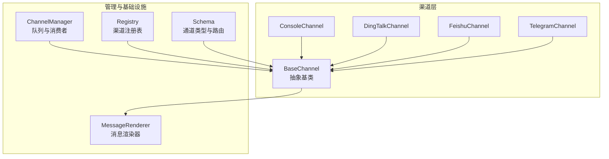
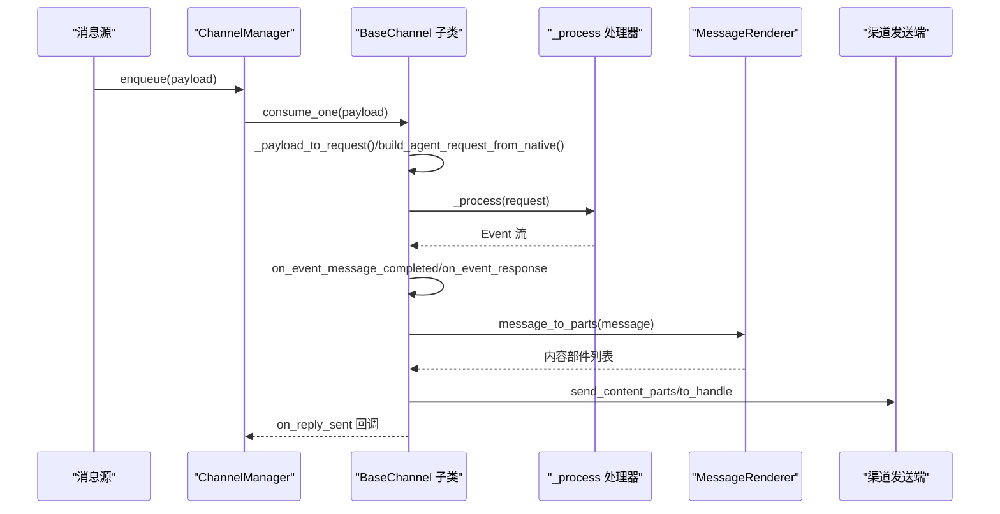
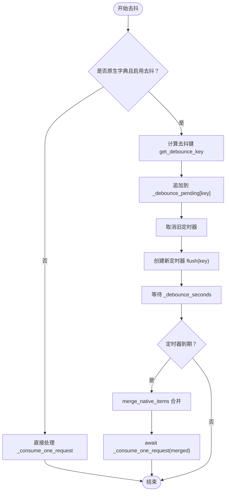
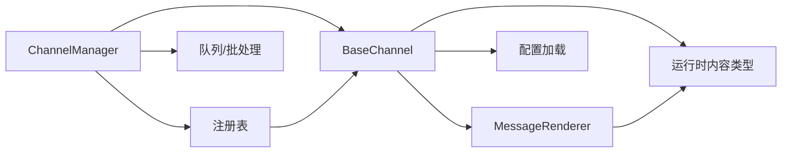

# 渠道抽象基类

<cite>
**本文档引用的文件**
- [base.py](file://src/copaw/app/channels/base.py)
- [manager.py](file://src/copaw/app/channels/manager.py)
- [schema.py](file://src/copaw/app/channels/schema.py)
- [renderer.py](file://src/copaw/app/channels/renderer.py)
- [registry.py](file://src/copaw/app/channels/registry.py)
- [console/channel.py](file://src/copaw/app/channels/console/channel.py)
- [dingtalk/channel.py](file://src/copaw/app/channels/dingtalk/channel.py)
- [feishu/channel.py](file://src/copaw/app/channels/feishu/channel.py)
- [telegram/channel.py](file://src/copaw/app/channels/telegram/channel.py)
</cite>

## 目录
1. [简介](#简介)
2. [项目结构](#项目结构)
3. [核心组件](#核心组件)
4. [架构总览](#架构总览)
5. [详细组件分析](#详细组件分析)
6. [依赖分析](#依赖分析)
7. [性能考虑](#性能考虑)
8. [故障排查指南](#故障排查指南)
9. [结论](#结论)
10. [附录](#附录)

## 简介
本文件系统性阐述 CoPaw 的渠道抽象基类 BaseChannel 的设计理念、接口规范与实现细节，涵盖渠道标识符、内容类型定义、处理器接口、生命周期方法、消息处理流程、去抖机制、序列化/反序列化、消息格式转换、多平台兼容性、配置接口、状态管理与错误处理策略，并提供继承规范、接口实现要求与最佳实践指南。目标读者既包括需要快速上手的开发者，也包括希望深入理解架构设计的高级用户。

## 项目结构
CoPaw 的渠道体系围绕 BaseChannel 抽象类构建，配合 ChannelManager 进行统一调度与队列管理，渲染器 MessageRenderer 将运行时消息转换为各渠道可发送的内容部件，注册表 registry 提供内置与自定义渠道的动态发现与加载。

图表来源
- [base.py:69-125](file://src/copaw/app/channels/base.py#L69-L125)
- [manager.py:114-134](file://src/copaw/app/channels/manager.py#L114-L134)
- [renderer.py:78-86](file://src/copaw/app/channels/renderer.py#L78-L86)
- [registry.py:19-33](file://src/copaw/app/channels/registry.py#L19-L33)
- [schema.py:12-48](file://src/copaw/app/channels/schema.py#L12-L48)

章节来源
- [base.py:69-125](file://src/copaw/app/channels/base.py#L69-L125)
- [manager.py:114-134](file://src/copaw/app/channels/manager.py#L114-L134)
- [renderer.py:78-86](file://src/copaw/app/channels/renderer.py#L78-L86)
- [registry.py:19-33](file://src/copaw/app/channels/registry.py#L19-L33)
- [schema.py:12-48](file://src/copaw/app/channels/schema.py#L12-L48)

## 核心组件
- BaseChannel：所有渠道的抽象基类，定义统一的生命周期、消息处理、去抖与渲染接口，以及通用的发送与错误处理逻辑。
- ChannelManager：负责为启用队列的渠道创建队列与消费者线程，按会话键合并批量消息并驱动渠道消费。
- MessageRenderer：将运行时 Message 转换为渠道可发送的内容部件（文本、图片、音频、视频、文件、拒绝），支持样式控制与过滤。
- Registry：内置渠道映射与自定义渠道发现，提供渠道类的动态加载与缓存。
- Schema：定义渠道类型标识、路由地址与消息转换协议。

章节来源
- [base.py:69-125](file://src/copaw/app/channels/base.py#L69-L125)
- [manager.py:114-134](file://src/copaw/app/channels/manager.py#L114-L134)
- [renderer.py:78-86](file://src/copaw/app/channels/renderer.py#L78-L86)
- [registry.py:19-33](file://src/copaw/app/channels/registry.py#L19-L33)
- [schema.py:12-48](file://src/copaw/app/channels/schema.py#L12-L48)

## 架构总览
BaseChannel 将“输入解析”和“输出渲染”解耦：输入侧由子类实现从原生消息到 AgentRequest 的转换；输出侧由 BaseChannel 使用 MessageRenderer 将运行时消息转换为渠道内容部件，并在 send_content_parts 中进行文本与媒体的组合与发送。ChannelManager 负责队列化与批处理，确保同一会话的消息顺序与完整性。

图表来源
- [manager.py:307-349](file://src/copaw/app/channels/manager.py#L307-L349)
- [base.py:443-583](file://src/copaw/app/channels/base.py#L443-L583)
- [renderer.py:87-350](file://src/copaw/app/channels/renderer.py#L87-L350)

章节来源
- [manager.py:307-349](file://src/copaw/app/channels/manager.py#L307-L349)
- [base.py:443-583](file://src/copaw/app/channels/base.py#L443-L583)
- [renderer.py:87-350](file://src/copaw/app/channels/renderer.py#L87-L350)

## 详细组件分析

### BaseChannel 设计理念与接口规范
- 渠道标识符：每个子类通过类属性 channel 指定唯一标识字符串，用于队列与路由。
- 内容类型定义：使用运行时内容类型（TextContent、ImageContent、VideoContent、AudioContent、FileContent、RefusalContent）作为统一的输出部件，避免渠道间格式差异。
- 处理器接口：ProcessHandler 接受 AgentRequest 并异步返回事件流（Event），BaseChannel 在消费过程中逐条处理 Completed 的 message 事件并触发发送。
- 生命周期方法：start/stop 由子类实现具体资源初始化与释放；consume_one 为统一的入口，支持去抖与批处理。
- 配置接口：from_env/from_config 两类工厂方法，前者从环境变量加载，后者从配置对象加载；clone 支持基于现有实例与新配置克隆出新的渠道实例。
- 状态管理：uses_manager_queue 控制是否由 ChannelManager 创建队列；内部维护去抖缓冲、待处理内容等状态。
- 错误处理：统一捕获异常并调用 _on_consume_error 发送错误提示；支持从响应事件提取错误信息。

章节来源
- [base.py:69-125](file://src/copaw/app/channels/base.py#L69-L125)
- [base.py:317-339](file://src/copaw/app/channels/base.py#L317-L339)
- [base.py:789-814](file://src/copaw/app/channels/base.py#L789-L814)
- [base.py:816-820](file://src/copaw/app/channels/base.py#L816-L820)

### 生命周期方法与消息处理接口
- start/stop：由子类实现资源启动与关闭（如网络连接、轮询线程等）。
- consume_one：默认实现支持时间去抖与“无文本合并”去抖；若 payload 是原生字典且启用去抖，则按会话键合并后延迟发送；否则直接进入 _consume_one_request。
- _consume_one_request：将 payload 转换为 AgentRequest，应用去抖策略，执行 _process，逐条处理 Completed 的 message 事件并调用 on_event_message_completed；最后调用 on_event_response 并在失败时触发 _on_consume_error。
- _run_process_loop：遍历 _process 返回的事件流，区分 message/response 事件并分别处理。
- on_event_message_completed/on_event_response：可被子类覆盖以实现批量发送或特殊处理（如钉钉合并发送）。
- _on_consume_error：默认通过 send_content_parts 发送错误文本，子类可覆盖为特定渠道 API 的错误反馈。

章节来源
- [base.py:443-583](file://src/copaw/app/channels/base.py#L443-L583)
- [base.py:541-583](file://src/copaw/app/channels/base.py#L541-L583)
- [base.py:611-646](file://src/copaw/app/channels/base.py#L611-L646)

### 去抖机制
- 时间去抖：当 _debounce_seconds > 0 且 payload 为原生字典（含 content_parts）时，按 get_debounce_key 生成键，将同一键下的多个 payload 缓存并在 _debounce_seconds 秒后合并发送。
- 无文本去抖：若内容不含文本但包含音频，则音频消息立即处理；否则将内容暂存于 _pending_content_by_session，等待后续带文本的消息到达后再合并发送，避免空文本重复与错序。
- 合并策略：merge_native_items 合并 content_parts 与 meta 字段；merge_requests 合并多个 AgentRequest 的输入内容。
- 钩子：_on_debounce_buffer_append 可在追加到去抖缓冲时触发钩子（如唤醒之前的 reply_future）。

图表来源
- [base.py:443-479](file://src/copaw/app/channels/base.py#L443-L479)
- [base.py:130-174](file://src/copaw/app/channels/base.py#L130-L174)
- [base.py:208-221](file://src/copaw/app/channels/base.py#L208-L221)
- [base.py:247-279](file://src/copaw/app/channels/base.py#L247-L279)

章节来源
- [base.py:443-479](file://src/copaw/app/channels/base.py#L443-L479)
- [base.py:130-174](file://src/copaw/app/channels/base.py#L130-L174)
- [base.py:208-221](file://src/copaw/app/channels/base.py#L208-L221)
- [base.py:247-279](file://src/copaw/app/channels/base.py#L247-L279)

### 内容序列化/反序列化与消息格式转换
- 输入转换：build_agent_request_from_native 由子类实现，将原生消息解析为运行时内容部件（content_parts），并调用 build_agent_request_from_user_content 构建 AgentRequest。
- 输出转换：_message_to_content_parts 使用 MessageRenderer 将运行时消息转换为渠道内容部件；send_content_parts 将文本与媒体部件合并为最终发送体，并调用 send_media 发送媒体附件。
- 渲染样式：RenderStyle 控制工具调用详情显示、Markdown/代码块、表情符号、思考内容过滤、内部工具过滤等；子类可通过调整渲染样式适配不同渠道能力。
- 多平台兼容：不同渠道对媒体的支持不同，send_media 默认为空操作，子类可覆盖以实现真实附件上传与发送。

章节来源
- [base.py:353-402](file://src/copaw/app/channels/base.py#L353-L402)
- [base.py:663-698](file://src/copaw/app/channels/base.py#L663-L698)
- [base.py:700-764](file://src/copaw/app/channels/base.py#L700-L764)
- [renderer.py:78-350](file://src/copaw/app/channels/renderer.py#L78-L350)

### 渠道配置接口与状态管理
- 配置接口：from_env 从环境变量加载；from_config 从配置对象加载；clone 基于现有实例与新配置克隆。
- 策略与权限：dm_policy/group_policy 控制私聊/群聊访问策略；allow_from 白名单；require_mention 强制提及；deny_message 自定义拒绝文案。
- 会话管理：resolve_session_id 将 sender_id 与渠道元数据映射为 session_id，默认使用 "channel:sender_id"；子类可覆盖以适配平台特性（如钉钉短会话 ID）。
- 状态字段：uses_manager_queue 控制是否由 ChannelManager 创建队列；_debounce_seconds 控制时间去抖；内部维护去抖定时器与缓冲。

章节来源
- [base.py:317-339](file://src/copaw/app/channels/base.py#L317-L339)
- [base.py:341-351](file://src/copaw/app/channels/base.py#L341-L351)
- [base.py:281-315](file://src/copaw/app/channels/base.py#L281-L315)
- [base.py:77-125](file://src/copaw/app/channels/base.py#L77-L125)

### 错误处理策略
- 统一异常捕获：consume_one/_run_process_loop 捕获异常并调用 _on_consume_error 发送错误文本。
- 响应错误提取：_get_response_error_message 从 AgentResponse 或事件包装中提取错误信息。
- 子类覆盖：子类可覆盖 _on_consume_error 以使用特定渠道 API 发送错误（如钉钉通过 webhook 发送）。

章节来源
- [base.py:576-604](file://src/copaw/app/channels/base.py#L576-L604)
- [base.py:631-646](file://src/copaw/app/channels/base.py#L631-L646)

### 继承规范、接口实现要求与最佳实践
- 必须实现：
  - build_agent_request_from_native：将原生消息解析为 AgentRequest。
  - send：向 to_handle 发送文本（可选附件）。
  - start/stop：资源生命周期管理。
- 可选覆盖：
  - resolve_session_id：自定义会话键。
  - on_event_message_completed：批量/去抖发送策略（如钉钉合并）。
  - _on_consume_error：特定渠道错误反馈。
  - send_media：真实媒体附件发送。
  - clone：基于新配置克隆实例。
- 最佳实践：
  - 明确去抖策略：合理设置 _debounce_seconds 与 get_debounce_key，避免跨会话键冲突。
  - 严格权限控制：利用 dm_policy/group_policy/allow_from/require_mention。
  - 渲染样式定制：根据渠道能力调整 RenderStyle，屏蔽不支持的格式。
  - 错误处理：在 _on_consume_error 中使用渠道 API 发送明确错误信息。
  - 会话一致性：确保同一会话的消息顺序与合并逻辑正确。

章节来源
- [base.py:388-402](file://src/copaw/app/channels/base.py#L388-L402)
- [base.py:816-820](file://src/copaw/app/channels/base.py#L816-L820)
- [base.py:611-646](file://src/copaw/app/channels/base.py#L611-L646)
- [base.py:789-814](file://src/copaw/app/channels/base.py#L789-L814)

## 依赖分析
- BaseChannel 依赖：
  - 运行时内容类型（agentscope_runtime.engine.schemas.agent_schemas）。
  - MessageRenderer 与 RenderStyle。
  - 配置加载工具 load_config。
- ChannelManager 依赖：
  - BaseChannel 子类集合与队列。
  - 注册表 registry 获取渠道类。
  - 合并与批处理逻辑（merge_native_items/merge_requests）。
- 渲染器依赖：
  - 运行时内容类型与消息类型枚举。
  - RenderStyle 控制渲染行为。
- 注册表依赖：
  - 内置渠道映射与自定义渠道目录扫描。

图表来源
- [base.py:23-37](file://src/copaw/app/channels/base.py#L23-L37)
- [manager.py:23-25](file://src/copaw/app/channels/manager.py#L23-L25)
- [renderer.py:14-22](file://src/copaw/app/channels/renderer.py#L14-L22)
- [registry.py:19-33](file://src/copaw/app/channels/registry.py#L19-L33)

章节来源
- [base.py:23-37](file://src/copaw/app/channels/base.py#L23-L37)
- [manager.py:23-25](file://src/copaw/app/channels/manager.py#L23-L25)
- [renderer.py:14-22](file://src/copaw/app/channels/renderer.py#L14-L22)
- [registry.py:19-33](file://src/copaw/app/channels/registry.py#L19-L33)

## 性能考虑
- 去抖优化：合理设置 _debounce_seconds，避免频繁合并导致延迟；对音频等即时输入跳过去抖。
- 批量合并：ChannelManager 对同一会话队列进行批处理，减少重复请求与上下文切换。
- 渲染开销：RenderStyle 可关闭工具详情与思考内容，降低渲染与传输成本。
- 并发模型：ChannelManager 为每个渠道创建多个消费者任务，允许不同会话并发处理。
- 媒体处理：子类应尽量复用上传后的媒体 ID，避免重复上传。

[本节为通用指导，无需特定文件来源]

## 故障排查指南
- 消息未发送：
  - 检查去抖缓冲是否阻塞：确认 get_debounce_key 是否正确，以及 _debounce_seconds 设置。
  - 检查权限策略：dm_policy/group_policy/allow_from/require_mention 是否限制了消息。
  - 检查 session_id 解析：resolve_session_id 是否返回预期值。
- 错误信息未反馈：
  - 确认 _on_consume_error 是否被覆盖为特定渠道 API。
  - 检查 _get_response_error_message 是否能从响应中提取错误。
- 渲染异常：
  - 检查 RenderStyle 配置，确保渠道能力匹配。
  - 子类是否正确覆盖 _message_to_content_parts 或 _renderer。
- 队列堆积：
  - 检查 ChannelManager 的消费者任务是否正常运行。
  - 确认子类 start/stop 生命周期是否正确。

章节来源
- [base.py:281-315](file://src/copaw/app/channels/base.py#L281-L315)
- [base.py:576-604](file://src/copaw/app/channels/base.py#L576-L604)
- [manager.py:307-349](file://src/copaw/app/channels/manager.py#L307-L349)

## 结论
BaseChannel 通过统一的输入/输出接口、去抖与批处理机制、可插拔的渲染器与灵活的生命周期管理，实现了多平台渠道的一致性与可扩展性。遵循继承规范与最佳实践，可在保证性能与稳定性的前提下快速接入新平台，并在复杂场景中实现精细化的权限控制与消息处理策略。

[本节为总结性内容，无需特定文件来源]

## 附录

### 渠道类型与路由
- 内置渠道类型：imessage、discord、dingtalk、feishu、qq、telegram、mqtt、console、voice、xiaoyi。
- ChannelAddress：统一路由结构，包含 kind/id/extra，支持 to_handle 生成。
- ChannelType：字符串类型，允许插件渠道使用任意键。

章节来源
- [schema.py:30-48](file://src/copaw/app/channels/schema.py#L30-L48)
- [schema.py:12-28](file://src/copaw/app/channels/schema.py#L12-L28)

### 具体渠道实现要点
- ConsoleChannel：终端输出与前端推送，支持媒体路径解析与前缀控制。
- DingTalkChannel：时间去抖禁用（由 ChannelManager 合并），支持会话 Webhook 与 AI 卡状态管理。
- FeishuChannel：WebSocket 接收、Open API 发送，存储 receive_id 与 chat_id/message_id 用于去重。
- TelegramChannel：Bot API 轮询，支持媒体分片与大小限制。

章节来源
- [console/channel.py:56-172](file://src/copaw/app/channels/console/channel.py#L56-L172)
- [dingtalk/channel.py:81-171](file://src/copaw/app/channels/dingtalk/channel.py#L81-L171)
- [feishu/channel.py:145-200](file://src/copaw/app/channels/feishu/channel.py#L145-L200)
- [telegram/channel.py:1-200](file://src/copaw/app/channels/telegram/channel.py#L1-L200)