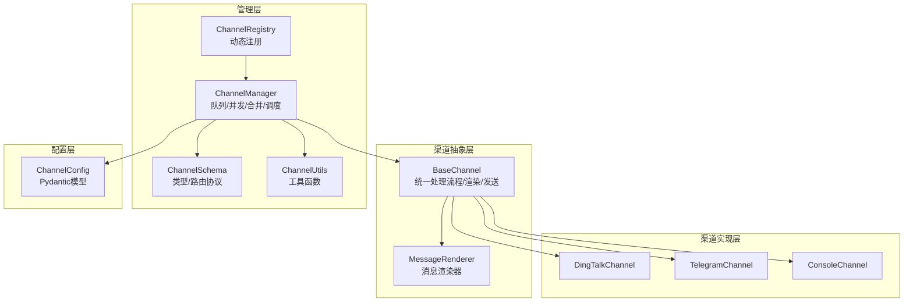
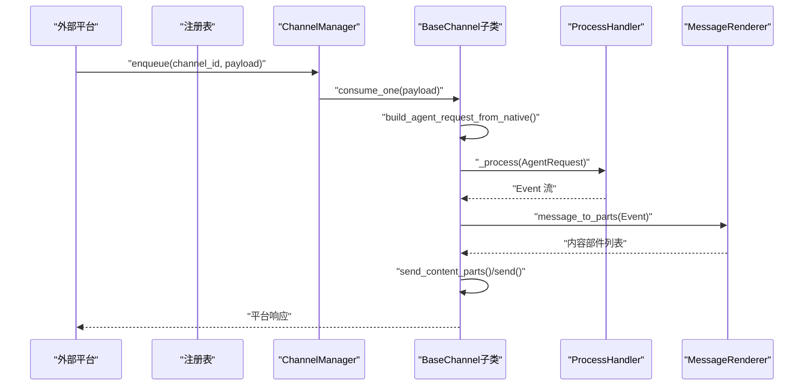
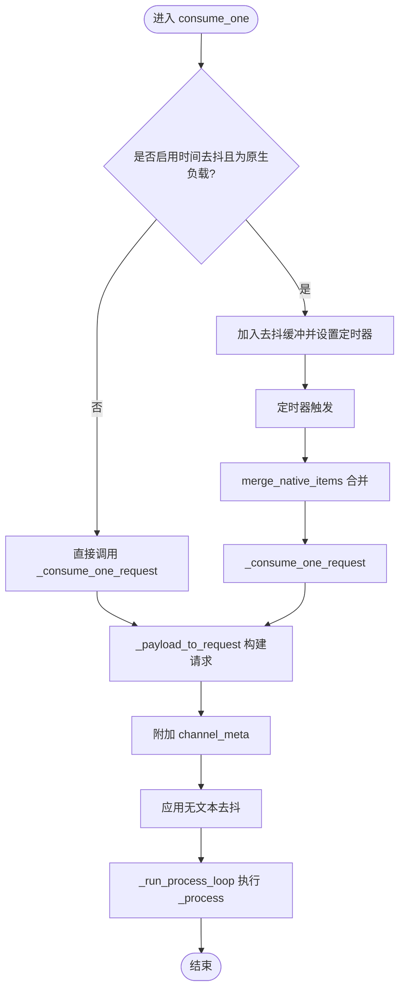
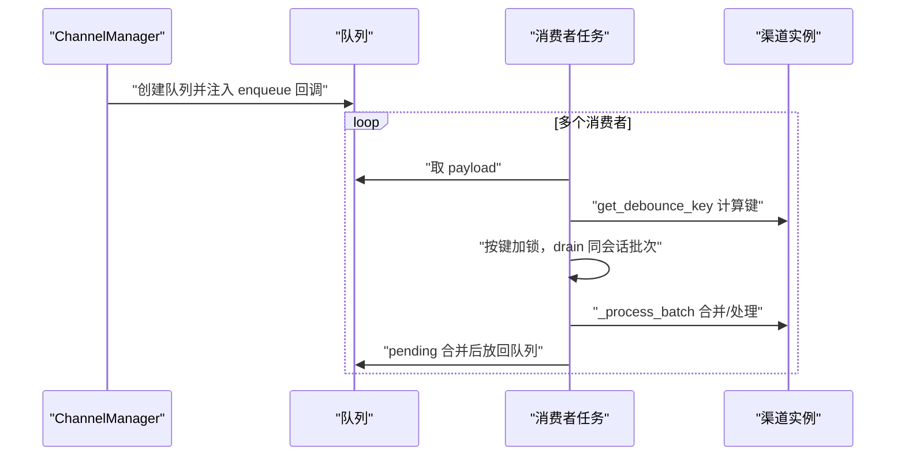
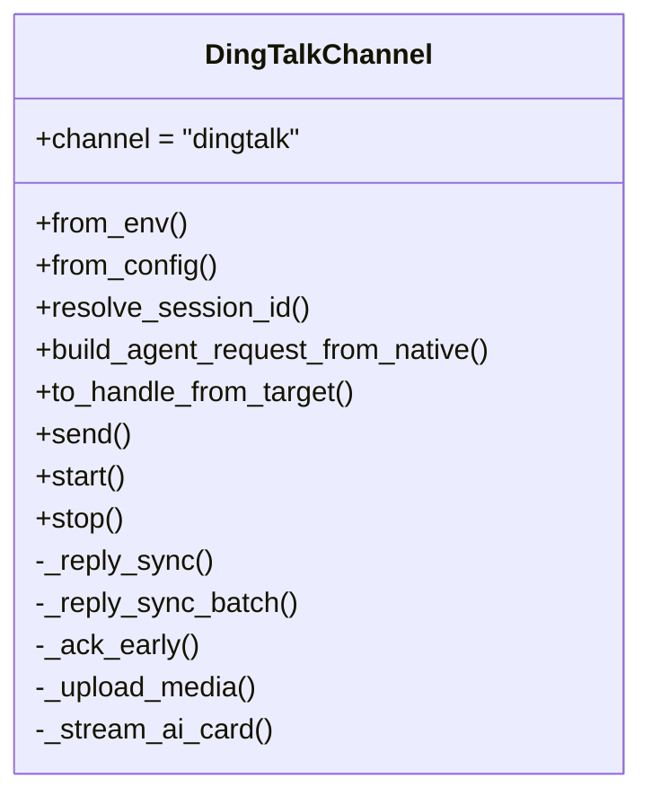
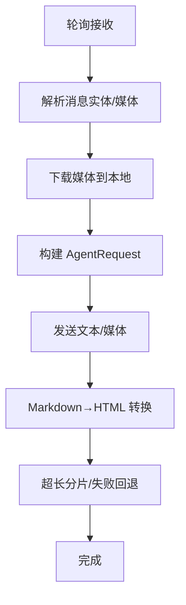
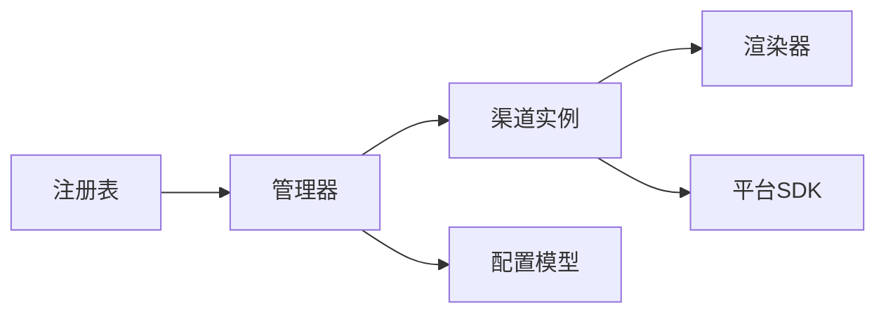

# 渠道插件系统

<cite>
**本文档引用的文件**
- [src/copaw/app/channels/base.py](file://src/copaw/app/channels/base.py)
- [src/copaw/app/channels/manager.py](file://src/copaw/app/channels/manager.py)
- [src/copaw/app/channels/registry.py](file://src/copaw/app/channels/registry.py)
- [src/copaw/app/channels/schema.py](file://src/copaw/app/channels/schema.py)
- [src/copaw/app/channels/utils.py](file://src/copaw/app/channels/utils.py)
- [src/copaw/app/channels/renderer.py](file://src/copaw/app/channels/renderer.py)
- [src/copaw/app/channels/console/channel.py](file://src/copaw/app/channels/console/channel.py)
- [src/copaw/app/channels/dingtalk/channel.py](file://src/copaw/app/channels/dingtalk/channel.py)
- [src/copaw/app/channels/telegram/channel.py](file://src/copaw/app/channels/telegram/channel.py)
- [src/copaw/app/channels/dingtalk/content_utils.py](file://src/copaw/app/channels/dingtalk/content_utils.py)
- [src/copaw/app/channels/telegram/format_html.py](file://src/copaw/app/channels/telegram/format_html.py)
- [src/copaw/config/config.py](file://src/copaw/config/config.py)
</cite>

## 目录
1. [简介](#简介)
2. [项目结构](#项目结构)
3. [核心组件](#核心组件)
4. [架构总览](#架构总览)
5. [详细组件分析](#详细组件分析)
6. [依赖关系分析](#依赖关系分析)
7. [性能考虑](#性能考虑)
8. [故障排查指南](#故障排查指南)
9. [结论](#结论)
10. [附录：新渠道开发指南](#附录新渠道开发指南)

## 简介
本文件系统性阐述 CoPaw 渠道插件系统的架构与实现，覆盖以下主题：
- 渠道适配器的架构设计与通用适配器模式
- 动态注册机制与运行时发现
- 消息路由策略与会话管理
- 渠道生命周期管理、连接状态监控与错误恢复
- 渠道消息序列化、格式转换与多平台兼容性处理
- 新渠道开发指南、接口规范与集成示例

## 项目结构
CoPaw 的渠道子系统位于 src/copaw/app/channels 下，采用“抽象基类 + 多平台实现 + 管理器 + 注册表”的分层设计：
- 抽象层：BaseChannel 定义统一的处理流程、消息渲染与发送接口
- 平台层：各平台（如 DingTalk、Telegram、Console）实现具体解析、发送与生命周期管理
- 管理层：ChannelManager 负责队列、并发消费、合并与调度
- 发现层：registry 提供内置与自定义渠道的动态注册
- 配置层：config 提供各渠道的 Pydantic 配置模型
- 工具层：renderer 提供消息到内容部件的可插拔渲染；utils 提供通用工具函数

图示来源
- [src/copaw/app/channels/base.py:69-800](file://src/copaw/app/channels/base.py#L69-L800)
- [src/copaw/app/channels/manager.py:114-565](file://src/copaw/app/channels/manager.py#L114-L565)
- [src/copaw/app/channels/registry.py:19-137](file://src/copaw/app/channels/registry.py#L19-L137)
- [src/copaw/app/channels/schema.py:12-71](file://src/copaw/app/channels/schema.py#L12-L71)
- [src/copaw/app/channels/utils.py:58-71](file://src/copaw/app/channels/utils.py#L58-L71)
- [src/copaw/app/channels/renderer.py:78-384](file://src/copaw/app/channels/renderer.py#L78-L384)
- [src/copaw/config/config.py:28-185](file://src/copaw/config/config.py#L28-L185)

章节来源
- [src/copaw/app/channels/base.py:69-800](file://src/copaw/app/channels/base.py#L69-L800)
- [src/copaw/app/channels/manager.py:114-565](file://src/copaw/app/channels/manager.py#L114-L565)
- [src/copaw/app/channels/registry.py:19-137](file://src/copaw/app/channels/registry.py#L19-L137)
- [src/copaw/app/channels/schema.py:12-71](file://src/copaw/app/channels/schema.py#L12-L71)
- [src/copaw/app/channels/utils.py:58-71](file://src/copaw/app/channels/utils.py#L58-L71)
- [src/copaw/app/channels/renderer.py:78-384](file://src/copaw/app/channels/renderer.py#L78-L384)
- [src/copaw/config/config.py:28-185](file://src/copaw/config/config.py#L28-L185)

## 核心组件
- BaseChannel：定义统一的消息处理契约、时间去抖、请求合并、渲染与发送流程、错误回调等
- ChannelManager：负责渠道实例化、队列创建、并发消费者、批量合并与调度
- ChannelRegistry：内置渠道映射与自定义渠道扫描注册
- MessageRenderer：将运行时消息转换为可发送的内容部件，并支持过滤与样式控制
- 各平台 Channel：如 DingTalk、Telegram、Console，实现平台特有解析、发送、会话与生命周期管理

章节来源
- [src/copaw/app/channels/base.py:69-800](file://src/copaw/app/channels/base.py#L69-L800)
- [src/copaw/app/channels/manager.py:114-565](file://src/copaw/app/channels/manager.py#L114-L565)
- [src/copaw/app/channels/registry.py:19-137](file://src/copaw/app/channels/registry.py#L19-L137)
- [src/copaw/app/channels/renderer.py:78-384](file://src/copaw/app/channels/renderer.py#L78-L384)

## 架构总览
下图展示从“外部平台事件”到“Agent 请求流”的端到端流程，以及 ChannelManager 如何协调不同渠道：

图示来源
- [src/copaw/app/channels/manager.py:289-378](file://src/copaw/app/channels/manager.py#L289-L378)
- [src/copaw/app/channels/base.py:388-583](file://src/copaw/app/channels/base.py#L388-L583)
- [src/copaw/app/channels/renderer.py:87-351](file://src/copaw/app/channels/renderer.py#L87-L351)

章节来源
- [src/copaw/app/channels/manager.py:289-378](file://src/copaw/app/channels/manager.py#L289-L378)
- [src/copaw/app/channels/base.py:388-583](file://src/copaw/app/channels/base.py#L388-L583)
- [src/copaw/app/channels/renderer.py:87-351](file://src/copaw/app/channels/renderer.py#L87-L351)

## 详细组件分析

### 基础通道：BaseChannel
- 统一处理流程
  - consume_one：接收队列中的 payload，支持时间去抖与文本去抖合并
  - _consume_one_request：构建 AgentRequest，调用 _process，逐条事件处理，错误回调与 on_reply_sent 回调
  - on_event_message_completed/on_event_response：事件钩子，允许平台在消息完成或响应到达时执行特定逻辑
- 消息渲染与发送
  - _message_to_content_parts：委托 MessageRenderer 将消息转为内容部件
  - send_content_parts：默认将文本与媒体合并发送；媒体通过 send_media 子类实现
- 会话与去抖
  - resolve_session_id：默认以 channel:sender_id 作为会话键
  - _apply_no_text_debounce：对无文本内容进行缓冲，待出现文本后合并发送
  - merge_native_items/merge_requests：同会话内原生负载与请求的合并策略
- 生命周期与错误处理
  - start/stop：由 ChannelManager 在启动/停止时调用
  - _on_consume_error：默认错误回退为发送纯文本错误提示

图示来源
- [src/copaw/app/channels/base.py:443-583](file://src/copaw/app/channels/base.py#L443-L583)

章节来源
- [src/copaw/app/channels/base.py:69-800](file://src/copaw/app/channels/base.py#L69-L800)

### 渠道管理器：ChannelManager
- 实例化与注册
  - from_env/from_config：根据环境变量或配置创建渠道实例，按可用性过滤
  - 注册表 get_channel_registry：内置 + 自定义渠道聚合
- 队列与并发
  - 为每个启用队列的渠道创建 asyncio.Queue
  - 每个渠道启动多个消费者任务，按会话键加锁保证同会话不被拆分
- 批量合并与调度
  - _drain_same_key：按去抖键从队列中提取同会话批次
  - _process_batch：对原生负载调用 merge_native_items，对请求调用 merge_requests
  - _put_pending_merged：将合并后的结果放回队列，等待后续处理
- 替换与停止
  - replace_channel：安全替换指定渠道，先预启新渠道再停止旧渠道
  - stop_all：取消任务、清空状态、调用各渠道 stop()

图示来源
- [src/copaw/app/channels/manager.py:307-378](file://src/copaw/app/channels/manager.py#L307-L378)
- [src/copaw/app/channels/manager.py:419-483](file://src/copaw/app/channels/manager.py#L419-L483)

章节来源
- [src/copaw/app/channels/manager.py:114-565](file://src/copaw/app/channels/manager.py#L114-L565)

### 渠道注册表：ChannelRegistry
- 内置渠道映射：IMessage/Discord/DingTalk/Feishu/QQ/Telegram/Mattermost/MQTT/Console/Matrix/Voice/Wecom/XiaoYi
- 自定义渠道：扫描 CUSTOM_CHANNELS_DIR，导入模块并收集继承自 BaseChannel 的类
- 缓存与线程安全：进程级缓存，加载失败时对必需渠道抛出异常

章节来源
- [src/copaw/app/channels/registry.py:19-137](file://src/copaw/app/channels/registry.py#L19-L137)

### 渲染器：MessageRenderer
- 输入：运行时 Message 对象（含内容块）
- 输出：内容部件列表（Text/Image/Video/Audio/File/Refusal）
- 可插拔样式：RenderStyle 控制是否显示工具详情、代码围栏、表情、过滤思考等
- 内部工具过滤：对内部工具产生的媒体部件可选择跳过

章节来源
- [src/copaw/app/channels/renderer.py:78-384](file://src/copaw/app/channels/renderer.py#L78-L384)

### 渠道模式与平台实现

#### Console 渠道
- 角色：轻量输出通道，将 AgentResponse 输出到终端
- 特性：支持过滤选项（工具详情、思考块、工具消息），媒体目录解析
- 生命周期：start/stop 简单开关
- 发送：send/send_content_parts 打印并推送前端存储

章节来源
- [src/copaw/app/channels/console/channel.py:56-471](file://src/copaw/app/channels/console/channel.py#L56-L471)

#### DingTalk 渠道
- 会话与去抖：禁用时间去抖，由管理器合并；会话键使用对话 ID 后缀
- 去重与回复：基于消息 ID 去重；支持早期 ACK 与批量回复 Future
- Proactive 发送：通过 sessionWebhook 存储与恢复，支持持久化
- 媒体上传：Open API 上传媒体并返回 media_id
- AI 卡流式：通过 Streaming API 推送卡片内容，带预取令牌与状态机
- 错误处理：HTTP 状态码与 API 返回值校验，异常分类与恢复

图示来源
- [src/copaw/app/channels/dingtalk/channel.py:81-251](file://src/copaw/app/channels/dingtalk/channel.py#L81-L251)
- [src/copaw/app/channels/dingtalk/channel.py:2210-2499](file://src/copaw/app/channels/dingtalk/channel.py#L2210-L2499)

章节来源
- [src/copaw/app/channels/dingtalk/channel.py:81-800](file://src/copaw/app/channels/dingtalk/channel.py#L81-L800)
- [src/copaw/app/channels/dingtalk/channel.py:2000-2499](file://src/copaw/app/channels/dingtalk/channel.py#L2000-L2499)

#### Telegram 渠道
- 接收：Polling 模式，解析消息实体（命令、提及、媒体），下载媒体至本地
- 发送：HTML 格式转换（Markdown 到 Telegram HTML），分片发送，超长自动切分
- 生命周期：自动重连、看门狗、命令注册
- 错误处理：针对文件过大、网络错误、权限限制等进行降级与提示

图示来源
- [src/copaw/app/channels/telegram/channel.py:140-237](file://src/copaw/app/channels/telegram/channel.py#L140-L237)
- [src/copaw/app/channels/telegram/format_html.py:22-162](file://src/copaw/app/channels/telegram/format_html.py#L22-L162)

章节来源
- [src/copaw/app/channels/telegram/channel.py:264-1044](file://src/copaw/app/channels/telegram/channel.py#L264-L1044)
- [src/copaw/app/channels/telegram/format_html.py:22-194](file://src/copaw/app/channels/telegram/format_html.py#L22-L194)

### 消息序列化、格式转换与多平台兼容
- 序列化与反序列化
  - BaseChannel 通过 build_agent_request_from_native 将平台原生负载转换为运行时 Message/Content 类型
  - ChannelManager 在合并时使用 merge_native_items/merge_requests 保持输入完整性
- 格式转换
  - MessageRenderer 支持多种内容块（文本、图片、视频、音频、文件、拒绝）与样式控制
  - Telegram：markdown_to_telegram_html 将标准 Markdown 转为 Telegram Bot API 兼容 HTML
  - DingTalk：将 data URL 解析为二进制或媒体链接，支持 AI 卡流式渲染
- 多平台兼容
  - 统一的 Content 类型体系，避免平台间字段差异
  - Meta 字段承载平台特定信息（如 session_webhook、chat_id、message_id 等）

章节来源
- [src/copaw/app/channels/base.py:388-403](file://src/copaw/app/channels/base.py#L388-L403)
- [src/copaw/app/channels/renderer.py:87-351](file://src/copaw/app/channels/renderer.py#L87-L351)
- [src/copaw/app/channels/telegram/format_html.py:22-162](file://src/copaw/app/channels/telegram/format_html.py#L22-L162)
- [src/copaw/app/channels/dingtalk/content_utils.py:33-61](file://src/copaw/app/channels/dingtalk/content_utils.py#L33-L61)

## 依赖关系分析
- 组件耦合
  - BaseChannel 依赖 MessageRenderer 与运行时消息类型
  - ChannelManager 依赖 ChannelRegistry 与配置系统
  - 各平台 Channel 依赖平台 SDK（如 DingTalk Stream、Telegram Bot API）
- 关键依赖链
  - 注册表 → 管理器 → 渠道实例 → 平台 SDK
  - 管理器 → 去抖/合并 → 渠道实例 → 渲染器 → 平台发送

图示来源
- [src/copaw/app/channels/registry.py:132-137](file://src/copaw/app/channels/registry.py#L132-L137)
- [src/copaw/app/channels/manager.py:119-156](file://src/copaw/app/channels/manager.py#L119-L156)
- [src/copaw/config/config.py:167-185](file://src/copaw/config/config.py#L167-L185)

章节来源
- [src/copaw/app/channels/registry.py:132-137](file://src/copaw/app/channels/registry.py#L132-L137)
- [src/copaw/app/channels/manager.py:119-156](file://src/copaw/app/channels/manager.py#L119-L156)
- [src/copaw/config/config.py:167-185](file://src/copaw/config/config.py#L167-L185)

## 性能考虑
- 去抖与合并
  - 时间去抖：减少高频小消息的往返开销（如 Telegram 的媒体先行）
  - 文本去抖：避免无文本消息导致的重复与错序
  - 合并策略：同会话内原生负载与请求合并，降低处理次数
- 并发与锁
  - 每个渠道固定数量的消费者，同会话键加锁确保顺序一致性
  - 队列容量与批处理大小可调，平衡吞吐与延迟
- 媒体处理
  - 下载与上传异步化，避免阻塞主处理循环
  - 文件大小限制与分片发送，防止平台限制导致失败重试风暴
- 渲染与格式转换
  - 渲染器可配置样式，减少冗余内容传输
  - 平台特定格式转换仅在必要时进行（如 Telegram HTML）

## 故障排查指南
- 渠道无法启动
  - 检查配置项（如 token、密钥、代理）与环境变量
  - 查看 ChannelManager 的初始化日志与异常
- 消息未送达或重复
  - 检查去抖与合并逻辑是否生效（去抖键、同会话合并）
  - DingTalk：确认 sessionWebhook 是否正确保存与加载
- 媒体发送失败
  - Telegram：检查文件大小限制与网络错误；必要时回退为纯文本
  - DingTalk：检查上传接口返回与 media_id 获取
- 连接中断与重连
  - Telegram：查看自动重连与看门狗日志
  - DingTalk：检查 access_token 刷新与 AI 卡流式状态机
- 错误回调与兜底
  - BaseChannel 默认错误回调会发送纯文本错误提示
  - 平台 Channel 可覆盖 _on_consume_error 实现更友好的错误反馈

章节来源
- [src/copaw/app/channels/telegram/channel.py:856-995](file://src/copaw/app/channels/telegram/channel.py#L856-L995)
- [src/copaw/app/channels/dingtalk/channel.py:2268-2307](file://src/copaw/app/channels/dingtalk/channel.py#L2268-L2307)
- [src/copaw/app/channels/base.py:631-647](file://src/copaw/app/channels/base.py#L631-L647)

## 结论
CoPaw 渠道插件系统通过“抽象基类 + 管理器 + 注册表 + 渲染器”的分层设计，实现了跨平台的一致性与扩展性。其动态注册机制、去抖与合并策略、可插拔渲染与平台特定实现，共同构成了高可用、高性能、易维护的渠道生态。对于新增平台，遵循 BaseChannel 接口与 ChannelManager 的契约即可快速集成。

## 附录：新渠道开发指南

### 接口规范
- 必须实现
  - from_env 或 from_config：从环境变量或配置对象创建实例
  - build_agent_request_from_native：将平台原生负载转换为 AgentRequest
  - send/send_content_parts/send_media：发送文本、内容部件与媒体
  - start/stop：生命周期管理
- 可选增强
  - resolve_session_id：自定义会话键
  - get_to_handle_from_request/to_handle_from_target：目标句柄映射
  - _before_consume_process/on_event_message_completed：事件钩子
  - _on_consume_error：错误回调定制

章节来源
- [src/copaw/app/channels/base.py:321-436](file://src/copaw/app/channels/base.py#L321-L436)
- [src/copaw/app/channels/base.py:648-765](file://src/copaw/app/channels/base.py#L648-L765)

### 开发步骤
- 创建类继承 BaseChannel，实现上述方法
- 在配置模型中添加对应配置类（参考 config.py 中的各平台配置）
- 在注册表中注册（若为内置渠道），或放置于 CUSTOM_CHANNELS_DIR 让系统自动发现
- 在 ChannelManager 的 from_config 中读取配置并实例化
- 编写单元测试与集成测试，覆盖消息解析、发送、错误与生命周期

章节来源
- [src/copaw/config/config.py:28-185](file://src/copaw/config/config.py#L28-L185)
- [src/copaw/app/channels/registry.py:94-137](file://src/copaw/app/channels/registry.py#L94-L137)
- [src/copaw/app/channels/manager.py:157-247](file://src/copaw/app/channels/manager.py#L157-L247)

### 集成示例（路径指引）
- 渲染器使用：参考 ConsoleChannel 的 _message_to_content_parts 与 send_content_parts
- 平台发送：参考 TelegramChannel 的 send/send_media 与媒体下载
- 去抖与合并：参考 BaseChannel 的 _apply_no_text_debounce 与 merge_native_items
- 会话管理：参考 DingTalkChannel 的 resolve_session_id 与 sessionWebhook 存储

章节来源
- [src/copaw/app/channels/console/channel.py:443-458](file://src/copaw/app/channels/console/channel.py#L443-L458)
- [src/copaw/app/channels/telegram/channel.py:597-834](file://src/copaw/app/channels/telegram/channel.py#L597-L834)
- [src/copaw/app/channels/base.py:247-299](file://src/copaw/app/channels/base.py#L247-L299)
- [src/copaw/app/channels/dingtalk/channel.py:364-416](file://src/copaw/app/channels/dingtalk/channel.py#L364-L416)