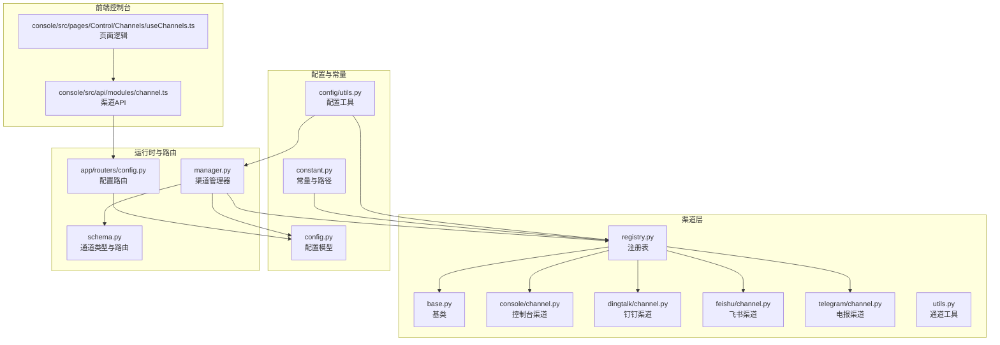
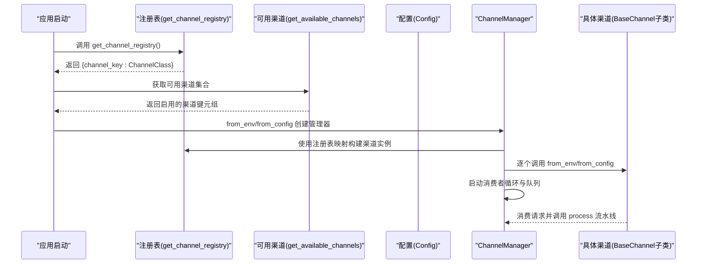
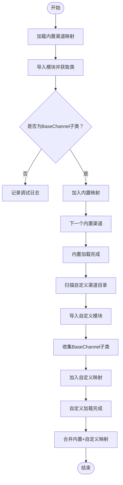
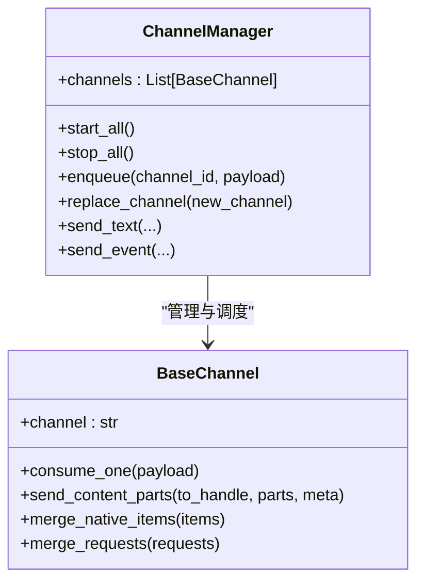
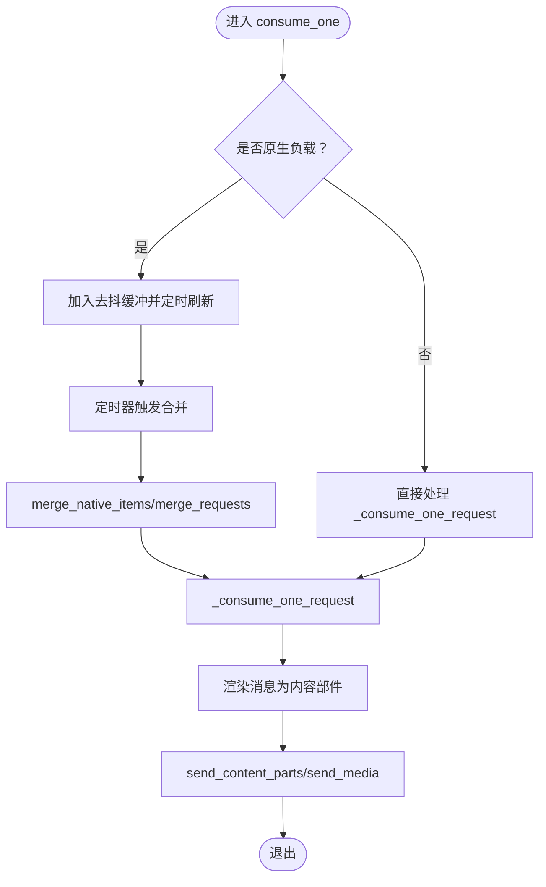
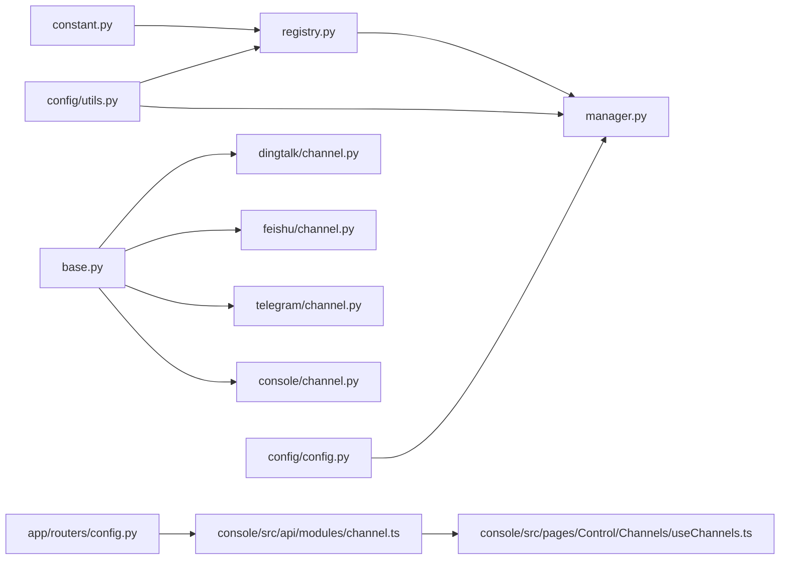

# 渠道注册表

<cite>
**本文档引用的文件**
- [registry.py](file://src/copaw/app/channels/registry.py)
- [manager.py](file://src/copaw/app/channels/manager.py)
- [base.py](file://src/copaw/app/channels/base.py)
- [schema.py](file://src/copaw/app/channels/schema.py)
- [channel.py（控制台）](file://src/copaw/app/channels/console/channel.py)
- [channel.py（钉钉）](file://src/copaw/app/channels/dingtalk/channel.py)
- [channel.py（飞书）](file://src/copaw/app/channels/feishu/channel.py)
- [channel.py（电报）](file://src/copaw/app/channels/telegram/channel.py)
- [utils.py（通道工具）](file://src/copaw/app/channels/utils.py)
- [constant.py](file://src/copaw/constant.py)
- [config.py（配置）](file://src/copaw/config/config.py)
- [utils.py（配置工具）](file://src/copaw/config/utils.py)
- [config.py（路由）](file://src/copaw/app/routers/config.py)
- [channel.ts（前端API）](file://console/src/api/modules/channel.ts)
- [useChannels.ts（前端页面逻辑）](file://console/src/pages/Control/Channels/useChannels.ts)
</cite>

## 目录
1. [简介](#简介)
2. [项目结构](#项目结构)
3. [核心组件](#核心组件)
4. [架构总览](#架构总览)
5. [详细组件分析](#详细组件分析)
6. [依赖分析](#依赖分析)
7. [性能考虑](#性能考虑)
8. [故障排查指南](#故障排查指南)
9. [结论](#结论)
10. [附录：新渠道开发与集成](#附录新渠道开发与集成)

## 简介
本文件系统化阐述 CoPaw 的“渠道注册表”体系，覆盖以下关键主题：
- 渠道注册机制：内置渠道与自定义渠道的加载与缓存策略
- 动态发现与插件化：通过工作目录扫描与导入模块实现扩展
- 渠道类映射与可用渠道过滤：基于环境变量与配置的筛选
- 注册流程、配置验证与错误处理：从导入到实例化的完整链路
- 渠道优先级管理、冲突解决与版本兼容性处理：并发安全与降级策略
- 新渠道开发指南：接口规范、注册方式与集成测试方法
- 扩展机制与自定义渠道集成示例：可复用的实现模板

## 项目结构
围绕渠道注册表的核心代码位于 src/copaw/app/channels 目录，配合配置与常量模块共同构成完整的插件化消息通道框架。

**图表来源**
- [registry.py:1-137](file://src/copaw/app/channels/registry.py#L1-L137)
- [manager.py:1-565](file://src/copaw/app/channels/manager.py#L1-L565)
- [base.py:1-868](file://src/copaw/app/channels/base.py#L1-L868)
- [schema.py:1-71](file://src/copaw/app/channels/schema.py#L1-L71)
- [config.py:1-1101](file://src/copaw/config/config.py#L1-L1101)
- [utils.py（配置工具）:332-358](file://src/copaw/config/utils.py#L332-L358)
- [constant.py:140-144](file://src/copaw/constant.py#L140-L144)
- [config.py（路由）:59-92](file://src/copaw/app/routers/config.py#L59-L92)
- [channel.ts（前端API）:1-28](file://console/src/api/modules/channel.ts#L1-L28)
- [useChannels.ts（前端页面逻辑）:43-72](file://console/src/pages/Control/Channels/useChannels.ts#L43-L72)

**章节来源**
- [registry.py:1-137](file://src/copaw/app/channels/registry.py#L1-L137)
- [manager.py:1-565](file://src/copaw/app/channels/manager.py#L1-L565)
- [base.py:1-868](file://src/copaw/app/channels/base.py#L1-L868)
- [schema.py:1-71](file://src/copaw/app/channels/schema.py#L1-L71)
- [config.py（配置）:1-1101](file://src/copaw/config/config.py#L1-L1101)
- [utils.py（配置工具）:332-358](file://src/copaw/config/utils.py#L332-L358)
- [constant.py:140-144](file://src/copaw/constant.py#L140-L144)
- [config.py（路由）:59-92](file://src/copaw/app/routers/config.py#L59-L92)
- [channel.ts（前端API）:1-28](file://console/src/api/modules/channel.ts#L1-L28)
- [useChannels.ts（前端页面逻辑）:43-72](file://console/src/pages/Control/Channels/useChannels.ts#L43-L72)

## 核心组件
- 渠道注册表 registry.py：负责内置渠道映射、自定义渠道动态发现、缓存与错误处理
- 渠道基类 base.py：统一的消费流程、内容合并、去抖与发送协议
- 渠道管理器 manager.py：队列、消费者线程、批量处理、替换与停止流程
- 渠道类型与路由 schema.py：通道类型标识、路由地址与转换协议
- 渠道实现示例：控制台、钉钉、飞书、电报等
- 配置与常量：配置模型、可用渠道筛选、工作目录与自定义渠道目录
- 前端控制台：渠道列表、配置更新与排序展示

**章节来源**
- [registry.py:19-137](file://src/copaw/app/channels/registry.py#L19-L137)
- [base.py:69-800](file://src/copaw/app/channels/base.py#L69-L800)
- [manager.py:114-565](file://src/copaw/app/channels/manager.py#L114-L565)
- [schema.py:12-71](file://src/copaw/app/channels/schema.py#L12-L71)
- [config.py（配置）:28-184](file://src/copaw/config/config.py#L28-L184)
- [utils.py（配置工具）:332-358](file://src/copaw/config/utils.py#L332-L358)
- [constant.py:140-144](file://src/copaw/constant.py#L140-L144)

## 架构总览
下图展示了从注册表到运行时的完整调用链：注册表提供渠道类映射；管理器根据可用渠道创建实例并启动消费者循环；基类统一流程与发送协议；配置与常量决定启用哪些渠道及自定义渠道目录。

**图表来源**
- [registry.py:132-137](file://src/copaw/app/channels/registry.py#L132-L137)
- [utils.py（配置工具）:332-358](file://src/copaw/config/utils.py#L332-L358)
- [manager.py:135-247](file://src/copaw/app/channels/manager.py#L135-L247)
- [base.py:317-480](file://src/copaw/app/channels/base.py#L317-L480)

## 详细组件分析

### 组件A：渠道注册表（registry.py）
- 内置渠道映射：通过模块名与类名映射内置渠道键，确保类型安全校验
- 自定义渠道发现：扫描工作目录下的 Python 文件或包，导入并收集继承自基类的子类
- 缓存与并发：进程级缓存内置渠道类，线程锁保护初始化
- 错误处理：内置渠道失败按需抛出；自定义渠道失败记录日志并跳过

**图表来源**
- [registry.py:42-137](file://src/copaw/app/channels/registry.py#L42-L137)
- [constant.py:140-144](file://src/copaw/constant.py#L140-L144)

**章节来源**
- [registry.py:19-137](file://src/copaw/app/channels/registry.py#L19-L137)
- [constant.py:140-144](file://src/copaw/constant.py#L140-L144)

### 组件B：渠道管理器（manager.py）
- 实例化：支持从环境变量与配置两种方式创建渠道实例
- 队列与消费者：每个渠道可拥有独立队列与多个消费者，按会话键去重与合并
- 批处理与去抖：对同一会话的消息进行合并与时间去抖，提升吞吐与一致性
- 替换与停止：支持动态替换单个渠道实例，保证平滑过渡

**图表来源**
- [manager.py:114-565](file://src/copaw/app/channels/manager.py#L114-L565)
- [base.py:69-800](file://src/copaw/app/channels/base.py#L69-L800)

**章节来源**
- [manager.py:114-565](file://src/copaw/app/channels/manager.py#L114-L565)
- [base.py:69-800](file://src/copaw/app/channels/base.py#L69-L800)

### 组件C：渠道基类（base.py）
- 统一协议：定义 from_env/from_config、build_agent_request_from_native、send_content_parts 等
- 会话与去抖：基于会话键的时间去抖与内容去抖，避免空文本消息的重复处理
- 消息渲染：将运行时消息转换为可发送的内容部件，并支持媒体回退文本
- 错误处理：在消费流程中捕获异常并发送错误提示

**图表来源**
- [base.py:443-751](file://src/copaw/app/channels/base.py#L443-L751)

**章节来源**
- [base.py:69-800](file://src/copaw/app/channels/base.py#L69-L800)

### 组件D：渠道类型与路由（schema.py）
- 渠道类型标识：内置渠道键集合与通用字符串类型，允许插件使用任意键
- 路由地址：统一的 ChannelAddress 结构，便于跨渠道路由与发送
- 协议：ChannelMessageConverter 规范了消息转换与回复发送

**章节来源**
- [schema.py:12-71](file://src/copaw/app/channels/schema.py#L12-L71)

### 组件E：可用渠道过滤（config/utils.py）
- 环境变量优先：COPAW_ENABLED_CHANNELS 白名单优先于 COPAW_DISABLED_CHANNELS 黑名单
- 注册表联动：结合注册表返回的全部渠道键，生成最终启用集合

**章节来源**
- [utils.py（配置工具）:332-358](file://src/copaw/config/utils.py#L332-L358)
- [registry.py:132-137](file://src/copaw/app/channels/registry.py#L132-L137)

### 组件F：前端控制台（console）
- API：列出渠道类型、读取与更新渠道配置
- 页面：按内置顺序与用户选择展示渠道卡片，区分内置与插件渠道

**章节来源**
- [channel.ts（前端API）:1-28](file://console/src/api/modules/channel.ts#L1-L28)
- [useChannels.ts（前端页面逻辑）:43-72](file://console/src/pages/Control/Channels/useChannels.ts#L43-L72)

## 依赖分析
- 注册表依赖常量模块提供的自定义渠道目录路径
- 管理器依赖注册表与配置工具，用于构建渠道实例与筛选可用渠道
- 渠道实现依赖基类与通道工具，遵循统一协议
- 前端通过路由与API访问后端配置

**图表来源**
- [constant.py:140-144](file://src/copaw/constant.py#L140-L144)
- [registry.py:1-137](file://src/copaw/app/channels/registry.py#L1-L137)
- [manager.py:1-565](file://src/copaw/app/channels/manager.py#L1-L565)
- [utils.py（配置工具）:332-358](file://src/copaw/config/utils.py#L332-L358)
- [config.py（配置）:1-1101](file://src/copaw/config/config.py#L1-L1101)
- [base.py:1-868](file://src/copaw/app/channels/base.py#L1-L868)
- [channel.py（钉钉）:1-2499](file://src/copaw/app/channels/dingtalk/channel.py#L1-L2499)
- [channel.py（飞书）:1-2019](file://src/copaw/app/channels/feishu/channel.py#L1-L2019)
- [channel.py（电报）:1-1044](file://src/copaw/app/channels/telegram/channel.py#L1-L1044)
- [channel.py（控制台）:1-471](file://src/copaw/app/channels/console/channel.py#L1-L471)
- [config.py（路由）:59-92](file://src/copaw/app/routers/config.py#L59-L92)
- [channel.ts（前端API）:1-28](file://console/src/api/modules/channel.ts#L1-L28)
- [useChannels.ts（前端页面逻辑）:43-72](file://console/src/pages/Control/Channels/useChannels.ts#L43-L72)

**章节来源**
- [constant.py:140-144](file://src/copaw/constant.py#L140-L144)
- [registry.py:1-137](file://src/copaw/app/channels/registry.py#L1-L137)
- [manager.py:1-565](file://src/copaw/app/channels/manager.py#L1-L565)
- [utils.py（配置工具）:332-358](file://src/copaw/config/utils.py#L332-L358)
- [config.py（配置）:1-1101](file://src/copaw/config/config.py#L1-L1101)
- [base.py:1-868](file://src/copaw/app/channels/base.py#L1-L868)
- [channel.py（钉钉）:1-2499](file://src/copaw/app/channels/dingtalk/channel.py#L1-L2499)
- [channel.py（飞书）:1-2019](file://src/copaw/app/channels/feishu/channel.py#L1-L2019)
- [channel.py（电报）:1-1044](file://src/copaw/app/channels/telegram/channel.py#L1-L1044)
- [channel.py（控制台）:1-471](file://src/copaw/app/channels/console/channel.py#L1-L471)
- [config.py（路由）:59-92](file://src/copaw/app/routers/config.py#L59-L92)
- [channel.ts（前端API）:1-28](file://console/src/api/modules/channel.ts#L1-L28)
- [useChannels.ts（前端页面逻辑）:43-72](file://console/src/pages/Control/Channels/useChannels.ts#L43-L72)

## 性能考虑
- 并发与批处理：每个渠道维护固定数量的消费者，同一会话内的消息合并减少重复处理
- 时间去抖：对原生负载设置去抖窗口，降低高频事件的处理压力
- 队列容量：统一的最大队列长度限制，防止内存膨胀
- 异步与锁：关键路径使用异步与细粒度锁，避免阻塞与死锁

[本节为通用指导，无需特定文件来源]

## 故障排查指南
- 注册表问题
  - 内置渠道缺失：检查模块导入与类继承关系，确认类型校验通过
  - 自定义渠道未加载：确认文件命名与包结构，查看导入异常日志
- 可用渠道筛选
  - 环境变量优先级：确认 COPAW_ENABLED_CHANNELS 与 COPAW_DISABLED_CHANNELS 的设置
- 管理器问题
  - 队列与消费者：确认队列已创建且消费者任务正常运行
  - 替换渠道：替换前确保新实例已启动，替换后旧实例被正确停止
- 基类问题
  - 消费流程：关注去抖与合并逻辑，检查会话键解析与内容渲染
  - 错误处理：查看异常捕获与错误消息发送

**章节来源**
- [registry.py:42-137](file://src/copaw/app/channels/registry.py#L42-L137)
- [utils.py（配置工具）:332-358](file://src/copaw/config/utils.py#L332-L358)
- [manager.py:307-483](file://src/copaw/app/channels/manager.py#L307-L483)
- [base.py:443-751](file://src/copaw/app/channels/base.py#L443-L751)

## 结论
CoPaw 的渠道注册表通过“内置映射 + 自定义发现 + 缓存 + 过滤”的组合，实现了高扩展性的插件化消息通道体系。管理器与基类共同提供了稳定的消费与发送协议，配合配置与前端控制台，形成从注册到运行的完整闭环。该设计兼顾易用性与性能，适合持续演进与二次开发。

[本节为总结，无需特定文件来源]

## 附录：新渠道开发与集成

### 开发步骤
- 实现渠道类
  - 继承基类，实现 from_env/from_config 与 build_agent_request_from_native
  - 定义 channel 字段作为唯一键
  - 如需发送媒体，重写 send_content_parts 或 send_media
- 放置位置
  - 将渠道模块放入工作目录的自定义渠道目录（由常量指定），或打包为第三方包并通过入口点暴露
- 配置与启用
  - 在配置中添加对应渠道的配置项（参考现有渠道配置模型）
  - 通过环境变量控制启用/禁用（白名单优先）

**章节来源**
- [base.py:317-480](file://src/copaw/app/channels/base.py#L317-L480)
- [config.py（配置）:28-184](file://src/copaw/config/config.py#L28-L184)
- [constant.py:140-144](file://src/copaw/constant.py#L140-L144)
- [utils.py（配置工具）:332-358](file://src/copaw/config/utils.py#L332-L358)

### 注册流程
- 内置：在注册表中添加模块名与类名映射
- 自定义：放置于自定义渠道目录，运行时自动发现并导入
- 缓存：内置渠道类仅加载一次，提高启动性能

**章节来源**
- [registry.py:19-137](file://src/copaw/app/channels/registry.py#L19-L137)
- [constant.py:140-144](file://src/copaw/constant.py#L140-L144)

### 集成测试方法
- 单元测试：模拟渠道实例，验证消息构建、内容渲染与发送路径
- 端到端：通过前端控制台更新渠道配置，观察渠道状态与消息流转
- 并发测试：构造多会话并发输入，验证去抖与批处理行为

**章节来源**
- [channel.ts（前端API）:1-28](file://console/src/api/modules/channel.ts#L1-L28)
- [useChannels.ts（前端页面逻辑）:43-72](file://console/src/pages/Control/Channels/useChannels.ts#L43-L72)
- [manager.py:307-483](file://src/copaw/app/channels/manager.py#L307-L483)
- [base.py:443-751](file://src/copaw/app/channels/base.py#L443-L751)

### 扩展机制与最佳实践
- 插件化：通过自定义渠道目录与第三方包入口点实现扩展
- 兼容性：保持 channel 字段稳定，避免破坏键冲突
- 错误隔离：自定义渠道失败不影响其他渠道加载
- 版本兼容：遵循基类协议，避免内部实现细节变更影响外部集成

**章节来源**
- [registry.py:94-137](file://src/copaw/app/channels/registry.py#L94-L137)
- [base.py:317-480](file://src/copaw/app/channels/base.py#L317-L480)
- [schema.py:12-71](file://src/copaw/app/channels/schema.py#L12-L71)