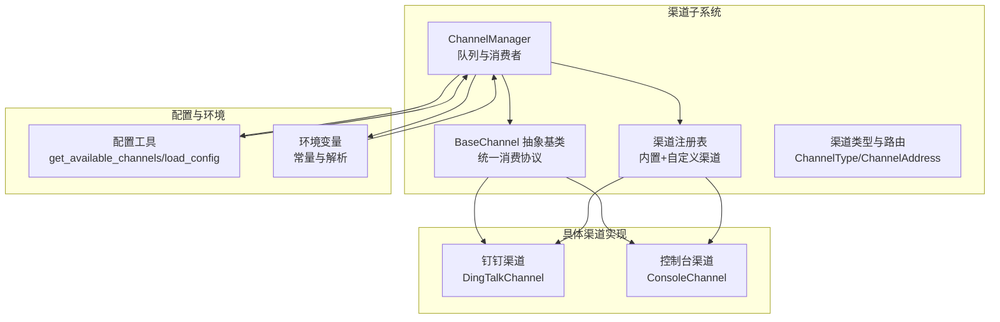
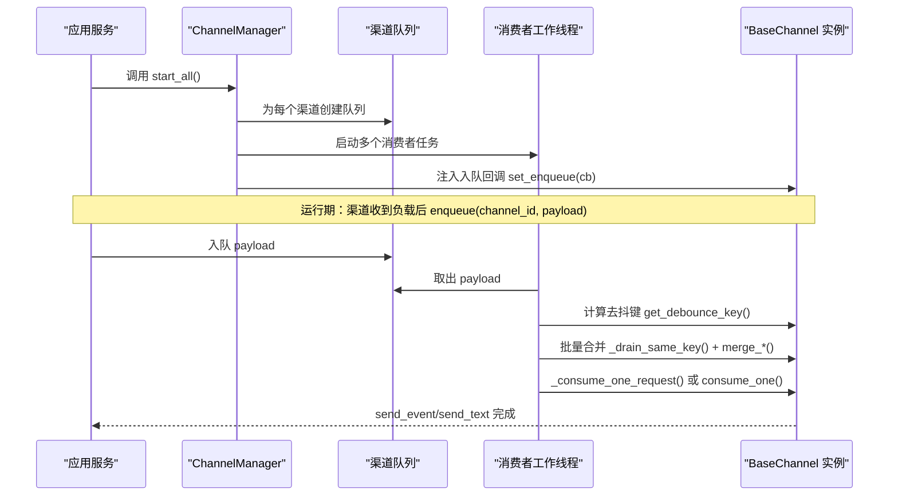
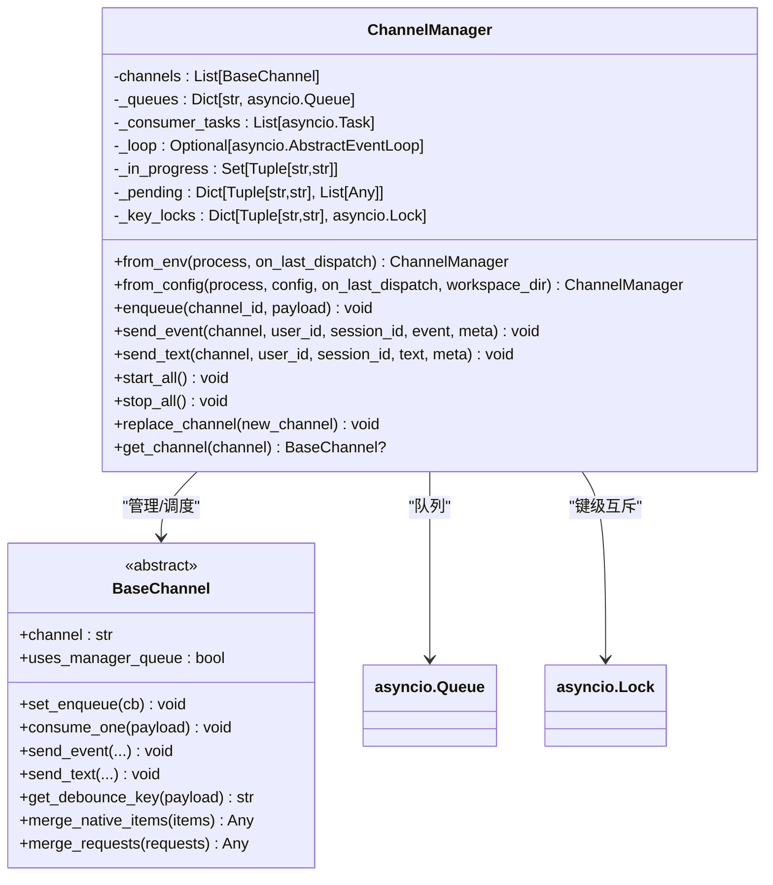
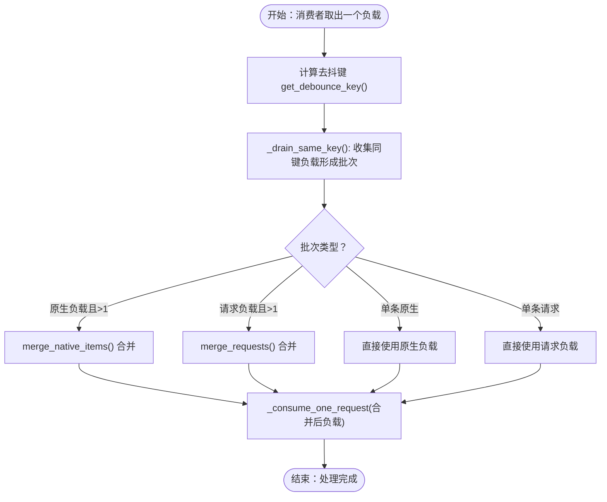
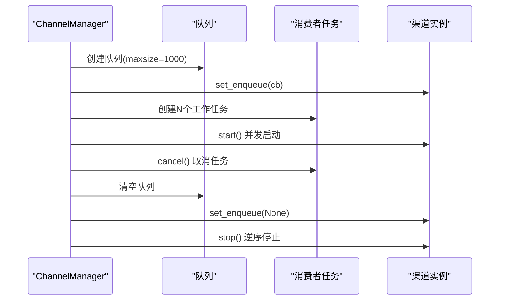
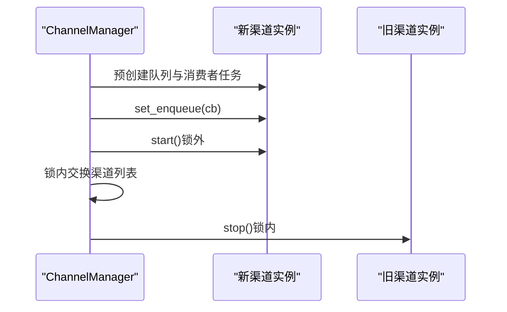
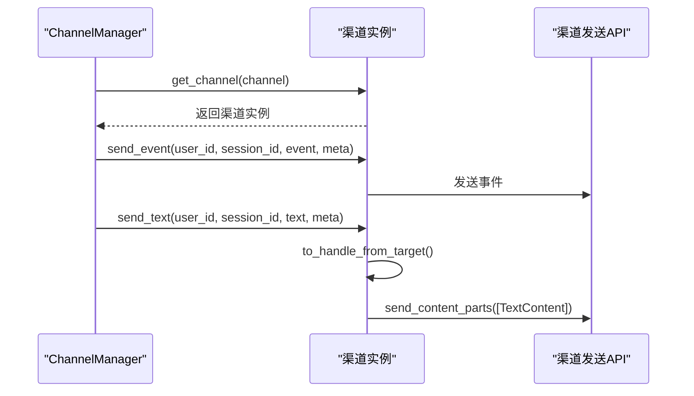
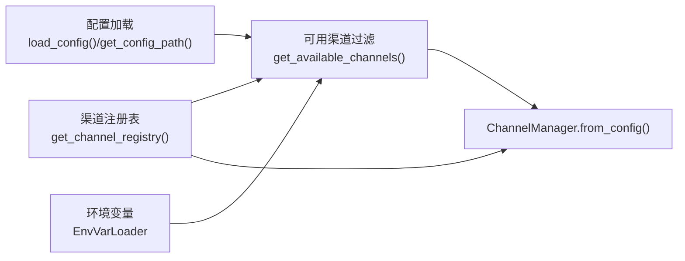
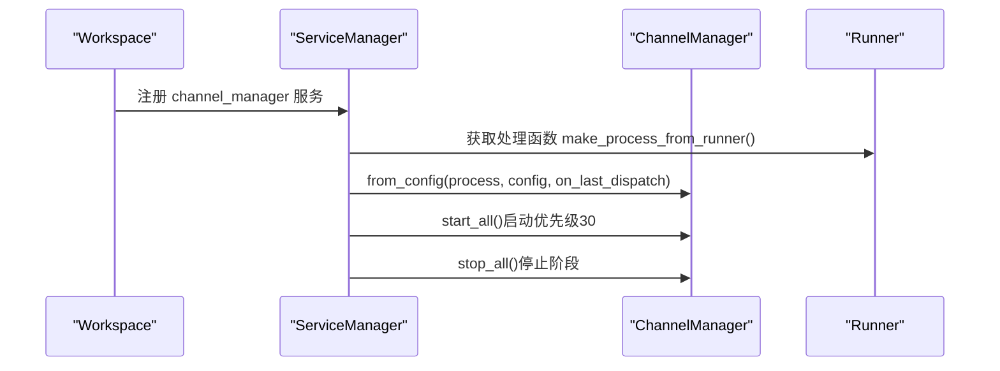
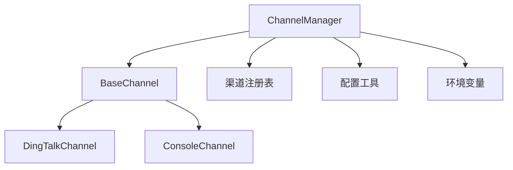

# 渠道管理器

<cite>
**本文档引用的文件**
- [manager.py](file://src/copaw/app/channels/manager.py)
- [base.py](file://src/copaw/app/channels/base.py)
- [registry.py](file://src/copaw/app/channels/registry.py)
- [schema.py](file://src/copaw/app/channels/schema.py)
- [utils.py](file://src/copaw/config/utils.py)
- [constant.py](file://src/copaw/constant.py)
- [channel.py](file://src/copaw/app/channels/dingtalk/channel.py)
- [channel.py](file://src/copaw/app/channels/console/channel.py)
- [workspace.py](file://src/copaw/app/workspace/workspace.py)
- [service_factories.py](file://src/copaw/app/workspace/service_factories.py)
</cite>

## 目录
1. [简介](#简介)
2. [项目结构](#项目结构)
3. [核心组件](#核心组件)
4. [架构总览](#架构总览)
5. [详细组件分析](#详细组件分析)
6. [依赖分析](#依赖分析)
7. [性能考虑](#性能考虑)
8. [故障排除指南](#故障排除指南)
9. [结论](#结论)
10. [附录](#附录)

## 简介
本文件系统性地文档化 CoPaw 的渠道管理器（ChannelManager），重点覆盖以下方面：
- 渠道队列管理：队列容量控制、同会话去抖与批处理合并
- 消费者工作线程：多工作线程并行处理不同会话
- 会话去抖机制：基于时间窗口与内容去抖的合并策略
- 批量处理策略：原生负载与请求负载的合并逻辑
- 渠道生命周期管理：启动（start_all）、停止（stop_all）
- 动态替换机制：运行时替换指定渠道实例
- 事件发送接口：send_event、send_text 的统一调用路径
- 队列容量控制、并发处理策略与错误恢复机制
- 渠道注册表集成、配置加载与环境变量处理
- 初始化流程、性能优化与故障排除指南

## 项目结构
ChannelManager 位于应用层渠道子系统中，负责统一管理各渠道的输入队列与消费循环，并通过渠道注册表与配置系统完成渠道实例的创建与生命周期管理。

**图表来源**
- [manager.py:114-134](file://src/copaw/app/channels/manager.py#L114-L134)
- [base.py:69-125](file://src/copaw/app/channels/base.py#L69-L125)
- [registry.py:19-36](file://src/copaw/app/channels/registry.py#L19-L36)
- [schema.py:12-48](file://src/copaw/app/channels/schema.py#L12-L48)
- [utils.py:333-358](file://src/copaw/config/utils.py#L333-L358)
- [constant.py:72-143](file://src/copaw/constant.py#L72-L143)

**章节来源**
- [manager.py:114-134](file://src/copaw/app/channels/manager.py#L114-L134)
- [base.py:69-125](file://src/copaw/app/channels/base.py#L69-L125)
- [registry.py:19-36](file://src/copaw/app/channels/registry.py#L19-L36)
- [schema.py:12-48](file://src/copaw/app/channels/schema.py#L12-L48)
- [utils.py:333-358](file://src/copaw/config/utils.py#L333-L358)
- [constant.py:72-143](file://src/copaw/constant.py#L72-L143)

## 核心组件
- ChannelManager：持有各渠道的队列与消费者任务，提供统一的入队、发送事件与文本接口；支持动态替换单个渠道实例。
- BaseChannel：所有渠道的抽象基类，定义统一的消费协议（consume_one/_consume_one_request）、消息渲染与发送、会话去抖等通用能力。
- 渠道注册表：集中管理内置与自定义渠道类，按可用性过滤后实例化。
- 配置与环境：从配置文件与环境变量加载渠道启用状态、参数与行为开关。

关键要点
- 队列与消费者：每个启用的渠道在管理器中拥有独立的异步队列与固定数量的工作线程。
- 去抖与批处理：同一会话内的负载在进入消费者前被去抖与批处理，避免重复与乱序。
- 发送接口：send_event/send_text 统一走渠道实例的发送路径，自动合并元数据与前缀。

**章节来源**
- [manager.py:114-134](file://src/copaw/app/channels/manager.py#L114-L134)
- [base.py:69-125](file://src/copaw/app/channels/base.py#L69-L125)
- [registry.py:132-136](file://src/copaw/app/channels/registry.py#L132-L136)
- [utils.py:333-358](file://src/copaw/config/utils.py#L333-L358)

## 架构总览
ChannelManager 作为框架级所有 BaseChannel 的拥有者，负责：
- 为每个渠道创建队列与消费者任务
- 将渠道实例注入入队回调，使渠道可直接向队列入队
- 提供 start_all/stop_all 生命周期管理
- 支持 replace_channel 运行时替换
- 对外暴露 send_event/send_text 接口

**图表来源**
- [manager.py:350-377](file://src/copaw/app/channels/manager.py#L350-L377)
- [manager.py:307-348](file://src/copaw/app/channels/manager.py#L307-L348)
- [base.py:443-479](file://src/copaw/app/channels/base.py#L443-L479)

**章节来源**
- [manager.py:350-377](file://src/copaw/app/channels/manager.py#L350-L377)
- [manager.py:307-348](file://src/copaw/app/channels/manager.py#L307-L348)
- [base.py:443-479](file://src/copaw/app/channels/base.py#L443-L479)

## 详细组件分析

### ChannelManager 类
职责与特性
- 队列管理：为每个使用管理队列的渠道创建 asyncio.Queue，容量上限固定。
- 消费者工作线程：每个渠道默认创建固定数量的工作线程，允许不同会话并行处理。
- 去抖与批处理：同会话负载在进入消费者前被去抖与批处理，确保顺序与完整性。
- 生命周期管理：start_all 并发启动渠道与消费者；stop_all 取消消费者任务并安全停止渠道。
- 动态替换：replace_channel 在不中断其他渠道的前提下，替换指定名称的渠道实例。
- 事件发送：send_event/send_text 统一构建元数据并委托给对应渠道发送。

关键方法与流程
- start_all：创建队列、设置入队回调、启动消费者任务、逐个启动渠道。
- stop_all：清理去抖状态与待处理项、取消消费者任务、清空队列与回调、逆序停止渠道。
- replace_channel：预创建队列与消费者任务、在锁外启动新渠道、在锁内交换并停止旧渠道。
- enqueue/enqueue_one：线程安全入队，根据渠道实例决定是否直接入队或进入去抖挂起队列。
- send_event/send_text：解析目标句柄、合并元数据、调用渠道发送接口。

**图表来源**
- [manager.py:114-134](file://src/copaw/app/channels/manager.py#L114-L134)
- [base.py:69-125](file://src/copaw/app/channels/base.py#L69-L125)

**章节来源**
- [manager.py:114-134](file://src/copaw/app/channels/manager.py#L114-L134)
- [manager.py:249-305](file://src/copaw/app/channels/manager.py#L249-L305)
- [manager.py:350-410](file://src/copaw/app/channels/manager.py#L350-L410)
- [manager.py:419-483](file://src/copaw/app/channels/manager.py#L419-L483)
- [base.py:69-125](file://src/copaw/app/channels/base.py#L69-L125)

### 去抖与批处理算法
- 去抖键：基于渠道实例的 get_debounce_key，通常使用 session_id 或会话解析结果。
- 同键负载收集：消费者从队列取出首个负载后，使用 _drain_same_key 收集同键的所有负载，形成批次。
- 批次合并：
  - 原生负载：merge_native_items 合并 content_parts 与 meta 字段。
  - 请求负载：merge_requests 合并 AgentRequest 的 input 内容。
- 处理执行：_process_batch 根据负载类型选择 _consume_one_request 或 consume_one。

**图表来源**
- [manager.py:42-62](file://src/copaw/app/channels/manager.py#L42-L62)
- [manager.py:65-91](file://src/copaw/app/channels/manager.py#L65-L91)
- [base.py:145-206](file://src/copaw/app/channels/base.py#L145-L206)

**章节来源**
- [manager.py:42-91](file://src/copaw/app/channels/manager.py#L42-L91)
- [base.py:145-206](file://src/copaw/app/channels/base.py#L145-L206)

### 生命周期管理（start_all、stop_all）
- start_all：
  - 为每个渠道创建队列并设置入队回调。
  - 为每个渠道创建多个消费者任务。
  - 依次启动渠道实例。
- stop_all：
  - 清理去抖状态与挂起队列。
  - 取消所有消费者任务并等待超时。
  - 清空队列与回调。
  - 逆序停止渠道实例，保证资源有序释放。

**图表来源**
- [manager.py:350-410](file://src/copaw/app/channels/manager.py#L350-L410)

**章节来源**
- [manager.py:350-410](file://src/copaw/app/channels/manager.py#L350-L410)

### 动态替换机制（replace_channel）
- 预准备：若新渠道未创建队列，则为其创建队列与消费者任务。
- 预启动：在锁外启动新渠道实例，避免阻塞锁。
- 交换与停止：在锁内交换渠道列表中的实例，并停止旧渠道。

**图表来源**
- [manager.py:419-483](file://src/copaw/app/channels/manager.py#L419-L483)

**章节来源**
- [manager.py:419-483](file://src/copaw/app/channels/manager.py#L419-L483)

### 事件发送接口（send_event、send_text）
- send_event：解析渠道实例，合并用户与会话标识到 meta，调用渠道 send_event。
- send_text：解析目标句柄（to_handle_from_target），合并 bot_prefix 与会话标识，将纯文本封装为内容片段后发送。

**图表来源**
- [manager.py:484-564](file://src/copaw/app/channels/manager.py#L484-L564)
- [base.py:648-705](file://src/copaw/app/channels/base.py#L648-L705)

**章节来源**
- [manager.py:484-564](file://src/copaw/app/channels/manager.py#L484-L564)
- [base.py:648-705](file://src/copaw/app/channels/base.py#L648-L705)

### 渠道注册表集成、配置加载与环境变量处理
- 渠道注册表：内置渠道与自定义渠道统一注册，支持缓存与失败降级。
- 配置加载：从配置文件加载渠道配置，结合可用渠道白/黑名单环境变量进行过滤。
- 环境变量：工作目录、密钥目录、作业文件、心跳文件、容器运行标记、CORS、重试与退避等。

**图表来源**
- [registry.py:132-136](file://src/copaw/app/channels/registry.py#L132-L136)
- [utils.py:333-358](file://src/copaw/config/utils.py#L333-L358)
- [utils.py:423-460](file://src/copaw/config/utils.py#L423-L460)
- [constant.py:72-143](file://src/copaw/constant.py#L72-L143)

**章节来源**
- [registry.py:132-136](file://src/copaw/app/channels/registry.py#L132-L136)
- [utils.py:333-358](file://src/copaw/config/utils.py#L333-L358)
- [utils.py:423-460](file://src/copaw/config/utils.py#L423-L460)
- [constant.py:72-143](file://src/copaw/constant.py#L72-L143)

### 初始化流程
- 工作区服务工厂创建 ChannelManager：从运行器获取统一处理函数，从配置加载渠道配置，注入 on_last_dispatch 回调。
- 服务管理器以固定优先级注册 ChannelManager，并在启动阶段调用 start_all，在停止阶段调用 stop_all。

**图表来源**
- [service_factories.py:80-100](file://src/copaw/app/workspace/service_factories.py#L80-L100)
- [workspace.py:217-228](file://src/copaw/app/workspace/workspace.py#L217-L228)

**章节来源**
- [service_factories.py:80-100](file://src/copaw/app/workspace/service_factories.py#L80-L100)
- [workspace.py:217-228](file://src/copaw/app/workspace/workspace.py#L217-L228)

## 依赖分析
- ChannelManager 依赖 BaseChannel 的统一消费协议，以及渠道注册表提供的渠道类。
- 渠道类（如 DingTalkChannel、ConsoleChannel）继承 BaseChannel，实现各自的解析与发送逻辑。
- 配置与环境模块为 ChannelManager 提供可用渠道列表与渠道实例化参数。

**图表来源**
- [manager.py:23-28](file://src/copaw/app/channels/manager.py#L23-L28)
- [base.py:69-125](file://src/copaw/app/channels/base.py#L69-L125)
- [registry.py:19-36](file://src/copaw/app/channels/registry.py#L19-L36)
- [utils.py:333-358](file://src/copaw/config/utils.py#L333-L358)
- [constant.py:72-143](file://src/copaw/constant.py#L72-L143)

**章节来源**
- [manager.py:23-28](file://src/copaw/app/channels/manager.py#L23-L28)
- [base.py:69-125](file://src/copaw/app/channels/base.py#L69-L125)
- [registry.py:19-36](file://src/copaw/app/channels/registry.py#L19-L36)
- [utils.py:333-358](file://src/copaw/config/utils.py#L333-L358)
- [constant.py:72-143](file://src/copaw/constant.py#L72-L143)

## 性能考虑
- 队列容量：每个渠道队列最大长度固定，避免内存无限增长；建议根据渠道吞吐量与下游 API 速率调整。
- 并发策略：每渠道固定数量的工作线程，允许不同会话并行处理，减少长尾延迟。
- 去抖与批处理：减少重复与乱序，降低下游 API 调用次数与消息碎片化。
- 错误恢复：消费者循环捕获异常并记录日志，不影响其他会话处理；stop_all 提供超时取消与有序停止。
- 通道替换：replace_channel 在锁内仅交换与停止旧实例，避免长时间阻塞。

优化建议
- 监控队列积压与消费者任务状态，必要时增加工作线程数或调整队列容量。
- 针对高延迟渠道（如钉钉流式回调）合理设置去抖时间与批处理阈值。
- 使用 on_last_dispatch 回调持久化最近一次“用户发送+机器人回复”的目标，便于后续主动推送。

[本节为通用指导，无需特定文件来源]

## 故障排除指南
常见问题与定位
- 渠道未启动：检查可用渠道过滤（COPAW_ENABLED_CHANNELS/COPAW_DISABLED_CHANNELS）与渠道类加载失败日志。
- 队列满导致丢弃：观察队列容量与入队速率，适当扩容或优化下游处理。
- 会话乱序或重复：确认去抖键生成逻辑与批处理合并是否正确，检查 _drain_same_key 与 merge_* 的行为。
- 动态替换失败：关注 replace_channel 的锁内交换与旧实例停止日志，确保新实例已成功 start。
- 发送失败：检查 send_event/send_text 的目标句柄解析与 meta 合并，查看渠道发送 API 的错误返回。

排查步骤
- 查看 ChannelManager 日志：消费者异常、队列状态、去抖与批处理统计。
- 核对渠道注册表与可用渠道列表：确认渠道类存在且可加载。
- 检查配置与环境变量：确认渠道启用状态与参数正确。
- 观察生命周期：start_all/stop_all 是否正常执行，消费者任务是否被取消与回收。

**章节来源**
- [manager.py:343-348](file://src/copaw/app/channels/manager.py#L343-L348)
- [manager.py:379-410](file://src/copaw/app/channels/manager.py#L379-L410)
- [utils.py:333-358](file://src/copaw/config/utils.py#L333-L358)
- [registry.py:42-75](file://src/copaw/app/channels/registry.py#L42-L75)

## 结论
ChannelManager 通过统一的队列与消费者模型，为多种渠道提供了稳定、可扩展的消息处理框架。其去抖与批处理机制有效提升了消息处理的顺序性与效率，动态替换能力满足了运行时运维需求。结合渠道注册表、配置与环境变量体系，ChannelManager 能够灵活适配不同部署场景与业务需求。

[本节为总结，无需特定文件来源]

## 附录

### 关键配置与环境变量
- 可用渠道过滤：COPAW_ENABLED_CHANNELS（白名单）、COPAW_DISABLED_CHANNELS（黑名单）
- 工作目录与密钥目录：COPAW_WORKING_DIR、COPAW_SECRET_DIR
- 文件路径：COPAW_JOBS_FILE、COPAW_CHATS_FILE、COPAW_TOKEN_USAGE_FILE、COPAW_CONFIG_FILE、COPAW_HEARTBEAT_FILE
- 运行环境：COPAW_RUNNING_IN_CONTAINER、COPAW_OPENAPI_DOCS
- CORS：COPAW_CORS_ORIGINS
- LLM 重试与退避：COPAW_LLM_MAX_RETRIES、COPAW_LLM_BACKOFF_BASE、COPAW_LLM_BACKOFF_CAP
- 工具守卫超时：COPAW_TOOL_GUARD_APPROVAL_TIMEOUT_SECONDS

**章节来源**
- [utils.py:333-358](file://src/copaw/config/utils.py#L333-L358)
- [constant.py:72-201](file://src/copaw/constant.py#L72-L201)