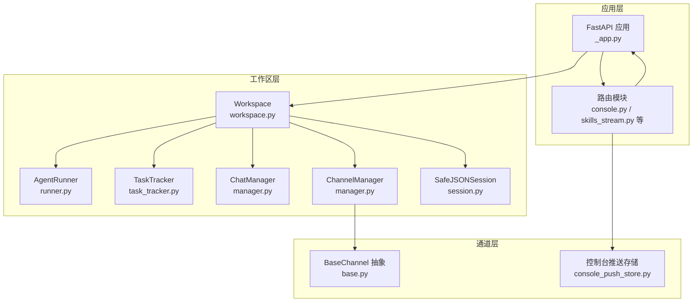
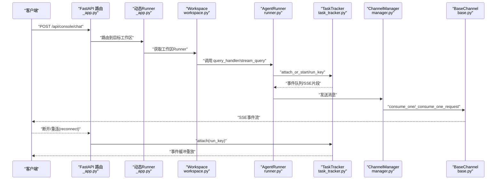
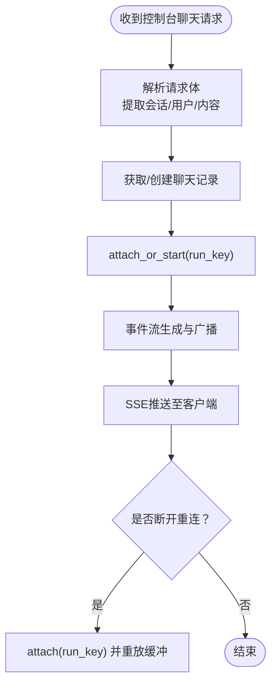
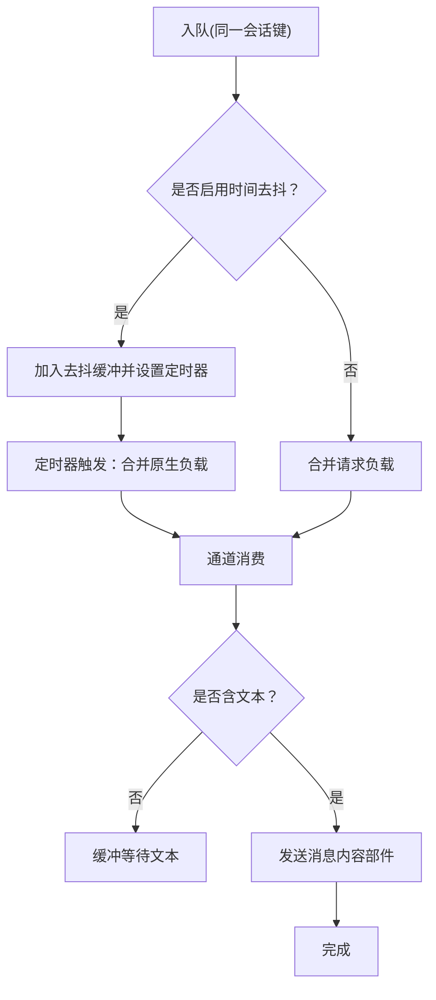
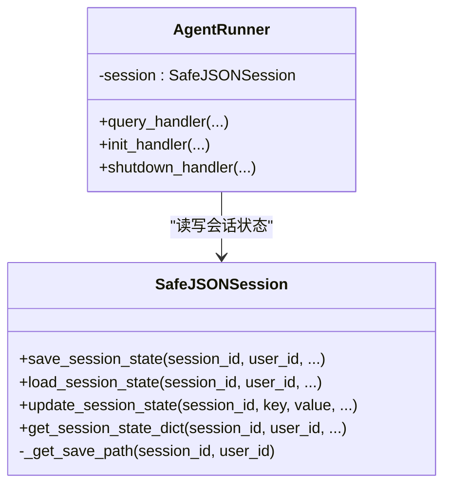
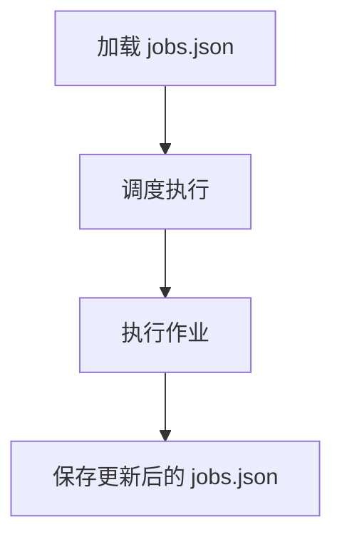
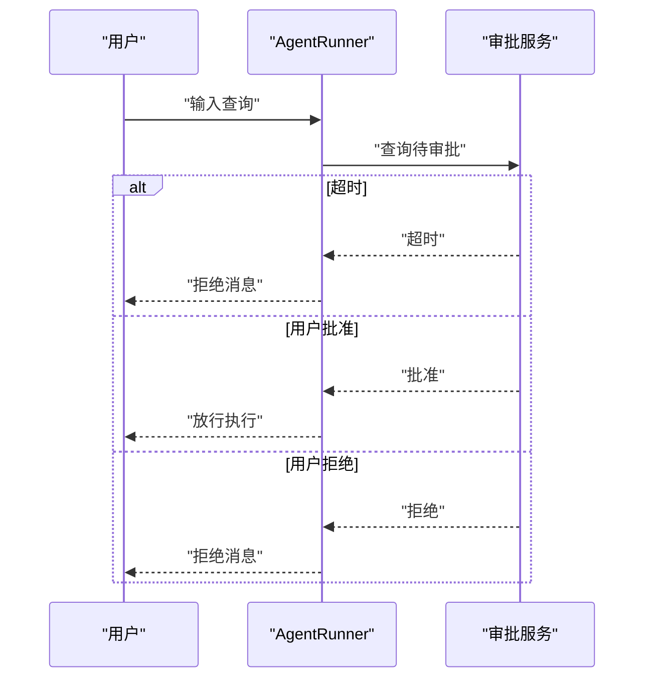
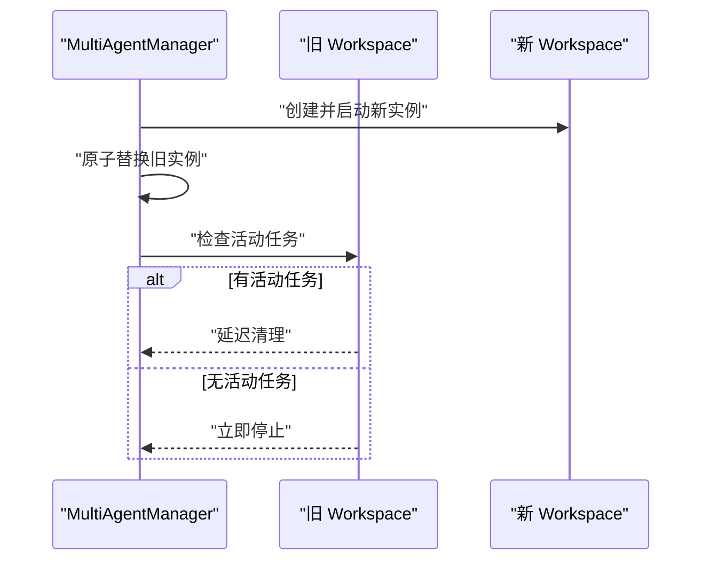
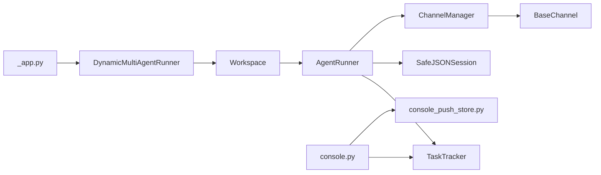

# 数据流设计

<cite>
**本文档引用的文件**
- [_app.py](file://src/copaw/app/_app.py)
- [console.py](file://src/copaw/app/routers/console.py)
- [console_push_store.py](file://src/copaw/app/console_push_store.py)
- [session.py](file://src/copaw/app/runner/session.py)
- [manager.py](file://src/copaw/app/channels/manager.py)
- [base.py](file://src/copaw/app/channels/base.py)
- [task_tracker.py](file://src/copaw/app/runner/task_tracker.py)
- [workspace.py](file://src/copaw/app/workspace/workspace.py)
- [runner.py](file://src/copaw/app/runner/runner.py)
- [models.py](file://src/copaw/app/runner/models.py)
- [json_repo.py](file://src/copaw/app/crons/repo/json_repo.py)
- [skills_stream.py](file://src/copaw/app/routers/skills_stream.py)
- [multi_agent_manager.py](file://src/copaw/app/multi_agent_manager.py)
</cite>

## 目录
1. [引言](#引言)
2. [项目结构](#项目结构)
3. [核心组件](#核心组件)
4. [架构总览](#架构总览)
5. [详细组件分析](#详细组件分析)
6. [依赖分析](#依赖分析)
7. [性能考虑](#性能考虑)
8. [故障排查指南](#故障排查指南)
9. [结论](#结论)
10. [附录](#附录)

## 引言
本文件面向CoPaw数据流设计，聚焦系统内数据流向、消息传递机制与状态同步策略，解释请求-响应模式、WebSocket实时通信与事件驱动架构；文档化数据序列化、缓存策略与持久化机制；涵盖错误传播、异常处理与数据一致性保障，并通过数据流图与时序图展示关键业务流程。

## 项目结构
CoPaw采用多代理工作区（Workspace）架构，每个工作区封装独立的运行器（Runner）、通道管理器（ChannelManager）、内存管理器（MemoryManager）、MCP客户端管理器（MCPClientManager）与计划任务管理器（CronManager）。应用入口通过FastAPI注册路由，动态选择目标工作区并委派到对应Runner进行请求处理；控制台通过Server-Sent Events（SSE）实现流式响应与断点重连；通道层负责跨渠道的消息编解码与发送；会话状态以安全的JSON文件形式持久化；计划任务以单机JSON文件存储。

图表来源
- [_app.py:241-409](file://src/copaw/app/_app.py#L241-L409)
- [console.py:21-241](file://src/copaw/app/routers/console.py#L21-L241)
- [workspace.py:39-367](file://src/copaw/app/workspace/workspace.py#L39-L367)
- [runner.py:63-515](file://src/copaw/app/runner/runner.py#L63-L515)
- [task_tracker.py:31-222](file://src/copaw/app/runner/task_tracker.py#L31-L222)
- [manager.py:114-565](file://src/copaw/app/channels/manager.py#L114-L565)
- [base.py:69-800](file://src/copaw/app/channels/base.py#L69-L800)
- [session.py:37-237](file://src/copaw/app/runner/session.py#L37-L237)
- [console_push_store.py:14-83](file://src/copaw/app/console_push_store.py#L14-L83)

章节来源
- [_app.py:241-409](file://src/copaw/app/_app.py#L241-L409)
- [workspace.py:39-367](file://src/copaw/app/workspace/workspace.py#L39-L367)

## 核心组件
- 应用与路由
  - FastAPI应用负责中间件、静态资源、路由注册与生命周期管理；动态Runner根据请求头选择目标工作区；控制台路由提供SSE流式聊天、文件上传与推送消息接口。
- 多代理管理器（MultiAgentManager）
  - 按需加载与启动工作区，支持零停机热重载，确保旧实例在任务完成后优雅停止。
- 工作区（Workspace）
  - 统一的服务注册与启动顺序，包含Runner、MemoryManager、MCPClientManager、ChatManager、ChannelManager、CronManager等。
- 运行器（AgentRunner）
  - 负责请求解析、命令路径分流、工具审批、会话状态读写与最终消息流生成。
- 任务追踪器（TaskTracker）
  - 基于run_key维护后台任务队列、事件缓冲与断点重连能力。
- 通道管理器（ChannelManager）与通道基类（BaseChannel）
  - 统一入队、去抖合并、批量处理与发送；支持时间去抖、文本去抖与媒体回退。
- 会话（SafeJSONSession）
  - 跨平台文件名安全的JSON会话持久化，异步读写避免阻塞。
- 控制台推送存储（console_push_store）
  - 内存限流的最近消息存储，支持按会话取走与全局清理。

章节来源
- [_app.py:48-145](file://src/copaw/app/_app.py#L48-L145)
- [multi_agent_manager.py:17-451](file://src/copaw/app/multi_agent_manager.py#L17-L451)
- [workspace.py:134-367](file://src/copaw/app/workspace/workspace.py#L134-L367)
- [runner.py:63-515](file://src/copaw/app/runner/runner.py#L63-L515)
- [task_tracker.py:31-222](file://src/copaw/app/runner/task_tracker.py#L31-L222)
- [manager.py:114-565](file://src/copaw/app/channels/manager.py#L114-L565)
- [base.py:69-800](file://src/copaw/app/channels/base.py#L69-L800)
- [session.py:37-237](file://src/copaw/app/runner/session.py#L37-L237)
- [console_push_store.py:14-83](file://src/copaw/app/console_push_store.py#L14-L83)

## 架构总览
CoPaw采用“请求-处理-事件驱动-多通道分发”的数据流架构。请求经由FastAPI进入，动态路由到目标工作区，交由AgentRunner进行命令/对话分流与工具审批；Runner通过ChannelManager将消息转换为各渠道可识别的格式并发送；SSE用于控制台流式响应与断点重连；会话状态以JSON文件持久化；计划任务以JSON文件存储。

图表来源
- [_app.py:95-125](file://src/copaw/app/_app.py#L95-L125)
- [console.py:75-145](file://src/copaw/app/routers/console.py#L75-L145)
- [runner.py:175-378](file://src/copaw/app/runner/runner.py#L175-L378)
- [task_tracker.py:124-207](file://src/copaw/app/runner/task_tracker.py#L124-L207)
- [manager.py:307-378](file://src/copaw/app/channels/manager.py#L307-L378)
- [base.py:443-583](file://src/copaw/app/channels/base.py#L443-L583)

## 详细组件分析

### 控制台SSE聊天与断点重连
- 请求-响应模式
  - 控制台路由接收AgentRequest或原生负载，提取会话与用户标识，解析内容部件，创建或获取聊天记录，交由任务追踪器启动或附加到现有运行。
- 流式输出
  - 任务追踪器聚合来自Runner的事件，写入队列并广播给所有订阅者；前端通过SSE消费事件，支持断线重连与缓冲重放。
- 文件上传与推送
  - 支持文件上传至通道媒体目录，提供下载；控制台推送存储提供最近消息查询与按会话取走。

图表来源
- [console.py:75-145](file://src/copaw/app/routers/console.py#L75-L145)
- [task_tracker.py:124-207](file://src/copaw/app/runner/task_tracker.py#L124-L207)

章节来源
- [console.py:68-241](file://src/copaw/app/routers/console.py#L68-L241)
- [console_push_store.py:22-83](file://src/copaw/app/console_push_store.py#L22-L83)
- [task_tracker.py:31-222](file://src/copaw/app/runner/task_tracker.py#L31-L222)

### 通道层消息编解码与去抖合并
- 去抖策略
  - 时间去抖：对同一会话键在设定窗口内的原生负载进行合并，避免重复与乱序。
  - 文本去抖：对不含文本的内容部件进行缓冲，待出现文本后再一次性发送，避免空消息。
- 批量处理
  - 同一会话队列批量拉取后合并请求或原生负载，再调用通道消费逻辑。
- 发送策略
  - 将消息渲染为内容部件（文本/图片/视频/音频/文件/拒绝），默认将媒体作为文本回退链接发送，子类可覆盖真实附件发送。

图表来源
- [manager.py:42-112](file://src/copaw/app/channels/manager.py#L42-L112)
- [base.py:453-583](file://src/copaw/app/channels/base.py#L453-L583)

章节来源
- [manager.py:114-565](file://src/copaw/app/channels/manager.py#L114-L565)
- [base.py:69-800](file://src/copaw/app/channels/base.py#L69-L800)

### 会话状态持久化与一致性
- 安全文件名
  - 对会话ID与用户ID进行非法字符替换，确保跨平台兼容。
- 异步I/O
  - 使用异步文件读写避免阻塞事件循环；支持增量更新与完整状态读取。
- 一致性保障
  - Runner在处理前加载会话状态，结束后保存；若状态文件版本不匹配则跳过加载并在完成后保存新格式，避免损坏。

图表来源
- [session.py:37-237](file://src/copaw/app/runner/session.py#L37-L237)
- [runner.py:317-378](file://src/copaw/app/runner/runner.py#L317-L378)

章节来源
- [session.py:37-237](file://src/copaw/app/runner/session.py#L37-L237)
- [runner.py:317-378](file://src/copaw/app/runner/runner.py#L317-L378)

### 计划任务与持久化
- 存储模型
  - 作业文件包含版本号与作业列表，采用原子写入（临时文件+替换）保证一致性。
- 生命周期
  - CronManager负责加载、调度与执行；作业变更通过JSON仓库持久化。

图表来源
- [json_repo.py:29-47](file://src/copaw/app/crons/repo/json_repo.py#L29-L47)

章节来源
- [json_repo.py:12-47](file://src/copaw/app/crons/repo/json_repo.py#L12-L47)

### 工具审批与错误传播
- 审批流程
  - Runner检测会话是否存在待审批请求，若超时自动拒绝；用户输入“批准”则放行，否则拒绝并清理相关会话记忆。
- 错误传播
  - Runner捕获异常并写入调试转储文件，向客户端返回结构化错误；通道层在消费失败时回调错误处理函数。

图表来源
- [runner.py:97-174](file://src/copaw/app/runner/runner.py#L97-L174)

章节来源
- [runner.py:97-174](file://src/copaw/app/runner/runner.py#L97-L174)

### 多代理管理与零停机热重载
- 懒加载与并发启动
  - MultiAgentManager按需创建工作区，配置中定义的所有代理并发启动。
- 零停机重载
  - 新实例先启动并设置可复用组件，随后原子替换旧实例；若旧实例有活动任务，则延迟清理，确保请求不中断。

图表来源
- [multi_agent_manager.py:200-311](file://src/copaw/app/multi_agent_manager.py#L200-L311)

章节来源
- [multi_agent_manager.py:17-451](file://src/copaw/app/multi_agent_manager.py#L17-L451)
- [workspace.py:279-367](file://src/copaw/app/workspace/workspace.py#L279-L367)

## 依赖分析
- 组件耦合
  - FastAPI应用通过动态Runner与多代理管理器解耦具体工作区；工作区内部通过服务管理器统一注册与启动，降低组件间直接依赖。
  - Runner依赖会话、聊天管理、通道管理与MCP管理；通道层依赖统一的处理回调与渲染器。
- 关键依赖链
  - 控制台路由 → 任务追踪器 → Runner → 通道管理器 → 通道基类 → 渠道实现。
  - 工作区服务注册 → Runner初始化 → 会话状态读取 → Agent执行 → 会话状态保存。

图表来源
- [_app.py:48-145](file://src/copaw/app/_app.py#L48-L145)
- [workspace.py:134-278](file://src/copaw/app/workspace/workspace.py#L134-L278)
- [runner.py:63-120](file://src/copaw/app/runner/runner.py#L63-L120)
- [task_tracker.py:31-80](file://src/copaw/app/runner/task_tracker.py#L31-L80)
- [manager.py:114-170](file://src/copaw/app/channels/manager.py#L114-L170)
- [base.py:69-120](file://src/copaw/app/channels/base.py#L69-L120)
- [console.py:21-75](file://src/copaw/app/routers/console.py#L21-L75)
- [console_push_store.py:14-40](file://src/copaw/app/console_push_store.py#L14-L40)

章节来源
- [_app.py:48-145](file://src/copaw/app/_app.py#L48-L145)
- [workspace.py:134-278](file://src/copaw/app/workspace/workspace.py#L134-L278)

## 性能考虑
- 异步与并发
  - 通道管理器为每个通道启动多个消费者协程，允许不同会话并行处理；任务追踪器使用队列上限与死队列清理避免内存膨胀。
- I/O优化
  - 会话状态读写采用异步文件I/O；SSE广播仅保留存活订阅者，及时清理满队列的死订阅。
- 缓存与去抖
  - 控制台推送存储限制数量与年龄，前端去重与截断；通道层的时间与文本去抖减少无效消息与重复发送。
- 可扩展性
  - 多代理管理器支持并发启动与零停机重载，便于横向扩展与蓝绿部署。

## 故障排查指南
- 会话状态异常
  - 若状态文件版本不匹配，Runner会跳过加载并在完成后保存新格式；检查会话文件是否存在编码问题。
- 通道消费异常
  - 通道层在消费失败时回调错误处理函数，发送错误提示；检查渠道配置与凭证有效性。
- 任务追踪异常
  - 当任务被取消或发生内部错误时，追踪器会广播错误事件并清理队列；确认客户端是否正确处理错误事件。
- 推送消息缺失
  - 控制台推送存储按会话取走后会被清理，确认会话ID与查询参数；检查存储年龄阈值与最大条数限制。

章节来源
- [session.py:95-133](file://src/copaw/app/runner/session.py#L95-L133)
- [base.py:631-647](file://src/copaw/app/channels/base.py#L631-L647)
- [task_tracker.py:174-200](file://src/copaw/app/runner/task_tracker.py#L174-L200)
- [console_push_store.py:70-83](file://src/copaw/app/console_push_store.py#L70-L83)

## 结论
CoPaw通过事件驱动与多代理架构实现了高并发、可扩展且一致的数据流：请求经由动态路由进入工作区，Runner负责命令与对话分流、工具审批与状态持久化；通道层提供统一的去抖与合并策略；SSE保障控制台实时交互与断点重连；计划任务与会话状态分别采用JSON文件持久化与异步I/O，兼顾一致性与性能。整体设计在复杂场景下仍保持清晰的职责边界与良好的可观测性。

## 附录
- 数据模型要点
  - 聊天规格（ChatSpec）：包含唯一ID、会话ID、用户ID、渠道、创建/更新时间与元数据。
  - 聊天历史（ChatHistory）：消息列表与状态。
  - 作业文件（JobsFile）：版本号与作业列表，用于计划任务持久化。

章节来源
- [models.py:15-69](file://src/copaw/app/runner/models.py#L15-L69)