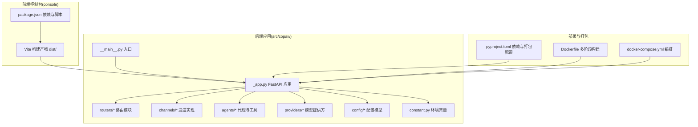
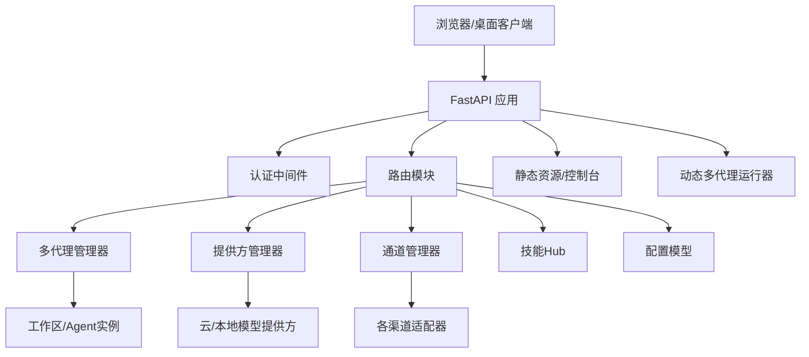
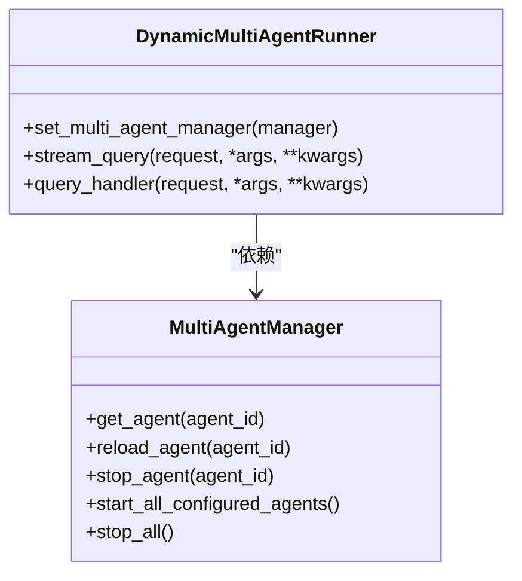
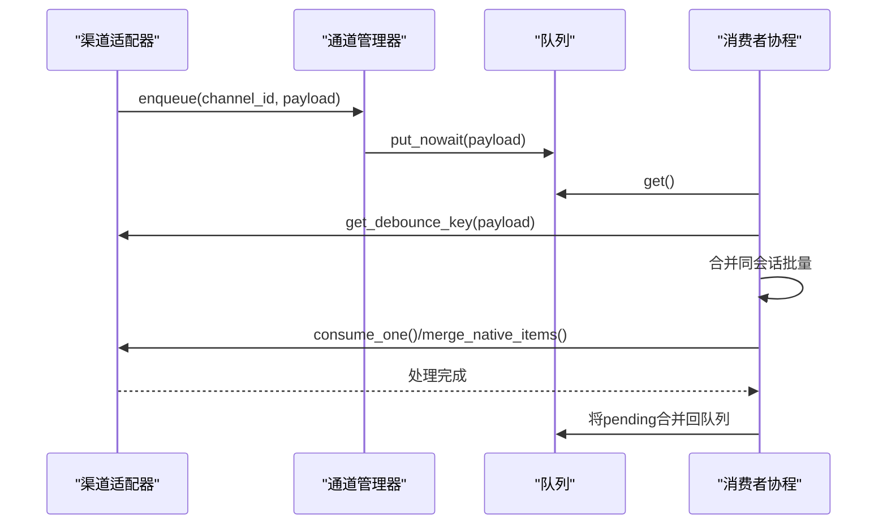
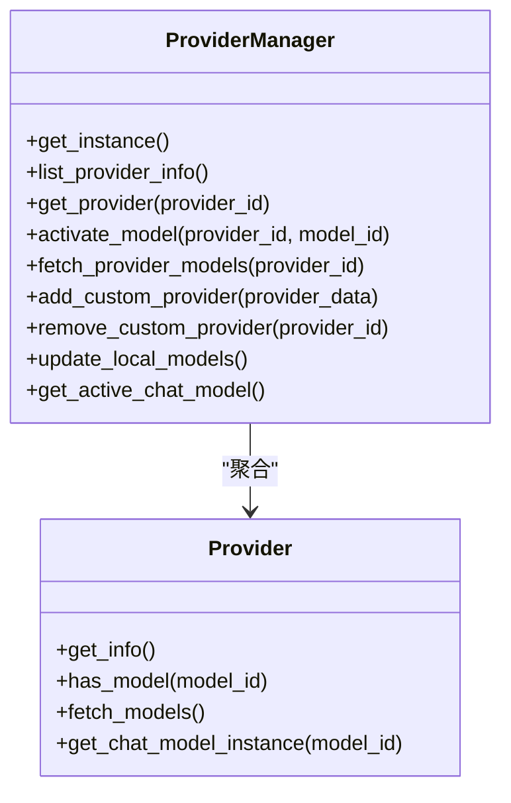
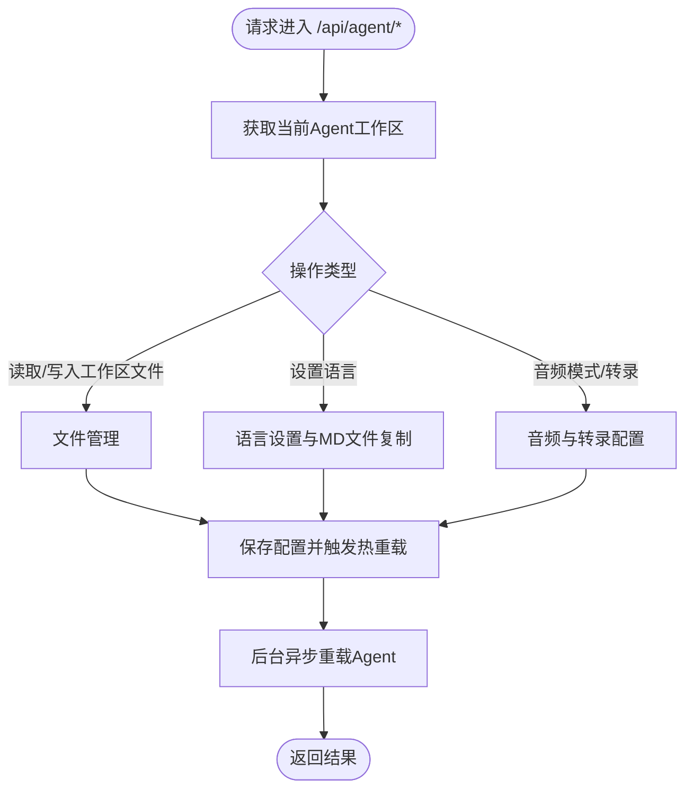
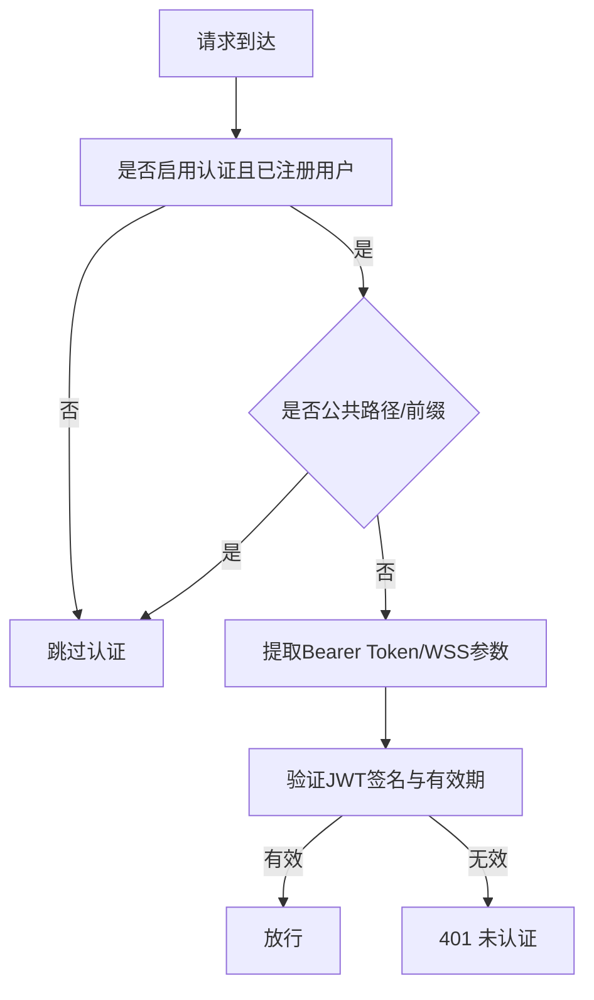
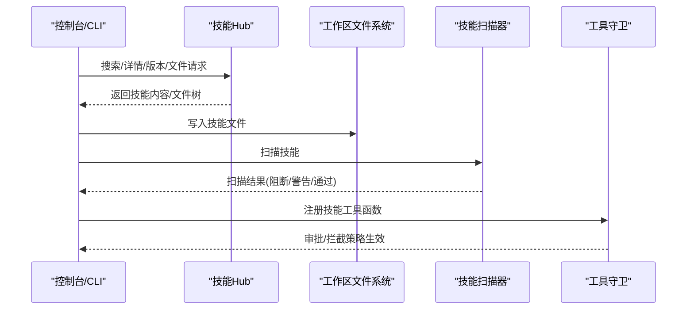
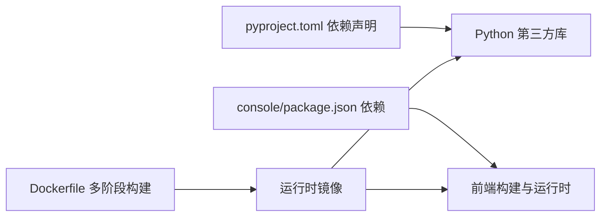

# 系统架构

<cite>
**本文档引用的文件**
- [README.md](file://README.md)
- [src/copaw/__main__.py](file://src/copaw/__main__.py)
- [src/copaw/__version__.py](file://src/copaw/__version__.py)
- [console/package.json](file://console/package.json)
- [pyproject.toml](file://pyproject.toml)
- [deploy/Dockerfile](file://deploy/Dockerfile)
- [docker-compose.yml](file://docker-compose.yml)
- [src/copaw/app/_app.py](file://src/copaw/app/_app.py)
- [src/copaw/cli/main.py](file://src/copaw/cli/main.py)
- [src/copaw/app/routers/agent.py](file://src/copaw/app/routers/agent.py)
- [src/copaw/app/channels/manager.py](file://src/copaw/app/channels/manager.py)
- [src/copaw/agents/skills_hub.py](file://src/copaw/agents/skills_hub.py)
- [src/copaw/providers/provider_manager.py](file://src/copaw/providers/provider_manager.py)
- [src/copaw/app/multi_agent_manager.py](file://src/copaw/app/multi_agent_manager.py)
- [src/copaw/app/auth.py](file://src/copaw/app/auth.py)
- [src/copaw/agents/react_agent.py](file://src/copaw/agents/react_agent.py)
- [src/copaw/config/config.py](file://src/copaw/config/config.py)
- [src/copaw/constant.py](file://src/copaw/constant.py)
</cite>

## 目录
1. [引言](#引言)
2. [项目结构](#项目结构)
3. [核心组件](#核心组件)
4. [架构总览](#架构总览)
5. [详细组件分析](#详细组件分析)
6. [依赖关系分析](#依赖关系分析)
7. [性能考量](#性能考量)
8. [故障排查指南](#故障排查指南)
9. [结论](#结论)
10. [附录](#附录)

## 引言
本系统架构文档面向CoPaw项目的开发者与运维人员，系统性阐述CoPaw的高层设计、架构模式与系统边界。CoPaw是一个可在本地或云端运行的个人AI助手，支持多渠道接入（如钉钉、飞书、QQ、Discord、iMessage等）、多代理工作区、技能生态与工具安全防护。本文重点覆盖：
- 前后端分离架构：前端控制台打包嵌入后端包内，通过FastAPI提供REST接口与静态资源服务
- 多代理架构：基于工作区的多Agent管理，支持零停机热重载
- 插件化设计：通道、技能、MCP客户端、本地模型后端均以插件形式扩展
- 安全性：认证中间件、工具守卫、技能扫描器
- 可观测性与可扩展性：日志、遥测、容器化与部署拓扑

## 项目结构
CoPaw采用“Python后端 + 前端控制台”的混合架构，后端使用FastAPI提供API与静态资源，前端控制台通过Vite构建并打包到后端包中，便于单体分发与部署。

**图表来源**
- [src/copaw/__main__.py:1-7](file://src/copaw/__main__.py#L1-L7)
- [src/copaw/app/_app.py:1-409](file://src/copaw/app/_app.py#L1-L409)
- [console/package.json:1-57](file://console/package.json#L1-L57)
- [pyproject.toml:1-99](file://pyproject.toml#L1-L99)
- [deploy/Dockerfile:1-103](file://deploy/Dockerfile#L1-L103)
- [docker-compose.yml:1-23](file://docker-compose.yml#L1-L23)

**章节来源**
- [README.md:97-178](file://README.md#L97-L178)
- [src/copaw/__main__.py:1-7](file://src/copaw/__main__.py#L1-L7)
- [src/copaw/app/_app.py:1-409](file://src/copaw/app/_app.py#L1-L409)
- [console/package.json:1-57](file://console/package.json#L1-L57)
- [pyproject.toml:1-99](file://pyproject.toml#L1-L99)
- [deploy/Dockerfile:1-103](file://deploy/Dockerfile#L1-L103)
- [docker-compose.yml:1-23](file://docker-compose.yml#L1-L23)

## 核心组件
- 应用入口与生命周期：通过命令行入口启动，初始化FastAPI应用、加载环境变量、注册中间件与路由，并在生命周期钩子中完成多代理管理器、模型提供方管理器等组件的启动与停止。
- 多代理管理器：按需懒加载工作区，支持零停机热重载，确保在旧实例任务完成后优雅停止，新实例无缝接管。
- 通道管理器：统一调度各渠道消息队列，支持同会话合并、并发消费者、线程安全入队与动态替换通道。
- 提供方管理器：内置多家云模型与本地模型提供方，支持动态激活与模型列表发现，持久化存储于秘密目录。
- 控制台路由：提供Agent工作区文件读写、语言设置、音频模式、转录提供方等管理接口。
- 认证中间件：基于环境变量启用/禁用认证，支持注册、登录与JWT令牌校验。
- 技能生态：支持从Hub导入技能、本地技能目录加载、技能扫描与工具守卫策略。

**章节来源**
- [src/copaw/app/_app.py:1-409](file://src/copaw/app/_app.py#L1-L409)
- [src/copaw/app/multi_agent_manager.py:1-451](file://src/copaw/app/multi_agent_manager.py#L1-L451)
- [src/copaw/app/channels/manager.py:1-565](file://src/copaw/app/channels/manager.py#L1-L565)
- [src/copaw/providers/provider_manager.py:1-717](file://src/copaw/providers/provider_manager.py#L1-L717)
- [src/copaw/app/routers/agent.py:1-524](file://src/copaw/app/routers/agent.py#L1-L524)
- [src/copaw/app/auth.py:1-368](file://src/copaw/app/auth.py#L1-L368)
- [src/copaw/agents/skills_hub.py:1-800](file://src/copaw/agents/skills_hub.py#L1-L800)

## 架构总览
CoPaw采用“前后端分离 + 后端即服务”的架构。前端控制台作为静态资源由后端统一托管；后端通过FastAPI提供REST API、SSE流式响应与语音通道端点；多代理管理器负责Agent生命周期与工作区隔离；通道管理器负责跨渠道消息编排；提供方管理器负责模型路由与能力发现。

**图表来源**
- [src/copaw/app/_app.py:241-409](file://src/copaw/app/_app.py#L241-L409)
- [src/copaw/app/multi_agent_manager.py:17-451](file://src/copaw/app/multi_agent_manager.py#L17-L451)
- [src/copaw/app/channels/manager.py:114-565](file://src/copaw/app/channels/manager.py#L114-L565)
- [src/copaw/providers/provider_manager.py:288-717](file://src/copaw/providers/provider_manager.py#L288-L717)
- [src/copaw/app/routers/agent.py:1-524](file://src/copaw/app/routers/agent.py#L1-L524)
- [src/copaw/agents/skills_hub.py:1-800](file://src/copaw/agents/skills_hub.py#L1-L800)

## 详细组件分析

### 动态多代理运行器与多代理管理器
动态多代理运行器根据请求头中的Agent标识动态选择对应工作区Runner，实现多Agent隔离与按需加载。多代理管理器负责Agent的懒加载、零停机热重载、后台清理任务与全局停止。

**图表来源**
- [src/copaw/app/_app.py:48-136](file://src/copaw/app/_app.py#L48-L136)
- [src/copaw/app/multi_agent_manager.py:17-451](file://src/copaw/app/multi_agent_manager.py#L17-L451)

**章节来源**
- [src/copaw/app/_app.py:48-136](file://src/copaw/app/_app.py#L48-L136)
- [src/copaw/app/multi_agent_manager.py:17-451](file://src/copaw/app/multi_agent_manager.py#L17-L451)

### 通道管理器与消息编排
通道管理器统一管理各渠道的消息队列与消费者，支持同会话去抖合并、并发处理与动态替换通道，保证跨渠道一致性与高吞吐。

**图表来源**
- [src/copaw/app/channels/manager.py:289-378](file://src/copaw/app/channels/manager.py#L289-L378)
- [src/copaw/app/channels/manager.py:307-350](file://src/copaw/app/channels/manager.py#L307-L350)

**章节来源**
- [src/copaw/app/channels/manager.py:114-565](file://src/copaw/app/channels/manager.py#L114-L565)

### 提供方管理器与模型路由
提供方管理器集中管理内置与自定义提供方，支持模型列表发现、本地模型自动更新、活动模型持久化与按需加载。

**图表来源**
- [src/copaw/providers/provider_manager.py:288-717](file://src/copaw/providers/provider_manager.py#L288-L717)

**章节来源**
- [src/copaw/providers/provider_manager.py:1-717](file://src/copaw/providers/provider_manager.py#L1-L717)

### 控制台路由与Agent工作区管理
控制台路由提供Agent工作区文件读写、语言设置、音频模式与转录提供方管理等接口，支持热重载配置。

**图表来源**
- [src/copaw/app/routers/agent.py:39-524](file://src/copaw/app/routers/agent.py#L39-L524)

**章节来源**
- [src/copaw/app/routers/agent.py:1-524](file://src/copaw/app/routers/agent.py#L1-L524)

### 认证中间件与安全策略
认证中间件支持基于环境变量的启用开关、注册/登录流程与JWT令牌校验，对受保护路径进行访问控制。

**图表来源**
- [src/copaw/app/auth.py:302-368](file://src/copaw/app/auth.py#L302-L368)

**章节来源**
- [src/copaw/app/auth.py:1-368](file://src/copaw/app/auth.py#L1-L368)

### 技能Hub与插件化扩展
技能Hub支持从外部Hub拉取技能包、解析元数据与文件树、执行安装与取消机制，配合技能扫描器与工具守卫形成安全闭环。

**图表来源**
- [src/copaw/agents/skills_hub.py:226-634](file://src/copaw/agents/skills_hub.py#L226-L634)

**章节来源**
- [src/copaw/agents/skills_hub.py:1-800](file://src/copaw/agents/skills_hub.py#L1-L800)

## 依赖关系分析
- 技术栈与依赖
  - 后端：FastAPI、Uvicorn、AgentScope Runtime、APScheduler、Playwright、Twilio、MQTT、Matrix等
  - 前端：React、Ant Design、Vite、TypeScript
  - 包管理：setuptools、wheel、pyproject.toml
- 第三方依赖与版本兼容性
  - Python版本范围：>=3.10,<3.14
  - 关键库：agentscope==1.0.17、agentscope-runtime==1.1.1、httpx>=0.27.0、discord-py>=2.3、python-telegram-bot>=20.0、twilio>=9.10.2、paho-mqtt>=2.0.0、google-genai>=1.67.0、pyyaml>=6.0
  - 可选依赖：llamacpp、mlx、ollama、whisper等
- 运行时与容器化
  - Docker镜像包含Node、Python、Chromium与Supervisor，支持容器内无沙箱模式与Playwright系统浏览器
  - docker-compose提供一键启动与数据卷挂载

**图表来源**
- [pyproject.toml:1-99](file://pyproject.toml#L1-L99)
- [console/package.json:1-57](file://console/package.json#L1-L57)
- [deploy/Dockerfile:1-103](file://deploy/Dockerfile#L1-L103)

**章节来源**
- [pyproject.toml:1-99](file://pyproject.toml#L1-L99)
- [console/package.json:1-57](file://console/package.json#L1-L57)
- [deploy/Dockerfile:1-103](file://deploy/Dockerfile#L1-L103)
- [docker-compose.yml:1-23](file://docker-compose.yml#L1-L23)

## 性能考量
- 多代理零停机热重载：通过原子替换与延迟清理避免请求中断，最大化可用性
- 通道并发与去抖：每通道多消费者并发处理，同会话合并减少重复处理
- 模型提供方缓存与发现：内置提供方信息持久化，本地模型列表动态更新
- 前端静态资源内嵌：减少网络往返，提升控制台首开体验
- 日志与遥测：统一日志级别与可选遥测上报，便于问题定位与容量规划

## 故障排查指南
- 启动失败
  - 检查工作目录与秘密目录权限与存在性
  - 查看应用启动日志与生命周期钩子输出
- 代理无法热重载
  - 确认Agent配置变更已保存并触发后台重载任务
  - 观察旧实例是否有活跃任务导致延迟清理
- 渠道消息堆积
  - 检查通道队列大小与消费者数量
  - 核对同会话去抖键与合并逻辑
- 认证异常
  - 确认认证开关与注册状态
  - 检查JWT签名与过期时间
- 模型不可用
  - 使用提供方检查超时与URL配置
  - 对比本地模型后端与已下载模型列表

**章节来源**
- [src/copaw/app/_app.py:148-239](file://src/copaw/app/_app.py#L148-L239)
- [src/copaw/app/multi_agent_manager.py:83-179](file://src/copaw/app/multi_agent_manager.py#L83-L179)
- [src/copaw/app/channels/manager.py:379-411](file://src/copaw/app/channels/manager.py#L379-L411)
- [src/copaw/app/auth.py:191-271](file://src/copaw/app/auth.py#L191-L271)
- [src/copaw/providers/provider_manager.py:670-690](file://src/copaw/providers/provider_manager.py#L670-L690)

## 结论
CoPaw通过前后端一体化打包、多代理隔离与零停机热重载、插件化的通道与技能体系、以及完善的认证与安全策略，构建了可扩展、可观测、易部署的个人AI助手平台。其容器化与多平台支持进一步降低了运维门槛，适合在本地或云端按需扩展。

## 附录
- 系统上下文图与组件分解图已在前述章节中给出
- 技术栈与依赖详见“依赖关系分析”
- 部署拓扑与基础设施要求详见“依赖关系分析”与“项目结构”