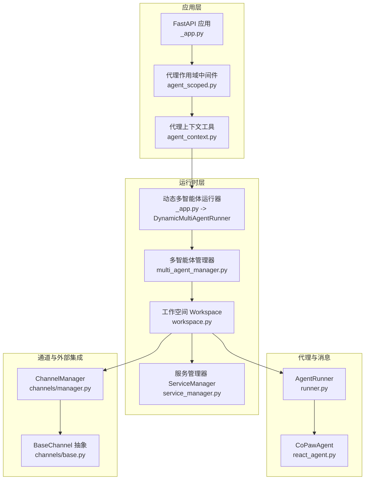
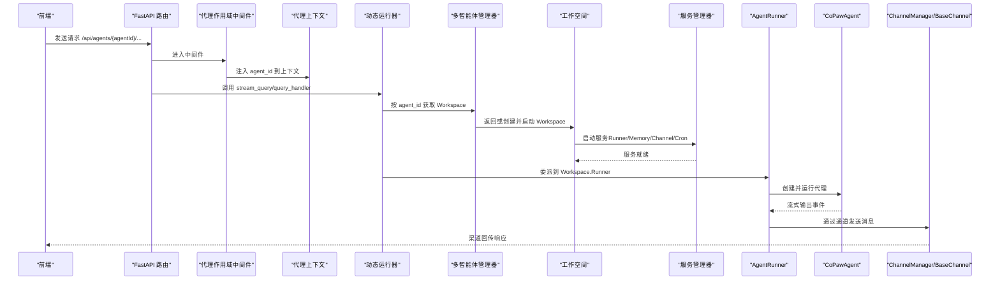
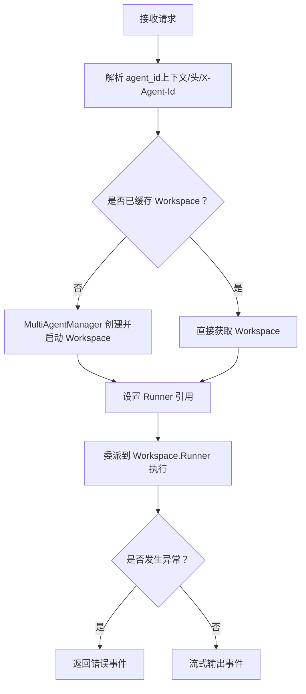
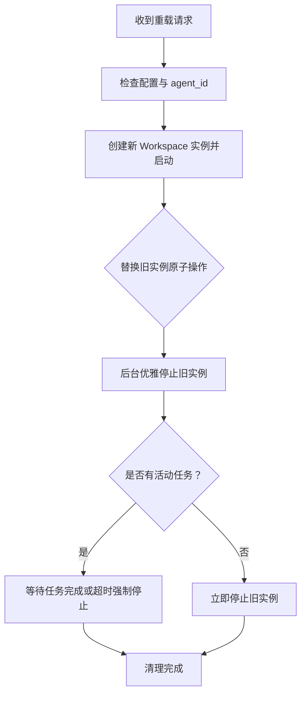
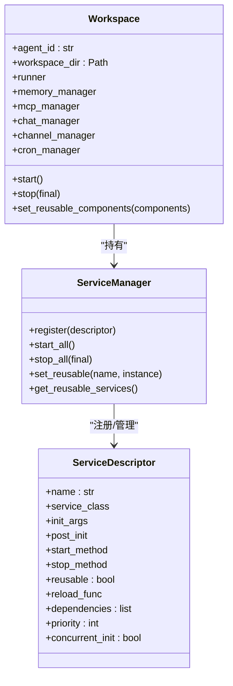
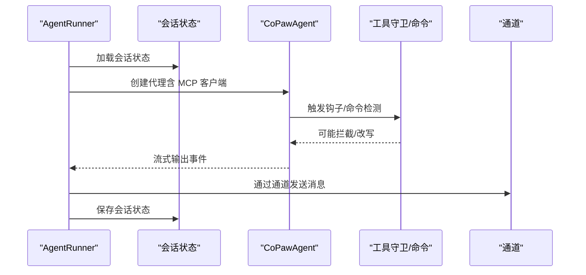
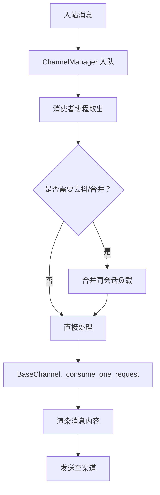
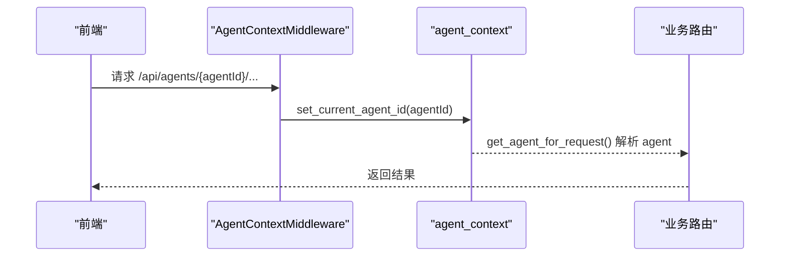
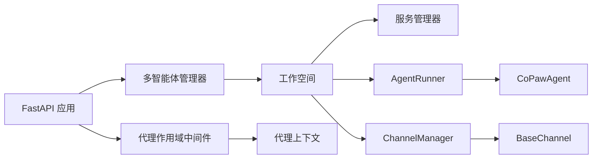
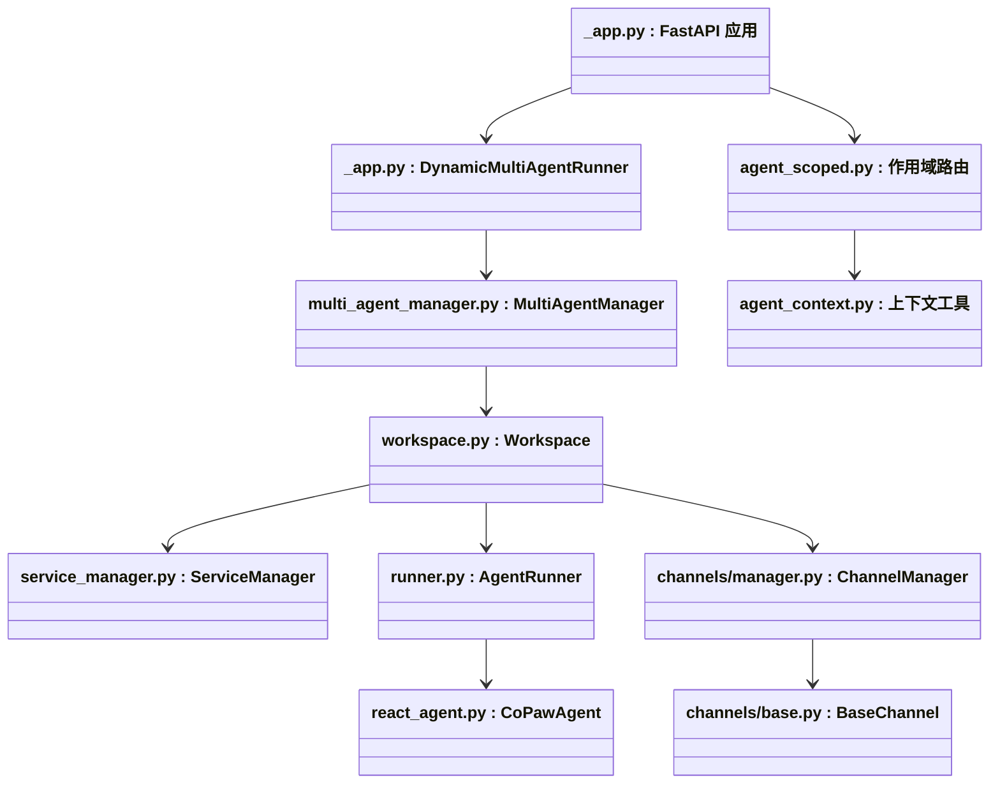

# 组件交互模式

<cite>
**本文引用的文件**
- [应用入口与生命周期管理 _app.py](file://src/copaw/app/_app.py)
- [多智能体管理器 multi_agent_manager.py](file://src/copaw/app/multi_agent_manager.py)
- [工作空间服务管理 service_manager.py](file://src/copaw/app/workspace/service_manager.py)
- [工作空间 Workspace](file://src/copaw/app/workspace/workspace.py)
- [通道管理器 ChannelManager](file://src/copaw/app/channels/manager.py)
- [通道基类 BaseChannel](file://src/copaw/app/channels/base.py)
- [代理运行器 AgentRunner](file://src/copaw/app/runner/runner.py)
- [代理上下文 agent_context.py](file://src/copaw/app/agent_context.py)
- [代理作用域路由 agent_scoped.py](file://src/copaw/app/routers/agent_scoped.py)
- [代理文件管理路由 agent.py](file://src/copaw/app/routers/agent.py)
- [CoPawAgent 主代理实现 react_agent.py](file://src/copaw/agents/react_agent.py)
- [引导钩子 bootstrap.py](file://src/copaw/agents/hooks/bootstrap.py)
- [日志工具 logging.py](file://src/copaw/utils/logging.py)
- [遥测 telemetry.py](file://src/copaw/utils/telemetry.py)
</cite>

## 目录
1. [引言](#引言)
2. [项目结构](#项目结构)
3. [核心组件](#核心组件)
4. [架构总览](#架构总览)
5. [详细组件分析](#详细组件分析)
6. [依赖分析](#依赖分析)
7. [性能考虑](#性能考虑)
8. [故障排查指南](#故障排查指南)
9. [结论](#结论)
10. [附录：组件交互图与通信协议示例](#附录组件交互图与通信协议示例)

## 引言
本文件系统性梳理 CoPaw 的组件交互模式，聚焦以下目标：
- 明确组件间通信协议、消息传递与事件处理机制
- 解释组件解耦策略、依赖注入与接口抽象设计
- 文档化组件生命周期、状态同步与错误传播机制
- 提供组件监控、性能追踪与故障恢复策略
- 给出组件交互图与通信协议示例，便于开发者快速理解与扩展

## 项目结构
CoPaw 采用“多工作空间 + 多智能体”的架构，通过统一的动态运行器在请求级路由到具体工作空间，再由工作空间内的服务管理器启动/停止各类服务（运行器、内存、通道、定时任务等）。前端通过代理作用域路由将请求定向到指定 agent，后端通过上下文变量与中间件解析当前 agent。

图表来源
- [应用入口与生命周期管理 _app.py:141-145](file://src/copaw/app/_app.py#L141-L145)
- [多智能体管理器 multi_agent_manager.py:17-32](file://src/copaw/app/multi_agent_manager.py#L17-L32)
- [工作空间 Workspace:39-77](file://src/copaw/app/workspace/workspace.py#L39-L77)
- [工作空间服务管理 service_manager.py:74-91](file://src/copaw/app/workspace/service_manager.py#L74-L91)
- [代理运行器 AgentRunner:63-94](file://src/copaw/app/runner/runner.py#L63-L94)
- [CoPawAgent 主代理实现 react_agent.py:63-81](file://src/copaw/agents/react_agent.py#L63-L81)
- [通道管理器 ChannelManager:114-134](file://src/copaw/app/channels/manager.py#L114-L134)
- [通道基类 BaseChannel:69-78](file://src/copaw/app/channels/base.py#L69-L78)

章节来源
- [应用入口与生命周期管理 _app.py:141-145](file://src/copaw/app/_app.py#L141-L145)
- [代理作用域路由 agent_scoped.py:53-92](file://src/copaw/app/routers/agent_scoped.py#L53-L92)
- [代理上下文 agent_context.py:22-84](file://src/copaw/app/agent_context.py#L22-L84)

## 核心组件
- 动态多智能体运行器：根据请求中的 agent 标识动态选择对应 Workspace 的 Runner，实现按需路由与隔离。
- 多智能体管理器：负责智能体实例的懒加载、热重载与优雅停机，支持零停机切换。
- 工作空间：封装单个智能体的完整运行环境，包含 Runner、ChannelManager、MemoryManager、MCPClientManager、CronManager 等。
- 服务管理器：以声明式 Descriptor 配置各服务的初始化、启动/停止、依赖与并发策略，统一生命周期管理。
- 代理运行器：承载代理推理与工具调用，负责会话状态加载/保存、命令路径与工具守卫审批流程。
- 通道管理器与通道基类：统一消息入队、去抖合并、批量处理与发送，屏蔽不同渠道差异。
- 代理上下文与作用域路由：通过中间件与上下文变量解析当前 agent，确保请求链路内的一致性。

章节来源
- [应用入口与生命周期管理 _app.py:49-125](file://src/copaw/app/_app.py#L49-L125)
- [多智能体管理器 multi_agent_manager.py:17-82](file://src/copaw/app/multi_agent_manager.py#L17-L82)
- [工作空间 Workspace:39-114](file://src/copaw/app/workspace/workspace.py#L39-L114)
- [工作空间服务管理 service_manager.py:74-157](file://src/copaw/app/workspace/service_manager.py#L74-L157)
- [代理运行器 AgentRunner:63-94](file://src/copaw/app/runner/runner.py#L63-L94)
- [通道管理器 ChannelManager:114-134](file://src/copaw/app/channels/manager.py#L114-L134)
- [通道基类 BaseChannel:69-78](file://src/copaw/app/channels/base.py#L69-L78)
- [代理上下文 agent_context.py:22-84](file://src/copaw/app/agent_context.py#L22-L84)

## 架构总览
下图展示从请求进入、路由到具体 agent、到代理推理与通道分发的整体流程。

图表来源
- [代理作用域路由 agent_scoped.py:15-51](file://src/copaw/app/routers/agent_scoped.py#L15-L51)
- [代理上下文 agent_context.py:22-84](file://src/copaw/app/agent_context.py#L22-L84)
- [应用入口与生命周期管理 _app.py:95-125](file://src/copaw/app/_app.py#L95-L125)
- [多智能体管理器 multi_agent_manager.py:34-82](file://src/copaw/app/multi_agent_manager.py#L34-L82)
- [工作空间 Workspace:311-337](file://src/copaw/app/workspace/workspace.py#L311-L337)
- [代理运行器 AgentRunner:175-375](file://src/copaw/app/runner/runner.py#L175-L375)
- [通道管理器 ChannelManager:307-378](file://src/copaw/app/channels/manager.py#L307-L378)

## 详细组件分析

### 动态多智能体运行器与请求路由
- 运行器在每次请求时解析当前 agent_id，从 MultiAgentManager 获取对应 Workspace，并委托其 Runner 执行推理。
- 支持错误透传：当获取 Runner 或执行过程中出现异常，运行器会返回包含错误类型与信息的事件，便于前端与通道层处理。

图表来源
- [应用入口与生命周期管理 _app.py:64-125](file://src/copaw/app/_app.py#L64-L125)
- [代理上下文 agent_context.py:22-84](file://src/copaw/app/agent_context.py#L22-L84)
- [多智能体管理器 multi_agent_manager.py:34-82](file://src/copaw/app/multi_agent_manager.py#L34-L82)

章节来源
- [应用入口与生命周期管理 _app.py:49-125](file://src/copaw/app/_app.py#L49-L125)
- [代理上下文 agent_context.py:22-84](file://src/copaw/app/agent_context.py#L22-L84)

### 多智能体管理器与零停机热重载
- 懒加载：首次访问某 agent 时才创建并启动 Workspace。
- 零停机重载：先创建新实例并启动，原子替换旧实例，再在后台优雅停止旧实例；若存在活动任务则延时清理。
- 并发安全：使用异步锁保护实例替换过程，避免竞态。

图表来源
- [多智能体管理器 multi_agent_manager.py:200-311](file://src/copaw/app/multi_agent_manager.py#L200-L311)

章节来源
- [多智能体管理器 multi_agent_manager.py:17-82](file://src/copaw/app/multi_agent_manager.py#L17-L82)
- [多智能体管理器 multi_agent_manager.py:200-311](file://src/copaw/app/multi_agent_manager.py#L200-L311)

### 工作空间与服务管理器
- Workspace 将 Runner、MemoryManager、MCPClientManager、ChatManager、ChannelManager、CronManager 等组件以服务形式注册，由 ServiceManager 统一生命周期管理。
- 服务描述符支持优先级、并发初始化、依赖关系与可复用组件（如内存与聊天管理器）在热重载时保留。

图表来源
- [工作空间 Workspace:39-114](file://src/copaw/app/workspace/workspace.py#L39-L114)
- [工作空间服务管理 service_manager.py:74-157](file://src/copaw/app/workspace/service_manager.py#L74-L157)

章节来源
- [工作空间 Workspace:134-278](file://src/copaw/app/workspace/workspace.py#L134-L278)
- [工作空间服务管理 service_manager.py:74-415](file://src/copaw/app/workspace/service_manager.py#L74-L415)

### 代理运行器与代理执行管线
- AgentRunner 在每次请求中构建代理上下文、加载会话状态、创建 CoPawAgent 并运行推理，同时处理命令路径与工具守卫审批。
- 会话状态在请求开始前加载、结束时保存，确保跨轮次的状态一致性。
- 错误时生成调试转储文件路径，便于定位问题。

图表来源
- [代理运行器 AgentRunner:175-375](file://src/copaw/app/runner/runner.py#L175-L375)
- [CoPawAgent 主代理实现 react_agent.py:63-81](file://src/copaw/agents/react_agent.py#L63-L81)

章节来源
- [代理运行器 AgentRunner:63-94](file://src/copaw/app/runner/runner.py#L63-L94)
- [代理运行器 AgentRunner:175-375](file://src/copaw/app/runner/runner.py#L175-L375)
- [CoPawAgent 主代理实现 react_agent.py:63-81](file://src/copaw/agents/react_agent.py#L63-L81)

### 通道管理器与消息分发
- ChannelManager 维护每个通道的队列与消费者协程，支持同一会话内去抖合并、批量处理与并发消费。
- BaseChannel 定义统一的消息构建、内容渲染与发送接口，子类仅需实现特定渠道的解析与发送细节。
- 支持按会话键进行时间去抖与文本去抖，保证消息顺序与完整性。

图表来源
- [通道管理器 ChannelManager:307-378](file://src/copaw/app/channels/manager.py#L307-L378)
- [通道基类 BaseChannel:443-583](file://src/copaw/app/channels/base.py#L443-L583)

章节来源
- [通道管理器 ChannelManager:114-411](file://src/copaw/app/channels/manager.py#L114-L411)
- [通道基类 BaseChannel:69-125](file://src/copaw/app/channels/base.py#L69-L125)

### 代理上下文与作用域路由
- 代理作用域中间件从路径参数或 X-Agent-Id 头提取 agent_id，并注入到请求上下文与当前线程上下文变量。
- 代理上下文工具提供统一的获取/设置逻辑，支持回退到配置中的活跃 agent。

图表来源
- [代理作用域路由 agent_scoped.py:15-51](file://src/copaw/app/routers/agent_scoped.py#L15-L51)
- [代理上下文 agent_context.py:22-84](file://src/copaw/app/agent_context.py#L22-L84)

章节来源
- [代理作用域路由 agent_scoped.py:53-92](file://src/copaw/app/routers/agent_scoped.py#L53-L92)
- [代理上下文 agent_context.py:22-118](file://src/copaw/app/agent_context.py#L22-L118)

### 文件与配置 API（代理作用域）
- 代理作用域路由将多个子路由挂载到 /api/agents/{agentId}/ 下，包括代理文件读写、语言与音频模式配置、转录提供商设置等。
- 更新配置后可触发后台热重载，实现非阻塞更新。

章节来源
- [代理文件管理路由 agent.py:1-524](file://src/copaw/app/routers/agent.py#L1-L524)
- [代理作用域路由 agent_scoped.py:53-92](file://src/copaw/app/routers/agent_scoped.py#L53-L92)

## 依赖分析
- 组件耦合与内聚
  - 动态运行器与多智能体管理器：低耦合，通过接口方法解耦请求路由与实例管理。
  - 工作空间与服务管理器：高内聚的服务注册与生命周期管理，降低外部感知复杂度。
  - 代理运行器与代理：通过 Runner 接口与代理实现解耦，便于替换推理引擎。
  - 通道管理器与通道：通过统一接口与去抖合并策略，屏蔽渠道差异。
- 外部依赖与集成点
  - FastAPI 中间件与路由：提供请求解析与上下文注入。
  - 日志与遥测：统一日志格式与可选遥测上报，便于运维与产品分析。
- 循环依赖
  - 未发现循环导入；模块职责清晰，接口边界明确。

图表来源
- [多智能体管理器 multi_agent_manager.py:17-32](file://src/copaw/app/multi_agent_manager.py#L17-L32)
- [工作空间 Workspace:39-77](file://src/copaw/app/workspace/workspace.py#L39-L77)
- [代理运行器 AgentRunner:63-94](file://src/copaw/app/runner/runner.py#L63-L94)
- [通道管理器 ChannelManager:114-134](file://src/copaw/app/channels/manager.py#L114-L134)
- [应用入口与生命周期管理 _app.py:241-263](file://src/copaw/app/_app.py#L241-L263)
- [代理作用域路由 agent_scoped.py:15-51](file://src/copaw/app/routers/agent_scoped.py#L15-L51)
- [代理上下文 agent_context.py:22-84](file://src/copaw/app/agent_context.py#L22-L84)

## 性能考虑
- 并发与去抖
  - 通道层对同一会话消息进行去抖与合并，减少重复处理与网络往返。
  - 服务启动支持并发初始化，缩短 Workspace 启动时间。
- 资源复用
  - 热重载时复用内存与聊天管理器等可复用组件，降低重启成本。
- I/O 优化
  - 使用异步队列与消费者协程，避免阻塞主线程。
- 日志与遥测
  - 统一日志格式与级别控制，避免冗余输出影响性能。
  - 遥测上传采用短超时与失败静默，不影响主流程。

## 故障排查指南
- 日志与输出
  - 使用统一日志工具设置彩色终端输出与可选文件落盘，便于定位问题。
  - 遥测模块提供安装与系统信息收集，有助于统计与问题归因。
- 错误传播与调试
  - 代理运行器在异常时生成查询错误转储文件路径，建议优先查看该文件。
  - 工作空间与服务管理器在启动/停止阶段记录详细日志，便于判断组件状态。
- 通道与消息
  - 若消息延迟或丢失，检查 ChannelManager 的队列大小与消费者任务状态。
  - 对于去抖导致的延迟，确认会话键与去抖阈值配置是否合理。

章节来源
- [日志工具 logging.py:104-185](file://src/copaw/utils/logging.py#L104-L185)
- [遥测 telemetry.py:292-311](file://src/copaw/utils/telemetry.py#L292-L311)
- [代理运行器 AgentRunner:347-367](file://src/copaw/app/runner/runner.py#L347-L367)
- [通道管理器 ChannelManager:379-411](file://src/copaw/app/channels/manager.py#L379-L411)

## 结论
CoPaw 通过“动态运行器 + 多智能体管理器 + 工作空间 + 服务管理器”的分层架构，实现了请求级路由、组件解耦与生命周期自治。配合代理运行器的会话状态管理、通道层的去抖与合并策略，以及代理上下文的作用域路由，整体具备良好的扩展性、可观测性与可维护性。建议在新增组件时遵循服务描述符与接口抽象原则，确保与现有生命周期与错误处理机制兼容。

## 附录：组件交互图与通信协议示例

### 组件交互图（代码级）

图表来源
- [应用入口与生命周期管理 _app.py:241-263](file://src/copaw/app/_app.py#L241-L263)
- [多智能体管理器 multi_agent_manager.py:17-32](file://src/copaw/app/multi_agent_manager.py#L17-L32)
- [工作空间 Workspace:39-77](file://src/copaw/app/workspace/workspace.py#L39-L77)
- [工作空间服务管理 service_manager.py:74-91](file://src/copaw/app/workspace/service_manager.py#L74-L91)
- [代理运行器 AgentRunner:63-94](file://src/copaw/app/runner/runner.py#L63-L94)
- [CoPawAgent 主代理实现 react_agent.py:63-81](file://src/copaw/agents/react_agent.py#L63-L81)
- [通道管理器 ChannelManager:114-134](file://src/copaw/app/channels/manager.py#L114-L134)
- [通道基类 BaseChannel:69-78](file://src/copaw/app/channels/base.py#L69-L78)
- [代理上下文 agent_context.py:22-84](file://src/copaw/app/agent_context.py#L22-L84)
- [代理作用域路由 agent_scoped.py:53-92](file://src/copaw/app/routers/agent_scoped.py#L53-L92)

### 通信协议示例（简化）
- 请求路由协议
  - 路径参数优先：/api/agents/{agentId}/...
  - 头部回退：X-Agent-Id
  - 配置回退：active_agent
- 事件流协议（代理运行器）
  - 输出事件对象包含对象类型与状态，通道层据此决定发送时机与方式。
- 通道消息协议（BaseChannel）
  - 内容块类型：文本、图片、视频、音频、文件、拒绝等
  - 会话键：基于渠道与用户标识生成，用于去抖与合并
  - 去抖策略：时间去抖与文本去抖，避免部分输入提前发送

章节来源
- [代理作用域路由 agent_scoped.py:15-51](file://src/copaw/app/routers/agent_scoped.py#L15-L51)
- [代理上下文 agent_context.py:22-84](file://src/copaw/app/agent_context.py#L22-L84)
- [代理运行器 AgentRunner:540-583](file://src/copaw/app/runner/runner.py#L540-L583)
- [通道基类 BaseChannel:130-174](file://src/copaw/app/channels/base.py#L130-L174)
- [通道基类 BaseChannel:208-279](file://src/copaw/app/channels/base.py#L208-L279)