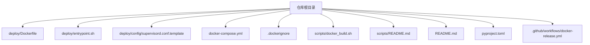
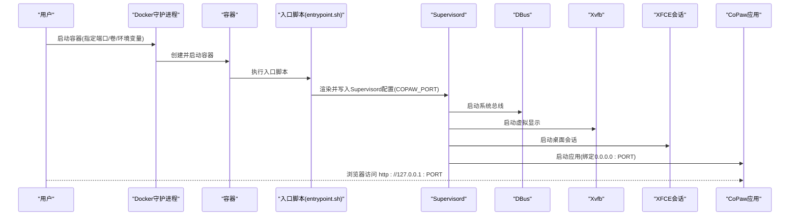
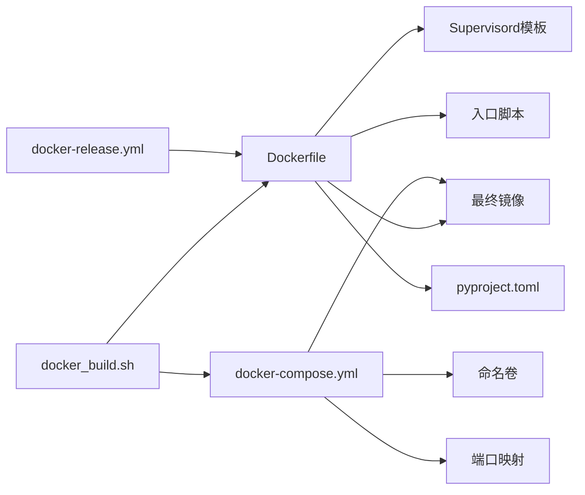

# Docker部署

<cite>
**本文引用的文件**
- [Dockerfile](file://deploy/Dockerfile)
- [docker-compose.yml](file://docker-compose.yml)
- [.dockerignore](file://.dockerignore)
- [entrypoint.sh](file://deploy/entrypoint.sh)
- [supervisord.conf.template](file://deploy/config/supervisord.conf.template)
- [docker_build.sh](file://scripts/docker_build.sh)
- [README.md](file://README.md)
- [pyproject.toml](file://pyproject.toml)
- [scripts/README.md](file://scripts/README.md)
- [utils.py](file://src/copaw/config/utils.py)
- [docker-release.yml](file://.github/workflows/docker-release.yml)
</cite>

## 目录
1. [简介](#简介)
2. [项目结构](#项目结构)
3. [核心组件](#核心组件)
4. [架构总览](#架构总览)
5. [详细组件分析](#详细组件分析)
6. [依赖关系分析](#依赖关系分析)
7. [性能考量](#性能考量)
8. [故障排除指南](#故障排除指南)
9. [结论](#结论)
10. [附录](#附录)

## 简介
本文件面向在Docker环境中部署CoPaw的用户与运维人员，系统性说明Docker镜像构建流程、docker-compose编排与容器运行参数、环境变量与网络配置、数据持久化策略，并给出最佳实践、性能优化建议、资源限制与安全加固思路。内容基于仓库内的Dockerfile、入口脚本、Supervisord模板、Compose配置与相关脚本进行整理与提炼，帮助读者快速、稳定地完成生产级部署。

## 项目结构
与Docker部署直接相关的目录与文件如下：
- 部署层：deploy/Dockerfile、deploy/entrypoint.sh、deploy/config/supervisord.conf.template
- 编排与持久化：docker-compose.yml、.dockerignore
- 构建脚本：scripts/docker_build.sh、scripts/README.md
- 文档与示例：README.md
- 包与依赖：pyproject.toml
- CI镜像发布：.github/workflows/docker-release.yml

图表来源
- [Dockerfile:1-103](file://deploy/Dockerfile#L1-L103)
- [docker-compose.yml:1-23](file://docker-compose.yml#L1-L23)
- [.dockerignore:1-59](file://.dockerignore#L1-L59)
- [entrypoint.sh:1-10](file://deploy/entrypoint.sh#L1-L10)
- [supervisord.conf.template:1-40](file://deploy/config/supervisord.conf.template#L1-L40)
- [docker_build.sh:1-32](file://scripts/docker_build.sh#L1-L32)
- [README.md:270-312](file://README.md#L270-L312)
- [pyproject.toml:1-99](file://pyproject.toml#L1-L99)
- [docker-release.yml:73-88](file://.github/workflows/docker-release.yml#L73-L88)

章节来源
- [Dockerfile:1-103](file://deploy/Dockerfile#L1-L103)
- [docker-compose.yml:1-23](file://docker-compose.yml#L1-L23)
- [.dockerignore:1-59](file://.dockerignore#L1-L59)
- [entrypoint.sh:1-10](file://deploy/entrypoint.sh#L1-L10)
- [supervisord.conf.template:1-40](file://deploy/config/supervisord.conf.template#L1-L40)
- [docker_build.sh:1-32](file://scripts/docker_build.sh#L1-L32)
- [README.md:270-312](file://README.md#L270-L312)
- [pyproject.toml:1-99](file://pyproject.toml#L1-L99)
- [docker-release.yml:73-88](file://.github/workflows/docker-release.yml#L73-L88)

## 核心组件
- 多阶段Dockerfile：前端构建与应用打包分离，减少最终镜像体积并提升可维护性。
- Supervisord进程管理：统一管理DBus、Xvfb、桌面会话与主应用进程，确保容器内图形与桌面能力可用。
- 入口脚本：动态注入端口到Supervisord配置，实现端口可配置与零停机重启。
- docker-compose编排：定义命名卷、端口映射、重启策略与默认挂载点，便于数据持久化与快速部署。
- 构建脚本：封装镜像构建命令、通道过滤参数与输出提示，便于CI/CD集成与本地复现。

章节来源
- [Dockerfile:1-103](file://deploy/Dockerfile#L1-L103)
- [supervisord.conf.template:1-40](file://deploy/config/supervisord.conf.template#L1-L40)
- [entrypoint.sh:1-10](file://deploy/entrypoint.sh#L1-L10)
- [docker-compose.yml:1-23](file://docker-compose.yml#L1-L23)
- [docker_build.sh:1-32](file://scripts/docker_build.sh#L1-L32)

## 架构总览
下图展示容器启动时序：入口脚本根据环境变量生成Supervisord配置，随后Supervisord拉起DBus、Xvfb、桌面会话以及主应用；浏览器通过Chromium访问Web控制台。

图表来源
- [entrypoint.sh:1-10](file://deploy/entrypoint.sh#L1-L10)
- [supervisord.conf.template:1-40](file://deploy/config/supervisord.conf.template#L1-L40)
- [Dockerfile:94-102](file://deploy/Dockerfile#L94-L102)

## 详细组件分析

### Dockerfile多阶段构建
- 前端构建阶段：使用Node基础镜像构建console前端产物，避免将构建产物提交至仓库。
- 运行时阶段：基于Node Slim镜像，安装Python、pip、venv、构建工具与Chromium等依赖；启用无沙箱模式以适配容器环境；安装Python包并初始化工作目录；暴露应用端口并设置入口命令。

关键要点
- 使用构建参数控制通道白/黑名单，便于按需裁剪镜像功能集。
- 初始化工作目录包含默认配置与心跳文件，确保首次启动即具备可用状态。
- 通过环境变量与构建参数共同决定端口与功能特性，便于二次分发。

章节来源
- [Dockerfile:1-103](file://deploy/Dockerfile#L1-L103)
- [pyproject.toml:64-91](file://pyproject.toml#L64-L91)

### Supervisord进程管理
- 系统总线：启动DBus，保证桌面与系统服务通信。
- 虚拟显示：启动Xvfb，提供无头图形环境。
- 桌面会话：启动XFCE会话，承载浏览器与桌面交互。
- 应用进程：启动CoPaw应用，监听0.0.0.0与可配置端口。

配置细节
- 日志输出：各程序标准输出/错误日志分别落盘，便于排查。
- 环境变量：注入显示设备、Chromium路径与容器标识，确保Playwright与Chromium在容器内正常工作。

章节来源
- [supervisord.conf.template:1-40](file://deploy/config/supervisord.conf.template#L1-L40)

### 入口脚本与端口注入
- 功能：从模板渲染Supervisord配置，注入COPAW_PORT后启动Supervisord。
- 默认端口：8088，可通过环境变量覆盖。
- 可靠性：使用envsubst进行变量替换，避免硬编码。

章节来源
- [entrypoint.sh:1-10](file://deploy/entrypoint.sh#L1-L10)

### docker-compose编排与数据持久化
- 服务定义：镜像、容器名、重启策略、端口映射与卷挂载。
- 卷：copaw-data与copaw-secrets两个命名卷，分别对应工作目录与密钥目录，实现数据持久化。
- 网络：默认桥接网络，支持主机直连与host网络两种方式（详见README）。

章节来源
- [docker-compose.yml:1-23](file://docker-compose.yml#L1-L23)

### 构建脚本与CI镜像发布
- 本地构建：封装镜像标签、构建参数与输出提示，支持通道白/黑名单定制。
- CI发布：使用buildx多架构构建，推送至多个镜像仓库，支持latest与pre标签。

章节来源
- [docker_build.sh:1-32](file://scripts/docker_build.sh#L1-L32)
- [docker-release.yml:73-88](file://.github/workflows/docker-release.yml#L73-L88)

### 容器内运行时检测与容器识别
- 应用侧通过环境变量与cgroup检测判断是否运行于容器或K8s环境，用于行为调整（如Chromium沙箱策略）。

章节来源
- [utils.py:364-376](file://src/copaw/config/utils.py#L364-L376)

## 依赖关系分析
- Dockerfile依赖：前端构建产物、Python包清单、Supervisord模板与入口脚本。
- Compose依赖：命名卷、端口映射与镜像标签。
- 构建脚本依赖：Dockerfile路径、镜像标签与构建参数。
- CI依赖：构建参数、平台列表与镜像仓库地址。

图表来源
- [Dockerfile:1-103](file://deploy/Dockerfile#L1-L103)
- [docker-compose.yml:1-23](file://docker-compose.yml#L1-L23)
- [docker_build.sh:1-32](file://scripts/docker_build.sh#L1-L32)
- [pyproject.toml:1-99](file://pyproject.toml#L1-L99)
- [docker-release.yml:73-88](file://.github/workflows/docker-release.yml#L73-L88)

章节来源
- [Dockerfile:1-103](file://deploy/Dockerfile#L1-L103)
- [docker-compose.yml:1-23](file://docker-compose.yml#L1-L23)
- [docker_build.sh:1-32](file://scripts/docker_build.sh#L1-L32)
- [pyproject.toml:1-99](file://pyproject.toml#L1-L99)
- [docker-release.yml:73-88](file://.github/workflows/docker-release.yml#L73-L88)

## 性能考量
- 前端构建分离：多阶段构建仅在最终镜像保留必要产物，降低镜像体积与拉取时间。
- 无头图形栈：通过Xvfb与Chromium无沙箱模式满足浏览器自动化需求，同时避免复杂X11转发。
- 进程管理：Supervisord统一管理多个子进程，减少启动开销与资源碎片。
- 端口与网络：默认仅监听本地回环，结合host网络或显式端口映射按需开放，避免不必要的端口暴露。
- 依赖裁剪：通过构建参数控制通道白/黑名单，减少不必要依赖与二进制体积。

[本节为通用性能建议，无需特定文件引用]

## 故障排除指南
常见问题与定位思路
- 控制台无法访问
  - 检查端口映射与防火墙；确认COPAW_PORT是否正确注入；查看Supervisord日志。
- 浏览器自动化异常
  - 确认Chromium路径与无沙箱模式；检查Xvfb是否正常启动；验证显示设备环境变量。
- 数据未持久化
  - 确认命名卷已创建且挂载路径正确；检查工作目录与密钥目录权限。
- 连接宿主机模型服务失败
  - 使用host.docker.internal或host网络；在应用中将模型Base URL指向宿主机地址。
- 容器内识别异常
  - 应用侧通过环境变量与cgroup检测容器环境，若行为异常，检查相关标志位。

章节来源
- [entrypoint.sh:1-10](file://deploy/entrypoint.sh#L1-L10)
- [supervisord.conf.template:1-40](file://deploy/config/supervisord.conf.template#L1-L40)
- [README.md:287-310](file://README.md#L287-L310)
- [utils.py:364-376](file://src/copaw/config/utils.py#L364-L376)

## 结论
通过多阶段构建、Supervisord统一进程管理与docker-compose标准化编排，CoPaw在Docker环境实现了“即拉即用”的部署体验。配合命名卷与端口可配置策略，既满足开发调试也适合生产运行。建议在生产中结合CI多架构构建、最小化依赖与安全加固策略，进一步提升稳定性与安全性。

[本节为总结性内容，无需特定文件引用]

## 附录

### 端口与网络配置
- 默认端口：8088（可通过COPAW_PORT覆盖）
- 端口映射：默认仅映射到127.0.0.1，避免外网直接访问
- 网络模式：支持host网络与默认桥接网络两种方式

章节来源
- [Dockerfile:94-95](file://deploy/Dockerfile#L94-L95)
- [docker-compose.yml:14-15](file://docker-compose.yml#L14-L15)
- [README.md:287-308](file://README.md#L287-L308)

### 数据持久化策略
- 工作目录：copaw-data（包含配置、记忆与技能）
- 密钥目录：copaw-secrets（包含敏感配置与API密钥）
- 卷挂载：compose文件中已预置挂载点，确保重启后数据不丢失

章节来源
- [docker-compose.yml:20-22](file://docker-compose.yml#L20-L22)
- [README.md:285-286](file://README.md#L285-L286)

### 环境变量与构建参数
- COPAW_PORT：应用监听端口，默认8088
- COPAW_DISABLED_CHANNELS / COPAW_ENABLED_CHANNELS：通道白/黑名单（构建期生效）
- COPAW_AUTH_ENABLED / COPAW_AUTH_USERNAME / COPAW_AUTH_PASSWORD：可选认证开关与凭据（运行期生效）

章节来源
- [Dockerfile:20-25](file://deploy/Dockerfile#L20-L25)
- [Dockerfile:94-95](file://deploy/Dockerfile#L94-L95)
- [supervisord.conf.template:14-21](file://deploy/config/supervisord.conf.template#L14-L21)
- [README.md:285-286](file://README.md#L285-L286)

### 镜像构建与发布
- 本地构建：使用scripts/docker_build.sh，支持自定义标签与构建参数
- CI发布：使用buildx多架构构建，推送至多个镜像仓库，支持latest与pre标签

章节来源
- [docker_build.sh:1-32](file://scripts/docker_build.sh#L1-L32)
- [docker-release.yml:73-88](file://.github/workflows/docker-release.yml#L73-L88)
- [scripts/README.md:21-28](file://scripts/README.md#L21-L28)

### 最佳实践与安全加固
- 最小化镜像：仅保留运行所需组件，避免安装开发工具链
- 依赖裁剪：通过构建参数剔除不需要的通道与功能模块
- 权限最小化：以非root用户运行（如可行），并限制文件权限
- 网络隔离：默认仅映射必要端口，避免暴露内部服务
- 日志审计：集中收集Supervisord日志，定期轮转与归档
- 健康检查：可在Compose中增加健康检查探针，监控应用存活与端口可用性

[本节为通用最佳实践建议，无需特定文件引用]