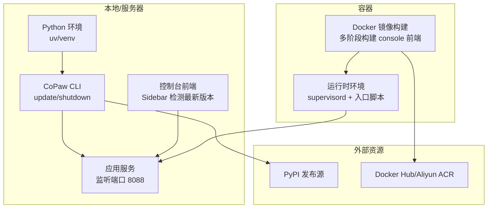
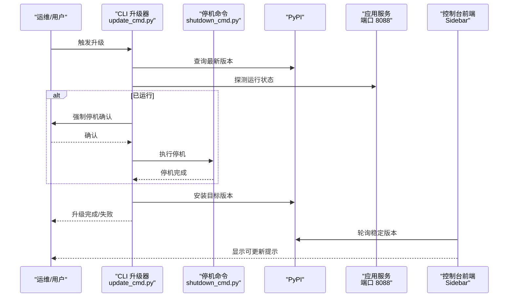
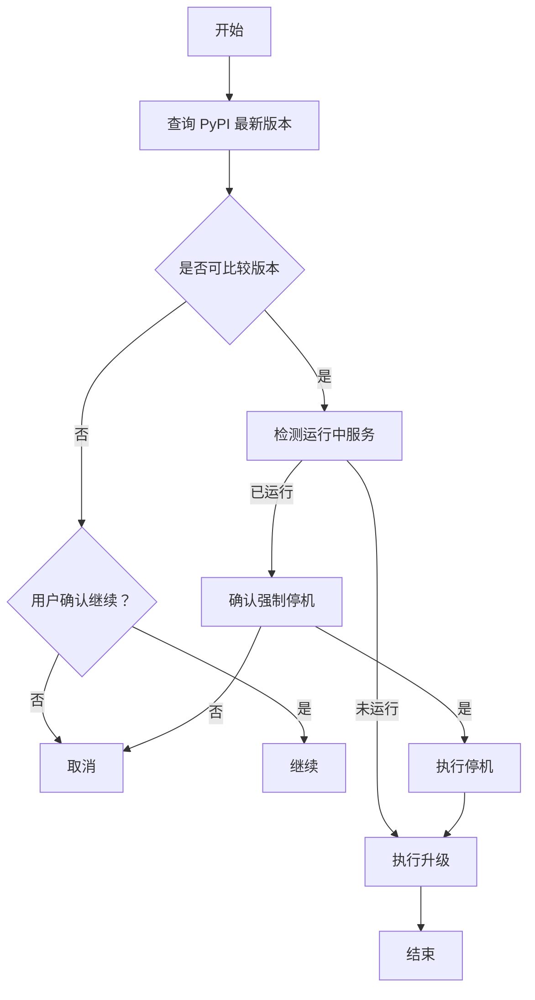
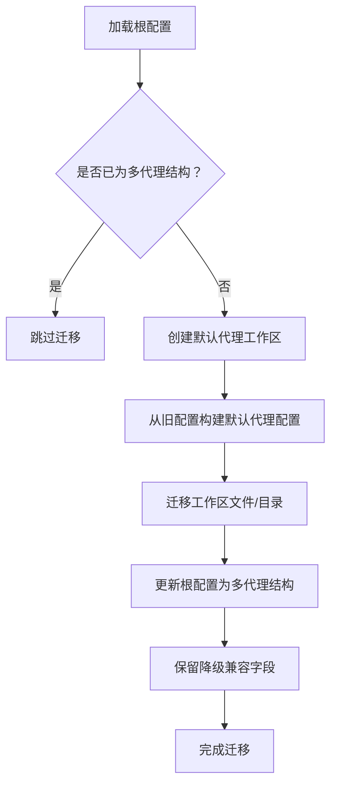
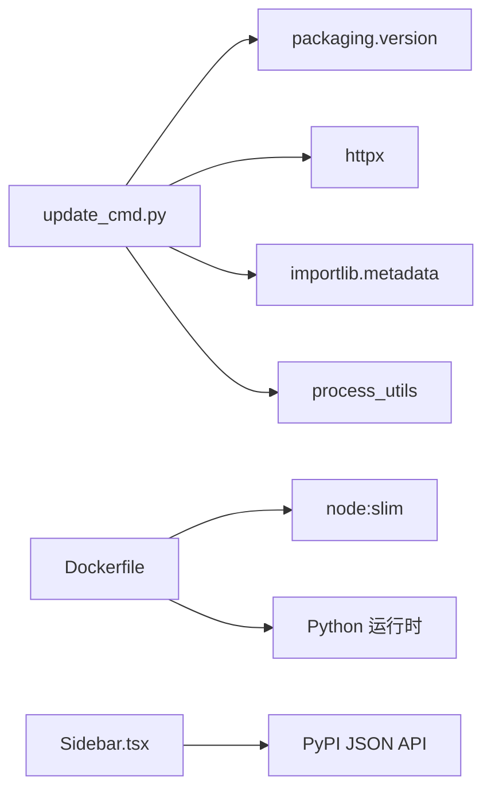

# 升级与维护

<cite>
**本文引用的文件**
- [src/copaw/__version__.py](file://src/copaw/__version__.py)
- [src/copaw/cli/update_cmd.py](file://src/copaw/cli/update_cmd.py)
- [src/copaw/cli/shutdown_cmd.py](file://src/copaw/cli/shutdown_cmd.py)
- [src/copaw/app/migration.py](file://src/copaw/app/migration.py)
- [src/copaw/config/config.py](file://src/copaw/config/config.py)
- [scripts/install.sh](file://scripts/install.sh)
- [scripts/install.ps1](file://scripts/install.ps1)
- [scripts/docker_build.sh](file://scripts/docker_build.sh)
- [scripts/docker_sync_latest.sh](file://scripts/docker_sync_latest.sh)
- [deploy/Dockerfile](file://deploy/Dockerfile)
- [console/src/layouts/Sidebar.tsx](file://console/src/layouts/Sidebar.tsx)
- [tests/unit/cli/test_cli_update.py](file://tests/unit/cli/test_cli_update.py)
</cite>

## 目录
1. [简介](#简介)
2. [项目结构](#项目结构)
3. [核心组件](#核心组件)
4. [架构总览](#架构总览)
5. [详细组件分析](#详细组件分析)
6. [依赖分析](#依赖分析)
7. [性能考虑](#性能考虑)
8. [故障排查指南](#故障排查指南)
9. [结论](#结论)
10. [附录](#附录)

## 简介
本文件面向运维与开发团队，系统化梳理 CoPaw 的升级与维护流程，覆盖版本升级策略、兼容性检查、回滚机制、在线/离线/手动升级操作步骤，以及依赖更新、配置迁移、数据结构变更处理。同时提供维护窗口规划、停机时间估算、用户通知机制、升级前后验证与问题修复建议，并给出批量升级、灰度发布与 A/B 测试策略，以及维护任务自动化、定期检查与预防性维护建议。

## 项目结构
CoPaw 采用“Python 后端 + 前端控制台 + 容器镜像”的整体布局。后端通过 CLI 提供安装、升级、停机等能力；前端控制台提供版本检测与更新提示；容器镜像用于标准化部署与分发。

图示来源
- [deploy/Dockerfile:1-103](file://deploy/Dockerfile#L1-L103)
- [scripts/docker_build.sh:1-32](file://scripts/docker_build.sh#L1-L32)
- [scripts/install.sh:1-340](file://scripts/install.sh#L1-L340)
- [scripts/install.ps1:1-477](file://scripts/install.ps1#L1-L477)
- [console/src/layouts/Sidebar.tsx:119-187](file://console/src/layouts/Sidebar.tsx#L119-L187)

章节来源
- [deploy/Dockerfile:1-103](file://deploy/Dockerfile#L1-L103)
- [scripts/docker_build.sh:1-32](file://scripts/docker_build.sh#L1-L32)
- [scripts/install.sh:1-340](file://scripts/install.sh#L1-L340)
- [scripts/install.ps1:1-477](file://scripts/install.ps1#L1-L477)
- [console/src/layouts/Sidebar.tsx:119-187](file://console/src/layouts/Sidebar.tsx#L119-L187)

## 核心组件
- 版本标识与来源
  - 当前版本由包内版本文件提供，用于 CLI 升级比较与显示。
  - 参考：[src/copaw/__version__.py:1-3](file://src/copaw/__version__.py#L1-L3)
- 在线升级 CLI
  - 通过 PyPI 获取最新版本，检测当前安装来源与运行中的服务，支持强制停机后升级或后台升级。
  - 参考：[src/copaw/cli/update_cmd.py:1-730](file://src/copaw/cli/update_cmd.py#L1-L730)
- 停机命令
  - 基于端口扫描定位后端进程，递归终止相关进程树，确保升级前清理干净。
  - 参考：[src/copaw/cli/shutdown_cmd.py:1-383](file://src/copaw/cli/shutdown_cmd.py#L1-L383)
- 配置迁移
  - 将旧版单代理工作区迁移到新版多代理结构，保留降级兼容字段。
  - 参考：[src/copaw/app/migration.py:1-312](file://src/copaw/app/migration.py#L1-L312)
- 配置模型
  - 定义通道、心跳、活跃时段等配置模型，支撑升级后的配置兼容与校验。
  - 参考：[src/copaw/config/config.py:1-200](file://src/copaw/config/config.py#L1-L200)
- 安装器
  - 自动选择 uv/Python 环境，按平台生成包装脚本，支持从源码或 PyPI 安装。
  - 参考：[scripts/install.sh:1-340](file://scripts/install.sh#L1-L340)、[scripts/install.ps1:1-477](file://scripts/install.ps1#L1-L477)
- 容器化
  - 多阶段构建前端静态资源，运行时注入 console 资源，统一环境变量与入口。
  - 参考：[deploy/Dockerfile:1-103](file://deploy/Dockerfile#L1-L103)、[scripts/docker_build.sh:1-32](file://scripts/docker_build.sh#L1-L32)
- 前端版本检测
  - 控制台侧轮询 PyPI 获取稳定版本列表，延迟通知新版本，避免镜像未就绪导致误报。
  - 参考：[console/src/layouts/Sidebar.tsx:119-187](file://console/src/layouts/Sidebar.tsx#L119-L187)

章节来源
- [src/copaw/__version__.py:1-3](file://src/copaw/__version__.py#L1-L3)
- [src/copaw/cli/update_cmd.py:1-730](file://src/copaw/cli/update_cmd.py#L1-L730)
- [src/copaw/cli/shutdown_cmd.py:1-383](file://src/copaw/cli/shutdown_cmd.py#L1-L383)
- [src/copaw/app/migration.py:1-312](file://src/copaw/app/migration.py#L1-L312)
- [src/copaw/config/config.py:1-200](file://src/copaw/config/config.py#L1-L200)
- [scripts/install.sh:1-340](file://scripts/install.sh#L1-L340)
- [scripts/install.ps1:1-477](file://scripts/install.ps1#L1-L477)
- [deploy/Dockerfile:1-103](file://deploy/Dockerfile#L1-L103)
- [scripts/docker_build.sh:1-32](file://scripts/docker_build.sh#L1-L32)
- [console/src/layouts/Sidebar.tsx:119-187](file://console/src/layouts/Sidebar.tsx#L119-L187)

## 架构总览
下图展示升级与维护的关键交互：CLI 升级器探测运行状态、决定是否停机、执行升级；容器镜像负责标准化部署；前端控制台负责版本提示与用户体验。

图示来源
- [src/copaw/cli/update_cmd.py:631-730](file://src/copaw/cli/update_cmd.py#L631-L730)
- [src/copaw/cli/shutdown_cmd.py:303-383](file://src/copaw/cli/shutdown_cmd.py#L303-L383)
- [console/src/layouts/Sidebar.tsx:119-187](file://console/src/layouts/Sidebar.tsx#L119-L187)

章节来源
- [src/copaw/cli/update_cmd.py:631-730](file://src/copaw/cli/update_cmd.py#L631-L730)
- [src/copaw/cli/shutdown_cmd.py:303-383](file://src/copaw/cli/shutdown_cmd.py#L303-L383)
- [console/src/layouts/Sidebar.tsx:119-187](file://console/src/layouts/Sidebar.tsx#L119-L187)

## 详细组件分析

### 在线升级（PyPI）
- 策略
  - 通过 PyPI JSON API 获取最新版本，解析版本号并进行比较，支持预发布版本。
  - 若检测到运行中的服务，根据用户确认决定是否强制停机后再升级。
  - 支持在 Windows 上后台升级以避免可执行锁。
- 关键流程
  - 版本探测与比较：[src/copaw/cli/update_cmd.py:93-117](file://src/copaw/cli/update_cmd.py#L93-L117)、[src/copaw/cli/update_cmd.py:79-91](file://src/copaw/cli/update_cmd.py#L79-L91)
  - 运行中服务检测与停机：[src/copaw/cli/update_cmd.py:226-266](file://src/copaw/cli/update_cmd.py#L226-L266)、[src/copaw/cli/shutdown_cmd.py:311-383](file://src/copaw/cli/shutdown_cmd.py#L311-L383)
  - 升级执行与输出：[src/copaw/cli/update_cmd.py:540-590](file://src/copaw/cli/update_cmd.py#L540-L590)
- 回滚机制
  - 通过安装历史与包管理器回退至目标版本；如需恢复数据，结合备份与迁移工具。
  - 参考：[src/copaw/cli/update_cmd.py:592-629](file://src/copaw/cli/update_cmd.py#L592-L629)

图示来源
- [src/copaw/cli/update_cmd.py:631-730](file://src/copaw/cli/update_cmd.py#L631-L730)
- [src/copaw/cli/shutdown_cmd.py:311-383](file://src/copaw/cli/shutdown_cmd.py#L311-L383)

章节来源
- [src/copaw/cli/update_cmd.py:631-730](file://src/copaw/cli/update_cmd.py#L631-L730)
- [src/copaw/cli/shutdown_cmd.py:311-383](file://src/copaw/cli/shutdown_cmd.py#L311-L383)

### 离线升级（本地/私有源）
- 策略
  - 使用安装器从本地源码或指定版本安装，适用于受限网络或私有仓库。
  - 安装器自动准备虚拟环境、复制/构建前端资源、生成包装脚本。
- 步骤要点
  - 从源码安装：[scripts/install.sh:216-232](file://scripts/install.sh#L216-L232)、[scripts/install.ps1:285-312](file://scripts/install.ps1#L285-L312)
  - 从 PyPI 指定版本安装：[scripts/install.sh:233-241](file://scripts/install.sh#L233-L241)、[scripts/install.ps1:313-320](file://scripts/install.ps1#L313-L320)
  - 包装脚本与 PATH 注入：[scripts/install.sh:256-277](file://scripts/install.sh#L256-L277)、[scripts/install.ps1:333-373](file://scripts/install.ps1#L333-L373)

章节来源
- [scripts/install.sh:216-241](file://scripts/install.sh#L216-L241)
- [scripts/install.ps1:285-320](file://scripts/install.ps1#L285-L320)
- [scripts/install.sh:256-277](file://scripts/install.sh#L256-L277)
- [scripts/install.ps1:333-373](file://scripts/install.ps1#L333-L373)

### 手动升级（容器镜像）
- 策略
  - 通过多阶段 Dockerfile 构建镜像，注入 console 前端静态资源，统一运行时环境。
  - 使用构建脚本控制镜像标签与渠道过滤参数。
- 步骤要点
  - 构建镜像：[scripts/docker_build.sh:1-32](file://scripts/docker_build.sh#L1-L32)
  - 渠道参数控制：[deploy/Dockerfile:20-25](file://deploy/Dockerfile#L20-L25)
  - 同步 pre->latest 标签：[scripts/docker_sync_latest.sh:1-77](file://scripts/docker_sync_latest.sh#L1-L77)

章节来源
- [scripts/docker_build.sh:1-32](file://scripts/docker_build.sh#L1-L32)
- [deploy/Dockerfile:20-25](file://deploy/Dockerfile#L20-L25)
- [scripts/docker_sync_latest.sh:1-77](file://scripts/docker_sync_latest.sh#L1-L77)

### 依赖更新与兼容性检查
- 依赖来源
  - 安装器自动选择 uv 并创建隔离虚拟环境，支持 extras（如 llamacpp、mlx）。
  - 参考：[scripts/install.sh:104-147](file://scripts/install.sh#L104-L147)、[scripts/install.ps1:121-209](file://scripts/install.ps1#L121-L209)
- 兼容性检查
  - 升级前比较版本，对不可比较版本提供用户确认；对非 PyPI 来源安装给出覆盖警告。
  - 参考：[src/copaw/cli/update_cmd.py:654-668](file://src/copaw/cli/update_cmd.py#L654-L668)、[src/copaw/cli/update_cmd.py:605-628](file://src/copaw/cli/update_cmd.py#L605-L628)
- 配置兼容
  - 心跳与活跃时段等配置模型定义清晰，升级后仍可读取与兼容。
  - 参考：[src/copaw/config/config.py:199-200](file://src/copaw/config/config.py#L199-L200)

章节来源
- [scripts/install.sh:104-147](file://scripts/install.sh#L104-L147)
- [scripts/install.ps1:121-209](file://scripts/install.ps1#L121-L209)
- [src/copaw/cli/update_cmd.py:654-668](file://src/copaw/cli/update_cmd.py#L654-L668)
- [src/copaw/cli/update_cmd.py:605-628](file://src/copaw/cli/update_cmd.py#L605-L628)
- [src/copaw/config/config.py:199-200](file://src/copaw/config/config.py#L199-L200)

### 配置迁移与数据结构变更
- 单代理到多代理迁移
  - 将旧工作区内容迁移到默认代理工作区，生成 agent.json，并更新根配置以保留降级兼容字段。
  - 参考：[src/copaw/app/migration.py:45-189](file://src/copaw/app/migration.py#L45-L189)
- 启动时保障
  - 确保默认代理存在、必要文件（如 chats.json、jobs.json）存在，避免启动失败。
  - 参考：[src/copaw/app/migration.py:247-312](file://src/copaw/app/migration.py#L247-L312)

图示来源
- [src/copaw/app/migration.py:45-189](file://src/copaw/app/migration.py#L45-L189)

章节来源
- [src/copaw/app/migration.py:45-189](file://src/copaw/app/migration.py#L45-L189)
- [src/copaw/app/migration.py:247-312](file://src/copaw/app/migration.py#L247-L312)

### 维护窗口规划、停机时间估算与用户通知
- 维护窗口
  - 选择业务低峰时段，预留升级与验证时间；对容器部署可配合滚动更新策略。
- 停机时间估算
  - 升级停机：进程终止与等待时间；安装耗时取决于网络与包大小；重启服务时间。
- 用户通知
  - 控制台侧延迟通知新版本，避免镜像未就绪导致误报；升级完成后提示重启服务。
  - 参考：[console/src/layouts/Sidebar.tsx:164-176](file://console/src/layouts/Sidebar.tsx#L164-L176)、[src/copaw/cli/update_cmd.py:576-587](file://src/copaw/cli/update_cmd.py#L576-L587)

章节来源
- [console/src/layouts/Sidebar.tsx:164-176](file://console/src/layouts/Sidebar.tsx#L164-L176)
- [src/copaw/cli/update_cmd.py:576-587](file://src/copaw/cli/update_cmd.py#L576-L587)

### 升级前检查、数据备份与风险评估
- 环境检查
  - 确认 uv/Python 可用、虚拟环境隔离、网络可达性（PyPI/镜像源）。
  - 参考：[scripts/install.sh:104-134](file://scripts/install.sh#L104-L134)、[scripts/install.ps1:121-193](file://scripts/install.ps1#L121-L193)
- 数据备份
  - 备份工作区目录（sessions/memory 等）、配置文件与数据库文件；容器场景注意卷挂载。
  - 参考：[src/copaw/app/migration.py:23-42](file://src/copaw/app/migration.py#L23-L42)
- 风险评估
  - 不可比较版本、非 PyPI 来源覆盖、运行中服务强制停机带来的中断风险；通过确认与回滚策略降低影响。

章节来源
- [scripts/install.sh:104-134](file://scripts/install.sh#L104-L134)
- [scripts/install.ps1:121-193](file://scripts/install.ps1#L121-L193)
- [src/copaw/app/migration.py:23-42](file://src/copaw/app/migration.py#L23-L42)
- [src/copaw/cli/update_cmd.py:605-668](file://src/copaw/cli/update_cmd.py#L605-L668)

### 升级后验证、性能测试与问题修复
- 功能验证
  - 检查 API 版本接口返回、控制台连接、各通道与技能模块可用性。
  - 参考：[console/src/layouts/Sidebar.tsx:127-130](file://console/src/layouts/Sidebar.tsx#L127-L130)
- 性能测试
  - 对关键路径（模型调用、技能执行、通道消息处理）进行基准测试与回归测试。
- 问题修复
  - 记录升级日志与错误码，必要时回滚至上一版本；结合迁移工具修复配置不一致。

章节来源
- [console/src/layouts/Sidebar.tsx:127-130](file://console/src/layouts/Sidebar.tsx#L127-L130)

### 批量升级、灰度发布与 A/B 测试
- 批量升级
  - 使用容器编排或配置管理工具批量拉起新镜像，逐步替换旧实例。
- 灰度发布
  - 以命名空间/服务发现为粒度，先对小部分流量导入新版本，观察指标与告警。
- A/B 测试
  - 通过路由规则将不同用户或群组分流至不同版本，收集行为与性能数据。

[本节为通用实践建议，无需特定文件引用]

### 维护任务自动化、定期检查与预防性维护
- 自动化
  - 定时任务扫描 PyPI 最新版本，触发升级流程；容器镜像构建后自动同步标签。
  - 参考：[scripts/docker_sync_latest.sh:60-76](file://scripts/docker_sync_latest.sh#L60-L76)
- 定期检查
  - 检查通道连通性、模型可用性、磁盘与内存占用；对异常实例进行隔离与重试。
- 预防性维护
  - 定期清理临时文件与缓存、更新依赖、演练回滚流程。

章节来源
- [scripts/docker_sync_latest.sh:60-76](file://scripts/docker_sync_latest.sh#L60-L76)

## 依赖分析
- CLI 升级器依赖
  - 版本比较：packaging.version
  - HTTP 请求：httpx
  - 包元数据：importlib.metadata
  - 进程探测与终止：自定义工具与系统命令
- 容器镜像依赖
  - 多阶段构建前端静态资源，运行时安装 Python 包并初始化工作区。
- 前端依赖
  - 控制台侧通过 API 获取 PyPI 版本信息，延迟通知策略避免误报。

图示来源
- [src/copaw/cli/update_cmd.py:17-30](file://src/copaw/cli/update_cmd.py#L17-L30)
- [deploy/Dockerfile:4-89](file://deploy/Dockerfile#L4-L89)
- [console/src/layouts/Sidebar.tsx:133-178](file://console/src/layouts/Sidebar.tsx#L133-L178)

章节来源
- [src/copaw/cli/update_cmd.py:17-30](file://src/copaw/cli/update_cmd.py#L17-L30)
- [deploy/Dockerfile:4-89](file://deploy/Dockerfile#L4-L89)
- [console/src/layouts/Sidebar.tsx:133-178](file://console/src/layouts/Sidebar.tsx#L133-L178)

## 性能考虑
- 升级性能
  - 优先使用 uv 与缓存镜像源，减少下载时间；Windows 后台升级避免阻塞。
- 运行性能
  - 容器内预装 Chromium 与 Playwright 配置，避免运行时下载浏览器；合理设置超时与重试。
- 前端体验
  - 控制台延迟通知策略减少干扰，提升用户感知稳定性。

[本节提供通用指导，无需特定文件引用]

## 故障排查指南
- 升级失败
  - 检查网络与 PyPI 可达性；查看升级器输出与返回码；必要时回滚至上一版本。
  - 参考：[src/copaw/cli/update_cmd.py:563-589](file://src/copaw/cli/update_cmd.py#L563-L589)
- 强制停机失败
  - 检查进程是否存在、权限是否足够；参考停机命令的进程树终止逻辑。
  - 参考：[src/copaw/cli/shutdown_cmd.py:267-288](file://src/copaw/cli/shutdown_cmd.py#L267-L288)
- 版本不可比较
  - 使用确认选项继续；或手动指定版本；关注测试用例对不可比较版本的处理。
  - 参考：[tests/unit/cli/test_cli_update.py:633-659](file://tests/unit/cli/test_cli_update.py#L633-L659)

章节来源
- [src/copaw/cli/update_cmd.py:563-589](file://src/copaw/cli/update_cmd.py#L563-L589)
- [src/copaw/cli/shutdown_cmd.py:267-288](file://src/copaw/cli/shutdown_cmd.py#L267-L288)
- [tests/unit/cli/test_cli_update.py:633-659](file://tests/unit/cli/test_cli_update.py#L633-L659)

## 结论
CoPaw 的升级与维护体系以 CLI 为核心，结合安装器、容器镜像与前端控制台，形成从探测、停机、升级到验证与通知的完整闭环。通过迁移工具与降级兼容策略，可在版本演进中保持稳定性；借助灰度与 A/B 能力，实现更安全的发布节奏。建议在生产环境中配套自动化与演练流程，持续优化升级体验与可靠性。

[本节为总结，无需特定文件引用]

## 附录
- 相关测试
  - 单元测试覆盖升级流程的关键分支，包括运行中服务检测、版本不可比较处理等。
  - 参考：[tests/unit/cli/test_cli_update.py:286-310](file://tests/unit/cli/test_cli_update.py#L286-L310)、[tests/unit/cli/test_cli_update.py:633-659](file://tests/unit/cli/test_cli_update.py#L633-L659)

章节来源
- [tests/unit/cli/test_cli_update.py:286-310](file://tests/unit/cli/test_cli_update.py#L286-L310)
- [tests/unit/cli/test_cli_update.py:633-659](file://tests/unit/cli/test_cli_update.py#L633-L659)